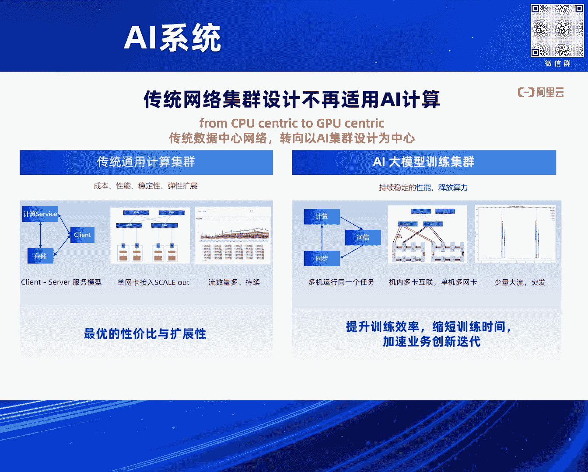
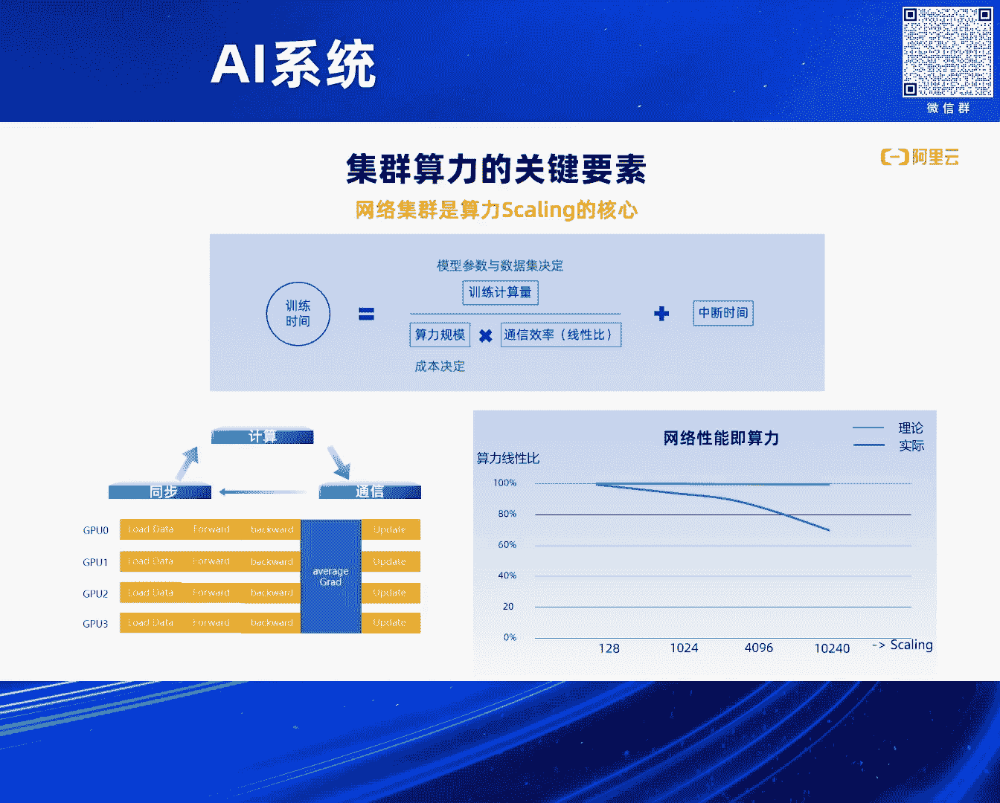

# 2024北京智源大会-AI系统 - P10：网络驱动的大规模AI训练- 阿里云可预期网络HPN7 - 智源社区 - BV1DS411w7EG

好，感谢林老师的介绍，还是感谢大家再稍微的坚持一会儿，我应该可以按时结束，然后大家开始午饭，前面的几位老师其实从编译，从模型框架，然后从软件站系统，以及说从并行的策略上，都做了一些在AI系统方面的。

一些工作的介绍，我介绍的是网络的部分，其实就是把前面几位老师的工作，我们怎么通过网络把它连起来，把它连成一张，刚才林老师也说过，我们要连到一张上万张卡的，一张大集群，让这张大集群去做一个作业。

它去完成一件事情，然后万卡集群，我们在iPin 7。0上，其实从去年9月份已经落地了，然后接下来，在我的分享里面，我也会探讨我们接下来的十万卡，更大规模的一个分享，一开始的时候，袁老师也是非常。

让我很感谢，就是他说阿里机会其实非常好，其实阿里不光是有万卡集群，我们在整个模型的系统，整个AI系统里面的服务的能力，也是非常好的，所以欢迎大家在阿里云上，去做我们的科研，做我们的工程和创业的工作，好。

我今天的内容。

其实希望通过今天的一个介绍，让大家了解到，从网络的视角，从集群的视角，当我们把很多的GPU连到一起的时候，其实它最关键的网络的工作是什么，网络为什么在这个里面非常的重要。

以及说它遇到的核心的挑战和问题是什么，阿里云的iPin 7。0，是怎么去解决这些问题的，希望可以回答大家这些问题，其实我们现在整个数据中心，已经从CPU的分布式的系统。

已经演进到以AI以GPU为中心的这么一个数据中心了，其实这个数据中心的演进的变化，对网络产生了非常大的挑战，不光是网络，整个数据中心的技术设施，从质量，电，电的供应，整个机房的设计。

都是一个颠覆性的变化，其实网络，我这简单回顾一下，网络从，数据中心的网络从第一个十年，也就是说从，大概2000年开始，互联网开始的时候，我们用我们的电脑去上聊天室，去做，去上论坛，那个时候一直到。

一直到我们第二阶段，就是从10年开始左右，我们的语音计算的，这个发展起来，网络的规模，整个数据中心的设计，也是发生了翻天覆地的变化，从一开始的，可能上千台机器的规模。

这种Client Server的这种服务的模式，变成了大数据，然后集群化的，这个存储的系统等等，这样一个语音计算的一个平台，这个平台其实对网络已经，对数据中心网络的挑战已经很多。

我们从TDP演进了RDMA，通过RDMA去，加速网络集群的互联，再到今天，我们其实已经到了，AI这个阶段，刚才几位老师都已经提到，其实AI它是一个，最终我们在训练的阶段，其实它是一个大的系统。

这个大的系统是，它不是像原来Client Server，这样一个模型，它是一个并行的，非常多的，One Card级别的GPU，去完成同一个工作，它真的是真正意义上的一个。

Data Center as a Computer，的这么一个结构，所以这个里面，对我们产生了非常多的一些挑战，我们可以看一下，就是传统数据中心，其实在，AI的大模型的场景下，已经不适用了。

我们原来的设计已经不适用了，这就是为什么我们要去做，One Card HP的7。0，首先，从这个模型上来讲，已经是一个非常大的差别，原来我们都是Client Server的一个，一个服务的模型。

这个服务模型下，它的，我们的GPU的机器，这个机器本身，它就是一张网卡出来的，通过CPU，然后PCIe，外设，然后再到网卡出来，它的互联是非常简单的，然后我们也看到说，因为我们有非常多的，这个云上的云。

我们看到它的流量，其实是持续的流量，它的流的数量是非常多，也就是它的Entropy，其实是非常大的，在这样一个条件下，我们再看一下，AI到今天的这个，One Card集群的时候，它的跟传统的计算。

都有哪些差别，我这列的这三点，其实非常关键，第一个就是说，它其实多机在运行同一个任务，这个里面的长尾的效应，木桶短板的效应，你坏一张卡，坏一个网络节点，它一个网络的连接，如果不通了。

最终你整个任务都停掉了，这跟原来的这个模式，是非常不一样的，第二是说，我们现在的GPU的计算，它卡内其实都是，这种多机的互联，这种互联跟外面的，通过以太网，我们去把它连成，One Card的互联。

这两张网络的互联之间，其实要做一个非常好的协同，你才能把它的效率，能发挥出来，然后最后我们看到说，在AI计算场景下，网络上，它用的连接的数量，其实非常少，如果你看到一张卡，它出来的连接出来的话。

它在100以内，但是你原来一台CPU的，一个CPU出来的连接数量，可能是几十万，甚至百万级别的连接数量，所以它对于网络的，这个Android的影响，会导致我们网络上，在哈希场会出现问题。

这个是我在后面要去，要去介绍的一个点，那网络在整个集群算力里面，它的作用是什么，它体现的关键的价值是什么，这就是我用这张图里面，大概来解释一下，其实网络是集群算力，做Scaling的一个核心，为什么呢。

因为我们现在来关心的是，在从训练上的角度来讲，我们关心的是训练的时间，因为训练时间是大家创业，然后跟竞争对手去拉开差距的，去一次一次迭代的，一个非常关键的因子，那这个时间其实是计算量，除以你的算力。

然后再加上你中间的一个中段时间，那中段时间就不讲了，那算力的规模越大，理论上它所消耗的时间会越短，但是算力的规模增大了之后，网络这我们看到，网络这你两台机器的同步的通应量，和一万台机器同步的通应量。

完全是不一样的，所以网络在中间所等待的时间，让计算所等待的时间，会随着规模的变大而变长，那这个变长的结果，会使得我们总的规模越大之后，它的算力，理论算力的下降会比较明显，这个我们叫它算力的线性笔。

也就是网络上我们做集群网络，我今天讲的内容的核心也都说，我们怎么把这个线性笔，从几百张卡到一千张卡到一万张卡，这个过程中，让算力能保持线性的去增长，这个是我们，一方面是省成本，另一方面我们节约时间。

它是算力的一个发挥，所以说在这个里面，我们我的一种说法就是网络的性能，集群的算力，我们再去看一下，如果说这样一个高性能网络系统的话，我们有哪些关键的部分，第一是说这个集群的架构。

我们要有这样一个集群的架构，去把这个万卡的连起来，它不是简单的连起来，我后面会讲为什么，第二是说，你是需要一个非常高效的协议，去端到端的，就像一个跑车一样，你端到端的在路上去开的时候，你这个车要快。

然后你的调度系统要好，然后第三还有我们的域内监控系统，你不能说你建了一张网络跑不起来，或者说跑两分钟它断了，你也不知道它为什么断了，这个也是我们现在在AI系统里面，非常核心的一些技术。

其实就是做AI性能的profiling，然后做性能的优化，以及说出现问题之后，我怎么去快速的找到它，然后快速的把有问题的点给拿掉，让任务去继续运行，所以说这三个点是整个AI系统的。

高性能网络系统的一些关键的要求，那这些关键的要求，有这四个方面的挑战，第一个是说我们要有适合的，一个集群的网络架构，要去承载万卡和十万卡的这样一个算力，那为什么我们需要一个适合的架构呢。

比如说北京大家在上班的时候，如果所有人都来海淀去上班，你北京路修的再好，你都会用色，这个道理很简单，所以我们把路修宽，把路修好之后，还要把路修的要适合这么大的规模，然后能让这么大的规模的算力。

再放在一起的时候，它能发挥得更好，所以这个集群架构的设计，是它最基础的部分，然后你在网络上的均匀性，是第二个关键点，这个也是我们目前在很多领域里面，去解决这些问题的一个，就是很多方向上在网络上。

在解决的一个关键问题，还有incas的问题，你都会遇到说，它会撞到一起，撞到一起之后，你用什么样的算法，让它去蜕逼，怎么样做到全局的自由，林考贝和DMA，这些是我们在，Rokit RDMA，包括像IB。

其实都是在做，这样高效的一个传输的工作，总共有这四个方面的挑战，阿里云的IP7。0，是怎么在这四个方面上，去针对AI集群，去设计一个万卡，甚至十万卡的更大规模的一个系统呢，好 我来介绍一下，IP7。0。

它我们有几个设计的特点，第一是说它支持的规模可以到，就通过两层的cluster，这样一个fabric的一个结构，可以支持到万卡的规模，具体是16000卡，我们现在已经上线了多个集群，它是基于51。

2T的，以太网交换机器实现的，有几个关键的点在这个里面，第一个是说，它是一个双上连接，双平面的一个设计，这个我刚才，呼应了我刚才讲到的一个点，就是AI系统如果出现link的问题。

如果出现单节点的问题之后，双上连和双平面，可以让它无感知的继续去运行，然后我就在日常的运用过程中，把它给换掉就可以了，第二个点，我的千卡的segment，这个千卡segment的意思说。

我通过多轨的互联，做到1000卡的范围内呢，它不会有任何的网络用色，这1000卡它所发挥出来的千卡的，这个网络的带宽的性能，是它的理论的极限，所以说我们这个千卡的这个性能的结果，我在后面也会有介绍。

两层万卡，两层做了万卡之后，对整个万卡的系统也是非常关键，因为两层的网络交换，它的网络的跳数就只有两跳，如果是三层网络的交换的话，它跳数是五跳，这个大家都能理解，那五跳和两跳相比。

两跳它在网络路径的简化上，在网络的实验的简化上，都有非常大的优势，那我们通过这样的方式，去做到单个集群可以覆盖，16000卡，那将来可以覆盖更多的，这个10万卡级别的设计，其实我们已经有了。

然后内部也已经做了理论上的一些论证和仿真，然后可能在明年会有这个10万卡的集群会有部署，当然基于这个呢，我们还有我们自研的，RockV2的RDMA，自研的LPC流控里面去解决一些细节问题。

因为时间的原因，我可能没关就是没办法去介绍这么细节，我们会在那个大概在下个月的时候，我们的公开的论文就会发表，到时候大家可以从论文里面去看到，我们实现里面的一些细节，那从HP7。0的整个设计上来讲呢。

刚才几位老师也讲到了，我们在并行的这个策略上，其实并行模型的计算怎么去做并行，网络怎么去做并行，最终还是要映射到网络的连接上，网络的拓扑上，这个拓扑和并行策略的关联，针对并行策略的网络架构的设计。

其实是非常关键的，那这个我就不展开了，那通过HP7。0的在这些方面的优化的一些工作，这些一些针对性的设计呢，我们能做到通信模型，就集合通信的这个性能提升再一倍，这个是我们单纯去跑集合通信的时候。

跟之前的通用的基准架构相比，那整个模型的端端性能提升在10%，那这10%我们是一个，是在Deep Speed框架下去跑拉马13B的模型得到的一个结果，所以它的从我刚才讲到的。

其实从这个千卡segment，以及说万卡的两层close这个结构下，简化的网络针对性的设计，以及400G的RDMA，我们其实单机是3。2T，单机3。2T的RDMA，以及我们自研的通信库。

和自研流空算法这些东西结合到一起，我们能做到它的极致的网络性能，然后整个就是阿里的HP7。0其实是针对，是针对这个AI系统，我们做了全系统的自研，我刚才讲到了其实硬件，然后从架构拓扑，从通信库。

从RDMA等等这些角度，从网络通信的角度，我们做了我们自己的设计和自己的优化，除此之外就是构建这么一个系统，还有两个比较关键的因素，我们要去做网络设备的自研，因为只有自研之后，你才能把里面芯片里面。

然后通信信号上的一些问题，才能掌握在自己手里，然后整个架构里面，你能做到的调优的结果才是最优的，整个系统里面就是我们做的，模块化的硬件的设计标准，以及说整个自研的128个端口的。

400G的这样一个网络的设备，这样一个硬件的一个网络设备，都是我们自研的，包括在光模块上，我们也基于阿里的专利去做到了，400G的光模块QRP112，这个是我们在光模块上的一个标准。

其实整个硬件和光互联的系统，在整个iPin 7。0，下面也发挥了非常重要的一个作用，也就是说它的稳定性，它的互联信号的质量，然后它的对于性能上，我们能掌控的一些细节，都通过自研的方式。

全自研的系统去做到了，把系统的能力发挥到最极致，好 我在后面再花点时间去，展望一下我们整个AI技术设施的一个未来，就我们阿里内部，其实从各个系统上也在探讨，我们下一代的AI的infra。

不管是明年还是三年之后的，这个AI infra它应该是什么，目前我们能看得到的是说，从CPU-centric到GPU-centric这个过程中，一定会发生从电力到机房设计，和到网络互联系统。

以及到GPU内部的互联系统，整个全系统的一个AI技术设施和AI系统，硬件层面的一个变化，首先就是我们现在的，单个机柜上可能是20千瓦的机柜，我们也是分了个机柜，然后有CPU的服务器，可能放个20台左右。

这样一个机房其实已经不再适应了，因为我们接下来，通过GPU卡本身它自己的功耗很大，然后我们希望把它集中的放到，一个短距离的范围内去，让它的数据交换的能力更强之后，它的算力。

基于它单机的系统的算力才能发挥更好，所以说我们一定会设计一个，叫AI Rack，NV在它的GDC上，其实已经发布了NVL72，其实很多系统，包括我们国内的系统也在做，64卡的系统，这样一个系统。

在这样一个Rack里面，对Rack的质量，对Rack的功耗的挑战，都是非常大的，其中跟网络相关的有一个非常关键点，就是说Scale-up的这张网络，已经发生了，跟今天已经发生了很大不一样，我刚才也讲了。

就是说AI系统为什么跟，传统的计算系统不一样，因为AI系统它当前我们拿到的，这8张卡它内部还有一个超大带宽的互联，内部是3。2T的互联，但是一张卡出来，它可能是400G 200G的互联。

这样有一个9位以上的带宽的差距，我们怎么去把内部，这样一个Scale-up的网络，跟外部去结合好，然后Scale-up的网络，它也会越涨越大，像NV它已经做到了72张卡的互联，其实我们国内的GPU厂家。

未来也会往这个方向上去走，所以在这个里面，我们带来的网络上带来的挑战就是，怎么样把Scale-up和Scale-out的网络，融合起来，像HP7。0一样，我们把不同的模型切割。

和训练过程中的流量pattern的，信息做结合与网络的设计，与网络的RDMA与网络的流控设计放到一起，这个其实是一个非常，网络在未来非常关键的一个命题，Scale-up网络，我这可能稍微解释一下。

什么是Scale-up，在我看来，对Scale-up的定义就是说，它能做系统内部的一个cash coherency，然后可以做到极致的大贷款，因为它距离短，它的成本，距离短可以使得它的成本可以做低。

在这个框架下，它可以把贷款可以做的足够大，这样一个Scale-up的系统和Scale-out，相结合，Scale-out是什么，就是我们由1000张卡变成10000张卡，我们通过以太网或者通过IP。

把它互连起来，连到更大规模，那就是这样一个结合的设计，是未来的一个命题，然后我们内部也在，针对更大的Scale-up，到64到72之后，跟Scale-out怎么去结合，去做我们下一代的网络架构的设计。

然后再到我们面向更加灵活的，模型的流量，刚才很多老师都已经讲过了，我们可能会面临MoE，跟我们今天的AllReduce和ReduceGether，这些操作可能会不一样，会有Auto-out等等。

会有其他模型的流量的，Pattern可能也会出来，包括多机的推理，多机的推理刚才提到了KVCache，KVCache在多机的场景下，也是需要网络去提供很大的贷款，但是这个贷款要大到什么程度。

它的需要网络在RDMA在流控上，需要有什么样的新的能力，这都是在未来可能发生的，这也不是很短的未来，也不会是很长的一个未来，可能在明年这件事情就会发生，所以在未来这几件事情，会是我们在AI系统设计里面。

要去重点去考虑的，然后看到的未来的网络上，我们能需要的算力级别，我们需要的需求就是10万级别，10万甚至更大，的这样一个算力的集群规模，包括100T的交换网络的系统，以及新的硬件等等。

这些是网络上我们要去做的工作，10万级别的设计，我刚才已经讲了，其实我们内部已经有仿真和模拟的结果，我们一些详细设计也已经有了，但是因为现在还没有这么大的电，还没有这么大的一个数据中心。

所以说10万的这样一个单机群，我们还没有部署起来，但是相信在不久的将来，我们就会遇到这个，然后在网络上我们也看到其实业界，网络业界对于将来AI基础设施，也成立了两个关键的联盟组织，UEC。

Ultra Ethernet Consultant，以及说UA-Link，Ultra Accelerator的这样一个两个组织，分别在Scale Up和Scale Out。

这两个方向上希望通过全球的生态的力量，把网络上这两个方向的大的命题，做到更好的大家的标准的统一，做到能力的统一，以及最好的这些想法和网络技术，在这两个方向上去做发挥，所以阿里也是在UEC里面。

我们现在是Tech的Member，也就是说在UEC的决策委员会里面，是国内的唯一家公司参与在里面的，跟北美的微软，然后Meta，还有Broadcom等公司，去在这个组织里面。

去把网络上将来要去面临的问题，AI场景下要去面临的系统性的问题，去做解决，去做为将来的更大规模的，Spank更大规模的AI技术设施系统，去做更好的网络能力，好 我的内容就这些。

好 谢谢大家，(掌声)，好 谢谢 谢谢永青。