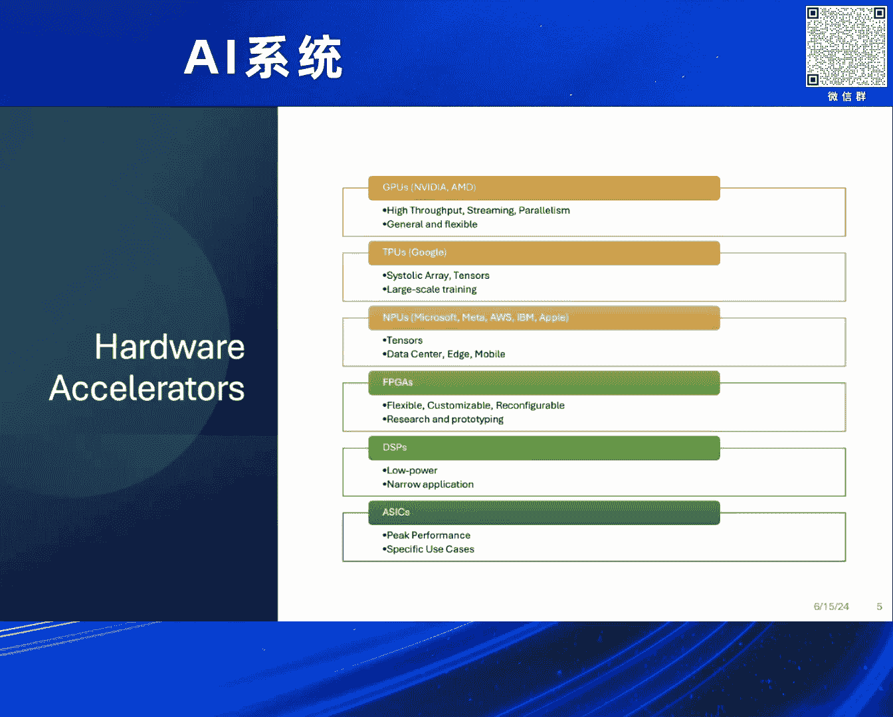
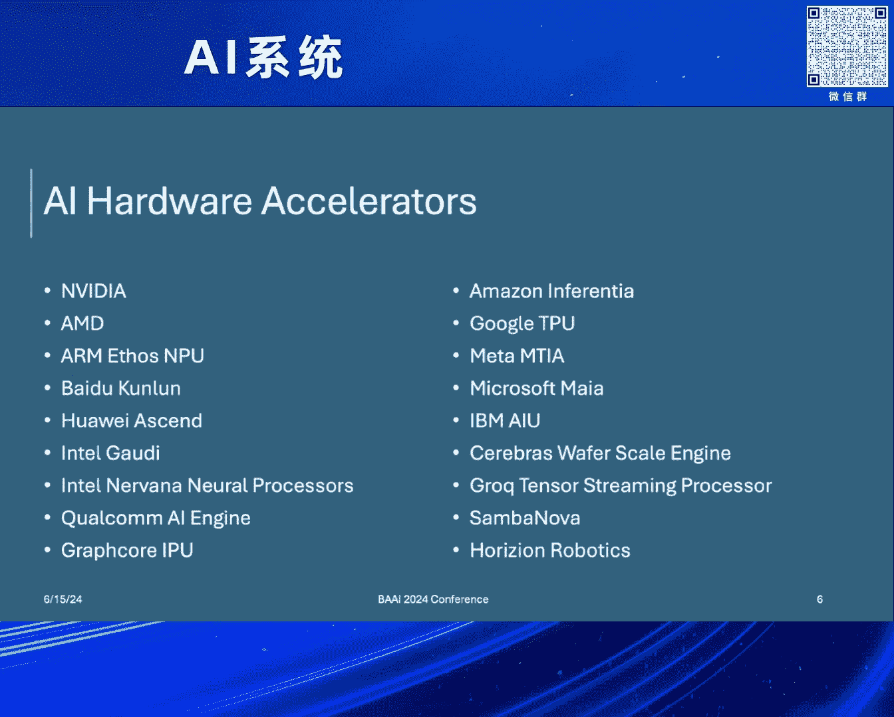
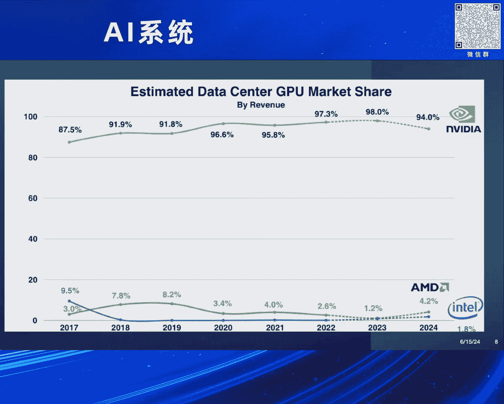
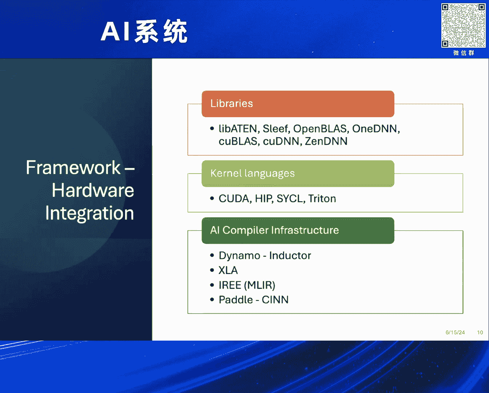
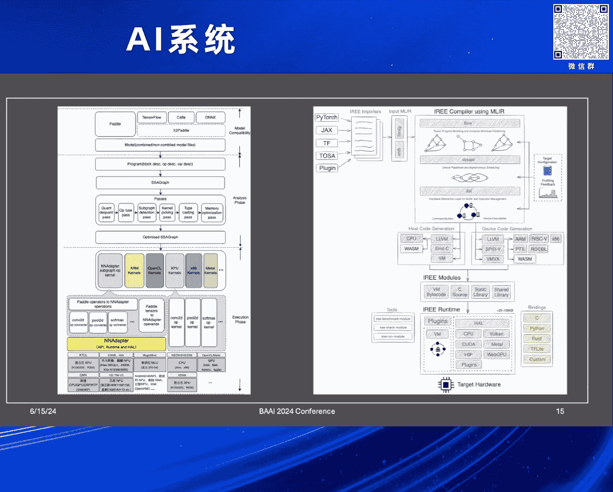
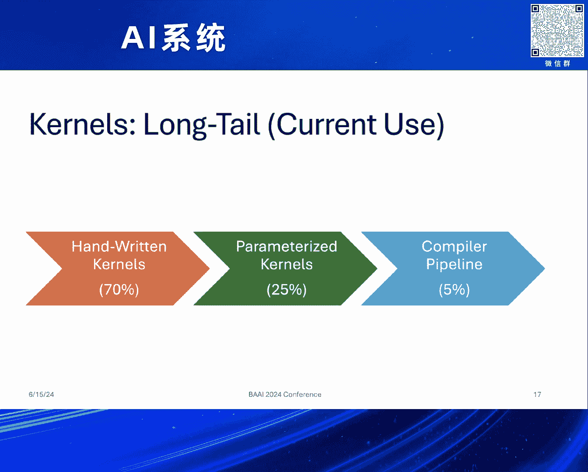
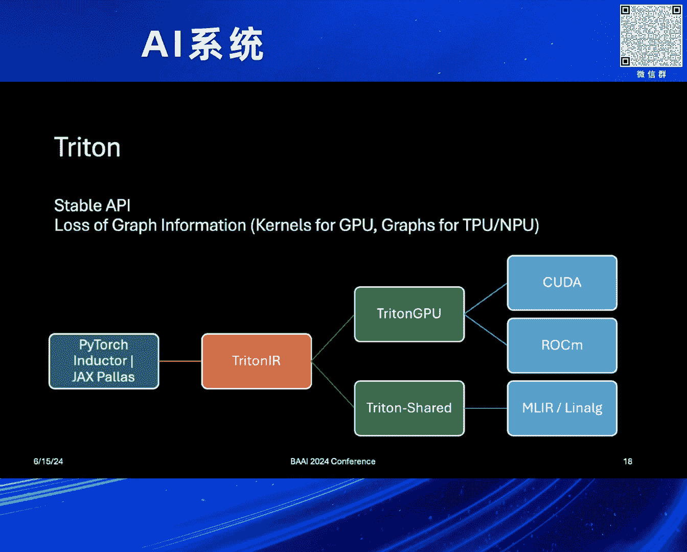
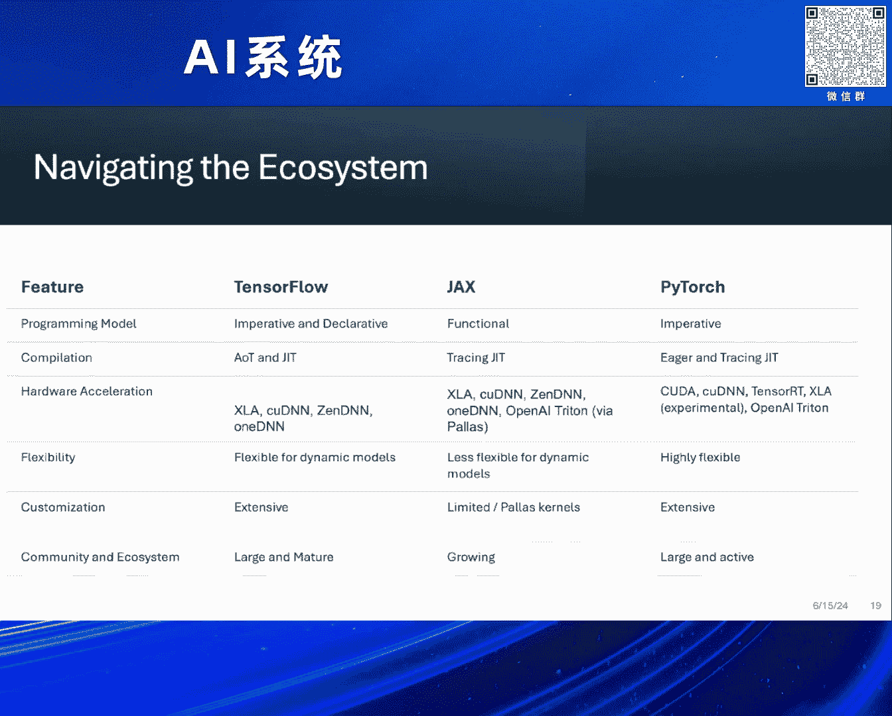
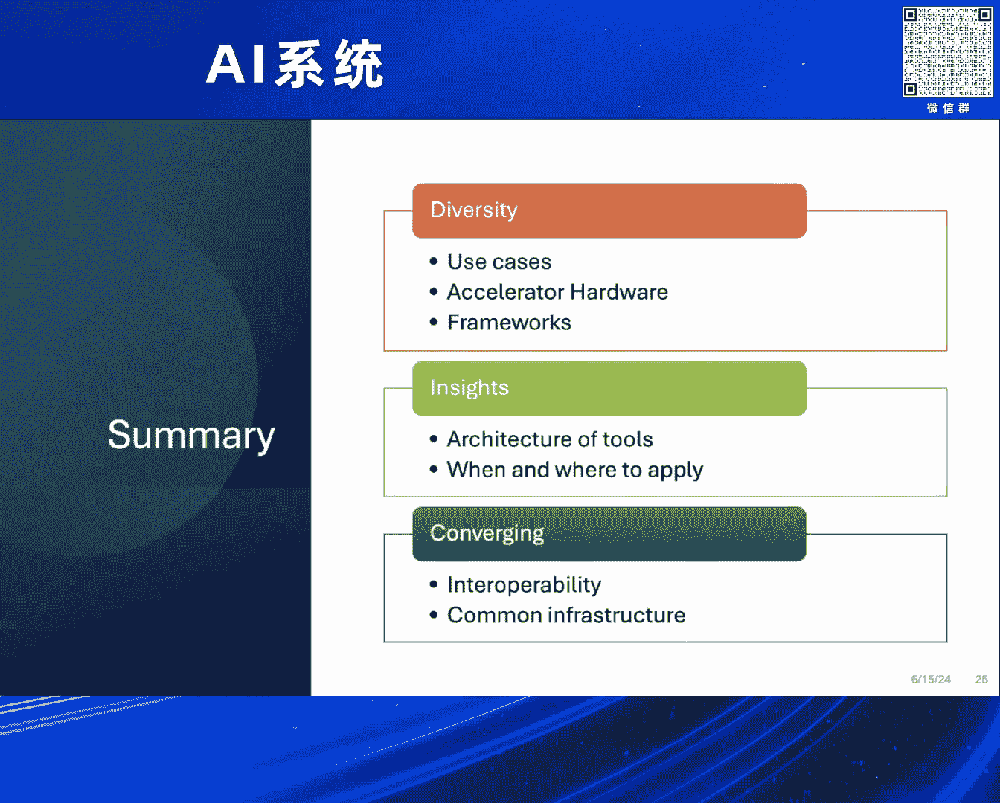

# 2024北京智源大会-AI系统 - P2：Unlocking Al Potential：David Edelsohn - 智源社区 - BV1DS411w7EG

好的，非常感謝，謝謝你，楊娃，給我們這個美好的介紹，和與你一起工作，在IBM，正如你所說，這個講座的目的，是探索與AI模型最新的開放源源，開放源源的AI模型，以及它需要運行的多元硬體速度。

如何建立這個連接，並提供一個有效的生態系，在這些優秀的模型中，我們可以利用，多元硬體速度的多元建築，正如楊娃所說，我是David Edelson，我是OpenEcosystem的高級技術員，正如她所說。

我曾與GNU Compiler一起參與，還在領導GCC社群，是Linux開放源的基礎，最近也轉移到AI模型，與Numpy， OpenBlaz， 1DNN一起合作，現在我們正在研究多元硬體的挑戰。

在這個講座中，我會先講解。

多元硬體的速度，AI模型，以及這項軟體的應用，如何運行多元硬體的應用，以及未來的科技，發展科技，以及未來的方向。

首先，我想開始講解這個題目的動機，就是有非常多的開放源AI模型，想運行在一系列不同的硬體上，我們有所有的AI模型，從影片，音樂，非常精準的訓練，自然語言處理，自動駕駛，訓練和運行在車輛上，盜竊偵測。

機械學習，這些都比較少數據，但有很多需求，例如可供應鏈，可供應流量，可供應通路，能夠處理多元數的計算，甚至是可供應手機和穿著裝置，這些都具有不同的需求，包括形狀因素，以及這些AI模型的裝置。

以及遙控器的能力需求，所以AI模型有非常多的需求，包括能夠運行這些模型在快速公路上，所以要找出不同的方向，來運行這些模型，包括PADDLE， PADDLE， JAX， TENSORFLOW。

這些模型的發展，才能夠運行這些模型，在不同的用途上，以及這些模型的硬體建設上運行，我們來談談硬體快速公路的類型，有GPU，大家熟悉的，無論是NVIDIA或AMD，從圖像處理器開始，到現在已經在服務這些。

機械學習和AI模型，這些模型具有高通路流量，流量，可供應鏈，並且能夠很有效地運行這些，數據密集的計算，我們也在研究更專業的處理器，例如Google的TPU，使用Systolic Arrays。

能夠更有效地運行特定的軸線，也非常擅長大規模訓練，還有NPU，它們的名字中有些微妙的隱藏，它們可以用在小型裝置上的NPU，或是在數據中心，也可能被稱為TPU，所以這包括了，Microsoft。

 Meta， IBM，特別用途的AI晶片，還有Apple， Mac等類型的裝置，或任何類型的PC，FPGA非常有效，在研究和模型上，因為它們的彈性，可重組，有助於了解，不同類型的數據密集模型。

具有特定的使用情況，DSPs，它們的能力非常低，而且有很特別的用途，但在能力和尺寸上，有非常嚴格的限制，能力和尺寸上的裝置上，A6給予極高的表現，但它們有很特定的使用情況。

但它們有很限制和特定的使用情況。

所以這裏有許多AI硬體的快速晶片，從NVIDIA和AMD，Baidu， Kunlun， Huawei， Ascend，有許多不同的模型，不同的特定使用情況，這是一個非常大的生態系統。

需要特定的文字和特定的調整，來應對它們，而挑戰是如何能夠使用這些模型，是由一個小組的，非常有效的程式，來定義，尤其是這些最新的大語言模型，並能夠將它們，複製到所有不同的硬體，再一次。

Meta有MTIA晶片，Microsoft， Maya晶片， IBM， AIU， Amazon， and Ferentia，還有一些切割的，Cerebrus， Wafer Scale Engine。

和Grok的TensorStream處理器，這些都在探索整個空間，不同的硬體設計的交易，但也想能夠運行同樣的主要模型，例如Chat GPT或Lama。

這些有趣的模型，這不是最新的數據，但你可以看到，整個市場的交易空間，有非常多的平均分別，有些是用於更穿插的裝置，PC，有些在數據中心，但需要支援的，是非常多的硬體，這些有趣的模型。

像是機器學習模型和AI模型，在GPU空間，NVIDIA明顯地在掌控，但這只是GPU，這不是數據中心，不是TPU，或其他類似的NPU處理器，例如Maya或其他晶片，但現在AMD和Intel。

正在努力在市場上獲利，所以GPU整體，仍然在這個市場上主導，尤其是高端訓練空間，所以在大部分的程式，都在商業環境下，人們正在嘗試，將它們推進到不同的處理器。

AI模型，也有不同的模型，它們都有不同的優點和缺點，PyTorch非常有用，因為它的彈性，使用方式，使用者能夠寫出模型，並改動和探索它們，TensorFlow，已經在這方面操作了一些時間，最初的領先。

它非常能夠生產，非常堅固，非常適合生產，JAX是另一個，Google已經發明的軟件，它非常接近它們的XLA，我會在一會兒講到它們的軟件，非常適合數位數學，它們有不同的優點，與TensorFlow相比。

當然，Baidu的Paddle Paddle，它們的焦點，從超級規格到手機，ONNX不是一個軟件，但它在這裡，是一個語言，使用者能夠寫出模型，它非常有效，對於它的運行者定義，與模型之間的交換。

這是一個優點和挑戰，然後有很多其他不同的程式，這些程式在時間中發展，仍然有很好的使用，和專業使用的情況，並且在很多地方，有效地使用，所以這裡有非常廣泛的程式，它們都在爭取，市場股票有不同的優點。

和不同的交易，所以這些程式，與硬件連接，是通過一系列的層面，包括像LibA10在PyTorch，和Sleaf的程式使用，OpenBlaz，1DNN，所以一系列的程式，都集中在一些，一些更加普遍。

一些更加集中在程式，一些更加集中在硬件，我集中的，是Kuda和HIP，這些語言，對於NVIDIA和AMD，作為一個，對於寫低級語言，在網頁上的具體語言，Sickle是一個語言，現在是UXL的一部分。

它與基礎建立，同樣的DSL，可以通過，多個硬件建築，Triton是一個，比較新手的Python語言，是一個非常有效率，高級的方式，去表達這些軟件，目前是，專注於製造GPU軟件，但我稍後會提到。

它在其他領域，有它的優點和缺點，這些軟件，手寫的，還有軟件的軟件，組合在一起，這些不同的AI，組織設施，例如Dynamo， Inductor，PyTorch， XLA，TensorFlow， Jax。

Iri的MLIR基礎組織設施，正在嘗試提供，最終的解決方案，仍然是在PADL和CINN的，PADL-PADL的，基礎設施，這些組織，能夠結合，模型設計，和這些系統的運行，以提供一個最佳環境。

運行不同的硬件。

這些基礎設施，有專注於，模型的整體組合，包括軟件，軟件的動態形狀，軟件的粗糙度，數字化和多精準，精準的改變模型，以達到最佳的表現，最佳的記憶體使用，自訂的運行員，以及從數據中心到。

特別的裝置，各種環境，理想的情況下，我們想要有一個，簡單的圖表，把模型寫在，某個程式中或是翻譯到ONIX，然後放到這個，美麗的雲中，它就能被魔法化，變成一個能運行，和使用任何，這些不同的硬件。

但當然現實比，把東西放到雲中，得到一個魔法的反應更好。

從這個例子，展示XLA的建設，主要是關注，TensorFlow和JAX，但也有能力，輸入PyTorch，你開始看到，一些目標獨立的，複雜性的，以及大量的目標，以及這些不同的，程式和組件的基礎。

就是這個模型，仍然需要很多的調整，以及組件的基礎，來得到最佳的表現，來自這些不同的硬件，所以我們可以說，我們只會用，TensorFlow或XLA，但把模型轉換成XLA。

從PyTorch或Paddle Paddle，這個模型本身有很多資訊，關於最佳的表現。

需要很多調整，所以不是那麼簡單，從不同的角度來看，從Arm建設，只是一個建設，而有兩個多個程式，在一起，我們可以看到，不同的程式的複雜性，如果用TensorFlow，用Eigen，或1DNN的軟件。

如果用PyTorch，用OpenBlast，或1DNN的軟件，和組件的基礎，不同的組件，不同的計算系統，所以有些難度，是由於不同的結構，以及組件的基礎，來支持不同的建設，而從建設商，來支持不同的結構。

來得到最佳的表現，以任何方式，建設者想使用。

在更多的層次，你可以看到，左邊是Paddle Paddle Lite，的建設，而右邊是Iri，嘗試支持，所有這些潛在的結構，以及所有這些潛在的硬件，而它變成，不在詳細的部分，但在非常複雜的情況下。

嘗試使用所有不同的方式，來得到最佳的表現。

對於一個模型，或是任何一個建設，所以他們在做這件事，都非常努力，所以，再一次，這個環境的挑戰是，有一個複雜的，結構、翻譯、組件、，複製，所有這些不同的部分，到硬件，還有複雜的，不同的方式。

可以寫這些模型，以及他們的圖書館，所有從建設語言，當然是被拒絕的，當然能夠得到很好的表現，C++ 標片，C++ 編輯的 DSL，像是 CUDA，Python 製作 ASM，所以有很多很多不同的形式。

很多很多不同的元素，可以一起組合，但是這個複雜的組合，難以維持，複製，和組件，所以這是AI社會面臨的挑戰，來得到最佳的表現，這些建設，還有分割，如果從硬件的角度來看，建立一個整個硬件設計的平台。

當然能夠得到最佳的表現，但是不可規模，特別是那些，我前面提到的硬件建設，所以不太實際，我們要開始從硬件開始，而不太實際地說，我們要從模型開始，AI 空間的計算，是一個結束結束的，對比計算問題。

不僅僅是數學模型，我們要建立一個數學模型的圖書館，然後一切都解決了，所以其他挑戰就是，可同時運作，重新來說，這些結構、圖書館，API 為了，想要建立這些結構，與不同的結構互動。

PyTorch 為了它的 API，Paddle 為了它的，有些可同時運作的翻譯，在模型本身，例如 ONNX 和 X2 Paddle，但這兩者有著限制，模型目前需要，正如我提到的，具體定義或調整。

以達到整個，工程系統的最佳表現。

使用的基礎設施，所以說說，如何發展，我與，在模型開發的，組織之前的討論，目前使用的，約有 70% 的手寫殼，為最重要的路徑，和最重要的殼，他們能夠使用，他們稱為殼的長尾，其中約有 30% 的殼。

20-30% 能夠使用，定義工具，我指的是像 Triton，然後約有 5% 的製程師，目的是，最佳計劃，目的就是能夠，更多地轉移，高性能發展的工作，到這些高級語言，到定義殼，到流程，並且有少量。

依賴人文手寫的。

說到 Triton，Triton 有優點和缺點，Triton 能夠使用，手寫的標準語言，高級的殼描述，這方面已經非常有效，現在也開始使用，作為自動組織標準，是一種手寫，人文手寫的語言。

和一種集中攻擊語言，是 PyTorch 和 Ductor，和 Jack's Palace 所攻擊的，最常見的主要方向，就是我所稱之為 Triton GPU，原本是為了。

CUDA 和 NVIDIA 而設計的，現在能夠更多地，直接支援 RockM，不僅是翻譯，而是有直接支援，在 RockM 上的 Triton GPU，還有一項工作。

是 Microsoft 和 Meta 做的，是一項開放式的項目，叫做 Triton Shared，能夠利用 Triton 語言，支援他們的專業硬件，通過一條 MLIR 通過。

連接到 LinAl 或 LinAlge，不同的發音，通過，挑戰是，這個 LinAlge 通過，而該資訊在核心，是 TPU 和 NPU 硬件，相對較低的水平，這實際上是想要，看到模型的全圖或全圖。

以達到最佳的表現，以能夠運作，大部分的計算，而核心，對於 GPU 而言，是非常非常有效，因此有了資訊的損失，另一方面，MLIR 和 LinAlge 語言，是非常脆弱，而在 API 方面。

因此 Triton 其實有幫助，在提供更穩定的 API，對於一款組件，如 PyTorch 導引器，能夠生產文字，所以有很多工作在前，關於如何擴大 Triton，或其他方式，來接觸 MLIR。

以達到更多的功能。

在更廣的硬件範圍內，所以再次說，去探索這個系統，基本上，就是這個系列，又是不同的，範圍，有不同的優點，不同的優點，不同的程式模型，不同的社區，不同的設計，不同的系統支援，而這是一個挑戰，試著配合。

正確的範圍，和正確的硬件，來達到最佳的表現，還有其他限制，或硬件和公司的政策。

的要求，所以基本上，去最佳化一個模型，你需要有一個組合，選擇的程式，軟件最佳化，核心，混合精準，設定設備，具體最佳化，目標最佳化，尤其是在，裝置穿插的空間，記憶內容計劃，選擇連接和裝置。

確保這套裝置適合這個裝置，所以基本上，這就像是，你試著製作，炒米菜，或者是你試著製作，AI應用程式，是一件，把所有的材料，和一位師傅，把它們全部結合，然後你可以得到，一個漂亮的炒米菜，或者你可以得到。

一個清潔的應用，這在，影片製作AI中，看來非常有效，所以你可以得到，出色的，料理結果，和對的師傅，和對的材料，所以這個生態系的願望清單，基本上就是，軟件總體，擁有一個唯一的真相，對於所有的這些不同的。

一種硬件，你不需要，專注它們，能夠定義，在不同的硬件特徵，不需要寫在，組裝上，希望不是C++，能夠使用，更加靈活的語言，並能夠支持，這些動態形狀。

所以，在出現的技術中，我再次提到，早期，Iri和MLIR，和可能的機會，為了，創造更多的共同設施，圍繞著，Modular，創造了Mojo的組件，他們慢慢在，希望有些，利益，再次使用MLIR的，基礎設施。

在更長遠的未來，有趣的，機會，對於，數位數學和，數位轉換器，有可能有，很好的機會支持，巨大數據組件，對於畫面和語言，或高度元素的編輯，還有很多，關於心理學的興趣，就是，嘗試使用，人類腦子結構和功能。

相配的數位數學基礎，來獲得更多，能力，進入，模型，以及AI能夠，利用它，對於，對比，錯誤遵守，其他類似的人類腦子，特徵，所以這就是，未來的一些題材，所以再次，回顧，這個簡短的介紹，AI內的AI環境。

有很多不同的多樣性，使用的情況，有廣泛的分別，從，再次的生產AI，和數位數學，到非常限制的環境，硬體，延遲，通過，快速硬體，環境，而，挑戰，和最佳的機會，是，大家正在學習更多的，工具的建設，基本上在。

對應的設置和應用方式，和應用方式，的對比，來獲得，最佳的表現，由工具本身，在模型，越來越多，以及引擎，越來越強大，學習，如何獲得更多的對比，在模型設計上，所以它們正在向，更多的合作能力，希望能夠。

共同建設，共同API。

可以，分享這些不同的工具，所以，這真是一個很刺激的時刻，還有很好的機會，能夠，合作，在硬體企業，軟體開發人，圖書館開發人，以及模型開發人，應用開發人，一起合作，共同發展，這個環境的未來。

最好是在開放的環境下，能夠獲得，從所有不同的，偉大的思想領袖，和思想領袖，在全球，在全球各地，發生了這些，不得不的創新和探索。

所以在這裡，非常感謝你們，我只想提到，不僅是討論的，但是我正在與另一項項目合作，叫做Enterprise Neurosystems，是與美國聯合國，合作的AI創新大挑戰，我們希望，能夠廣泛地推進。

我們正在尋找，全球的參與，所以如果任何人，關於氣候變化和AI的工作，我們會向，所有人報告，請幫助我們傳達，我們正在尋找，所有人的參與，謝謝。

