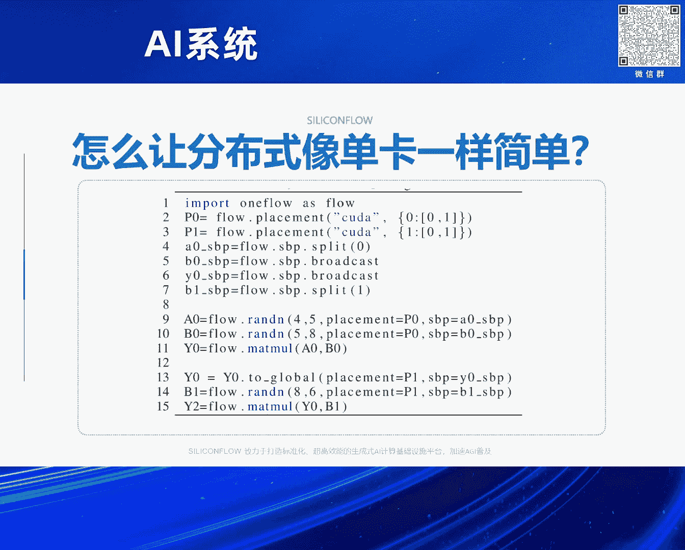

# 2024北京智源大会-AI系统 - P3：Al系统领域还有哪些比较重要问题？-袁进辉 - 智源社区 - BV1DS411w7EG

谢谢林院长的介绍，这个题目确实非常大，然后我先想提前说一下，就是我是来提问题的，不是给答案的，所以大家可能让等待答案的，这个会有所失望，然后为什么提这个题目呢，这个我解释一下那个它的源起。

因为今年三月份的时候，不是英伟达在硅谷开那个GTC大会吗，有非常多的同行，国内外美国的都去，我也去参加了，然后就和很多我们从事这个方向的同行，都在最前沿的专家交流聊天，然后呢就会。

其实就会遇到一个同样的，大家都会关心同样的问题，就是好像这个外界的环境，和大家的研究热点，发生了非常大的变化，然后我们下一步，就是作为我们这个community。

或者我们在做这个AI system工作的同事，还有什么重要的问题需要我们去解决，这听上去就好像说，是不是没有什么重要的问题了，还有另外的就是说，应该说在大模型之前呢，应该说AI system。

我觉得它的significance，它的重要性，应该至少是和搞算法和模型训练研究的，是一样重要的，在当时那个位置或者说那种影响力，但是当那个大模型起来之后呢，好像大家都去关心那个model的问题了。

然后那个搞AI system的，隐隐有点像变成二等公民的感觉，这也是一个，然后就是大家普遍在讨论，就是说我们搞AI system的，还有什么样的点我们可以做出非常，就是说我们做出一点工作之后。

做出一方面一个工作之后，就能成为在整个行业有非常大影响力的，这是我们每个人所追求的，就是impact，所以这是这个问题的由来，但是很不幸就是，在那个开会之后，我也一直在琢磨这件事情。

我说实话我也没有想到特别巧妙的，特别妙的想法，所以今天是把这个问题抛出来，然后我们可以大家都想一想，然后我会结合，近期我们在做的一些工作，然后从一个小的侧面来，分享一些认识和观察，OK。

那后面我就进入这个正题，其实刚才林院长介绍，我在这个AI system工作呢，大概分成两段吧，就是从2016年到2013年，实际上在做OneFlow，那时候的重心是在搞training里面的问题。

然后从去年开始，就开始，开始SiliconFlow之后就开始做，Inference方面的工作。

那在这块呢我也会分享一下，为什么发生这个变化，我还简单回顾一下我们在，training时候做的工作，我今天回看的时候，我也感觉我们当时，这个我们还有包括很多同行做这个，SAMS system的工作呢。

还是非常，就是它有系统的美妙，就是我们在system方面，有一个可以有非常简单的idea，然后呢它会发挥非常大的作用，但是在今天我们在，一会儿我会看到我们搞Inference的时候。

会发现它需要非常非常多idea，综合起来才能有一个不错的，产出 不同的产出，就好像，一定程度上就是这个system没有那种，过去那种味道，就是那种纯粹的system的工作。

然后一个巧妙的idea就有很大的爆发力，然后我回顾一下，就是OneFlow的时候做的，我觉得，它那个时候有那样一种特质，第一个当时做的是一个比较，我们觉得是一个，也是比较超前的一个想法就是。

当模型变得比较大之后，这个系统该怎么做，以及，当面对一个大的集群的时候，我们怎么让这个集群上的编程变得非常简单，特别是像一张卡一样去做，其实今天看的话，这个idea现在很多问题已经被解决掉了。

在16年的时候，像这种想法或者这种，还是比较有领先性的，那基本的思路也是像，我们讨论很多的像这个compiler，就是，把一个单卡面向单卡编的程序，经过compiler经过一层一层的rewriting。

然后变成一个execution plan，就是physical graph，这个里面呢，这里面涉及到一些抽象的问题，就是我怎么通过一个单卡逻辑的代码，变成一个多卡执行的物理的执行系统。

这里面涉及到引入一些representation，就是系统层面的表达，然后这个编译器或者是optimizer，它需要在这个表达上一层一层的转换，那后面我们就引入就是说，在OneFlow当时还是比较。

非常简单的idea，但是它一下子就把这个表达的问题，比较巧妙地解决了，实际上当时的这个重心，就是把这个张量的，从单个逻辑的视角，到这个物理的视角，或者是分布到一个集体上的视角，它的映射的rule 规则。

提炼出来，用最简单的一些rule，然后就能够把我们所能想到的，形形色色的并行所表达，那这个我们把它叫做SVP，其实在我们后来之后呢，学术界又有这个论文出现，就是包括谷歌的，像GSPMD等等。

这个SVP呢，它其实就是一个张量，它可以经过split，可以经过broadcast，可以经过另外一种不特别直观的，就是那种partial的方式，建立起逻辑和物理视角的一个映射，最后这个编译器就通过这个。

在这个SVP的表达下，把一个单卡写作的方式的程序，变成一个多卡分布式的执行的代码，在这个基础上呢，我细节就先不进入太深了，它基本上可以把我们所今天面料的，各种主流的并行。

经过非常简单的annotation，就是对张量的一些annotation，就把这个graph writing的方式，就变成一个compiled path，就搞定了，另外呢，它基于这个基础上。

当然又衍生了说，这个annotation怎么去，自己自动去做去优化，也有一系列的工作，我们和李老师也做了一些合作，就是李世刚老师也做一些合作，怎么把这个单卡的程序，自动的变成更有效的分布式等等。

它的代码就是说，就像刚才那样，既包含数据并行也包含模型并行，它的代码可以真的像单卡一样简单，但是这个时候大家会注意到，中间会有一些就是annotation，就是还是丑陋的，是需要人工去写的。

比如说这个一个矩阵，它的placement是什么，它的SBP是什么，当然那个auto parallelism，是可以把这些问题搞定的，实际上今天在社群里面，已经有很多很多这样的工作出现了，另外就是说。

刚才是一个compiled层面的，还有一个runtime层面，runtime层面其实，我们看到比较多的，前一段时间就是谷歌做的那个pathway，是影响力，就是它的传播力比较大。

它实际上引入了用actor，用这些东西去做，那同样做这个思路呢，我们在当时做OneFlow的时候也是，早好几年的，就是在2016年开始做这个OneFlow的时候。

一开始就是用这个abstraction去做，它其实我认为就是，它在这个超大规模的分布式的时候，仍然有很多的生命力，特别是跨集群的时候，多个集群之间，很多集群之间它没有像，一个集群内部有那么紧的耦合。

然后弄所有的东西，弄一致的节奏，一致的步调去做，然后多个集群的时候，它一定有这个引入异步的，这个时候用actor的方式，以及中间actor之间massive parsing的方式。

实际上是在runtime的实现上，可以做得非常紧结，我们后面也发现，其实后面有些比较新锐的芯片公司，比如说像TensorTorrent，人家在芯片层面其实就用了这种abstraction。

就是在各个code之间，以及各个chip之间，都是用这种massive parsing的方式，统一去表达，好 我前面这个是回顾了一下之前的工作，我觉得这个在之前还是有一定领先性的，在今天这些idea呢。

还是比较 我也觉得仍然比较美妙的，但是发生了不幸的事情，就在于说今天这个大模型出现之后，好像就一种architecture，就是transformer decode only，然后这个时候发现。

做了这些能自动运行，能非常优雅解决这些问题的问题，好像有大家不怎么用，为什么呢，因为当那个模型结构变成architecture，就是一个decode only的时候，用一个纯手工去写作的。

其实就今天很多大模型公司在用的Memtron，纯手工把这个parallel的方式写作下来，反而用的很多，这是不是说一定程度是像开源社区里面讲的，What is better，这是不是。

当然对我们来说是比较可悲的事情，我在硅谷的时候，也和那边的一些同事交流，我又发现了一些令人鼓舞的事情，就发现仍然有人是喜欢这样的，其实比如说像谷歌他们做那个JAX，实际上就是这些思路。

JAX和PyTorch的区别就是，它可以在编译层面，把分布式做得非常自动化，然后也遇到了，比如说X。AI， Databricks，还有Google的人，他们里面颇有一些researcher。

还是非常喜欢这种方式的，特别是X。AI，他们官方在用的就是JAX，说明这个方向应该还有，特别是当这个模型仍然有未来的探索的潜力的话，或者什么这些，仍然有很强的需求，很强的生命力，我们也希望有这种可能性。

另外一个就是说关于训练层面，实际上还有非常重大的问题，就是超级大规模里面，这个scalable， scalability的问题，比如说大家说的十万卡百万卡等等，但是不幸的是。

就是要做这种研究需要有一个大装置，但是对于我们绝大多数同行来说，是没有机会做这样的工作，这就其实一定程度上解释，为什么我们开始做inference，因为我摸不到那么多卡了，来做这个分布式并行了。

所以像我们最后一个talk，我注意到是阿里的同行去做这个交流，然后我就觉得非常羡慕，因为我们有很多的GPU可以去做这个工作，对好我回顾到这里，后面进入到这个近期举行的一个工作，还有一个就是编译器的工作。

就是我在几年前在知乎上回答过一个问题，当时说我觉得这个ASM非常hardcore的问题，一个是宏观的一个是微观的，宏观的就是分布式怎么去自动化并行什么的，微观的就是怎么让编译器。

把我们自动把这些所有的代码去生成出来，非常高效，同时也有非常多的compiler方面的研究，在近些年像有很多，包括Triton，包括微软研究院有RAM等等一系列的工作，在这里面沉淀下来的，现在看到比较。

就是大家取得共识的在这里面，compiler和code gen里面，非常有效的方式，其中一个idea也非常，我觉得也非常简单，就是原来把这个问题想的非常复杂，但是后来发现大家一致的都这么做了。

就是基于tile去做，就是把一个很大的计算code，然后把它引入一个中间表示，其实就是分块的，然后在分块之上大部分是graph，那种层面的优化，在tile IR之上做graph。

Triton也是这么搞的，然后tile之下去搞code gen，已经分成一个小块了，它就可以映射成很多芯片里面，已经很微观的一个结构了，在那个层面再去解决。

就是不是说把所有的东西塞成一个optimization的问题，那搜索空间就巨大，就发现搞很多时间也搞得不是特别理想，但是把这个引入一个非常简单的抽象，tile IR之后，上面的问题上面去做。

下面的问题下面去做，当然这个会有的时候，这种不能cross stack的这种优化的时候，有时候有一些损失，这个就是后面的问题，好 前面介绍了一些，我们之前关注过和做过的一些工作。

下面我介绍一下在推理方面的一些工作，为什么搞推理，刚才说了一个原因是，没有那么大的集群可以玩了，然后第二个原因是，因为行业内也比较关注推理，就是推理的随着应用的爆发，它的需求量，还有这个价值。

创造的经济价值，一定程度上可能更多，因为在这个training的时候，我们是阶段性的，然后训练一次模型，大家知道那个计算量和参数量n相关，是6倍的参数量，再乘以token数，推理的时候是两倍的参数量。

乘以token数，从这个角度来说，推理会比训练少三倍，但是它的token数是无止境的，就是训练的时候我们知道，大概几万亿token，十万亿token什么的，但是推理只要我持续有用户来请求，它就没有边界。

比如说OpenAI一天可能是几万亿token，几天或者一周就把训练时候，建的token都建过了，或者那个量就覆盖了，那在推理里面大家也知道，这里面今天非常核心的问题就在于说，今天的芯片都是。

基本上是瞄准之前training的workload去设计的，就导致有些资源有些错配，Inference有一个prefill阶段，它基本上和训练的时候是比较接近的，就是是一个batch的。

是一个计算仿存比较高的一个workload，但是另外就是一个decoding阶段，就是autoregressive next token prediction的方式，它里面是一个仿存瓶颈的。

这个是一个roofline model，我们大家都非常熟了，就是在batch size很小的时候，它基本上计算的，就是仿存我把权重加载进code，这个时间是固定的，但是它上面部署了很多的计算的单元。

瞬间就把这个计算完成了，导致它要再取数据要等一会儿，只有当batch size过了一个临界点之后，才能把芯片上主要的code和计算能力打饱和打满，这个时候今天其实绝大多数芯片都是面临这个问题。

所以有的时候发现有一个阉割本的芯片出现，反而对推理来说非常经济划算，比如说H20，H20就是它上面实际上把计算的code都给砍掉了很多，但是带宽又加大了，就比较适合这种仿存的密集的workload。

这是我们看到的在推理里面最核心的矛盾，这个层面既可以通过我们system的一些工作去搞定，也可以当然今天也有很多人在做芯片硬件的角度去做，比如说怎么通过新的芯片架构的资源分配，让带宽怎么搞得更高。

前一段时间火过一个芯片叫Grok，Grok就是把所有的东西都放到SRAM里面，然后访问带宽巨高几十T，然后它可以做到每秒钟生成1000套梗等等，这是Inference里面的核心问题今天看到的。

这个可以通过system的角度去做，也可以通过芯片角度，但是芯片今天还没有太成功的deliver出来这种结果，还有就是我想后面就是重点分享的就是，看到的还有更多的工作是和算法结合的。

所以为什么这是我刚开头说，好像这种很多system的工作不是那么pure，不是那么纯粹了，因为我们发现就是在这个层面的这个约束下，像我们过去一样把某个颗呢优化的非常好，甚至它可以翻两倍。

但是它在端到端的contribution，就是贡献里面只有百分之几，就是它就不是在这个Inference里面，它不是那个过去那些专长能发挥更大作用的一个任务了，OK刚才我也提到了就是说。

它要过一个batch的临界点才能把这个芯片跑好，所以实际上在系统方面很多很多工作都是，就今天看到的软件方面的工作，系统方面工作都是在解这个问题，就是怎么把batch搞得更好。

比如说Pager Attention怎么把显存用的更有效，可以让它可以放下更大的batch，或者放下更大的kbcache等等，以及continuous batching。

怎么让这个很多token可以一起推理等等，还有一些散法的工作，这些都是为了解这个问题，后面我列举几个我觉得比较有意思的，属于散法和系统协同工作的这样的一些例子。

其中一个就是我们很多人都非常熟悉的就是投机采样，它其实把token by token的prediction，能够用更小一点的模型变成一些并行度更高的，然后从而能利用好今天这个。

刚才说的就是面向过去需求所设计的芯片架构，这个也就不多解述技术细节了，还有一个今天其实学术界也有人关注到了，就是说我们使用大模型的时候有很多。

best practice使用开发范式比如agent多agent，那一个agent解决一个问题的时候，它实际上通过多个步骤分解来做一个，它通过多次大模型的调用，这些大模型调用之间有一些依赖关系。

一定程度上就蛮像我们过去搞compiler，搞分布式并行的DAG，就是有向无还图一样，那同时在这个agent的workflow里面，这种有向无还图上的优化也是有这个机会的，它有可能把一些没必要的。

LM的API的调用就给优化掉了，甚至能够把多个LM的调用可以并行的去做，而不是一个一个去做，这是左边这张图解释了一个agent的内部的优化机会，右边的是一个多agent。

这种多agent的时候它就更有这种并行机会等等，所以这个里面其实在过去compiler的视角去看的话，它就是一个graph的优化，还有就是其实今天很多流量很大的大模型公司。

包括OpenAI什么的已经用这些了，包括前几天苹果发布的那个，已经是端测和云端有协作了，其实就是一个模型路由的，就是一个任务过来，它不见得全部发到那个最大的模型上去做。

它可以让能解这个问题的足够的一个不大的模型去解决好了，这个时候它就需要前面有一个router，这个router就要做的非常好，它能把这个任务调用分类，能够有的问题正确的分到小的，正确的分到大的。

然后通过最后通过一个综合的来说，推理就一下子就是提高10倍，效率提高10倍或者什么的，这个时候要比一个kernel的优化带来的ROI要高更多，还有这种就是这是Together AI有一个前几天做的一个。

就是它叫Mixed of Agents，就是它通过多个弱一点的模型的协作，然后竟然在榜单上打过了GPT-4-O，就是它不是单个模型比GPT-4-O强，这里面其实是也涉及到一些系统方面的工作。

因为我们知道Together AI实际上也是一个AI Infra的公司，还有这个在实际工作中，比如说Lang Context，还有什么我们会做一些System或者算法的优化。

比如说Attention上有标准的Attention，也有这种GQA，还有前一段时间DeepSeq做的MLA等等，在这个里面它通过这种算法的一个创新，能够把KVCache优化的紧远很多。

然后推理效率提高很多等等，这是非常好的，但同时还会有一些用户实际上有这个反馈，就是在某些对Attention要求非常高的场景，有时候会发现这些算法的优化，它对效果有hurt 有损伤。

比如说有些在做教育的数理逻辑那种推理的环节里面，它那个Attention就要求比较细腻，这个时候有的时候对Attention做一些裁剪阉割，它会对那个模型效果有损伤。

有可能我们在写小说做情感陪伴用这种无所谓，但是有的场景可能还得需要回归到非常，计算比较多的这种Attention机制上去做，还有比如说量化精度，它可以有效解决这个KVCache。

把KVCache弄得很小，但是这个是前一段时间我们截图了一下一个模型，它对量化降度之后呢，它对那个long context，因为它量化之后呢。

对那个Attention啊softmax那个计算的分辨率就没那么强了，就会发现它long context效果就下降很多，这也是一个问题，这是在实际中遇到的问题，好那时候总结一下就是。

前面介绍了像过去我们关注的一些工作，包括自动面型啊分布式，自动代码生成，然后现在我们感觉这个工业界比较关注的是大模型推理啊，实际使用啊，这里面呢会发现有非常多的。

算法软件系统还有硬件的Code Designer工作，然后有的时候在这个层面做一个工作，它的收益会比那个单纯做一个system的工作收益会多很多，所以回到头就是我是抛出那个问题。

我还在寻找这个问题的答案，希望能够后面有一个更好的回答。

谢谢大家。