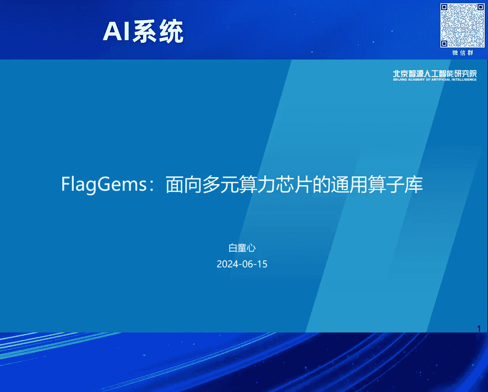
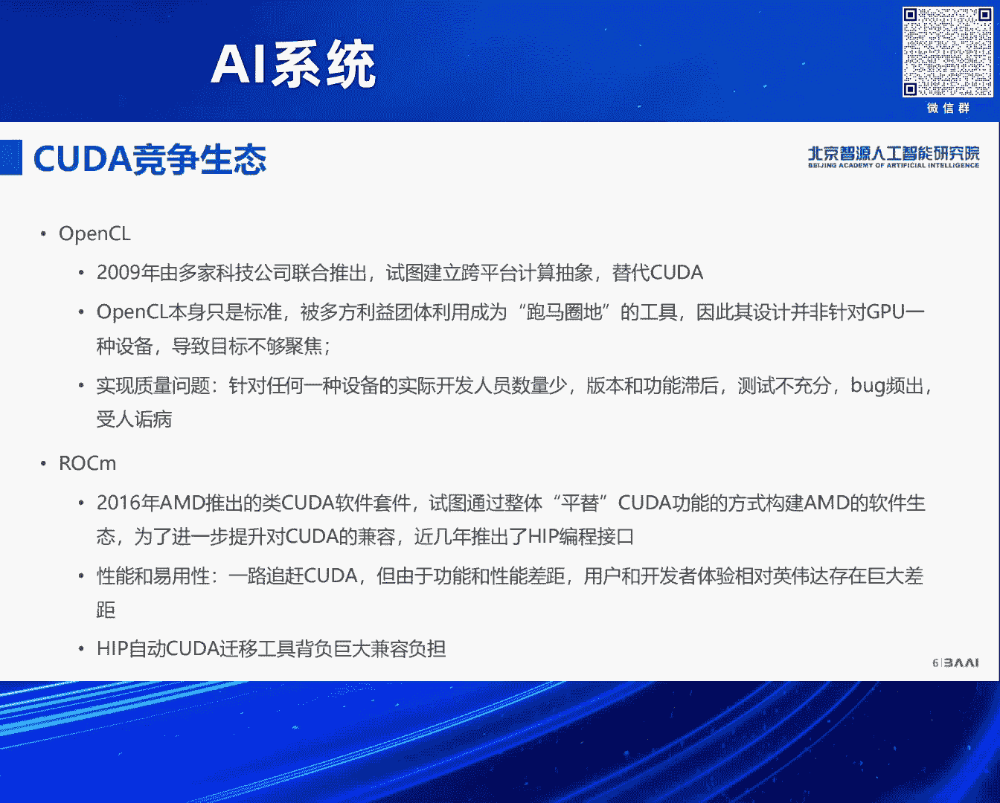
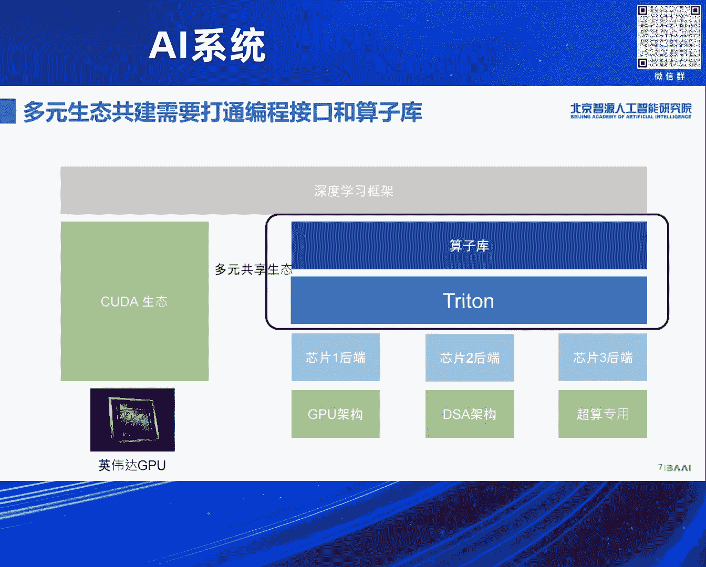
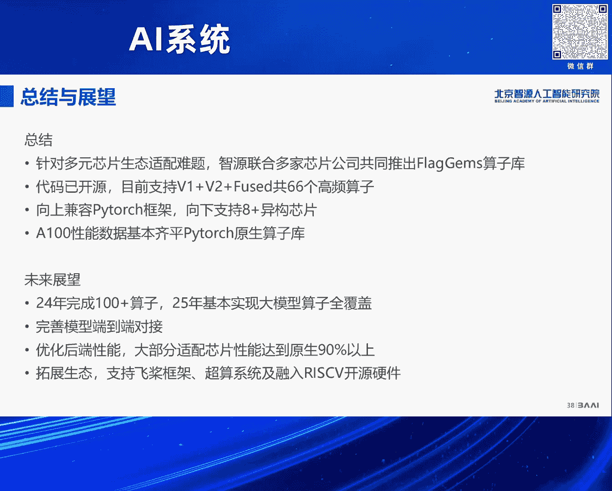

# 2024北京智源大会-AI系统 - P4：FlagGems通用Triton算子库-白童心 - 智源社区 - BV1DS411w7EG

好。

今天我们带来的就是说这个题目是Flag Gems，是我们最近推出来的一个开源的GTryton的算子库，对，然后我们现在支援的团队大概是三四最近来招多招了几个人，大概是五个人的规模。

我们这个Flag Gems的算子库是我们联合，硅基还有中科加和以及国内的一些芯片公司，来共同研发的一个算子库，对，所以我们现在先简单介绍一下结果，我们现在这个算子库的支持大概是66个基础的算子。

还包括6个融合算子，然后我们期望的话是年底能够实现100个算子左右，明年大概就是说能够基本上实现对现在典型的大模型的算子的全覆盖，所以期待大家去使用，所以我们今天讲的这个题目是什么。

我们去年讲的是一个AI编译器的题目，我们每年升旗都给大家带了一些新的东西，然后我们工作方向是AI编译器，我觉得在AI系统里面我们是被挑战最多的，记着我们刚进志愿的时候，领导就说你们做编译器的。

我们现在面临的是多个框架以及多个AI芯片，你们能不能做一套编译器系，能够支撑这种多元的框架以及多元的算力，都把它们连到一起，对，然后今年的情况就是说除了英伟达的算力之外，可能尤其是大模型的训练。

存在大量的算力不足的问题，然后能不能通过编译器或者相关的技术，把不同的算力能够混在一起用起来，对，所以围绕这个问题的话，我们探索了一下基于Triton的算子库的方向，我们觉得这是一个非常值得做。

而且我觉得通过我们现在验证的结果，看起来也是非常可行的一个方向，对，但我们刚才说了，就是说除了我们之外，还有其他的芯片厂商，除了英伟达之外，我们芯片厂商里面的软件开发人员，也是面临这样的问题。

就是做的东西特别痛苦，就是要开发AI的编译器，然后支撑多个框架，然后要面对自己的硬件去开发中间表示，后端优化什么的，非常痛苦，我觉得所有的这些生态里面，这些公司里面可能最舒服的就是英伟达，对。

就是英伟达，因为它已经有自己的一套比较完善的，完整的生态体系了，对吧，那么其他公司，可能通过各种各样的方式，是跟它找对齐，对，比如最典型的，那就是Rakam，就是AMD的Rakam的生态体。

实际上跟英伟达是非常接近的，对，然后其他厂商也是通过跟英伟达的功能对齐，这种方式来去达到，构建自己的生态这样的一个目的，对，但是现在就是说，我们的一个主题，就是如何去实现这种多元芯片的混合算力。

这样的一个问题，摆在我们面前，除了算力就是硬件之外，还有一个问题，就是说怎么去统一不同的软件生态，我们现在做法是什么，每家都是向CUDA生态去对齐的，但是这样有一个问题在于什么，就是CUDA生态的。

它的核心是CUDA的编程语言，对，但是不同的芯片架构，你去面向CUDA编程语言，去适配，会存在本质的问题，对，后面我会讲到，所以简单讲会存在几个限制，第一个是编程接口的限制。

就是CUDA它的编程模型是面向SIMT这样的硬件的架构的，对，那么有一些加速器并不是SIMT的架构，所以适配起来会比较困难，即便是这种通用GPU的架构，可能在一些实现的细节上也有所差异。

所以一味的向CUDA系统去做对齐，不一定是最好的选择，第二点就是说它适配过程本身，就是针对大模型AI这个领域，既不具备充分性，也不具备必要性，也就是说CUDA这个体系是大而全的。

我们AI的尤其大模型这个领域依赖的算子，可能数量没有那么大，所以也许存在一种小而美的解决方案，另外就是说面向CUDA去做适配，它的适配的负担也是非常重的，因为CUDA体系刚才说了非常的庞杂。

开发难度也比较大，所以这是现在存在的问题，就是每一家都去构建自己的生态，像CUDA对齐这种方式，无疑是没有办法去解决这种生态融合的问题的，对，然后除了CUDA之外。

当然我们知道历史上还存在其他的竞争的生态了，其实坦白说也不是非常的成功，然后这里面有很多的因素，其实主要因素就在于面向任何一种芯片，它的开发力量不足，所以导致就是说针对任何一种体系结构的软件的质量。

是跟不上CUDA的，对。

所以就是说如果解决，如何去解决多元算力的生态融合的问题，我们觉得我们需要在CUDA生态之外，去重新开辟一片田地，基于什么，基于这块因为我们少了一些动画，就是说我们需要一个统一的这种编程语言。

这个编程语言也许它没有CUDA量高的覆盖度，但是它足以解决AI的一些根本的问题，对，基于共同的统一的编程语言，我们可以去构建一套跨芯片的话题结构的算子库，对，所以在算子库适配这块。

就不需要每家单位来做重复的工作了，每家芯片厂商针对自己芯片的架构，可以去适配或者开发自己的芯片的编译器后端，这是我们的设想，我们觉得这种在我们开发了Flygram这个算子库之后。

我越来越觉得这种路径非常的可行。

好，第一个问题就是说我们为什么会选择Triton，去做这样的一个开发语言，因为去年实际上我们一直探讨这样的一个问题，去年我们自己是开发了一套比较新的中间表示，对。

但是我们试图去解决从上到下多个层次的问题，有点类似MR，对，但后来发现就是说Triton作为一个新的编程语言，或者新事物，它具备很多优势，所以我们就采用Triton来去做这种开发语言了。

概括来讲它有四大优势，第一个就是它的编程的模型，就变成像这种加速器的编程模型，它是优于SIMT的编程模型的，第二点就是说它具有非常独特的开源优势，然后第三方面就是说我们做的初期的实测性能。

也表明Triton在性能方面也非常有竞争力，最后一点就是说Triton由于它现在的，在开源领域的受欢迎的程度，所以很多厂商已经开始去适配它了，好，为什么选择Triton。

我觉得首先就是说先从SIMT开始说起，就是说CUDA本身它是面向SIMT的一个编程语言，也就是说它有点类似于C针对CPU一样，它实际上是非常底层的，对，所以你在编程的时候，是这样。

虽然你是在面向现成的编程，对吧，但是你考虑的是一个SIMT架构的这样一个体系结构，对，也就是说这个体系结构是一种是高吞吐，刚才袁老师已经说了，对，其实这种架构它的极端可能像Grok那种形式，对。

它所谓的寄存器可能就是SRAM来去实现的，然后它的问题在于什么，就是说它是through非常高，但是它可能会有一些冗余，比如说你每个现场可能都需要独立的寄存器，去存储仿存的地址什么的，对。

相对而言就是传统的SIMT的架构的处理器，也是并行的这种处理器，它可能需要更少的寄存器，它没有那么多的线程，所以它的latency可能会比较低一点，对，这是不同的加速器实现的架构的差异，好。

刚才我已经说了，SIMT实际上就是说它是有架构的先进性的，对吧，因为大家做得非常好，但是并不意味着这个市场上所有的硬件，所有的加速器都是用这种方式实现的，就是有SIMD的架构。

SIMD的架构典型的就是例如X86的，像量的一些处理等等，就是在真正的异构硬件里面，提供一些加速的功能，除此之外可能还有像TPU这样的，Tensor processor，对。

所以实际上就是说针对AI的加速，有不同的硬件架构，那么CUDA作为面向SIMT的编程的模型，可能仅仅适用于SIMT的架构，那么Triton它的编程元，刚才袁建辉也说了。

它实际上是用Tile或者Block的编程元，它在编程的时候，你可能想象当中是一个划分的并行的数据块，那么在下一步如何去应试到SIMT或者SIMT的体系结构，是由编辑器或者Compiler去实现的。

所以它既可以映射到SIMT上，也可以映射到SIMT上，是一种非常灵活的这种编程的模式，这是第一点，第二点就是说Triton它有独特的开源的优势，就是我们回顾一下整个跟AI系统相关的开源的趋势。

我觉得是分三波的，可能没有太多时间就不详细讲了，第一波是框架，这波主要是为了什么，是为了给算法开发者提供可以预置的算法的building blocks，然后第二波是编译器，就是能够充分利用硬件的性能。

第三波是针对LLM的一些开源的软件，但第三波的特点是什么，就是说在第一波第二波基础上，增加了很多自定义的算子，这个是前两波不具备的，所以第二波的编译器，有的时候是考虑图编译器。

但是没有考虑到如何去实现自定义的算子，典型的就是说一些基于MLR的AI Compiler，所以现在Triton出来之后，那一波的AI编译器，可能在自定义算子开发上面就处于落后的状态了，好，我们比较一下。

就是说Triton跟我刚才说的相关的AI的编译器，它们的优势跟劣势其实非常明显，也就是说Triton它提供了一个开发自定义算子的，特别好的一个编程的接口，而且它的实现质量也是不错的。

另外就是说从我们的性能测试的角度，它也能够交付跟CUDA类似的性能，其他的比如OpenXOA的话，它的问题就在于什么的，它初期没有考虑自定义算子，现在当然通过Palace也加上来了。

但是它的后端可能是面向Triton的，然后未来可能有Mojo是一个全新的编程语言，所以从编程语言角度，Mojo可能更现代，它是一个原生支持异构计算的编程语言，但我们看来就是说它现在完全不成熟。

所以我们现在没有办法预测它的未来，综合来说就是Triton提供了一个非常均衡的，而且有优势的这样的一个异构计算的编程语言，我们刚才说它的实测性能也非常棒，左边是我们测的矩阵程的性能。

右边是FlashAttention，这是去年10月份到11月份，我们做预言的时候的数据，到那个时候的话，基本上都差不多能跟CUDA是打平的，这是我们实现的Layer Norm的算子。

然后几条线最差的当然是Torch，然后最上面的话是蓝色是我们优化过的，对，还有Inductor生成出来，我们发现手动实现的Triton在性能上也是更具优势的，对，除了单算子之外，我们可以看一下。

就是拍Torch的CI里面，你都可以看到Torch Inductor编译出来的模型的性能，对，实际上从这里面也可以看出来，Triton编译出来的Kernel，组成模型之后，它的模型性能如何。

其实我们可以看出来，在A100上面实测性能说明，结合Inductor的代码生成的后端，已经出具性能优势了，对，其他平台先不讲，只是A100的情况，好，除了前面三点之外。

就是说Triton现在已经得到越来越多的芯片厂商的支持，至少我们了解到，已经国内有数家的芯片厂商已经开展了Triton的适配，而且适配的程度还是非常不错的，另外第二点就是说。

但是大家基本上都是以Torch Compile这个接入点去适配Triton的，就没有注意到Triton作为独立算子开发它的重要性，然后第三点就是说，有一些LOM用国产的芯片进行Triton算子替换率。

已经达到90%以上了，对，这个也是先不谈性能，对吧，但是它覆盖率也已经非常高了，对，所以最后一点就是我们现在的局限性在于我们Triton实现的算子，在国产芯片上面，对吧，它的性能仍然存在一定的差距。

所以下一步需要进一步完善编译优化，好，我们就讲就是说我们用Triton来去开发算子库，我们怎么去开发的问题，就是我们可以看一下，算子库一般来说怎么去开发一个适配PyTorch的算子库。

最老的一种方式就是说我们提供PyTorch算子库，面向厂商的芯片的独立的或者封闭的这种Fork，而中间一种方式就是说我们可以定义一个统一的算子库的接口，然后再用算子库的接口去接入框架。

第三种就是我们提出来这种方式，就是说我们可以基于Triton来去构建算子库，对，我们现在就是Flagjams就是这样的一个目的，但它的好处就是说厂商可以共享这个算子库，我们厂商的话不需要独立去开发了。

第二点就是说我们既可以支持Eager，同时跟Torch Compile这种编译执行也不矛盾，然后同时我们的算子库也是开源共享的，也可以开源共建，算子实现的一致性高，对，第二种方式我虽然定义了统一的接口。

但它实现不同，所以当你去开展这种混合算力的训练的时候，可能会碰到算子实现不一致的问题，好，那问题在于就是说，现在是不是有基于Triton的算子库，Triton的算子的现状是什么样子呢。

就是我们发现Triton现在不存在这样一个通用的算子库，Triton的算子是分散在各个开源的仓库里面的，另外就是说比如说Triton它官方的仓库里面，有一些自带的算子。

然后第二部分就是说Pytor框架通过Inductor生成的算子，对，这个对Torch Compile是有一定的依赖性的，然后第三方还有一部分第三方的加速库实现的自定义的算子。

像Flash Attention等等，对，所以他们算子来源是非常的不一，而且接口也是不一致的，第二点就是说我们覆盖面，现在的Triton算子覆盖面是比较低的。

没有办法支撑大模型或者说通用的训练的所有的算子的需求，我们需要能够打破这样的局面，所以我们需要构建什么样的一个算子库，第一个是要具有通用性，就是统一的接口能够面向Pytorch等主流的框架对齐。

第二点就是共享，我们提供统一的仓库，开源共建，这样有利于对齐，而且就是说多方可以减少投入，然后第三方面就是说，我们希望能够支持大模型训练所需要的全部的算子，所以要实现全覆盖。

第四方面就是我们实现的算子库里面的算子，要做到高性能，就是所谓的高性能，可能不一定像推理优化器那么快了，对，但是基本上要达到原生算子库的水平，就是用于做训练时能够达到要求才行。

然后最后一点也是比较重要的，就是要统一的算子库能够支持多种后端，对，好，那就是有了这个目标之后，到底怎么去构建算子库，实际上从技术讲，其实有两种方式，第一种的话很显然。

就是我们通常的使用Triton这种方法，对，第二种的所谓使用Triton，就是通过即时编译的方式，去通过标准的Triton的接口去使用它，然后第二种方法是通过预编译的途径去使用，也就是说它的使用方式。

就是先通过Triton的动态的接口，去编译出一组静态的kernel，然后再通过条件编译等等方式，去重新构建PyTorch框架，对，那我们采取的是第一条路线，我们觉得第一条路线是有更好的兼容性，可靠性。

虽然它有一些不足，也就是在线编译的话，你需要付出runtime overhead，开销的这样的不足，这个是可以通过即时手段来去解决的，好，我们现在FlatGems它的基本的特性是什么。

我们可以概括为三方面，第一个就是说它能够自动的透明的接入PyTorch，用户使用的时候非常简便，第二点我们无需PyTorch，compile，所以算子的这样的话，对它算子的端到端的。

Latency的要求就比较高，不论大算子还是小算子，都要非常快才行，第三就是说我们profile一些主要的大模型，然后取这些大模型里面算子集合的bin来去开发，OK。

首先讲就是FlatGems它易用性的优势，就是说我们是通过PyTorch library的API，来动态的替换atom的算子时间，实际上这个功能是PyTorch框架提供的。

我觉得这个体现了PyTorch框架它的扩展性优势，然后因此就是说我们是无需重新编译PyTorch fork，你只要拿来FyTorch，甚至就是说你的芯片自己的PyTorch fork也可以，对。

这样提供这种一种比较极其简单的使用的方式，刚才我已经说了它是不依赖Torch compile的，所以对PyTorch版本的兼容性要求也不是特别高，对。

然后我们现在支持两种方式去替换PyTorch的原生的算子，一种的话就是说是全局的替换，我们可以在代码前面加上两行就可以了，import flag gems，然后flag gems enable。

就是我们把所有能替换的算子全部替换掉，第二种的话就是说我们通过Python的context manager，来进行局部的替换，你可能在一个scope里面。

我们先把scope里面的换成我们比如说很方便去做测试，做验证，你们可以用这种方式就可以，只要with flag gems use gems，那么里面的代码块里面的算子就会完全被替换掉。

我们用一个非常简单的训练代码来做一个事，这是玉龙他们做的flag scale的训练，我们只需要增加一行就可以完成这个设备，不需要做任何其他的事，对，第二点就是说我们刚才已经说到了。

如果我们要实现一个通用的算子库的话，你不仅仅要去支持这种大的算子，你还需要让这些小的算子能够满足 latency的要求，对，所以我们对运行时做了一些优化，对，今天下午我们还有两个同学来给大家介绍。

详细的介绍我们实现的一些机制，所以我在这由于时间的原因就不具体的介绍了，结果大家可以看一下，就是说红色的线我们是没有做任何优化的，这个是由于Triton本身runtime overhead导致的。

当你的算子规模较小的时候，CPU的overhead就体现出来了，我们优化之后是蓝色的线，基本上跟eager是可以打平的，对，好，除此之外就是说，还有一个问题就是我们怎么去开发这些算子。

就是大量的这种element wide的算子，它的输入的形状是不一样的，如果我们手动去开发这个算子的话，那么就遇到这样的情况，就是针对不同的形状，你需要开发一个新的算子。

所以我们开发了自动的代码生成的这样的一个工具，就是说可以处理不同的形状，然后处理不连续的内存的排布，另外就是说能够支持标量跟张量的混合输入，最后就是说我们可以很容易的去用它来去定义算子融合。

右边是两个实际的例子，对，我们不仅仅是可以写一行，就像Python Lambda这样的，还可以任意去构造一个scalar的函数，让它去扩展成一个Pointwise的算子，对。

具体的code generation的技术，也是下午我们有一个talk，我们下午有一个分享给大家介绍，我们这里面也是时间的原因不介绍了，好，简单看一下我们现在code gen的结果。

就是当它输入不连续的时候，它的性能就体现出来了，性能优势就已经体现出来，非常明显，好，那就是我们现在这个算组开放，刚才说已经实现66个算子，它包括了几类，一类是线性代数类。

基本上矩阵程Gem类的算子都有实现，然后部分的神经网络，比如激活类的算子，还有基本的数学和逻辑的算子，以及一些融合类的算子，感谢规矩帮我们实现的是融合类的算子，对，另外除此之外。

就是说我们全部这些60个算子里面，凡是用到反向的，我们也都实现了，但是PyTorch有很好的所谓implicit autograd的机制，也就是说它可以一部分算子，是可以把它分解成已经实现的算子了。

我们这里面是实现所有必要的反向的算子，好，给大家看一下性能的数据，就是性能的，我们现在66个算子，大部分就是说与CUDA实现的算子是持平的，有一部分是有一定性能优势，然后有小一部分，你看就是有几个。

比如说我们现在的vector norm性能不太好，这可能需要进一步的优化，还有一部分像sigmoid 10什么的，在低精度的情况下，性能可能只达到了一半，那是因为我们在做activation的时候。

我们进行了type promotion，所以就是说计算的时候用了IP32的，现在性能也是非常棒的，对，然后我们在flag scale的，我们用flag gem替换了所有的，我们能替换66个算子之后。

我们进行了训练的验证，这是flag scale的训练的收敛性，loss的curve，我们看到就是说当我们训练到5000步的时候，收敛曲线基本上是吻合的，对，所以我们当然进一步的。

我们现在还没有完成一个完整的端到端的训练，但我们从5000步的趋势上看，还是非常promising的，对，好，最后就是我们现在的代码已经开源了，然后开源的地址是在上面，Github上面。

跟我们一起开发的是，除了我们智源的团队之外，还有中科家和以及规基的团队，然后我们也非常感谢支持我们，flag jam算子库的芯片公司，所以我们现在除了支持英味达之外。

还支持如下的这些芯片的企业的芯片产品，对，未来我们会除了支持现在的这些芯片之外，我们可能还会面向其他的芯片厂商进行拓展，除此之外，我们也会介入飞桨的框架生态，以及我们会探讨怎么去。

跟谢老师探讨去介入RISC-V的生态，还有翟老师超算的平台，就是说Triton能不能落地到Triton的超算平台上，也是下一步我们要探讨的内容，这是我们开发的进展，以及今年的里程碑。

我们今年年初开始开发的，大约是2月份开始的，也就是4个多月的时间，对，刚才已经介绍了我们核心的开发团队，我们下半年的话，争取实现100个以上的高平等算子，同时我们除了核心的开发团队之外。

也欢迎社区去贡献代码，另外就是说我们会持续联合厂商，去完善多芯片的适配，跟算子的性能提升，明年的话，我们会持续的针对算子库进行优化，希望明年这个时候，能够完整的支持这种端到端的训练，总结一展望。

就是说我们是针对这种多元芯片的，生态适配的难题，我们跟多家的芯片公司，共同推出了Flyjams的算子库，目前代码已经开源，支持66个高平等算子，我们向上是兼容Pytorch的框架。

向下是支持8款以上的eagle的芯片，然后A100的性能数据，基本上齐平Pytorch原生的算子库，未来我们刚才说了，我们今年年底将完成100家个算子，25年的话，明年基本实现大模型算子的全覆盖。

另外我们会继续完善，模型的端到端的对接，优化后端的性能，使得大部分适配芯片的性能，能够达到原生的90%以上，除此之外，就是说我们会继续拓展生态，支持飞翔框架，超算系统。

以及融入到Race 5开源的体系当中，好，谢谢各位，谢谢。

谢谢童馨。