# 2024北京智源大会-AI系统 - P7：大模型高效可扩展并行策略研究-李士刚 - 智源社区 - BV1DS411w7EG

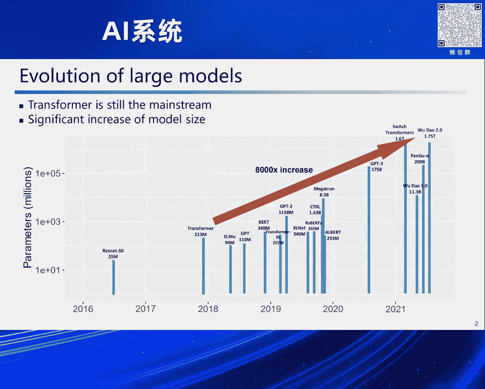

好像他这个怎么往上翻呢，这个，好啊，感谢林老师的介绍，呃，大家好呃，我今天汇报的这个内容还是大模型呃，并行策略，当然在这个领域已经有很多优化工作了，已经有非常多的工作了。

然后我今天是呃分享几个探索的点呃。

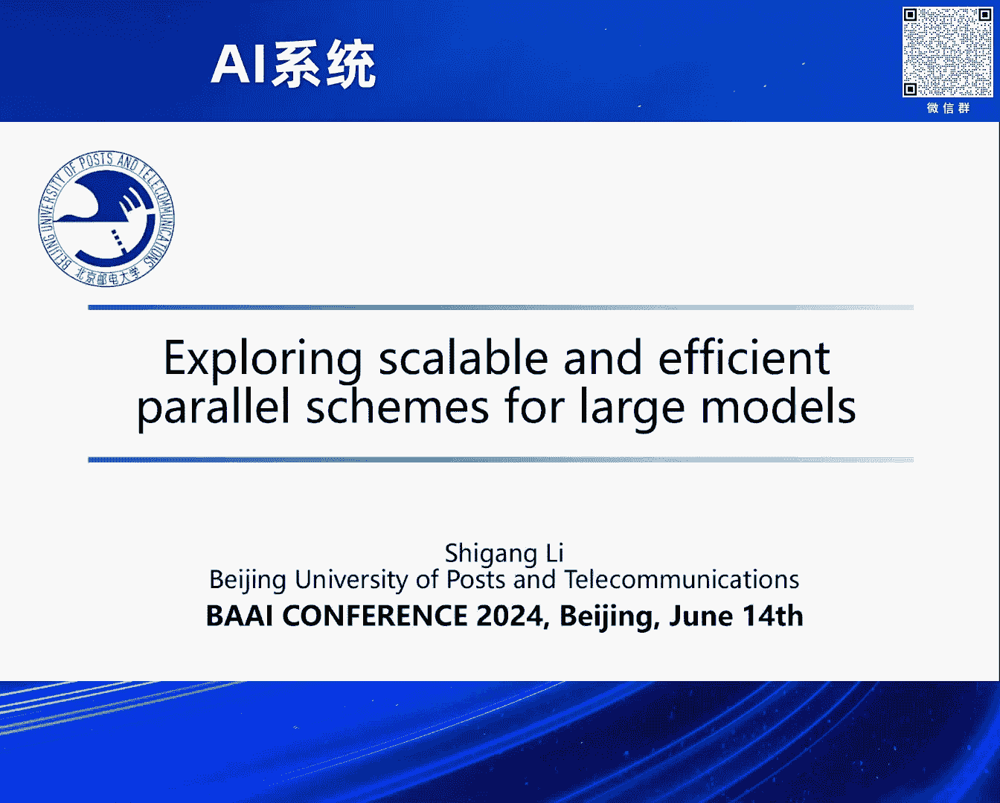

现在大模型的主流架构呢呃还是transformer，虽然呃也有一些新架构，逐渐也也也出来了，但是都呃还没有广泛应用啊。

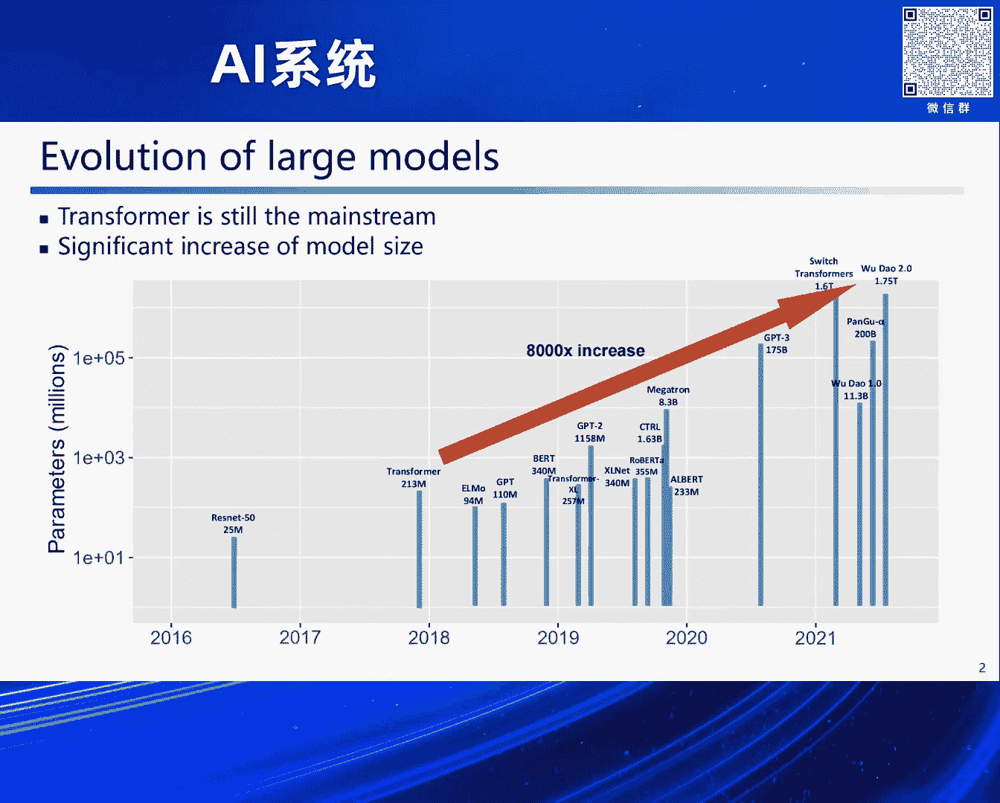

但是主流架构还是transformer，但是随着transformer，大模型这个规模的越来越大，呃而且模型的这个呃能力越来越强，它的并行策略呢也越来越复杂，它通常是一个涵盖多维度。

并行的一个复杂的组合，因此呢，这对我们系统的开发人员和，系带那个性能优化人员来说。

就带来一个沉重的负担，所以我们需要开发这种分布式，自动运行的框架呃，从而可以自动的生成其最优的一个并行策略，以及代码的实现，但是在这一个领域上呃，其实已经有很多工作了，前面呃袁老师也介绍过。

然后前面其他几位老师也已经介绍过，包括奥运龙老师也介绍过，有有这这很多相关的工作，但是在这一领域还有一些挑战需要解决，第一个就是说在已有的这些并行策略里边，它的呃通信开销和内存开销都不是非常的高效。

尤其是在操作服并行这个维度，那这里边是以麦克TRL买呃，麦克TRLM为例，它是需要将整个输入数据，在多个进程上进行复制呃，之后进行本地计算，最后要拿到最终结果呢。

需要在整个输出数据上做一个ORREDUCE操作，这种实现方法虽然简单，但是它的呃内存开销，还有通信开销都是比较高的。

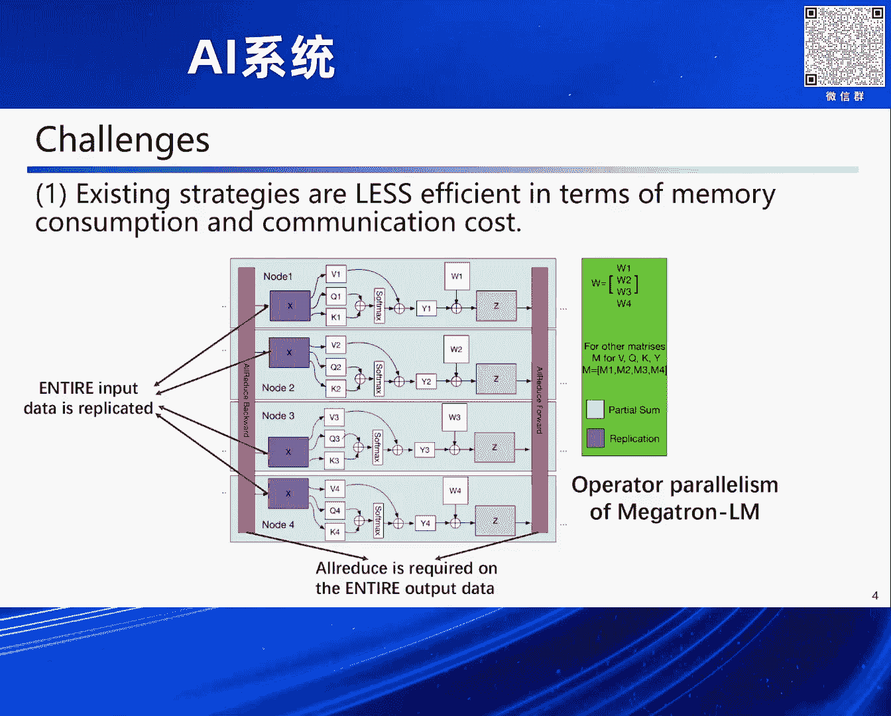

另外一个方面，就是说已有的这个深度学习框架呢，它对分布式张量这个描述能力是有限的呃，因此它没有办法很高效的来描述，比方说2。5D或者3D分布式矩阵乘法，这种通信效率更高的这些并行算法。

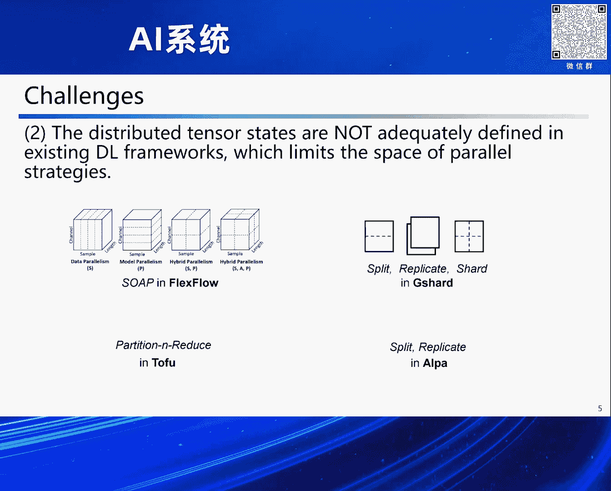

因此这里边我们是基于就是和袁近辉老师合作，基于他的前一个工作，就是one flow中的SBP框架，提出了一个就是自动的分布式并行框架，Auto d d l s p p，刚才袁老师已经介绍过了呃。

它包含三个分布式张量的状态，s split b是复制，然后P呢是partial sum爬虫SAM，这相是相对于已有的这些呃，大部分并行框架来说是新增加的一个状态，就是不分核这个中间结果。

因此呢他需要将这种中间结果进行一个全规约，ORREDUCE操作才能拿到最终的这个结果向量呃，结果张亮，但是这个ORREDUCE什么时候调用，因为我们呃定义了这种中间中间状态。

所以它是可以根据我们需求呃来呃，自定义，来来决定我到底什么时候来调这个ORREDUCE，这就跟我们增加了就是并行算法的一些灵活性，我们可以更灵活的来设计3D分布式矩阵乘法，这样的并行算法。

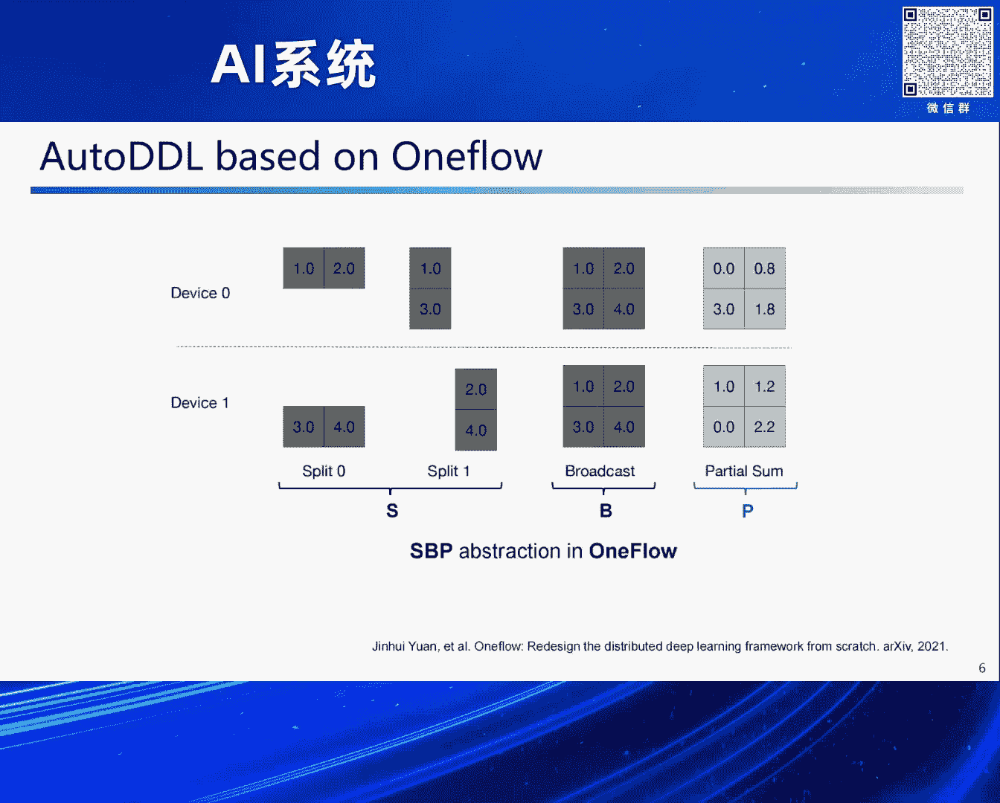

接下来来看就是，我们如何利用SBP模型来实现一个呃，3D的分布式矩阵乘法，这里边是以A乘B矩阵等于C矩阵为例啊，在八张卡上面，那A矩阵的话，A矩阵它的划分模式是S02S12B二，它表示对A矩阵的零维度。

进行两个进程上的划分，一维度呢也是两个进程上划分B2，它表示在划分之后的张量，它是复制到两个进程上，那对于第二个输入矩阵B，它的分布方式和矩阵A是一样的，然后我们进行本地的这个矩阵乘法运算，算完之后呢。

他得到的是一个中间结果矩阵，它分布方式是S02S12P二，其中这个P2就说我们这个paral sum是中间，结果呢是分布在两个进程上的，之后还需要调用一个呃规约操作，Reduce scatter。

得到最终的结果矩阵C这个C矩阵呢，它的最终结果也是分布在八张卡上的，之后还可以接后续的这种3D分布矩阵乘法呃，这种3D分布式矩阵乘法，它相比于更常见的就说1D2D分布矩阵乘法，在通信开销上它是更低的。

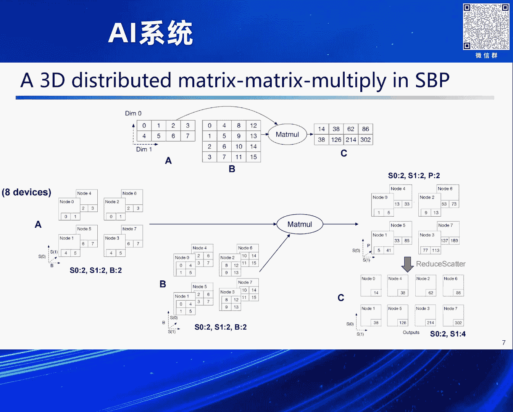

那接下来来看就是auto d d l整体的一个呃，这个模模型框架的流程呃，首先对于给定的一个神经网络，我们首先要枚举每一个操作符，它可能的SBP配置，从而构建整个端到端的一个并行策略搜索空间。

然后我们对这个通信性能进行建模呃，这里面我们主要就考虑了两种网络架构，一个是这种同构的呃，还有一种就是多机多卡的这种异构网络架构，然后用简单的啊，延迟带宽模型对通信进行建模呃。

然后我们要对这个并行策略空间进行搜索，因为我们在第一步构建并行策略空间中发现呃，可以看到啊，就是这个并行策略空间的大小，是随操作符数量而指数级增长的，因此对于这个深度神经网络来说。

它的搜索空间是非常巨大的，因此我们这里边是采用了一种定制化的呃，坐标下降启发式搜索算法，它可以对这个搜索空间里边的多个区域，并行搜索，从而可以有效的避免陷入局部的最优解，可以更快的搜索得到全局最优。

或者是进最优的这个并行策略，那这里面值得注意的一点就是，我们最终搜索到的这个并行策略，它有可能需要在不相邻的操作符之间，插入这种数据重分步操作呃。

在one follow里边它是叫boxing这么一个操作呃，这是为了满足输入和输出数据之间的，这个依赖关系呃，最后我们利用这个one flow框架，生成最终的代码实现呃。

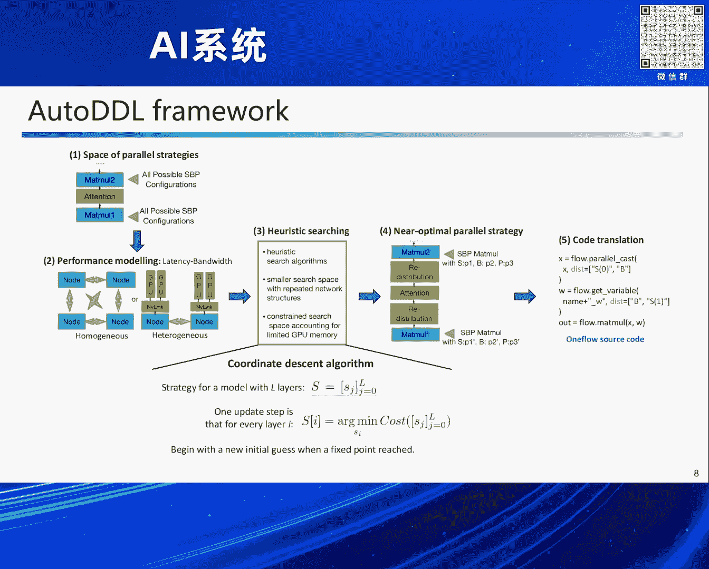

接下来我们来看auto DDR能搜索出什么，不一样的并行策略，我们这里边还是以多头注意力，mari had attention算子为例，那左边这幅图就是我们常见的，就Mac trl m m里边的操作符。

并行的一个实现方式呃，那如果再加上数据并行，因为数据并行维度，基本是我们嗯必不可少的一个并行维度啊，加上数据并行的话，麦克TRLLM中的操作符并行，可以被看作是一个2D的分布式矩阵乘法。

那右边是auto d d l搜索得到的一个并行策略，它是与IMMECTRLLM最大的不同，就是说我输入数据呃，是在多个进程上进行划分的，而并不是是I呃，Mac on里边这种整个输入数据的一个复制之后。

在划分之后的张量上，我们进行一系列本地计算，中间要穿插两个ORGAZER操作，和两个reduce scatter操作呃，从而得到最终的这个呃结果向量，那与麦克TRLMM相比呢。

呃就是auto d a auto d d l搜索得到这个并行策略，它增加了通信次数，但是总体的通信量是显著降低的，就这里边是把通信量从ON的平方，除以P的12次方，降低到了ON平方除以P的23次方。

同时呢对于输入输出数据，它的内存占用量也有同比例的一个降低，所以总体而言就是我们auto地点搜呃，搜索得到的这个并行策略，它具有更好的并行可扩展性哦，接下来来看序列并行。

因为长序列是我们大模型训练推理中，一个重要的问题呃，这里边我们还是以mari had attention为例，用矩阵乘法的形式展示出呃，它在auto d d l里边的一个具体实现过程呃。

可以看到就是我们对一个完整的序列，是它是划分到多个进程上的，或者多张卡上的，之后我们再进行自注意力计算的时候，就需要实现序列并行呃，那当前序列并行的实现方式主要有两种。

一种就是基于这种rain or gather，环形gather的实现方式呃，它是将K矩阵和微矩阵的完整序列拿到本地，然后和本地的呃Q矩阵进行一个本地计算呃，但是这个rain gather的话。

它可以实现成一种分布的点到点通信的方式，也就是说在进行当前块计算，同时可以同时传输下一个下一块数据，这样一来可以实现一个比较好的计算，通信的隐藏，那另外一种实现方法就是呃deep speed。

尤里西斯里边这种，它是针对QKV3个矩阵，分别调用一个out to all通信，但是这个auto all的话呃，调完调用完out to all之后，就是每个进程就可以拿到，完整的这个输入序列了之后。

再在本地呃，执行类似于flash attention这样的本地计算。

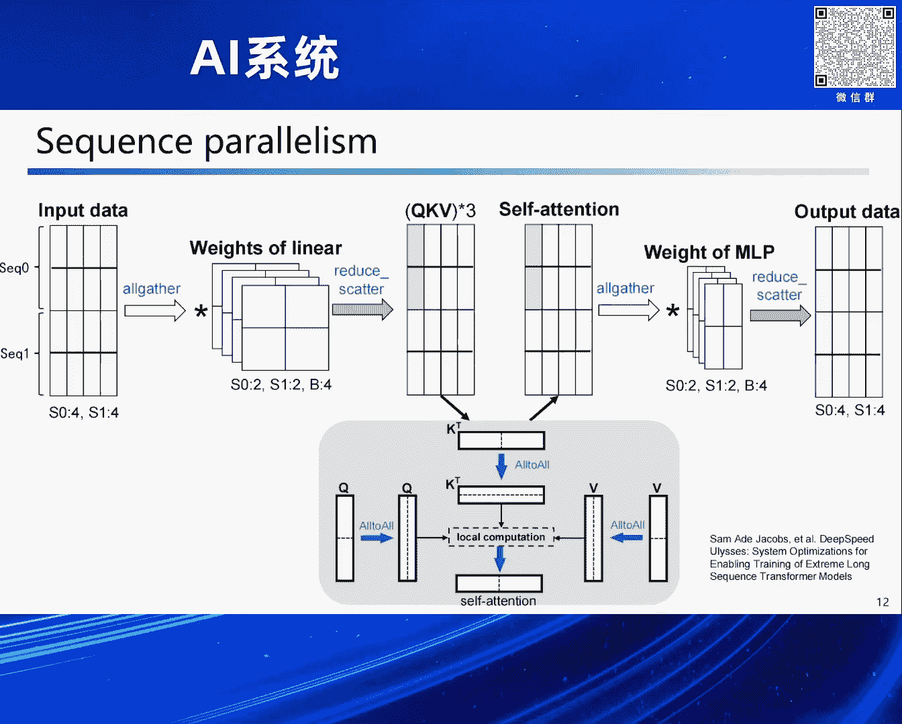

那总体而言这两种方法它是各有优缺点的，就第一种就run gather的话，它的通信量是非常高的呃，因为all gather的通信量是和输入数据的总量，是成正比的，那随着进程数的增加。

它并不会降低这个通信总量，但是呢它可以实现一个比较好的计算，通信隐藏呃，尤里西斯里面的奥托奥这个通信，它的通信量是较低的，因为auto all的通信，它只和进程的本地数据量成正比，所以随着进程数的增加。

也就是序列并行度的一个增加，它的通信量是成比例下降的，但是这种方法的话，它不太容易实现计算通信的隐藏，而且尤里西斯里边这种它的并行度，序列并行的并行度是受head的数量限制的，因此我们这里边。

也是将两种方法进行了一个融合呃，然后提出一种混合序列并行策略呃，简单来说就是在一个维度上进行auto all通信，然后在另外一个维度上进行run gather，从而拿到一个完整的序列。

那我们呃做了一个初步的性能测试啊，就在呃八张910B升腾卡上做了，对lama two的7B进行了一个测试，可以看到对于32K64K，128K等不同的序列长度，这种混合序列并行策略。

相比于单单独使用run algazer或者是尤里西斯。

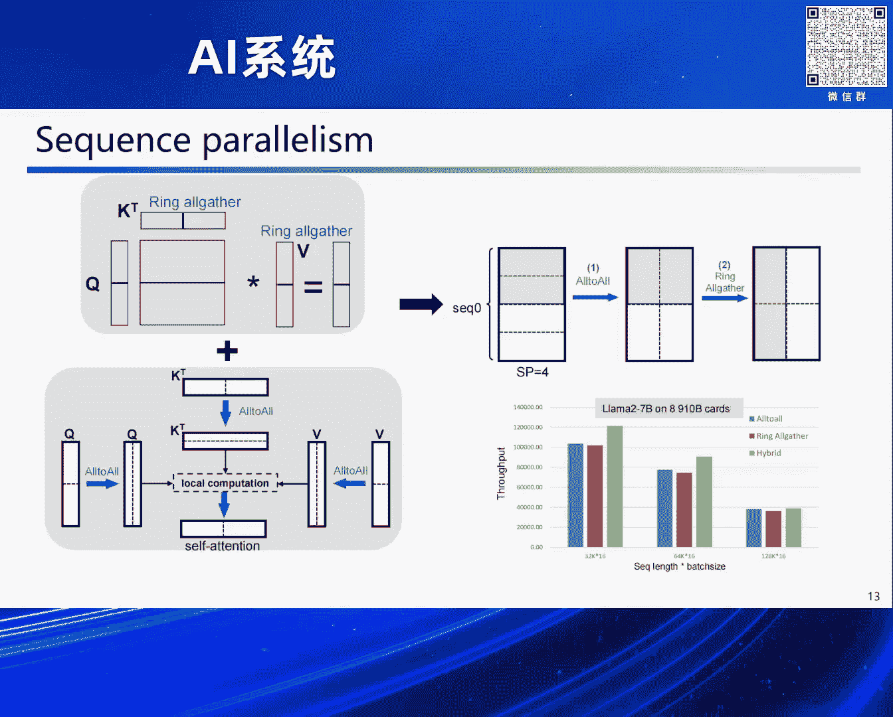

都获得了一个明显的吞吐率的提升，除此之外呢，auto d d l还它还可以支持更灵活的，通信拓扑的一个变换呃，因为在已有的这个工作里边已经证明，比方说对于我们矩形形状的这种矩阵乘法。

它需要在矩阵更大的维度上分布更多的进程，才可以得到一个全局最优的一个通呃，呃划分策略，那我们这里边，auto d d l也是支持这种灵活的，通行拓扑的变换呃，可以达到一个端到端的大模型的。

更低的一个通信开销呃，这里边就是还是以MARTYI的attention为例，因为在深呃深度神经网络里边，或者是大模型里边，也会经常遇到这种矩形形状的矩阵运算嗯，我以MARI的attention为例。

在第一个KOKV的线性映射层，它的模型参数矩阵是一个N乘三，N的一个矩形矩阵，那auto DDR在64张卡上，搜索得到的最优通讯拓扑是2×8乘四，也就是说我在3N的这个更大的维度上。

划分更多的一个进程之后呢，我们进行本地的这种呃自助力，自注意力计算，自注意力计算完之后，要接下一个MLP层，而下一个MLP层的话，它的模型参数是一个N乘N的方阵，那对于这个N乘N方阵来说。

它的最优的通信拓扑是4×4乘四，是一种更均衡的划分方式，那我们呃是在中间插入一个reduce scatter操作，和gazer操作，就可以灵活地将通信拓扑从4×8乘二，转化为4×4乘四。

那auto DDR，通过支持这种灵活的通信拓扑的一个变换呃，可以实现端到端的一个更低的呃通信开销，这在已有的并行框架里边是无法做到的。

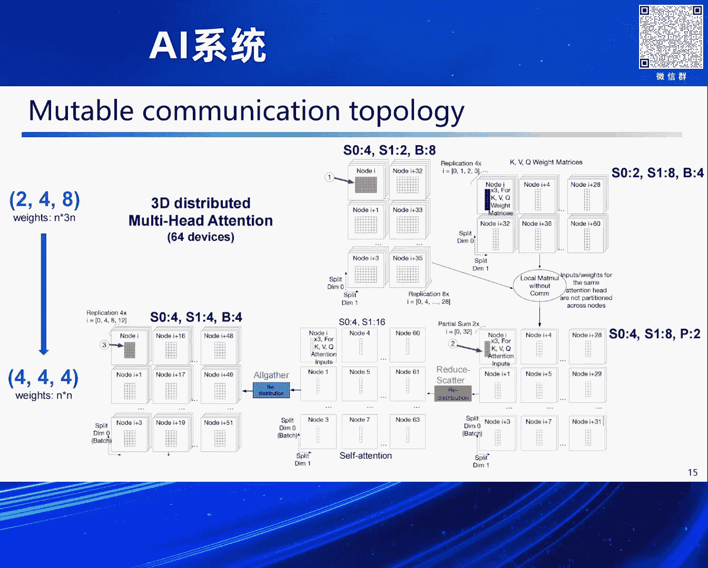

呃接下来来看性能测试，就是呃这四幅图是对，是在四个不同的神经网络上啊，对我们都呃就是auto DDR里边采用的梯度下呃，坐标下降的启发式搜索算法的，它的效率进行了个测试，可以看到相比于就是随机随机搜索。

以及呃flex flow里面使用的MCMC搜索方法，呃，我们采用的这种启发式搜索方法，可以在更短的时间内，搜索得到最优的一个并行策略，同时值得注意的一点就是，我们这里边是利用了前面我们构建的性能模型。

对各个并行策略的性能进行评估，而不需要在实际的机器上进行验证，所以整体的这个搜索过程，只要在笔记本或者台式机上，就可以很快的完成呃。

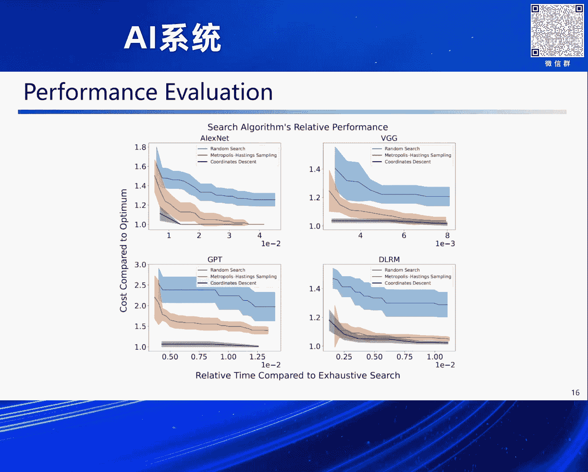

之后是呃在P4dent的超级计算机上，对几种不同的神经网络的最终性能，进行了一个对比呃，可以看到就是auto d d l搜索得到的最优的，这个病情策略，相比于我们手动优化的这种高度优化的，手工实现来说。

仍然获得显著的一个性能提升，呃，以transformer为例啊，就是相比于这种配置最优的Mac trl m的这个呃，并行策略配置，Auto d d l，仍然可以获得30%的一个吞吐率提升。

并且随着进程数的增加或者卡数的增加，auto DDR的它的性能优势也更加明显，这也说明就是，auto d d d l搜索得到这个并行策略，它的并行可扩展性更好呃。

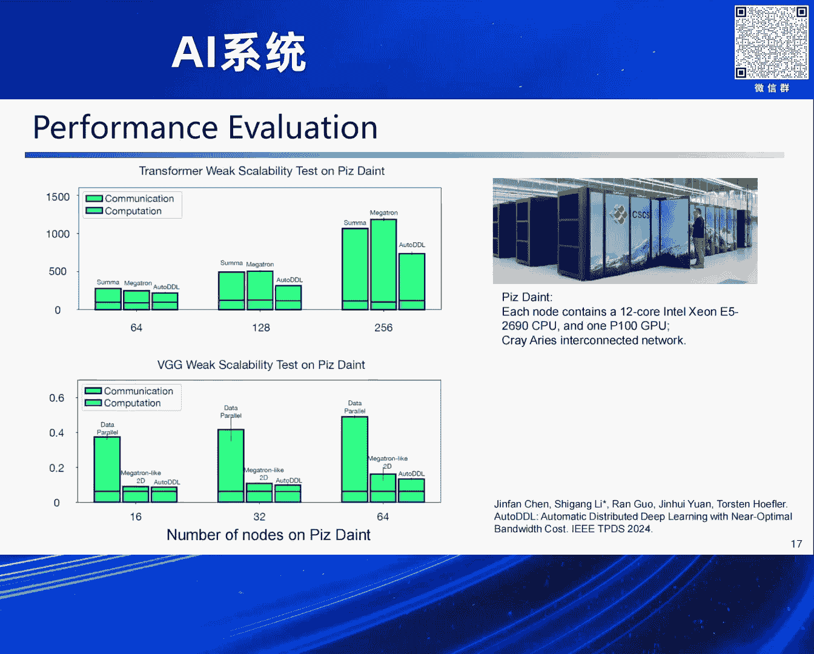

接下来是流水线并行维度，前面在敖一龙老师报告里面也说，就说我们流水线并行，它主要面临的问题是呃空泡问题，当然现在也有大量的工作对流水线空泡呃，进行了一呃一定的缓解或者是解决呃。

在我们前期工作中也提出一种，就是双向流水线并行机制，凯MIRR，它可以将两个方向的流水线进行融合，从而大幅降低流水线空泡的比例，但是无论是呃凯米尔，还是后续出现的一系列流水线并行的工作。

他都没有办法完全消除空泡，或者说它消除空泡的话是有一定代价的，因此我们这里边是尝试另外一个技术路线，就是能不能在流水线空泡中，填充一些有用的计算，从而来提升硬件的一个利用率。

呃具体来说我们是在流水线空泡中呃，填入二阶优化方法的一个计算负载，从而来呃加快这个端到端的收敛速率。

那首先简单介绍下什么是二阶优化方法，二阶优化方法就是用二阶梯度，而二阶导数也就是梯度的梯度来进行模型更新，那相比于一阶方法而言，就二阶方法它拥有更多的一个优化信息，因此它可以将多个训练内造步。

多步兵为一步，然后进行模型的更新，因此它可以相比于一阶方法而言，可以大幅提升模型的一个收敛速率，那从数学公式上来说，二阶方法和一阶方法的不同，就是在一阶梯度的基础上，要乘以一个曲率矩阵的逆。

对一阶梯度进行一个预条件转换呃，那这个曲力矩阵呢根据不同的二阶方法，它的定义也是不一样的，比方说牛顿法里边，它的曲率矩阵就是黑森矩阵呃，自然梯度法里边，它的曲率矩阵就是fisher信息矩阵。

那我们这个工作主要是针对这个自然梯度法的。

那无论是自然梯度法还是牛顿法，这个曲率矩阵的计算，还有曲力矩阵求逆的计算，它的总体的计算开销是OP的三次方，这里面P是模型参数量，这对于我们大模型来说是无法接受的，实际的性能测试表明，虽然就是二阶方法。

它可以大大提升这个模型的收敛速率，但是它单步的执行时间太高了，导致呃在端到端的一个训练时间中，甚至是长于这种传统的一阶优化方法。

因此就是有工作就提出呃，二阶优化方法的近似求解方法呃，KFC它是主要是针对自然梯度法的，当然还有其他一系列，比方闪闪扑啊这些其他的近似求解方法，那我们这里边是以这个KFC为例，KFC的话。

它是利用了克尼克因式分解的，一个非常好的性质呃，它可以将这种大矩阵近似为两个小矩阵的，克洛尼克乘积之后，对这个大矩阵进行求逆，它就转化为两个小矩阵克洛尼克乘积的求逆。

它同时又等于先求逆再进行克洛尼克乘积，从而它可以避免在大矩阵上进行一个，求逆的运算，从而它可以将二阶优化方法的计算，复杂度大大降低，通过实际性能测试表明，它可以将端到端的一个训练时间呃。

相比于这个一些方法有一个显著的降低呃。

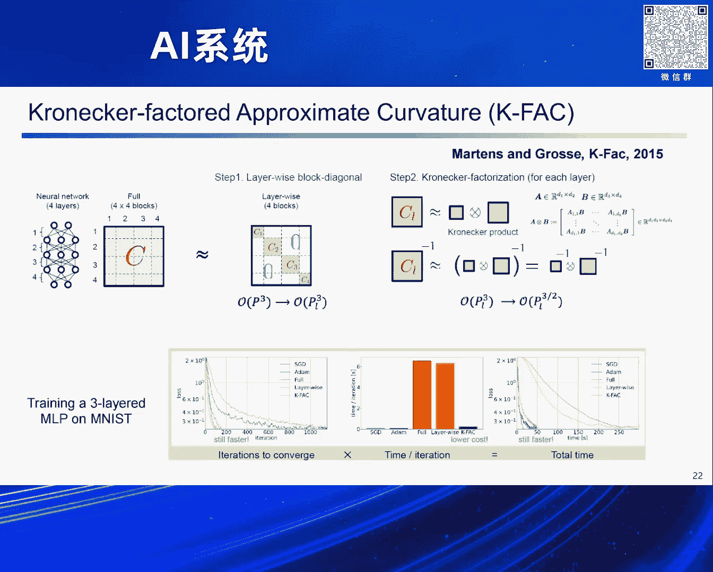

接下来简单看一下，就是KFC的它的一个计算过程，首先它要计算两个曲率矩阵，就是A和B，其中A曲率矩阵的话，它是等于输入数据乘以输入数据的转置，B矩阵的话是呃误差矩阵乘以误差矩阵的转置。

之后要对这两个曲率矩阵进行求逆，但这里边AB两个矩阵是比较小的矩阵，对其进行求逆操作，它的计算开销也也也并不高，最后的话是呃将这个AB矩阵的逆呃，与一阶梯度相乘，完成预条件转换。

这是KFC的一个就是总体的一个计算的负载。

之后，我们来看如何将KFC计算负载，填充到流水线空泡里边，我们这里边还是以最简单的g pp，这个流水线方案为例啊，呃首先我们就是对呃，流水线里边正向传播和反向传播计算时间。

以及流水线空泡的一个占用时间进行一个测量，然后是对二阶计算负载，包括曲力矩阵，曲曲力矩阵求逆的运算呃，它的计算时间进行一个测量之后，我们把二阶计算负载填充到流水线空泡中。

它的总体的一个填充原则，就是说我们只利用流水线空泡呃，而不去影响原来的流水线，或者尽量不去影响原来流水线的一个，总体执行时间，呃，也就意味着我们能填充多少就填充多少，这样达到的一个效果。

就是说我们并不能保证在每个训练迭代部，都对二阶的这个曲率矩阵进行一次更新，实际的一个优化效果，就是说我们可以在大概每一到两部，能够更新一次曲率矩阵，但是这个呃这这种效果的话。

相比于已有的这种二阶优化方法，也已经是大大提升了，这个曲率矩阵的一个更新频率，从而可以使我们二阶优化的话，达到更好的一个收敛效果，呃最后是在就是bert large这个呃预训练。

端到端的预训练上做了一个性能测试，可以看到就说呃，融合了这种二阶优化方法的，凯米瑞尔流水线优呃，这个并行方案和凯米尔，是采用这种传统的一阶优化方法，它可以将bart large这个端到端的预训练时间。

降低30%以上，好最后是对呃今天工作的一个简单总结呃，首先我们基于3D分布式矩阵乘法模型，对auto d d l里边搜索得到的并行策略，进行了一个简单阐述，呃，之后是介绍了就是混合的序列并行策略。

以及二阶方法和流水线并行的一个融合，那在接下来的工作中，就是大模型在互联网络拓扑，还有高性能推理方面仍然面临一系列问题，在前边就是袁老师也提到，就说尤其是在呃这种大模型推理这个方面。

除了就是我们profile第一个阶段，后边我们逐个token生成的时候，由于我们和k v cash结合使用，它一次生成一个token呃，那它对应的一个算子，其实是GEMV的一个算子，所以它经过了一个。

就是说从GEMM往GEMV的这么一个转换，从计算相当于是一个计算密集型的，一个计算负载，转化到访存密集型的一个负载，所以这里边还有很多问题，需要我们进一步解决好。

以上是我报告的呃，全部内容，感谢大家好。