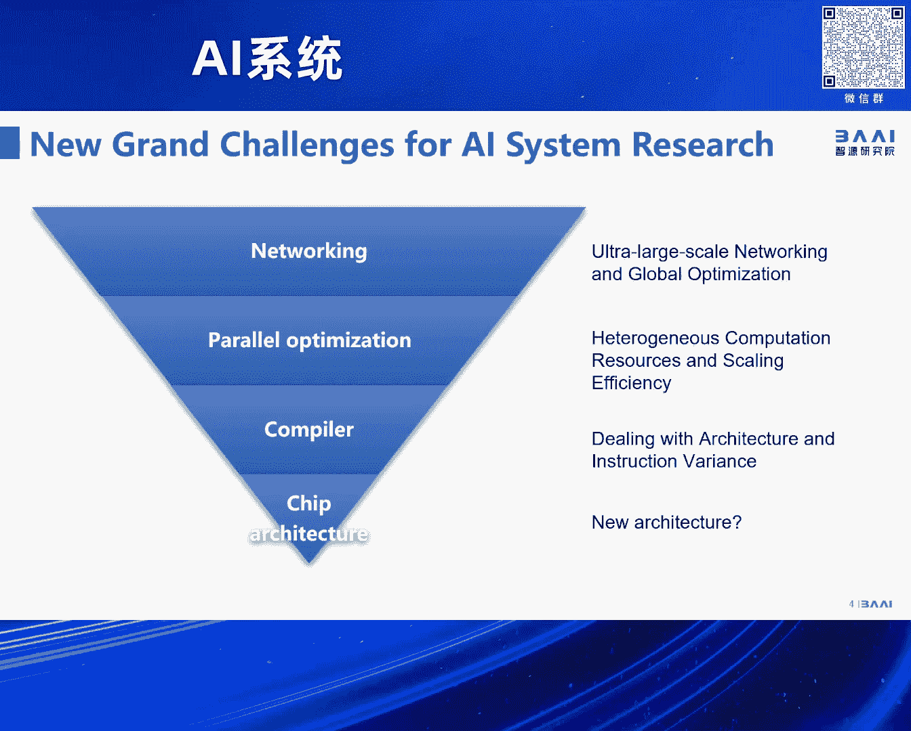

# 2024北京智源大会-AI系统 - P1：论坛背景与嘉宾介绍-林咏华 - 智源社区 - BV1DS411w7EG

好，歡迎大家參加今天的這個志願大會我們的AI系統論壇，這個論壇是整個大會裡頭唯一一個承載的所有的大模型所需要的，AI所需要的跟算力相關的所有的系統的問題，那作為一個opening呢。

我還是想再給大家從幾頁簡單的片子來強調，為什麼我們今天這個論壇很重要，那首先我們看到，Sorry，因為我們有一位外賓，所以我稍微把有一些title翻譯成英文，那首先第一個我們看到新的大模型的趨勢是說。

更大的模型，更多的參數，從千億參數的蟲米模型到萬億的西數模型，包括我們可能會看到今年會有萬億的蟲米模型，那另外更多的模態，尤其在更多的模態的帶動下。

其實我們的sequence length會由之前的幾千token，已經步入到幾百token，甚至是幾百k token，甚至到幾百萬token這樣的一個量級。

這些token的length實際上也是對我們的系統帶來很多的挑戰，那此外數據無疑也是增大了很多的數據量，無論從語言模型，LAMA，從去年的LAMA2到LAMA3，而今年我們看到大量的大模型。

要考慮他們在多模態，尤其是視頻生成上的，這些無疑使得我們的訓練數據機又是翻了好幾個量級，這些東西都是給我們算力帶來更多的需求和挑戰，那另外一方面其實我們並不覺得大模型的算法已經匯聚了。

去年雖然我們在語言模型上好多都是走GPTR這樣一個路線，但是隨著這個模態的多樣性，還有模型結構大家更加大膽的去嘗試不同的這種結構，因此我們看到其實算法已經在今年步入到了一個百花齊放的一個情況。

那意味著我們底層的算子其實需求是更加變化的更多，我們又沒有能力去catch這麼快的一個算子的變化，放到我們的系統，尤其是這麼多的不同的架構，所以綜合我們看到是說，這個是我們看到的整個在AI系統的挑戰。

從底往上依然我們是離不開我們芯片架構的創新，那芯片架構是否有未來還有新的芯片架構的一個出現，或在已有的一些新的指令集上面的一個拓展，倘若我們已經有了很多的當前我們已經有了很多的芯片的選擇。

更多的未來的架構，那我們從編譯器層面我們怎麼去解決不同的架構，包括指令集的變化，那再往上我們作為這個越來越大規模的這個集群，大家一起要高性能的去遜模型或推理模型，那當我們面對這些更大的架構的時候。

它的整個scaling efficiency能不能保持得住，或是說它怎麼去優化，另外當我們面對不同的算力架構，這些異構算力怎麼樣子能夠被我們的這樣子的一個並行的，又優化並行的這些框架統一起來。

那再往上大家也看到了，大家今年都在談萬卡集群萬p集群，幾萬卡都要在一個集群內進行高性能的訓練可能同一個模型，那我們整個組網方案其實對網絡技術發展了那麼多年的網絡技術又有新的挑戰。

所以這個是這個圖我是希望用它來涵蓋我們今天眾多的講者，我們今天應該有八個還九個topic，從底到上涵蓋所有這些topic，所以也很有幸請到了相關各個領域的專家來給我們分享他們的想法。

面對這些挑戰的想法以及他們最新的一些成果，更多的是他們對未來的一個思考，今天的我們的topic我再說明，這個安排不分先後，主要就是我們希望把從底到上給大家做一個釐清。

那希望大家能夠盡情的享受今天上午帶來的，整一個我們在AI系統各個領域的一個韜貼盛宴，好謝謝大家，谢谢大家，謝謝大家。

