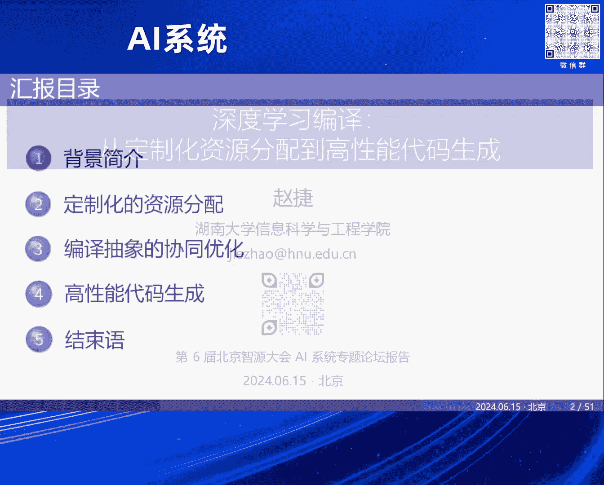
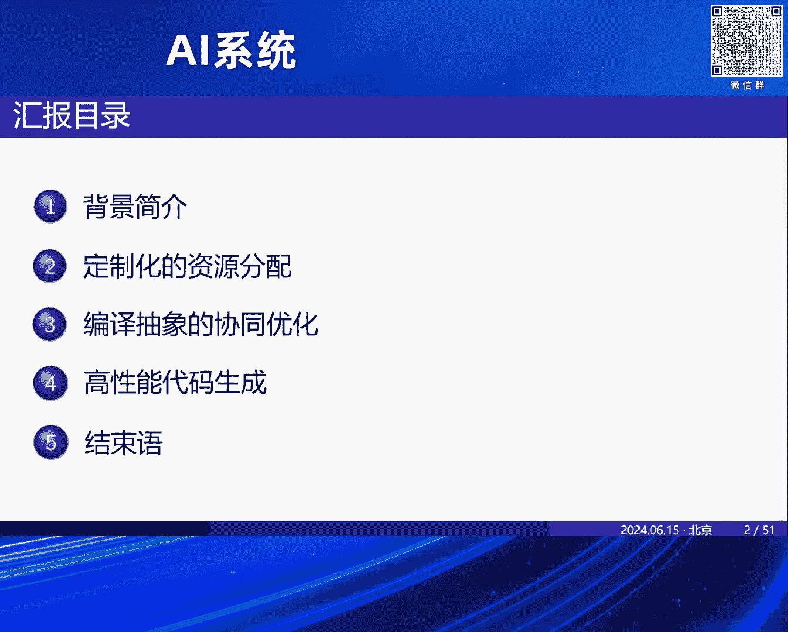
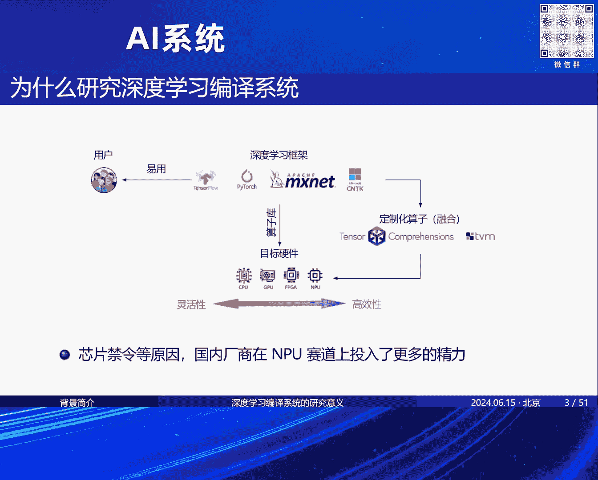
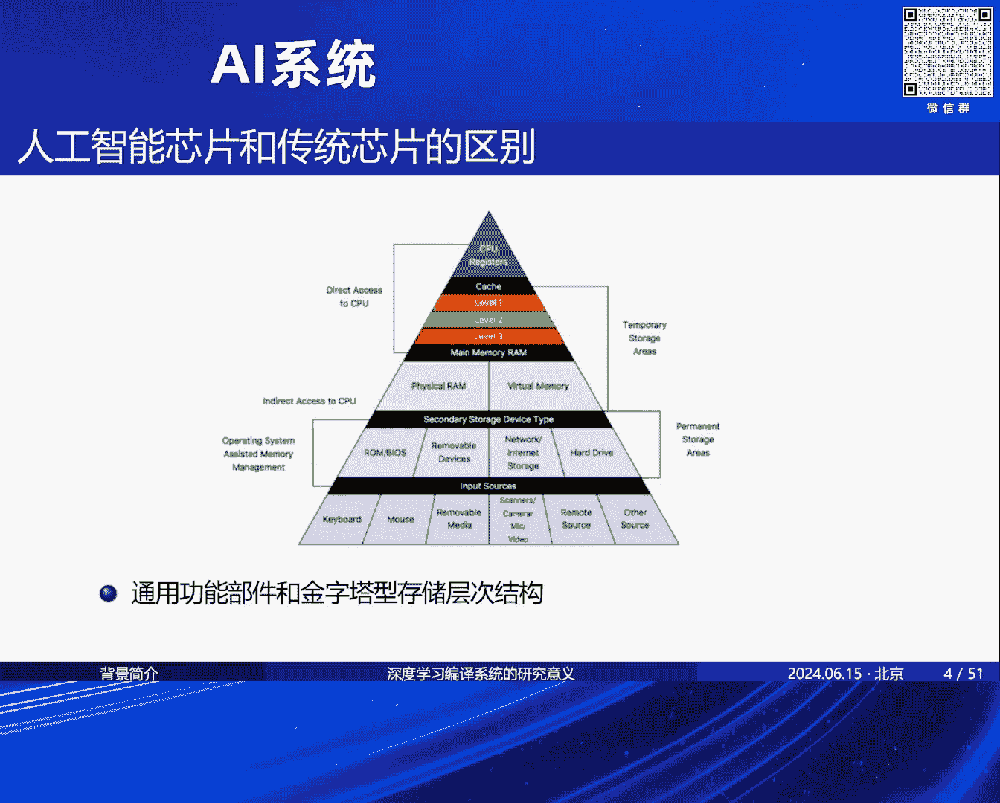
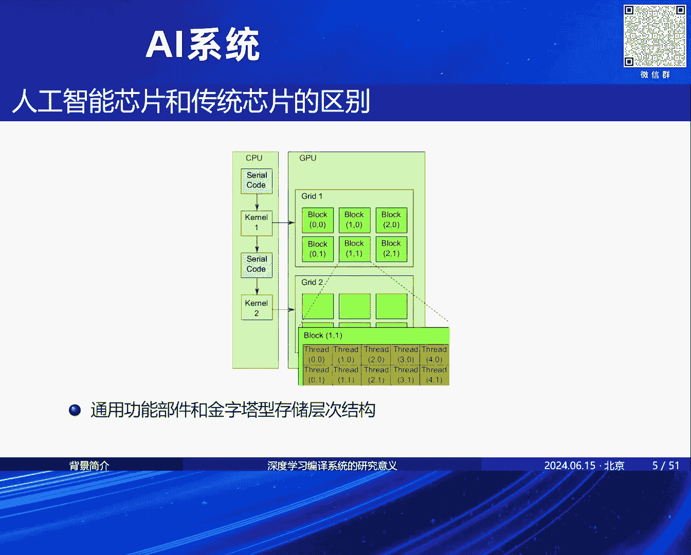

# 2024北京智源大会-AI系统 - P5：深度学习编译-从定制化资源分配到高性能代码生成-赵 捷 - 智源社区 - BV1DS411w7EG

OK，谢谢林院长介绍，然后我今天非常荣幸到这里给大家汇报一下，我之前做的深度学习编译方面的工作，然后汇报的主题是从定制化资源分配到下边的高性能代码生成，整个过程是涉及到深度学习编译里边。

从上层的一些调度到最后跟硬件架构非常相关的一些，代码生成的这样一些经验，然后这个是我汇报的主题的一些。

汇报的内容，先说一下我们为什么要做深度学习编译系统，当然这个可能在座的各位都可能会比较了解了，就是说原来我们有深度学习框架的时候，它的这个工作模式是为了能够直接用底层厂商提供的这种算子库。

来直接适配这个东西，然后适配完了之后呢，去这样把它的这个框架这个工作流程给完成，但是呢有一些，我们总会遇到一些之前我们没有去见过或者是没有实现的这样一些算子，那么这个时候呢我们是希望用那个编译器。

去完成这个自动生成的这样一个过程，所以深度学习编译器的这个研发的背景是这么一个背景，然后我们呢是可以面向不同的这种芯片，包括像这种CPU以及现在国内比较就是投入比较多的。

也是因为这种国际大环境的这个影响，投入比较多的这种AI领域特定的这种芯片，那么我们针对这种领域特定芯片的做了一些工作，然后给大家汇报一下，那么做这种领域特定芯片的时候。

我们发现和传统的CPU和GPU最大的区别是什么，最主要的区别就是我们在这种那个AI芯片上去做code-jet，或者编译优化的时候，我们必须要考虑它的这个存储模型。

比如说像CPU和GPU上我们传统的是这种比较典型的这种金字塔型的这种存储模型，对吧，那么你数据在这个存储模型上肯定是直上直下这么流动的，像GPU上也是这样的。

比如说它通过抽象出来这个up-thread和thread-block的这样两极并行抽象，但是呢在AI芯片上它不是这样的，比如说我们比较早期的这种AI芯片是吧，像这个计算所这边提出的这种电脑序列芯片。

你很多数据是输入和输出的时候，它的位置是不一样的，它不像原来传统的这种金字塔型的存储层次结构，同样也有这个TPU的这个存储层次结构也是不一样的，比如说你这个数据通对这个里边最核心的功能部件矩阵程。

从这种这个weight的这个buffer去取数据之后，它把数据放在这个accumulator上，然后后边它可能会做一些其他的这种计算函数的处理之后，再放回它这个所谓的这个ubuffer里面去。

那么我们可能国内的一些厂商，比如像华为的升腾c也是采用了类似的这样一个存储层次的这样一个设计，所以它这个上面的这个数据流的这个管理是和传统的CPU和GPU的这种存储模型是不太一样的。

那么我们针对这些就去总结了一下，现在这种深度学习编译的这样一个形成的一个比较固定的这个流程，也就是说你给了一个这样一个深度学习的网络之后呢，我们会把它编译成，会把它表示成一个计算图的这个形式，然后呢。

通过这个计算图呢，我们再把这个计算图去切成一个一个的小的这个字图，对吧，然后这个小的字图呢，再转换成底层的这种，呃，循环的这样一个表示，那么循环表示呢，我们会利用我们称之为算子编译器的这个东西呢。

去做一些优化，然后在最后呢，去适配底层硬件，做一些code-gen的这样一个工作，但是，呃，包括刚才那个呃，研究会老师他现在不在了，他他也提到这个东西呢，我们现在做这个，呃，软件站的这样一个设计的时候。

你做各种抽象的时候，每个抽象之间可以做自己的这个独立优化空间的探索，他把这个抽象，呃，这样分割开来是为了能够把优化空间，搜索范围变小一些，但实际上有的时候这种分割的这个形式呢，会导致你，呃。

优化的空间也会变小，所以我们实际上，在这种比如说在跨，呃，模型结构和计算图表示，以及图层和算子层编译的这种，不同编译抽象之间的协同之间，也有很多，呃，优化的机会，那么这些边。

这些抽象之间的这个优化机会呢，可能会给你带来一些。

呃，额外的性能收益，比如说第一个我们说，呃，就是我们说的这个所谓的定数化的资源分配，也就是考虑了一些，呃，上层算法和，呃，你怎么去，呃，在这个硬件芯片上做资源调度的，这样一个结合能够让你去更好的。

去得到一个，呃，调度的这样一个结果，呃，譬如说我们，我们针对这种，呃，应，呃，就是，叫什么，AI的这种，领域特定的芯片，做了一个，呃，它的架构的这个抽象，比如说我们可以总是，呃，一些芯片啊。

就可以总是把它抽象成有，呃，有这么低格的cluster，然后每个cluster上面有，有seq chip，对吧，然后每个，每个chip上可以有，不同的这个计算功能部件，那么针对这种硬件去，硬件抽象去做。

呃，调度的之后，调度的时候呢，我们有的时候是可以考虑，呃，是可以考虑，你输入模型本身的，这个特征，比如说，呃，我们原来传统的这种编译器里边，呃，传统的这种AI编译器里边，它在做底层。

底层的这种调度的时候，它会看得非常细，也就是说，看得非常底层的这种，比如说，卷集算子，或者是说后边的这种，呃，编算子，它们之间的这种融合的可能性，但是实际上如果你，把你的这个视野，放得更高一点。

那么整个模型的结果，模型的架构上，比如说在这个RES950上，它可以划分为四个阶段，是吧，那么这四个阶段之间，其实因为这个网络模型本身的特征，它可能会对输入图像会做一些，特殊的操作，比如说，呃，呃。

图像进来之后，我们可能会做向下采样的这样一个操作，对吧，那么这个向下采样的操作呢，会导致你整个，呃，输入图像在穿过这个网络模型的过程当中，它占用，呃，内存的空间大小在不断变小。

那么如果你采用传统的方式，去不断的切割这个，切割这个网络模型，比如说我们就从比较粗的力度来看，这个网络模型我把它切成四份，对吧，那么你，就是按照原来这个方式把这个，图像呢，就因为它是端着端着嘛。

你整个切成四份，按四个阶段来切，每个阶段来处理的这个batch维度是一样的时候，那么由于你有中间这种向下采样的这样一个操作，可能会导致你比如说，像这个第二阶段第三阶段，它对，呃，它处理的这个数据。

占用内存的空间会越来越小，那么这个时候，呃，像AI chip这种，呃，就是，片上缓存比较，呃，珍贵，资源比较珍贵的这种芯片来说，呃，实际上它后边这个缓存利用率是越来越低的，那么这个时候实际上你可以。

把你输入图像，按照不同的batch维度去切分，那么这个时候按不同的batch维度去切分的时候，你可以形成一个，跟传统的这种平均切分的这种方式，不一样的调度方式，比如说你在第一个stage阶段。

你可以只处理一个图像，也就是说按照一个batch维度去切，对吧，然后后边呢，你可以按照两个batch维度，四个batch维度这样去切，这样的话就可以，形成一个比如像这个图里边，按照这个图里边，呃。

图片上显示的那个数字的，顺序形成的这样一个，非常规的这样一个调度，那么这种调度过程呢，有一个比较好的优势是什么呢，它可以，在保证你每个阶段处理这个图像的，过程当中你，AI芯片的这种片上的缓存可以。

能够得到最大化的利用，这样的话就会导致，呃，你后边会有一个更好的一个性能提升，所以我们利用这种方法像，在我们这个，国产的这种信母计算的这个芯片上，去做了一个性能，去做了一个实验，然后和传统的这种，呃。

就是平均切分的这种调度方法去相比较，还是有不错的性能提升的，对这是第一部分，关于定制化资源分配的事情，那么第二部分呢就是，呃，我们叫编译抽象之间的这种协同优化，我们呃，可能比较熟悉的是，呃。

甚至学习编译呢，它本身可以，嗯，比较笼统的说是一个图层，和算子层的这样一个，呃，编译优化的两个阶段，那么图层图层上呢，我们给定一个，呃，神经网络的这个计算图之后，我们就把这个计算图呢，呃。

划分成几个子图，对吧，然后划分完子图之后，再交给下边的这个算子层编译器，做一些循环优化，然后通过循环优化呢，去做后边的这个塔玛生成，但其实这种方式呢，有个问题是什么呢，就是我划分完这个子图之后。

我完全不管下边算子层的这个编译是否，能够编译出来，或者是说，我编译这个子图，是不是需要一个比较大的编译开销的这样一个问题，所以针对这个问题呢，其实我们做的一个尝试呢，就是说把，算子层的编译器的一些约束。

反馈给图层编译器，那么比如说给定这样一个计算图的时候，这个图呢，我们肯定就是会做一些常规的操作，做一些这个数据流啊，控制流的这个优化，把图尽量简化一些，这是常规操作，那么为什么我们会考虑一些。

把这个怎么去考虑底层算子层的编译器，给图层算子层编译器的这样一个约束呢，比如说，比如说我们这里，这里边有一个比较常规的这种，几乎函数吧，这个几乎函数呢，它有，实际上有两个操作构成的，首先第一个操作呢。

至少有两个操作构成的，然后，第一个操作呢，是它前边的这个，九合取对数这样一个操作，那么后边呢是一个减法操作，那我们知道因为这个芯片，有限的这个片上内存资源呢，我们有的时候，不是说有的时候。

现在基本上形成了，就包括刚才这个白博士说的，这个，形成了一个以Tile，抽象为基础的这样一个编译流程，你肯定是要做一个，循环或者是说数据的这种分块的这样一个操作，那么你做完这个操作呢，对于这个算子来说。

你前边做这分块之后，因为前边的这个，是一个九合取对数的操作，它本质上是一个规约操作，那么你做完分块之后，想把，减法和前边的九合取对数操作，再把它合并起来，这种操作呢实际上是没有太大的意义的。

因为你肯定是要把前边所有的，就是规约的这个操作，做完分块再合并之后，就是把它的这个规约操作，全部规约完了之后，才能够去把后边的计算，才开始执行，所以你分块完了之后，把减法的分块和九合取对数的这个。

分块想合并在一起是比较困难的，那么针对这个问题呢，我们就把这个，本身原来这是一个比较大的，我们称之为复合型的算子，把这种复合型算子呢，我把它打开，打开就是说，看更细腻度的这个图。

针对这种更细腻度的这种算子呢。

我们做了一些定义，按照这个定义呢去，把这个图呢，从更小绿度的层面上去做一些合并，形成一个以更小绿度的算子为基础的，这样一个，就是，字图，然后把这个字图呢，交给下边的这个算子层编译器，去做一些优化。

那么做这个事情的原因呢，就是说我们算，刚才我们说过嘛，就是把算子层编译器的约数，反馈给图层编译器，这也就是因为，我把这个更小绿的这个算子，形成的这个字图，交给底层的算子层编译器之后。

它是能够比较好的去做，循环变换的这样一个事情，那么每个算子层的，每个图层的这种，更小绿度的我们称之为，原子算子或者原算子这样一个事情，它形成了一个完美的这样一个循环嵌套，也就是说，循环，之内。

就是循环嵌套之内，只有最内层是一个语句，那么这样的，这样的算子交给算子层编译器的时候，它才能够更好的做一些，更方便的更容易的做一些循环合并，循环分块这样一个事情，那么循环合并循环分块，类似这样一个优化。

可能之前，无论是做这个传统编译器，还是说现在，前段时间之前我们做这个AI编译器，它都会比较常的，比较经常涉及到这个事情，那么两种方案，第一种就是像，TVM这种。

我写这种Schedule Primitives，然后还有一种方案，就是我们用这个，Polyphysic 的这个技术，能够把左边的这种两个循环，可以自动的合并成右边的这样一个形式，那么通过。

这样一个自动化的一个手段，还有前边图层更小，更细微的这种，算子的这样一个融合的这个Pattern，我们是能够把一些原来不能够融合的Pattern，融合在一起，减少一些这个，子图个数的生成，然后最后。

因为融合的这个能力，它能够减缓一些，减少一些这个数据移动的这个开销，那么再往下，就是我们做这种算子层编译器，AKG的这个编译器，然后AKG编译器，它的这个整体流程，我放在这，大概就是说我们最开始的时候。

是基于这个TVM的这个0。6版本，去做的这样一个开发，然后它会转成这个HighlightR，再把HighlightR，转到我们这个Polyphysic的，这样一个Schedule Tree的。

这样一个中间表示，那么Schedule Tree，其实可能在，MLR的这个设计里边，你也可以看到一些简化的，Schedule Tree的这样一个表示，然后所有中间的用法。

都是基于这个Schedule Tree的，这种中间表示，去做的一个设计，比如说我们刚才说到的这个，循环分块，循环合并，以及它可能会自己算一些，调用一些底层的这个LOP的，这样一个过程，去能够自动的判定。

这个某些循环，某些循环维度是否能够做Fusion，是否能够做Tile，这样一些事情，那当然呢，这个Polyphysic里边，它算的是能不能做这些事情，到底哪一个Tile，Size多大比较好。

然后Fusion个数，到底是应该什么样的，还有包括刚才我们说的这个，Loop Unload的这样一个因子，到底多大，这个可能还是需要做一些，Auto Tuning的这个事情，那么AKG的这个具体流程。

我们在这里不展开细节了，因为它中间它会涉及到一些，就是说白了就是，有一些数学运算的这样一个方式，根本就是在底层上的话，其实就可能算一些，这样一个数学表达式，去做一些Fusion。

Tiling的这样一个适配，然后我们是针对当时，就是生腾的910这个芯片，去做的这样一个Code Jam，它里边会有一些定时化的优化，然后会做最终的这个代码生成，对，这个最后我们也有一些。

结合着这个华为的这个Mouseboard，做了一些测试，但这个测试结果可能都比较早了，因为现在Mouseboard的，本身的这个模型库，可能也比这个要多得多，然后第三部分就是，我简单过一下。

就是我们针对特定的这种算子，会做一些领域定制化的，这种高性能的代码生成，因为你要生成比较高性能代码的话，最终还是要靠一些，离不开手工的这样一个实现，那么我们针对，比如说像在GPU上。

我们做这种规约算子的开发的时候，前端我们是会把一些，深度神经网络里边的这种，算子 规约算子去做一个归类，那么这种方式是允许你能够，把你的关注点集中在，三种不同的类型上，那么怎么把规约算子。

转换成这三种标准形呢，我们是给了这样一个，就是转换公式，就转换这样一个公式，可以把任意的这种规约算子，转换成这样一个形式，那么你转换完了之后，我们可以把无论是，规约的这种并行轴，还是这种规约轴。

都可以映射到，比如说GPU的两极并行抽象上，通过并行抽象之后，实际上最重要的是，你那个规约轴做了并行，规约轴做完并行之后，我们在最内层去调用一些，手工的这种高性能的算子库，这种算子库是。

华为的工程师自己写的，那么它可以写一个，固定Shape的这样一个形式，那么通过编译器呢，你是可以通过硬件绑定，还有优化的这样一个方式呢，把任意规模的去映射到，这样一个库上面，在最内层呢。

是通过利用这个硬件本身提供的，这种原子算子去保证，规约算子的这种运行的正确性，那么还有一种呢，就是说我们面向这种，像比如说神威平台上的这种，矩阵长的高性能的这种自动代码生成，那么针对神威平台的话。

可能就是它本身的，和传统的平台的这种架构呢，不太一样，是由一个组合和多个这个，存合阵列构成的，那么它上面呢，存合之间有一些通信方式，然后组合，存合之间呢也会通过一些DDR啊，去传输一些数据。

那么这个时候呢，你是要用编译器去考虑你自己本身，就是硬件本身的这种，消息传递方式的这种模型，然后通过这种方式呢，我们去也是在编译器里面自动生成，然后最内层呢也是一个，神威的这个平台提供的这种。

汇编的这种Maker kernel，那么同样跟刚才那个工作原理是一样的，就是我们编译器要做的事情呢，就是把任意规模的这种矩阵长，去映射到你这种，固定Shift 64*64*32的这样一个。

汇编的这样一个小库的这个过程上，然后这种效果呢还是很不错的，比如说可以达到这个神威平台，理论峰值性能的90。14%，甚至是他们提供了一些这种手工库，可以达到这种手工库的性能提升，大概有将近10%左右。

这个手工库是已经经过了非常好的优化，但当然编译器可以支撑的，就是说刚才我们说可以有一些，定制化算子的这个生成，比如说它可以做，可以做前项融合也可以做后项融合，那么这个时候呢，无论是前项融合还是后项融合。

都相对于手工库有更好的这样一个性能提升，好了 以上就是我这个做深度学习编译的一些经验。

然后谢谢大家，謝謝。