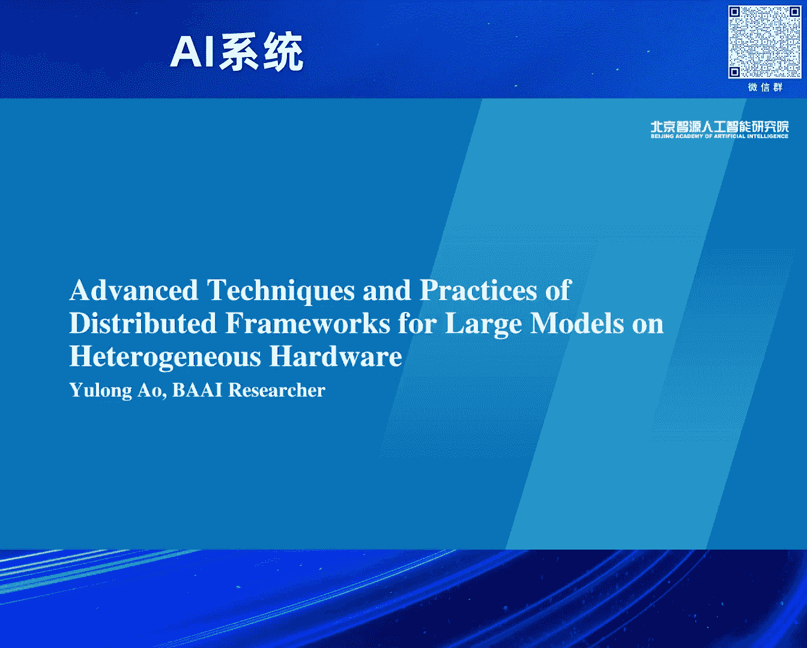

# 2024北京智源大会-AI系统 - P6：多元算力下大模型并行训练框架技术与实践-敖玉龙 - 智源社区 - BV1DS411w7EG

Hello，大家上午好，非常高兴跟大家分享，在多元算力这个时代，致源在过去一年，所进行的一些技术探索和应用实践，首先想跟大家分享一个事实。

其实前面的老师也讲过，就是说不管大家是否承认，我们其实已经身处在一个多元算力的这样一个时代，当我们的使用者面对多元算力的情况下，不自然的都会有各种各样的需求，比如说我能不能在两款不同的芯片上。

做一个高效的易购混合训练，比如说我能不能在一款新的芯片上，实现一个端到端的非常高效的这样一个训练，同时就是说，算法同学可能就说，我不管在什么样一个芯片上，你能不能支持任意长度的这样一个序列长度。

当然说更多场景是因为业务或者一些政策，我们不得不从一款芯片迁移到另一款芯片，致源作为一个模型的训练者和系统的研究者，我们同样会面临这些需求，甚至说挑战，今天我主要也是从这四个场景跟大家做一个分享。

让大家看看致源在这一块跟我们的合作伙伴，甚至说硬件厂商是怎么去解决这些问题的，首先第一个场景就是怎么实现一个，高效的易购混合训练，一提到易购混合训练，大家首先可能想到的就是挑战，的确挑战是非常多的。

我这块的话列了，分了类从四个方面跟大家做一个分享，首先第一个挑战就是说，两个不同的芯片或者多个不同的芯片，做一个核持，那性能，大家想一想很自然就觉得会被，最差的那个所拖累。

这是因为我们不同的芯片它的算力，它能力是不一样的，另一方面大家的不同芯片优化的水平也是不一样的，第二个挑战其实就是通信，因为两款不同芯片之间，它的连接的拓扑以及连接的方式，大家往往是不一样的。

因为商业的原因的话，很多芯片是彼此根本不知道对方的，了解的信息是非常少的，第三个挑战就是说，多芯片下的这样一个任务调度，因为现在的大多数调度系统的话，其实还是同购芯片，那用户需要自己去。

来自己做一个很好的配比，来使用这样一个易购的芯片集群，最后一个挑战其实是，最终大家最关心的，可能或多或少对这个易购芯片下训练的模型效果，有没有保证还存质疑，这个原因很简单。

因为不同的芯片它内在的架构就存在着差异，然后算子的实现其实有，同一个算子有不同的实现，那怎么解决，经过一年多跟我们的合作伙伴以及，硬件厂商的协作，今天还是非常自信的跟大家说，通过系统化的思考。

以及去设计以及去实现，我们还是能，实现这样一个高效的易购混合训练，首先我们逐一的看看前面的几个挑战，比如第一个挑战就是说，那我们的性能会被最慢的拖累，那怎么解决呢，其实我们需要从框架层面上。

做一个更细腻度的任务，负载的一个划分，让每个芯片能够充分发挥自己的潜能，OK，就是说芯片它要物尽其用吧，不要被最慢的那个去拖累，那第二个挑战就是说，通信，那怎么办呢，其实我们在避免策略层面上。

我们可以要求，我们只进行节点之间的通信，那节点之间的通信呢，我们其实大家都是IB和ROCKET这种，非常标准的这样一个协议，OK，这块其实也是可以解决的，但是这依赖于厂商的一个支持和兼容。

第三个挑战就是说，关于多芯片这样一个任务调度的问题，其实这块的话我觉得是一个，呃，模式的一个转变，就是说我们需要从，以芯片为中心的这样一个调度策略，逐渐迁移到，以算力透明这样一个调度。

就是我觉得在未来的话，就是大家作为调度，用户其实他不关心，最好是不关心我要用什么芯片，我只是按算力付费而已，OK，我们这样的话会对我们的，系统的利用率有一个极大的提升，那第四个挑战就是说，模型的效果。

这块的话其实我个人的一个观点就是说，如果两款芯片做一个合置训练，效果无法达到同购的预期，不管是loss还是最终效果，我觉得可能其中有一款芯片是有问题的，那最好的解决方案就是去修这个问题，OK。

甚至说我觉得异构训练是检验芯片的一个，不错的手段，对，OK，那左右边的那个图的话，其实是一个大概的一个，解决方案图了，就是说我们其实神经网络有它的特性，它有很多层，当我们训练单一任务的时候。

我们会根据算力和内存的约束，去做一个切分，让每一款芯片去算自己的那一部分的子任务，那在最下面的层面上，我们跨集群的通讯主要存在，比如节点之间，OK，大概是这样一个思路，那通过这个系统化的思考和设计。

以及实现的话我们是，能够解决这样一个异构训练的问题，但下一步就是说怎么去把这个性能做一个，更大的一个提升，就是说真正实现异构高效的训练，其实这块的话我们一直跟天竖智芯，做深度的合作，在异构逼近策略下。

到现在已经经过了三版的迭代，从最开始的时候我们实现的是一个，异构的数据并行，这个其实也比较直观，就是说我按照芯片的能力，能力大的我处理的数据多，能力少的我处理的数据少，但这个策略的话也有一些问题。

首先它依赖于，首先数据层面上这样一个负载切分，它是一个粗力度的，很难做到一个非常精细的控制，第二个就是说，它需要不同芯片之间做oreduce，那做个通信的就比较了解，就是说不跨芯片的oreduce。

尤其高效oreduce还是非常之困难的，那我们就在这个基础上又，演进到第二代，就是说我们通过发现就是说，大模型时代，尤其AI这个方向，深度学习有很多的operator和层，那么我们就按照算力。

去进行层的一个切分，然后算力大的我就处理的层数会多，算力小的我处理层数会少一些，那这有两个好处，首先就是说这个认证切分的力度会更细一些，第二个好处就是说，我现在只需要P2P的通信，那这个难度就是。

尤其跨节点的P2P通信，这个难度一下子就降下来了，因为我们现在训大模型，基本上是用混合并行的策略，所以说尤其流水线，现在的bubble率已经，通过各种手段降得比较低了，但是这也有一个问题。

大家可以看到就是说，我们不同的芯片之间的这样一个，模型并行的这样一个维度，其实大家要求一致的，这带来问题就是说，一方面就是说，要求这个异构混训的，这样一个芯片的配比，大家还是要符合一些约束的。

第二个就是说它还是，没有进一步释放这样一个灵活性，以及优化的空间，那我们现在眼睛到第三代，第三代的话就是说，我们不要求这个，模型并行这个维度大家是一致的，我既可以由多变少，也可以由少变多。

那这样的话我们进一步的，相当于释放了这样一个，挑优的空间，第一个可能是大家比较关心的性能问题，就是说，我们是在不同规模，不同的配比，有不同代级之间的，也有跨架构之间的，就是后面三条线的话就是。

有两个是天数跟A800，有一个是木西是跟A800，就是说整体上我们通过这样一个，性能的一个统计和分析发现，就是说我们还是异构混训是，能达到一个很高的水平，尤其是跨架构的这样一个训练，也是很不错的。

大家可以看到其中还有一些，超过百分之百的这样一个性能，这是因为我们把两个小剧群，合成一个大剧群之后，我们还是解锁了一些优化空间，比如说因为我们，有更好的并行策略了，这样的话我们可以使用更大的。

Bi-size，也可以去关掉一些重计算，然后最后呢就是说最近我们，做这样一个更灵活的，这样一个TP异构策略，其实我们可以在这个基础上，进一步能提升大概30%左右，模型效果，当然这个是最重要的一个事情。

就我们还是在，从加载相同的checkpoint，持续训练了一段时间，在真实的数据局，也是我们FlagEvo这个平台上，做了一些评测，目前看的话就是说，其实diff还是非常之小的。

当然说我们也没法去完全规避这个，差异，因为是，首先我们的checkpoint是从，从同构拿过来的，但是我们要在异构上去训，第二个就是说，由于不同的芯片它能力不同，我们涉及到。

参数以及优化器状态的一个重切分，导致那个，随机种子其实我，以及随机状态我们很难保持一致，OK，但总体来说结果还是不错的，第二个就是说，怎么在一款芯片上实现一个高效的，端到端训练，从我们实际的一个。

尤其在一个，项目周期比较紧急的情况下，从我们实际的经验来说，还是从，算法层到框架层到硬件层一个，协同设计，是比较高效的，首先从算法层面上我们，的语言团队，给我们提供了一个两阶段的这样一个训练方式。

我们从一个已有的Dense的7B开始进行scale up，扩展到16B这样一个规模，Dense 16B，然后训练一段时间之后我们进一步的扩展，成为，8x16B，这样一个迁移的这样一个MOE模型。

然后相比于从头训来说我们实现了一个4倍这样一个，处理的速度，从框架层面上其实，大家做过真实训练的都知道往往训练会持续，一到两个月甚至说更长，在这个过程中稳定性是，也需要解决的问题，在这块的话我们跟。

木西的团队一起去合作，首先在提供了一个，Node level的一个容错，以及异步的一个type-point的保存，Node level的这样一个容错相比于，是传统来说。

大家会当一个节点坏了之后我们会把整个任务kill掉，然后去重新relaunch这个job，对于Node level来说我们只需要去替换那个节点，然后in-place的做一个training的重启。

这个会加速整个这样一个启动的时间，OK，然后异步也是比较简单，在以往的同步的这样一个场景下我们是，也会有一个work进程的话它去把，GPU的搬到CPU最后去落盘，异步的话其实我们有两个进程。

同时有一个agent这样一个进程在后台的话，持续的做一个异步的防存，通过这种方式的话其实我们在落盘上能够实现，300倍左右的加速，然后Node会实现一个3倍的这样一个性能提升，当然说最后还是这样一个。

性能也是很关键的，这块的话是，木西的话给我们提供了一个千卡这样一个，其实是128卡这样，1280卡这样一个集群，高效集群，那由于木西它的产品是一个，跟CUDA比较兼容的这样一个产品。

所以说我们在flag scale这个框架适配这一块的话，其实还是非常快速的，在结合木西这样一个深度的帮忙优化的情况下，我们实际最后实现一个很好的一个，性能的提升，这是一些。

个人觉得还是比较有前景的这样一个结果，首先Trading Loss我们可以看到两阶段，上面的是7B的人，后面是16B，Dense 16B，最后一个是MOE 16B，当然我们现在过的token比较少。

但整体的Trading Loss的话是按照，是非常符合预期的，当然说因为智源的话有不同的算力，我们同样也是在，在木西的集群和在，英伟达的集群上做了一个，scaling的这样一个对比，然后可以看到就是说。

这里面配置是完全一样的，框架也是一样的，可以看到木西其实基本上能维持在，90%以上这样一个扩展效率，那我们的NV的集群的话其实，反而不如木西，这说明什么，这给我们一个很重要的一个警示。

就是说在大模型时代，尤其我们下一步要实现万卡，甚至十万卡这样的训练，那单芯片的性能至关重要，但实际上下一个更要解决的问题就是说，怎么能够实现高效的互联，就是我们最后一个talk海洋就是讲这个，主题的。

第三个场景就是说，长sequence这样一个训练，这个就是说白了我们，在实际的业务过程中，算法团队它其实它不care你是在哪个芯片上训练，它只想你给它一个确定的答复，你能不能给我实现任意长度这样一个。

序列的这样训练，尤其是在多模态这个场景下，我们可以发现相比于语言模型，一般有千倍的这样一个序列长度的需求，甚至说更长，因为我们跟算法团队聊过，就是说这个越长越好，反正视频的话它这个token数会很大的。

那当然长序列情况下带来一个，极大的这样一个内存的这样一个需求，我们可以看到主要上面这个transformer结构，其实有两个方面，一个是sequence的平方这样一个复杂度。

另一个其实就是S-train H-train这个复杂度，很早的情况下我们一般是关注平方，但是随着长序列这个场景下，我们觉得就是线性这个复杂度，也需要我们去解决的，这块有个具体的例子。

就是说如果我们一个tensor，如果biosize的人移的情况下，我们在256k的情况下，就变F16了，就大概需要这么大的一个存储空间，远远超过一个单芯片，那即使在线性的这个配比情况下。

我们如果hidden size是1024的话，也是需要一个很大的一个内存需求，那怎么解决，其实现在系统这个领域的话，已经有不错的一个解决方案了，我们只需要把它给结合起来，进行一个使用。

第一个就是flash-attention，它的话就是说解决attention这个，S平方这个复杂度，通过分块能把这个复杂度，就内存的复杂度约束在，块这个level，OK，那但是这还是不够的。

因为我们的经验告诉我们，它只能达到百k这个量级，但是我们往往还需要，兆以上这个c分的长度，那下一个就是可以采用，像real-attention，它会把后面的那个ffn层，进一步做一个分块化。

同时会利用分布式的技术，就是说我们每一个设备，只需要处理一个，kvq query，以及k和value这样一个块，然后在过程中我们通过通信来做，下面看红色那个圈，就是一个ring的这样一个环。

就是我当前设备计算的过程中，我会从上一个设备，去拿到我需要的k和value，同时我把我自己的k和value，传到下一个设备，形成一个环，然后在这个计算过程中，可以进行一个计算通信的一个隐藏。

这是一个初步的一个性能结果，跟大家分享一下，就是说左图是一个我们在，相同的token数，然后不断地去做一个，4k到1M这样一个sequence length的，这样一个实验，那个橘红色的是倍数。

就sequence增长倍数，我们可以发现，就是说时间的确在增长，但是它也不是按照sequence这个倍数，去增加的，但这里面还有，原因还是比较复杂的，主要是其实我们每一个长度，其实并行策略不一定。

和优化策略并不是一样的，因为我们是经过专家去调优过的，然后最后一个是一个，右边那个是一个breakdown，就是说其实分为计算，仿存以及数据的加载，计算通信和数据的加载，我们可以看到其实。

大头还是在计算这块，这说明就是说，通过分布式这样一个，计算和通信的重叠，我们是能够把通信做一个，很好的隐藏，最后一个场景就是说，怎么做到从一个，从一个当前我们业务在的芯片，迁移到一个新的芯片上。

佐图是一个传统大家的做法，就是说我当迁移到一款芯片，我需要考虑框架 平台，但这往往带来一个，开发和学习成本，然后从一款芯片到另一个芯片，我们大家知道，不管是并行还是优化，都需要专家这样一个经验。

那我们智原想提供的一个解决方案，就是右图所展示的，就是说首先在，平台和框架这个层面上，我们希望能够支持多种芯片，这样的话用户不再需要任何的，一个学习和迁移的，代码迁移的成本，那在C下面的话。

我们从一款芯片迁移到另一款芯片，通过这样一个自动调优的工具，来帮助用户自动地去选择一个，高效的并行和优化策略，这是我们整个Tuner的一个架构图，也快速跟大家做一个分享，首先就是说我们用户侧。

去提供了模型的信息，然后平台提供了cluster的信息，然后我们会构建一个搜索空间，然后基于这个搜索空间，我们会联合地进行一些简直优化，然后优先地选择一个，比较最好的一个候选的一个候选集。

然后从中挑一个，进行一个生成可执行的配置，然后送入到这个estimator，这块的话其实也是我们跟厂商合作的一个点，一方面我们可以实际的profiling，另一方面就是由厂商提供他们硬件的一些参数。

以及他们的cluster model，供给我们去调用，然后最后去做这样一个性能结果的评估，会通过recorder这个模块去存下来，同时的话，大家可以看到这里面有个online feedback。

就是我们整个中间这个颜色，其实是一个loop，就是说我们实时地通过历史的信息做一个剪辑，最后会快速选择这样最优的这样一个候选去执行，这是我们九顶平台实际上线的一个案例，就是说大家可以看到。

随着时间的增长，我们的这个性能会逐步的做一个提升，OK，关于tuning这块我们有一些结果，也可以跟大家做一个分享，就是我们在A800，然后天数的BI150，以及木器的C500上做了一个实验。

我们可以发现就是说，基本上都可以取得一个比较好的，不管在不同的模型size和硬件上，都能取得一个好的加速比，当然这里面7B是因为我们的专家优化太好了，所以说提升空间稍微差一点。

最大的话其实我们可以达到23%的这样一个性能提升，这里面的配置都是我们跟厂商，包括我们自己专家经验所，选出我们认为最好的去做对比的，所以说在这个基础上我们还有这么大的提升。

通过我们的前面所讲到的一些简直的算法，比如说基于历史的，基于memory model的，其实我们能把搜索空间压缩到84%以上，这个就是说在实际上线的过程中，对用户的体验也是非常好的，最后放在一起。

就是说我们还是想非常隆重的向大家介绍一下，就是我们致员开源的框架叫FlexScale，经过一年多跟合作伙伴及厂商的协作，我们最近是有一个新的架构升级，核心来说其实就是两方面，首先分为前端跟后端。

前端的话我们希望给用户提供一个统一的接口，提供类似于tuning，然后自动的预估，以及自动的容错这种功能，而后端的话我们希望可选择的多个执行器，包括我们支持大家比较熟悉的，开源的像MicroM、VM。

以及我们致员的FlexScale Core，同时我们也可以对多款底层的多个算子库，进行一个选择的使用，包括我们致员的FlexGerms，最近也有做了一个连条打通，像FlexAttention等一等。

包括厂商提供的一些引擎，通过这种方式的话我们能够做一个结尾，在前端的话其实我们是实验管理，然后配置管理基于YAML是非常方便的，也能跟平台做一个，平台的workflow做很好的继承。

前面那个九顶的例子就是一个很好的体现，同时会提供用户一些自动化工具，OK，对于后端的话，首先是我们是百分之百兼容，就是我们已有的这些开源库，因为用户的迁移其实还是很大的代价的。

再一个就是我们会增加像Eagle混训，包括tuning这些我们自定义的一些组件，然后的话就是说实现无缝的芯片迁移，目前的话就是FlexScale已经实现了，就是来自八个厂商的一个适配。

然后在智源内外已经实现了，10+这样一个完整的这样一个域训链，我们最近也会做一个发版，然后在这个发版中我们会把上面所有的功能，给大家做一个开源，同时的话也会增强我们的CICD这样一个能力。

最后是一个总结和转往，第一个就是说，我觉得多元算力已经成为一个趋势，那如何，其实这给我们系统这个领域带来更多的机会，OK，然后Eagle训练包括在一款新的芯片上，进行一个端道训练，我觉得通过系统的方式。

已经能够非常的落地和实用了，自动化它不仅仅能带来用户的一个实验提升，它也是多元算力这个时代上，一个关键的一个因素，OK，未来工作的话，一方面我们会构建一个统一的这样一个通信库。

会实现一个端道端的这样一个Eagle训练，第二个就是说我们会持续在长序列，以及MOE这种架构下去做更多的，并行策略以及优化的一个创新，最后也是希望跟我们的合作伙伴厂商，包括新的社区朋友。

一起构建一个更广泛的FlexScale社区，OK，谢谢。

好 谢谢。