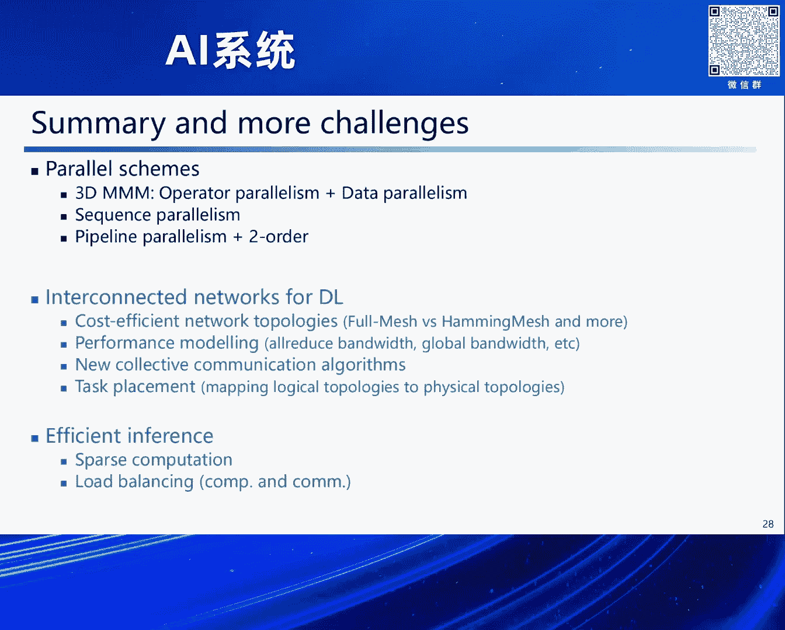

# 2024北京智源大会-AI系统 - P7：大模型高效可扩展并行策略研究-李士刚 - 智源社区 - BV1DS411w7EG

[音樂結束]，好 感謝林老師的介紹，大家好，我今天匯報的內容還是大模型並行策略，當然在這個領域已經有很多優化工作了，已經有非常多的工作了，然後我今天是分享幾個探索的點。

現在大模型的主流架構還是transformer，雖然也有一些新架構逐漸也出來了，但是都還沒有廣泛應用，主流架構還是transformer，但是隨著transformer，大模型這個規模的越來越大。

而且模型的能力越來越強，它的並行策略也越來越複雜，它通常是一個涵蓋多維度並行的一個複雜的組合，因此這對我們系統的開發人員和性能優化人員來說，就帶來一個沉重的負擔。

所以我們需要開發這種分佈式自動運行的框架，從而可以自動的生成最優的一個並行策略，以及代碼的實現，但是在這一個領域上其實已經有很多工作了，前面袁老師也介紹過，然後前面其他幾位老師也已經介紹過。

包括敖英龍老師也介紹過，有很多相關的工作，但是在這一領域還有一些挑戰需要解決，第一個就是說在已有的這些並行策略裡邊，它的通信開銷和內存開銷都不是非常的高效，尤其是在操作幅並行這個維度。

那這裡邊是以Micro-LM為例，它是需要將整個輸入數據在多個進程上進行複製，之後進行本地計算，最後要拿到最終結果呢，需要在整個輸出數據上做一個Overdose操作，這種實現方法雖然簡單。

但是它的內存開銷還有通信開銷都是比較高的，另外一個方面就是說已有的深度學習框架呢，它對分佈式張量的描述能力是有限的，因此它沒有辦法很高效的來描述，比方說2。5D或者3D分佈矩陣乘法。

這種通信效率更高的這些並行算法，因此這裡邊我們是基於就是和袁靜慧老師合作，基於她前一個工作就是OneFlow中的SBP框架，提出了一個就是自動的分佈式並行框架，Auto DDL。

SBP剛才袁老師已經介紹過了，它包含三個分佈式張量的狀態，S Split B是複製，然後P呢是Partial Sum，Partial Sum是相對於已有的這些，大部分並行框架來說是新增加的一個狀態。

就是不分核中間結果，因此它需要將這種中間結果進行一個全規約，ORIDOUS操作，才能拿到最終的結果張量，但是這個ORIDOUS什麼時候調用，因為我們定義了這種中間狀態，所以它是可以根據我們需求來自定義。

來決定我到底什麼時候來調這個ORIDOUS，這就跟我們增加了，就是並行算法的一些靈活性，我們可以更靈活的來設計3D分佈矩陣乘法，這樣的並行算法，接下來來看就是我們如何利用SBP模型。

來實現一個3D的分佈矩陣乘法，這裡邊是以A乘B矩陣等於C矩陣為例，在8張卡上面，那A矩陣的話，A矩陣它的劃分模式是S02 S12 B2，它表示對A矩陣的0維度，進行兩個進程上的劃分。

1維度也是兩個進程上劃分，B2它表示在劃分之後的張量，它是複製到兩個進程上，那對於第二個輸入矩陣B，它的分佈方式和矩陣A是一樣的，然後我們進行本地的矩陣乘法運算，算完之後它得到的是一個中間結果矩陣。

它分佈方式是S02 S12 P2，其中這個P2就是說，我們這個Puzzle Sum，中間結果是分佈在兩個進程上的，之後還需要調用一個，歸約操作Reduce Getter，得到最終的結果矩陣C。

這個C矩陣它的最終結果也是分佈在8張卡上的，之後還可以接後續的，這種3D分佈矩陣乘法，這種3D分佈矩陣乘法它相比於更常見的，就是說1D 2D分佈矩陣乘法，在通信開銷上它是更低的。

那接下來來看就是AutoDDR整體的一個，這個模型框架的流程，首先對於給定的一個神經網絡，我們先要每舉每一個操作符，它可能的SBP配置，從而構建整個，端到端的一個並行策略搜索空間。

然後我們對通信性能進行建模，這裡面我們主要就考慮了兩種網絡架構，一個是這種統構的，還有一種就是多機多卡的這種易構網絡架構，然後用簡單的延遲帶寬模型對通信進行建模，然後我們要對這個並行策略空間進行搜索。

因為我們在第一步構建並行策略空間中發現，可以看到就是，這個並行策略空間的大小，是隨操作符數量而指數級增長的，因此對於這個深度神經網絡來說，它的搜索空間是非常巨大的，因此我們這裡面是採用了一種定制化的。

座標下降啟發式搜索算法，它可以對搜索空間裡邊的多個區域並行搜索，從而可以有效地避免陷入局部的最優解，可以更快地搜索得到全局最優，或者是近最優的並行策略，這裡面值得注意的一點。

就是我們最終搜索到的並行策略，它有可能需要在不相鄰的操作符之間，插入這種數據重分佈操作，在OneFlow裡邊它是叫Boxing這麼一個操作，這是為了滿足輸入和輸出數據之間的依賴關係。

最後我們利用OneFlow框架，生成最終的代碼實現，接下來我們來看AutoDDR能搜索出什麼不一樣的並行策略，我們這裡邊還是以多頭注意力Multi-head attention算子為例。

左邊這幅圖就是我們常見的，Microcharm LLM裡邊的操作符並行的實現方式，如果再加上數據並行，因為數據並行維度基本是我們必不可少的一個並行維度，加上數據並行的話。

Microcharm LLM中的操作符並行，可以被看作是一個2D的分布矩陣乘法，右邊是AutoDDR搜索得到的一個並行策略，它是與Microcharm LLM最大的不同。

就是說我輸入數據是在多個進程上進行劃分的，而並不是Microcharm裡邊這種整個輸入數據的一個複製，之後在劃分之後的張量上，我們進行一系列本地計算。

中間要穿插兩個orgizer操作和兩個reduce getter操作，從而得到最終的結果向量，與Microcharm LLM相比，就是AutoDDR搜索得到的這個並行策略，它增加了通信次數。

但是總體的通信量是顯著降低的，這裡邊是把通信量從O(n)的平方除以P的1/2次方，降低到O(n)平方除以P的2/3次方，同時對於輸入輸出數據它的內存佔用量，也有同比例的一個降低。

所以總體而言就是我們AutoDDR搜索得到的這個並行策略，它具有更好的並行可擴展性，接下來來看序列並行，因為長序列是我們大模型訓練推理中一個重要的問題。

這裡邊我們還是以Multihead的Tensor Maybe，用矩陣乘法的形式展示出，它在AutoDDR裡邊的一個具體實現過程，可以看到就是我們對一個完整的序列，它是劃分到多個進程上的，或者多張卡上的。

之後我們在進行自注意力計算的時候，就需要實現序列並行，當前序列並行的實現方式主要有兩種，一種就是基於這種Rune Auger，環球Auger的實現方式，它是將K矩陣和V矩陣的完整序列拿到本地。

然後和本地的Q矩陣進行一個本地計算，但是這個Rune Auger的話，它可以實現成一種分佈的點到點通信的方式，也就是說在進行當前塊計算的同時，可以同時傳輸下一個，下一塊數據。

這樣一來可以實現一個比較好的計算通信的隱藏，那另外一種實現方法就是，DeepSpeed的尤里希斯裡邊這種，它是針對Q、K、V三個矩陣，分別調用一個Autoout通信，但是這個Autoout的話。

調用完Autoout之後，就是每個進程就可以拿到完整的輸入序列了，之後再在本地，執行類似於FlashAttention這樣的本地計算，那總體而言這兩種方法，它是各有優缺點的。

就第一種就Rune Auger的話，它的通信量是非常高的，因為Auger的通信量是和，輸入數據的總量是成正比的，那隨著進程數的增加，它並不會降低通信總量，但是它可以實現一個比較好的計算通信隱藏。

尤里希斯裡邊的Autoout這個通信，它的通信量是較低的，因為Autoout的通信它只和，進程的本地數據量成正比，所以隨著進程數的增加，也就是序列並行度的一個增加，它的通信量是成比率下降的。

但是這種方法的話，它不太容易實現計算通信的隱藏，而且尤里希斯裡邊這種，它的並行度，序列並行的並行度，是受hide數量限制的，因此我們這裡邊也是將兩種方法，進行了一個融合，然後提出了一種混合序列並行策略。

簡單來說就是在一個維度上，進行Autoout通信，然後在另外一個維度上進行Rain Auger，從而拿到一個完整的序列，那我們做了一個初步的性能測試，就是在8張910B生騰卡上。

對LAMA2的7B進行了一個測試，可以看到對於32K 64K 128K，等不同的序列長度，這種混合序列並行策略，相比於單獨使用Rain Auger，或者是尤里希斯，都獲得了一個明顯的吞吐率的提升。

除此之外呢，AutoDDR它還可以支持，更靈活的通信拓撲的一個變換，因為在已有的工作裡邊，已經證明，比方說對於我們，矩形形狀的這種矩陣乘法，它需要在矩陣更大的維度上，分布更多的進程，才可以得到一個全局。

最優的一個劃分策略，那我們這裡邊，AutoDDR也是支持這種靈活的，通信拓撲的變換，可以達到一個端到端的，大模型的更低的一個通信開銷，這裡邊就是，還是以MATIA的Tension Melee。

因為在深度神經網絡裡邊，或者是大模型裡邊，也會經常遇到這種，矩形形狀的矩陣運算，以MATIA的Tension Melee，在第一個KUKV的線性映射層，它的模型參數矩陣，是一個N*3N的一個矩形矩陣。

那AutoDDR在64張卡上，搜索得到的最優通信拓撲，是2*8*4，也就是說，我在3N的這個更大的維度上，劃分更多的一個進程，之後呢我們進行本地的這種，自助力 自助力力計算，自助力力計算完之後。

要接下一個MLP層，而下一個MLP層的話，它的模型參數是一個N*N的方陣，那對於這個N*N方陣來說，它的最優的通信拓撲是4*4*4，是一種更均衡的劃分方式，那我們是在中間插入一個。

Reduce Gaiter操作和All Gaiter操作，就可以靈活地，將通信拓撲從4*8*2，轉化為4*4*4，那AutoDDR通過支持這種靈活的，通信拓撲的一個變換，可以實現端到端的一個更低的。

通信開銷，這在已有的運行框架裡邊，是無法做到的，接下來來看性能測試，就是這四幅圖是在四個不同的神經網絡上，對我們就是AutoDDR裡邊採用的，作標下降的啟發式搜索算法的，它的效率進行了一個測試。

可以看到相比於隨機搜索，以及FlexFlow裡邊使用的，MCMC搜索方法，我們採用的這種啟發式搜索方法，可以在更短的時間內，搜索得到最優的一個並行策略，同時值得注意的一點就是我們這裡邊。

是利用了前面我們構建的性能模型，對各個並行策略的性能進行評估，而不需要在實際的機器上進行驗證，所以整體的這個搜索過程，只要在筆記本或者台式機上就可以很快地完成，之後是在P-System的超級計算機上。

對幾種不同的神經網絡的最終性能，進行了一個對比，可以看到就是AutoDDR搜索得到的，最優的這個並行策略，相比於我們手動優化的，這種高度優化的手工實現來說，仍然獲得顯著的一個性能提升。

以Transformer為例，就是相比於這種配置最優的，Micro-LM的這個並行策略配置，AutoDDR仍然可以獲得30%的一個吞吐率提升，並且隨著進程數的增加或者卡數的增加。

AutoDDR的它的性能優勢也更加明顯，這也說明就是AutoDDR搜索得到這個並行策略，它的並行可擴展性更好，接下來是流水線並行維度，前面在敖毅龍老師報告裡邊也說，就是說我們流水線並行。

它主要面臨的問題是空泡問題，當然現在也有大量的工作，對流水線空泡進行了一定的緩解或者是解決，在我們前期工作中也提出一種，就是雙向流水線並行機制Camirror，它可以將兩個方向的流水線進行融合。

從而大幅降低流水線空泡的比例，但是無論是Camirror還是後續出現的一系列，流水線並行的工作，它都沒有辦法完全消除空泡，或者說它消除空泡的話是有一定代價的，因此我們這裡邊是嘗試另外一個技術路線。

就是能不能在流水線空泡中，填充一些有用的計算，從而來提升硬件的一個利用率，具體來說我們是在流水線空泡中，填入二階優化方法的一個計算負載，從而來加快端到端的收斂速率，那首先簡單介紹一下什麼是二階優化方法。

二階優化方法就是用二階梯度，二階導數也就是梯度的梯度來進行模型更新，那相比於一階方法而言，就二階方法它擁有更多的一個優化信息，因此它可以將多個訓練內在部，多部併為一部，然後進行模型的更新。

因此它可以相比於一階方法而言，可以大幅提升模型的一個收斂速率，那從數學公式上來說，二階方法和一階方法的不同，就是在一階梯度的基礎上，要乘以一個曲率矩陣的逆，對一階梯度進行一個預條件轉換。

那這個曲率矩陣呢，根據不同的二階方法，它的定義也是不一樣的，比方說牛頓法裡邊，它的曲率矩陣就是黑森矩陣，自然梯度法裡邊，它的曲率矩陣就是飛射信息矩陣，那我們這個工作主要是針對自然梯度法的。

那無論是自然梯度法，還是牛頓法，這個曲率矩陣的計算，還有曲率矩陣求逆的計算，它的總體的計算開銷是OP的三次方，這裡邊P是模型參數量，這對於我們大模型來說是無法接受的，實際的性能測試表明。

雖然就是二階方法，它可以大大提升這個模型的收斂速率，但是它單步的執行時間太高了，導致在端到端的一個訓練時間中，甚至是長於這種傳統的一階優化方法，因此就是有工作就提出，二階優化方法的近似求解方法。

KFAC它主要是針對自然梯度法的，當然還有其他一系列，比方說閃曝啊這些，其他的近似求解方法，那我們這裡邊是以這個KFAC為例，KFAC的話，它是利用了Cronicle音式分解的一個非常好的性質。

它可以將這種大矩陣近似為，兩個小矩陣的Cronicle乘積，之後對這個大矩陣進行求逆，它就轉化為兩個小矩陣Cronicle乘積的求逆，它同時又等於先求逆，再進行Cronicle乘積。

從而它可以避免在大矩陣上，進行一個求逆的運算，從而它可以將，二階優化方法的計算複雜度大大降低，通過實際性能測試表明，這種基於KFAC近似求解的二階優化方法，它可以將端到端的一個訓練時間。

相比於這個一階方法有一個顯著的降低，接下來簡單看一下，就是KFAC的它的一個計算過程，首先它要計算兩個曲率矩陣，就是A和B，其中A曲率矩陣的話，它是等於輸入數據乘以輸入數據的轉制，B矩陣的話是誤差矩陣。

乘以誤差矩陣的轉制，之後要對這兩個曲率矩陣進行求逆，但是這裡邊AB兩個矩陣是比較小的矩陣，對其進行求逆操作，它的計算開銷也並不高，最後的話是將這個AB矩陣的逆，與一階梯度相乘完成預條件轉換。

這是KFAC的一個總體的計算的複雜，之後我們來看如何將，KFAC計算複雜，填充到流水線空泡裡邊，我們這裡邊還是以最簡單的GPIP，流水線方案為例，首先我們對流水線裡邊，正向傳播和反向傳播計算時間。

以及流水線空泡的一個占用時間，進行一個測量，然後是對二階計算複雜，包括曲率矩陣求逆的運算，它的計算時間進行一個測量，之後我們把二階計算複雜，填充到流水線空泡中，它的總體的一個填充原則。

就是說我們只利用流水線空泡，而不去影響原來的流水線，或者盡量不去影響，原來流水線的一個總體執行時間，也就意味著我們能填充多少就填充多少，這樣達到的一個效果就是說，我們並不能保證，在每個訓練迭代部。

都對二階的曲率矩陣進行一次更新，實際的一個優化效果就是說，我們可以在大概每一到兩步，能夠更新一次曲率矩陣，但是這種效果的話，相比已有的這種二階優化方法，也已經是大大提升了，這個曲率矩陣的一個更新頻率。

從而可以使我們二階優化的話，達到更好的一個收斂效果，最後是在就是Bertrage這個，預訓練，端到端的預訓練上，做了一個性能測試，可以看到就是說，融合了這種二階優化方法的。

Kaimirer流水線這個並行方案，和Kaimirer採用這種，傳統的一階優化方法，它可以將Bertrage這個，端到端的預訓練時間，降低30%以上，好 最後是對，今天工作的一個簡單總結。

首先我們基於3D分布矩陣乘法模型，對AutoDDR裡面搜索得到的並行策略，進行了一個簡單闡述，之後是介紹了，混合的序列並行策略，以及二階方法，和流水線並行的一個融合，那在接下來的工作中。

就是大模型在互聯網路的突破，還有高性能推理方面，仍然面臨一系列問題，在前邊就是袁老師也提到，就是說尤其是在，這種大模型推理這個方面，除了就是我們Profile第一個階段。

後邊我們主個Token生成的時候，由於我們和QVCache結合使用，它一次生成一個Token，那它對應的一個算子，其實是GEMV的一個算子，所以它經過了一個就是說，從GEMM往GEMV的這麼一個轉換。

從計算，相當於是一個計算密集型的一個計算負載，轉化到仿存密集型的一個負載，所以這裡邊還有很多問題，需要我們進一步解決。

好以上是我報告的全部內容，感謝大家。

