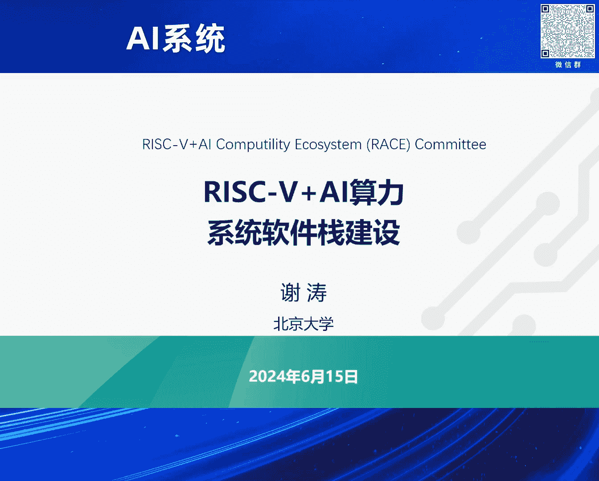
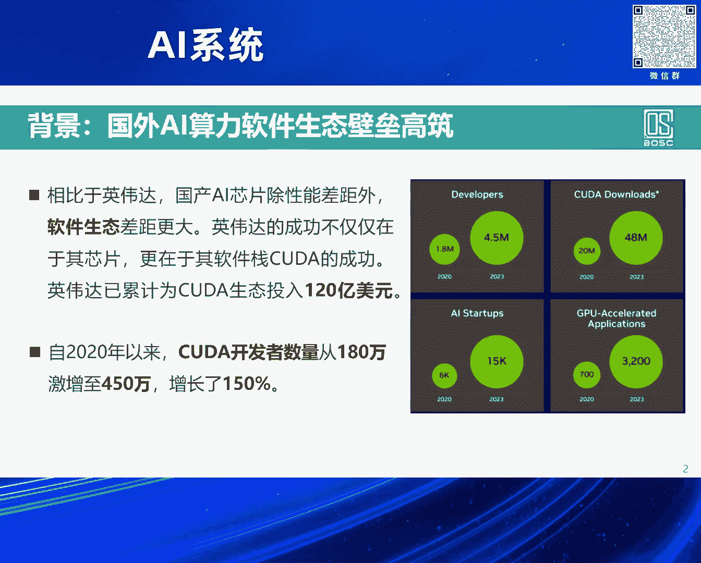
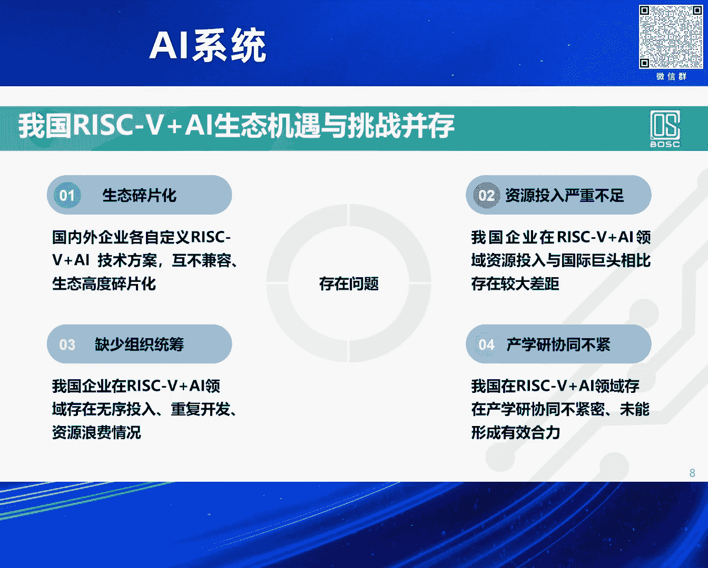

# 2024北京智源大会-AI系统 - P8：RISC-V+AI算力系统软件栈建设-谢 涛 - 智源社区 - BV1DS411w7EG

謝謝林院長的介紹，我盡量趕一下，希望能夠在20分鐘之內結束，好，那麼大背景我不需要多說了，就是現在當然我們比較高性能的這些AI算力的芯片，很難能夠購買到。

我們現在很大程度是依賴於我們國產的AI芯片的發展，前面幾個報告都有提到了，其實性能各方面的都應該還是不錯的，但是其實很大的一個我們要去應對的是，CUDA的軟件生態的壁壘，首先就是對CUDA生態。

它是2006年英偉達開始發起，在高校等等各方面去生態，投入也很大，那麼特別是近幾年，那麼CUDA開發者也從180萬，2020年以來，激增到450萬，這個數據是今年年初一個新聞報導出來的。

一個我們問的問題就是，為什麼要450萬的CUDA開發者呢，CUDA開發者他指的是說使用CUDA的接口，以及CUDA的C擴展的這樣的一個語言來去寫程序，那麼在我們AI時代。

那麼就是AI的算子是用CUDA來去寫的，由於長期的生態建設，它積累了這麼多的人，大家會想也許我們就讓英偉達的特別厲害的工程師，或者是說各個AI芯片公司的自己的軟件工程師，去寫出特別優化的算子實現就好了。

once for all，我們廣大用戶就用就好了，但是其實在特別是當下大模型時代，我們很難去once for all的去使用這麼一個很通用的算子實現，來去支撐在各種場景下的這種部署的大模型。

那麼因為我們在部署的大模型，它是很首先一個特別在雲上的，它對於算法的算力的優化，即使是個位數的百分比的這麼一個提升，它仍然絕對數給大家帶來的節省的開銷，體量還是很大的在前述上。

所以大家很願意去再進一步的去優化，那麼我們把它叫極致的算力優化，很難once for all是因為它上下文敏感，我可能針對特定的芯片，或者是特定的哪一款芯片哪一代芯片，即同一個公司的。

我可能都要去調整你算子實現，來去更好的去發揮它的算力的優勢，另外一個上下文是上層的用戶的輸入，你使用的場景workload是怎麼樣，那也會影響到我使用哪一個算子實現，它能夠提供極致的算力優化的效果。

所以這也是為什麼我們有450萬的這樣的CUDA開發者，根據我們的觀察就是說，英偉達的它的特別是CUDA的軟件生態發展，有這麼一個思路，不見得是官方它自己承認的，首先一個就是它自上而下，它的根是幣源的。

而且只是應對它一家的英偉達的芯片，那麼它通過前期2006年以來的，特別是在大模型時代，極大的去把CUDA開發者的數量，增到很大的一個程度，這樣使得大家都往上靠，這長出的葉子，我們用了嫁接的這種方式。

前面有幾個報告也都提到了，能夠去應對當下生態的燃眉之急的，就是兼用CUDA，當然兼用CUDA它也帶來各種各樣的限制，比如說被人牽著鼻子走，新一代CUDA的接口可能放進去，有利於英偉達下一代新的芯片。

它最能體現它優勢，能夠把其他的競品又拉一大好幾年，這樣的特性，你就老是被牽著鼻子走等等，還有一個就從雲道端，前面談到了雲側的算力的優化，是有極大的這種所謂的極致的優化的需求。

所以也有這麼大體量的CUDA開發者，那麼它通過雲上的這樣的所謂的，有點像把它比喻成城市和農村的這麼一個感覺，它先把城市攻破了，以後再延到比如端上，可能端上不見得算力要求那麼大這種優化，但是它也自然。

凡能優化多少算多少自然繼承了，還有一個就是人海戰術，因為英偉達CUDA的，它的往下越往芯片進，它是越避緣的，對吧越不開放的，那麼就是，所以它很難是通過工具創新的方式，它自己一個公司本身。

投那麼多工程師特別對場委場景，來去做很廣的覆蓋，所以它是採用了前期的建設人海戰術，我們反觀國內，我們國產的AI芯片公司，當然了前面也提到有一批，芯片公司是兼用CUDA，先解燃眉之急。

那麼從此之外我們也有其他的這些路線，會造成就是說，大家投入嚴重不足，而且碎片化，各自為政，自己去做自己的，所以整體來講它很難形成，有比較強的生態的競爭力，那一個我們思考的問題就是說。

除了兼用CUDA這個燃眉之急之外，長遠來說我們還是要發展，不光是我們國家，包括就是除了英偉達之外，全世界的其他的這些公司都在想，我們不是只要綁定在一家，那麼我們在綜觀，去看這個歷史上。

當有一家公司以幣員的方式，佔據了生態的領導地位，很難有第二家幣員的生態來去震撼它，但是我們能看到，有用開源的方式來去震撼，這個排領先者的，這樣的一個幣員生態的主導者，比如說早期的Linux。

來去震撼Windows操作系統，還有近期的谷歌去牽頭的安卓的，這樣一個開放的系統，當然它對的是多種的硬件，而不是綁定一家的芯片或硬件，來去挑戰去震撼蘋果的iOS，針對它只是自家的蘋果的芯片。

這樣一個生態，在這個大背景下我們去看，有什麼具體思路呢，一個機會在近年來到了，那就是RISC-V，RISC-V它是一個開放的指令集，是全球開放開源的一塊來去共建，在大模型時代也使得AI的。

算力需求也體現一個碎片化，這麼一個方式，就極大的需要訂製，來去提供各個場景的，這種算力的需求，特別是在AIoT的這樣的一些場景，所以不光是巨頭公司，比如說谷歌、Meta、特斯拉等等。

也包括一系列的初創公司，也在這個方向上投入，並產出很有競爭力的AI芯片的產品，其實我們國家利用RISC-V來去做，AI芯片也是有挺多的企業開始興起，但是也面臨著又有機遇又有挑戰，首先就是生態碎片化。

也自然的繼承了前面我提到的，除了RISC-V之外的，其他的非CUDA或非GPGPU的路線的，國產AI芯片公司的生態碎片化的問題，還有也是類似資源投入嚴重不足，還有一個是缺少組織統籌。

另外就是產學員協同不緊，然後我們其實看到有很多產業聯盟，把公司都聚集在一起，說我們形成標準，然後大家都遵循它吧，但是這個事情，說我們大家統籌起來別各自為戰，這個出發點很好，也就是說把大家團結起來。

這個思想也很好，但是在執行上很難，那為什麼呢，一個是說大家都是進到這個聯盟的，都是有傷，產出都是競品，那你要去形成一個標準的時候，很可能會出現一個局面，各家公司都放進一些有利於自己的產品的。

不利於有傷的產品的，所以最後面形成就變成一個大熔爐，啥不是 幾不像，雖然可能放在那裡所謂的共識，但是沒有一家形成這個共識的這些公司，自己的產品是真正去跟的，那還有一個就是，他可能說出工不出力。

你形成聯盟開個會就完了，制定一個標準反正就放在哪，因為他覺得我們就這一幫人，誰也不服誰，就這些人團結起來投入的力量，不足以讓我說那麼出力，我出出工就好了，所以就是說，這個是一個很好的思路，但是時操很難。

那我們看就是，Risk 5加AI為什麼會是一個，能夠去解決前面講，團結大家起來時操上的一些困難呢，首先一個就是說，我們團結起來，不只是瞄準說我們國家，組織的一堆企業，或者是產學研大家一起來去做。

而是瞄準國際，所以我們去把Risk 5做AI指令及擴展，形成一個我們的共識，國內共識，然後形成一個候選的，然後在國際基金會推成國際標準，那麼推成國際標準有什麼福利呢，其實本身它不是最終目標。

目標是說你推成國際標準了，整個國際的開源社區，LVM等等，包括AI的這些框架設計，自然它就會幫你upstream，就是所謂的上游，就是它你的每一代的換代更新，包括它自己的這些開源軟件的。

系統軟件的換代更新，它都會自然會支持好，你指令集的演化，或者是指令集的當下的版本，所以這是很大的一個福利，就是不是盯著我們自己一堆人，能產出的東西，而是說一起團結起來，能夠形成在國際上去建立。

所以這也是自下而上，剛才講的這麼一個思路，前面提到說你這個放進去，都是有利自己，不利我們的友商的，那這個事情肯定是不可能成為標準的，就是說那不就是輸出的情形嗎，對吧，為什麼不大家一起。

真心的去做一個多贏的一個局面呢，所以這是一個很重要的一個，一個出發點和抓手，所以我們以這個開源的指令集為根，這樣長出去，各家公司都可以利用這個指令集，去做定制，當然如果你偏移了指令集標準，那你定制的話。

你自己公司要投入軟件公司做一些適配，那麼這事就也是很自然，但比起原先，這個你各家公司都要投入，比如說一般我們聽到說一個芯片公司，大概有三分之二的工程師是軟件工程師。

最近我也跟這個RISC-V國際基金會的，這個技術指導委員副主席，Flipp和他這個在北京做交流，我就問這個問題，我說採用了RISC-V這個方式，上游在系統軟件，這麼來去為我們節省的。

各家公司軟件工程師的，對系統軟件站的投入大概是多少，他說是百分之的個位數，這麼一個極大的一個降低，還有一個就是說我們是，有點像農村包圍城市這樣，我前面講到現在AIT的，這樣的一個時代，我們在這個端上。

我們去做這個定制化的，包括芯片的設計，指令集的定制，以及這個系統軟件站的這個研發，來去把這個端上，這樣的算力支撐好，這樣生態起來之後，我們再來包圍城市，再把雲上對算力優化，有極大需求的。

進一步的去利用這個生態去加強，還有一個就是說，我們不是說走這樣的思路，我們就從天而降，這麼短時間我們就孕育出，450萬的利用RISC-V，AI這個系統軟件站的用戶，不是，就現在大家知道大模型時代。

因為我本身也從事軟件工程的研究和教學，所以就是一個很大的衝擊，是我們不需要有那麼多的，比較低級的軟件工程師了，對吧，好多這些相對低級的任務，是能夠被取代，當然了對中高級的，還是有很大的需求，就是類似的。

這450萬可能本來就不需要那麼多，如果我們在工具創新，編譯優化自動化這方面做得更好的話，而恰恰這一些所謂的主力的力量，是來自於國際開源社區，這個因為我也是擔任，中國基進學業系統軟件專員會的主任，對吧。

對於我們國內的系統軟件的人才，特別是高端人才是特別缺乏的，所以我們得要到國際上去借力，所以我已經談到了借力了，那麼就是說宏觀來講就是兩大借力，一個是以國際這個RISC-V的國際標準。

來去借國際上的系統軟件站的力，還有一個就直接，我們不是說就等著推升標準了就完了，而且這也是一個時機來去對國際，特別是方興未艾這樣的國際開源社區，前面這個同欣老師也講到了，對吧。

就是智原這邊開展的Triton等等的，這一些很好的工作基礎，以及Intel在主導的SICKO，這樣更低底層的和CUDA，類似抽象程度的這樣的生態，那麼同時我們也會在中間。

就像是Triton和SICKO中間的抽象，針對RISC-V的這些AI指令機擴展，包括Matrix、Tensor，來去我們去定義一個中間抽象程度的，算子的接口以及實現，好我們簡單過一下。

這兩部分然後就很快的去收尾，我想我應該能夠20分鐘內結束，首先前面已經提到了，就是我們以指令集的共識為標準，然後upstream在國際上去推，使得國際開源社區能夠對RISC-V，AI指令機擴展進行支撐。

林院長前面介紹的時候也提到，就是今年的4月我也是被選為，RISC-V國際基金會人工智能記憶學習，特別興趣組的主席陳偉，他原先是在阿里達摩院，現在在西姆計算選為副主席，所以這個一個SICK。

就是主席副主席都來自中國，也體現了就是說我們在這個方面，也是有比較整個國家產業，不是說我們個人有很大的這麼一個發言，這個叫什麼體現度，另外一個就4月11號，RISC-V國際基金會。

技術指導委員會主席官宣說，其實2024年RISC-V國際基金會，作為頂級關鍵戰略優先級的三大方向，排第一的就人工智能與記憶學習，因為這個方向也給RISC-V來去趕超ARM和X86。

以及在市場上能夠去造血，能夠產生利潤，是帶來了一個很大的機會，排第二第三是安全和色彩，很快的講一下，就是說RISC-V技術上和ARM和X86有啥很大不一樣的，其實它不是說它技術上有什麼不一樣。

而是說它這樣一個開源開放的機制，降低了創新門檻，原先可能說像AI芯片，它需要CPU和這個斜處理器進行協同設計的，原先只能大廠Intel ARM等等這些，包括英偉達它自己能夠去幹。

廣大的大家的小一些公司根本沒法去涉及到CPU這一側，那RISC-V加AI使得我們更多的能夠在這方面去做創新，更多的團隊更多的公司，還有就是前面講高度可定制性這方面，它天生的它就設計一個模塊化的方式。

來讓大家把這些根據自己的需求，把這些指令集擴展去能夠搭出來，還有就是生態，就跟當年Linux興起，就相當於大家認為這個是人類發展正確的方向，就是把這個作為我們去投入到生態，去開源等等這些建設志願者。

他認為這是一個正義的事情，那麼我覺得我們去看RISC-V現在當下，軟件也好硬件也好，都都是有類似的一個情形，發展速度是特別的快，好第二部分因為前面，童馨老師已經講過Triton給大家介紹了。

我就不多講了，它是更高抽象，能夠給大家更快的敏捷開發，能夠去迭代，同時性能隨著這個編譯優化等等的全球，大家生態的發展也是越來越好，那簡單提一句就是，SQL這是Intel去主導的。

它比前面報告也有提到OpenCL，它是更加高抽象，OpenCL離硬件更加接近，所以SQL它的編程友好性能更好，那麼也是相當於是有點像對標Cuda，要替代Cuda的抽象。

所以我們也是在我們支撐的系統演練站，也會去做支撐，在這樣的大背景下，在今年3月底，依托北京開源芯片研究院作為發起單位，聯合一組這些相關的高校科研院所和企業，成立了RISC-V+AI順利生態委員會。

我也被選為主席，然後秘書處也是在開新院，我們已經開展了幾個月的工作，開了很多會和很多企業進行交流迭代，也成立了幾個奔著指令級標準，或者是架構擴展標準去的。

包括Matrix、Tensor、GPGPU、純順一體，以及這個之上的系統演練站的這樣的工作組，都在鋪開去開展很多的工作。

這是我們戰略目標前面已經提到了，這我就不去細細展開了，其實這個是相當於把前面我們講的。

這些事情做一個宏觀的這麼一個總結，最後就收個尾，就是相對就是現有的國產的AI算力的，芯片軟件生態，一個是加油，打不過就加油它，加油庫打生態，還有就是要回去自己幹，自己幹。

英偉達2006年就把庫打幹到現在，450萬，我們自己幹，每個都幣員的自己在那拱，我們要對周期性、長期性要一定思想準備，我們現在要推動的是說，利用Risk-Fi加AI的全球的生態高速發展的。

而且是AI時代，特別大魔音時代帶來的機會，我們希望能夠去推動成，能去震撼庫打生態的這樣一個系統延展，我的匯報到此。

謝謝大家，謝謝。