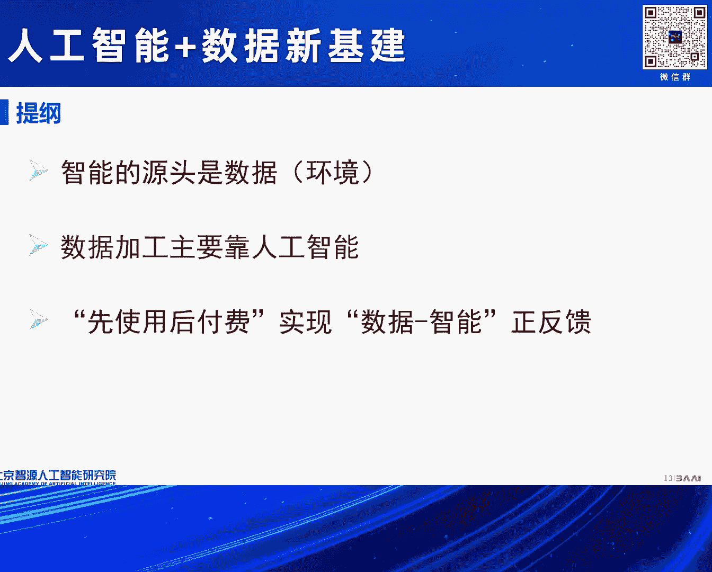
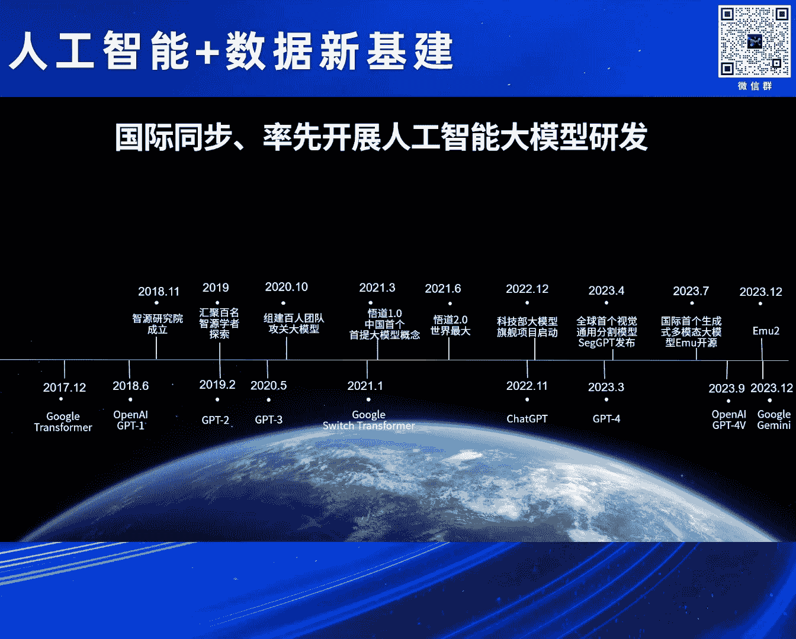

# 2024北京智源大会-人工智能+数据新基建 - P2：大模型需要大数据流转模式创新-黄铁军 - 智源社区 - BV1qx4y14735

尊敬的上部长夏局长，各位领导，各位专家，特别感谢大家来出席今天志愿大会，我们围绕人工智能，特别是数据的这样的一个重大问题，来开展研讨，我这个报告希望可能是从从事人工智能研究，这样的一个角度来谈一下看法。

因为今天后面我们还有几个很重要的报告，回很专业的角度来讲，我想汇报三个观点，或者说个人的一个思考，第一个就是智能，我们讲人工智能，源头就是数据，当然大家经常会觉得你们搞研究人工智能的算法。

理论那些东西好像很核心，但是我想说所有的智能，包括人的智能，归根结底源头就是数据，没有别的东西，这是第一个，第二个数据加工，数据标注，今天数据正在成为一个产业，靠谁，靠人还是靠人工智能。

我想说主要靠人工智能，不是不要人，人还要发挥作用，但是大比例的应该是靠人工智能，这是第二个观点，第三个数据和智能的关系问题，我建议要研究体制机制流通模式，我们怎么看待数据，这样的一个资产。

让它怎么在人工智能这样的一个时代中发挥，更大的作用，更快的更好的发挥作用，我觉得一个基本的思考，你要想实现这么一个良性的正反馈的话，应该是先适用，先使用后付费，而不能当成一个物理资产去标价。

上来就要花多少钱去买，大概这么三个观点来谈一下看法，时间有限，有些地方可能不能太展开，第一个就是智能的源头是数据，这一点在人工智能发展的历史中，其实一开始并没有得到这样一个充分的，或者彻底的认识。

所以早期的人工智能，是人把自己想的太重要了，我们简而言之，就是人来把智能过程变成算法，变成规则，后来把我们叫知识，实际上就是数据中的这些规律性的东西，这些条目，由人来整理，变成知识库，知识工程。

相当于人教完了，然后让机器执行，以为这就是人工智能，但是这么去做，后来证明是无法真正的解决智能问题的，所以从第三次，我们今天都讲，人工智能进入第三次浪潮，第三次浪潮最大的革命，就是从数据中学习。

当然这个思想，已经从上个世纪80年到现在，差不多已经快40年的历史，所以如果人工智能分成上半叶下半叶的话，上半叶是以人工为主，下半叶是从数据中学习为主，好，已经开始重视数据了。

对吧，要从数据中学习，当然更广义的人工智能，如果展开谈更复杂，对吧，或者技术路线，或者大家的idea更多，但是我今天有限，我就不展开说这些点。

但是最重要的就是这么多年，经过各种尝试，各种可以说是失败之后，才终于找到了这么一条可行的道路，就像我刚才说的，当初以为人思考，然后人的思考形式化，然后让机器自行，以为这就能解决，实际上那是个好像会思考。

是解决不了机器真正的思考和智能问题的，第二个路线，也就是今天咱们用的路线，就是要有一套人工神经网络神经系统，来对数据对信息进行处理，然后才能产生智能，从这个时候开始，我们才说的，你看人工智能猜算。

走上了一个正确的道路，第三个行为主义也讲的很多，实际上就是在一个身体，今天讲巨身智能，对吧，智能不是天上掉下来的，智能是一个主体，具体来说，对于我们人，我们就人是主体，对于一个低等动物，对于一个单细胞。

甚至于对于一个有机物来说，它都是一个主体，它要跟环境互动，所以这里边提到环境的概念，数据和环境是密不可分的，数据是什么，数据当然大家是digital，数字的，数字的它表示的是什么，它表示的是环境，对吧。

无论是传感器，还是其他任何手段，你获取的，其实都是关于这个世界的，一些一个表达方式。

所以当我们看这些几十年的，人工智能的发展的，这些曲曲折折的，这样的一些道路，这些通常说符号主义，刚才符号主义，连接主义，行为主义，这是我们经典的，通常说的三大学派，或者三个技术流派，那么比较新的。

过去十几年谈的多的，深度学习，强化学习，还有类脑智能，类脑智能，可能听起来比较新，其实一点都不新，它就是连接主义的，一个彻底的方式，就是神经网络，就像人的生物的神经网络一样，做一个这种神经网络。

为什么要做神经网络，因为那样的，我们大脑这样的神经网络，就有强的智能现象，但是不论是深度学习，从数据中学，还是强化学习，从环境中学，还是我刚才说的类脑，你就把人脑做出来，完全照着人脑的方式。

做一个光电的大脑，它也不是天生，就像我们人生下来，就具备我们这些后天的能力的，只是你有了学习的条件和潜力，你的能力，你的智能还得学，对吧，所以我们还要读书，还要学习，还要跟环境互动。

还要逐渐的提高自己的智能水平，所以不管是什么方法，什么路线，归根结底，智能是从环境中学，如果说的近一点，就是从数据中学，就像刚才说的数据，是环境的一个表达，是实际上大家再思考一下，智能这个东西。

为什么地球上会出现智能，为什么智能会水平越来越高，其实它不过是，我刚才说的一个智能主体，你要适应这个环境，你必须具备的一种能力，而适应这个环境，其实就是对这个世界这个环境，是什么的一个抽象的表达。

这是我们智能的基础，然后再通过神经网络，什么方式去执行而已，所以结论所有的智能，来自于数据，广义的讲就来自于环境，智能只不过是环境和数据的一个投射，一个凝练，一种高度的浓缩的一种表达。

使得我们能够比较好的，去适应这个环境，应对这个环境，所以智能从来都不是抽象的，地球这个环境，就造就了我们地球的这种智能，这种智能的形态，如果是一个外星球的，它的智能肯定跟我们不一样，原因很简单。

它要适应那个环境，你地球上这一套，适应地球环境的能力，你换一个完全不同的物理环境，你没有办法去应对那个条件的，所以什么样的环境，造就什么样的智能，今天我们比较现实的。

就是说我们要从数据中学，我们过去的五六年时间，我经常说，人工智能发展六七十年，但是最大的革命，就是过去的五六年，具体来说就是大模型，大模型当然是一个神经网络，它是一个很多参数的神经网络。

但是这个大模型中的智能，就在神经网络的连接上，就是神经网络的连接的强度，那个强度是怎么训练出来的，它是从大数据中训练出来的，怎么训，其实你如果给的是一个随机数，就是如果是海量的数据，全是没有规律的。

是一个随机的数，你训不出智能来，因为你给的数据有规律，所以它最后的参数，它才有了规律，就像我刚才说的，这些参数不过是，你为数据的一个投射而已，那这规律怎么学，其实大模型的学法，从2013年开始的这种。

我们说计算机表达数据关系的，这种词相量技术，给了一个解决方案，就是学数据的关系，那数据我们今天叫token，对吧，一个一个单元，学单元与单元之间的关系，而已。

所以transformer这样的神经网络是什么，那就是学，怎么说，对吧，你慰入这个余量，那我就要研究一个一个的词，和其他词之间的关系，你能把词语词之间的关系学到，你就学到了，这个数据背后的规律。

那这件事说的有点拗口，大家说，真的能做到这一点吗，其实我想时间有限，我不能花太多时间去解释，但是我想有一句话，大家我相信大家都学过，马克思说的，马克思说，人是一切社会关系的总和，什么叫一个人。

怎么定义一个人，是和你和他人之间的关系，所确定下来的，对吧，在家庭，在工作，在生活中，在这个社会上，在专业，你都有很多人有关联，包括今天咱们一起参加这个会，我们之间就有了这个关系，我在这跟大家交流。

就是定义我这个人的一个方面，当然我还跟其他人交流，对吧，我还有家庭，定义了我是谁，所以一个个体，它的含义是由它跟其他个体之间的关系定义的，这是马克思的讲的，刚才说大模型去学，从海量的语调学。

其实学的也是一样，一个token就是一个个体，一个单元，这个单元在大量的语调里面，跟其他单元出现，对吧，前后它有关系，你只要能把这个关系充分的学，然后映射为大模型的参数，实际连接，那就学到了它的含义。

所以今天大模型，我说结论，今天大模型是真的理解了，语言以及其他模态背后的含义的，而且可以说比人理解的还要精准，因为它是仔细的这么算出来的，算出来的，而且用一个高维的向量来表示，实际上我就解释到这个地方。

所以人工智能没有什么神秘的，人工智能的能力，全在来自于数据，而且我们刚才讲过去五六年的时间，人类找到了一个办法，用一个大型的神经网络的参数，大量的参数，来表达刚才说的这样的，隐含在海量数据背后的规律。

所以这就是经常说的scaling law，规模定律一直说什么意思呢，数据很大，所以我们需要一个很大的网络，这个网络的规模的扩大，和刚才说的数据量的增加，当然需要计算的次数的增加，所以算力也需要很大。

它就能越来越多的，越来越丰富的，把余裕给抽取出来，他得到余裕之后，他就表现出了这些，越来越丰富的能力，就像我们人学多了，对吧，我们学了唐诗三百首，我们就开始会，大概会写个像样的诗，对吧。

我们学了那么多知识，然后我们慢慢的自己就有了，很多的创新和想法，大模型其实也是一样的，所以大模型的这种，从海量的数据中学出来，产生的，今天就像变魔法一样的，大家看到的这些能力。

其实就是一个自然规律的体现，这些能力不是，我们这些搞人工智能研究的人，设计出来的，不是我们聪明，我们不聪明，我们用的就是刚才说，大家用的都是这么一个，很容易理解的这么一个方法，聪明，智能，都在数据里面。

这个办法，只不过把数据里面那个东西，转换成了一个神经网络，而这个转换过程是计算，是机器自己在执行的，它能表现出什么能力，没人知道，设计师不知道，训的时候，也不知道它会出现什么能力，但是规模到了那种程度。

规模越来越大，它就会产生越来越强的能力，而且我们相信，还没看到天花板，规模还会继续增大，数据随着数据的变得越来越大，这个能力就越来越强，这是人类我们说，遇到了一次技术革命，这次革命。

可能跟历史上最伟大的革命，经常说像指南针的发明，飞机的发明，相提并论，我们找到了一条，从数据中提炼智能的道路，而且还看不到尽头，这个智能是可能不断的涌现，甚至将来涌现出，超过人类的智能。

所以这就是今天人工智能的，一个基本的一个现象，但是所以我也可以说运气很好，搞人工智能的人，本身不聪明，但是赶上了这么一个机会，一个时代，然后把这件事就做得越来越好，这是第一个观点，第二个观点是数据加工。

因为刚才说源头是数据，这个数据还是要做些处理的，你不能一股脑子就塞进去就完了，因为如果你的数据有错误，那好了，那肯定后边的模型也就跟着就错了，对吧，所以我们教育的教科书，教科书不能随便出版，对吧。

一定是要仔细的核查，确保里面不出现错误，不能说绝对不出现错误，但是我们是尽可能的确保它的正确，训练人工智能其实也是一样的，如果你那里边有很多错误的地方，那至少你的这后边训练的代价会很多，就像小孩。

你给他一个错误的价值观，你想纠正过来，那你可能有10倍的百分的代价，你都纠正不过来，因为他已经认为那是对的了，但实际上他是错的，对吧，你想去纠正就太难了，所以高质量的数据，就事实本身。

就数据本身不要犯错，它本身不要存在错误，是训练人工智能的一个可以说基础条件，但是这么多数据靠人类去处理去加工，其实代价很高的，今天我们说不要标注了，不像以前对吧，还要打标签，还要画框，不要了。

我们直接拿这个语言，各种数据就可以训，但是这还是要做清洗，还是要做刚才说，确认它是正确，这个正确广义的，我想首先，大家可能很难理解什么叫做，你不做，你不知道里边有多乱，比如说你弄一个PDF文件。

简单的转成文本，你看吧，那里边有很多空格，或者是一串怪的符号，你那玩意要直接喂进去，那好了，那人工智能看到的，就是这些，含了这么多乱的东西，它一定会出错误的，所以在过去的五六年时间，智源研究院。

因为我们做的比较早，因为成立那一年，就是Open IGP第一，出现的那一年，所以我们做了很多模型，但是我们都是开源开放的模型，所以在这个过程中，一方面在模型方面，取得了一些成果，同时在数据的处理方面。

也积累了比较丰富的经验，因为像刚才说，你要逊一个好的模型，前提你得把高质量的数据，给准备出来，准备数据的过程，一开始是可能相对简单，但是随着模型的水平的提高，其实对人的要求，对数据处理者的要求。

也逐渐的提高，一开始可能就刚才说，把数据中那些噪音去掉，保证一些格式的问题，可能大家就认为就行了，但实际上后来就开始要选择了，比如网页，那不是随便抓来网页，就直接就喂进去就好。

因为有很多网页都是一些车轱辘话，里边也没有什么价值含量，和真正有含量的相比，那肯定是内容意义上，语义上专业上，它有价值的东西，训练人工智能才是有效的，所以对标注，我们叫它标注式。

或者数据处理工作人员的要求，也越来越高，高质量的数据，质量怎么定义，然后这里边当然还有价值观，还有安全这样的一些问题，所以实际上看着，现在说我们要自监督学习，不需要人类标注了，但实际上仍然是需要。

刚才说很多加工的，但是靠人类成本，还有管理，还有标准的问题，还有人员的能力，对吧，你一个人啥都会，这个也很难，对吧，其实是压力越来越大，所以我们就探索，用人工智能来代替一部分，人类数据处理能力。

目前已经我们叫agent，对吧，今天大模型，agent的形式出现，每个agent就是一个角色，就代替某类公主，咱们就说数据处理中的公主，已经越来越多的，在替代了人类的数据工作人员的工作，应该可以。

我就说应该可以，有些还没有那么准确，但差不多我们可以估计，用agent替代90%以上的人工是可以的，不会100%，因为有些比如价值观的问题，可能我们还要人来核对，但是大部分大家一般想象中的。

那些数据的处理的工作，都可以被人类，都可以被agent所替代，大家就说你用数据训练一个agent，用agent去检查数据，你这不是一个死循环吗，行不行，这是个迭代发展的过程。

用今天的agent处理今天的数据，训练出更高水平的agent，再去进一步处理，它是一个不断循环的过程，所以不是一个死循环，本来就是这么一个，一个不断的渐进式的，迭代式的往前进的，所以我想一个基本的观念。

就是agent主导的智能数据产线，才是今天，也一定是未来的数据加工的，一个主要的形态。

在这方面我们已经有了一定的实践，而且也取得了不错的成效，最近我们听说，我们也听有跟一些，咱们一些地方的接触，咱们国家的数据标注基地，已经7个城市已经得到了牌照，所以我们愿意把我们过去的5、6年时间。

在做大模型的训练数据，所形成的一些经验，最后变成了这样的，你叫它数据产线好了，这样的一个成果，愿意支持各基地的发展，大家不是招一帮人，然后就开始标数据，不是这样的，你再有先进的生产线，跟我们以前造产品。

也是其他的物理产品也是一样的，产线先进了，你的人工的消费就会小很多，或者说一一当实，就刚才说90%的工作，让AI去干，然后人做一些必要的工作，这是第二个，第三个就是关于数据，刚才讲和智能的关系问题。

如何实现正反馈，像刚才说的，我们得有数据，才能训练出智能，好的智能能够帮助数据的加工，提高数据的质量，训练出更好的大模型，更好的智能，这两个东西如果能正循环起来，正反馈，那这个事情会加速。

会对我们国家人工智能大模型的发展，具有战略价值，但是今天至少我们遇到的问题，第一个障碍就是钱，数据集，现在有越来越多的机构开始做数据，但是大家把数据当成了一个物理资产，我就不点名了。

我们国家很有名的一个大媒体，央媒我可以这么说，做了一个数据，然后问我说你们要不要数据，要啊数据越多越好，高质量的越好，我们做了一个数据集500万，要这么去迅速，你看我们是一个非盈利机构。

我不是说我们没有钱，政府也很支持我们，社会也很支持我们，但是这个模型还没有任何盈利的时候，我现在先花出几千万几个亿，先去把数据买回来，然后这个模型迅速迅完之后，到底怎么样还不知道，这事没有办法做。

我相信很多大模型公司也是咬着牙，也在买，对吧，因为说你不买这个工作就没法开展，就没法竞争，但是这么做，这个产业是没有办法，刚才说正循环起来的，所以这一关一定是要把它解决掉，所以前一段咱们国家数据局。

关于数据制度座谈，然后当时我就提出这么一个问题。

我的想法很简单，要构建一个人工智能大模型的生态，首先要把数据流通问题解决了，我们不能把物理资产的那种管理方式，直接简单的搬到数据资产，数据集上去，数据是一个数字形态的产品，它是可以多次使用的。

你拿来给我用，我训模型没成功，它就最终没发挥作用，你这时候先给我收500万，这个从交易上也不合理，而且我用你这一次并没有真的说你这东西就给我就没了，对吧，不是的，它不是个物理的东西，用多次都没问题。

所以让我们这些机构，包括让企业去用，本身并没有什么损失，这种情况下，我觉得咱们这个问题应该反过来思考，应该先使用后收益，这样一个原则来制定数据制度，这是我们从一线的单位的一个想法，第一数据一定要确全。

对吧，是谁加工的，谁做的，这是要做的，这是要管的，对吧，不能，这是一个最最基本的一个条件，在确定数据确全的情况下，我要用你的数据，我一定要确认，我不能偷着用，那不行，对吧，你有什么数据，咱们比如有管理。

有标签，有标识，我用了什么数据，我一定会清楚的说，我这个模型训练用了多少多少数据集，都是谁的，这时候你别给我收钱，请大家不要收钱，你让我，我还不一定训练成功呢，对吧，你让我安心的大家都去做，都去训练。

如果我这个模型没有商业收益，或者说我就是个商品，但是我根本都没挣到钱，赔了公司都亏了，后边一帮数据公司给我要债，对吧，那把我一下子本来可能还活过来，现在一下打死了，所以这时候大家不要再收费了。

因为他都没挣钱，他只不过用了一下，对吧，他自己也没带来什么好处，所以这种情况下就不要再去追责了，但是如果确实取得了商业收益，而这生意公司做的越来越好，这模型用的越来越多，我收益了，按比例，该用了谁的。

刚才不是说用了谁的数据吗，你就按一定的比例，当然我说的很简单，这背后确权 费率 监管，这里边有一系列的复杂的问题，需要去解决，但是我觉得基本模式上，我们的数据制度，可能是这种形式更有利于发展。

这个事因为我不是专业做数据的，我后来跟黄刚老师，我们都是北大的，他是做大数据的，他说你说这事，对我来说很轻松，我有办法，所以他等会会讲，他怎么来解决这个问题，不是说想法，而是说他有一套现成的软件平台。

基本上应该说。

已经可以解决这个问题了，所以如果是这样，如果数据和智能能正循环了，正反馈了，那个速度，就是数据飞轮建起来之后，那就真的我们讲，智能时代真的是可期了，将来的智能，我们2021年，发布5到2。

0大模型的时候，当时讲的PPT，数据和算力是生产要素，就像今天发电一样的，发电背后有大量的挖煤的，对吧，有风力的，有水电站，对吧，各种其实都差不多就相当于今天的数据产业，所以背后是一个庞大的产业。

因为这些数据的24*7的数据的处理和供应，保证了大模型，实时的了解世界的变化和各方面的信息，训练出的模型，以智力服务的方式，像电一样的给我们千家万户，给企业去用，这个时代才算到来了。

这样的一个设施就叫智力基础设施，就像今天的电力基础设施一样，我刚才也讲了，电力基础设施背后是大量的，以能源的电力的生产为目标的，各种煤，各种能源的转换，数据转换成智能，跟电力时代煤转换成电是一样的产业。

所以它是个庞大的产业，但是要理顺这个关系，不能煤矿先上来说，先给我交很多钱，我这电还没发出来，然后还没卖出去，这个生意就死了，所以最后一句，我想我们讲了很多过去的几十年，讲了很多的化，计算数字化。

信息化，网络化，虚拟化，信息基础设施，网络基础设施，算力基础设施，其实我觉得大概都指向一个方向，就是智能化，建设国家智力基础设施，而数据基础设施是智力基础设施的一个前提，否则的话智力就是空中勾搁。

那建好之后我们就进入了一个时代，这个时代我们叫它智力时代，就像电力时代一样的，一个用电驱动整个经济社会发展，将来是以智力驱动整个社会发展，也叫制业时代，就像工业时代一样的，它把我们从繁重的劳动中。

体力劳动中解放出来，用机器的智力来替代很多人的智力，来进入一个全新的历史的新时期。

好 我就汇报这些，谢谢，謝謝大家，謝謝。