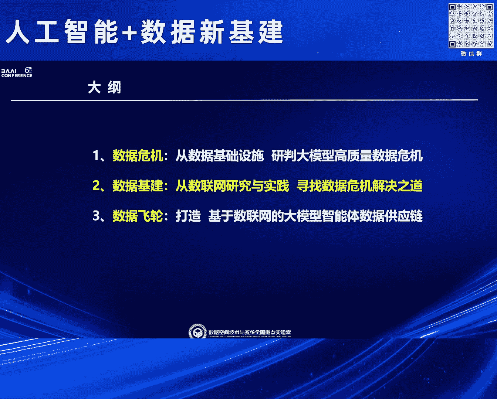
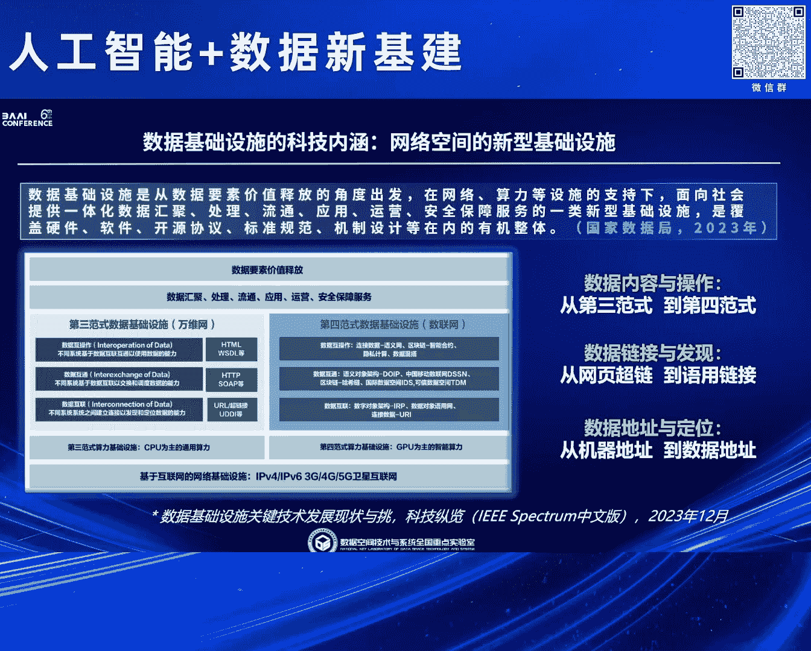
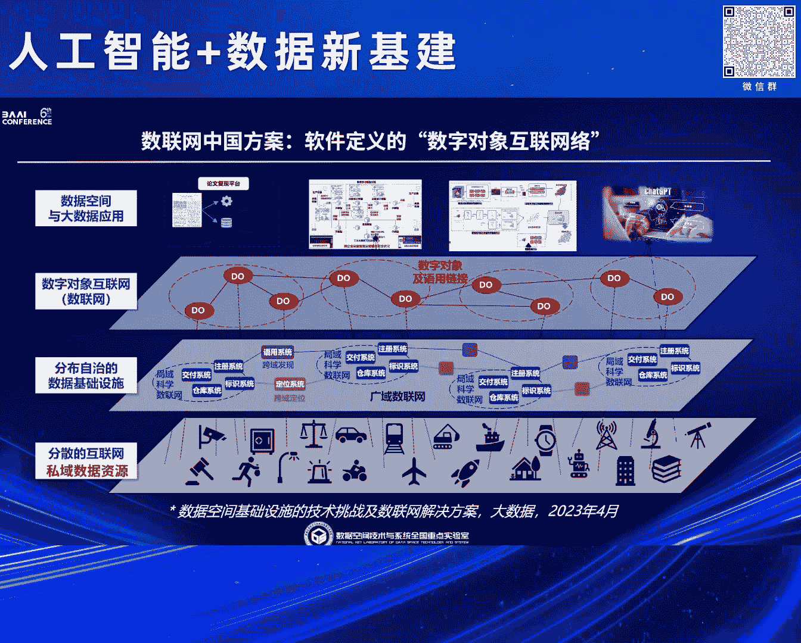
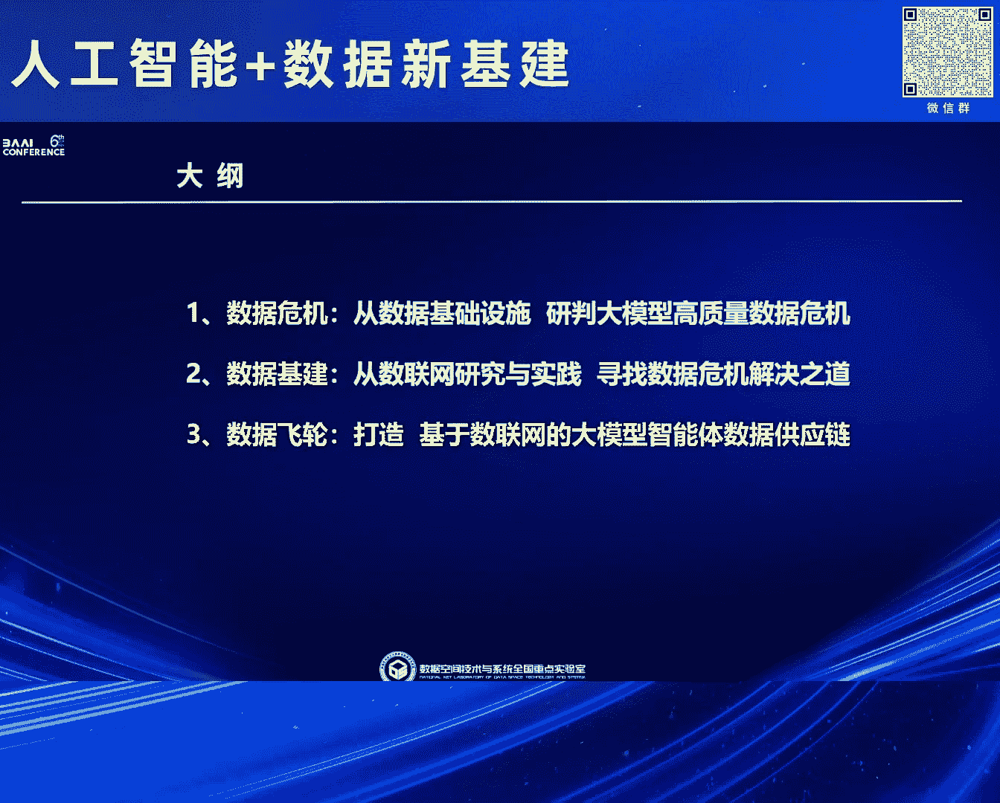
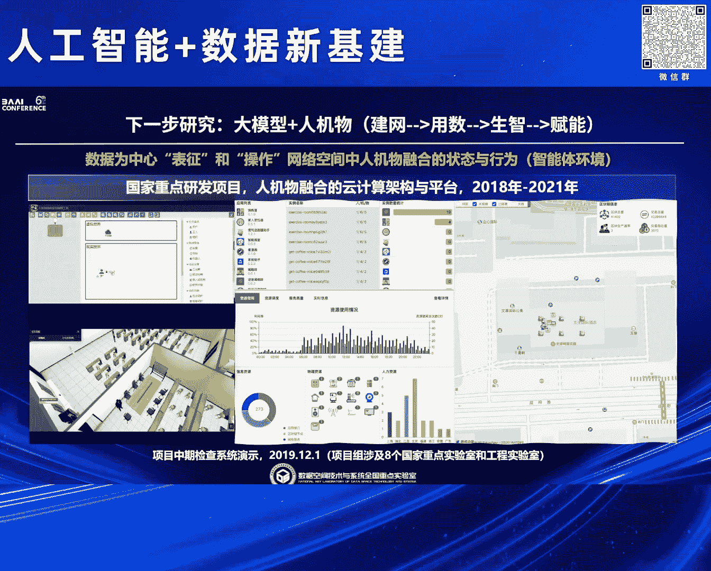

# 2024北京智源大会-人工智能+数据新基建 - P6：基于数联网的大模型智能体数据供应链-黄 罡 - 智源社区 - BV1qx4y14735

非常感谢铁军理事长邀请我到这个志愿大会来分享我们过去在这个，这个苏联网上的一些工作，然后这个题目这个可能是不对啊，其实我们这个工作呢就是，不是说马上就做完了，其实去前年那个GPT发布的时候。

其实我是焦虑了四个月然后焦虑了四个月呢反正，后来一下想明白以后呢我们实际上是差不多花了一年的时间，把整个这个问题给解决了所以也不是说，马上就解决了，然后我整个这个分享呢，因为时间因素所以说。

更多还是从这个原理就是一定是从科学原理上说他能把这个问题给解决掉，所以呢我们首先我不做大模型啊我是做数据的所以首先是从这个，数据危机的角度我们看说，他到底这个一天到晚说这个大模型缺数据是怎么回事。

第二个呢就是实际上就是，我们说这个从数据的视角，那这个问题能不能解，然后最后呢实际上就是刚才前面，很多专家也在说特别是铁军说那个，先用后付费对吧，本质上实际上是我们想重塑，移动互联网时代的数据飞轮。

对吧那有没有可能所以我们也就，打造了一条这个数据供应链我们现在目前，内测已经50多个高校差不多快半年了应该，应该我们自认为已经找到了这个，数据飞轮的一个解，所以今天就介绍这个，首先呢我们从数据视角。

所谓的大数据大模型我们认为都是第四范式，第三范式大家知道对吧业务驱动计算密集做计算仿真的，CPU单机操作系统APP，然后所谓的我们从数据角度看，第四范式就是把第三范式产生的数据，一股脑的。

塞给第四范式的大模型，当然也包括小模型，这个时候呢其实它整个，模式是模型驱动数据密集我们说GPU大模型整体，所谓的这个高质量危机我们可以看到实际上是说。

这个万维网上我们可以相对容易的以开源方式获得的数据，不够了，其实我们可以看到这个这个这个实际上是很早的一个数据但是其实，基本上反映的这个现状就是我们真正的高质量数据，都是常在用http开源访问不到的。

就你要不就登录要不就藏在APP里面了，所以这就是一个所以我经常说这个危和机制首先危对吧是说，大家都想的是说，这个，数据不够了然后这个大模型这个scaling low还能下去吗。

大模型还能再涌现更高的智能吗，这是危，但是呢我更多的看到的是机对吧就是机遇，是谁能大家想想叫chad GPT严格意义上，是以4%的开放数据加上Github和，百科全书里的一些深网数据。

训练出来的已经把我们给人类给，震惊的不行了对吧所以说谁能够搞定96%的，私域数据，那么谁的大模型，就绝对占据了，在除非再出现新的一类，我们说内脑的或者像，铁金做的那个脉冲了等等新的对吧但是在现在。

我们说，大数据大模型，这个，技术路线下，他，一定会占据主导地位，那我们说这个事情上从我们搞数据的其实，我们认为还是要提一下这个第四范式对吧就是，实验观测理论推进计算法到现在第四范式，我个人认为。

是从第四范式到了商业领域上是大数据，然后一直到今天我们的大模型我认为他覆盖到了全域，我个人认为实际上是，到今天的大数据大模型实际上是第四范式从科学领域，扩展到了整个领域。

那么我们再来看看第四范式为什么叫数据密集，其实包括大家可以看一下这个Jim Gray，2006年给的定义，对吧第四范式的目标是所有的科学文献，和数据，全部在线且可以互操作，所以大家想想看我们刚才其实。

特别刚才那个，冯总说的很对对吧我们现在大部分的语调数据，都是用来服务于信息系统或者信息的产生，实际上，第四范式已经讲清楚了，其实，以前我们更关注的是业务数据。

大模型现在更多要的是我们说是文献数据或者叫文档数据，其实在第四范式里面，在从概念上我们说早就定义了说，两个都要，只不过我们以前更多聚焦的是而且在那个大数据时代，更多聚焦的是业务数据，所以这个。

我们看原理对吧那我们说，为什么要数据加文档全在线，它本质上实际上是什么实际上是，基于数据附庸能够实现，科学研究的复现和探索，加速，这是我21年就开始讲的一个PPT对吧就我也不换，BERT，理解路线。

5月份发布对吧那个论文把它的数据及算法全发布了，然后百度两个月，换成中文就是Ernie，对吧文心大模型然后Facebook就是也两个月，换成自己的聊天数据高质量数据，然后出来Robota。

然后后面当然无数的出来然后我们，简单看一下Google GS是Google score的，我们就可以看到其实，大家想想短短的两个月这么复杂的一个工作就影响到了百度和，Meta以及到现在也就五年。

五年多的时间，对吧，将近十万次引用，这就是所谓的价值因为从科学研究的角度，论文，就是数据价值的释放，所以我个人认为这就是，典型的一种这个，我们说为什么文献要在线和互操作，那我们说它的。

理想情况是什么呢其实我们，此前就，前天我们就开始做这个demo，所有的数据，论文，如果我们真的是进入到理想的第四方式或者，数据都可以，畅通无阻的情况下，实际上我们可以一键去复现，科研论文里的所有的算法。

和它的case，并且进行探索，但是这个问题大家可以看到其实这一套，到今天其实，都依然没有实现对吧我们说问题是什么，我其实是搞软件的我们从技术这一看，实际上我们发现说实际上论文数据加代码。

之间的复杂关系以及论文数据代码之间，包括其他的大家可以看到就刚刚那个图对吧其实他们有一个复杂的关系，然后今天我们已经有了3。1万篇论文，3。1亿篇论文。

然后呢包括我们有很多我们所谓的文档文献对吧大家可以想象一下其实今天在互联网上，由于大数据和大模型的存在已经，在互联网上形成了一个由数据，形成了一个巨复杂网络但这个网络很遗憾。

第一很像我们的万维网数据封存的网页网页网页之间超链，但是，整个这一个，第四范式或者大数据大模型的这个，数据的网络，用万维网是看不到的，看不见摸不着用不起来所以，就没有网络效应，那这个事情呢其实。

非常巧合，我们说2006年Jim Gray提出了第四范式的概念在同年，互联网的发明人和万维网的发明人两位我个人认为是，改变人类文明的两位，大师对吧，同时发文提出，互联网和万维网，应该向，数联网，引进。

大家可以看到，罗伯特卡恩TCP/IP发明人，机器机器之间的互联，应该引进把上面的数据和数据，应该进行互联，万维网不能失利，网页和网页他认为是文档和文档的互联不够，必须要把业务数据加进去。

就提出了linked data，所以我们可以看到这两个，对吧比如我们简单，以罗伯特卡恩的这个例子因为他是TCP/IP大家都很清楚，机器有一个IP地址，所以他的思想非常朴素，第一数据有一个标识。

就DOI现在我们所有人发论文都是有了这个号你的论文就发了，然后呢，每个论文他有原数据，作者什么关键词的然后这个论文的实体，三要素基于这三要素为了让他变成，全网唯一的一个独立实体。

他就建立了一套就包括中国在内建立了一套，DNS以外的第二套全球域名系统叫DONA，这套系统使我们今天的论文，几乎所有的算术，全在上面，并不是在互联网上，并不是在万维网上，所以可以看到，他就是这样一个。

畅想的一个，东西对吧这实际上已经，到了今天，那我们，从这个简单可以看到所以也可以看到，特别下局在的那个，数据基础设施我现在一直呼吁说，实际上早就提出来了，第四范式这本书，对吧就实际上就是。

总结了Jim Gray的很多概念然后呢实际上是2009年的这本书，在前言里面，Golden Bear就是高性能计算的先驱，他就明确在前言里面说了说，第四范式从技术角度的Dream。

就是技术梦是有一个无处不在的Data Infrastructure，干什么，大家可以看上面可能很小的，叫做跨组织的数据分享，所以说应该从概念的角度我们认为，实际上本质上就是希望，有一套这种，全新的。

在互联网和万维网上能够长出来的数据和数据，能够互相，分享，连接的，一套全新的基础设施，那么从这个角度一看呢实际上刚才已经介绍了，他们两个其实，因为整个基础设施的演进是非常缓慢的。

所以在这个时候基础设施还来不及演进的情况下，有很多的这种，临时性的，局部性的一些平台工具，比如说数据空间仓库，比如说数据湖数据网格数据编制，国际数据空间，隐私计算，都是属于此类，所以从这个角度呢我个人。

认为，因为现在大家都在说特别中央在说要适当超前部署，数字基础设施，我个人认为实际上是从这张图就可以看到，数据基础设施，不是适度超前，实际上是严重滞后于，我们的大数据大模型发展所需要的。

数联网的规模和效率的增长需求，不是超前，是落后，当然这个时候实际上是全球都落后对吧所以，我个人认为实际上是，特别是数据局提出来要建数据基础设施，这个定位是非常非常关键的，然后第二个我们就说。

能不能从数据的角度，找到我们。

大模型数据维修的解决之道，我们简单做个广告对吧我们数据空间是大数据领域唯一的全国中联使，实际上这是中央，基本上是从20年就开始给我们，批复了一个实体机构然后23年呢，就最终拿到这个牌子。

然后呢这个主要是我们的带头人梅红院士，在给中央政府讲课以后，总数据这个提出来实施国家大学战略，跟我们这个研究院或者我们这个实验室相关的实际上就这么三句话，解读其上反过来解读，就是我们当时就提出来。

大数据一定会带来万物互联人机交互天地一律的网络空间，实际上这是数据空间，那么它必然需要，新一代的技术设施，也进而需要全新的大数据的核心技术，所以应该是反过来解读，那么基于此呢就是中央批准我们其实。

团结优势单位我们就，使命就是负责要研制数联网和数据空间的关键软件，并且支撑它的发展，那么我们的逻辑是什么，为什么是数联网和数据空间，这是我们的一个解读，上前一阵那个孙林辉院士也在人大上。

讲了类似的这个概念因为我们也长期进行这个交流，第一我们认为网络空间最早是，机器和机器通过网络连接形成的计算空间，1。0时代，2。0时代就是随着万维网的出现，导致人机交互，变得特别频繁而且变成主流模式。

所以人机，当然中间还有一点点物机，二元两种，世界进行通过信息，因为网页里面的全部信息，形成了信息空间，那么到今天我们显然，人机物三元，只能通过数据，进行连接因为信息已经经过加工了。

所以呢由此形成数据空间，特别是我黄色标出来的其实，大家可以看到，网络空间1。0，本质上是69年美国启动的，AlphaNet，所诞生的，而网络空间信息空间实际上是93年美国启动的NII计划。

一举奠定了美国我们说在信息时代的，主导地位，那么到了3。0时代，其实我个人认为大家可以看到，至少从我们所知的，全球发布的战略来看，实际上中国已经适当超前，17年发布。

而美国联邦数据战略欧洲数量都是20年，所以在这个视角下我们看，我们中国是不是有希望，在网络空间3。0的人机物融合的数据空间领域，形成我们的领先地位，这就是我们这个，全国重点设施的使命。

那么从这个视角呢也是为了配合那个数据局，定义的这个数据基础设施，然后呢我们给了一个解读，在这里面呢实际上是，包括刚才总总谈的中国移动的苏联网，实际上是我们都认为是解决，互通和互操作。

实际上它核心是什么呢，三个互联就是我要发现并且定位数据，互通数据要能够交换，互操作要能正确使用，那么从这个角度我们其实，因为时间关系我就不展开讲了，就是实际上万维网，是从技术基础上就是不符合。

所以这也是为什么伯尼斯利也好，罗伯特卡尔也好，都认为要有全新的一套。

那么基于这个呢其实苏联网的中国方案，就是我们群众提出的概念很简单，首先我们是和罗伯特卡尔一起合作，就是什么概念呢就是我们只解决，分散在互联网上的私域数据，公域数据因为http就够了，我们不关心。

那么在这个上面的是把数据，封装成数字对象，数字对象，彼此之间通过与用关系连接，形成一道全新的，软件定义的数字对象网络。

然后上面再进行，数据空间以及大模型，那么这个方案呢当然我们简单说一下我们，其实为什么说是扩展数字对象架构因为，罗伯特卡尔提的那个毕竟很早了，所以说其实我们在标识，在那个与用在那个纯正。

还要在这个协议上都做了一系列的全新的创新，那么也因此呢应该说整个这一套技术，应该还是属于这个，我们具有自主原创的，但是同时也是国际化的一套技术体系，那么在这个下面呢最终为了配合我们这个。

整个我们这个苏联网的建设，其实我们现在也，研制了一款这个苏联网一体机，然后这一个呢其实今天上午也刚刚和中国移动信息中心那个完成了交流，我们在8月份速播会，会发布出来中国移动苏联猫，和这个全国重点识。

苏联网一体机的一个合并版本，也希望到时候能够得到各位专家和领导的这个，支持和这个指导，那么整个呢我们，本身就是开放标准，开源软件所以都可以用，然后呢我们整个苏联网呢实际上是按照这种。

就经过我们过去三年的建设，首先是行业建设苏联网解决行业内部的数据问题，行业行业之间，跨域有一个公共苏联网就跟公网一样，但它主要是解决发现定位和调度，所以这也是，我个人认为应该是由数据局来主导。

统建共用的，那么最后呢在跨境方面因为数据太重要了，特别是前一阵美国已经明确，对我们禁令美国的数据对吧所以这个时候其实，数据的流通已经跟互联网时代不一样了，实际上目前基本上都是数据海关的模式。

那这一块呢我们也已经在技术上，完成了和DONA SOLID以及欧盟的IBS以及甚至以太坊，这样的相关的我们认为是一个巨大的数据空间的，一些技术上的，完成了互联互通的一些工作，那么比如说在行业方面。

我们在国家药监局的指导下和支持下，有一个重点研发计划就是1000家临床实验数据，700家药物企业每年3000种新药临床实验数据的流通，然后呢传统思路建一个共享汇聚平台，但是，在这个场景里不存在为什么。

1000家医院被建为管，700家药企基本上央国企国资委管，药监局跟他们比起来只是一个小局，所以说它既没有权力也没有义务，其实去建一个汇聚式的平台，所以只能用苏联网这种分布式。

就每个医院装一个苏联网前端一体机，对吧，药企也装一个，这时候你药监局需要什么数据，你就调什么数据好了，调完以后把它销毁，所以整个这一套，那同样我们说因为这里面有很多医院药企在里面。

既有医院已经开始基于这一套进行医院之间的，临床实验的这个研究，同时也有药企在开始探索，药物的全生命周期的这个数据和模型的驱动，那么呢在公网方面我们主要是支撑中国工业互联网研究院，进行工业数据的要素登记。

这样的话就可以实现在整个，因为中国工业是个大国家的概念，能够实现整个，工业数据领域的这个登记和流通，然后呢，在跨境方面我们主要是支撑这个上海跨境数科。

进行这个和国际上进行对等合作的基于苏联网的这个数据海关，那么特别是在上个月上海临港，陈书记带队去已经目前和巴西和智利，签订了相关的协议，希望未来在巴西和智利，也建设基于苏联网的国际数据港。

这样的话就能实现，我们自己的这套技术走向国外，好那简单分析完了以后最后就来讲一下，我们解决大模型就是过去一年。

我们是怎么解决的，我首先我的理念呢实际上是，我认为只从大模型的视角解决大模型的数据问题肯定是不够的，因为我们都知道大模型真正产生价值是agent，而agent从我们的搞数据的角度很简单。

就是对业务数据的读和写，所以这也就意味着，必须要先解决agent或者业务数据的读写的前提下，你才可能把业务文档的数据拿出来，喂给我们的大模型，当然这也要解决铁军说的，到底怎么个先使用后付费的问题。

所以我们整个这个工作原理非常简单，就是把整个大模型从训练微调，到增强一直到agent，整个就会推理，整个把它全拆开，把中间的数据相关的全部变成数字对象，然后形成一张网，当然这张网不是专门给大模型的。

而是我刚才说的，全国的那一张，苏联网，那么在这个上面呢，然后我们做了一个什么事呢，重点汇报一下这个系统，这是个真实的系统，其实，但这现在是个截图，大家可以看到就是，重点是回答这个铁军说的，第一，我们说。

我们首先解决私域数据问题就是把私域数据，导到我们的数字对象仓库，然后我们的大模型，会，自动的，对这些数据进行分门别类的处理，处理成，语料数据，项量数据，库表数据，库表接口这些就是业务数据。

实际上就是把业务数据，和业务文档给它分别进行处理，然后在这个时候呢，我们就是让，私域的用户自己用大模型处理它的私域数据就可以了，它压根不用管外面任何事情，那么在这个过程中其实我们搞大模型都知道。

其实你的每一次聊天，对它的每一次点赞或者说它的问题不好，你应该怎么修改，其实隐藏了你对，项量和语料数据的，觉得是满意还是不满意，实际上也就意味着我们知道，其实可以知道，因为我们是用了一套信息增强，对吧。

RAG的，我们是知道第一你有什么私域数据，这个私域数据你可以给别人，当然我们说只是可以，对吧要真的你同意，第二，你缺什么数据实际上通过聊天是知道的，特别是在你反复，纠结一个问题的时候，这就一定意味着。

其实这个大模型怎么都生成不来，你要的东西，实际上它缺语料或者缺项量，那么收集到这个信息以后，其实我们就会通过我们的苏联网，前面讲的，因为苏联网网上的只是原数据，没有数据本体，甩出去。

然后我们做一个全网的数据的自动撮合，那什么概念，大家可以看最左边那个，这是前一阵给北京市引力数据现场演示的，就像我们要生成一千字的，这个北京市的产业空间布局，然后呢，这时候我们就可以看到。

其实我们会把现在是55个高校，当时是20多个高校的，100万篇相关的内部报告，实际上公开发表论文不多，然后呢它里面跟这个北京市产业空间相关的，反正都项量化以后，反正最终命中大家可以看到，左下角那个。

就是这一篇报告的生成，用了哪一个高校的哪一个项量数据，不出意料，因为我们这是agent，这个时候，然后呢，满意了，你就可以付钱，付了钱以后，实际上这个时候，这个钱我就可以分给这些项量数据。

这是我们说先解决agent的项量数据的，大家愿意拿出来，就是每一次提问，每一次大模型agent使用，只要它挣到钱了，我们就会要求，因为我们是用一套智能合约给它锁死的，然后基于解决完这个问题。

然后呢再来看，右边这个大模型，我们这有个大模型商店，这个时候呢其实，我们就会提供一些相关的语料，因为其实，项量数据说白了其实，很多时候是可以变成语料或者原始数据丢给这个，训练基地对吧。

训练基地自己按自己的调整去，怎么去封装语料是随便，那因为我们的，所以我们的前提假设是，私欲数据的拥有者，已经在智能体的使用过程中，第一满足了他自己的要求，第二，他也从别人的智能体使用中。

通过刚才那个项量命中，他已经得到了收益的前提下，他已经第一解决了他的心理障碍，第二他其实已经，分到了一部分的收益，那这个时候我个人认为，他其实在，心理和这个，这个经济上，已经完全。

基本上能够接受说我把这个数据，顺便，卖给，或者送给，基础大模型，当然中间还有一个很关键的，大家可以看那个小字里面，其实在我们这里面，基础大模型也是可以收费的，所以这就解决了，我上次和铁军一直聊的对吧。

就相当于说其实，智源的那个模型，基础模型训练出来以后，他怎么，怎么收益实际上是，就进到agent，对吧然后呢，形成了这个相关的雨料，又从这边回到，所以这个时候，甚至我们可以认为，其实，基础大模型。

连先使用后付费都没有，完全是可以说，你这一个，用户，给基础大，某个基础大模型，贡献了多少token，那么你未来，在用这个基础大模型，解决你的agent的时候，你就可以就像你，左手打右手，实际上是个交换。

不需要交易，所以这是我们的一个，目前基本上就是按照一套逻辑设计的，对吧然后呢，整个因为时间有限我就简单的，实际上我们现在这就是那个，五树不高下，现在我们已经开始，以时讯为这个，场景开始在推了。

但其实现在我们也在，圆区还包括那个钢铁，几个领域基本上都在推这个，就除了在前面的我们那个，传统的业务数据的，互联互动共享交换的，场景以外，我们其实现在已经开始了，就是以解决，相当于其他，我简单的说。

实际上就要把大模型智能体的，数据使用门槛，打到最低，以这个为目标，在进行相关的推广，那么最后，就是说其实，我们，因为我实际上是做这个的，是做软件的，这个是我们19年的时候，其实是国家。

第一个以人机物融合，为主题的国家重点研发计划，所以当时我汇聚了这个，八个国家重点工程实验室，我签的，然后我们花了一年半的时间，回答什么叫人机物融合，最后在，很幸运的是最后还是在。

19年12月中期验收的时候，在文金酒店，我们就，基本上回答了一个满意的，大家可以看到，所有的人机物的东西，全部封装成数据对象，然后可以以低代码的方式，把这些，进行编程，最后一运行起来。

是可以用这种实时的，进行数据男生的监控，所有的关键状态，全部存到区块链上，所以大家可以看到，其实当时什么元宇宙那些，实际上低代码都还没有，对吧，所以说，我们当时把这个做完以后，认为这就是。

数据空间的未来，就是什么概念，就是以数据为中心，表征和操作，在网络里能够看到的，所有的人机物，的状态和行为，实际上这就是今天我们大家，梦寐以求的智能体环境，所以我们下一步的工作，实际上就是。

当然第一步工作，我们就发现数据很好，第二步工作发现智能不够，但是今天，我们就准备，把刚才说的那一套，大模型和，智能体的数据供应链的，整个系统，再往这上面一压，我们就觉得其实，可能接下来就是，智能体。

或者所谓空间智能，或者所谓的这个，离身或者具身智能，可能至少从软件，或者从数据的角度。

应该就不成为问题了，好 我的汇报到这儿，谢谢。

謝謝。