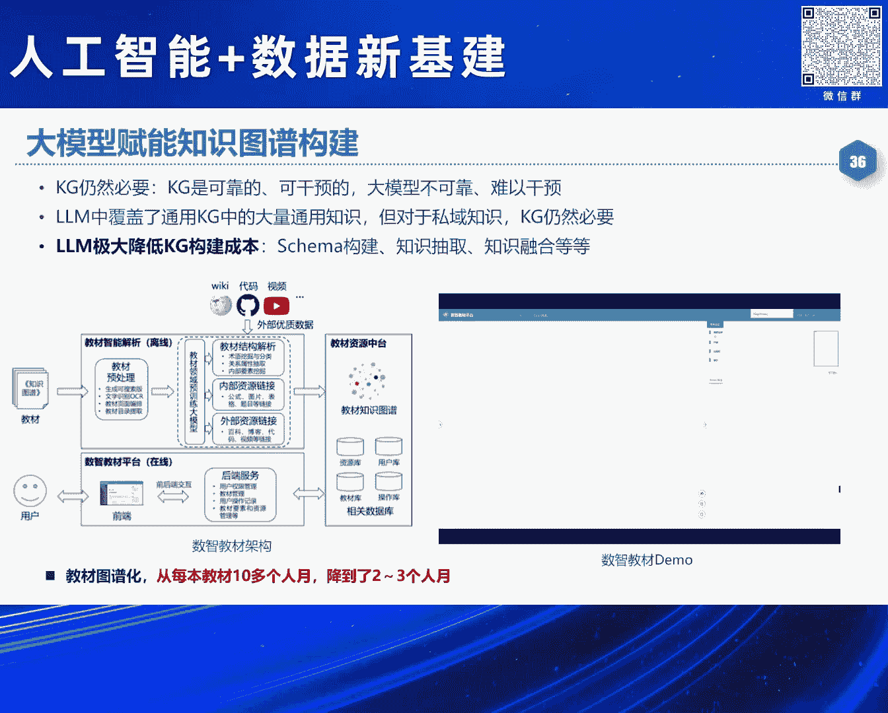
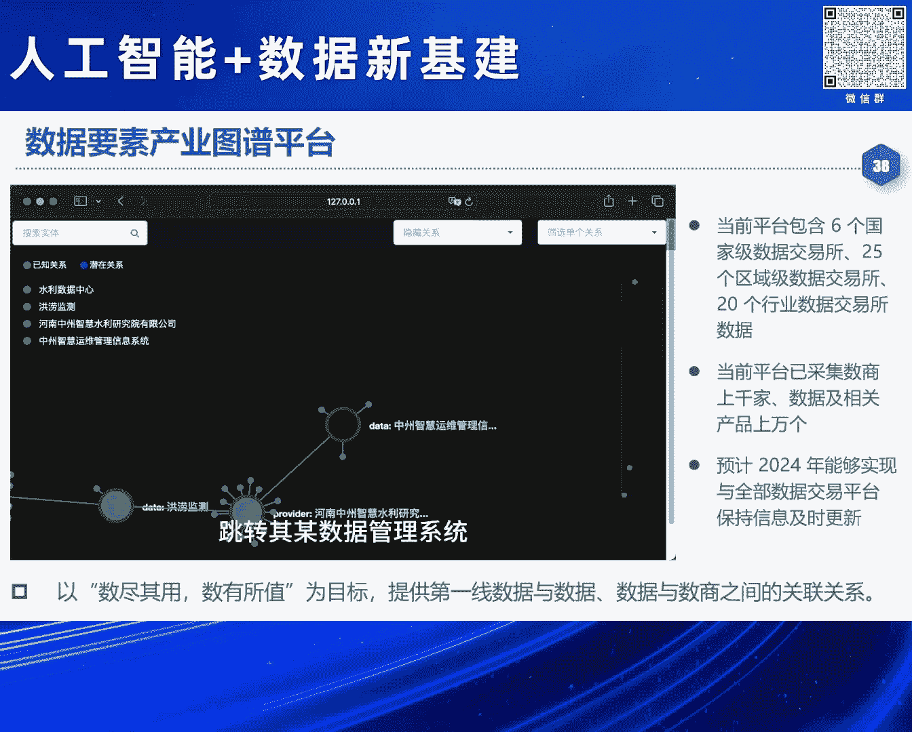

# 2024北京智源大会-人工智能+数据新基建 - P10：大模型助力数据要素价值变现-肖仰华 - 智源社区 - BV1qx4y14735

非常感谢冯老师邀请。

让我有机会能够参加我们论坛，那么今天前面各位专家，谈了很多数据要素，对于人工智能的重要意义，重要作用，那么我更多的反过来考虑这个问题，事实上我们的人工智能或者大模型，对于我们的数据要素。

它的意义更是重大，我的一个基本观点是说，数据要素的价值变现，将来需要一个大模型作为智能引擎，事实上我们这么多年都在做大数据，都希望数据尽快价值变现，但是现实情况是，我们的数据价值变现。

仍然路途还比较遥远，所以今天给大家带来这么一个报告，那么我们来看一下，数据进入到数据要素这个时代之后，我们的数据呈现出哪些新的特征，我想表达一个观点就是，数据要素它实际上，我实在数据呈现出。

前所未有的这种开放性和动态性。

这个恰恰是我们当下所面临的，一切问题的关键所在，我们都知道数据已经成为了生产要素，数据从战略性的资源，变成了新型生产要素，而且数据日益地对其他几个生产要素，像土地 劳动力 资本和技术。

起到了越来越重要的，这样一个支配的作用，那么最近几年，我们国家伴随着，数字经济体量的逐步增长，整个数据要素的价值变现的需求，日益迫切，数据要素价值变现的进程，逐步的加速。

但是反观我们当下的一些理论和方法，我们大家感受到了非常多的痛点和毒点，从我们的数据开放开始，我们就沾头顾尾，对吧 就心惊胆战，这个数据到底能不能开放，是否会触犯相关的法律法规的红线，到数据融合。

我们更是做的焦头烂额，没有哪一个企业在做数据融合，数据治理是很开心的一件事情，大部分数据治理都成为了企业，最脏的一个，最脏活 累活 最集中的一个部门，数据治理成了很多企业所谓的成本中心。

而没有变成它所谓的这种利润中心，再到我们的数据的应用，我们大部分的这个数据应用，还是停留在简单的表层的统计分析，数据到底在告诉我们什么，它背后的洞察，数据之间的深层次的这种关联关系，我们仍然并不清晰。

所以整个数据要素价值变现链条上面，仍然存在着诸多的这种毒点和痛点，归其根本原因，是因为我们现在这个数据要素价值变现，主要还是靠我们的人力去做，我们数据越来越复杂，这个问题越来越多样。

我们的人力已经很难完成，整个的数据要素价值变现链条，所以数据要素的价值变现仍然缺乏有效的手段，那么这有几个重要的原因，第一个很重要的原因是在于，我们这个世界越来越复杂，我们现在当下这个世界。

可以说是一个人机物多元融合的复杂系统，我们的人类社会系统，我们的人造系统，我们的自然生态系统，都前所未有的复杂，事实上整个人类社会，早就经历了它这个工业时代的，早期的这样一种纯真的婴童时代。

而进入了我们现在信息时代，乃至智能时代这样一种成熟的时代，而成熟的代价就是复杂，我们现在任何一辆整车，对吧，往往要几万个零部件，每个零部件又要经历一道，上万个元器件组成的生产线。

整个一个系统可以说是前所未有的复杂，而世界的复杂带来的是什么，带来的是咱们的系统和数据的复杂，我们去看看我们制造业的这些系统，动辄上万张的表单，关联在一起，现在还有哪一个人类专家，真的能够全盘的理解。

你企业的那些数据呢，几乎没有，再看看我们那些表单，我们中国式的这种表头，前所未有的复杂，对吧，所有的人工智能大模型，一看到这种表头，全部都要废掉，所以这个系统和数据，可以说是日益的复杂。

所以这个是给我们的数据价值变现，带来第一个挑战，那么第二个挑战呢，在于是说我们数字经济时代，我们数据的内涵发生了显著的变化，我们想想看我们在信息化时代，数据是什么，是对我们的客观世界的一种符号化的记录。

到了我们大数据时代，数据变成了一个资源，变成了我们发现规律赖以的，使用的这种推动创新的资源，再到我们当下的数字经济时代，你会发现数据现在变成了生产要素，变成了产品，变成了资产，随着数据的内涵发生了变化。

数据日益呈现出新的特点。

有些特点其实刚才各位专家也多多提到过，首先就是，大家看我们的数据要素是在持续流动的，我们的数据只有流入到生产，分配 流通 服务和管理的各个环节，形成整个完整的数据驱动的闭环。

我们才能够释放出数据要素的价值，我们此前我们的数据的管理，从来没有面临这样的挑战，而数据这样一种持续流动的，对于我们这种全链条的，自动化的 智能化的，具备高度协同能力的数据处理技术。

提供了前所未有的要求，我们的数据要素，要在流动过程当中，会与很多个主体发生关系，这就会导致什么呢，我们的数据的这种全属的确定，安全的可供，带来前所未有的挑战，数据今天可能在生产者手里。

明天可能在采集者手里面，后天可能在加工者手里面，再后天可能在使用者手里面，还有运营者手里面，不同的使用主体，都对数据提出了不同的要求，那么这个时候数据全属如何确定呢，如何安全可控呢。

我们这个数据在运营和加工使用过程当中，日益面临着一个前所未有的，开放的 异构的 复杂多变的一种，数据产业的生态环境，数据产业的生态环境可以说是，一种开放的复杂环境，你不知道你这个数据将来会要跟。

哪一个数据库系统打交道，是跟哪一种类型的数据库系统打交道，跟哪一种数据打交道都不知道，所以这就对什么呢，统一的标准化的互操作的，这种数据管理技术提出了要求，我们的数据必须在一个动态的。

增值过程当中才能够帮我们创造价值，数据的每一次这种动态处理，比如说我们汇聚了，可能就创造了一点价值，我们分析了就可能创造了一点价值，我们把它质量提升了，可能又创造了价值，我们把它关联融合了。

可能又创造了价值，这样一种动态的处理过程，才能够促进我们的数据，形成这个持续的这个增值，数据才有可能真正变成资产，但是我们现在的这些方法，有多少我们数据的管理和分析方法。

是面向这种动态增值过程去设计的呢，所以我们整个可以说，我们的整个数据的科学的理论和方法，远远不足以支撑，当前数据要素的价值变现，我为什么很多场合我提这一点，我们国家最近几年的数据要素。

非常重视这种加强制度的建设供给，对吧，加强基础建设，事实上我们可能忽略了一点，我们也要加强技术供给，很多时候不是说企业不想去做数据变现，而是说企业没这个能力，或尤其是考虑到巨大的成本投入之后。

更是不愿意去做这种数据价值变现，至数据技术层面的这样一种毒点和痛点的存在，数据技术的供给能力不足，其实也是当下数据制约，数据价值变现的一个重要问题，所以我们要去找手段，那么什么样的技术手段。

能够让我们又快又好的，实现数据要素价值变现呢，我想问题的最终答案可能就是我们当下，人工智能的最新进展就是大模型，事实上时代抛出一个命题的时候，往往也给了我们这个命题的答案，当我们进入了人工智能时代。

当我们数据要素变得越来越困难的时候，我们当下正在发展的人工智能给我们提供的这个大模型。

却有可能是我们解决数据要素核心问题的一个答案所在，大模型可以说是从本质上来讲，它到底是什么，很多人不同的角度 有不同的理解，我认为大模型本质上是利用了人类已经积累的数据。

习得了对于这个复杂世界的一种建模，比如说它从数据里面学到了，苹果从树上掉下来是要落地的，而不是要飘到天空的，所以它本质上是从数据中学到了我们人类对这个世界的认知，我们人是怎么认知这个世界的。

我们人本质上是通过个体的经验和文明的传承，来建立对这个世界的认知，而我们的机器是靠什么，我们的机器是靠从数据中的学习，尤其是自监督学习来习得对这个数据的建模，或者说对这个世界的理解。

大模型一旦理解了这个世界之后会怎么样，它的一个结果就是，它一定会成为一个知识的容器，你会发现大模型从海量的语调里面，学到了我们人类的所有的学科知识，我们曾经做过评测，我们教育部的200多个二级学科。

你去把那考题拿过来去测，我们大模型像GDPR先进大模型，都能够做到一个六七十分的这样一个成绩，但是我们人类呢，我们每个个体是很难在每一个学科，都取得如此的成绩，所以大模型提供了海量的知识的容器。

大模型更成为了模拟人类认知能力的这样一种新的引擎，我们以前整个人工智能最害怕的就是所谓的，常识理解的问题，甚至常识理解都被视作是人工智能的第一性问题，曾经被我们质疑了很多年，我们到底能不能做到。

但是今天我们再去看常识理解，基本上大模型是能够比较好的圣人，而且大模型不单单能够理解了我们语言中的常识，语言理解 概念理解，运筹规划 问题求解 自始反思 价值判断，组合范化 评估评价等等。

很多我们人才具备的能力，现在大模型也具备了，所以大模型更成为了一种认知能力的一种引擎，伴随着大模型越来越成为一个，自知自能体的一个大佬，它有可能成为智能体，让智能体真正意义上。

能够跟这个复杂世界进行自主的，自适应的交互，智能体的这种自知性和自主性，是有可能进一步实现的，所以大模型又进一步成为了，各种各样智能体的大佬。

那么正因为大模型具备了世界的建模能力，又具备了刚才说的这些能力之后，它对于我们的数据要素，带来的意义是什么呢，它带来了全面认知数据的能力，可以说大模型现在对于我们的数据的认知能力，不比我们普通人差。

甚至不比我们专家差，我们去看一下大模型，实际上它现在已经具备了很多概念理解，我们说数据库里面的数据，首先要理解这种原数据叫scanner，scanner里面大量的是这种概念。

比如说两个scanner是能否类比，那么现在大模型基本上能够理解，这些概念和概念之间的关系，如果我们把一张数据表格去问，GPT-4，问它这张数据里面有什么错误，这是我们人为构造的一个例子。

第一行是小明自身的数据，第二行是他父亲，第三行是他母亲，我们人为的植入了很多错误，比如说小明的父亲是张三，78年出生，小明是80年出生，你就问大模型，这些数据里面有什么错误。

现在大模型基本上能够比我们人，普通人都能够找得全找得准，这里面的数据中蕴含的错误，蕴含了哪些逻辑错误，所以大模型又进一步具备了，实力数据的理解能力，所以说大模型有可能是，能够认知我们的数据。

它不但能够认知这个数据，它更能够去制作去操控我们的数据，当下我们正在研发，很多企业都在研发所谓的叫数据agent，数据库agent，数据管理agent，数据分析agent，我们今天去问很多大模型。

比如说以表格形式，对比上海和北京，每年八月份的平均温度，那么这件事情以前，我们可能需要一个研究生，去查找数据，去绘制表格，去调用统计检验的软件工具，来形成结论，这些有很多步骤，那么今天的大模型。

有了强大的规划能力之后，工具使用能力之后，它就进一步的具备了，这种自主操控数据的能力，那么大家想想看，有了认知能力，又有了操控能力，那怎么样，我们原来人类社会。

是靠人类专家去理解数据，去操控数据，那么这些事情，是不是可以交给机器了呢，所以大模型一定将来会成为，驱动推动整个数据要素，价值变现的一个重要引擎，将会成为激发数据价值的。

智能的新引擎，但是我们也要意识到，大模型在推动，数据要素价值变现过程当中，仍然面临着巨大的挑战，因为我们千行百业的这些数据，它是用来支撑各行业的，复杂的决策的严肃的应用，那么这些应用，不是我们当下。

China GPT这种闲聊，就能够胜任的，我们作为一个行业专家，我们看到这个数据之后，是要做决策的，这个时候我们需要什么，一个行业专家，需要有丰富的知识，领域知识，需要有复杂的这种决策的逻辑。

需要有对宏观态势的研判能力，比如说现在股市是熊市还是，这个牛市，需要综合任务的这种拆解能力，还需要一些精密的规划能力，需要复杂约束的取舍能力，比如说我们的医生，在决定你的治疗方案的时候，要考虑很多约束。

又要舍弃很多约束，还要有未知事物的预见能力，市场总是在不断地发生变化，还要有不确定场景的推断能力，这些能力都是我们目前大模型，在去支撑基于数据的决策过程当中，仍然缺失了很多能力，而且大模型本身。

它作为统计模型，仍然存在着幻觉现象，缺乏领域的忠实度，可控性 可理解 可解释 可编辑，这些性能仍然都存在着诸多问题，还有就是成本问题，所以大模型在真正的，推动数据要求假设变现的过程当中，仍然可以说是。

面临着巨大的一些挑战，尤其是大模型对于我们，私域数据的这种专业性，和私有性的理解，仍然是存在着巨大的鸿沟，我们有很多行业数据，都有一些自己的编码规范，自己的编码标准，大模型何以能够理解。

你的这种私有化的表达呢，我们的很多行业数据，都背后是有着非常复杂的，专业知识支撑，比如说传感器的数据，所以大模型何以能够理解这些数据呢，这些都需要我们进一步提升大模型，对于行业的理解能力。

对于私域的理解能力，那么进一步呢，我们会发现大模型，已然在很多数据要素，价值变现实践当中，发挥着重要的作用，我们首先说大模型，为什么说数据要素的价值变现，一定将来要靠大模型，因为大模型。

可以说是提供了一种，端绕端的价值变现路径，我们以前大家想想看，行业中我们要把数据，这个价值发挥出来，要需要什么，需要业务分析师去分析业务逻辑，需要数据工程师去标注数据，算法工程师去设计算法。

用户来进行反馈验证是吧，可以说是，这个代价是极大的，但是今天我们所有的数据，都可以丢进大模型里面，去炼制一个行业大模型，用行业大模型，再通过一些插拔式的组件对吧，来发挥这个数据的价值。

所以它本质上可以说是一种，端绕端的价值变现路径，这不就是我们行业甲方用户，梦寐以求的吗，把数据都扔给你我就不管了对吧，付费就完了对吧，像我们现在呢，还要重度的参与是吧，还要跟你去整天开会是吧。

那么将来是不是可以避免这些工作，而且我们现在有很多异构的多模态数据，你会发现现在大模型，不管你什么样的数据，只要咱们能把它序列化成一个，Sequence of Token对吧，一个序列化的一个数据。

咱们Transformer就能发挥作用，或者就是用那个如果是一种，带结构比较丰富的数据，我们可以用Diffusion Model对吧，也就是不管你是什么模态的数据。

似乎只需要用Transformer和这种Diffusion，我们就能够吸得这个数据中所蕴含的知识，所以才实现了一种统一的价值变向路径，那么尤其对行业来讲，我们现在数据要素价值变向。

最大的一个毒点就是数据治理代价大，我们现在为什么数据治理这个代价大，主要是靠人对吧，我们说数据治理这个事儿，我觉得将来是一定要交给大模型，为什么，因为数据治理里面。

我们主要是要解决数据中的很多问题和错误是吧，而错误和问题恰恰是具有开放性的特征，因为我们没有人能够预料用户会犯什么错误，没有人能够预料数据中存在哪些非常，不可能的错误，错误都是你意想不到的。

我们曾经看到过一个真实数据，说在一个坐标它写错了，一个舰艇停在了沙漠中的一个坐标，这是不可能的事儿对吧，所以它这个很多错误你是根本就想不到的，所以正是因为错误有开放性，那么人是不可能预设所有的错误的。

但是大模型它有很强大的开放理解能力，所以这些我们都可以交给大模型，我们现在已经在做很多种实践，比如说大家知道，我给你告诉你一个位置信息，杨浦区中环路和某个路的交叉口西北什么位置。

这个是一个非常不规范的一个地址，我们能不能利用大模型的这种理解能力，把它清洗成一个规范的数据呢，现在利用大模型的文本理解能力和工具使用能力，这件事情基本上是能够做到。

我们还可以用大模型去做很多预料的清洗和治理，就大模型本身训练预料的治理，但这里我要说一件事，就是大模型预料规模往往巨大，比如说几个T对吧，这里怎么办呢，这个成本就是一个很大的问题。

实际上我们现在在利用大模型去治理预料的时候，往往要做有选择的治理，往往把一些比较hard case，困难的case交给大模型，简单的case还是用大模型增强了一些小模型来去解决。

所以用大模型来去做这种预料的治理数据治理，成本问题是大家不可回避的一个因素，我们实际上还在利用大模型做大量的知识验证，很多场合我们还要做知识库的构建，那么这个知识到底对不对呢，我们可以用大模型来验证。

我们还可以用大模型来做结构化的数据访问，我们现在关系数据库的表，我们都可以用自然语言去访问，来释放数据的价值，我们现在很多的数据分析，在利用大模型驱动的agent来做自动的分析。

而且这个成本有了一个极大的提高，现在已经有些初步的数据，我们还可以利用大模型去做数据的智能运维，就是数据库系统的智能运维，不再需要传统的专业语言才能够去做，那么这个现在都已经在很多系统里面都实现了。

我们还有可以用大模型去实现一种就是知识工程，我们传统做知识图谱，要去构建scanner。

要去做知识的抽取，知识的验证，知识的问答，我们现在完全可以利用大模型。

去征留一些知识，再利用大模型，来去用提示的方法来构造图谱，我这里举个例子，我们以前要做教材的这种图谱化，把教材里面的知识全抽出来，这个本来是个代价极大的事，每一本教材都要构建相应的模型。

一万本教材里就要构建一万个模型，那么今天我们只需要用大模型，就可以把教材里面的这种，识体关联关系全部自动化抽出来，基本上可以从每一本教材本来要十多个月的代价，现在只需要两三个人。

所以大模型来驱动整个知识工程，这个基本上可以极大的提升它的效率，我们也利用这个思路，利用大模型来驱动知识图谱的构建，我们也构建了一个数据要素的产业图谱平台，实际上我们国家现在。

待会可能有个talk就是在讲数据要素的全国统一大市场，其实这个统一大市场缺一个什么呢，缺情报的支持，这个情报就需要一个产业图谱，我们实际上在构建一个围绕数据要素产业，构建它的一个资源和生态的图谱。

把所有数商 数据交易所 数据，把它关联关系给建立起来，那么我们的目的是什么呢。

目的将来比如说我现在要研发某一个数据产品，哪一个公司有什么样的产品啊，哪一个产品在哪一个交易所挂牌啊，那么这些信息我们是不是都可以通过这张图谱来找到，是这样子的，这张图谱将来会成为。

推动数据要素产业发展的一个非常重要的情报的。

支撑的一个来源，当然大模型还可以释放我们千行百业的文档的价值，这个之前大家看到了很多，像最近那个一些大补习厂家像Kimi对吧，这些本质上都是在做这些事，但是这里的路途也很遥远，仍然有很多工作要做。

那么最后我想说，用一个简单的公式来总结，未来推动数据要素市场的一个重要方式，或许是大模型加上数据要素再成千行百业，就是我们要一方面把数据要素，整理好 治理好 把数据集结好。

另外一方面把数据用来练好一个大模型，然后再利用大模型的能力，再把我们的数据做得更好，然后数据要素和大模型深入融合，协同发展，在我们千行百业中的应用去反馈。

去验证 去迭代，好 我的报告就到这里，谢谢大家，謝謝。