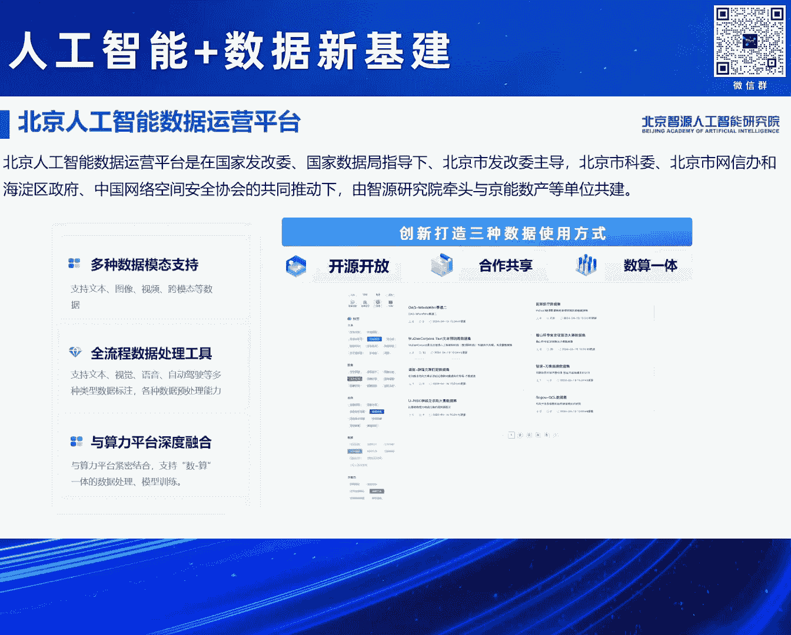
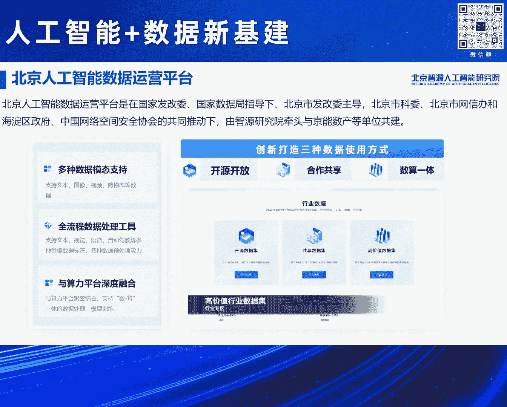
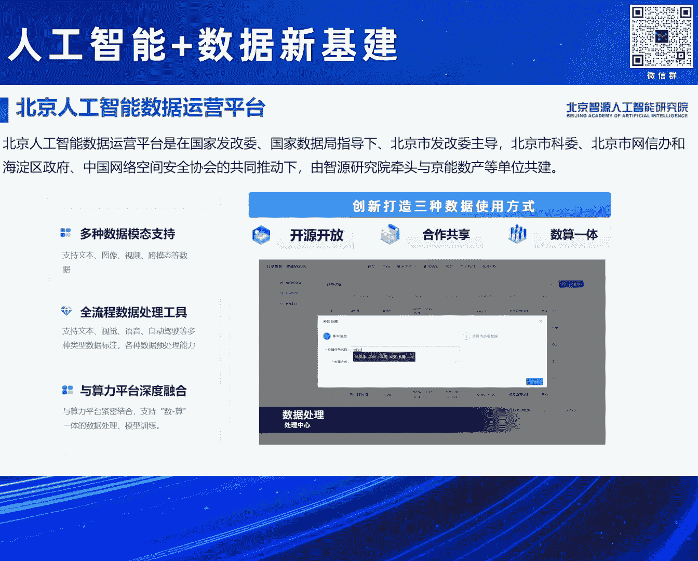
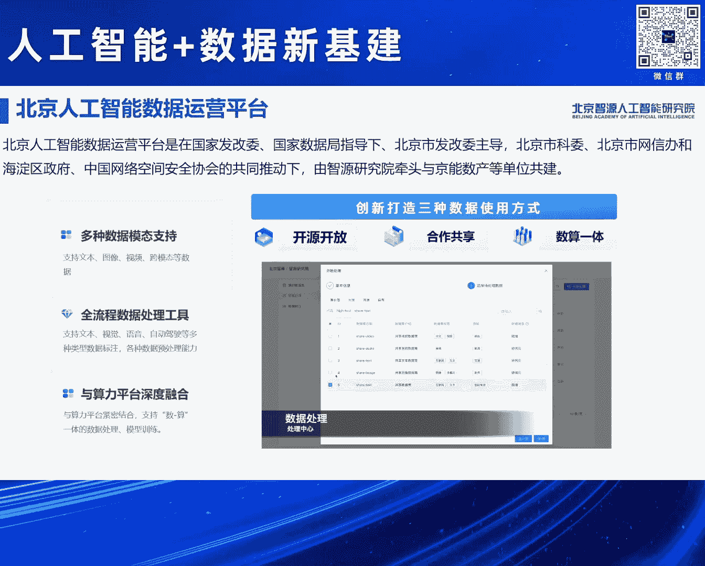

# 2024北京智源大会-人工智能+数据新基建 - P3：介绍“北京人工智能数据运营平台”-林咏华- - 智源社区 - BV1qx4y14735

大家好，感谢各位嘉宾，很荣幸今天在这里头给大家介绍北京人工智能数据运营平台，首先我还是想稍微介绍一下它的一个重要性。

我们在过去十几年做人工智能，其实我觉得这三个数据集是尤为重要，在2007年ImageNet开始筹建，2012、2011年发布，如果没有当初的ImageNet。

其实并不会那么快出现AliceNet、ResNet这些，影响了我们后面所有计算机视觉深度学习的这些模型出现，那又如果没有在2007年，就已经开始构建的这个全球最大的网页的数据集Common Core。

也不会出现我们这么快迭代的语言模型，也如果没有在2021年启动的这个LAN的这个数据集，这也是一个国外的数据集，这个是有几十亿图文对的，也不会有过去这几年出现的CLIP这种，跨模态的图文模型。

也不会有到现在这么蓬勃发展的多模态，所以正因为有这个全球，其实是在国外这些，来自非盈利都是非盈利机构的这些长期的积累，如果没有它们的确我们很难想象，在过去十几年这么快的人工智能的迭代。

尤其是到了现在大模型的迭代，那但是这个，有这些数据集够吗，远远不够，所以在这里头首先我也想给大家分享一下，在我们做这个人工智能数据，尤其是训练数据我们会面临的三大难题，数据量，数据质量，数据使用。

首先数据量，虽然common cloud数据集，每个月有几十亿的新增的网页，但咱们看回来咱们中文，咱们中文的互联网用户，全球占比接近20%，但是咱们国内的中文网站的全球占比十分的低。

这里头当然还有一个重要的问题是，数据孤岛问题，咱们可以想象，今天大家每天用的APP里头，我们看的新闻是不是很多都在，例如像微信抖音这些APP里头，所以这里头就存在很多的数据孤岛问题，另外还有就是多模态。

在这个新兴的模态里头，到了我们的视频数据，未来的3D数据，这些就更加少，那再落入到行业数据，这就是又是十分欠缺，那另外数据质量，也是很多的问题我就不再赘述，还有一个很重要的数据使用。

我们离不开的一个问题，总是会讨论的是数据版权问题，数据安全问题，所以摆在我们前面的这三大问题，我们希望不断地去探索，我们必须要去做一些事情，不能等这些问题都解决了。

我们才启动我们人工智能大模型的发展 是吧，所以这也是为什么我们智原研究院，在过去的几年一直在积累，来探讨，那我们通过首先，我们通过大量地去汇聚这些数据集，试图帮助整个产业，来积累这个数据量。

我们希望打造，更多更好的数据处理工具，来帮助大家来提升这个数据质量，尤其很重要的是，为什么我们要发布这个数据平台，就是进一步来帮助大家去解决，这些数据使用的问题，所以今天等会要发布的这个。

人工智能数据运营平台，它是涵盖了平台。

数据集和工具这些重要的部分，首先这个北京人工智能数据运营平台，是在国家发改委，国家数据局的指导下，由北京市发改委主导，北京市科委，市网信办，海淀区政府，还有中国网络空间安全协会共同推动下。

由智原研究院和金融素产共同建设，为什么我们需要这么多的这个，相关的部门，国家级包括北京市部门推动，的确数据这个问题，很重要也很难，所以我们必须要借助很多的社会力量，来去共同去推动和解决。

那我们在这个数据平台上面，有三种的使用方式，首先是开源 开放，我们会有一批的数据集，是完全不需要任何条件，大家可以下载使用，这一块很重要，这是我们视为一个社会责任，也是推动科研创新很重要的。

第二个对于一些有高质量的数据，我们会构建这个合作共享，也就是在一个联盟的范围内，大家去共同构建这样一个数据池，大家贡献多少，它可以换回多少，这样一种合作共享的创新的方式，来鼓励更多的企业加进来。

去互换这种高质量的数据，最后我们还是会有相当多的是，版权数据，相当高质量高价值的数据，是不能够被带出来去使用，毕竟我们今天从版权法的角度，还未能完全解决这个问题，所以我们也打造了数算一体。

这样的一种使用方式，也就是说，我们的数据存在一个安全域内，它的加工和模型的训练，都不出这个安全域，模型团队在通过这个安全域，去进行数据的加工和训练之后，带走的是模型，数据不带走，这样子进一步的。

要保障这个数据的一个安全，所以基于这样三种方式，我们整个平台支持了多种的模态，包括文本 图像 视频等等，也打造了传流程的数据处理工具，前面黄老师一直提到，我们希望用AI的方式，来解决这个数据标注的问题。

这是我们的一个目标的方向，然后另外还有一个很重要的，黄老师说为了支撑数算议题，我们把数据和算力打通，深度融合，那前面是平台，后面是数据，我们现在在今天发布的这个平台上面，已经聚集了两大板块的数据。

一个是适合于用来做通用模型训练的，通用数据集，已经积累超过了700TB的通用数据集，放到了这个平台上，此外我们也愈加发现，看到行业垂累的数据很重要，所以我们也打造了行业的专业板块。

来放置这样行业的垂累数据集，那这些数据也是基于过去这么多年，资源的一个积累，以及刚才谈到的相关部门，以及咱们在全国，超过30家合作企业，贡献的所有数据，我们会以开源开放，合作共享，数算议题三种方式。

来提供给大家使用，那进一步，今天也随着这个平台的发布，也进一步介绍一下，我们有两个很重要的发布的数据集，一个是今天早上在主论坛提及的，全球最大的多行业，中英文双语数据集，这个数据集涵盖了18个行业。

分为开源数据和非开源，也就是可以向我们定向申请这个数据，那总共有4。3TB，还包括医疗以及教育两个行业，它的微调数据和，这个人类反馈的这种对齐数据，那大家可以看右边右下角这个图，这个图上面。

那个橙色的bar是指我们在某一个行业，我们的这个数据集量，蓝色的是目前全球已经开源的，在这个行业里头的数据集，大家可以看到，我们在几乎所有的数据集上面，都远超现在全球已经开源的。

所有的在这个行业的数据集的总和，所以我们说，这个数据集的推出势必，帮助大幅提升全球各个行业，开源数据集的总量，那为了证明这个数据集的有效性，我们也针对医疗行业进行了一次实验，我们在我们的基础模型上面。

把这个数据集医疗行业，其中18行业里头医疗行业的数据，进行一个首先是预训练，持续预训练，然后提取它的SFT数据，然后再做IHF的训练，做完这样一个流程之后，我们可以把一个普通的基础模型。

在医疗行业的一些评测上，提升20%，所以这意味着说，所有的行业企业，您都可以使用这样子的数据集，重复我们这样一套流程，去获得您的行业模型的提升，并且我们这样一套做法，也会就在这两天在Archive上。

上面会放出来，那另外一个今天也是发布的，很重要的数据集，是千万集的这个指令微调数据集，那大家向来知道，在去年大模型起来很多开源，但是众多的开源里头，没有哪一家厂商，把自己真实的这个SFT数据集开源出来。

所以几乎所有的大模型企业，它要针对一个基础模型，进行SFT训练的时候，不得不重构自己的SFT数据集，因为大家都视为，这个是它自己的秘密武器，所以这一次致远也是，我们重塑了整一个SFT。

这样指令微调的数据集，并且进行了我们的模型验证，那目前我们是已经完成了，三百万条的数据集，其实我们整个千万条的数据集，已经准备好了，但是我们是属于逐步验证，我们要在多个基础模型上，通过这样的数据集。

来验证它的一个效果，真正能达到提升整个性能质量的，我们才敢放出来，那目前我们已经完成了，三百万条的验证，然后已经放出来，大家可以在这个开源网址去下载，那这个效果大家可以看，橙色的是我们的，我们是用那个。

MRTB这样一个模型，去做一个指令微调，它出来的效果比，LAMA3的8B的Instruction的，以及后面的这些，包括3。5包括Gemini都要好，所以大家可以期待，把这个数据集拿回去下载。

用于您的这个下游的，这个Chart模型的指令微调，那当然这样的数据集建设，也是基于我们很多的技术的加工，包括多标签的数据分析，要保证多种能力的一个分布，高质量的数据筛选，还有数据合成等等。

在这因为时间关系。

我就不详细说，那最后刚才提到了工具，工具是我们很重要的，提升数据质量的武器，我们这次也是把我们，智源研究院在过去几年，一直迭代的工具，进行了一个完全的升级，通过同样的工具，我们去处理这些数据。

所以今天这个FlatData，这个工具集也是升级到了3。0，大家可以在这个开源网址，进行下载使用，最后大家如果有看，今天上午的主论坛，OpenAI的Ramesh他提了这句话，我挺喜欢这句话。

虽然不是百分百认同，他说到说，与其我们固定住数据集，而去攀登这种，我们的目标函数和模型架构的话，现在他认为应该是，固定住目标函数和模型架构，不断在数据集的高峰上进行攀登，那其实这个也是印证了。

大家的一个行业共识和产业共识，数据 包括数据的质量，包括数据的认知，对模型的性能和它未来的智能，起了至关重要的一个因素，坦白说大模型领域，数据是一个很深的研究，我指的是我们整个产业，包括学术界。

对于数据的问题，还是初步的一个研究，我们所有的力量还是刚刚起步，所以我们也呼吁，希望有更多的力量，无论是数据汇聚，还是数据研究，可以投入到这里来，谢谢大家。

謝謝。