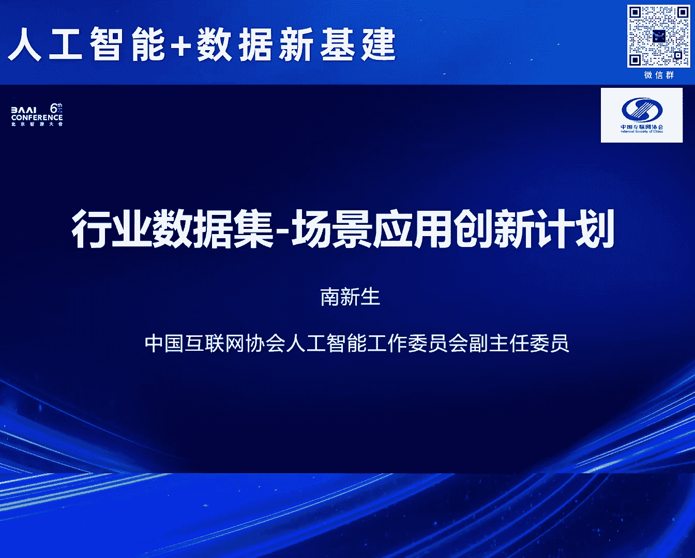
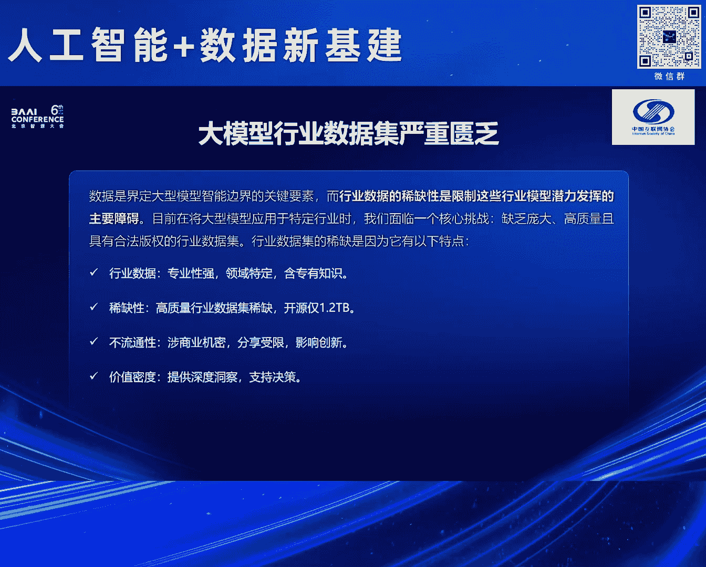
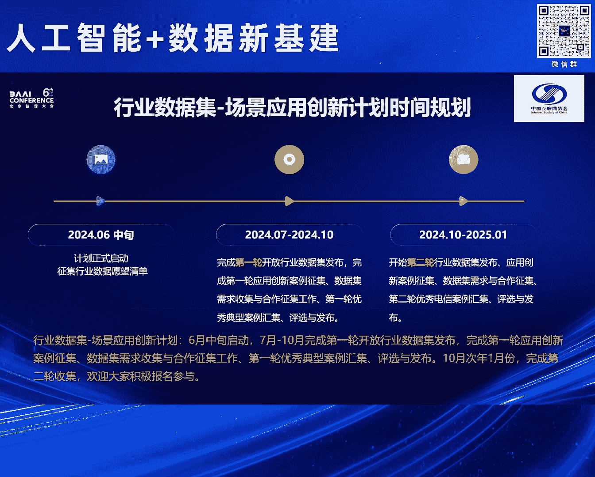

# 2024北京智源大会-人工智能+数据新基建 - P4：介绍“行业数据集-场景应用创新计划-南新生 - 智源社区 - BV1qx4y14735

我代表中国互联网协会来介绍一下我们要，启动的这项计划，这个计划的名称叫行业数据局场景应用创新计划，那么在通用大模型如火如荼的今天，其实更多的企业更关注的是人工智能在行业里边的应用，是行业应用模型。

行业大模型怎么样落地的问题。

那么由于数据是界定大模型智能边界的关键因素，再加上行业大模型的数据，由于它的专业性 稀缺性和不流通性是一个严重匮乏的，这就制约了行业大模型的落地。

所以我们说行业数据局是大模型落地的重要的基石，也正是基于行业数据局对行业应用对行业大模型落地的重要性，所以我们中国互联网协会联合智源研究院，按照国家AI+战略的指引，为了解决行业的痛点。

我们发起行业数据局场景应用创新计划，那么这个计划是有基础的，这个基础就是刚才林院长介绍的，他发布的这个平台里边，其实也介绍了智源研究院在行业数据局里边已经有的积累，这就是他刚才讲的。

我们已经覆盖了18个主要的行业，有高达4。33T的数据，今后还会拓展到30个主要的行业，那么这个计划相对也比较简单，分三个部分，第一个部分也是刚才林院长讲到了，我们会进行行业数据局的发布。

同时争取应用创新的案例，那么第二个要做的事情就是，收集行业数据的需求，征集合作者合作的方案，第三个就是对应用创新的案例进行评选和推广，那么简单的三个部分，时间安排上是今天发布。

争取在10月份之前完成第一轮的数据局的发集，应用案例的征集，需求的收集和评选推广，争取在明年的1月份之前完成第二轮。

这就是时间的安排，所以欢迎广大企业，所有有意愿的能够参与进来，那么我们也利用今天的机会，就给大家一个二维码，请大家扫描，我们便于我们征集行业数据的愿望清单，这就是我的对这项创新计划的一个简单的介绍。

