# 2024北京智源大会-多模态模型 - P2：生成式多模态模型-王鑫龙 - 智源社区 - BV1sT421a7FU

2014。05。22 上海当代艺术博物馆 李冠辉。 东方太模型，大家好，今天很荣幸有这个机会跟大家分享，我们最近在东方太模型上面的一些思考跟最新的一些进展，首先先说一下背景。

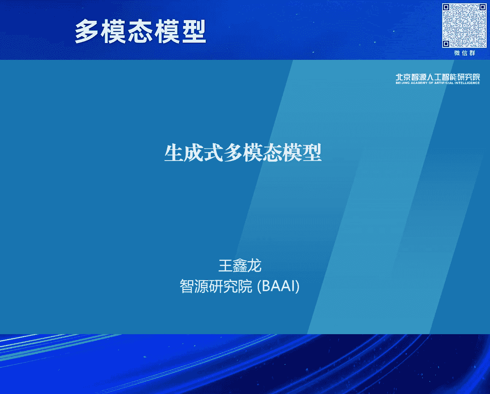

大家都不用去强调我们语言视觉各种模态的一个作用，我们显而易见的每时每刻都是生活在一个，包括语言视觉等各种模态的一个context，一个上下文里面，然后去做各种的任务。

可以理解成我们的最大的context lens是100年，当然这个不是一个无损的context，只是说我们在这种动态上下文里面去接受它的信号，同时完成各种动态的任务，所以说在这样的一个环境里面。

动态的这种上下文能力就显得非常重要，这是对应我们今天说生成式动态的动态这个词，生成式大家相信也很熟悉，跟生成式相对的，大家一般会说判别式，discriminative，比如说我们以前在img。ly上面。

选一个1000类的图像分类模型，我们说它是一个判别式的图像分类模型，跟generative一般经常出现的，就是unsupervised，我们认为比如像GBT，它可以在text上面做生成式训练。

generative protraining transformer，实现一种无监督的学习，这样学完之后，最后它变成一个generalist，就是一个通才的模型，与此相对的是一个specialist。

就像刚刚说到的，我们在图像分类，或者一个任务上训练一个专门的模型，对应的就叫specialist，所以我们可以看到，整个GBT系列的成功，它其实很好的对应了，它是一个在文本上，unsupervised。

generative protraining的一个generalist，然后我们思考，我们做这个，最近的一个动机是，成功能不能复制到，包括视觉跟动态的领域，然后也是今天想跟大家分享的一些内容。

首先可以先回顾一下，这个GBT的成功，它带来了一个很强的。

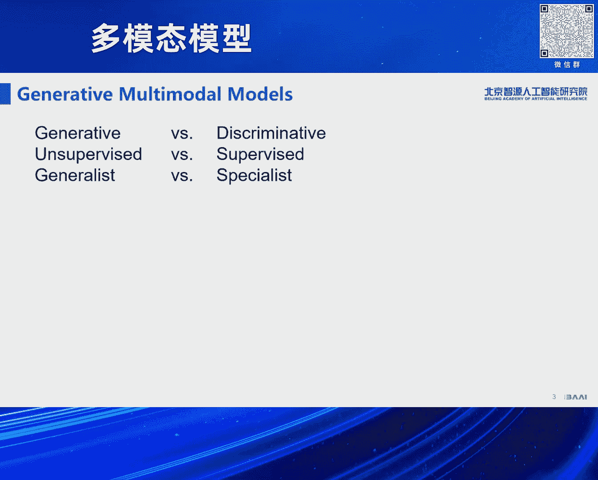

上下文学习的能力，我们叫incontext learning，可以简单回顾一下，就是说这个是，GB3 paper里面的case，跟它的定义，左边这个例子很好理解，我们这个原模型训好之后。

我们给它几个这样的例子，比如说把这个顺序编对，然后虽然它训练里面，没见过这种任务，但是你可以在，推理的时候test time的时候，给它一些example，然后它可以实现新的任务，也就是说它通过。

预测未来会发生什么，来完成一些训练里面没见过的任务，这个我们看到在语言里面，这种incontext learning的能力，取得了很大的成功，所以我们，比较早的一个工作，当时就是想。

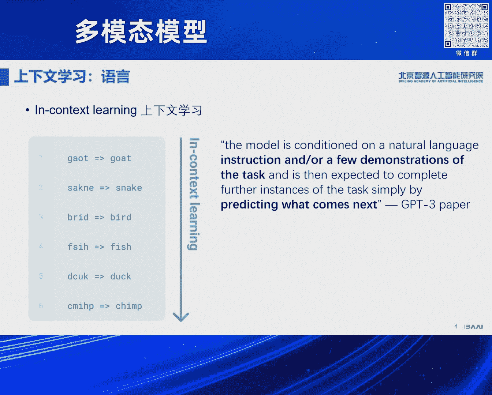

把这个成功复制到视觉领域，就是当时。

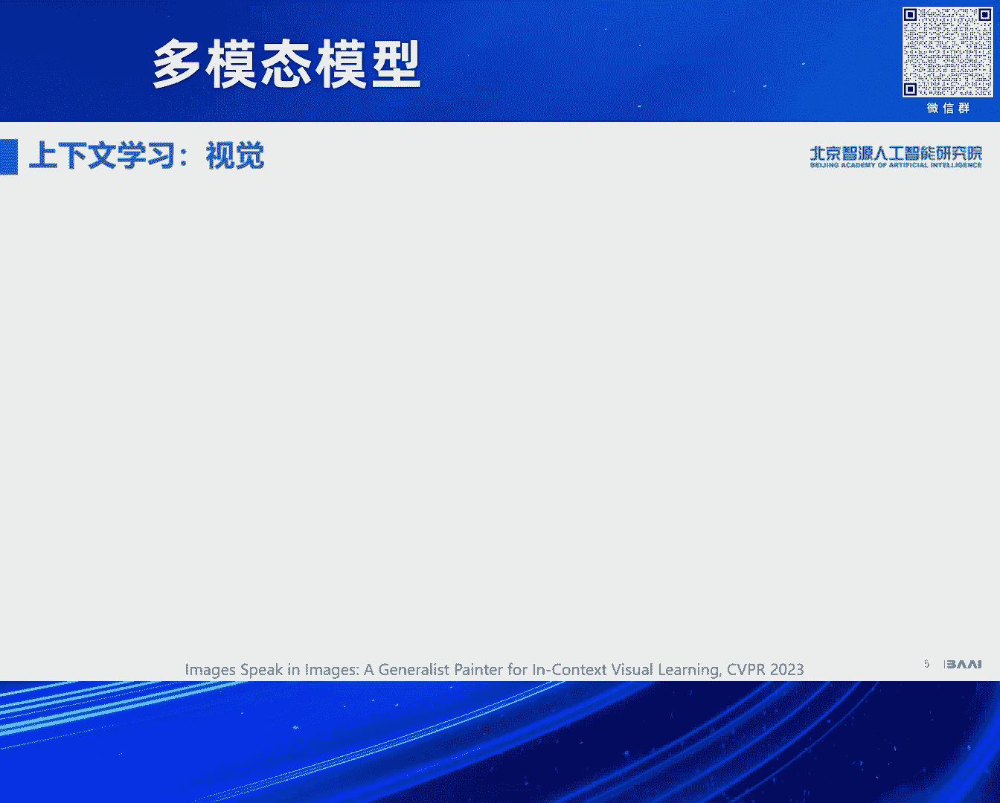

一个很大的动机就是觉得，说图像的语言，images speaking images，我到现在还是很喜欢，起的这个名字，我觉得这个潜力还没被完全打开吧，就是说图像可以作为一个，通用的接口。

表达跟语言不一样的东西，当然这个工作当时，二二年的工作这个动机是，把图像作为接口去统一各种视觉任务，然后实现一个视觉的上下文的能力，就像刚刚的语言一样，我们给它一些example。

然后期待它能完成已有的，包括新的这个任务，然后它把图片本身，一个RGB的图片本身，当作输入输出跟prompt，然后实现了很多任务的统一。

然后我们就接着这个想法，后来把它focus到分割这个任务，就是希望在上下文里面去分割，任意的目标物体，然后这个也是说，我们因为很难通过，纯靠训练本身来便利各种的case，那我们如果能在测试的时候。

给它一些比如左边这个，分割Loss spike这种case，那它能够在测试的时候，自动的学到这种能力，是我们觉得是视觉上下文学习能力，一个很好的体现，当然也包括视频里面视频分割，我们可以给一帧或者少帧。

例子作为输入，然后它可以分割类似的物体，然后这里有乱吧，然后后来应该是去年底，还是今年初，Burghley的Large Vision Models，相信大家都看到了，它把更多的数据。

它汇总了应该我记得是50个数据集，然后变成一个序列，去做这种autographic的训练，然后展现了更强的上下文学习的能力，比如说下面的这个填图的case，我把前面的这些例子码掉，然后最后给一个。

类似解答这张题的题目，然后它可以去预测，相当于通过impending，去解这一道逻辑推理的题目，当然我觉得纯图像的，应该在Lending目前还是比较局限的，我觉得两个原因可以分享一下，一个是说。

一个数据本身就是，面向视觉任务的数据，它的diversity是不够cover，我们理想中视觉任务的diversity，因为视觉任务diversity是非常大的，那我们以前的传统的，每一个数据集。

其实很难去提供一个，很完备的数据，然后另一点是，这个图像本身，它的context是比较弱的，比如说我们像语言，它的context是很强的，你一个词可能对比较长之后的，一个词产生很大的影响。

但对一张图像来说，这个上下文关系是很弱的，所以这也导致了，如果只从图像本身，它很难学到非常强的应该的能力，这也是为什么我们，前面要手动去构造一些，比较规则的context或上下文。

让它学到一个固定的能力，然后从视觉到，除了刚刚说的纯图像本身，那我们另外思考的一个问题是，能不能把它再往前走一步，走到包括图像，视频多姆态的领域，能不能实现类似GPT-3的，一个上下文学习的能力。

然后这里就必须得，回顾一下，sorry 这个应该是格式的问题，就是这个Flamingo，是上半年的模型，它们其实是比较早的，做这种上下文理解的能力，比如说每一行它相当于是一个任务，比如说算术这个。

我觉得是比较有意思，就是给它一张图，然后给它一个式子，然后你下面给它两个example之后，再给它一张图，它去自动地完成，图像理解的任务，但是Flamingo应该是比较早来说这个东西的。

那我们其实也是很受Flamingo的启发。

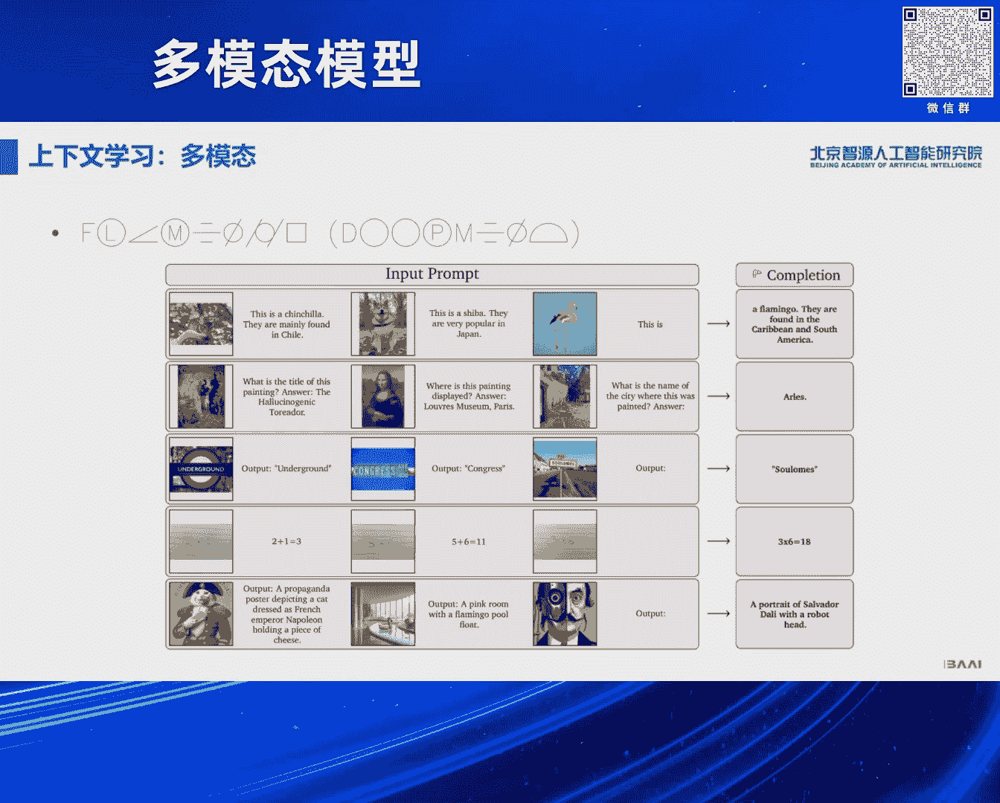

然后当时的，包括Flamingo包括GPT，当时的一个动机是，我们知道GPT是在文字序列里面，预测下一个词，那一个很简单的动机就是，能不能在多姆态数据里面。

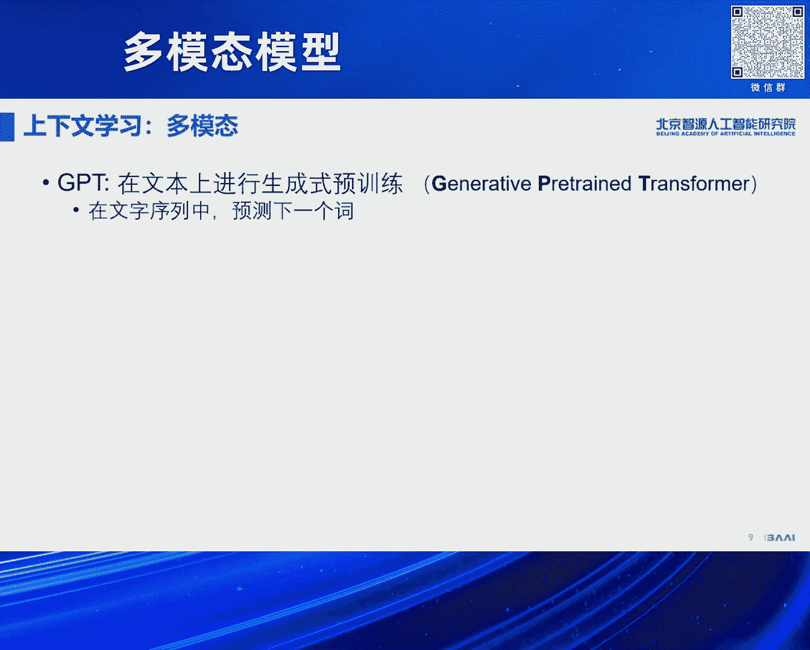

进行生成式的训练，然后它能够学到什么新的能力，包括什么新的上小文学习能力，是我们非常关心的一个点，因为这里的数据就不只局限在文字了，它可以是图像 视频，可以是图文交错的文档，可以是视频文本交错的数据。

甚至音频交错的数据，所以带着这个动机。

我们去年上半年的时候，到去年底，探索了，这里是1米1跟1米2，它应该又乱码了，就是说探索生成式的多姆态训练，就是我们在多姆态序列里面，去预测下一个，那对于图像我们可能预测下一个patch。

对于这个视频我们预测下一帧，然后对于text我们预测下一个texttoken，然后实现这样一个多姆态统一的，生成式训练，然后这样训练完之后，我们的意思是去看，它能学到什么新的能力。

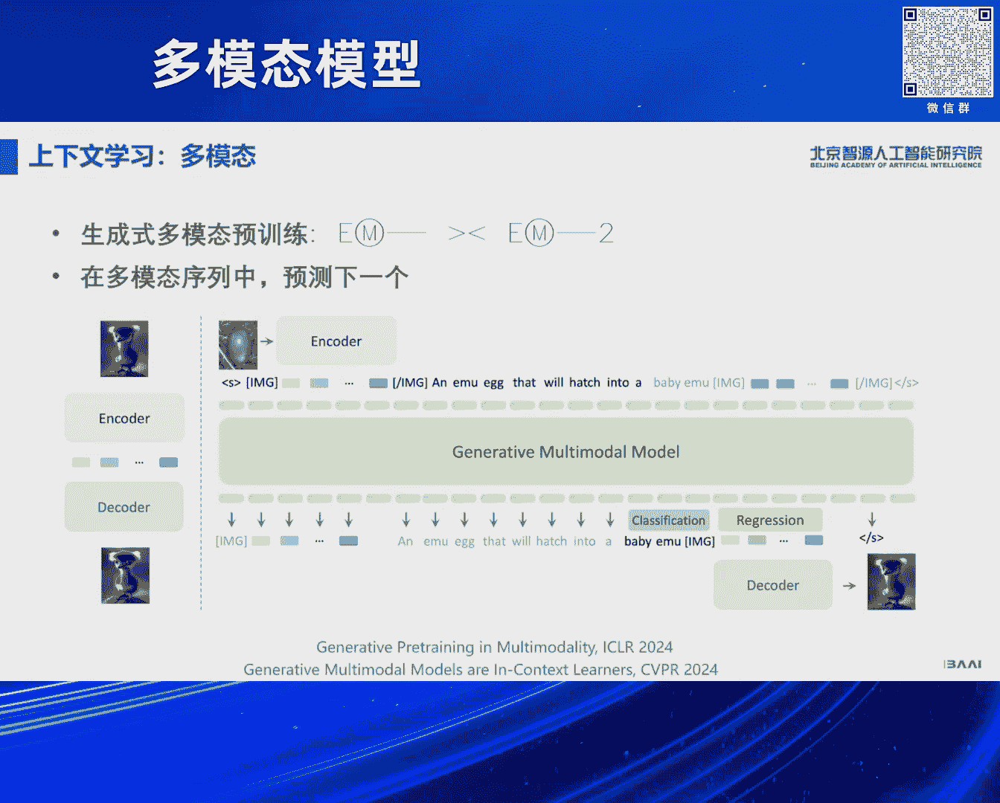

这里主要想分享的，就是它的一些代表性的能力，比如说我们刚刚介绍的flamingo的，这种in-context learning的能力，那它这个能力能不能被进一步地，就是通用或者泛化。

是我们很关心的一个问题，我们首先去测了它在captioning，就是图像描述上面的一些上下文学系的能力。

比如说，我们可以用比较复杂的captioning，就是给它一个括号，类别冒号数量，这样的一个固定的格式，相当于让模型同时做分类跟数数的这么一个任务，这个任务训练员没见过，但是我们给它三个example。

你再给它一张图片，它自动完成一个组合式的，包含分类跟数数的这么一个新的任务，比如说它就知道这里有三个啤酒。

两个香蕉，另外更进一步就是我们同时，我们有一些数据是在我们训练图片里面没有的，比如说我们图片上可能想画一些prompt，或者画一些这样的标记，对于我们project里面它可能很少有这种数据。

我们能不能在有一个这样的模型之后，能不能直接在测试的时候，给它例子它就能学到新的这种，视觉提示的识别能力，所以比如说这个例子就是，我们画一个圈，对应的文字是这个圈里描述的内容，给它三个例子。

就是我画摩托车的轮子，它就知道要完成这个任务，然后你再给它一张图片，画一个圈，你可能画其他的物体，它知道我现在要描述这个红圈里面的物体，相当于是在上下文里面，去理解我们给的视觉提示，除了理解。

因为刚刚提到，我们上座的是一个统一的，就包括生成和理解在内的，一个上下文学习的能力跟模型，除了理解还有就是，我们的生成，我们知道一般我们会给一句话生成一张图片，在一个上下文学习的框架里面。

也是类似的道理。

我们可以给文图作为例子，相当于给它比如说几个例子之后，再给一句话，它在上下文里面参照你的文图，去生成一个对应的风格，类别的物体的图片，或者是我们说可以做主体。

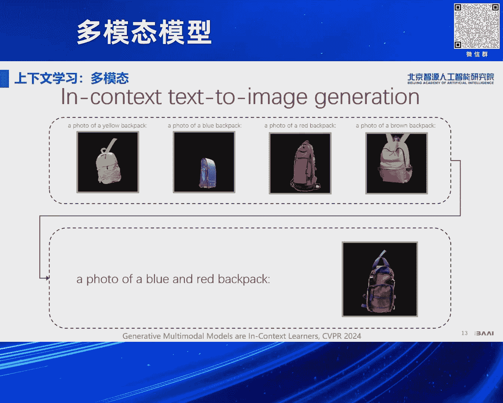

因为我们现在一般来说。

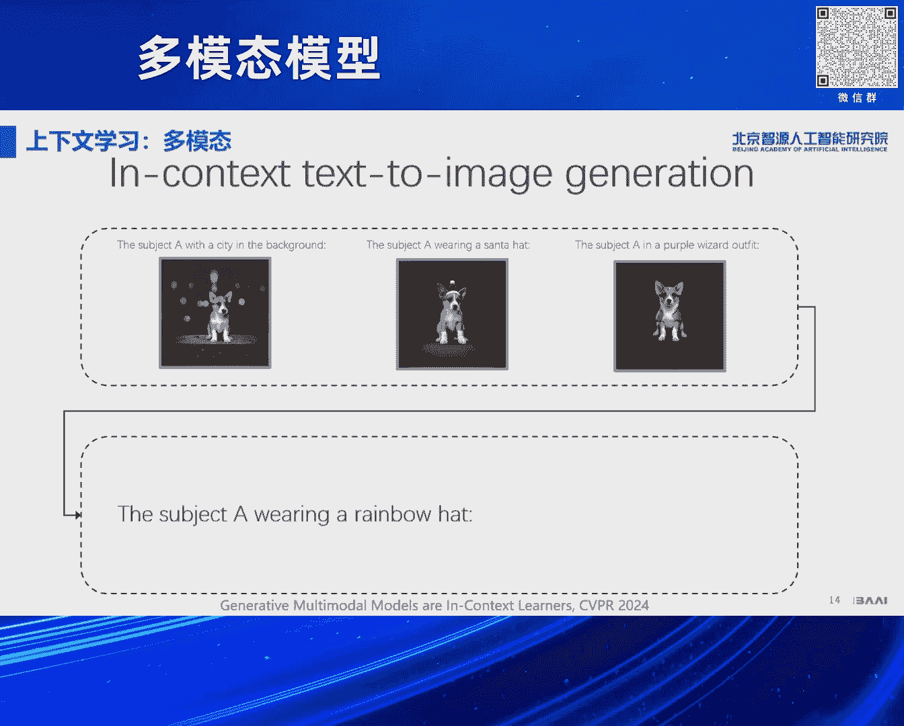

想要做一个主体的图像生成，我们会专门选一个模型，我们希望去尝试的是说，在一个生成式多姆态的预训模型里面，它pre-train完，是不是就有一点这样的能力，虽然说这个图像质量本身不会特别好。

因为它是一个预训链的模型，不是专门针对图像生成优化的，但这个能力是可以看到的，就是我们给它subject的，不同的文字跟图片，然后在测试的时候，另外给一句，比如说subject A。

戴着一个什么样的帽子，它给参考前面的上下文，就参考前面多姆态的上下文，去完成一个领养本的视觉生成的任务，除了钉性的一些case。

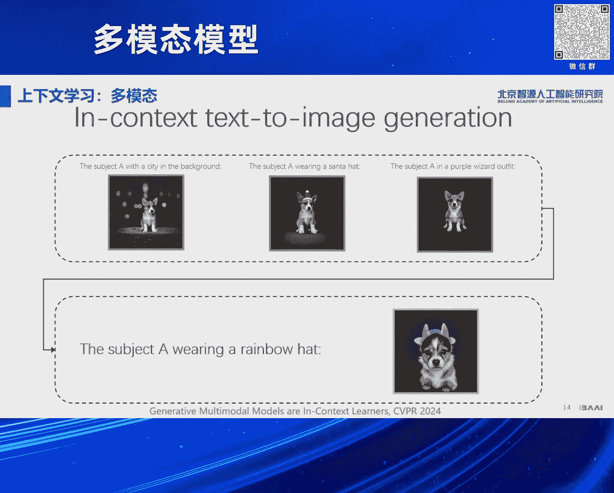

我们主要，钉量的比较呢，主要是在跟刚刚提到的Flamingo，然后它的80B模型这个比较，Flamingo2已经出来之后，大家社区包括一直在尝试复现，但是都没有取得比较好的一个效果。

包括Hugging Face的IDFace，然后我们发现这个E-Me2这个模型，在很多的future-world任务上，已经能取得更好的一个效果，就是它的上下文学系能力，不仅是在生成上有新的能力。

同时在理解上也是取得更好的一个效果。

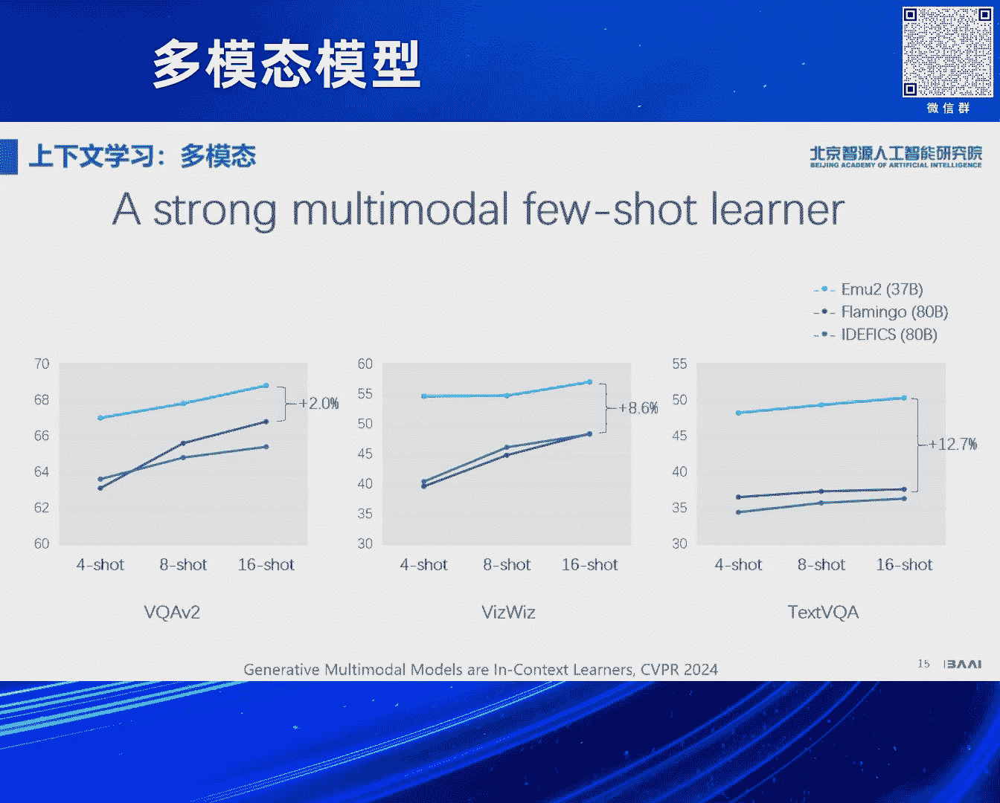

然后另外的除了上下文学系能力本身，它的应用的场景，就是当然理解大家都可能比较熟悉了，在生成里面我觉得一个比较意思的点是，现在的生成大多是基于一句话，去生成一张图或者一段视频。

比如大家知道的这个Cyber Diffusion Dali，或者这个SORA，但我们想要实现一个更通用的接口的时候，有一个多派的上下文是会很有帮助的。

比如说我们如果只给一句话，它可能生成的图片不是我们很满意的。

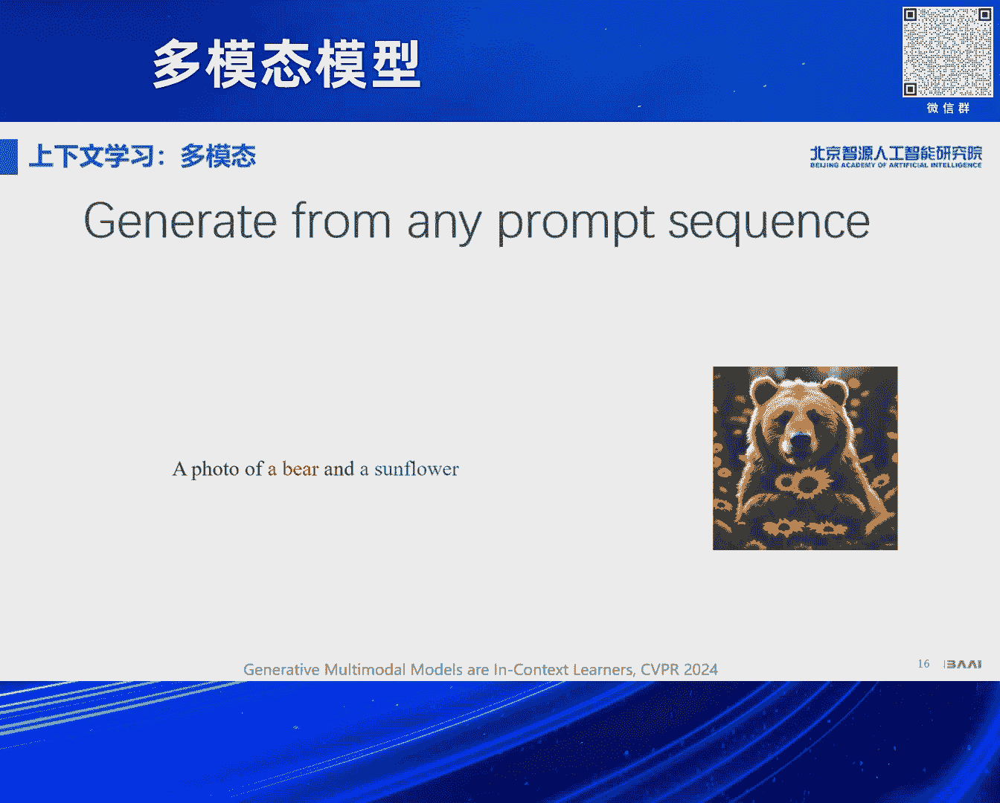

那我们可以给更具体的位置，可以给位置跟图片的组合。

就相当于我们可以把多张图片跟文字串起来，交错起来，然后作为一个Prompt，然后去实现一个，更满足我们的目的的，一个图像或者视频的生成。

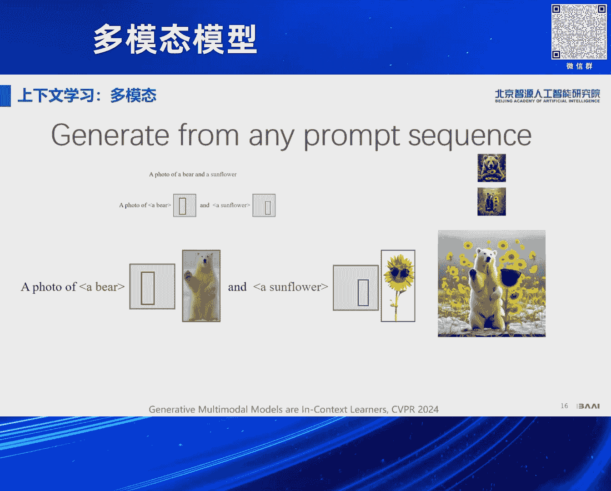

但对于视频也是一样的，就是你可以把你家的宠物狗拍个照片，或者跟你的角色拍个照片，扔进去让它生成一段视频，这个是去年的一个结果，跟现在Zsota的，比如SORA，这视频生成效果当然是有很大的Diff。

但我们主要是想看在能力上，就是这种新的生成式的动态模型，能不能带来新的包括生成，当然也包括理解的能力，然后另外想分享的，就是我们谈到这种生成式动态模型，包括现在大家越来越关注的，生成跟理解的统一。

包括动态统一，里面最关键的，我觉得现在有三个问题，除了刚刚提到的可能Protraining这里很多的问题，其他两个更多的是，一个是Data，就是到底什么样的数据是满足，我们接下来的动态任务的需求的。

第二个是Encoder，也包括我们说Tokenizer，或者包括CLIP在内的这种，语义的Encoder，就是到底什么样的Encoder，是可以满足后面的，不管是生成理解，或者是统一的动态任务的需求的。

对 然后先说一下Data。

Data我们从两个方面，做了一个探索，一个是，就是数据它能不能满足下一代需求，主要是体现在它的形式跟内容上，然后从形式上，我们之前大多是图文队，在Emu这个工作里面，我们探索了一种。

就是把Video当作一个Interleaved，就是交错的视频文本的数据，因为我们在看YouTube视频，或者看其他视频的时候，也在接受的是这种Interleaved，这种VisionText的数据。

它提供了很好的一个上下文的相关性，然后我们发现，对它上下文学习的能力，有一个很大的提升，比如说这个例子，就是你有一段视频，比如说纪录片，它描述了一个故事，我们可以把它的文字跟视觉图片，给对应起来。

在时间戳上对齐，这就是一种，我觉得是一种新的形式，那后面相信大家会，可能会挖掘更多的形式，因为图文队本身可能不足以，满足我们后面的需求。

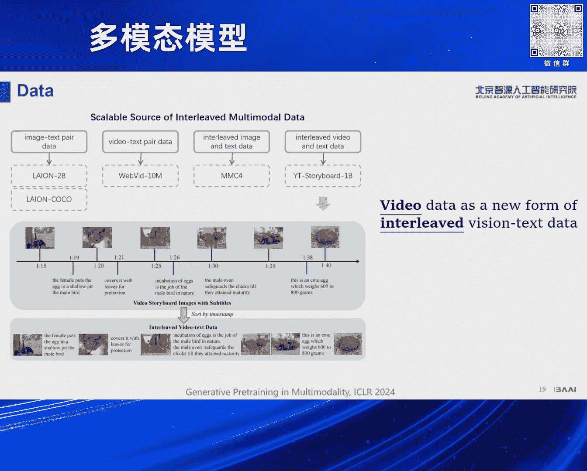

另一个就是除了数据形式，就是数据的质量，然后我们发现，之前大家用的很多Lion2B，或者Lion2Coco这些数据，它都有很多的问题，特别是在我们想要规模化的，虚拟动态模型的时候。

Lion2B的这个数据，这个原始的数据，它很难有比较好的性能，因为它一般是比较Noisy的，一些这种AutoText，Lion2Coco，它是一个Synthetic的数据，就是我们去人去标。

它这个东西它是不Scalable的，它没有很强的这种Word Knowledge，就是右边这个曲线，可以很明显地看到，就是如果我们用，这个黄色的这种RAW Data，它很难有比较好的性能。

用这个绿色Synthetic Data，它其实你很难逊的，你越逊可能是越差的，所以一个比较简单的解法，我觉得也是现在。

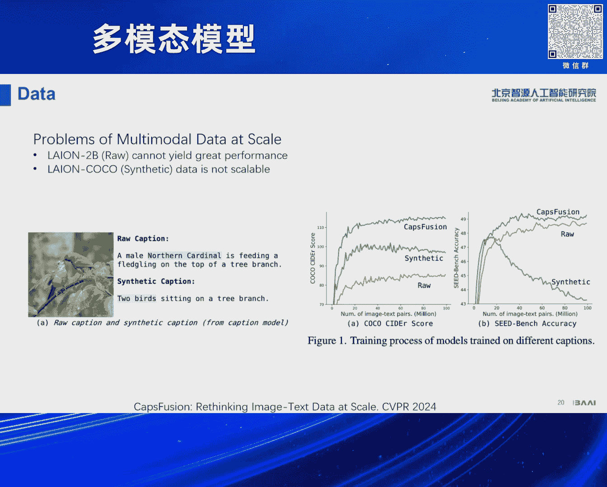

看起来比较Work的一个解法，是，对 先说一下原因吧，就是最后的原因主要是在于，我们在构造这些数据的时候，我们扔掉了很多的Word Knowledge，就是我们叫这些，应该中文叫世界知识。

然后所以构造了比如说，Coco或者CC3Million，它数据里面本身就。

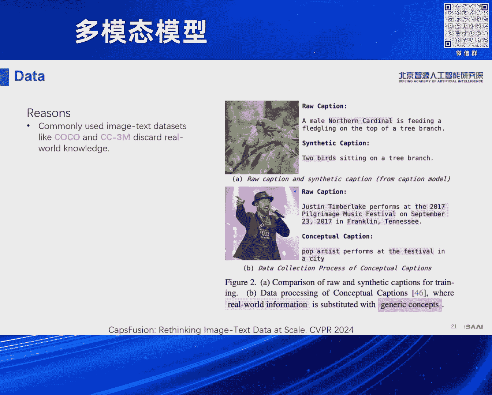

没有这种信息了，那一个比较简单的解法，我们叫Peps Fusion，这个最近也用到不同的方法里面，就是我们可以把它，做一个简单的融合，然后去融合。

并且Refine原始跟Synthetic的Caption，然后把它变到一个规模化的量级，也就是说我们把原始的，比如AutoText跟我们Synthetic的标注，可以简单地融合起来之后。

它这个事情就很Scalable，就是我们就可以打造，比较大规模的，我们当时先做120Million的一个数据，发现这个效果就已经非常好了。

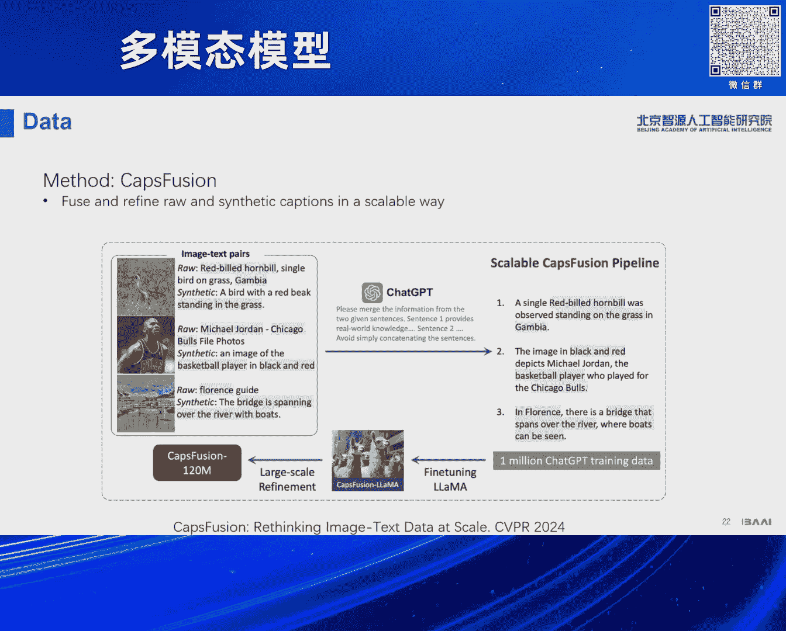

除了Data，另一个比较关键的就是Encoder，也可以叫Tokenizer，就是我们这几年大家都看到很多的，不管是这种连续空间的，离散空间的视觉的Encoder，当然大家解决的问题可能不太一样。

我们可能有的想注入语义，比如说Clip，有的想把它Tokenize到，一个离散的Token，那这里我们，我觉得这里可能是现在最，一个比较大的Blownack，就是往后面想做统一的，深声诗多么泰模型。

我们自己比较喜欢叫，这里有一个不可能三角，就是比如说我们想要把图像，跟语言一样Tokenize成一样Token的时候，这个不可能三角是Compact，就是紧凑的，我们想要用很少的Token去表达。

这个图片或者视频，第二个是Lossless，就是无损的，我们希望它可以完美地重建，你这个图像或者视频，第三个是Context，就是离散的，然后这三个现在只能满足两个，所以我们叫它不可能三角。

但是理想情况下就真的想实现，我觉得理想情况下，希望是都能实现，但是目前还是有一个Blownack，我们过去主要是从不同方面，在Encoder这里做一些探索，包括Encoder最大能到什么程度。

Encoder是不是可以没有Encoder，然后Encoder能不能是Sparse的，然后下面简单介绍一下，首先一个是，之前我们思考的比较多的一个问题，是视觉的比如说Clip，最大能大到多大。

然后它能产生什么样新的效果，我们最早是在2022年底的时候，当时训了一个实验参数的Eva Clip，然后当然也被用到了各种的任务里面，所以我们后面一直在思考的是，这个规模化，比如说在Clip里面。

它能产生什么样新的性质，然后这个是去年底今年初的时候，我们开源了一个180亿的Eva Clip模型，这个应该是目前开源能获取到最大的，视觉Encoder或者叫Clip模型，我们比较有意思的是说。

首先在GeoSource各种任务上是有提升的，然后在图样上是有全面的提升的，但最有意思的是在Video上，就是在视频的领样本分类上，它有一个质的提升，当我们其实没有专门的去优化，数据是一样的。

然后我发现这个参数量级，规模号到180亿参数的时候，它在Video领样本分类的提升是更明显的，然后我觉得这个也是里面比较大的一个价值，也是值得更多的关注的一个点，就是当我们在讨论视觉的规模化的时候。

除了更大的Clip，当时在Tether他们做的Segment Ending之后，我们当时思考的一个问题是，这个东西能不能对我们的Encoder，或者Tokenizer有一个借鉴。

就是我们能不能做一个Sparse的，同时是Prompting的Tokenizer，我们可以按需求去Tokenize这个图片，然后相当于说我们希望Tokenize，包括它的像素的分割，包括它的类别。

包括它的Caption，然后同时它又能够重建出来，它对应的我们想要输出的信号，实现这样的一个按需的Tokenize，那最后能实现一个还可以的效果，比如说我们可以把这张图片的所有的物体。

同时的分割分类Caption出来，我们还讨论到Encoder的时候，另外一个不得不思考的问题就是，那能不能扔掉Encoder，就是我们看到去年付予，最早是付予Barbi，她把Encoder扔掉。

我们送Patch进去，然后做Vision Language Model，做视觉理解的任务，但是当然它现在看，当时效果是非常差的，然后我们当时思考的一个问题是，当我们在面向，包括深圳式多模特模型。

包括视觉这个Vision Language Model的时候，能不能扔掉Encoder，也就是能不能用Patch作为视觉单元，当时做的时候，SORA其实还没有放出来，然后我们就是希望去探索一下。

把Patch作为视觉单元，它是不是可行的，至少在一个具体的任务上面，它的性能是怎么样的，但我们发现当，比如说我们希望去付现付予的时候，因为付予没有看远，我们希望看看付予，它到底训练的性质是怎么样的。

我们发现碰到两个问题，一个是它性能很差，就是比如说我们Virus，现在最好的Lava的模型，它性能是有很大的gap的，在很多的视觉理解任务上面，第二个是它训练很不稳定，这也是为什么。

大家一直没有很好的付现的，我相信一个原因，我们的实验里面，它是很容易崩的，就是我们如果直接用Patch，这个送进去的时候，每个阶段都很容易崩，所以为了解决这个问题。

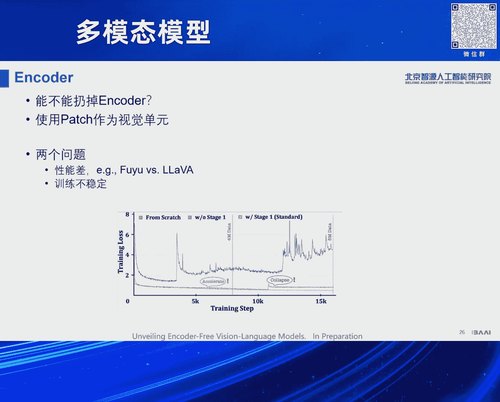

我们应该下周会放出来，也是今年上半年的一个探索的工作，就是能不能把Encoder全部扔掉，同时我们希望填补中间性能的差距，然后解决训练不稳定的问题，这里有两个关键我们发现，一个是说想要填补性能差距。

我们想要达到甚至超过Lava的性能，里面一个很关键的点，是我们需要视觉识别的监督，为什么呢，因为Lava或者更多的模型，它是用CLEAP，包括刚刚介绍的CLEAP，这样的在上Billion级别的图片上。

去训练过的，如果我们直接送Patch，它是没有这个显眼的，所以有一个辅助的监督，对这里是很有帮助的，第二点是解决训练不稳定的问题，这个Patch Embedding，说实话是很关键，这个也对应到之前。

很多做自监督的一些工作，我们发现在这里同样是一个，导致他训练不稳定的一个关键，所以右边就是可以看到，解决了这些问题之后，他训练下面的曲线可以是很丝滑，同时可以达到比较好的一个效果，总结一下。

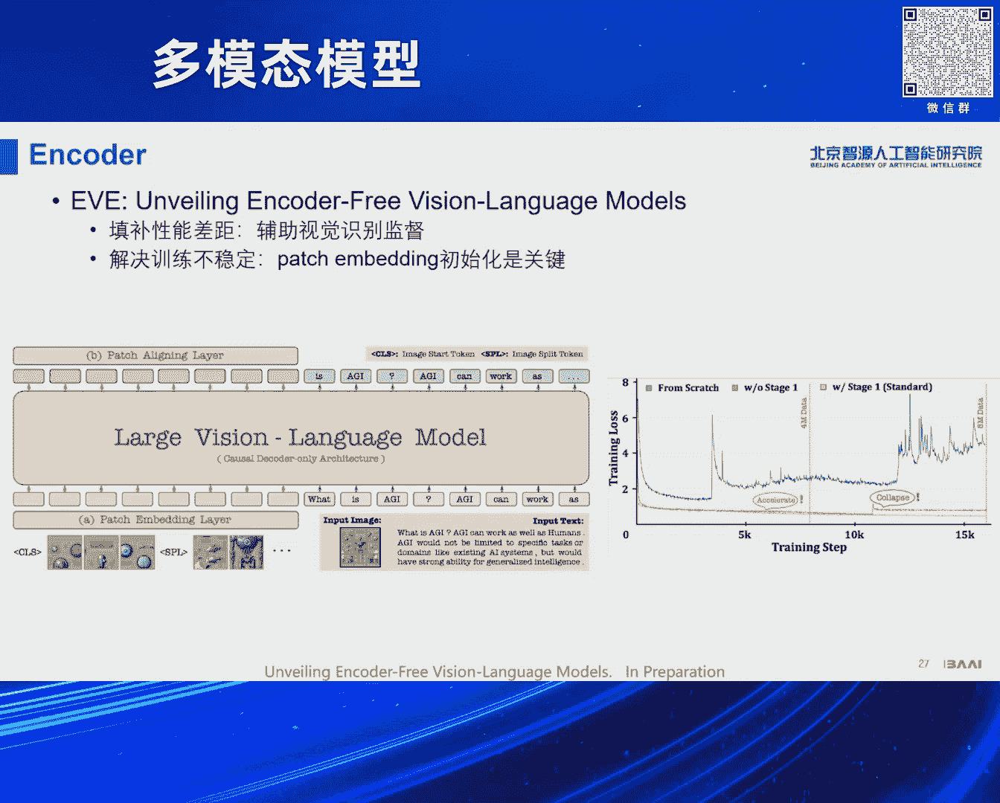

刚主要跟大家分享了，简单分享一下两个点，一个是我们从视觉上效能学习，到动态上效能学习的一个探索，然后包括我们想做，下一代深圳式动态模型，它能产生什么新的能力，以及中间的关键的技术问题。

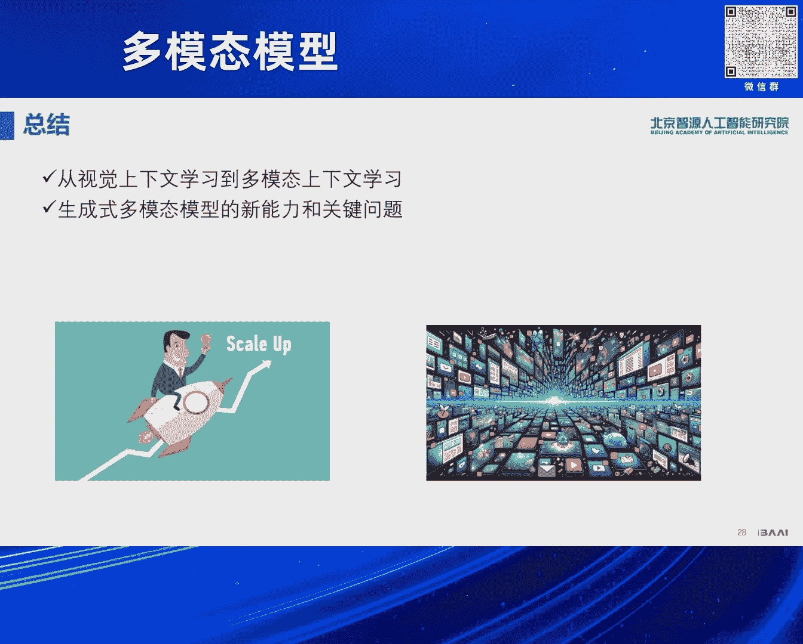

对然后，我们刚提到的这些都已经，或者即将开源在GitHub上面，也欢迎大家更多的同学，想要我们一起做视觉跟动态技术模型的，可以加入我们，谢谢大家。

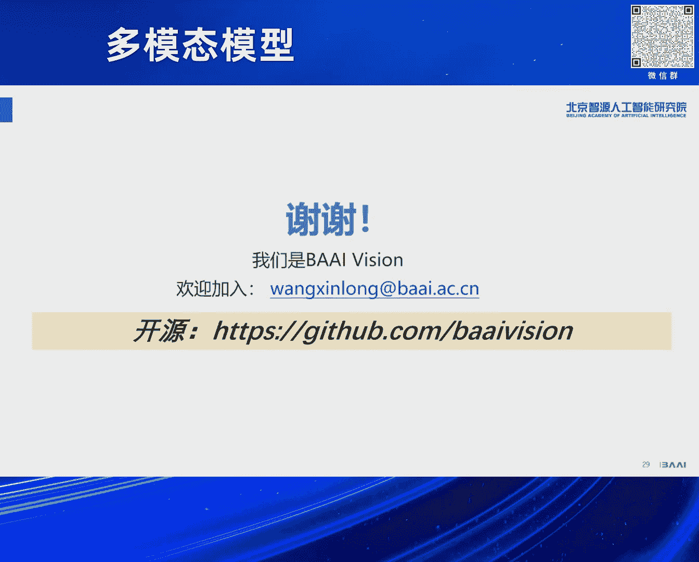

謝謝。