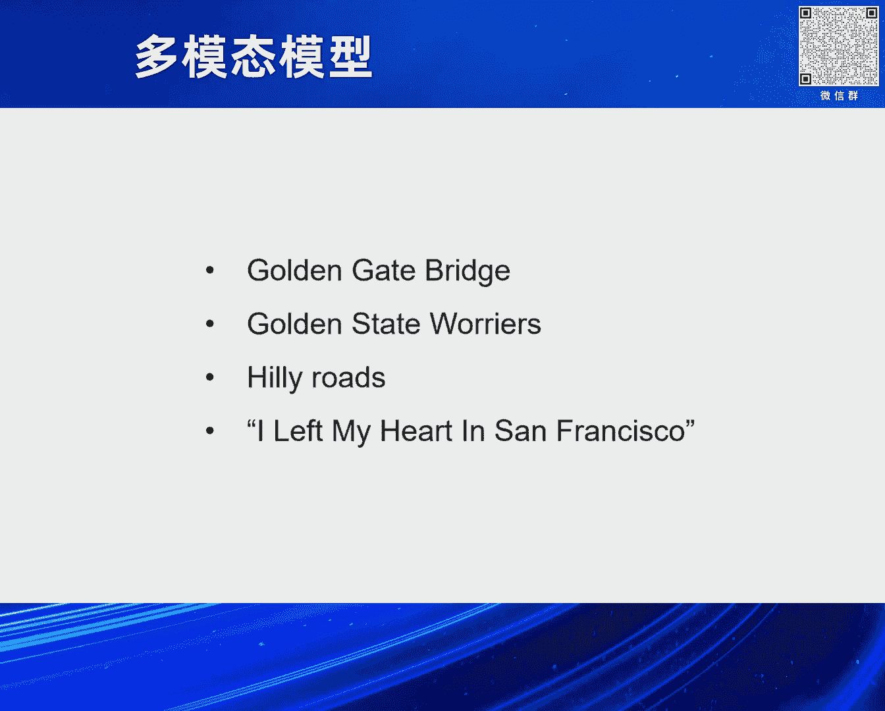
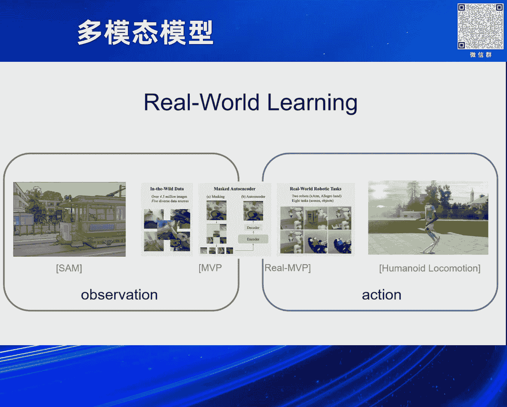
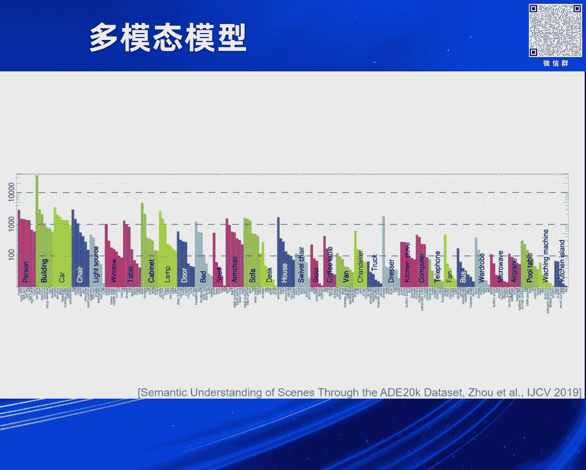
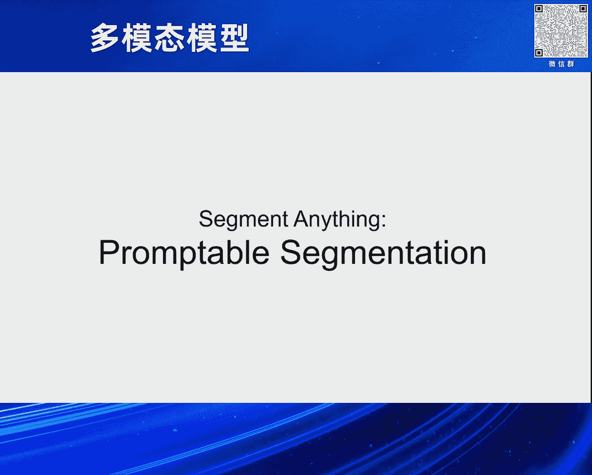
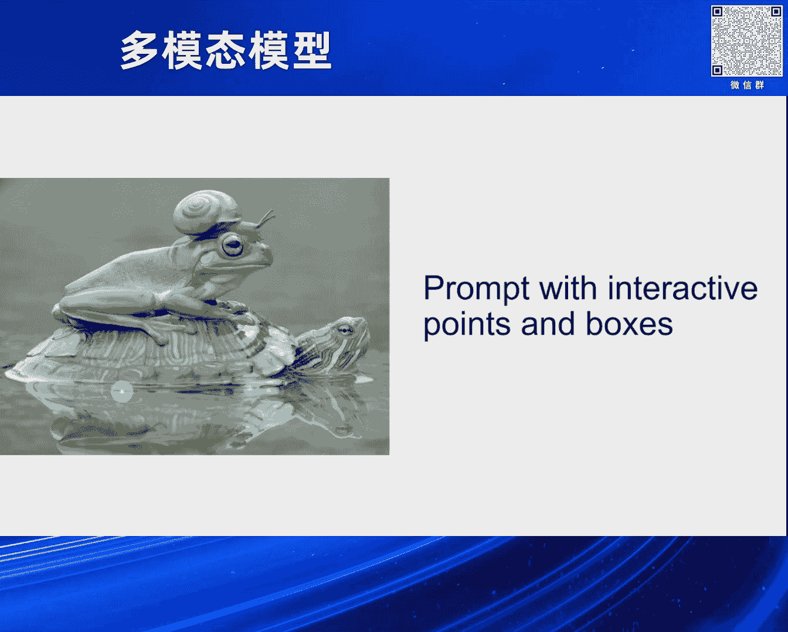
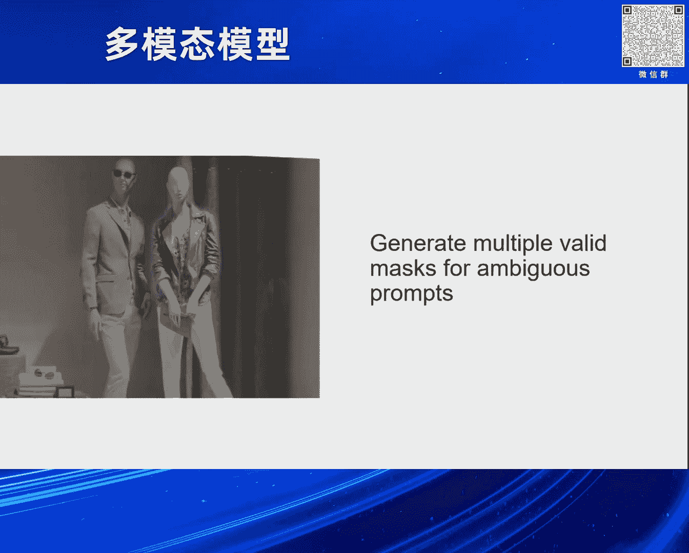
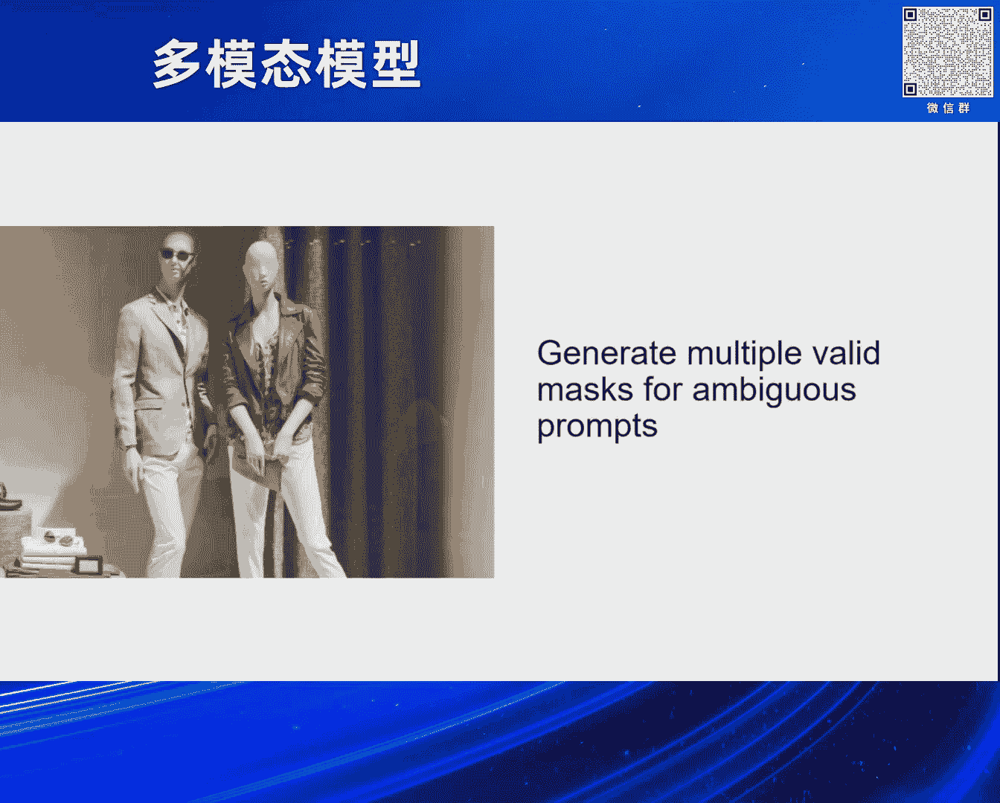
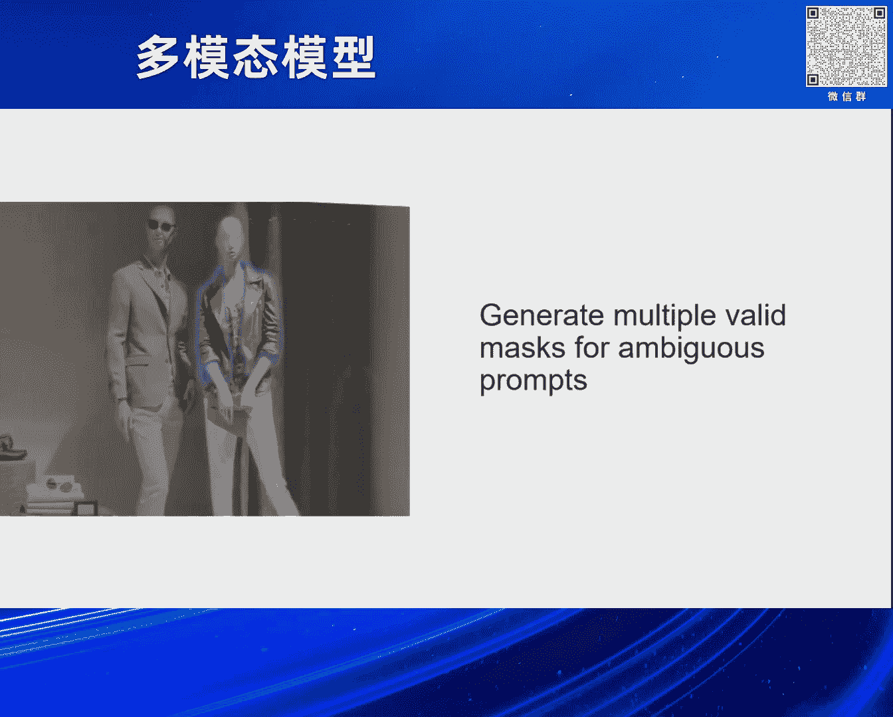
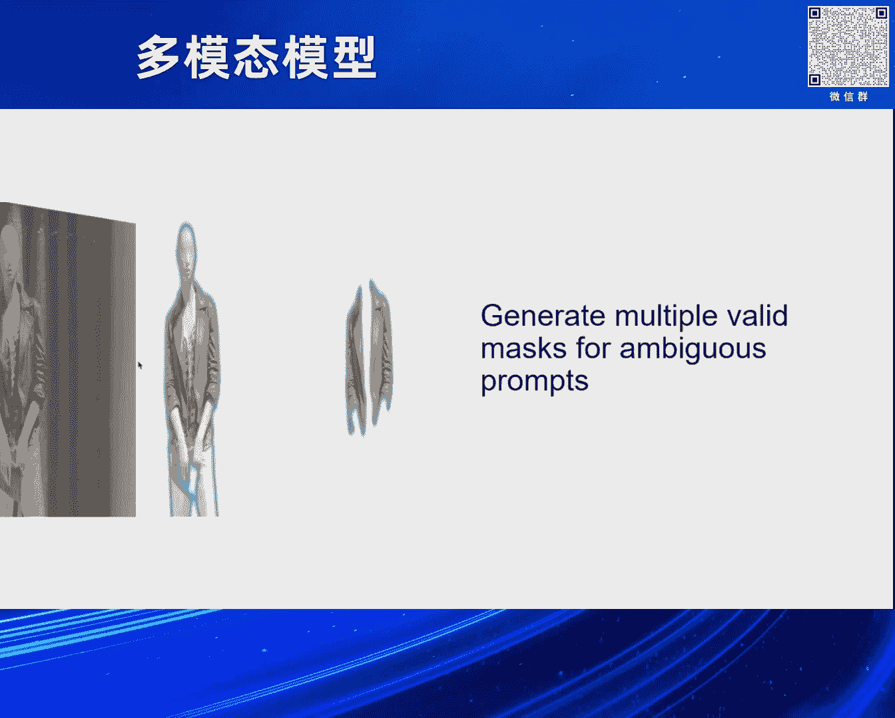

# 2024北京智源大会-多模态模型 - P5：A Real-World Approach to Intelligence-肖特特 - 智源社区 - BV1sT421a7FU

郭文贵 演讲师，好 谢谢亚洲的介绍，也感谢大会今天的邀请，各位早上好，首先我想分享一下，自己的一个很有意思的故事，前面几位的演讲嘉宾，让我非常inspiring，是这样的。

我的同事在加州的Tahoe Lake，Tahoe湖是个滑雪胜地，有一个林间木屋，那么他的这个林间木屋的装修风格呢，是一个比较跟自然相结合的风格，那么他的这个bathroom里面，有一个小熊的玩偶。

这个小熊的玩偶呢，他是拿着一个他们的这个toilet paper，就放在他的bathroom里面，那么我就把这个图片截图下来，然后发给各个大语言模型。

或者现在叫做visual language models，问他说，你看这个图片里面，你能不能看到一只熊，那么所有的模型都说可以，那我说这是一只真熊还是假熊，所有的模型，包括现在公认最好的模型。

说这是一只真熊，那我问他说这个真熊可以站得非常直，那么可以能一直拿着一卷厕纸，在人的这个屋子里吗，那这个时候这些大语言模型就开始自由发挥了，说这个熊是可以进到屋子里的，熊也是可以拿厕纸的。

那么你要小心这些熊，要小心野生动物，这就是典型的一本正经的胡说八道，那么实际上我想分享这个故事呢，也是跟我的今天的presentation有关，是因为我想要去讨论，我们有没有一个新的模式。

来去寻找真正的intelligence，那么我想要探讨的是一种alternative approach，所以是a real world approach。

So toward the end of my PhD doctoral study，I moved from Berkeley。

to the other side of the San Francisco Bay，to the city of San Francisco。

So many of you might have been to the city，So when you see the word San Francisco。

what pops up in your mind first，Well， a couple of things， right，Maybe the Golden Gate Bridges。

Everybody has seen the bridge before，Maybe it's the Warriors，Some of you may be basketball fans。

 right，Or maybe the Hailey Roads of San Francisco，You know， it's quite a Hailey city。

It's not that easy to walk around，Or if you are a big jazz fan or traditional pop。

You might have heard the music before，I left my heart in San Francisco。

And every resident in San Francisco，is legally required to be able to sing that song，Well。

 I'm just joking， of course，So how is it possible，that this concept comes to your mind first，Well。

 maybe you have driven，on the Golden Gate Bridge before，It is a magnificent bridge。

It has a couple of narrow lanes，Or you might have walked on the bridge before，It's quite windy。

 but it's a gorgeous view，Or maybe you are yourself a basketball player。

And you watch basketball games all the time，In the 2022 NBA Finals，You know， the Warriors。

It was competing with the Celtics，And the Warriors won the final，Unfortunately， I'm a Celtics fan。

And we're coming back this year，And or maybe you are like me，I lived on Naupeel before。

It's quite a Hailey part of the city，I used to walk a lot on this kind of road，A lot of exercise。

To my favorite coffee shop，Around the neighborhood，And it's really just beautiful out there。

Or as I mentioned before，Maybe you have， you know， sung the song before。

By the legendary Tony Bennett，You know， I left my heart in San Francisco。

But the current paradigm of how AI learns，Is by reading Wikipedia，Now， you know， they crawl the data。

From all over the Internet，And train a large language model，To pretty much memorize these facts。

 right？Of San Francisco，Well， officially，The city and the county of San Francisco，That's amazing。

Well， it has a population of 808，437 residents，As of 2022，That's amazing。

What the city's history was before，Prior to the European settlement，That's also amazing。

That I call it a language-first approach，And as has been alluded by Signing，And of course， Yan Lecun。

When you memorize all of these facts，And it sounds amazing， right？You are able to actually repeat。

The entire history of San Francisco，And almost every single book，Or an article， a news article。

That has been written about the city，When you keep repeating that，You're like， okay， no human beings。

Can memorize all the information，By him or herself，And that must have been intelligence，Well。

 I would argue that，We learn from the real-world-first approach。

You've been to the Golden Gate Bridge，You've lived in the city before。

You've watched the basketball game，And you've learned how to sing some music，From the city。

So this is what I call it，The real-world-first approach，And this is how we， as humans。

Learn about the concept，About a place， about new knowledge。

So if we're able to kind of entertain this idea，For maybe just through my talk today。

I would like to kind of offer an alternative，To the current paradigm。

And introduce and discuss some of these works，That I did during my doctorate studies。

At the University of California， Berkeley，I believe the real-world learning has two parts。

And they are， of course， intertwined，The first part is observation，Observation or perception。

Is naturally model-to-model， of course，It involves vision， it involves sound。

It involves a lot of other things，And the second part is really action，Now， to be able to gain。

To learn in the real world，You need to have an embodiment， right？The physical embodiment。

That may be a robot， for example，That can be a bunch of cameras，That you deploy in the real world。

And you have to be able to kind of，Interact with the world，And observe what changes after that。

And learn from these sort of interactions，So I'd like to start from the first of these works。

It's the "Segment Anything" paper，That I did during my PhD at the Meta-AI Research。

And the project was led by Alex Karloff，Pure Dollar and Ross Gershick。

So before the "Segment Anything"，The status quo was，We predefined a list of a lexicon，For example。

 that's alphabet，For example， when I was involved，In the 820k dataset led by Bolei Zhou。

We defined a list of categories，For example， you can see that there's car，There's chair。

 there's window， there's table，And underneath it， there's a bunch of parts，Of these objects。

And we trained the model in the days，For example， OpenNet，And to， on these datasets。

To predict the pixel-wise classification，Or image segmentation。

And you can see that this result is pretty good，But then you are like， okay，So the couch is a couch。

But what if I actually want to see the pillow on the couch，I want to learn more about the couch。

 right？And then different people care about different things，And as human beings。

You are able to recognize a lot of things about a couch，And even your cat。

 if you ever have a cat before，They recognize a bunch of things as well，They have。

 usually have their favorite spot on the couch， right？It's usually one cushion。

And they also like to scratch，Sometimes their favorite couch and ruin everything，So， well， anyhow。

So we came up with this new task，Called Promptable Segmentation，The motivation was really like。

Let's get rid of this idea of，Predefined vocabularies。

From the very beginning，So what it led to is，It's a system where you can。

That you can prompt with a lot of things，First of all， it's interactive points and boxes，For example。

 you can put a dot on the frog，With a snail on top of it，And the system is like，Okay。

 do you want to segment the joint of the two？And you're like， no， actually。

I only want the frog instead of the snail，Then you put a negative point on top of it。

Which is a red dot here，And the system is able to react，Based on your input。

And the second really like application，Which at the time was very kind of interesting。

Was when you put on the dot，There's naturally ambiguity，From the information theory perspective。

That's impossible to solve。

Without further input，For example， if I put a dot on a person，In this case，You really don't know。

Whether I mean the jacket or the person，Or just the upper body。

There's a lot of potential combinations of that dot，So the system is actually able to。

Produce a couple masks，That may be associated with this particular input，Well。

 the third interesting application is like，Now you actually have the system。

That can automatically segment，Really everything in an image。

Because there's no really like the priors of classes，So if you just kind of randomly put。

Or uniformly place these dots on the image，And now you're able to actually。

Get a lot of different segmentation masks，From the single image，And that's really interesting。

And the fourth aspect of the model，Is it naturally accepts multi-model input。

Other than besides points and boxes，We can also handle visible masks and texts。

And the model itself is a universal segmentation model，It's really simple actually。

So you have an image as its input，You pass it through a pretty heavy image encoder。

And now it's being accelerated，And now you have a feature map or image embeddings。

Now then you have the prompts coming in，After you've extracted the embeddings of the image input。

Well， the benefits of such a design is，For different prompt inputs。

You only have a very lightweight mask decoder，That you need to recompute，So for a given image。

You can pre-extract all the features，And depending on how you like to prompt it。

The compute is really fast，So that has practical benefits。

And of course we really don't have the data，To train the model，So unlike large language models。

Where you can just crawl the entire internet，And train the model to predict the next token。

There's no large scale image segmentation data sets，That you can train a general segmentation model。

So we had to build this data engine，The model in the loop paradigm，It's also fairly simple。

So you first pre-train the model，Using whatever you can get。

And then you collect data and collect more masks，And then you train the model，And then you go again。

And as a result，This is the largest segmentation data sets，We built through this paradigm。

And compared to the previously largest data set，Which was Open Images V5。

We had a billion masks in the data set，Which is about 400 times as large，As the Open Images data set。

So that was about observation and perception，And now it comes to OK，Now how can we develop。

A visual representation of the vision system，So that we can support agents。

Or embody AI or robots in the real world，To perform some of these tasks in the real world。

So this was the paper we did in 2022，Robot learning with mask training at UC Berkeley。

And the status quo at the time，For the real time robot application，It's a vision robot application。

Was that for every single task，You have to have one vision encoder，So what does that mean。

So that means like think about it as a human being，Now your task is to reach that red block。

That's on the table，You have to have a vision encoder，That's specifically trained。

Just to do that task，And now the second task，The second task is to pick up the yellow block on the table。

And now you have to train another vision encoder for that，And then I want to open the fridge door。

And then you have to have that，So that's quite different from how we work。

That sounds like wherever we go，We have to have a different part of our brain。

That's just specialized for that particular thing，And that can be quite unpleasant。

I would say as an intelligent being，So we changed that paradigm。

By having the one single pre-trained vision encoder。

For all of these tasks，And how we did that was，We collected in the wild data。

We had five diverse data sources，That span across for example image classification。

Or human object interaction，And internet video data，YouTube videos for example like cooking data。

And on top of it we pre-trained a mask auto encoder，For the as the visual embedding on this data。

And the motivation is that if we are able to reconstruct，Well that's a great leap of faith of course。

If we can reconstruct the data，In which people are cooking and painting，And doing random things。

We are able to acquire a visual representation，That's good for the downstream tasks。

That involve for example real world interaction as well。

And then using this pre-trained visual representation。

We transfer we fine-tuned a couple of robotic tasks，Such as you know picking up blocks。

Pulling a toy fridge door，Picking up something from the cluster sink。

And what we saw was，These visual embedding outperformed，All the standard vision models at the time。

For example the clip models，Or the image net supervised models，Or training from scratch。

And at the time supervised image net models，And training from scratch，Were the kind of the paradigm。

Or the standard pipeline for robot learning，And what we also find was interesting at the time。

Was when we try to scale the model from，For example small model here is shown as VIT-S。

To a larger model VIT-Based model，On the small data set that only has about 750，000 frames。

The performance actually dropped，By quite significant margin。

And we are like okay scaling doesn't work，But that's of course not true in this case。

Because when we actually train the model，On the much larger data setting，In the paper it was about 4。

5 million frames，And we actually saw the performance boost，That we were looking for。

So it's really important to co-scale your model sizes，And training data of course。

And the paradigm also scales with larger vision models。

So at the time largest vision model we trained，Was a VIT-Large model。

And that was about 15 or 14 times as large as a ResNet-50，And at the time of the paper's publication。

The ResNet-50 model was really just the standard，For robot learning。

And I think this pre-training paradigm，Is quite promising actually。

For using more powerful models in robot learning，And so a natural question of course。

After we've done the paper is，Can we pre-train just more than，Visual representations。

Can we train more，Including for example the actions，The interaction part of the paradigm。

And so the team led by my long time friend，And collaborator Ilya Rodaslavovich。

At UC Berkeley without my involvement，Was this work on the robot learning。

With sensor motor pre-training，So instead of only the visual pre-training。

Of course we pre-trained the vision model，And also the entire trajectory。

Different cameras and pre-perception everything，Into a trajectory and mask it。

And send it through the transformer，So now you may have recalled that。

Okay it looks pretty similar to，In the language paradigm for the BERT model。

Which is exactly as intended by the authors，And so that sounds like a really simple paradigm。

But there are two findings from that work，That I'd like to highlight。

The first one is it's able to transfer across labs，That's quite interesting。

So the old myth of robotic learning was，Your algorithm that's developing in this lab。

Doesn't really work in the lab that's next door，So why is that，Well the lighting changes。

People come up with all the excuses right，Lighting is different，This is different。

My camera placement is different，The table's color is different etc。

But if you are only able to close your own fridge door，And nothing else。

No other fridges in the world，That sounds depressing，And not really intelligent。

So this is one of the really interesting findings，The most interesting findings in the paper。

By pre-training these representations，You can see good generalizability。

Or the transferability really from the system，The second one is that。

Not only it transfers across labs，It also transfers from robots。

So we had the data that were collected on the X arm，And then we used the data to pre-train the model。

And deploy it on the Francom robot arm，And it works pretty well。

Much better than just training from scratch，From the Francom model，So that's really interesting。

Well the third part of my talk is，What kind of new embodiment that we like to develop。

Well now you might have watched the GDCs，You might have been following the news，Well really humanoid。

I think what's really promising about humanoid，Is that our world is kind of constructed。

Specifically for us，We have all these stairs，We have these interesting handles。

That we can manipulate，For example using our hands，And we kind of like。

We don't want to redesign and redevelop our world，Just so that we can deploy robots。

That would be unfair I would say to me as a human being。

So we want robots to kind of be able to live in。

In this kind of world and that's humanoid，So the first thing of course once you have a robot。

Is well you need to make it walk really，If it doesn't walk there's no difference。

Than a robotic arm that you mount on the table，And just on the you know。

Then you don't learn much right，The best you can learn is everything that happens on a table。

Well although that's already you know difficult enough，That's a really tabletop manipulation。

Is really challenging task in robot learning，But still you know walking， locomotion。

So we started from there，And the paper was published，Actually recently in science robotics。

From the team at UC Berkeley，So our robot was a digital robot，Manufactured by an American robot。

The robotic company Agility Robotics，And you can see it's a full size humanoid robot。

I think it weighs about 40 maybe 50 kilograms，And it has this interesting kind of a backward。

Bended legs that looks like an ostrich，The company designed the robot such that。

You know when it kind of，You know that the knee won't obstruct it，To when it bends down。

That's really the motivation，And it's full size robot，It has a lidar we didn't really use。

In the paper and it's two arms，But unfortunately without hands，In the specific version of the robot。

And we use a causal transformer for that，And the trajectory is just the central motor input。

For the robot that's mostly per perception，For example your joint position， joint velocity。

And a couple of other things as well，For the gyro input from the robot，And what the transformer does。

Is just to predict the next action，In the joint space。

And then we map it back to the robot control system，And so how do we train this robot。

Well we can't really deploy，You know 10，000 robots in the real world，And let it learn from there。

That would be very chaotic，You'd see an entire robot fleet，That just falls all the time kind of。

And so we resorted to simulators，So this was NVIDIA iSAC GEM simulator，And we span， spawn kind of。

You know many， many， many replicas of this robot，And let it learn from the simulation。

And so in the simulation，We randomly varied the physical property of that world。

So for example the friction of the ground，Was different for different robot。

And different robot was also，A little bit different in sizes，Just for the sake of augmentation。

And the payload was different，You can imagine that some of the robot，Was not carrying anything。

And some of the robot was really carrying，The kind of a camping gear almost。

And also like different kind of types of ground，For example there's this like rough terrain。

And also like really flat terrain，And also like different kind of slopes。

All right that's a lot of slope，Okay so how do we train that，Even in a simulation。

Well this is through reinforcement learning of course，The first step， well if you have。

Worked with reinforcement learning，You know that it's quite hard to train。

We call it simple complexity，It takes a while，So that's why we kind of used this two-step approach。

That was kind of really pioneered，By the lab at ETH in Zurich，So in the first step we use kind of。

We call it privileged information，For example the environment parameters。

Are for example exactly what the friction，Coefficient factor is。

And you know you can't really measure that，In the real world，But in simulation you can read it。

So you first train a model，Using this we call it the state policy，And then during the second step。

You do not only reinforcement learning，But also the imitation learning。

Meaning the model that learns from the teacher，That has access to privileged information。

And your student model，Does not have the privileged information。

But it can at least like mimic what the teacher does。

So it's almost like feel like you're mimicking a superman。

So that kind of shortens your training trajectory，Or training horizon by a lot。

And so after that we just deploy that，From the ASIC gym simulator。

Which is not that precise in terms of，The physical interaction。

To the agility simulator that's provided by the company，That has better physics but extremely slow。

Of course you can't do learning based，All of them in that simulator。

And then you know transfer it to onto a real robot，And so what it gets is。

What it leads to is the model，That you can directly deploy in the real world，Zero shot。

Meaning we do not do the real world fine tuning here，It can already do a pretty good job。

For example like you know，The top left corner is it's walking the Berkeley campus。

It's working it's walking out of the southern gate，And through the the the。

And through the this lovely creek on the campus，And other places as well。

So all of these are zero shot，And what you can also do is，We call it omni directional walking。

So not only forward also backward，Or backward so this is Berkeley's stadium。

You can see like I think the frame rate is a bit low，So it feels like it's quite deliberate。

In terms of walking，Backward，It can also turn of course，And what's also interesting is that。

We saw this emergent arm swinging，Which is quite similar to human beings。

And although it's kind of not perfectly symmetrical，But at least it's kind of getting there。

So this behavior we might，Not take it you know seriously。

Because when we walk we always kind of swing our arms，It's just natural。

But you know the past scientific studies，Have found that，This sort of walking behavior。

Leads to a kind of a more，You can call it a more energy efficient，Walking pattern or behavior。

That means like you know，You don't have to eat that much calorie to walk。

For example without you know one kilometer，And the normal is what we usually walk。

But you can you know we can also tie you up，So that you can't really swing your arms。

Or you know you just held your arm，Or you actually do it opposite way。

And you can see that the normal，The normal walking pattern，Is the most energy efficient one。

Of course the anti-normal pattern is the worst one，So that's why you don't see。

You know soccer players run that way right，And what's also interesting about the system。

Is it does this in context adaptation，So what you see is like the robot，Is walking down the slope。

You can see that it first，You know it's a normal walking pattern，And while it was let me see。

Whether I can play it again，Yes here yes，So while it's walking down the slope。

It's kind of doing this you know small steps，And now once it stabilizes itself。

It resumes its walking pattern again，So it feels like it's adapting in context。

Depending on you know for example the terrain，That the robot is on，So we did a little probing here。

To visualize for example the states，The couple of different Hayden states。

And also you know mapping the Hayden states，Or the different dimensions。

Using these dimensional reduction techniques，For example the t-sneak technique。

And the the flag regime is is colorized，On the x-axis in in blue，The slope is orange。

And you can see that as the time goes，When it enters the the slope terrain。

The two different Hayden states，The the their responses change drastically。

And once it comes back to onto the flat terrain，The Hayden states resume kind of the。

Flat terrain behavior，And in the feature space，These are are quite different as well。

In terms of you know walking on different terrains，And also of course like external disturbance。

There are we we apply different kinds of disturbance，But you know just for fun。

I'm showing the kind of a you know，That's getting struck by a by yoga ball。

There's no robot harm during the process，And you know and another natural question。

Of course you can you can ask about about this，Is that can we get closer to mask modeling。

For example now we're kind of using transformer，That's great it's called a transformer。

But can it learn more through mass modeling，For example not only through reinforcement learning。

The answer actually is you can，And of course the the team carried on that by。

Again Ilya with my without my my involvement，Is we can categorize for example the humanoid locomotion。

As sort of a next token prediction problem，And okay now there's you know the same problem。

That had happened to everybody，Now finally it's it happened to me。

I don't really know what the word actually，But anyhow so I'll talk about it。

The the first figure is is kind of from，The neural network controllers。

Meaning like in simulation we've already got，A bunch of controllers for them。

You've seen from the paper，We collect the trajectories，And also like motion planning based。

Actually you know and also like，You know the traditional，Robot robotic controllers。

Which is the second figure，The third one is you know the mocap data。

So that's like you know you have this，Mocap cameras in a space。

And we capture for example how humans walk，And then the fourth one is you know。

Using for the more computer vision，Algorithms to reconstruct in 3D。

For example how humans move from just videos，So you can see that different，Very different kind of。

Very different sources of data，And you know we try to annotate the data，Also by by different means。

And so you can train of course，Using complete data，So what it does is。

You just threw in the trajectory，And you predict kind of the states，In that trajectory。

But also very naturally，Now you can train with masked data，Um so that again that looks like a bird。

So um and um，I don't have the slide here，And you will be able to，What you will be able to see。

Actually from the paper，Is that the gate pattern is is better，Than for the。

Modulus reinforcement learning based controllers，And also it also follows your command better。

Meaning like if you wanted to walk，For example at one meter per second，It's able to follow it。

Closer kind of to your your command，So um with that said，What lies ahead right for。

In terms of for example the applications，Well the first one that，That naturally comes to my mind is。

Is the nature and environment，For example this is you know you can，Use SAM for example to track。

Different wild animals，And be able to kind of study their，Their patterns or just a。

State statistical analysis of of，Animals and even trees for example，And also scientific discovery。

Some of these major problems in biology，Is actually just human labor，We have to train you know。

So many bio PhDs，And they are kind of just you know，Minions doing a lot of experiments。

Assigned by their masters，And in this case their postdocs，To conduct this these experiments。

And if we have for example，Computer vision，Technologies and also in the future，Robotic technologies。

So we can kind of you know，Streamline this process，And the third one is augmented reality。

Really because you know，When it involves reality，You know you have to break away from。

From just the internet data，And these internet based models。

Because you really need to get into the weeds of，Okay you know how do I you know。

Pick up something or，What can I use this for，Which kind of step，Am I in，And also you know。

Giving for example real time feedback，To the user，So that really involves，Real world understanding。

And the fourth one is automated home，So this has been kind of you know，In the center of。

Technological innovation，In the past many years，And we all dream of a place。

Where you know we can do less，And let machines，And whether that being you know，Cameras and robots。

Handle all of our tasks，For example you know，When you show up it greets you，It knows your pattern。

What you like to do，What you don't like to do，For the at home，Your idiosyncrasies and behaviors。

And also maybe even in the future，Deploy robots that can cook for you。

That can clean up your home for you，I know we are quite still quite far，From that reality。

But part of it is still doable，Is already doable for example，Just the sort of a。

You know the camera system，That can in the home，That really understands the space。

And I'm sure in the discussion section，And we'll all talk about what，Our favorite model。

Or like real world applications，We'd like to see in the future。

And so lastly of course，Please enjoy the nice robot video，When it walks through all these。

Nice places in San Francisco，And thank you for your attention。

