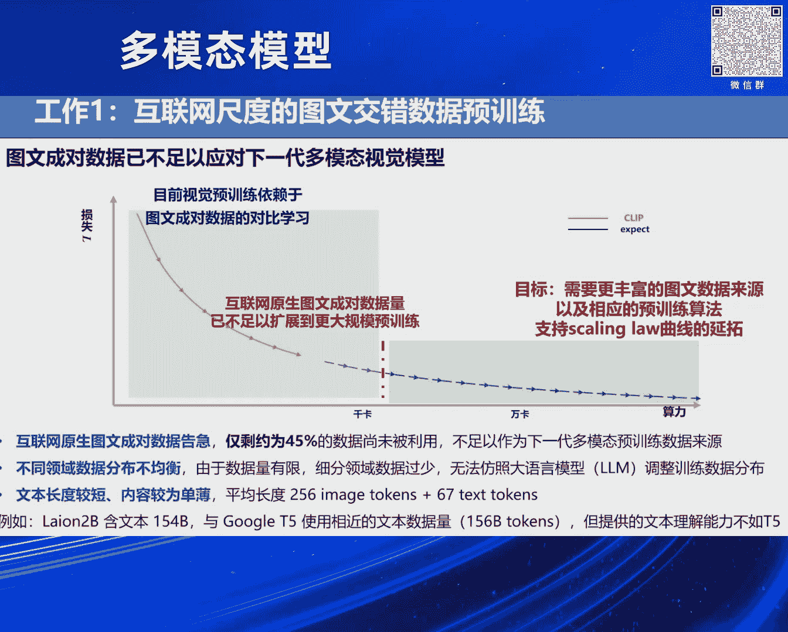

# 2024北京智源大会-多模态模型 - P4：多模态基础模型研究-代季峰 - 智源社区 - BV1sT421a7FU

2017。11。22 上海当代艺术博物馆 刘文博。 多模态技术模型，非常高兴今天能够来做这样的一个分享，我今天报告的题目叫做多模态技术模型技术研究。

首先我们可以看见，当然这个现在已经是有共识了，大圆模模型它已经带来了非常大的一个改变，它带来这么大的一个改变，我觉得是来自于两个方面，第一个方面它在具体的语言相关的任务上，它的性能做得非常好了。

通过scaling low，但另外还有一点很重要的是它的通用性，就是说它降低了应对新的开放式任务的编辑成本，这一点其实是非常重要的，就像上一代的AI，比如说以前上一代的AI创业公司做安防等等的。

比如说你给一个城市部署了一套安防的系统，这个时候市委书记说我们要凭全国卫生先进城市，所以接下来我们要严抓乱扔垃圾的行为，所以我们需要你们给我们再部署一套，检测乱扔垃圾行为的这样一个系统。

那你吭哧吭哧你又得花十个研究员，采集十万张图片 一百张卡，然后再干个两个月，然后再给它交付的那套系统，你应对任何一个新的任务，你的编辑成本是很高的，当然以ChartGPT为代表的这种大圆模型。

它有很强的应对开放式的任务的能力，比如说你在网上ChartGPT，你响应上亿人的请求的时候，它并没有说OpenAI再给你另外花研究员，再帮帮你 再FindTone for你的每一个任务。

对吧 就是这样的一种，一个是应对具体的任务能力非常强，另外一点就是开放式的任务的能力，低编辑成本翻画的能力，带来巨大的生产力的变革，当然我们就想把这样的一种，更新的一种生产力的能力。

带到更多的多模态的领域里面去，因为这个世界并不是结构化的语言世界，获取更多的信息，你需要通过视觉，然后你需要主动地去跟现实环境去打交道，这样的一种多模态的能力，如果我们也具有这样的一种。

每个任务能力很强，以及这种开放式的应对各种任务的能力，那会带来一个巨大的生产力的变革，所以我们就以这样的一个为出发点，我们就开启了我们的多模态的基础模型的技术的一个研究，对 然后我会具体地讲一讲。

当然我这些PPT是按照国内的这种，高校里面的习惯做的PPT，在场的今天的三位都是比较西方学术的风格，所以PPT的风格会有点不太一样，我们先看一下第一个主要的挑战，就是关于预训练以及训练数据规模的问题。

确实这个软件不太一样，当然没关系 并不影响这儿的理解，我们首先关注的第一个问题，我们会发现就是，当然之前的各位讲者都有说到CLIP，就是说已有的这种图像编码器的预训练。

通常都是用CLIP这样的在图文成对的数据上，去进行训练的，但是呢 当我们真正要构造一个，非常大规模的多模态的基础模型的时候，我们会发现现在其实互联网上的图文成对数据，就算你都用光。

它的数量也是已经告急了，就是说它已经无法再支撑更大规模的，多模态的大模型的预训练，然后以及呢，它还有一个很重要的问题呢，就是图文成对数据里面，你可以想象，就比如在整个复杂的一个新闻，或者在一个文档里面。

然后其实图文成对的部分，其实是它里面中间非常少的一部分，然后以及呢 它的这种语言部分，它其实是非常薄弱的，整个一个新闻，你的caption什么的，其实只有一点点的文字，它其实很多大段的逻辑对图的阐释。

什么的相关的东西，其实都是在它的正文里面，所以呢，就说如果你纯粹只在图文成对的上，上面去训练一个多模态模型的话，其实你的语言模型的部分是会训毁掉的，对，对，所以呢就说我们就。

我们这边呢就说是我们在训这个，比如说上海人工智能实验室这边的，我们的这个多模态大模型的时候，我们就会想到原生的，就从这种图文交错数据出发，然后来进行这样的一个探索和一个训练，因为就是图文成对的部分。

只是比如说你那个，我不知道这个怎么样，对，就是图文成对的部分，只是在中间非常少的一部分，我们希望用到更加广阔的这个数据，还有这个知识来训练我们的多模态的模型，为此呢我们构造了现在开源的最大的。

这样的一个图文交错的这样的一个数据集，可以看到这儿是跟以前的这样的一个，开源的这种数据集的一个比较，以前当然有很多的是一个，纯粹文字的这样的一种数据集，你有很多的文字，但是你并没有语言。

但是你并没有图像，然后我们有比如说像Lyron2B，这样的图文成对的这样的数据集，它里面有一些图像，还算挺多的图像 两个Billion，但是它的语言部分其实是非常薄弱的，然后呢我们构建了这个数据集。

叫做OMNI Corpus，然后这个是清华，还跟上海人工智能实验室大家一起打造的，它以中英文为主的这样的一个语言，然后它有非常大量的图像，因为它可以更加兼容并蓄地，收集更多的互联网上的这样的一些素材。

然后以及它有海量的文本的素材，它是现在国际规模最大的图文交错的数据集，这个是里面的一些例子，可以看到它整个主要的数数据，就是这样的一种结构，然后这个地方是项目的二维码。

接下来我们就说怎么样能够有效地利用，这种互联网尺度的图文交错数据，进行一个预训链，以前的这种，刚才各位嘉宾都有讲到的这个，clip的方法，哇 这个小小小小，绿点在上面压根就看不见。

A图中间的这种基于clip的方法，它设计来是利用这种图文成对的数据的，它能够在图文成对的数据上，很好的工作，去非常好的有监督的，预训链，你的微信的encoder，然后以及以前有C这样的一种方法。

C这样的方法就是以前确实有工作，尝试去利用这种图文交错的数据，但是其实它的出发点，并不是说怎么样我能够，很好的利用这些非常大规模的图文交错数据，我把我的微信的encoder也训好。

然后把我language部分的decoder也训好，它的出发点呢，或者说它能够做到的事情呢，是说是我拿一个已经预训链好的clip，比如说clip 尤其是clip，已经预训链好的微信的encoder。

我拿过来，然后我再拿过来一个已经预训链好的language的model，我把它们拼接起来，然后我这个时候我用一些图文交错的数据进行叙述，最后达到一个，部署起来效果还不错的这样的一个。

图文多模态的这样的一个模型，它并不是说我想从头，怎么去更好的去利用图文交错的数据，去预训链我的微信的encoder，它并不能够做到这样的一件事情，因为我们会发现它会把这样的事情给做毁掉。

就是说如果从头开始训的话，然后我们这个方法呢，B这个方法呢，我们待会会讲我们提出来叫多模态信息压缩学习这样的一种方式，我们首次支持了互联网尺度的图文交错数据的，端到端的预训链的算法。

它可以直接利用图文交错的这种数据互联网尺度的，然后from scratch的把你的微信encoder，把它给训出来 把它给训好，然后支持了我们现在最强的视觉语言，技术模型InternVL的V1。

5版本的训练。

然后项目的二维码是在这个地方，然后这个多模态信息压缩学习这个算法呢，我们是从语言这边的压缩学习这样一种概念来的，对 最近有一种观点非常受到大家的关注，就是说它尝试去解释为什么像GPT这样的语言模型。

它能够具有类似于像AGI的这种能力，就是所谓的压缩及智能，你把全世界的语料的这种知识，压缩到一个参数量有限的大模型里面，在这样的一个信息压缩的过程中间，即产生了智能，然后我们也是非常搬运这样一种想法。

所以我们在做图文交错的域训练的时候，我们也是基于这样的一个多模态的信息，压缩学习这样一个理念出发，来构造我们的图文交错数据的这样一种域训练的算法，只是说在这个里面，我就不讲那些公式了。

我讲一讲背后的一些想法，对 然后只是在这个里面呢，在图文交错数据里面，它跟语言模型这边有一点很大的不一样的，就是语言这边它是一个结构化的，这样的一个数据，所以你只管压缩你所有的语料就好了。

它已经过滤掉了现实世界中间很多的噪音，它已经是人类的知识的结晶，把这个繁杂的现实世界通过语言把它给结构化，逻辑化把它给屏蔽掉了，把中间很多的不相关的信息，但是当你在全世界的这种图文交错数据上面。

去做这个域训练的时候，你的图像在这边，其实它中间是有很多无关的这种信息的，就是它有很多的信息对于你，这个训练这个图像的encoder，或者一个多模态的大模型来说，这些信息它是noise，它是不相关的。

irrelevant或者说它是一些无效的信息，所以我们的这个压缩学习，compression learning，它是在图像层面，它是在latent encoder的feature上面去做的。

我们图像这边先通过一个encoder，先获获的一个影变量的一个表示，然后我们在这个影变量上面去做compression learning，这样可以通过学习过程中间自动地丢弃掉，这些繁杂的世界的图像中间。

跟我们的学习目标不相关的这样的一个部分，这样获得一个更好的学习的效果，然后最后呢，根据这样的一种，latent variable的compression learning，这样的一种方式呢。

我们会导出最后它的整个训练的target，包括了contrastive loss，还有autoregressive的text generation loss，这样的两个部分来组成。

细节大家可以去查看论文，然后实现起来也是非常高效的，因为我们要在全世界的图文交错数据上面去做训练，所以说我们必须要确保整个算法的，学习的一个是accuracy，另外一个是efficiency。

效率我们都得非常关注，不然的话是做不好的，OK，那接下来呢，用我们这样的数据还有预训链的算法，我们怎么去预训链我们的视觉还有图文的，这样的一个基础的一个facial的表征，然后呢，我们这儿呢就是。

我们做出来的就是现在最好的，开源的视觉语言的基础模型，叫做inter-vl，我们思考这个东西的出发点呢，就是说，我们现在，就是你构造一个图文的这样的一个多模态的基础模型，它包括图和文的部分。

当然现在刚才Sai Sanlin也说，现在这种架构通常是这样的，然后我们会观察到呢，就vision的encoder的部分，其实我们觉得它有落后于时代，最早的时候就是你为了这个。

image-let的任务上面，去围着它来转，这样的一种预训链的方式，然后呢，后来又迁移到Eclipse，为代表了这样一种图文成对的，这种contrastive预训链的方式。

你最后得到的这个vision-encoder，它还是跟现在这样的一个多模态大模型，后面接一个非常强的这个，你可以认为具有高阶逻辑和认知能力的大圆模型，作为你的这样的一个推理和高阶智能能力的中枢。

视觉作为一个encoder，它并不是为这样的一种架构一开始，它并不是为这样一种架构去设计的，所以呢我们在这儿做的这个intern VR，这整个模型呢，我们其实就是说是一开始。

我们就是为整个图文的这样的一个，多模态的大模型，就一开始就是为这样的一个应用，或者说这样一个架构去进行设计的，就是我们一开始就想，就想像清晰的视觉作为一个很强的encoder。

然后语言作为一个高阶智能的中枢，decoder就是为这样的一个架构去进行设计的，然后呢我们这里面采用了，这个latent compression learning的方法。

来训练我们的视觉的encoder，然后训练了一个非常大规模的，应该也是现在最强的开源的视觉的encoder，然后以及在中间呢，我们使用了一种就是叫做渐进式对齐的方案，来进行一个学习，因为你一开始如果就。

如果就说接一个特别大的语言模型，然后来进行这样一个视觉encoder，从头开始训练的话，你的整个计算代价会是非常高的，所以我们是在一开始在训练这个视觉encoder的时候，我们是，为啥我不认我。

我们在一开始训练这个视觉encoder的时候，我们是用一个相对比较小规模的语言模型，在图文交错数据上进行视觉encoder的训练，然后视觉encoder训到差不多之后，然后我们再换上一个特别大的。

这样一个非常强的这样一个大的语言模型，进行进一步的这样一个训训，通过模型这种从小到大数据从初到今的，这样一种渐进式的训练策略，大幅度地降低了大模型的这样一个训练的成本。

在有限的资源下展现出来的卓越的这样一个能力，然后我们先说这个模型，拆出来中间的视觉编码器的部分，一个6bit的一个视觉encoder的一个模型，这个应该是现在最好的开源的视觉encoder。

我们的能力能够比肩谷歌的，它必然的VIT22B这样的一个性能。

然后作为整体整个模型，就是视觉的encoder加上语言的decoder，这样整体整个模型，它现在是世界上最强的开源的多模态的通用模型，性能媲美。

基于GV4V Gemini Glock等头部的这种商用的模型。

然后这个模型2023年12月份发布，在Hugging Face上面，增长趋势榜单上连续一个月排行第一，然后在视觉语言技术模型总下载榜单上排名前十，然后在它旁边的都是Google Meta。

还有微软更早时间发布的同种类型的一个模型，然后当然北京志愿研究院有发布评测体系，反正是目前最好的开源模型，然后在浦江实验室的思莱评测上面，它是一个榜单的榜单，然后它是十几个多模态模型榜单。

然后它做一个加全求求求和，这样形成一个榜单的榜单，然后它优于国内非常多的，像智普 还有Jay Yue，还有阿里的这个碧源的模型，然后比我们更好就是这个基于GV4V的4月份的版本，以及最新的GV4O，对。

这个是我们可以跟大家展示，我们这些模型的一些视觉内容，理解等等能力，然后这个是我们模型的一个online的demo，大家可以先存下二维码，主要是现场这么多人如果，因为我们服务器并没有放很多。

因为我们其实主要还是开源这个weight，并不是拿来大规模的给全球上亿人服务的，所以我们放demo的计算量比较小，如果你们同时使用的话，我估计体验不会那么好，但平时你们正常使用的话，这个还是非常快。

然后体验也是非常好的，对，然后这就是更多一些例子，比如说这个里面你问它宝马车牌号是啥，blah blah，它能给你很好的回答，这个哪个西瓜最熟，我记得好像这个是智普他们的一个例子，对，然后呢。

anyway，它也能给你一个非常reasonable的答案，对，这个是我自己家的一个例子，反正就是我们这个模型做出来之后的话，然后我们就做这个模型的同学，大家就有一个微信群嘛，然后模型做出来之后。

大家就拿自己手机相册里面的各种照片去试，然后就有一些非常有趣的或者failure的case，大家就会在群里面聊，对，就这种感觉跟你去试用一个商用的模型，比如说你不知道它怎么训练的模型。

相比这个体验还是非常不一样的，对，就是说你说你用这个GPT-4V，或者是什么的模型，对吧，你觉得它效果挺好，ok行，它效果挺好，这个后面是魔法，对吧，OpenAI的magic，对吧。

然后你做一个真正自己顺顺的模型，然后性能跟它差不多，然后你发现一些效果特别好的例子的时候，你会觉得，我靠这些东西是怎么实现的，然后你会，比如说这个例子里面，反正就是说它能够在这种遮挡很严重的情况下。

对吧，然后它能够分清楚左右手的概念，然后它能够准确地告诉你答案，然后我自己看这个例子，我觉得，哦 对，在我的理解里面呢，其实就是它，就像刚才赛琳有讲的，它其实，我的理解它在全世界这种语调上。

这种图文的语调上面训练之后，它其实是学会了这种单位的词源，跟这种视觉的单位元素之间它的一个映射关系，然后它学会了这样的一种映射关系之后呢，并且它又具有一种组合，一种排列组合的能力，它能够理解整个句子。

把这些各种视觉元素排列组合起来之后，它能够对应于一个什么样的更复杂的概念，通过这些基础能力的组合呢，它能够形成一个很强的泛化能力，就是我们在测试模型的时候会发现，这个模型的能力我们没有训练过。

它究竟是怎么出来的，经常我们都会有这样的一种感慨，但是这个是指令跟随能力，这是GPT-4V，当时让我们觉得很惊艳的一个例子，我们的模型也可以做的，然后这个是网上别人做的一个视频，这个不是我们做的。

这个是网上别人做的一个视频，这个是网上别人做的一个视频，这个是网上别人做的一个视频，这个是网上别人做的一个视频，这个是网上别人做的一个视频，这个是网上别人做的一个视频，这个是网上别人做的一个视频。

这个是网上别人做的一个视频，这个是网上别人做的一个视频，这个是网上别人做的一个视频，这个是网上别人做的一个视频，这个是网上别人做的一个视频，这个是网上别人做的一个视频，这个是网上别人做的一个视频。

这个是网上别人做的一个视频，这个是网上别人做的一个视频，这个是网上别人做的一个视频，这个是网上别人做的一个视频，这个是网上别人做的一个视频，这个是网上别人做的一个视频，这个是网上别人做的一个视频。

这个是网上别人做的一个视频，这个是网上别人做的一个视频，这个是网上别人做的一个视频，这个是网上别人做的一个视频，这个是网上别人做的一个视频，这个是网上别人做的一个视频。

这个是网上别人做的一个视频，这个是网上别人做的一个视频，这个是网上别人做的一个视频。

这个是网上别人做的一个视频，这个是网上别人做的一个视频，这个是网上别人做的一个视频，这个是网上别人做的一个视频，这个是网上别人做的一个视频，这个是网上别人做的一个视频，这个是网上别人做的一个视频。

这个是网上别人做的一个视频，这个是网上别人做的一个视频，这个是网上别人做的一个视频，这个是网上别人做的一个视频，这个是网上别人做的一个视频，这个是网上别人做的一个视频，这个是网上别人做的一个视频。

这个是网上别人做的一个视频，这个是网上别人做的一个视频，这个是网上别人做的一个视频，这个是网上别人做的一个视频，这个是网上别人做的一个视频，这个是网上别人做的一个视频，这个是网上别人做的一个视频。

这个是网上别人做的一个视频，这个是网上别人做的一个视频，这个是网上别人做的一个视频，这个是网上别人做的一个视频，这个是网上别人做的一个视频，这个是网上别人做的一个视频，这个是网上别人做的一个视频。

这个是网上别人做的一个视频，这个是网上别人做的一个视频，这个是网上别人做的一个视频，这个是网上别人做的一个视频，这个是网上别人做的一个视频，这个是网上别人做的一个视频，这个是网上别人做的一个视频。

这个是网上别人做的一个视频，这个是网上别人做的一个视频，这个是网上别人做的一个视频，这个是网上别人做的一个视频，这个是网上别人做的一个视频，这个是网上别人做的一个视频，这个是网上别人做的一个视频。

这个是网上别人做的一个视频，这个是网上别人做的一个视频，这个是网上别人做的一个视频，这个是网上别人做的一个视频，这个是网上别人做的一个视频，这个是网上别人做的一个视频，这个是网上别人做的一个视频。

这个是网上别人做的一个视频，这个是网上别人做的一个视频，这个是网上别人做的一个视频，这个是网上别人做的一个视频，这个是网上别人做的一个视频，这个是网上别人做的一个视频，这个是网上别人做的一个视频。

这个是网上别人做的一个视频，这个是网上别人做的一个视频，这个是网上别人做的一个视频，这个是网上别人做的一个视频，这个是网上别人做的一个视频，这个是网上别人做的一个视频，这个是网上别人做的一个视频。

这个是网上别人做的一个视频，这个是网上别人做的一个视频，这个是网上别人做的一个视频，这个是网上别人做的一个视频，这个是网上别人做的一个视频，这个是网上别人做的一个视频，这个是网上别人做的一个视频。

这个是网上别人做的一个视频，这个是网上别人做的一个视频，这个是网上别人做的一个视频，这个是网上别人做的一个视频，这个是网上别人做的一个视频，这个是网上别人做的一个视频，这个是网上别人做的一个视频。

这个是网上别人做的一个视频，这个是网上别人做的一个视频，这个是网上别人做的一个视频，这个是网上别人做的一个视频，这个是网上别人做的一个视频，这个是网上别人做的一个视频，这个是网上别人做的一个视频。

这个是网上别人做的一个视频，这个是网上别人做的一个视频，这个是网上别人做的一个视频，这个是网上别人做的一个视频，这个是网上别人做的一个视频，这个是网上别人做的一个视频，这个是网上别人做的一个视频。

这个是网上别人做的一个视频，这个是网上别人做的一个视频，这个是网上别人做的一个视频，这个是网上别人做的一个视频，这个是网上别人做的一个视频，这个是网上别人做的一个视频，这个是网上别人做的一个视频。

这个是网上别人做的一个视频，这个是网上别人做的一个视频，这个是网上别人做的一个视频，这个是网上别人做的一个视频，这个是网上别人做的一个视频，这个是网上别人做的一个视频，这个是网上别人做的一个视频。

这个是网上别人做的一个视频，这个是网上别人做的一个视频，这个是网上别人做的一个视频，这个是网上别人做的一个视频，这个是网上别人做的一个视频，这个是网上别人做的一个视频，这个是网上别人做的一个视频。

这个是网上别人做的一个视频，这个是网上别人做的一个视频，这个是网上别人做的一个视频，这个是网上别人做的一个视频，这个是网上别人做的一个视频，这个是网上别人做的一个视频，这个是网上别人做的一个视频。

这个是网上别人做的一个视频，这个是网上别人做的一个视频，这个是网上别人做的一个视频，这个是网上别人做的一个视频，这个是网上别人做的一个视频，这个是网上别人做的一个视频，这个是网上别人做的一个视频。

这个是网上别人做的一个视频，这个是网上别人做的一个视频，这个是网上别人做的一个视频，这个是网上别人做的一个视频，这个是网上别人做的一个视频，这个是网上别人做的一个视频，这个是网上别人做的一个视频。

这个是网上别人做的一个视频，这个是网上别人做的一个视频，这个是网上别人做的一个视频，这个是网上别人做的一个视频，这个是网上别人做的一个视频，这个是网上别人做的一个视频，这个是网上别人做的一个视频。

这个是网上别人做的一个视频，这个是网上别人做的一个视频，这个是网上别人做的一个视频，这个是网上别人做的一个视频，这个是网上别人做的一个视频，这个是网上别人做的一个视频，这个是网上别人做的一个视频。

这个是网上别人做的一个视频，这个是网上别人做的一个视频，这个是网上别人做的一个视频，这个是网上别人做的一个视频，这个是网上别人做的一个视频。

这个是网上别人做的一个视频，这个是网上别人做的一个视频，这个是网上别人做的一个视频，这个是网上别人做的一个视频，这个是网上别人做的一个视频，这个是网上别人做的一个视频，这个是网上别人做的一个视频。

这个是网上别人做的一个视频，这个是网上别人做的一个视频，这个是网上别人做的一个视频，这个是网上别人做的一个视频，这个是网上别人做的一个视频，这个是网上别人做的一个视频，这个是网上别人做的一个视频。

这个是网上别人做的一个视频，这个是网上别人做的一个视频，这个是网上别人做的一个视频，这个是网上别人做的一个视频，这个是网上别人做的一个视频，这个是网上别人做的一个视频，这个是网上别人做的一个视频。

这个是网上别人做的一个视频，这个是网上别人做的一个视频，这个是网上别人做的一个视频，这个是网上别人做的一个视频，这个是网上别人做的一个视频，这个是网上别人做的一个视频，这个是网上别人做的一个视频。

这个是网上别人做的一个视频，这个是网上别人做的一个视频，这个是网上别人做的一个视频，这个是网上别人做的一个视频，这个是网上别人做的一个视频，这个是网上别人做的一个视频，这个是网上别人做的一个视频。

这个是网上别人做的一个视频，这个是网上别人做的一个视频，这个是网上别人做的一个视频，这个是网上别人做的一个视频，这个是网上别人做的一个视频，这个是网上别人做的一个视频，这个是网上别人做的一个视频。

然后这个是你问他一些别的问题，比如说你问他，你希望定位图片里面所有的人，然后你让他把这个Coco 17个Key Point的标注，把这里面所有的都给标出来，或者你只做一个点位，要定位所有的人。

然后你把他这个Right Elbow，右肘的位置把它给点出来，或者是干一些其他的事情都可以，然后在这个上，让他去调Image Editing，或者是图像生成这样的一些工具。

来进行图像的一些编辑这样的一些操作，最后呢是我们往这个与世界进行交互，这个方向去走的一些尝试，但这个其实是相对更早一些的，这个工作是我们去年五月份的时候，Public出来的，我们其实在去年年初的时候。

那会儿就非常敏锐地意识到了，跟这种大模型它的威力会拓展到，跟这个虚拟环境还有现实环境中间的交互里面去，就以前基于强化，纯粹基于强化学习的方法有太多的缺点和问题。

然后大模型或者是大模型它能够很好的弥补这样的缺点，所以我们在去年年初的时候就开启了这样一个项目，然后去尝试去玩一个最开放的，卖得最好的游戏 Minecraft 我的世界，然后在这个里面呢。

我们就在 Minecraft 里面，最最最早跟英伟达的 Voyager 二者同期，这两个工作最早在我的世界里面，证明了这种基于大圆模型的智能体，相较于以前的强化学学的智能体，它具有一个非常强的泛化。

还有智能化的能力，对，这个是我今天整个talk。

谢谢大家，謝謝大家。