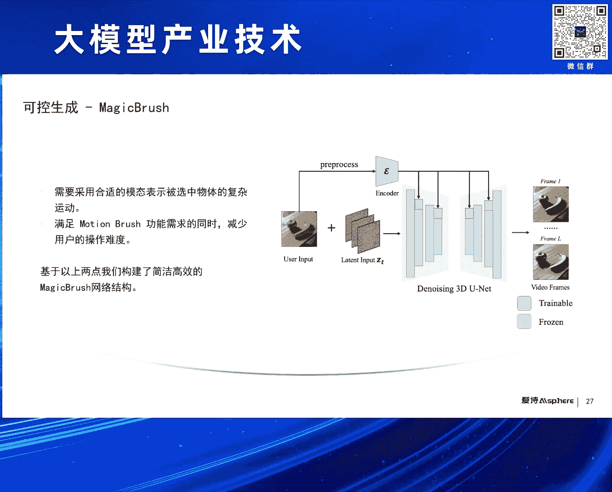
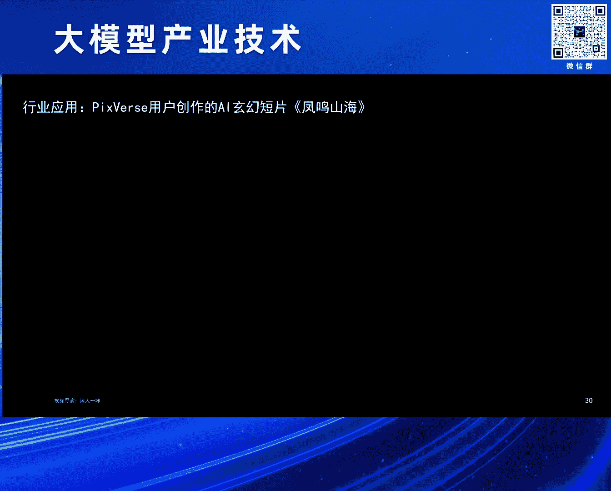
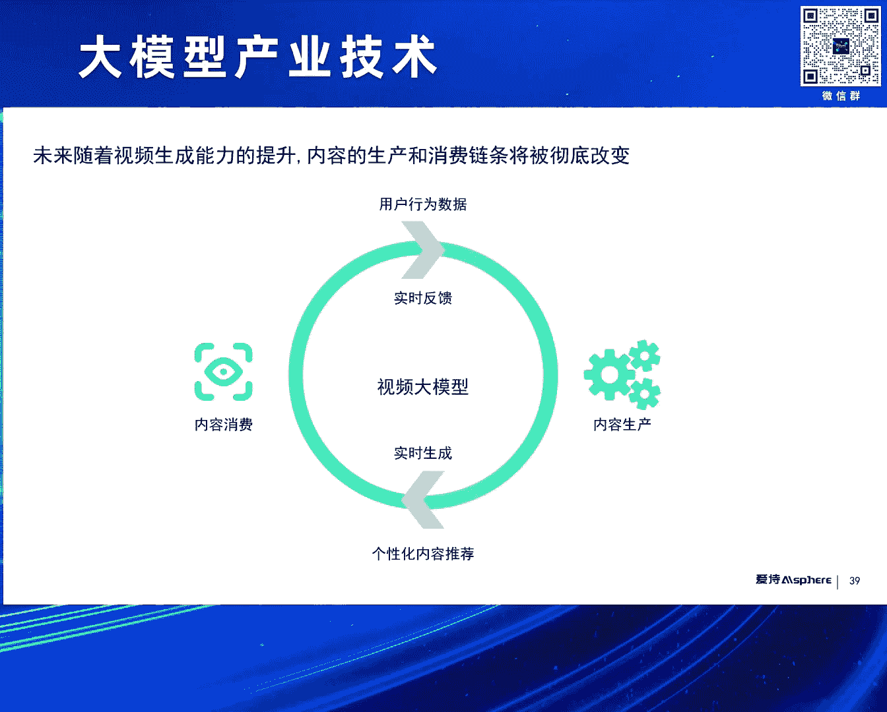
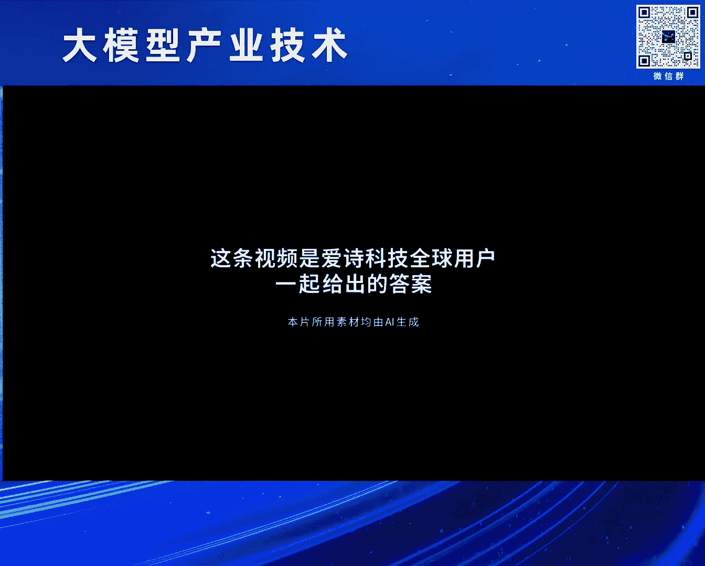
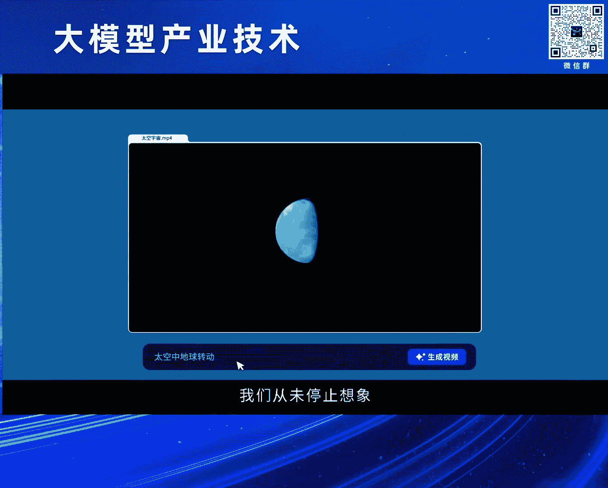
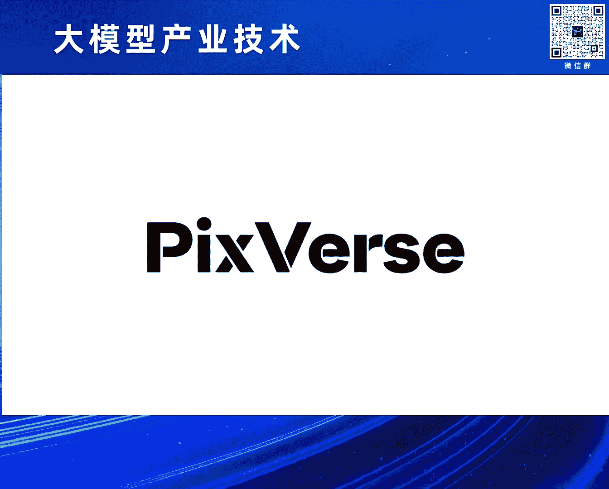

# 2024北京智源大会-大模型产业技术 - P2：Al视频生成的过去，现在和未来：王长虎 - 智源社区 - BV1HM4m1U7bM

特别感谢中远院长的邀请。

非常荣幸参加这个论坛，我是王长虎。

我仅代表一个创业者，跟大家分享一下过去这一年视频生成这个行业，从硬着聊聊到现在复入节肢的这一年中，我个人的所见和所想，其实我在这个行业里边，AI方向已经深耕了好多年，过去也在大厂工作，有朋友问我。

为什么想不开出来创业了，我想主要原因还是跟在座的很多朋友一样，我们看到了一个浪潮的到来，有人把它叫做AGI，对比过去的专业有员工智能，所谓的通用人工智能时代的到来，我更想用从用户从内容侧。

来把它叫做AIGC，对应过去的PGC时代 UGC时代，一个浪潮到来一定不是一蹴而就的，一定要经过很多先驱者的不断的探索尝试，AIGC也是如此，最早可以追溯到上世纪的50年代，在人工智能出现之后。

我们可以看到在早期的云雅阶段，1957年我们就用计算机，科学家们用计算机创作出来了第一个曲子，那个时候技术有限，所以所有的尝试都局限在实验阶段，从上世纪90年代到本世纪10年代。

这个阶段是AIGC的技术沉淀累积的阶段，也诞生了很多著名的工作，包括我们第一部人工智能创作的小说，包括这种全自动的同声传译系统，但因为算法的限制，使得这些工作还是很难去真正面向普通用户，10年代之后。

随着GAN生成式对抗网络的出现，一系列的生成式的工作还真正地面向用户，从图像生成到大型模型，到本身图人生视频，从GAN到Transformer到Diffusion。

从我们耳熟能详的ChartGPT到MiniGenie，最后到SARA，实际上开启了一个新的篇章，AIG其实是包括多种不同的内容，包括语言 视觉 音频等等，在ChartGP出现之后。

大跃模型成了大家关注的焦点，在SARA出来之前，即使视频生成赛道还是没有这么火，出来出现之后也引了大家的关注，有人问我，视觉大模型和大跃模型主要区别在什么地方，在我看来二者其实是两种不同的内容。

语言是在人类出现之后出现的，是人类文明的产物，是对世界的信息的抽象，而视觉在人类出现之前就在那里，山在那里 水在那里，是原生的，所以当ChartGP出现之后，人们对大跃模型的期望是模拟人脑。

构建轨迹生命，那么人们对视觉大模型，视频大模型的期望，其实是跟外在的，是模拟世界，构建世界，视频生成，它本质上是通过对世界的理解，来做影像呈现，影像呈现实际上经历了从，记录到生成的演变的过程。

这里列举了过去三个图像，呈现的三个重要的节点，我们可以看到我们在三万多年前，人类就已经在岩壁上面去绘制，创作自己看到的这个世界，我们可以看到栩栩如生的诗群，第二张图像是在1826年。

法国的视影先驱创作的第一个，可以永久固定的成像的这样的图片，第三个是人类历史上第一个视频，用了24台照相机拍摄出来的马在奔跑的这样的视频，这也源起于关于马奔跑的时候。

尸体是否腾空这样一个辩论，影像的呈现其实，影像的生成其实看起来是离我们很远，但事实上就在我们的 离我们很近，我们可以看到小时候过节的时候，我们家长也会帮我们去制作各种的灯笼，其中一个就是走马灯。

它原理是什么，我们点燃蜡烛，蜡烛的热气上升，带动这个轮轴的转动，轮轴上面我们有一些碱纸，那光影把碱纸影子投射在屏上，我们看到了这样一个现象，后者是一个连环画，我们小时候也做过，也是非常有趣的年代。

我们可以看到，通过这样的快速翻页，就可以呈现出这样一个动态的画面，随着抖音啊 TikTok啊，这种短视频的普及和发展，视频生成真正走到了每一个人的手上，早期的视频生成其实是急于解锁完成的。

视频里面每一个素材都是原有的，都是在数据库里面找到的，通过自动的方式找到合适的素材，通过拼接形成这样的视频，现在呢我依然能够刷到类似的视频，第二个是部分生成，这是一个抖音的视频特效，我们可以看到。

用户可以用手掌来控制水珠，这部分的生成，往往是需要输入一个视频，然后呢通过AI技术，做局部的部分的这样的生成，这种技术广泛地应用在各种，部分生成需求的特效之中，包括美颜特效啊，包括动漫风的生成啊。

包括各种局部的生成，包括比如说我们加个毛耳朵，加个狗头等等，第三部分其实是我们现在常说的，这种通用的生成，输入一个Prop，输入一张图片，生成 平公的生成视频，过去这一年，这方面进展推速。

从2014年开始，视频生成技术已经发展了10个年头了，随着Gantt出现，这种生成技术才真正地使用起来，早期的Gantt技术，像早期应用在很多的，这种前面提到的这种部分生成，特效生成上。

但是呢对于通用的视频生成，效果依然是差强人意的，直到Diffusion，2020年Diffusion模型的出现，击败了Gantt，成为了图片生成视频生成的主流，那过去这一年23年开始，我们可以看到。

很多的视频生成的技术和产品，逐渐出现，包括我们知道的像NVIDIA的，VRDM，包括Google的POET，包括一些真正面向用户的产品，Runway Pica。

包括我们公司开发的Big Source等等，那当然今年春节，SORA同同出世，开启了一个新的机缘，那首先介绍一下这个生成对抗网络Gantt，Gantt是2014年由Goodfellow提出的。

它源起于这样的博弈论中的，联合博弈的思想，就是通过两个网络，生成网络和判别网络的不断博弈，进而削异到数据分布，来生成高质量的内容，它的优缺点也是比较明显的，优点是，是能够生成可控的效果。

还是在有特定目标的时候，能够生成较好的这样的内容，缺点也是比较明显，就是训练难度比较大，我们要同时优化两个网络，同时多样性是有限的，很难做通用的生成，Gantt提出之后，很多这种变种就纷纷被开发出来。

包括Cycle Gantt，DC Gantt，包括Info Gantt等等，广泛应用在很多的场景上，也有的研究人员，希望能够把Gantt的技术，应用在视频生成之中，比如说这边提到了。

Demand在2019年提出了一种方法，因为要做视频生成，所以不仅有RedNet结构，还引入了RN来进行建模，同时在判别的时候，采取了双判别器，空间判别器 时间判别器，来做视频生成，这样的方法。

事实上生成视频质量依然有限，Diffusion是一个非常重要的一种方法。

Gantt和Diffusion上支撑了过去10年，AIGC图像视频生成的发展，Diffusion本身是在2015年提出的，在2020年正式击败Gantt之后，才真正流行起来，它的主要思想其实是。

通过不断地给图片加噪声，来破坏数据分布，然后呢，再逆向地去不断地去噪，对数据进行还原，这个过程中不断地去逼近数据的分布，然后生成高质量的内容。

Diffusion模型早期一直是，包括一个Unite架构，用它来进行去噪，也是过去几年最主流的一种模式，Diffusion Transform DIT的出现，验证了这种新的结构。

可以更好的进行Skill Up，从而生成更高质量的内容，因此随着骚扰出现，DIT这种Diffusion加Transform的架构。

逐渐地成为了主流，Diffusion加Unite这种架构，的一个很典型的 很经典的，视频生存的方法，其实是NVIDIA提出的这种VLDM，在这之前，大家做视频生存的尝试，其实这种工作流。

其实是非常多变的，这个方法第一次更，好地提出了一个比较有效的这种，最后来成为一个主流的工作流，是先生成关键帧，然后进行插帧，之后进行超分，这样一个同样的工作流，它的方法主要是用的。

Diffusion加3D Unite架构，并且这个模型能够支撑多个任务，包括关键帧的生成，包括插帧和超分等等，视频生存能力，和原有的视频生存技术相比，也有很大的提升，这个除了干Diffusion之外。

也有很多人员，希望能够用大圆模型技术，来解决视频生存问题，因为Senseform在大圆模型里面的，巨大的成功，有些研究人员也非常坚信，Senseform是视频生存最终答案，这是其中一个代表性工作。

是Google在去年年底提出的Video Point，它采用一个Decoder only的，自回归的Senseform，来端到端的去，用大圆模型技术来生成视频，它允许多种模式输入。

然后用专有的Tokenizer，来把这些内容，Token化输到Video Point模型之中，这个工作其实是呈现效果是非常棒的，但是和V人工作一样，虽然是一个公开发表论文，但是并没有产品化，也没有开源。

所以我们也无法去真正的，让用户来测试这种方法的好坏，今年年初春节期间，骚扰恐空出世，进一步推动了这个行业的发展，骚扰用的架构，就是刚才提到的Diffusion+Transform的架构。

用Transform模块来替代，Diffusion架构里面的，去噪的模块Unite，同时它也利用了大圆模型，来帮助做Problem的增强，以及做训练数据的精细化达标。

同时在Encoder和Decoder，这两个地方也做了一些创新。

关于骚扰的解读其实是非常丰富的，我就不展开介绍了，在我看来骚扰它的最重要的一个贡献就是，验证了DIT Diffusion+Transform，在视频生成中的Scaling Law规模定律。

就是说模型越大，我们的Spatial Temporal Patch越小，我们的可用的优质量数据越多，会产生我们的性能效果更好，这是一个例子，骚扰曾经的例子，当我们基础计算量一定的时候。

你可以看到生成的视频还是有很多变形的，但是随着我们计算量增加4倍到32倍的时候，生成的质量是非常好，已经非常好了，这里有一些例子也是来源于SORA的网页，可以看到当我们的镜头生成视频里面。

镜头在平移旋转的时候，物体场景在三维空间里面，依然能够保持更好的一致性，说明这个模型已经具备了一些3D建模能力，同时我们可以看到它发布的很多这种长视频，20秒的60秒的长视频中，也具备一些一致性的能力。

里面的人物物体出镜头又进来的过程中，人物的衣着依然可以保持一致，同时可以看到它的一些粒子里边，可以呈现一种物体间互动的建模能力，比如说左边咖啡里边的小船，它在行驶会带来咖啡的波浪的运动。

右边的一个人在吃汉堡的时候咬下去之后，我们汉堡上面也留下了一些印记，但是因为Solar其实并非公开可测，所以看到的很多例子是它放出来的，所以它依然披着一个神秘的面纱，尽管如此。

它已经极大地推动这个行业的发展，技术也使得众多视频生成技术熟练到DIT，而视频生成能力也进一步的提升，Solar出来之后，我们看到很多这种非常优秀的模型纷纷出现，大家也非常希望能够成为中国的Solar。

全球的Solar，也获得了很多的报道，这里边有一些开源的模型，包括OpenSolar，也有一些并没有开源，也没有产品化的一些模型，也有虽然没有开源，但是可以公测，可以已经产品化的一些模型。

最近几天其实发展很快，我们可以看到快手发布的可林的，民生视频能力，包括Luma的图生视频能力，也是非常惊艳的，这里就不多介绍了，过去这一年我们可以看到，无论从数据量，计算量还是参数量上面。

都有了非常大的提升，这里边列了三个工作，一个是23年7月份，上海AI Lab的Apple Dev，然后还有23年底，Google的Video Point，以及24年2月份的OpenAI的Solar。

我们可以看到数据量。

计算量参数量都有几十倍的增加，5月份我们的智能研究院，携手中国传媒大学，对全球的上百个大模型，做了一个专业的评测，其中包括一些视频模型，比如在海外有一些一定用户基础的，Runway，Pika。

包括我们的Pixworks，也包括一些腾讯，阿里的视频生存模型，也包括一些开源的模型，包括OpenSolar等等，评测结果我们也很开心看到，Pixworks我们的产品，排名在前三名。

因为Solar本身是无法公开测试的，所以它只需要参考，所以前三名是Runway，Pixworks和Pika，大家可以看到技术测，大家逐渐趋同，但是视频生存能力，最终会需要面向用户。

这些产品是如何设计功能，服务用户，我们简单的和大家一起，去看一下这三个模型，Runway Pixworks和Pika，他们的一些共同点和差异点，Runway其实是视频生成产品化的一个先行者。

在它出现之前，其实更多的生成能力，还是体现在论文里边，Runway这个公司已经成立了6年时间了，它是2018年成立的，早期的时候它是做技学系模型平台，后来开发了很多的AI视频编辑能力。

在去年3月份的时候，它发布了Zen2文生视频能力，那是第一个产品化的文生视频能力，也吸引到了非常多的用户，我们可以看到它的UI里边，其实也体现了非常多的这种AI编辑的工具，也超过20个，针对不同的内容。

不同用场景来满足用户的需求，同时它也是最早的推出了，叫做Motion Brush运动笔刷的功能，我们可以看一下，用户可以通过笔刷的方式精准控制，视频里面的局部的内容的变化和运动，也得到了用户的好评。

Pika其实也是大家也非常熟悉的，这样一个视频生成能力，它是成立这个公司成立于去年年初，它是先从社区做起的，那时候它呈现了一些面具，使用面具之后，又有把图变成视频需求这样一些用户，所以在社区里面。

用户成长是非常快的，它在早期它也是重点，把精力重点放在了图生视频上，那它的特点是什么呢，它很重视声音口型，它在今年年初的时候，与11labs合作推出的AI口型和配音的功能，对。

同时它也推出了AI音效生成功能，用户可以输入通过Promote控制，也可以让AI根据生成视频内容，来自动的去匹配音效，我们可以看一下，介绍一下，爱诗的产品Pixworx，Pixworx它的评测结果。

实际上是超过皮卡的，那同时我们在用户侧，已经每天的访问用户，也已经跟皮卡比肩了，那我们是在今年1月份正式上线的模型，我们可以提供很多基础功能，包括文生视频，图生视频，当然我们也有特定的自己的特色功能。

包括固定角色生视频，Character to video，我们特别关注用户的可控生成，因为用户在创作视频的时候，实际上是有需求，确保不同镜头里面的人物要保持一致，同时也希望更精确地控制。

视频里面的局部内容和背景它的变化，为什么会有角色一致性的功能，因为我们看到现在视频生成的，时长还是比较短的，我们只能做到单镜头的生成，我们在用户在真正用这个能力的时候，往往生成更长的视频。

不管是广告片还是剧情片，它需要集成多个镜头，那需要镜头里面的主角保持一致，不能是前几个镜头是刘德华，然后后几个镜头变成梁朝伟了，所以我们开发了这个功能，我们可以看一下，用户可以自己创作上传一张图片。

来创作你的形象角色。

然后根据这个角色，来连续生成同一个角色的不同的视频，可以看到这个角色是上传一张照片，就可以生成这个角色相关的，不同的AI视频，同时我们也开发了Magic Brush运动笔刷的功能。

它的应用性效果要超过Runway的，我们可以看一下，用户可以用笔刷来涂抹区域，选择物体，并且勾画轨迹，这个物体就可以按照轨迹来运动，我们可以看到这个物体的轨迹是轨迹的轨迹，它是一个轨迹的轨迹。

我们可以看一下，过去这一年，其实我们也经历了Diffusion，Unite到Diffusion Transformer这样的一个升级，在我们创业早期的时候，资源有限，我们用最短的时间。

效果达到全球第一梯队，当前我们也和很多同行一样，用DIT的这种架构，来希望能够做出中国的SORA，全球的SORA，未来的话我们也会探索更多的可能性，下面简单介绍一下我们这几个这种可控生成技术。

背后的一些原理，首先我们看这种可控生成，固定角色生视频这样的功能，Character to Video，我们需要把角色固定住，并且把它融合到我们的视频之中，固定角色其实现在有不同的方法。

这里列了两个典型的方法，一个是Laura，一个是Epic Adapter，这两个方法其实是有很大的差异，Laura我们知道，就是每个ID都需要重新去训练，所以训练成本是比较大的。

但它的好处是天花板比较高，然后保真度 美学性都非常好，Epic Adapter的优点是什么，只训练一次就好了，它用很多的这种ID来训练一个嵌入，一个模块，然后嵌入到我们的生成模块里边。

用户输入新的ID的时候，就必须要重新训练了，它的优点是成本很低 速度很快，但是问题是什么，问题是上限不够高，并且美学质量也是偏低的，我们针对这两种方法的问题，其实我们设计了一个结构。

我们基于Epic Adapter的这种架构，我们增添了两个模块，因为解决保真度的问题，我们增加了一个Pump别模块，来确保生成的内容要符合用户的意图，第二个的话是，针对它美学度不高的这个问题。

我们也增加了一个Refresh Running这样一个模块，希望能够提升它的美学度，所以无论是从主观的对比，还是从我们客观的指标来看，我们都是要优于这两种方法，这个是Metabrush。

Metabrush是怎么做的，这里也对比了一些学界的，一些典型的手塔的一些工作，左边的这个是DragAnthem的工作，它的主要方法是这样的，是它通过把用户图谋的区域，进行标签化，得到它的语义信息。

同时又把语义信息，包括区域信息 包括语义信息，转化成Gaussian Map，然后通过ControlNet来，注入到我们的生成模型里面，是这样一个过程，那过程也比较复杂。

并且会导致它对局部的控制不够精准，以及生存背景会不稳定，我们可以看到右边的一些对比，上面这一行是我们通过笔刷，刷了两只手，然后希望左手和右手都要逆时针地转动，但是你看中间这个，左边这个。

它手实际上没有按一期的运动，并且整个背景非常不稳定，你可以看到我们的方法，它真的是按我们的意图在运动，如果想让这个运动更大，只要把我们箭头拉长就可以了，这是另外一个工作，就是Mobile Video。

这个工作的思路是什么样的呢，它先把用户的输入，转化成一个稠密的光流，然后用S2T来做这件事情，最后把这个结果也通过Connect注入到SVD里，它实际上增加了一个新的模块，导致顺利感度会更大。

并且模型也比较臃肿，它的问题是对物体的精准控制不够，我们可以看到右边是一个粒子，其实我们划绿圈的那个部分，其实是没有让它动，它依然在动了，我们就针对这几个问题，我们也开发了我们这样一个新的算法。

一方面我们在交互层面我们做了一些创新，让用户可以更方便来控制物体的运动，同时模型层面我们也大大简化了模型架构，不需要基于Connect来注入到SVD里边，我们用户的输入可以通过一些预处理之后。

通过一个encoder，再经过一个我们预先训练好的adapter，就可以注入到我们的生成模型里边，这样的话整个的框架大大简化了，所以效果好也高效。

这是两个例子，我们可以再仔细看一下，对 左边的话是我们希望这个人马斯克，让他人脸去动，怎么动呢，我们画了一个很奇怪的轨迹，你可以看到这个怎么动的，下面是另外一个例子，事实上我们可以看到。

现在虽然我们有非常多的优秀产品出现，但是生成的视频的时长还是非常有限，而且往往生成是单一的镜头，所以视频生成还远没到Chad GP时刻，但是即使这样，在现阶段已经有很多的创作者。

已经可以用这些AI视频产品来创作，有价值的 能够好玩的，甚至能够为他们带来商业化收入的内容，我们可以一起看一下，这个视频是我们的一个海外的创作者，一个动漫粉丝，根据1988年几十年前的一个日本动画片。

Akira他的一个预告片，来重新生成了一个AI版的预告片。

显示的二者的对比，下边是原片。

上面是用PicsArt生成的，好 我们就不看完了。

我们再看这个例子，这个也是我们一个国内的创作者，他受央视电影频道的邀请，然后以清楚大地的一些传统文化，代表凤这些主题，来创作的一个关于春秋时代的楚庄王，一鸣惊人 问鸣纵然的这样一个故事，我们可以看一下。

我们依然能看到一些AI的痕迹。

里面的镜头都是PicsArt完成的。

但是现在AI还代替不了导演。

所以这些元素都是由专业的AI导演。

来拼接成一个完整的片子，下个水破，生命一直到那天，四面楚歌危机四伏，他究竟是谁，何以舍命救我，好 我们就不播完了，我们现在用这种AI视频，作为镜头可以去叙事，可以讲故事，做这种宣传片，也可以去做广告。

这个视频是我们一个海外的创作者，他创作出来的广告视频，他在海外因为各种原因，导致无法现场去工作，他是一个导演，无法现场拍摄的时候，他资金就断了，所以他也寻求他的其他的方式来创作内容。

正好看到《BIGSTORES》之后，他用BIGSTORES来创作出来的一个AI广告片，这是在今年1月份在海外发布的，引起了很多人的关注，也带动了这种AI广告片的这样的生成的一个潮流，我们可以看一下。

这是他创作第一个AI广告片，(多謝觀看)，(音樂)，(音樂)。

第一個廣告片其實沒賺到錢，但幫他賺到了流量，之後呢就有很多人來找他，給他付費，然後讓他創作商業化廣告片，這是一個啤酒的廣告，我就不繼續展示了，後面還有其他的廣告，那接下來聊一聊。

未來視頻生成需要突破的一些技術，我們知道這種DIT架構的出現，騷擾的出現極大的提升了視頻生成的穩定性，視頻生成的質量，但是依然還有很多不足，接下來要往哪個方向去努力，第一個我覺得是需要對運動更好的建模。

對世界更好的建模，這是OpenEye展示的它的一個Bed case，可以看到這個杯子突然就違反物理規律的，跳起來了，而且液體不知道什麼時候就已經撒在桌面上了，這是第二個例子，可以看到。

這狗的數量是幾隻啊，感覺它在時刻都在變化，所以這種視頻生成，我們往往會看到，它生成的內容，有一些違和不符合物理規律，甚至不符合自然規律，這會導致什麼呢，導致我們在用AI視頻的時候，生成AI視頻的時候。

需要頻繁地抽卡，試個兩次出來一次，或是試十次，才能出來一次可用的，所以抽卡概率還是比較低，未來我們希望通過更好的，對運動的建模和對視頻的建模，能夠提升我們的生成視頻的成功率，另外的話。

雖然我們現在很多的媒體報導，發現很多模型都聲稱，可以做很長的視頻的生成，但真正的產品化的，大家用可用的，往往只是幾秒鐘的生成，這是一個很大的gap，我們看到現在能用的產品，也就是3到5秒。

這是什麼原因呢，是因為你要生成更長的視頻，意味著誤差會累積，會導致你的抽卡概率變得更低，所以如何生成更長的視頻，也是我們接下來要做的事情，第三個我們需要重點空間的是，多鏡頭場景的生成。

我們都知道，現在已有的視頻生成能力，往往生成的內容只是單鏡頭的，那如何，在我們真正使用視頻的時候，往往是多個鏡頭組合在一起的，我們可以看左邊這個例子，這也是open source的一個視頻。

對氣球人很有名，但是後來這個創作者，說到其實他用了很多的後處理和抽卡，才實現了這樣一個片子，對，那我們如何能夠，去表達鏡頭語言，並且把它合理的，放到我們的模型裡邊，從而生成電影的，一個更多的視頻。

我們現在要做的事情，就是我們要把這個鏡頭，放到我們的模型裡邊，從而生成電影級別的，多鏡頭的內容，也是未來，AI視頻生成要解決的問題，那我們特別希望能做實時生成，大家在玩抖音快手特效的時候。

你發現真的是能實時生成，對不對，但是現在我們生成一個，三五秒鐘的視頻可能也需要耗時幾十秒，甚至幾分鐘，市場就比較長，它有兩個問題，一個問題是，如果等待時間比較長，只有專業用戶才能用起來。

普通用戶很難去玩起來，第二的話是推理時長長意味著，推理成本高，所以如何做到實時生成，是一個非常重要的一個方向，既能夠解決用戶的體驗問題，又能夠，極大地降低推理成本，另外的話就是，我們實時生成做到的極致。

就是把模型佈置在手機端裡，能夠提供更好的隱私保護和交互體驗，當然我們也，做視頻生成大模型，跟大元模型一樣，必然需要面臨隱私，倫理的挑戰，比如說這種Deepfake，深度偽造數據。

如果做得非常非常逼真的話，如何能夠確保它不作惡，如何能夠去阻止惡意用戶作惡，當然我們的，技術發展非常非常快，監管層面也需要，和技術一起打磨，持續地去升級，事實上，視頻生成並沒有達到，GDP的時刻。

它依然在快速發展的過程中，但我們已經悉悉地看到，它正在逐漸地去，重塑視頻創作的工作流，現在，AI視頻生成技術，已經在逐漸地去替代，演員，替代背景，替代攝像頭，未來的話，我們可以預見。

它一定能夠影響千行百業，包括，遊戲啊，影視啊 動漫啊 教育啊，廣告啊 等等等等，但是我們不僅，希望能夠服務好，那些專業的創作者，我們也希望能夠進一步地，更大的去降低，使用門檻，希望能夠做到技術普惠。

能讓每天玩抖音，玩快手 玩TikTok，這些普通用戶也能夠，去用起來 玩起來，能夠演出法隨地，去生成，高美觀度 高創意的視頻，這是我的目標。

最後呢 我用一個視頻來結束我的分享，題目是，為什麼要用AI創作視頻，這也是 裡面的所有素材，都是Pixource的，創作者來做出來的，(音樂)。

(音樂)，我們從未停止想像，所以文明。

從未停下腳步，雨。

來自雲中的龍，閃電。

是神音敲響的故聲，想像經過的地方，總有故事誕生，在一粒沙中。

展開末日的冒險，去一朵花裡，建造粉色的宮殿，每一處平凡的角落，都能被想像的火種點燃，想像是一種語言，讓我們，不再孤單，一個生命。

開始理解另一個生命，一個人的夢想，也能被一群人看見，這裡面每個鏡頭都是，Pixource AI生成的，現在 輪到你了，用像素構建星辰大海，好 謝謝大家。

謝謝老師，謝謝長虎，整個Pixource生成，確實令人非常印象深刻，看看現場的朋友，有沒有什麼問題，想要問長虎的，大家可以舉手示意，我們還有大概兩三分鐘的時間，也許可以回答一到兩個問題。

給那位穿藍色衣服的，你可以站起來，我問一下，現在咱們這個視頻比較短，就幾秒鐘，但是幾秒鐘生成的時候，成本大概是多少呢，是不是我們能夠承受的，我先回答你第一個問題，成本，其實很簡單 你可以算一下。

比如說 生成幾秒鐘的視頻，如果能用，看它耗時，耗時如果是幾十秒的話，如果是4090，或者是A100，你可以算一下 4090，大概用40秒，或者60秒，它的成本是多少，大概是一個卡，A100大概。

一小時大概一兩美金左右，所以成本還是不高，這是第一個，第二的話是說，我們是不是能承擔，以後的更好的模型出現，一方面可能會極大的提升成本，一方面可能會極大的提升成本，一方面可能會極大的提升成本。

一方面可能會極大的提升成本，一方面可能會極大的提升成本，一方面可能會極大的提升成本，一方面可能會極大的提升成本，一方面可能會極大的提升成本，一方面可能會極大的提升成本，一方面可能會極大的提升成本。

一方面可能會極大的提升成本，一方面可能會極大的提升成本，一方面可能會極大的提升成本，一方面可能會極大的提升成本，一方面可能會極大的提升成本，一方面可能會極大的提升成本，所以如果能用幾億美金。

賺到幾萬美金就划算了，所以如果能用幾億美金，所以如果能用幾億美金，所以如果能用幾億美金，所以如果能用幾億美金，賺到幾萬美金就划算了，賺到幾萬美金就划算了，賺到幾萬美金就划算了，賺到幾萬美金就划算了。

賺到幾萬美金就划算了，賺到幾萬美金就划算了，賺到幾萬美金就划算了，賺到幾萬美金就划算了，所以我們在去訓練它這樣一種精細化的指令遵從的時候，我們用到的監督信號是什麼，或者說如果不是用的那種有監督學習的話。

就是說這個是怎麼訓練來達到如此精細的控制效果的，謝謝，這個是這樣的，前面已經介紹了，它是有可控生成，我們的模型本身用到了幾個信息，一個就是我們需要用戶去選擇物體，並把它塗抹上。

那麼知道它關注的是哪一部分內容，同時的話我們還知道，因為用戶還會去畫它的軌跡方向，所以這也是一個信號，這兩個信號是我們輸入，我們可能有一些神秘的預處理技術，然後把它轉化成我們模型能夠識別的這樣的內容。

然後去通過一種非常輕量化的機制，繞開了這種control net，非常輕量化的機制，來直接注入到我們的底層生成模型之中，大概是這樣一個架構，如果我們的預處理就能夠把這個精細的東西。

給它轉化成一個我們訓練的時候能夠用的形式，那我們這個訓練的意義更多在哪，我覺得這個預處理是不是本身它就已經蘊含了一些能力了，是的，就是說所謂的預處理就是把我們，我們的一些raw data。

轉化成進行信息壓縮，信息編碼，轉化成更有效的一個表達，這個過程是意義非常大的，不管是之前介紹的很多工作，這種encoder其實在整個模型生成裡面，視頻生成裡面是扮演了非常重要的一個角色，謝謝你，好謝謝。

謝謝禪火，時間關係我們的問題就提問到這。