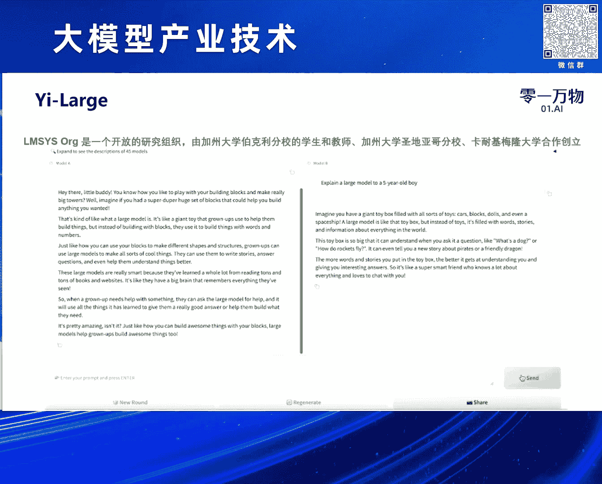
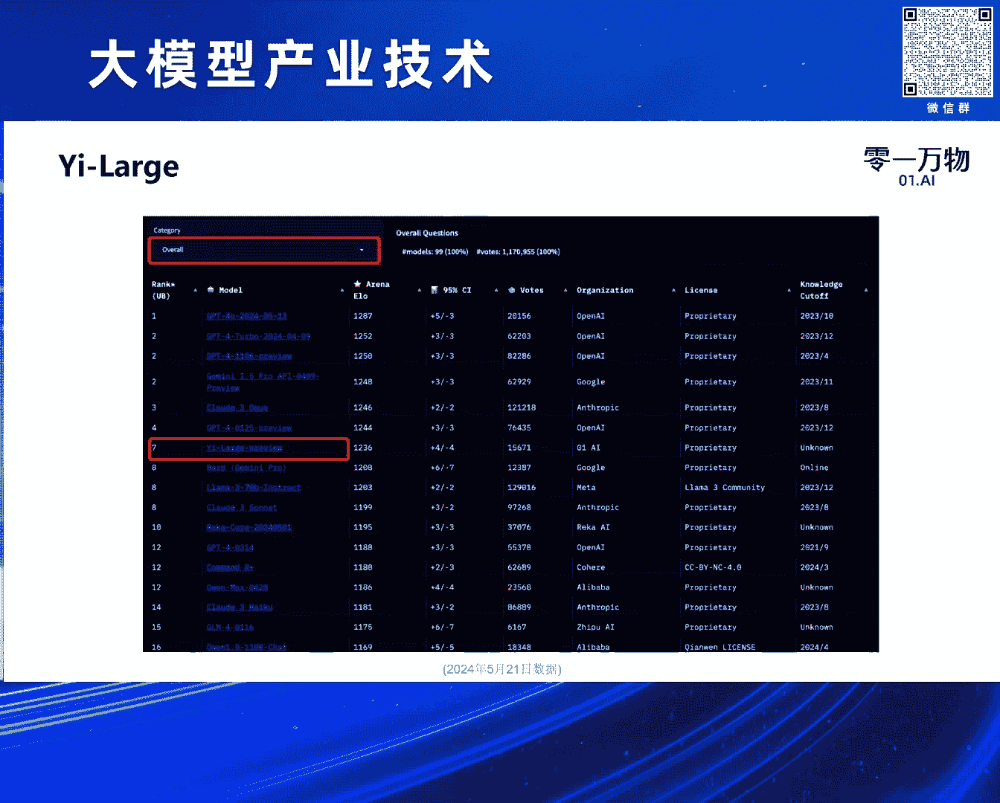
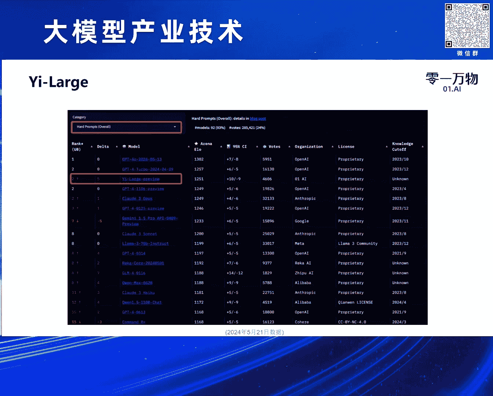
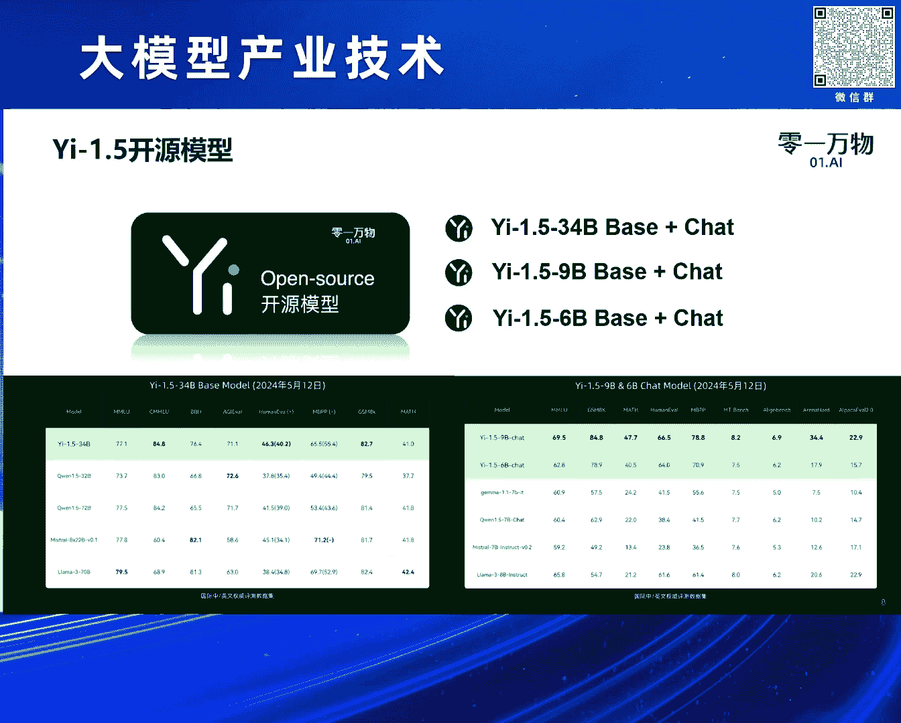
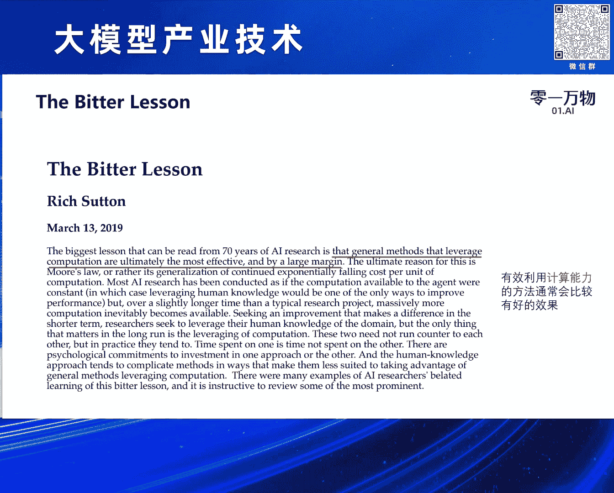
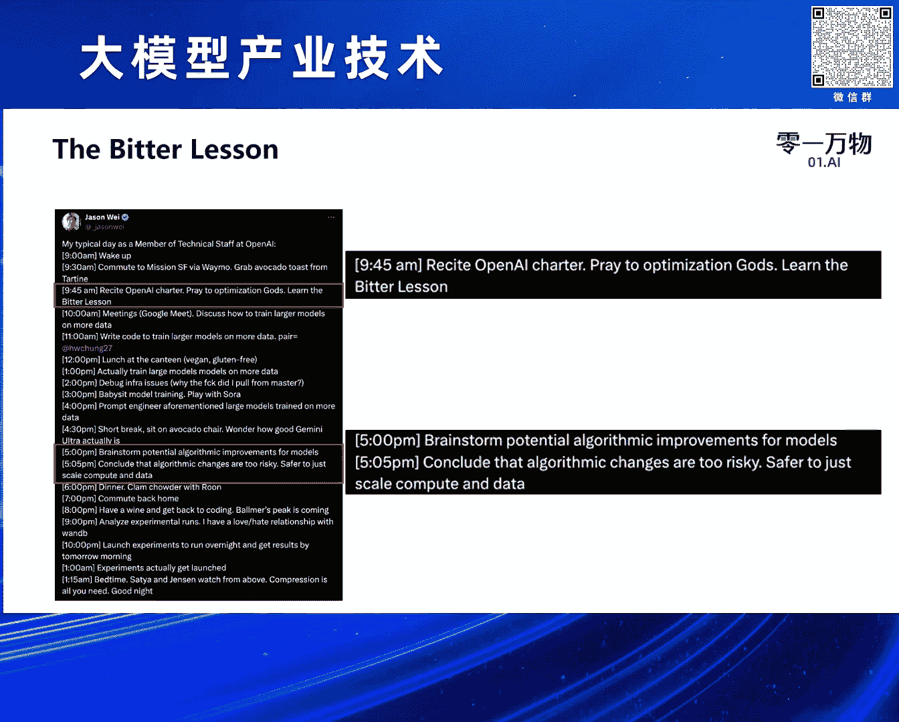
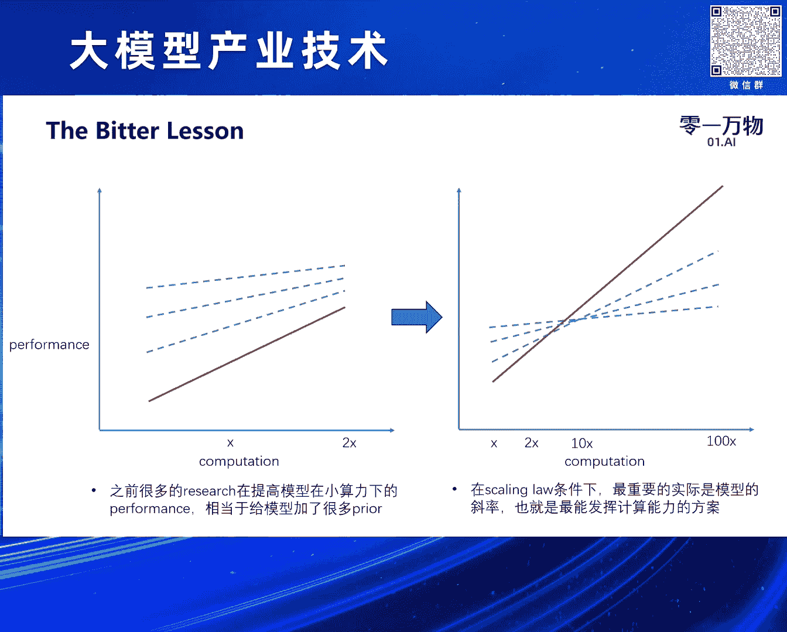
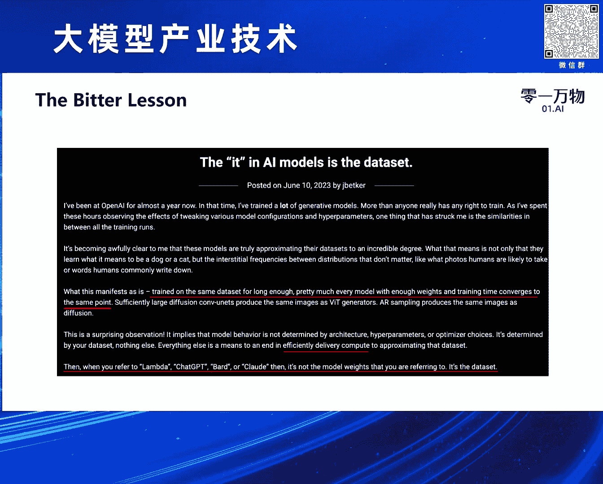

# 2024北京智源大会-大模型产业技术 - P4：大模型训练方法论及Yi-Large的实践：黄文灏 - 智源社区 - BV1HM4m1U7bM

謝謝仲遠的介紹和邀請，我簡單自我介紹一下，我叫黃浩，然後現在在01萬物，主要負責預訓練的部分，就包括Language Model，就是語言模型和多模態模型的預訓練，OK 然後我可以先介紹一下。

就是我們在上個月發布的E-Large模型，然後這個其實是我們上一代的一個模型，然後它是一個千億以上的一個籌募模型，當時發布的時候其實可以看到，在很多指標上都已經接近或者超過了，GbE4 然後Cloud。

Gemini這些就是海外的第一梯隊的模型，然後我們其實還有一個更大的一個MoE的，EX-Large模型在訓練當中，這個應該是當時發布的時候的一個分數，現在其實比當時還是，就又訓練了一段時間。

還是會有小幅的提升，但這過程當中，其實因為這些數據主要還是，我去收集和自己去做一些評測的，然後我們也發現了一些問題，就是發現大家的公開的評測數據，其實是會有很大的bias。

一個是我發現對點這個問題很難對，就是大家比如說拉瑪森他報的點，我用了各種評測的框架其實都對不上，然後我們最後選的都是，他們當時自己報的一個成績，但我們從來沒有測出過這麼高的成績。

對然後包括GP4和Cloud的那些API也是一樣的，這裡面其實會有很多問題，然後第二時間題目其實都會，相對來說是一些靜態題目，大家可能會用一些，就是在這個領域去構造一些數據來。

做一些對這些領域的定向增強，然後同時我們在發布這個模型的時候，提出了一個就是模型和應用要一體化的，概念所以我們想找一個和我們應用場景，更加接近的一個評測數據值，然後我們也發現就是OpenAI和。

Google還有Cloud大家都比較認可的一個評測值，叫LMSIS然後它是這裡是一個簡單的演示，就是用戶會提一個問題，然後這個問題是用戶隨機提的，所以就不存在任何就是題目洩漏的一個問題。

然後在後台就是LMSIS的那個主辦方，他們隨機選兩個模型然後生成兩個答案，這時候用戶去做一個選擇就是哪個答案好，在做選擇之前其實他們也不知道，就是A和B是哪個模型，有點像我們自己在產品裡面會做一些就是。

A/B測試這樣的一個感覺吧，但是它是一個完全的一個盲測，然後我們覺得這個就比如說，這裡面用戶題目的分佈和用戶實際使用，就是ChairGP類的ChairBot的分佈是更加接近的。

然後這樣的評測也會更加的公平和客觀，然後國際的DT隊的廠商其實也在使用這個，LMSIS作為一個評測的一個榜單吧，然後我們提交完以後應該是，差不多就我們發佈完一周左右的時間，就發佈那天LMSIS才可以測。

就他們還是有一個比較嚴謹的一個流程，然後一周左右出了我們的成績，然後我們成績差不多是在世界第一DT隊，然後在我們前面的只有，就是OpenAI Anthropic和Google的模型。

然後這裡看到的是第七，其實因為OpenAI他們提交了四個模型在上面，然後進步的話裡面其實還有關於中文的一個排行榜。

然後我們和GP4是並列第一的一個能力。

然後還有一個就是，他們叫Hard Prompt，就是因為Prompt裡面，用戶有些問題會比如說你好啊，今天星期幾這種比較簡單的問題，也有些稍微複雜的問題，所以他們對這個問題做了一個分類。

因為在簡單問題的時候，大家基本上會選一個打平的選項，所以這個分數會有些bias，然後在這個複雜的排行榜上，我們基本上也是處於全球第二的一個水平吧，然後這讓我們對自己的模型會比較有信心。

然後我們自己在海外的一些產品當中，其實也做了一些就是AB的測試，其實會發現用我們的模型，比如說和GP3。5做比較的時候，用戶的留存然後付費都是有比較大的一個提升，然後和GP4做比較的時候基本上是打平。

就因為數據不會掉，其實這個給了我們比較大的信心，說我們這個模型其實訓練的還是挺不錯的。

除了這個BM模型，其實015000也做了很多開源模型的工作，這是去年11月份我們做了34B模型，當時在Hackenface的LM leaderboard上。

也排在就是全球第一的水平，然後今年上個月我們其實也對這個開源模型，進行了一系列的更新，發布了1。5系列的一些模型，然後這些模型都是開源的，這裡面其實發現就是，因為我們當時做34B模型的時候。

是特地選擇了一個對用戶來說相對比較友好的尺寸，就是34B模型做完量化以後，是可以在一張4090卡裡面去放假的，然後我們就方便了很多用戶去做SFT。

然後以及去做一些Parameter Engineering，然後當時受到了就是國外的很多開發者的好評和反饋，然後有很多人就跟我們做聯繫，聯繫我們然後也基於我們的模型，其實做了很多的版本。

比如說比較有名的有，就是NAS Research他們做的OpenHERMS模型，其實很多多麼太模型的後面的語言模型，都是用的這個就是E的模型作為一個基地的，然後今天主要是跟大家分享一下。

我們在做預訓練的過程當中，主要堅持的一些就是我們稱為方法論吧，然後分別包括，就是Skin law，The best lesson，就是苦思的教訓，然後高質量數據系統工程。

還有對人才的一些判斷，前面那一頁可能不知道為什麼會有些亂，就是它其實是對Skin law的一個定義吧，然後這個大概是模型輸出的一個結果，然後我可以大概說一下就是。

因為大家其實現在很多人都在談論Skin law，包括上午的就是論壇裡面，就中研的論壇裡面，大家也討論很多Skin law的問題，然後也有人去質疑Skin law能不能通向AGI這個事情。

我覺得首先我們需要對Skin law有一個基本的定義，其實它是表示就是模型的性能和資源之間的一個關係，那這個關係其實很簡單，就是資源越大就會資源越多，模型的性能就會越好，所以從這個層面上來看。

我們覺得Skin law是沒有問題的，然後我們其實比較好奇的是Skin law能不能通向AGI，然後我們可以看一下過去幾年的一個表現吧，就是這裡面的重中軸應該就是數據，然後它是一個指數級的一個算力。

就是一個指數級的增長吧，就訓練模型所需要用的FLOPs，然後右邊其實代表了不同階段模型的一個能力吧，比如說GP2，大家會認為它是一個學前兒童的能力，然後GP3是個小學兒童的能力。

然後GP4可能是一個高中生的一個能力，然後未來我們可能，就是模型是可以自動的去做AI的research和engineer的，但大家怎麼看就是這個能力，它是線性的還是指數級的。

如果大家覺得這個能力是線性的話，那就是說隨著資源的指數消耗，模型能力可以做到線性的增長，如果覺得這是指數級的提升，那就是兩邊其實就是一個線性關係了，然後右邊其實給了很多，就是大家在評測級上的一些表現。

就每個模型剛出來的時候，其實可能就最低的一個點，然後隨著就是訓練用的算力的增加，大多數的能力都會有了一個很大的一個飛躍，前面我介紹其實廣義的scaling law。

然後其實還有比較狹義的scaling law的定義吧，我覺得這個可能就是做技術的同學會相對來說覺得更能接受一些，這個其實是來自於openAI的一篇paper。

就是關於scaling law for neural language models，這也可以注意一下它的一座就是Jarl Caplan，他是一個物理，他是研究物理的。

就是像scaling law這個公式，後面會講他的一些公式，就是其實和物理會非常像，比如說跟我們常見的萬有引力定律的一些公式會非常像，然後做物理的人是會把這些很驚艷的或者系統性的實驗，然後進行一些建模。

然後把它做一些提高的，然後這裡面其實我劃了一些重點，就是說首先它是一個驚艷性的公式，就它不是一個嚴格的有數學證明的公式，只是我們有了大量的實驗結果以後，可以發現用一個很簡單的方程式來把它就是表示起來。

然後這個公式還非常的work，然後它有很多作用，這裡講了一個作用是可以去計算最優化的資源的分配，就是如果我們給定一個算力的一個budget，就是你有多少算力可以使用，那我們應該怎麼去分配數據。

怎麼去分配那個模型的參數，然後這篇paper其實有大量的一個數學公式，然後如果這裡我選了一個最重要的公式，應該是論文中的公式1。5，對它其實是這樣的一個表示形式，然後這個L是表示模型的loss。

然後loss越低就是模型的越強，這是一個就是線性關係，然後這個N是模型的參數量，對模型的參數量，D是模型訓練使用的數據大小，然後剩下的就代繳標的全都是常數，也就是我們用大量的。

比如說大家之前會從比如說100萬參數的模型，一直訓練到1000萬參數，或者稍微大一點，就是5000萬參數的模型，然後通過這些很小的模型的訓練，我就可以去預測大模型的表現會是什麼樣子的。

然後通過前面的很多打點，就把這些常數給擬合出來，擬合出來以後，根據我們現在想訓練模型的大小，和模型的參數，我就可以預測這個模型的loss，大概會訓練到什麼程度，那這公式有哪些重要的意義呢。

第一個就是我前面說的廣義的skill law，就是我們可以發現，就是因為這個N和D都在分母的，分母越大然後這項就越小，所以這個loss就會越低，所以它就代表數據越多，模型的能力越強，然後參數越多。

模型能力越強，然後這個是很顯然的一個廣義的skill law，第二就是前面介紹了，就給定compute，就給定的算力條件下，最優的setting是什麼樣子的，就是我們應該train一個多大的模型。

用多少的數據，然後因為就是算力其實是等於6ND，就是一個簡單的計算公式，是6倍的參數量乘以一個數據量，就會大概估計模型訓練的flops，所以我們可以判斷在這個條件下，數據和參數的收益是什麼，是怎樣的。

然後第三個其實是，這公式有很多的可擴展性，就是說我們會發現，我們在很小的模型上做訓練以後，我就可以去預測，比如說大100倍的模型，它的loss表現大概會是什麼樣的，這樣可以節省我們大量的算力。

我們在很多研究都可以在小模型上面做，然後我們用小模型去理和這個skill law公式，我就可以預測模型變大以後的效果，同樣對很多對模型結構的改變，都可以基於這個公式去做，然後這裡主要介紹一下。

就是最優的setting大概是什麼意思，就是比如說我們選定了，我的算力大概只有6億18次，這樣的一個flops，然後它的橫軸是模型的參數，因為前面介紹了就是，算力數據還有參數之間的公式，就是c=6nd。

然後確定了算力和模型的大小以後，我就可以知道這個數據是多少，然後在這個配比下就可以得到一個，就是一個曲面，就是不同的setting下面，哪個模型的效果會更好，這樣最優的可能這個點是最優的。

然後這樣我們可以得到，不同算力下它最優的點，這個其實是對我們選擇模型的參數量，和數據是有很大的指導意義的，然後其實有很多人在質疑，以前skill law的問題，比如說拉瑪三，秤了15T的數據。

已經遠遠超過了這個最優值，但它模型效果還是很好，其實因為它給定的是一個，給定算力條件之下的一個限制，然後我們也可以分析一下這個問題，就是如果我給定模型的參數，就類似於拉瑪三做的，這是1B。

假設這是8B的一個點，那我給的算力越多，就代表給的數據越多，所以它是一直可以提升的，就並不是說，我確定了最優的參數以後，我的數據就不可以提升了，但當然我們回到前面的這個公式，也可以發現。

這個提升收益肯定是有限的，就這項隨著地變得越來越大，就模型用的數據越來越大，這項其實會趨向越來越小，所以大家可以估計到，比如說用10T的數據和用15T的數據，我大概能帶來的Loss增益是多少。

其實這些都是可以提前估計出來的，然後再講一下Loss的可預測性，這兩張圖是來自於OpenAI的GP4的Tech report裡面，就是我在用很小的算力的情況下，那可以看到這裡的橫軸。

其實是在用很小的算力的情況下，那可以看到這裡的橫軸，其實是在用很小的算力的情況下，那可以看到這裡的橫軸，其實是在用很小的算力的情況下，那可以看到這裡的橫軸，其實是一個指數級的增長。

所以我可以用10倍以下的參數，然後訓練很多模型，然後對模型在某一個能力上的Loss進行一些打點，然後做完打點以後，它就可以擬合出一個曲線，然後我訓練就兩個數量級，就100倍以上的一個模型。

然後它可以精確地預測模型的表現，其實用的就是前面那個公式，其實在我們自己訓練大部分模型，其實在我們自己訓練大部分模型，當中我們花了很長的時間，去把這套Skinload系統建立起來。

這樣我們的所有大模型的訓練，其實是比較絲滑過度的，然後這裡還會有些衍生出來非常有趣的事情，就比如說大家會討論，就最近討論很多的，比如說Transformer結構會不會被Member結構。

Griffin結構這種結構給替代掉，其實你回到這個公式，大家可以自己去做一些實驗，就是把這個數據和模型參數量固定下來以後，我們只要train很小的模型，train一些模型以後。

就可以去擬合一下這個Skinload的一個公式，然後就可以得到這些係數，這些係數如果越小，應該是越大，因為這項會小於一嘛，這些係數越大這項就會越小，然後就證明這個模型的可擴展性其實是更好的。

那這樣其實是很容易去比較出，這些模型結構，在什麼樣的setting下，它會有更好的一個表現，然後，這個方法其實同樣適用於，我們對Transformer結構做一些改變的時候，就比如說，我們常見的有。

就是pre-norm，就是在每一層之前去做normalization，和post-norm，在後面做normalization，然後這個其實我們去做一些setting和Skinload擬合。

就可以知道在什麼樣的條件下，哪一種norm方式更好，最近像DeepSeq，他們提了MLA的一些方法，然後我們要比較不同的，attention機制比如說Multi-head attention。

Multi-curve attention，Group-curve attention，和MLA的時候其實，也可以用這樣的參數去，比較給定算力下的一些，訓練loss的一些變化，這樣其實對我們去做一些。

模型結構的改變是有很大的，一個指導意義的，然後第二點，是the best lesson，這其實是來自，Rich Sarton的一個Tech blog，這裡寫了很多，用中文很簡單講。

能夠有效利用計算能力的，方法，通常會有比較好的結果，然後這個其實跟Skinload，是相符的，這兩個其實是要聯合起來看的，也就是說，我們其實優化的，就是對computation的一個。

使用的能力，然後computation也是Skinload裡面最重要的一個部分，這Bit lesson有很多人在看，這個是Jason Wei，在OpenEye的一個researcher，在推特上發的。

他的每天工作時間，然後可以發現他，這裡面有兩個非常有意思的點，比如說早上，他每天都會學Bit lesson，我跟他們內部的人聊，他們說要反復閱讀並背誦Bit lesson，然後第二個點是。

他每天五點會跟大家討論，算法有什麼可以改變的，然後五點零五這項就結束了。

覺得算法的改變太risky了，大家應該去做。

就是計算和數據的Skill up，這裡。

就是學Bit lesson以後，我覺得它跟Skinload，結合起來看，就是說我們現在看問題的視角可能有些不一樣，因為我自己之前在MSI，也是做一些research工作。

我們會發現研究範式有了一個很大的變化，因為我們之前的研究，基本上是在算力條件，增長不是非常迅猛的，非常速度的情況下進行的，也就是說，算力條件可能每年增加一倍，然後在這種情況下的話，假設有一個方法。

它是這裡面的這條紅色的線，然後我們，做研究的人其實是在做，各種各樣的針對這個方法的優化，所以針對，這種方法優化會提高，這個方法的起點，然後這個起點做了提高以後，就可以得到不同的。

一些新的方法然後有很多新的paper，出來，在當時這個時代其實這種方法是很work的，但是到了現在這個時代，就是每年的算力可能是一個指數級的增加，就是比如說，每年算力增加十倍。

這時候起點已經沒有那麼重要了，這個方法的斜率才更加的重要，然後我們回過頭來看，我為了提高，這個方法的起點，我相當於給這個方法加了很多的，prior 就加了很多的先驗，就是做機學者。

其實會知道各種各樣的先驗，其實是會損害這個，方法的一個泛化能力的，所以它的斜率就會變低，那在這種情況下，其實大多數在，所以我們回過頭來看，之前的很多研究工作都在雕花，因為雕花就是說你在一個。

小的算力範圍之內，我不斷的提高它的模型能力的一個起點，但是到了一個更大的，尺度下去看的話，這些工作其實都變得沒有意義了，這裡其實，會引申出一個非常有趣的，討論就是我們去年，發布E3 4B模型的時候。

其實有很多人比如說我們的模型，漸漸拉瑪三的結構，然後還有人說我們抄襲了拉瑪三，然後我覺得，這裡面分幾個角度來討論吧，第一個是我們在開源的時候，做得不是非常規範 有些變量沒有做好，這個是我們做得不對。

但是大家如果說我們，借鑒了拉瑪三結構這個事情，如果說抄襲，這個就是無稽之談，然後就是說，借鑒拉瑪三結構其實我覺得，有些可以研究的事情，一個是拉瑪三的結構，這個事情就現在很多人說。

拉瑪Architecture 就是沒有拉瑪就沒有，中國的大模型 我覺得這個，我自己是完全反對這個觀點的，然後就是，拉瑪的paper裡面他對Architecture，的描述 他說他們是。

基於了Transformer的結構，然後只做了三個不一樣的地方，第一個是把傳統的Poson-Ohm，改成了Prenome，然後GP3就做了，第二是用了Swig-Glue。

然後就把軟路換成Swig-Glue，第三個是換成了Lope，所以有很多人說，就比如說這是Tei的一些Twitter，他說就，其實很多的改進都是Google提出來的，然後大家卻把它叫做一個。

拉瑪三的Architecture 這個是完全，沒有道理的 然後他們自己的Tech Report，也把它稱為了Norm Architecture，就是Norm其實是，裡面很多技術的發明人嘛。

其實我這裡想說的是 一個就是說，從Transformer，17年提出到拉瑪，應該是去年提出，很多年的時間其實模型的結構，並沒有太大的變化 一共大家也可以，看到只有這三個變化 所以說，我們用最簡單的方法。

只要去Scale up這個，Computation就可以了 然後，第二就是如果我們自己做訓練的時候，其實這三個改變，都是有損害的 就是，我前面講了，就我發現很多公司在做。

模型Scale up的過程當中會發現，他們Follow拉瑪的結構，並不能很好的Scale up，就是拉瑪比如說做到70幣還好，你做一個200幣300幣的模型，其實是會碰到很多的瓶頸的。

就是他做的這些改變，並不是都是有效的，他在不同的算力條件下，其實是有不一樣的點，我們可以分享一下 比如說我們做了很多實驗，發現當模型參數，超過千億以後 用Post Norm，可能會比Prenorm更好。

只是你要把它調得更穩定，然後第二就是，Groove比Raloo收斂性快，但是它的計算能力，計算所花的時間是更長的，所以我們用海量的算力的時候，其實是要去平衡，這個它帶來的額外的，訓練的，時間和。

帶來的快速收斂之間的一個，Trade off，Lope也是 Lope其實現在會站到，Transformer或者，GPT系列模型訓練，大概10%左右的時間，那在很大的，算力條件下 是不是不用Lope。

可能我可以節省10%的時間，我可以把收斂的時間換回來，這個是需要大家去做很多的，實驗驗證的，做實驗可以用Scaling for Load，的方法去做一些驗證，這個是OPI，裡面一個員工寫的一個。

Blog 我覺得非常有意思，可以分享給大家，一個是說我們在一個，相關的數據集上，訓練足夠長的時間，假設我們的算力是無限的，所有模型都會收斂在一個點，就不管它是Transformer，即使是CNN。

它可能也會收斂在一個點，那這裡面其實，區別是什麼呢，區別就是哪個模型可以更快的收斂到那個點，或者更快的接近那個收斂的點，其實這裡，有價值的其實就是，對算力的有效使用效率，然後它還提出一個觀點。

就是說如果所有的模型，在同樣的數據集上，就不同的模型，架構的模型在同樣的數據集上，訓練都會收斂在一個點，然後我們假設現在大家發布的，這些模型都是收斂的，情況下，那其實決定模型的能力的其實就是數據，所以。

每個模型它不代表，自己的模型架構，也不代表自己的，訓練過程，只代表了它原始數據的質量，這就引申了我下面。

一個要討論的點，就是說高質量的數據是在這裡面最重要的，然後這裡面是杰勒，的，Tech report裡面的，兩張圖片，我們有一個比較複雜的一個數據處理的流程，其實這個，基本上大家都很重視數據。

應該也都有這樣的數據處理流程，我可以分享一下，我們在開幕之後前三個月其實沒有讓團隊訓練模型，基本上，我們只訓很小很小的模型，去建立SKIN-LORE，剩下所有的時間都是在做數據這個事情，然後到九月份。

以後我們的數據，比較ready的情況下我們去訓練模型就會，非常的順利，所以我們每個模型基本上都是一次訓練出來的，然後在同等參數下都可以比，其他有效訓練好，就是這個數據質量是非常重要的一個工作。

然後聊到數據質量，其實大家也會經常問的一個問題，就是說數據會不會用盡，這個其實是之前一篇paper裡面的圖，就是說假設數據是一個線性增長的狀態，我們現在對數據的消耗，其實超過了這個數據的一個斜率的。

在這裡我可以分享一些，我對這個問題的一些觀點，就是這個，更多的是個人觀點，第一就是，我們發現數據增長的速度，是比預期的要快的，特別是很多原模型出來了以後，網絡上有很多原模型，生成的一些數據。

然後這個數據的質量，我們去處理就是每年不同的那個，就我們拿common cloud來舉例子的話，其實是有大量的增加的，然後第二個就是合成數據，其實現在很，剛才謝建也提到了很多關於合成數據的研究工作。

然後我們自己其實也做了，大量合成數據的工作，驗證了合成數據的一個有效性，這裡我其實截了一個FANWEB，他們對數據分析的一個圖，他們發現用24年的數據，去訓練原模型，它效果就比23年要好，然後這個原因。

就是他們分析一下，發現因為現在的數據裡面，已經有大量是原模型生成的數據了，這GPS生成的數據，這就導致我們，把所有的網上數據都拿下來以後，我在訓練的時候效果就是會好，這從側面驗證了。

我們用模型產生的數據去訓練模型，這個是可以讓模型，就不停地去做一個提高的，第三個是我個人覺得，最近比較有趣的一個Finding，就是我們在做多麼太，預訓練的時候，發現用多麼太的數據。

是可以提高模型的智能的，所以做多麼太不是擴展了原模型的一個能力，而是真正的能提高原模型的智能，然後這裡面也有些很有趣的研究工作，然後這個研究工作其實是，非常理論的一個工作，就是我們在做多麼太。

我們在做多麼太，其實是非常理論的一個工作，然後伊莉亞也對離開OpenAI以後，也對這個工作做了一個點贊，它的其實含義，簡單來說就是，假設這裡有個Z這個數據，你不管是用語言描述它，還是用圖像記錄它。

當你做多麼太模型訓練了以後，這兩個數據的表徵，是會，越來越，趨向於收斂到同一個表徵空間，也就是說他們在做壓縮的時候，是會壓縮到同一個點的，然後如果有了這樣的理論基礎的話，就是我們可以認為。

多麼太的數據是完整擴展了，語言模型的數據的一個缺口，語言模型的數據的一個缺口，語言模型的數據的一個缺口，那我們未來就有大量的數據可以使用，好我看快超時了，後面兩頁稍微快一些，就是第四個點。

其實要分享的是大模型其實是一個，極致的系統工程，就是去年XGB剛出來的時候，大家很擔心的事情，是比如說國內有沒有，相應的算法人才啊，比如說OpenAI Google研究了這麼久。

大家之前其實沒有怎麼訓練過大模型，然後實際做的時候，會發現，這裡面其實對研究的需求，其實沒有對系統的需求大，就是包括前面的數據清洗，然後訓練過程中的一些，就是訓練的Dynamics。

其實都是一些非常細致的，一個系統工程，我們需要把系統工程當中的每一環做好，然後每個細節都摳得很細，自然就會有比較好的一個成績，然後第二個是說，就大規模的機器學習，其實是一種實驗科學，就很多人想。

就是在質疑，比如說deep learning是沒有數學解釋的，但是其實OpenAI在一開始，就有這樣的認知，就是說大規模的機器學習，是實驗科學，我只有通過大量不停地做實驗。

然後用實驗的數據去得到一些近似的，數學的一些表示，然後這個過程其實和前面提到，和實驗物理是非常接近的，就是我們通過大量的實驗，消耗了大量的算力，得到了大量的結論，然後去推動智能的一個發展。

然後第三個就是，因為它是一個系統工程，所以我們需要，就是又懂算法，然後又懂info，又懂工程的這種複合型人才，就是之前國內人才，可能他在單一方面都會做得很強，但是做到一些，比較複合的事情的時候。

是會有些困難的，然後所以我們，比如說我們對團隊的要求是，要懂算法 要寫庫達的科諾，對 然後最後回到人才，就是這段時間，大家經常有爭論的一個點，我覺得中美的人才差距其實非常小。

就美國有一部分非常top的人，OPI可能有一些 XAI會有一些，但是他們只是因為，過去有了比較好的經驗，在做這個事情，但是國內的就是聰明的人是完全不比美國少，然後大家現在很重視大模型。

投入了比較多的算力，所以，現在有很多的人，都非常的強，就是我覺得就一點都不比，就是頭部的那些機構的人才差，然後裡面有很多，非常年輕的，New Fresh Ph。D，他們展現出了非常強的一些潛能。

然後第二個就是說，這些人才需要是算法，工程一體的，過去這種比如說算法很好，但我不太會寫代碼，我不懂Infer，我不知道怎麼能把一個高效訓練算法調得更高效，這可能是不work的，如果這方面都是懂的話。

這樣的複合性人才，可以發揮很大的作用，第三個其實是，我們給自己的一個要求，其實我的團隊，一直都只有十多個人，因為我們要求每個人的人均GPU，要超過一千張，如果公司的GPU，沒有再往上擴展到兩萬張。

就不要找人，只有在這種情況，當然這一千可能拍得有點隨意，但我是覺得，每個人需要有大量的卡，如果，比如我們可以定500，可以定200，但是每個人如果沒有，大量的卡可以玩，你招人其實都是副作用。

然後只會讓大家去搶卡，最後就是，我們會很堅持招非常年輕的，我前面講了很多New Fresh Ph。D，因為他們，最近大家一直在討論AI native，他們從做research開始。

他們接觸的第一個research，就是大猿模型，不像我們這一輩的人，就是之前可能，我可能還比較好，我做博士的時候，在第一年就看到了deep learning，然後完全就決定。

all in去做deep learning，但是當時不是從scale up的角度去看問題的，就相當於我前面講的，我們在做很多提高方法起點的事情，但沒有去重視這個協力，而現在很多人，他們從一開始的視角。

就是去重視方法的協力和scale ability，這個其實非常重要，分享就到這，謝謝大家。

對，好 非常謝謝文浩，非常有inside的分享，因為時間比較緊張，我們現場看有哪位朋友想提問的，我們一個問題吧，那位穿黑衣服的同學，我現在是在，在做一個，我可能問幾個問題。

第一個是關於scale up的範圍這個事情，從您的角度來看，這種scale up的範圍，如果到兩年之後，比如說現在是200k，可能未來是500k，兩年之後scale up的範圍大概是多少呢。

從您的角度來看，我覺得，scale up的範圍是吧，對 scale up就是，輸入的文本長度，長度的範圍，哦你說長度的範圍，我覺得長窗口這個事情，現在已經是一個，被業界解決的問題。

只要解決算力問題就可以了，在技術上基本上已經解決了，我們有一些paper就說怎麼去做長窗口，長窗口問題，所以它只是個算力問題，但不是個技術問題，所以你認為它是會無限擴展下去嗎，對 理論上是可以無限擴展。

就是它的增長其實跟你的算力是有限的，是直接一個正相關的關係，就是你現在有多少的算力，你就可以做多少樣窗口，哦好的好的，第二個問題是關於一個數據類型，就是我們看到在去訓很多這個模型的時候。

其實比如說我們會用，IP8這種混合進度的訓練，像英偉達也推出了他的，FP4和FP6，對於這兩個進度你是怎麼看的，你現在會用嗎，因為就是現在的H100其實還沒有，這方面的。

就是我們現在應該沒有拿到可以支持FP4和FP6的，一些機器吧，但是我們在做一賴的時候是完全用FP8訓練，就是你只要解決工程問題，之前提高效率的方法都是work的，好的好的，我多問最後一個問題啊。

不好意思，就是我們現在看到所有的語言模型能力，其實最後都會比較趨同，對吧，就單純用語言來說，那國內這些大模型廠商，你覺得就是互相之間競爭的差異化會在什麼地方，對 我覺得，其實，模型能力比較趨同。

我並不100%反映，因為我也玩各個廠商的模型，我覺得大家的，還是有自己的特點的，就回到前面說的那句話，大家用的訓練數據肯定不是100%一樣的，肯定有overlap，但是每家會有一些自己側重的數據。

然後比如說我們會更側重，globalize的一些數據，就是會放很多其他國家的語言的數據進去，有些廠商可能側重於娛樂，有些側重於醫療，所以每個模型能表現出來的能力，也是會有差異的，然後第二就是。

我覺得大家商業模式可能也不完全一樣，就是每家其實基本上都是有自己的一些商業模式吧，所以漸漸可能也會有些分化，好 謝謝，好 謝謝文浩，字幕：Tina Liu，好 謝謝 好 謝謝文豪。

