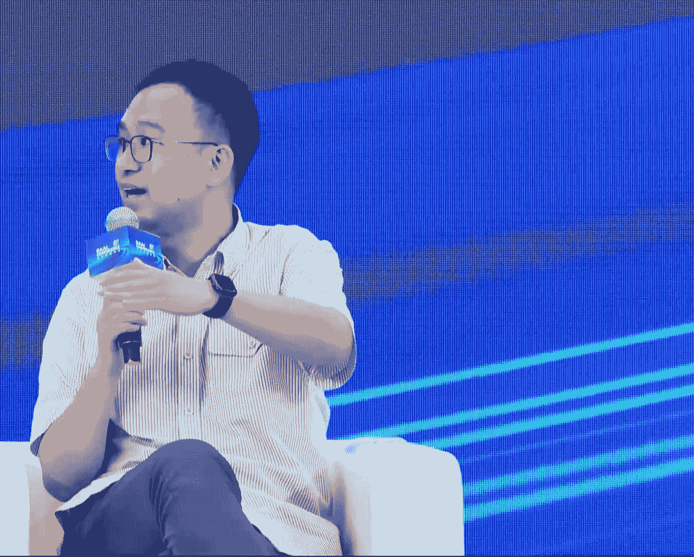
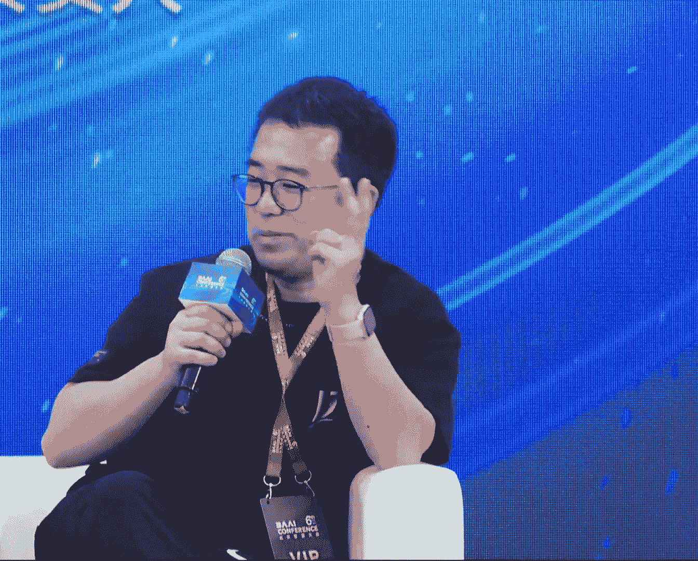

# 2024北京智源大会-大模型产业技术 - P7：圆桌讨论：主持人：张一甲-嘉宾：颜水成-谢剑-黄文灏-万鹏飞 - 智源社区 - BV1HM4m1U7bM

好的 谢谢 谢谢院长，也请刚才院长提到的几位嘉宾来到我们台上按照屏幕顺序就座，告诉大家一个好消息，就各位观众看到最后一排也站了好几排，我刚才也是穿越层层人海才找到位置，刚才院长跟我嘱咐了几个核心概念。

因为我也比较好奇，我很少去主持一个圆桌是不限主题，没有提纲 没有手卡，而且院长跟我说，啥都能讲，然后随便发挥，时间都好，完全不着急，因为我们是今天的最后一个环节，然后我就冒昧地问了一下院长。

我说我最后我想几点结束就几点结束，院长说你想几点结束就几点结束，而且我决定在今天的后半部分把时间留给现场观众，大家想怎么聊我们就怎么聊，中间如果实在不行的话，也欢迎大家直接举手好不好，好。

我自己是甲子光年的创始人张英甲，然后也一直是这个行业里面的一个第三方的角色，然后我们今天的配置也非常有意思，有大厂 然后有创业公司，然后有学院派做技术的，还有产业派。

所以首先还是把发言的权利给到几位嘉宾，大家我的第一个问题是，听了今天的所有的分享，大家有没有什么新的收获，是都在预期中还是有些预期外，都认同还是有非共识，我们按照我们的顺序来，9分号。

对我觉得大部分的观点，我觉得基本上行业也形成一个共识了吧，就是比如说大家对skin law，然后对数据的一些观点，所以我觉得基本上还是在比较认同，就比较共识的一个状态，明白，对我基本上也是赞同文昊的。

如果从观点上来看，我觉得大家其实还是蛮共识的，但我可能都分享一下感受，就是如果说去年的时候，整个国内的整个在大模型上的技术生态，我感觉还没有那么大，没有那么多的话，今年其实参加这个会。

我觉得还是就感受比较深，其实今年我们在很多的技术上，其实都做得很好了，其实理解，来水城师兄，我其实miss掉前面一部分了，但是从后面几个通话来看的话，我觉得有个共同的特点，就是说大家都没有真正的去触及。

就是说里面最关键，最隐秘，最有价值的部分，但是都是讲自己的话，有什么样的能力，但是我觉得如果从今年快手的，presentation来说的话，他的能做到当前结果的话，那绝对不只是在屏幕上所展示的。

这些信息，应该有很多的，就是不便于去分享的技术和创新，所以说从这个角度来说的话，我觉得其实应该来说的话，就是说在过去这半年多的时间的话，我觉得其实还是在技术维度上，还是有很多的创新和进展，对明白。

水城其实是我的本科的第一系师兄，我们都是北大书院的，然后我邀请师兄跟我扮演一个co-host，等会儿如果你要是觉得大家没说真话，你就直接提问，或者打断，然后可能在这也是我年龄最大，所以我可以没有关系。

对我对，然后我们就一起，然后你要是有话不说的直接，我就给你翻译，万总，严老师点评我压力很大，不过确实我觉得我们在做视频生成这个topic的时候，还是面临一些挑战，在这块领域的话。

相对来说不是那么的open，然后其实中间掏了还是很多坑，然后整个这个事情做下来，大大小小的一些创新点还是是有的，所以但一些大的一些方向上，我今天听下来的话，我觉得大家的普遍认知还是比较一致和趋同的。

因为我有一个印象比较深刻，就感觉今天还关注的还挺高的，挺多同学在站在门外，你从今天开始可能就要一直习惯这件事情，说明整个这个事情大模型，这AI这个事情受到了越来越多关注，这是一个很好的基础。

随着各行各业，然后各个角色的，然后人力和资源投进来，我相信我们是可以做得越来越好的，好的，我这样我先把话题从今天下午的话题拉出来，我们先聊一个他山之石，我们再来看一看今天各自的真实观点。

大家都知道最近有一个公司其实挺火的是苹果，然后我是全程看了他的发布会，我相信大家多多少少也都会关注到苹果的进展，自从他几个月前停止官宣放弃了造车计划，然后几乎是全情投入人工智能主方向之后。

我们都期待那个moment，就是说苹果会拿出一个什么样的东西，因为这个东西是无论在座的各位是不是做技术从业者，我们大家都会期待的说，他真正AI步入我生活的那一瞬间，他的横截面是什么样子。

当然苹果的整个维系几天的讨论里面，也包括技术的路线，也包括他端测模型只有非常非常小的，然后这样一个路径，然后包括Siri跟OpenAI的结合，包括数据层面明确提到了合成数据的微调。

然后包括很多很多从技术到产品理念，到用户反馈，到市值反馈一系列的关注点，我们扣鸡一点回声撕面，首先问大家对这件事情怎么看，哪些事情你觉得是跟你们心中的某些事情契合，哪些事情是你有想法说不同的意见。

我们换一个 来 彭飞，转过来了，我觉得首先说一下苹果这家公司，就是跟我之前做的很多事情都是非常多非常大的关系，所以我还是非常尊重这家公司的，我之前我在快手也做XR这个方向，一些互动 多么的一些互动。

然后也包括说苹果这次出的一些端测的模型，其实我过去几年也做了很多，就是把AI的能力然后上到移动端上，让几亿的快手用户都能够用起来，然后做了这样一些事情，所以比较有体感的一点是说，他推出了一个3B的模型。

这个3B模型可以在他的应该是iPhone 15，8B的内存下然后去运行，而且是云端模型是私有云计算，端测只有三个B对吧，对对对，所以这个事情其实是很好的，就因为很多的应用场景的话。

它确实不需要非常非常大参数量的模型，包括说像现在的小模型如果经过更多的数据，是吧，有程序拉slow，然后能够展现出来一个比较好的性质，而且它有很好的一点就是，他把成本能够给这个问题给相应的给解决。

就是比如说这个模型跑到用户的手机上，那他不需要有部署庞大的服务器，来支撑这么一个服务，以及说它还有天然的一个隐私保护的这样一个性质，这些都是非常非常impressive的，从技术的角度。

我觉得就是一个3B模型，8B的一个机器上去，很好地去跑，然后这个模型表现也非常好，所以综合能力是非常强的，另外的话就是对于苹果这家公司来说，我觉得它展现出来，它提示了一个点，就是说生态位非常重要。

所以从这个角度出发的话，像苹果 像Adobe，像这些公司我都是非常看好，然后他们在AI领域的一些未来的应用的，理解，因为我相信只要谈到真正的user interface，苹果确实不太可忽视。

而快手的角色正好视觉生成互动，快手也是有这么个意思，就是说我们的视频里，天然有很多应用场景，这样的话，就是是有一个很好的生态的一个闭环，和应用的闭环的，这个也是很重要的，就是生态位这个点，对。

比如说我觉得现在很多包括我已经退休的父母，大家也都用AI产品，大家会觉得这个东西看起来很AI，用起来很AI，它就很AI了，所以它更重要的还是从交互视觉触感，然后第一瞬间的本能反应来去理解AI的。

我想问一下这个水城师兄，你怎么看这件事情，就是说其实我这次的话，我没有看他的那个直播，但看了后面有一些文字性的介绍，就是说其实我当初的话是有一个很强的期待的，就是因为什么。

就是说大家知道就是那个Vision Pro已经发布了，那么道理上来说的话，像最近出现的比如说像OpenAI的GP4O的话，再比如说像谷歌的这个原生多模态大模型的话。

那么其实在这个Vision Pro里面，应该是一个非常的原生的这样的应用，因为它有你看到的所有的内容，有你看到的所有听到的所有的内容，它可以当做是一个非常智能的一个assistant的话。

就可以帮助你做，这个你就可以想象出无穷无尽的这个场景出来，但是好像应该在发布会上应该没有讲到，没有讲到这个应用对不对，所以这地方有一点小小的失望，但是后来看到他们对于端测的话，这个就是的努力的话。

恰好我的一个当时在UIC的一个室友的话，他也是在也是去了苹果，然后在恰好在做相关的这一块，他做了一个分享，所以就是说这块我觉得还是非常让人觉得，就是一个路子是对的，因为就是说几个原因。

就是说我们也在思考，就是说比如说像原生多模态的大模型，那么这种如果真的要用的话，你不可能所有东西都全部都往云上去走的，那么你如果所有都往云上去走，因为可能收网络带宽，或者说收5G的速度。

或者说覆盖的各种原因的影响的话，可能它的体验并不是特别的好，那么必然就是有一部分的东西的话，它可能会有一个有一个那个gating一样的话，就是有一些他们是local，有些可能是就是相传到云端。

另外的话还有一些，我觉得肯定最后的话一定会有一个模式，说在一些特殊的场景的话，用这种端上的智能的时候，用AI的时候，我们还是希望它是能够privacy能够preserving，那么这时候的话肯定就是说。

希望所有东西都是local的处理，那么这时候的话，我觉得端上的这种智能的话是非常重要的，而且他们的模型的体量，和他们本身现在的苹果的手机所具备的，就是NPU相关的这种计算的能力的话。

应该是可以绰绰有余去应付的，所以我觉得这个的话，应该可能会成为未来的一个趋势，在国内的话，比如说像OPPO VIVO小米还有华为这些手机的话，肯定也会走同样的这种路线。

会越来越重视在端上的这种AI的能力的发挥，好吧，所以这点我觉得还挺值得期待的，对好，来自百川的谢总，对，我觉得我可以分享两点，第一个就是我觉得苹果是一如既往的，在产品的定义和用户心智上。

我觉得非常的成功，就是我的感受是它其实在，因为它后面在提Apple的Intelligence，核心其实是希望做Personal的Intelligence，所以它其实从一而终一直从端到。

尤其在云端上还用所谓的Privacy的这种Computer，其实核心想要贯穿的心智是说，这个智能只为你，而且就一方面是只为你，第二方面是真的很为你隐私考虑，因为大家其实如果说。

第一时间想到苹果和安卓两个的区别，就觉得苹果够安全，够Privacy for you，所以我觉得在产品的定义和心智的传达上，我觉得还是一如既往的非常成功，就这一点上我觉得还是打得非常穿的，但是第二个点。

我觉得从技术上来说，我其实跟杨老师有一点点稍微的一致的点，就我觉得还有一点点小的不够的地方，我觉得如果照Personal的Intelligence，尤其是Siri这么大的一个路口。

其实如果更好的应该是真的变成跟人一样的这种交互，但我觉得这次至少没有把类似这种Follow的，原生的这种Audio to Audio的这种模型在用上，所以当然一方面可能苹果内部。

就自己可能技术还没有做到，第二个如果跟OpenAI合作，我觉得这一part可能会有很多Privacy的问题，所以我觉得这一part是略我觉得还不够的地方，但我相信以苹果的这种体量和那个。

应该会很快会推出相应的技术了，对这可能是我分享的两点，再次补充一下我看发布会的现场细节，就是他到了AI Intelligence这一part，整个发布会的语速全部变快了。

然后我当时在想为什么一定要语速变这么快，是有太多卖点没有说清楚吗，我发现其实可能有一个原因是因为卖点太多，第二个原因是每当他说出他AI很厉害，他马上就会接但是很安全，然后再说下一个点这个还很厉害。

然后马上他会再接下一句说，但是我们还是用了很多关于Privacy的技术，换句话说我觉得苹果在整个对外的沟通当中，因为它是而且它是一个市值龙头，所以它必须要照顾到大众的心理安全感，自己心理安全感。

所以他每说左边刚说完我们很厉害，右边马上就说但我们很安全，是他一直在左右的螺旋当中去传递，他对AI生态和时代的理解，这个也是可能是他一贯的做法，比如说像手机里面一个典型的，比如说像折叠的手机都有点。

那么其他的手机厂商都已经推出了，但是我觉得可能苹果觉得就是说，无论从技术的完美性角度来说的话，还没有达到他们要求，所以他就暂时不发布，所以我觉得有可能原生多模态大模型，也是觉得还没有达到他期待的。

就是那种Perfect状态，所以他就Delay了这个发布，对好的东西值得等待，对，尤其我觉得端云和协同，其实本质上我觉得多模态，尤其是在交互这个层面，如果我来设想一下，如果真的苹果手里也有FOA的技术。

那它一定也是端云协同的一个技术，因为多模态的Interaction，这种实时交互的数据太隐私了，想想如果一直都在听你，你要是这样讲，我就很想插一个问题了，应该是在座的所有嘉宾里。

百川是唯一一个对多模态似乎不太感冒的，没有可能，这个一会我澄清一下，还是说你跟小川的观点不同，不是一同相同，好，等会我们再问这个问题，我们先听一下来自01万物的观点，或者来自你个人内心。

对我觉得可以从三个层面讲，首先是应用的层面，就是Apple的发布会，其实给大家看到了很多应用的可能性，然后其实我们其实也提出了，就是模型一体，就模型和应用要一块去做，其实应用是很重要的一个part。

然后第二从技术层面的话，其实我们之前就有个技术判断，就是我们先把模型做大，然后做大了以后它的能力会，这是一个符合scale and load的一个法则，然后模型能力会强，然后我们再想办法把模型能力做小。

就是我们现在差不多可以做到，比如说做到10倍或者100倍，10倍到100倍之间，的参数会少这么多，但是模型能力基本不掉，对 然后端测模型其实是说明了，这个技术路径其实是很重要的。

对 然后第三个从AGI的层面，我就相对会比较失望一点，就包括苹果的发布会和GP4O，我觉得这些模型都没有提高智能的上界，就我们自己有先评测，就GP4O其实在很多能力上比GP4是弱的，特别是复杂的能力上。

这个其实我觉得不是一个很好的signal，OK，丽姐 我刚才在直播间看了你的分享，我觉得非常精彩，其中也跟我们非常坦诚地分享了很多数据，比如说每一个人保证要有多少张卡，然后什么样的一个技术路线。

我希望各位嘉宾也可以多多给我们贡献一些干货，好 那我们接下来进入动模态这一派，首先还是谢总，最近其实动模态的更新频率比较高，包括Stable Diffusion的3，然后包括像Luma AI。

然后包括像Pica等等的很多进展，包括我在Pica和Luma AI，我是在3月份都面对面采访过，然后也看到大家有很多的一些新闻，包括像苹果快手，那就不用说了，简直就是原生动模态，所以在这件事情上。

还是没有影响到百川对这个事情的本质判断吗，百川的本质判断，我理解我不知道是不是误解，就是说语言才是智慧的皇冠，语言才是极致AGI的唯一可取之处，或者说不能叫唯一可取之处，总之它是智商的纲，攻克了语言。

所有的事情都在里面了，至于其他的都是分心，不是智慧的主轴，这句话你认同吗，对 我觉得首先第一，我觉得先需要把几个概念先分一下，第一 动模态不等于纹身图 纹身视频，如果我们这么来看，就是模态之间。

我们可能会有，假设我们在动模态上，大概也可以把它分成，understanding和generation，就是any to text，一定程度上在做理解，然后text to any在做生成。

所以这是第一个，我觉得动模态并不等于，纹身图和纹身视频，这是第一个，第二个就是百川内部，确实和小川也讨论过很多，就是我们一直的一个论，就是对未来的一个大的技术判断，我觉得是这样，语言是智能的中轴心。

它是不是主轴跟重轴心，有什么区别吗，那差不太多，OK继续，因为你刚才前面提到说511，511这个太过于，这个我把它扔掉，对 太过于严格了，其实我们内部在判断说，Sara这个点位上。

我们该以什么样的方式去投入，我觉得会有几个方面的思考，但我自己原先也是在想要不要做，到后面也做过一些思考，我问你一个小问题，如果Sara也好，任何一个多模特产品也好，如果它把语言都包在里面了。

我觉得是从要不我先表达完，就是从技术上来看的话，其实Sara从text to video，这个过程中，其实语言模型并没有在里面发挥，足够大的作用，如果我们去看整个技术的过程中，我觉得语言在这过程中。

中轴心不够大，那未来是什么，我们先说最后的未来，未来我们当然希望是any to any，但现在确实盖在一定程度上，有所乌云的是，any to text，大家都已经做，肯定有一个统一的backbone。

能scale能做到，不管是现在的Gemini也好，等等也好。

然后text to any，这个生成的过程，现在其实还在diffusion的这套架构上，其实大家做得更加成功，这个理解所谓的any to text，和text to any的。

这两个部分未来是不是一定要合，也许如果我们信，可能信未来一定会合，但现在没有一个可scaleable的方案去做，所以回过来，从技术上来看，我们认为智能的，就是提升AGI的智能语言，依然是其中的中轴心。

所以我们一定程度上，百川没有选择在Solar上做大的，就是去做，我觉得有两个，第一个就是，我们会持续聚焦在，提升智力的角度上，语言上为中轴心的，所以我们any to text的动模态模型，我们会做。

百川是也推了我们的百川思维，所以这条线依然会做，然后第二个就是，当然也会有一些其他的一些战略考虑，就是你看快手，手里有这么多的视频data，有很多其他的东西，这个本身其实text to video的。

应用前景依然非常广阔，对，这个我是想表达的一个观点，好的，我觉得可能各位嘉宾，可能要针对刚才百川谢总的观点，可能进行一些评价，或者是补充，或者是问题都可以，我先再补充问一下，刚才我的那个点。

就是你所谓的中轴心主轴，这个概念里面是从技术的视角看，还是从产品的视角看，还是从一种智能的目标的视角看，我觉得更多其实是从技术和智能目标，其实语言本质上是在，对把人类的知识做了一个抽象和压缩。

一定程度上是这样子的，所以它其实在学习效率上来看，从语言为中轴心，把其他模态跟它去做align之后，其实是能够更好的去提升整个智能的，学习效率，这个是很核心的点，对，我不一定是。

就是我可以发表一下我的看法，就不一定是反驳，就可能我觉得这里面有很大的探索的空间，就是它不是一个完全收敛的状态，其实就可以说几个点，就一个是说，就刚才谢剑提到，Any-to-Text这个事情。

其实我们刚才分享里面其实也提了，就是我们现在证明了一个事情是说，不同模态的数据，它是在往同一个压缩空间里面去做表示的，所以比如说多模态数据是可以提高智能的上阶，这是一个很重要的事情。

然后第二个就是Any-to-Any这个事情，其实大家要解决问题是生成和理解一起做的话，生成部分的loss对理解有没有帮助，就它到底有没有提升智能的上阶，对我们之前的实验结果都不是很promising。

但是最近我们对数据，特别是多模态数据做了很多处理以后，已经开始有些promising的实验结果了，但这并不是一个非常确定的结论，所以我觉得这是一个open的问题，大家还是要在自己的实验条件下去。

看到自己的finding，然后找到一个路，然后第三个其实回到我刚才分享的一个观点，其实上午OpenAI的Aditya的talk里面，他也说到了，比如说他的point很鲜明。

他说两个model不一定是通向AGI的唯一路径，他觉得video或者视频的foundation model，其实是可以的，其实某种程度上我是同意这个观点的，就是我前面提到，其实我们现在优化的目标。

其实是在给定算力条件下的智能水平，或者说单位算力条件下的智能水平，我同意现在的观点，现在语言的效率是更高的，但语言的数据会不会碰到瓶颈，或者在它scale up的时候，这个效率会不会依然是那么高。

就是视觉数据可能比较少，然后它效率也低，但它可以利用更多的算力，它就有可能成为更容易通向AGI的路径，但这个现在是开放的question，就是我们只能说我们现在的算力条件，或者是我们现在实验结果。

都证明语言是更加高效的一个表示方法，但不代表未来也一定是这样的，但大家可以很open地去探索，我觉得整个多么泰其实都没有一个很fixed的，就是backbone去说哪个方法是最好的，就不要open。

这里面其实有很多可以探索的空间，我可能稍微再澄清一下，就是说我们的claim不是说，多么泰这件事情，或多么泰的这个数据没有价值，而是说我觉得核心是说，Solar之前的这条路线上。

它其实对LM为中轴的利用并不那么够，其实它一定程度上也是openAI内部的一个side project，但它的主轴线GB5和那个，也许会把很多的技术融进去，但它一定不是一个只是Solar。

就这是我们的观点，不是说多么泰的这个数据没有价值，我觉得这个可能就要澄清一下，我觉得林一和百川有一个非常大的相似点，就是大家对于技术本身，或者对智能本身是有着非常执着的追求的，这点其实我在跟PK也好。

然后跟硅谷的很多创业公司来讲，我说句我实在的感觉，大家对技术没有任何执念，大家就是要搞一款产品，然后技术什么available用什么，路径不重要，然后模型什么DAT什么的不重要，然后随时拿来即用。

它的目标比如PK，它的目标不是做一家AI公司，它的目标是要做一家视频公司，是一个苹果一样的公司，或一个类似这样的公司，对 然后这个时候可能大家讨论，反而我们会觉得最该讨论技术的人，大家觉得无所谓。

就是两位 我再补充问一下两位，两位觉得技术现在路线这件事情，是过眼云烟一样的存在，还是信仰般的存在，还是什么样的一个存在，首先我想问一下，你为什么觉得他们是更应该讨论技术的人。

我当然不是说从创业者的角度，谁来讨论技术的人，而是我问到非常多关于技术的问题的时候，我得到的反馈并不，本能反馈是这个事情我可以回答，但似乎这件事情也不是我的坚持，就是说我下个礼拜。

可能跟这个礼拜聊的事情不一样了，然后包括一些500强公司的CTO或者CIO，也是我指的在硅谷，大家可能会认为说，not sure 未来的structure到底是什么，not sure。

而且没有权威 没有绝对的权威，所以当然也许技术，最终技术本身这个轴是重要的，但是在当下行杰面上，这个技术长什么样子的，大家觉得不是那么重要，这是我刚才的意思，对 其实我们是同意这个观点的。

但是每个公司的vision可能是不一样的，就是我们公司还是一个以AGI为主要mission的公司，就是我前面也说了，实现AGI的路径可能很多，我们不会拘泥于很具体的一条路径，去做AGI这个事情。

但是我们的目标是要达到AGI，然后我们做很多模型和应用一起开发的事情，是因为我们觉得，这个时代最大的机会其实是在AGI这个事情上，或者这次技术革命最大的机会是在AGI这个事情上，那你实现了技术上的。

就是你可以更快达到AGI，你就会有更多的模型和应用的机会，明白 理解，所以我两边这边是做AGI的，然后那边肯定不是为了AGI的 对吧，没有 水晨老师也是做AGI的，水晨老师你AGI是你的目标吗，哪个。

AGI artificial generation是你的目标，对 我觉得他们的意思应该是说，就是说其实就是说，如果我们专注在语言这一个维度的话，从技术从产品的角度来说，已经可以造就一个伟大的公司了。

对 所以首先是一家公司，其次再是一个学术的至上的皇冠，当然我这样说在今天的会场可能有点格格不入，毕竟我们志愿是新型研发机构，而且我也很愿意讨论学术问题，这个我必须要说在前面。

但我们先把这个目标先定义清楚，就是AGI是核心目标的是这边两位，然后万总你的核心目标是什么，伟大的产品，OK 水城总，水城兄，我们这边公司是说是目标是两个，就一个了，就像你说是叫做实现通用人工智能。

然后让每个人都更好的造就，塑造和表达自己，明白，对 就shape and express，因为大家前阵子的很多论坛，就是在我们志愿之外的非常多的篇，比如说媒体或者说是一些产业的论坛。

大家可能会关注你是市场派的，还是技术派的，还是什么派的，然后你到底是需求驱动还是供给驱动，但我发现，这个01万物和百川其实是突破驱动，或者说是AGI驱动，我指的意思是说，它这个东西是我的。

我要证明这件事情的能力去触及这个边界，我可以这么理解吗，我可以先补充一下，我觉得我们的目标是AGI，但我们的claim是最好的产品和AGI是一体的，就这两个分不开，就是你没有AGI，你做不出最好的产品。

这个事情是你们的claim，还是已经有一些佐证的，应该是我们的信仰，对未来的判断，判断，OK，好，我也补充一下，其实百川也是叫超级模型加超级应用双轮驱动的，所以我觉得，其实小川也表达过这个观点，技术派。

这个所谓的市场派，其实都也算是满了摸下，其实最终你要真正做到，真的，因为一谈AGI，大家当然非常兴奋，但最终你要怎么做到那一步，一定会有跟市场的结合，有跟应用的结合，也有很多时候也需要用户的反馈。

所以我觉得这个不是一个exactly，我觉得现在这个世界上，可能唯一一家，也许真的说exactly，只以AGI为目标的，可能就OpenAI，吧，Are you sure？并没有OpenAI也没有。

OpenAI我越来越不知道，他们是什么驱动了，所以这两者其实一点都不割裂，对，如果要打造一个伟大的产品的话，现在这个时代的话，最大的一个变量，还是说技术的突破，倘若说一个，如果要做成一个非常好的产品。

它的核心的驱动力是技术突破的话，这不就是数多同规了，就一体了，就是一讲。

我觉得其实这里面涉及到一个很重要的问题，就是到底AGI是什么，怎么定义，如何定义说AGI已经被实现了，对，如果这个东西定义清楚了，那么其实就是我们这家公司，到底是不是以AGI为目标的话。

它就变得越来越清晰了，对，这里我也可以，我特别理解，因为我帮你回答一下百川的观点，如果百川没有改变观点的话，在去年4月11号的时候，百川发布他的宣官宣成立，然后我有一篇文章叫，假有对话王小川。

然后其实聊了很多维度，然后小川特别让我把标题改成了，就一句话叫通用人工智能时代已经到来了，他不是说我们将实现AGI，而是AGI正在已经发生了，我理解，我猜测这个概念其实是说。

我们没有必要等一个小孩子长到18岁成年，我才判断他是个人，他三岁那一刻起，我就认为他是个人了，无非接下来他怎么成熟，怎么成长，怎么就业，怎么去发展，怎么贡献价值而已，这是我复述或者我翻译。

我理解到的东西，谢总现在有变化吗，我是觉得是这样的，我们叫内部叫做智能纪元，我觉得是一个叫从，如果从deep learning开始出现，就deep learning开始之后。

我觉得在TriGP的出现是让我们看到了AGI的曙光，就很重要的，其实核心是说我所有的任务都，如果以自然源处理为例，就在此之前我做了很多年的LOP，但包括一点一直在困扰心中的是，为什么每一个task。

我都要用一个deep learning的model去做，有没有可能一个all in one的，人类所谓的通用人工智能，或所谓的是我一个model能不能，one， two， all。

 all in one，所以我觉得TriGP或者说GPT系列的原模型，是第一个先看到了曙光，所以我觉得我们内部更多叫智能的纪元，所以这个门看上去似乎看到了，理解，对，好。

我现在要把时间我先抛一个问题给各位观众，或者说各位同学，我后面可能也可以去聊大模型的其他产业化价格战，或者是其他的技术路线的实现难题，或者实操的问题，或者工程问题或者理论问题。

现场想继续听AGI的请举手，现场想pass AGI去听应用问题，或者实操问题的请举手，不举手，好，我喊三二一，OK，还是有大概目测百分之十五，百分之八左右的观众想继续听AGI，这样我给四位嘉宾。

每个嘉宾大概一分钟的时间，来谈一下你和你的所在的公司团队，对这件事情在目前你们的版图里，它是一个什么存在，以及对今天的AGI怎么定义和理解，来，OK，其实我还挺surprised。

包括听了上午的大家的讨论，大家对AGI没有一个很统一的定义，就我在硅谷其实跟很多公司聊，Answer API，我觉得他们的定义是统一的，就是AGI就是能够替代人类白领百分之八十到百分之九十的工作。

这是一个完全可以量化的指标，当这一天发生的时候，AGI就到了，然后大家讨论的很多事情，比如说能不能完全超过人类，这个在大家定义里面叫Super Intelligence，这个和AGI的定义是不一样的。

对，所以我们基本上也是follow这个定义来，定义什么是AGI的，然后第二是AGI是在公司是什么位置，就是我们的公司的vision是。

让AGI可以beneficial and accessible to everyone，OK，所以01版本的定义是百分之八十到九十实现人可以做的事情，人类白领可以做的事情，人类白领。

那AGI几乎就是唾手可得的一个，大家对这个事情的统一判断是六年，六年，这个统一大家是谁，硅谷的硅谷，但你刚才也讲硅谷跟中国其实差距好像没那么大，没什么差距，OK，那一个非常clear的答案了，六年。

然后中美同时步入AGI的时代，OK，谢总，对了，因为其实AGI这个我一定程度上，我其实是赞同文豪的，然后Google DeepMind发了一篇paper叫The Level of AGI。

然后那个的定义，我基本上是认同的，就是他的是叫，他的AGI是90%分位的skilled adults，就是有技巧的成年人的90分位到95分位的，就大概超过这些，你觉得基本上AGI到了。

然后如果超过了所有分位的人，那就是superintelligence，所以skilled adults，然后我是觉得刚才回顾到刚才那个问题，就是大圆模型，有all in one的方式开始看到了曙光。

但是同样的，比如说今天我介绍的benchmark叫GAIA，它是一个复杂任务的这种的benchmark，你会看到其实人类很轻松的，或者说人类花一些时间是能够解决好的这些问题。

现在大模型其实大概也就十几分的水平，可能做上复杂的思考之后，大概在三十几分，所以这是现在万亿左右参数量级的模型的大概的情况，至于说多少年到AGI，说实话我很难predict，但可能从大家看到的可能是。

有人说三年有人到六年，我觉得三到六年，maybe，对我可能比较，有没有人可以跟我分享一下这个数字怎么算出来的，其实没有，我觉得都是各种大家的predict，所以我觉得就比较tricky。

我核心我觉得得要看，一定程度上可能要看GDP5，所谓在做十个TFLOPS的这种提升之后，智能到底到什么程度，我觉得这可能会是一个蛮标志性的问题，你可以理解为比如说六年还不能做到80%到90%。

这个把宝就破了，对，就是他们，就是OPI和ASRP对投资人讲的都是这个事情，就是他们大家都是对AGI有个非常明确的定义，对，其实一开始大家都在讨论，在讲AGI，但其实每个人的定义都不一样。

但我觉得前面他们两位讲的，就是AGI的一个评判的标准是很有道理的，可能大部分，也别说60%到80%，就是说大部分人能完成的事情的话，AI都能完成，那么这个时候的话，其实有一个很好的一个标准。

就是说其实就已经具备了人的某种意义上，已经具备人的这个意识了，那么这个意识的话是什么东西的话，其实是在心理学的角度来说，是有人做研究的，他有一套理论叫做Global Workspace，叫全局空间理论。

是什么意思，他认为在人的大脑里面的话，除了System 1之外的话，有一个专门的空间叫做System 2，这个System 2就像有点类似于，像我们是一个stage一样，也是一个总导演。

这个总导演会决定人的各种模态的信息的话，哪些信息会被Attention，就select到Global Workspace，就是这个舞台上，然后他同时会去提取记忆，提取人的target。

他的intention，要把这些信息，还有可能会去提取一些特殊的大脑里面的一些功能，去比如说专门做数学计算的，专门做逻辑推理的，那么这些区域合在一起的话，会做这个reasoning。

reasoning完了之后的话，他会把这个信息的话，从System 2的话再广播到所有的System 1，就是那个子系统，比如说这个是视觉，这个是触觉，这个是听觉，这个可能是感知温度的，那么这样一个。

整个的Global Workspace的理论的话，他就认为能形成意识，如果从这个角度来说的话，其实我个人认为就是说，首先要想实现AGI，就意识有意识，就可能会符合这个。

就是Global Workspace这个理论，那么第一点，他一定是一个多模态的，一定是要多模态的，就是相当于说他最终，他就是而且最好的一个表现形式，就是一个超级智能体，他是一个超级智能体。

他能够access到不同的，单模态的这种foundation model，可以去访问到各种不同的工具，可以去访问memory，去update memory，可以去更新我的各个单个的。

多模态的模型都是可以的，那么超级智能体的话，最终的话会去形成AGI，所以他一定是多模态的，所以从这个角度来说的话，就是说我这研究多模态的话，其实还是一个非常有必要的事情，还有一点就是说。

因为我自己的背景也是做多模态出身的，相当于是跟基因也有关系，就是说因为我们一直开始做研究，就是说经常的话，对PPT的第一页就是说，人的70%的信息是通过视觉获得的，而且视觉的话是一个3D的。

语音的话是一个1D的，相当于是所以他的信息量的话，是比其他的模态要多很多，比文字要多很多很多，对他们在这种意义上来说的话，就是说从信息量来说的话，也是被消耗的信息来说，太多的都是用视觉来做了。

而且的话现在的话，我们每天所消耗的信息的话，包括像抖音像快手，基本上都在消耗这个视频，对所以从这个角度来说，其实从这个角度来说的话，我就觉得就是说这个就是，纯粹的文字的话，可能要跟这个就是要跟这个就是。

就是要跟这个就是视觉的一些东西，可能音乐的东西，云东西要结合起来，好吧我就先分享这么多，非常精彩，彭飞你先答，然后我们再展开讨论，刚才那个水城师兄的一个，整体上我还是比较赞同，严老师的一些观点的。

我说两个点。

第一个点就是伟大的产品，我举两个例子吧，Chad GPT是一个伟大的产品，iPhone是一个伟大的产品，他们背后都有非常强的技术，只是说这个技术有的可能是，AI的突破GPT，有可能是软件硬件的。

某种深度的融合，某种交互上的，就是说伟大的产品，往往离不开牛逼的技术，包括电话的诞生，那也是在当年那个时代，是非常牛逼的技术，OK所以我还是想要再强调一遍，这个东西不适合割裂来讲，第二点我想说的是。

关于智能关于动摩钛，如果按照刚才讲的就是说，百零百分之八十或者九十的工作，能够被AI所替代的话，那AI一定是一个巨神能移动的东西，这个点其实刚才没有被聊得很充分，就是这个挺重要的，就是有一部分的智能。

它应该是从与世界的交互中来洗到的，OK所以这个是一个，第二个讲的是动摩钛，比如说我们可以暂且认为也是百零，对吧我们现在坐在这聊天，对吧那如果AI要替代我们的工作的话。

这个AI它不单单应该是只有预言的能力的，它一定是动摩钛的，就是国外有这个，不知道心理学家社会学家，反正有人做过实验，就是在这种face to face的，这种人和人的交流当中，视觉论信息量的话。

视觉信息传输信息量是占百分之五十五的，然后语音和文本各占了百分之二三十，好像语音还要多一点，OK这是有人就是非AI人士，但是他们可能是一个社会学家，然后做了一个实验，纯从信息量的角度。

它就是从某个角度来说明了，如果AI想要替代我们，现在坐在聊天这个工作的话，它得是动摩钛，而且里面有些摩钛，包括视觉可能还是比较重要的，如果是智能体的话，跟环境的跟世界的交互。

这个事情在视觉信息又变得很重要，对吧包括一些物理对吧，然后这种交互这些，跟物理世界打交道的事情，所以在我看来，真正如果说要达到刚才定义的AGI的话，它得是具身的得是动摩钛的，非常清晰，我补充一个。

其实这那套理论里面，还有一个很有趣的一个结论，就是说不同的摩钛，最终在那个Global Workspace里面，进行交互和这个reasoning的时候的话，它用的就表示形式是用language。

所以这个也从某种程度上来说的话，就说明了language的重要性，也就是说只有language才可能，变成一个self-complete的，就自我完备的一个这样的一个generalist。

就是说要想它是一个自我完备，意思就是说我从这里面生成出来的东西的话，它一定还在这里面的话，那么只有language才可以，图像是不行的，语音其实最终也是会变成是language对不对。

所以从这个角度来说，其实也说明了language的话的重要性，这也是为什么说，现在我们其实做这个多摩钛大模型，其实是先train一个language model，然后再把其他的摩钛。

以这种tokenization的方式把它再插进去对不对，其实可能跟global workspace，可能还有一些相似性，刚好其实杨老师提的这个global workspace，我们在GAD里面的。

那个architecture里面就用到了这个，其实刚好所以，那个确实会比较大的，会去提升这个任务在规划当中的一些很多的，memory上的那种管理，好的 那我就总结一下，刚才AGI这一派的讨论。

其实我希望大家不要听起来好像有很多的立面，但以为大家有很多本质分歧，我听下来其实大家是一个，浑然的一个立方体的不同的投影，在不同的面上，当我们在谈AGI的时候，其实我们可能很多层面谈，比如它技术的底色。

那些被封装在盒子里面的那些技术的逻辑，它到底是语言还是多摩钛，表现出来的东西它是语言还是多摩钛对吧，然后从这个对AGI的定义的角度来讲，一定是理科生 工科生 文科生的定义方式天然不同。

比如说工科生可能会说，OK 六年百分之九十的对什么角色的替代，理科生可能会说的是，你替代的白领 白领先定义一下，然后对吧，就这个定义如果不是一个好定义，那么更本质的定义是什么，可能是 对吧。

那个学生师兄应该知道，比如说数学上如果我们定义一条定义实数，其实我是无法告诉大家说，根号二是个实数，然后二分之一是一个实数，3。333是个实数，我是要用漫长无穷长的直线，戴得金分割砍一刀是一个实数。

这叫严谨定义，就是说它跟实数和直线它的点一一对应，这叫严格定义 一一映射 对吧，所以我们无法对AGI进行真正意义上本源的严格定义，但是我们可以基于某些假设进行推理，比如刚才黄飞总讲。

就是说OK 如果说要替代百分之八九十的白令，那么它一定要多么太，这个东西我觉得大家是可以很容易就把，刚才所有的嘉宾观点串起来了，这个其实是刚才我们这一part对AGI本身这件事情的。

一个阶段性的一个逗号吧，应该是逗号，然后我再补充一个小小的问题，那个水中师兄，你刚提到了一个，我们可能最近在讨论的一个热词叫意识，能不能展开说一下，你对于这件事情用两分钟来说一下，你对这个事情的理解。

其实意识的话就是当他有自我的概念的时候的话，他就是相当有意识了，但是客观来说，我们刚才讲的这个global workspace的话，和有我的这件事情的话的关系不是特别的强。

他只是说用global workspace的话，里面的话会用到一点，就是说我还有一个子模块，这个子模块就是自我，就是self，意思就是说我在做这个reasoning的时候的话。

我是把self这个信息考虑进来的，那么这个时候的话他就认为就是说，我就有了意识的整个的experience了，他里面讲的是叫做意识的experience，但是说到底什么是意识。

其实我觉得其实不是特别的清楚，但是self这个事情可以清楚，对不对，但是他是用一种比较偏数学的语言的话来表达的，但是那个self到底是一个什么样的东西的话，他只是说在我做reasoning的时候。

就好像做long context的，比如说用IIM的话去做推理的时候的话，他只是说把那部分的信息拉过来，放到了这个模型里面，然后把这个因素考虑到了而已，但是真正的就是说这个self是什么东西。

以及就是说我这个结束之后的话，我就怎么去更新self的话，其实根本就说不明白，我听到那个就是之前百川内部有一个，应该说是你们的两个皇冠吧，一个是意识一个是生命，对吧。

AGI的皇冠就是AGI替换百分之八九十，什么百领这可能是一个宣判他成了，但真正的皇冠是意识和生命，这两个模型是不一样的，对生命是一个复杂系统，而意识可能是甚至是量子力学对吧，它其实完全不是一个东西。

那么这件事情，我就想好奇一下本能的好奇，然后我们就聊价格战了，然后就是说四位能不能分别说一下，在两个皇冠上最前沿的进展，到底是一个什么样的就是风起，微风送来一个信号，这个信号可能是什么，对。

彭佩你要第一个讲吗，来，我理解一下这个问题，那这个来，然后来第一讲，不就在意识，在以AI来抵达意识和以AI来构建生命，这两件事情上，虽然我知道大家听起来非常之科幻。

但我们知道志源其实专门还有一个平行的圆桌，是专门聊意识的，我其实很遗憾没去听，然后那个能不能大家可能简简单单一两句话吧，说一下在AGI的这个，我理解为门槛假设是百分之八九十替代百领。

那么皇冠现在能看到什么信号，微风送来一个信号，或者说风起清平之末，这个微风可能是什么，是一个小技术也可以，是一个小的论文也可以，是一个小的猜想也可以，师兄水城，我们大家这个问题这样。

因为我可能问出了一个大家心中不一定有清晰共识的问题，所以大家对接下来的回答，我们尽可能的都OK，我用快手的使命来回答吧，提升每个人独特的幸福感，如果能以某种方式达成这个目的的话，就可以。

你说的没有任何问题，我们可以回答一万个提问，你都可以用这句话来，我们的那个水城师兄，我的意思的话是在解释，就是说这个人为什么是人，对那么生命的话，其实是讲就是说从这个，就像是从那个物理的机制的角度来说。

去解释人的生命，就是从细胞啊，从根系的这个组织上来说，他到底是怎么运作的，然后能把人为什么是人这件事情的话能够具象化，对，OK，具象化，对来就是就是可以真正的一个是就好。

就说是怎么样变成一个真实的实力的小本事，对OK，其实我自己感受啊，现在在讨论的AGI包括super intelligence，其实我觉得都基本没有在谈意识，但我觉得意思这个东西。

因为我说如果智源的人在智源会给你谈，还是有很多的对对对非常多，这个我觉得你千万不要说没有人在谈，没有，我说所谓的构建自我意识，至少我觉得或者说我们说从判断标准上来看，替代就是你达到了刚才所谓的判断标准。

替代80%，或者说智力上超过了80%和90%的这个就或者能够完成80%和90分位的这个人和建立自我意识，我觉得还是两个概念，就是你说最后我构建了一个智力。

核心是说这个生命和自我意识的核心是他自己有自己的目标，有自己的使命，有自己的去做三次，就是去删减了这个动作，这件事情和我建构建了一个智能体，他可以接受你的command，他可以告诉他可以完成这个任务。

我觉得这是两个概念，我说的是说没有人在做这个是说我们在定义所谓level AGI的时候说，我可以达到80%和90分位能干的这件事，他和一定有意识之间，这两个我感觉并不是一个直接连接的，这是我的点。

并不是说我相信应该很有很多人在研究我怎么去构造所谓能够有自己的self意识的，对，我觉得这是这是核心的点，是的，那个meta的有一个研究员叫那个田园栋，就是正好我们前两天刚刚去聊过这个事情。

他其实有一个很自然的表达，就是说意识是对自我的建模，对我们要区分自我这个东西，把它定义清楚，可能就那个悬的部分就扔掉，我们先把自我这件事情什么是我，什么是外面，什么是里面，什么是外面。

这个边界线搞清楚的话，它可能就迈出了一步，对吧，来说一下这一part，我分享一下我个人的思考，就可能不肯定不代表公司观点，其实前段时间GPCOO出来的时候就比较具体点，就我们很多人其实一块思考这个问题。

包括很早以前我们在做一些语音的事情就讨论过，就是假设这模型在听你说话的时候，它能自主决定我什么时候应该打断你，那这个可能它已经有意识了，但我们回过头很仔细地看了GPCOO的一些demo。

会发现它其实我们猜想，它还是个模型在predict你是不是已经说完了，如果predict完你说完了，然后我就开始把前面的话传给模型，然后模型开始给你回复，然后在回复的过程中看到你还在说话。

它就把这个回复打断，我们去看它的那个demo其实有很多这样的case，但如果有一天这个模型可以自主决定，就像我们人在对话的时候，比如说刚才我们在讨论的时候，有人会插插一句话去表述一下自己的观点。

模型可以自己决定什么时候应该做这个事情了，那这个其实已经离有意识非常接近了，因为它自己在做很多的判断，而不是一个显示的一个行为，就是我要去做它是不是说完了这样的事情，因为我是在思考你说的话。

然后我一直在思考我什么时候应该打断你，我应该插入我的标准，明白好的，那我接下来的问题我们换一种方式，快问快答一下，好价格战，大家都知道今年在座的好像也没有，没有字节跳动火山引擎的人。

也没有百度智能云的人，也没有阿里云的人，然后但是我们在半个礼拜之内，几个大厂把价格战打到地板价，免费或者是非常便宜，然后各位怎么看这件事情，以及在你们的商业闭环里面。

这个事情应该你们的这个是一开始就召开了，这个事情还是会经历一个心态的调整，然后未来会怎么做，每个人我觉得还是大家还是尽量的几句话，我们快问快答好吧，还是昆仑范围，我们其实是一开始就避开这件事情了。

因为我们觉得就是说一个公司的话，对我们这个体量公司就是中型的公司，大概500亿人民币的这种公司的话，我们觉得产品对我们来说是最重要的，新的产品对我们来说是最重要的。

所以就是说我们在做这些大模型的时候的话，那么我们先是有五个不同的APP，在去事先就定义好了，比如说我们会做一个search一个APP，就是天宫然后有一个音乐的一个APP，有一个做漫画的APP。

有一个做陪伴的APP，还有一个是游戏的，我们就说一开始的时候就是认为有五个这样的APP的话，它会是我们这些大模型落地的场景，所以我们的这些模型的研发的话，就是说至少90%以上的目的的话。

是希望就是说为这些2C的这些产品的，那么其实内在的有一个原因，一个就是说我们比较擅长于2C，因为我们一直是做出海的，一直做出海的业务，所以我们的比如说这些成功的产品的话，基本上都2C的。

另外的话就是说我们觉得中国的话，其实一直就是卷嘛，就是说可能会出现类似于像当年就是CVCSO一样的话，本来在安防的市场里面的话，其实应该是有蛮好的这样的这个市场，但是通过因为价格战的话。

其实就让这个就是revenue的话就受到了很大的影响，所以我们觉得有可能在这个大模型这个维度的话，也会发生类似的这种这种事情，就是说最后本来是一摊很好的生意，但是因为这个价格的这种之争的话。

就可以让它的revenue的话，就会变得就没有那么attractive了，对，所以我们大概是这样一个逻辑，李剑，快手怎么看，我觉得它背后的一个本质问题还不是价格，那是RI，就是它不管是价格怎么样。

只要是说对于一个组织来说，它的商业模式里面对吧，它的RI是正的，是吗，跟它的客户的RI是正的，那这个模式就可以跑起来，那你价格低一点对吧，但成本也更低，这个事情是完全是OK的。

比如说在快手里面我们做的这些事情的话，在我们的运营场景里面，它的商业模式是可以跑通的，什么意思呢，就是说可能由于快手它独特的一个生态位，它的一些独特的商业模式，我们做的一些大，我们的大模型。

包括基于大模型的产品，在整个生态里面的运转，它就是能够以一个非常容易scale的方式，然后RI大于1的方式，然后给公司创造价值，那这个价格高一点，成本高一点低一点，对我们来说不是那么的关键。

所以如果不是快手，然后其他的一些公司，其实我觉得本质上也是这么一个逻辑，就是只要这个模式能跑通的，然后客户也是满意的，然后公司也是OK的，它就属于一个健康的范畴对吧。

如果说RI然后整个它就不是一个正向的飞轮，那这个事情可能就会有一些问题，长期来看，两位都可以，行 我分享，我觉得核心其实为什么云产商，因为回顾一下历史的事件是这样子。

其实一开始大家我理解云产商也并没有要降价，其实是deep seek，还是做了一个确实是在降低成本的一个技术上的优化，于是他们把价格做到了一厘千头啃一厘，但是紧接着因为这场这个动作之后。

云产商本来就在做一件事情，就是它的降价一定程度上是羊毛出在猪身上，就它的生意模式本质上是说，OK那我模型卖给你，我API给你，核心我可以哪怕这里不挣钱，我可以在云的其他服务上挣钱。

所以它就变成一种货客的模式了，我觉得它的核心是羊毛出来猪身上，对于百创而言，显然这不是我们能做的这种商业模式，我们可能更多，我觉得对于创业公司来说，我们肯定更大的，就是C肯定的超级应用的突破。

一定是未来最大的商业模式，B端可能还有会有其他的一些附加价值的一些打法，这是我的理解，对我可能可以提供两个不一样的视角，第一个其实刚才先前说到了，就是最早打价格战，也不是把价格降下来是DeepSeek。

他们提了MLA，然后还有MOE的一些方法，其实这个是所有在做大模型，就是迅退一体的公司都在优化的目标，其实我们也做了很多事情，然后我们也附加了MLA，我们有些跟它不一样的技术思路。

但都可以把成本降到1%，所以他们一面链就100万的token，一块钱是可以挣钱的，然后模型能力是比较强的，这并不是一个烧钱的打法，对，然后第二个视角其实是，大家可以仔细去看每个公司的价格战。

大家每公司有很多档模型，大家把价格降下来都是最弱的那档模型，然后如果大家可以去比较一下，最强的那档模型的价格，因为我们刚发布的时候，我们的定价就非常低，我们的API定价会非常低，我们看到很多在OMC上。

排名比我们低一些的模型，大家可能能力在差不多的一个level上面，我们认为这是比较强的模型，他们的价格降完以后还比我们高，所以大家只是在一个低端模型上面去做价格战，我觉得这个意义不是特别大，Ok。

其实这个商业逻辑的事情，我觉得大家应该都已经看得比较清楚了，所谓的羊毛除在猪身上，对吧，它大币还对大厂大币还小厂小币还，大公司可能是用户买产品，产品买模型，模型买云计算，云计算买卡。

然后顺便再做一把投资，还有二级市场，但是其实可以对比一下中美，为什么美国的话，它可以不把价格降下来的话，也还能够生存下来，这个对比下来说来话长，就是我还可以跟你讲，美国的智库也不是我今天的商业模式，对。

就是这个说来话长了，而且这个不是由技术或者说大模型，就是跟大模型和技术都没有关系，就是非常多的事情，其实都是要以市场来导向来影响，对，这个其实不是我们今天要展开，也不太能够说的完，对。

那这一part里面，其实大家有没有什么想补充的，关于商业模式或者商业模式建议，或者商业模式呼吁，好，看来大家都不想聊这个话题，OK，我们再看看有其他的，我还抓到了一个点是超出我的预期的一个点。

就是我不知道大家怎么理解，我就听下来今天的现场，大家其实每个人对skill in all多多少少是乐观的，或者说阶段性乐观，我们先用skill in all实现一些东西，然后大不了我们再把它搞便宜。

我们先用skill in all规模法则搞大一个事情，大不了就在做小，所以现在大家四位同时举个手，因为我前面错过了半场，我需要再回溯一下，规模法则这件事情，你认为你现在一路做大，请举左手。

然后你现在正在考虑做大还是做小，你不举手，你觉得开始准备做小举右手，好吧，来三二一请举手，做大，你现在在做大，举左手，你现在在往小了做举右手，然后你现在没考虑清楚，或者正在中间节点上就不举手。

来三二一请举手，可以，但是不是投降，还是这样，来，那个，鹏飞，你是不举手，OK懂，因为你是大厂，你可以分层拿出不好的去免费打价格战，按照他们的逻辑，你认同吗，认同，就是有一定的优势。

其实鹏飞刚才向我流露出了一种微笑的眼神，是我就看着你们这么的骄傲，但我什么都可以有，并不是，我觉得不同的公司对吧，使命不同，然后组织包括商业模式都不一样，所以它打法就天然是有些不同的。

可是最终还是服务于某一个目标，对吧，理解，大还是小，在我看来就是服务于不同的目标，对吧，比如说我一个模型要服务4亿的用户，让他们用，我不可能做大，成本受不了，其实一旦你图C，尤其是图大C的超级产品。

你其实就把某种意义上的战略的骄傲让渡给了用户了，然后某种意义上是，真正意义上所让大家的生活更美好，这件事情就没有那么高不可攀的，严肃的，所以我说快手的使命是，提升每个人独特的幸福感，我很喜欢快手。

我非常喜欢快手，因为我曾经尝试在很多年前同样发短视频，在快手跟抖音，然后在快手上涨了20万分，在抖音涨了1万分，谢谢同样的视频，那说明你的内容比较优质，可能我比较符合快手的粉丝，对我们比较对下沉。

然后我不想继续问了，因为时间其实已经到了，我觉得大家是这样，我们就轻松一点，因为众议院院长刚才说他要去接待，然后跟我说，你倒是看着办，聊完咱就直接结束这长期天的场会。

现在把时间留给我们现场还留在现场的朋友们，大家可以举手，然后来提问好吧，提问谁都可以，好，万博士您好，刚才我们聊到快手的使命，然后我们都知道快手一个slogan，叫做拥抱每一种生活，那根据AGI的发展。

然后每个人都能生成自己的视频，那么未来快手上是否会充斥很多的那种理想的美好生活，而非真实的生活，我们slogan是否还会依旧继续改变，好的问题，我觉得首先，我在我的PPT里我也讲了，就是视频的获取。

然后是不同的形式，它只是一个形式，对吧，但是它的内容是可以在符合社区的一些规范的，明白吗，就它只我们现在讲大模型，目前我们只是踏实到了一个内容生产，然后的一个情况，对吧，但未来的话。

这样一个视频到了用户这边，然后对他来说，他可能还是满足于他之前的需求，但是有可能会满足得更好，比如说我就就让一个小孩看到了一个奥特曼打四五空，的一个是什么样子的，对吧，所以社区的管控。

这些事情的话依然是存在的，用户的需求是依然是可以以相同的方式继续满足的，它并不一定会破坏整个，比如说一个短视频内容生态的一个基础的结构，它肯定会带来一些挑战，更会带来一些机会，我是这么看。

我还是比较乐观的，好，那既然如此，每个人都能生成视频，那么我们是否可以写一个脚本丢给他，他帮我生成一个爽剧，然后我去当女主呢，您觉得，这也是一种需求，这种需求，但是得考虑另外的一些社会的因素什么的。

如果作为一个内容平台的话，我们都会考虑很多不同的方方面面，但是是一种需求，也许在某些特定场景下，可能就是要释放压力，看看一个你自己表演的一个爽剧，霸总，是不是能够带给你带来一些快乐，您觉得这会多少年。

我们丢给他一个脚本，人人当编剧，人人当导演，视频创作率还是相对说比较复杂的，这个事情不太好预测，但是整体的发展很快，我们可以拭目以待，好，十分期待，谢谢，好，那位先生，我有几个问题想问一下老师。

首先是万老师，我也是Cressla的忠诚粉丝，跟张老师的感受一样，我觉得快手的话，其实对我们普通的用户退流更多一点，所以说普通人在快手可能会有更多的机会，快手有比较接地气，其实我的问题也比较接地气。

刚刚的一个问题，已经有其他人问过了，就是开源的一个问题，什么时候可以全面开源，这个是大家比较关注的，大家都可以希望白嫖，第二个问题就是说，我们在快手视频生存在快手的话，如何能够，首先的话是如何能够保住。

因为现在的话，算力数据等等，这些都是，都是已经有一些定向的一些内容了，现在大家比拼的，可能关注的更多的是一些安全的问题，那么如何保证我们在视频生存的过程中，前期的一些数据，这样的一些投入。

或者说它的一个生存，它的产品设计等等这些方面，来保证我们生存的这样一些内容，是符合一些安全规范的，符合法律允许的，是在道德之内的，然后对这个事情老师回答一下，然后如果其他老师觉得这个话题要有价值。

也可以帮忙再探讨一下，发散思维一下，另外的话我想问一下，01万物的老师和百川的老师，因为，大家的这几个大模型，我其实我也一直在用，就希望能够比较一下，哪家的产品回答的一个效果，或者说它的一个生存的内容。

更符合用户的预期，但是我发现，01万物和百川智能，其实现在还没有开放多模态的一个内容，是什么样的一些原因，是你们的战略布局，还是说是你们的资金有限，还是说技术不到位等等，你们的一个规划是什么样的，来。

回忆一下，首先关于什么开源白嫖，然后感谢你的坦诚的，这个问题我刚才已经回答过了，暂时不考虑，但是我们会逐步开放出一些东西出去，然后第二个问题讲是，包括社区治理这些问题，我觉得这是肯定是重要的问题。

这些问题我们是需要一个阶段，然后大家一起去想办法，怎么去把这个问题解决，因为AI发展确实很快，带来一些新的挑战，和新的一些问题，但是从长远来看，刚才我回答上一个提问的人来说，就是比如说内容的社区对吧。

然后它的生态，然后它的治理，它的规范，这些问题是不管在什么时代，它都是存在的，所以我们还是会用新的思路，新的想法，然后去解决新的挑战，好 回去，对，我不知道那个同学，您定义的多莫泰是文生图。

文生视频是吧，但其实白小英我们推的白小英，因为我刚才其实还是想澄清一点，就多莫泰不只是文生图文生视频，我们说如果你上传一张图片，你问说这张图片是什么，你跟他去交流，本质上其实也是多莫泰的输入。

然后文本的输出，这个白小英现在就有这样的能力，所以这是我澄清的一点，对，大家一定要在走出今天会场之前，先下载快手下载白小英，还有什么要下载的吗，我现在一口气都说了，没有了，天天天天天天天。

然后小程序小小程序啊，OK大家先不用管他们，下载快手下载白小硬下载天宫，而且据说现在一个下载要十几块钱推广费，所以我帮你们省点钱，然后呃 还有没有什么问题，我刚才也补充一下刚才那个是不是也cue到零。

就是一个是我们的多模态模型，去去年十月十二月就已经开源了，当时是一个就是呃，视觉和文字就是理解的模型，然后是开源了，然后有相应的API，对，然后因为后来刚才谢剑就补充了。

就是因为你可能特指纹身图和纹身视频嘛，我可以就是在就是复述一下，我们之前的观点其实就是说生成和理解统一来做，并不一定对智能的上街有帮助，所以我们就没有走这条路线，对最近我们有些finding。

所以我们应该是会走这个路线，然后今年会有一些更强的多模态模型推出吧，对我们觉得多模态的核心作用是提升智能的上街，而不是在应用上拓宽一些大家可用可玩性，明白好嘞，还有没有哪位啊。

就这边的这位高高举手的对先生，我想问一下万博士，然后就是现在英伟达的GPU是全世界最领先的，然后作为快手的话也算是第一阵营的，那么是不是在GPU方面能够发力为我们国家争一口气呢，这是一个问题，第二个呢。

就是快手和抖音在国内的竞争是比较激烈的，然后呢，我想看到是否那个快手能够逐渐能够超越抖音，好，谢谢，就这两个问题，我发现这个因为我专门问了一下志愿大会，我说这次观众报名分布，大家50%是学院派。

50%是就是工程师，但后来我发现大家都是老百姓，哈哈，我们还是喜闻乐见，快手来你说，第一个问题，这个确实还是有自知之明，但是非常期待，然后我们自己国家能够突破各种算力的一个限制，然后平行，第二个问题。

快手超越抖音是吧，我是有信心的，然后对吧，只要全国十几亿人都有信心的话，是不是就超过了，光影体验，我觉得快手还是一个很好的产品，可能很多人还没有真正去使用过，然后可以是不妨试一试，对吧。

也许你会爱上你能给在场的人做一点流量倾斜吗，这个我还真做不了，我们是一个非常公平，普惠，然后有规则，规范的一个平台，还有吗，中间那位男生，对，各位老师好，我想请问一个关于我们计算卡方面的问题。

回望我们去年的话，在大模型技术不断爆发的时候，大模型各个厂商之间的竞争，仿佛是卡数量之间的竞争，那么现在我们进入到大模型的后半场的阶段的时候，以及有越来越多的新的技术不断涌现。

我们似乎是发现我们可以用更少的资源达到更好的效果，但是当我们觉得卡的竞争已经不再是我们需要考虑的问题的时候，我们又会发现像技术生成内的模型又再出来了，那么卡还肯定又是我们需要去考虑的问题。

所以我想问四位老师，就是我们未来还是会把囤卡放在首要考虑，还是说会去优化技术用好我们现有的卡呢，谢谢，卡的问题，来两万张卡，没有 我没有说我们有多少卡，sorry 继续，对 我觉得是这样。

就是卡的数量是绝对算力，然后算法是相对算力，就绝对算力这两个肯定都是越大越好，然后 但就是比如说对作为创业公司来说，可能跟大厂很难比拼绝对算力，那可能就要发挥创业公司的优势。

比如说人均卡肯定比大厂多对吧，大厂你看算法团队有多少人，我们算法团队才多少人，那这样我们其实就可以发挥卡的优势，去研究一些能提升相对算力的算法，所以这两个应该是稳步发展的，然后你模型做得好了。

你的绝对算力也会提升，在随着你的商业化模式，所以就是一个两者相辅相成的关系吧，所以我觉得就是在绝对的量上很难，短期之内有指数级突破的时候，我们先在相对算力上做指数级突破，然后再期待有一天。

绝对算力也可以进行指数级的突破，那一叠加就是会比别人多一个指数级了，好的 还有问题吗 最后一个问题，那位男生，好 谢谢，我想请教一下，其实在去年的时候，各个做大模型的厂商其实好像还蛮统一的。

或者说很多的业务方向是在B端去做努力和探索，然后特别像今年之后像近期，然后我们很多的公司其实很多就往2C的方向，出了很多的APP，想请教一下各位老师，就是在这个方面是怎么考虑和思考，对 谢谢。

你是问的哪一位，不好意思我刚才被一个消息打断了，没关系，我其实想问一下各位的思维老师，可以多回答一下这个问题，哪位想回答 直接回答，我先开始吧，就大家可能人来，对 我觉得就是去年。

可能我觉得大家也不是很同意，就其实我其实提到了，大家的技术发展路径都是有diversity的，然后比如说我们可能自己会比较坚持globalization，我们会做全球化的模型和全球化的应用。

当然中国也是非常重要的一个市场，对 然后比如说在中国我们就没有特别，就是想做2B，因为这个2B还是有一些就是传统问题，中国和美国不一样，但是globalize我们会同时做2B和2C。

在中国可能会做2C为主，所以大家可能 我觉得，因为大家都是友商嘛，对别的公司也比较了解，大家上来其实都有自己的一个主张，我觉得并没有像您刚才说的，就是大家一开始就只坚定做2B这个赛道。

大家差异化其实还是蛮明显的，而且现在大家都是沿着自己当时的，就是一些主张继续再往下做的，然后差异化也是在做得越来越大，然后我觉得大家都是，反正AGI路上大家都是朋友嘛，就是都是同行者。

但只是在发展路上大家开始逐渐做一些分化，而且这市场很大，应该可能2B的话它的那个就是，如果你是做大模型的，就2B的这个速度会更快一些，因为你有大模型出来，可以做测试可以做POC的话。

它可能就很快的就能够就是出，就是可以卖给那个第三方了，但是2C的话你从一个产品的设计，到最后的话能够上线去获客，那么其实这个周期比较长，所以可能是一种感觉吧，但其实我觉得可能很多公司在开始做的时候的话。

它就已经想清楚了自己到底是以2C的产品为主，还是以2B的产品为主了，对我这里也补充一下，因为百川其实在成立的时候，其实我们更大的view肯定是在C端了，然后我自己的一个感觉和解读是。

去年可能没有那么多C，但其实以后也有很多C端的应用，但我觉得核心是，去年模型的水平本身也没有到一个很好的水平，就如果去年在前期的时候连3。5都做不到，那大家也都知道这个时候的模型能力。

想要去支持一个好的C端的应用就更不现实了，那到今年其实大家都开始逐步接近到4了，那这个时候其实至少在驻守很多的这个场景下，C端的应用是有一定的能够针对用户的新的这种价值争议，这是我的感受，好的。

我不知道我们这个会场是否是最后一个结束的会场，后面的同学能帮我看一下隔壁会场结束了吗，OK 太好了，这边只有一个会场，这样我错了，这只有一个会场是吧，OK 那我们我说怪不得。

我以为隔壁的走过路过可以过来一起讨论，那没关系，对，我平时不这么做，我是想给大家争点下载量，然后那我们今天我们在这个台上的讨论，我觉得就可以到此为止了，因为可能嘉宾们可能还有一些晚餐需要去交流。

然后在座的感谢大家坚持到今天这个时间节点，然后我们可以欢迎大家来结束之后，我们快速的建立一下联系方式，快速的跟各位嘉宾认识一下，然后欢迎大家就是想要跟这四位所在的企业产生任何形式的合作。

我代表他们答应你们，四位嘉宾亮出你们的二维码，那我们今天的这个圆桌论坛就到这里，然后志源的院长和同事们好像也去接待别的嘉宾了，我就代表主办方宣布今天的论坛到此结束，谢谢大家，(拍手)。

