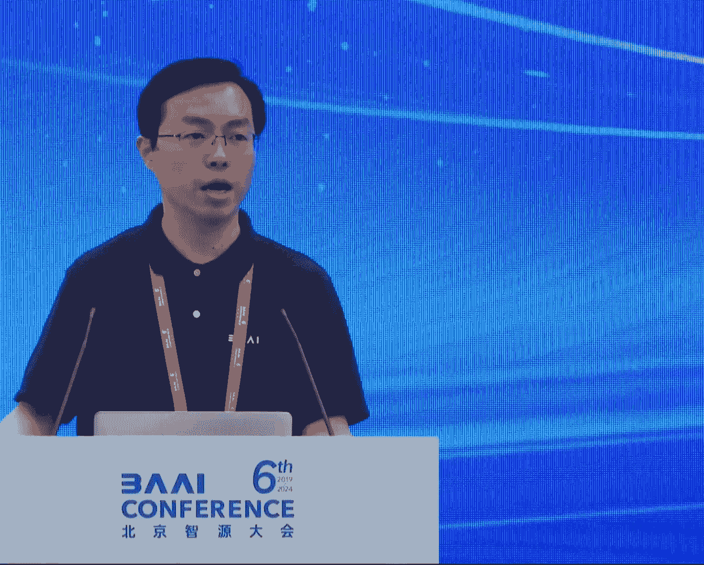
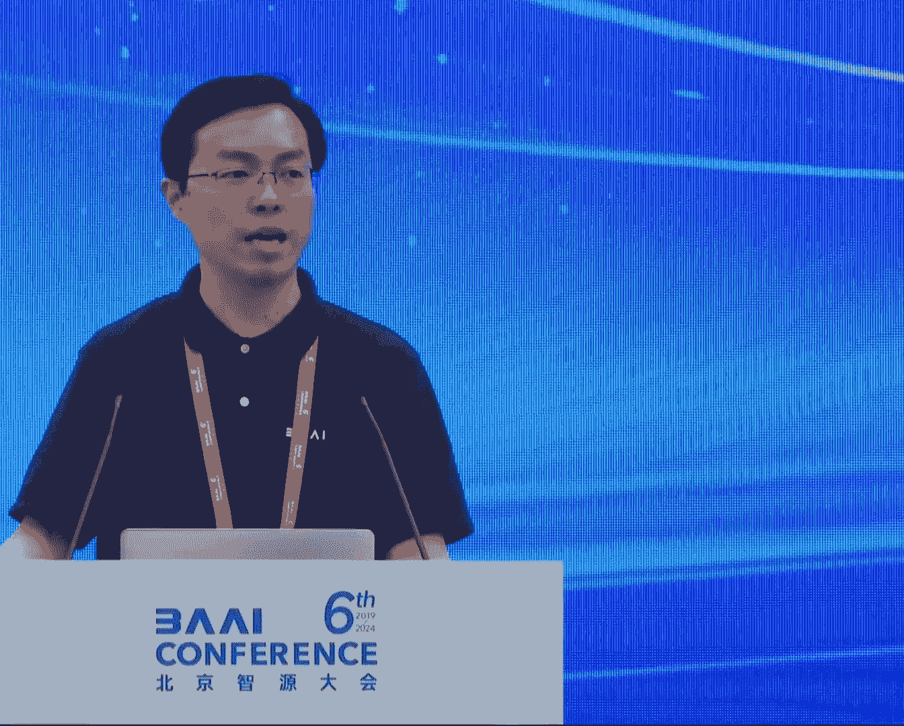
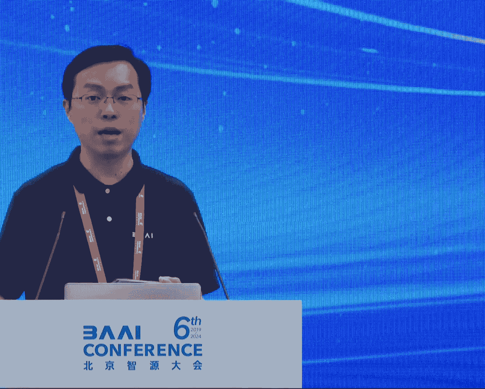
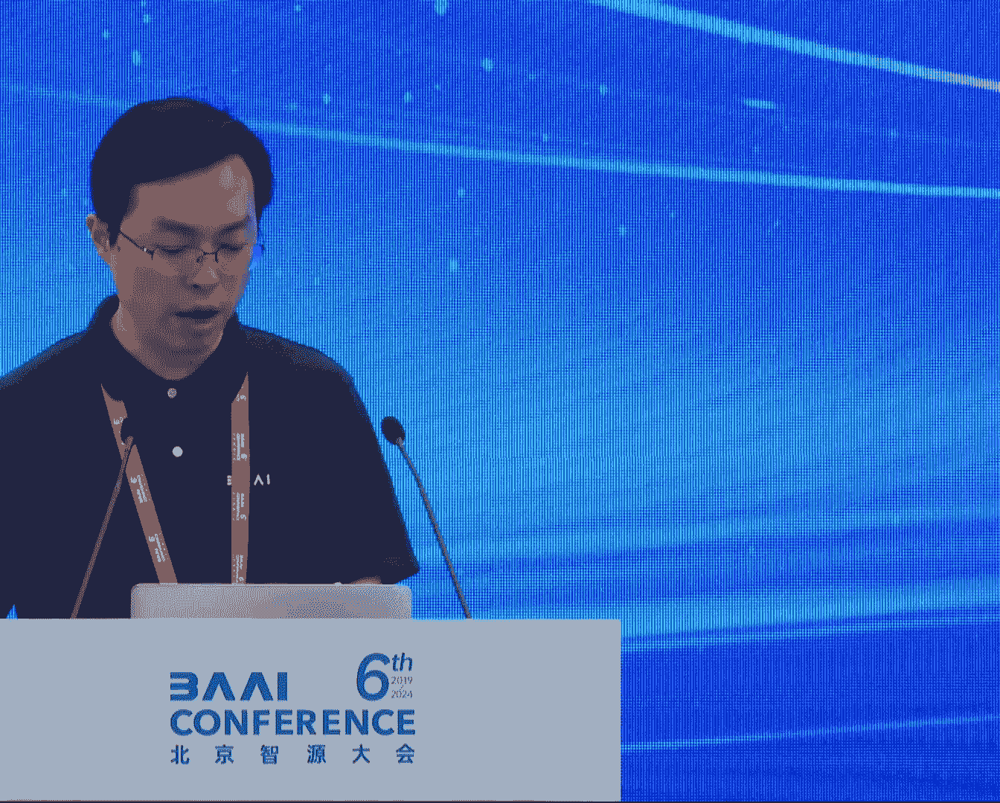

# 2024北京智源大会-大模型产业技术 - P1：论坛及嘉宾介绍：王仲远 - 智源社区 - BV1HM4m1U7bM

下午好，感谢大家来参加我们的大模型产业技术论坛，就像今天开幕式上所说的，大模型在过去的这一年，已经从实验室的研究的成果开始进入到产业界。

我们也在过去一年看到产业界各家公司。

在陆续地发布各种的模型，包括语言的模型，也包括像纹身图 纹身视频的模型，因此在今年的志愿大会上，我们也增设了这样的一个产业技术论坛，希望能够请产业界的朋友，能够来介绍在大模型训练以及推理中。

所解决的一些实际的技术的问题，今天其实我们也确实有幸邀请到了，基本上代表了国内最先进水平的，这样各家公司的一个大模型，他们有爱驰科技创始人兼CEO王长虎。

对 零一万物的联合创始人黄文浩，好，腾讯机器学习平台和混元大模型，算法负责人 康丈辉，对 快手视觉生成与互动中心负责人，万鹏飞，对 然后还有一些专家朋友，待会会陆陆续续过来，我们首先会有请爱驰科技的。

创始人兼CEO王长虎，来做一个主旨的演讲，王长虎博士深耕计算机视觉，人工智能领域二十余年，曾担任智捷跳动视觉技术负责人。

从零到一支撑了抖音，TikTok等国民视频产品的建设和发展，曾任微软亚洲研究院的主管研究员，发表了近百篇国际顶级会议和期刊的文章，拥有数百项的专利，他今天的演讲的题目是，AI视频生成的过去 现在和未来。

作为通用人工智能的重要一环，视觉生成大模型快速的发展，推动了通用人工智能的发展，那么本报告将回顾视频生成的历史发展，进而呈现当下视频生成领域最新技术的进展，和应用以及未来发展的趋势，和将要面临的挑战。

下面有请长虎，謝謝大家，謝謝大家。