# 2024北京智源大会-大模型产业技术 - P3：百川大模型技术与应用实践：谢剑 - 智源社区 - BV1HM4m1U7bM

大家下午好啊，非常荣幸这个众员邀请，然后给大家做一个这个百川的大模型的技术和应用的实践的分享。

对第一趴我可能跟大家先分享一下，百川在这个通用大模型上的一些这个技术的实践，然后第二趴也给大家分享一下。

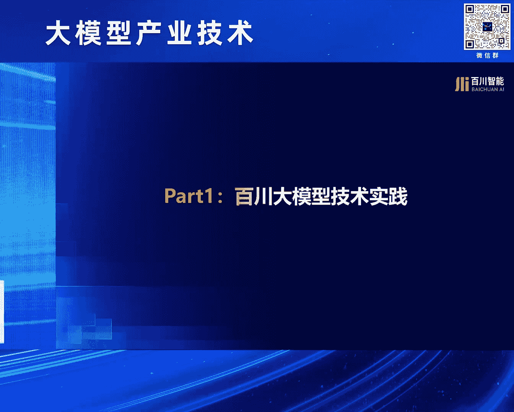

在这个大模型基础上我们的一些原生应用的一些探索，对其实百川是一个还蛮年轻的公司，我们大概在去年4月份的时候，就是小川发公开信。

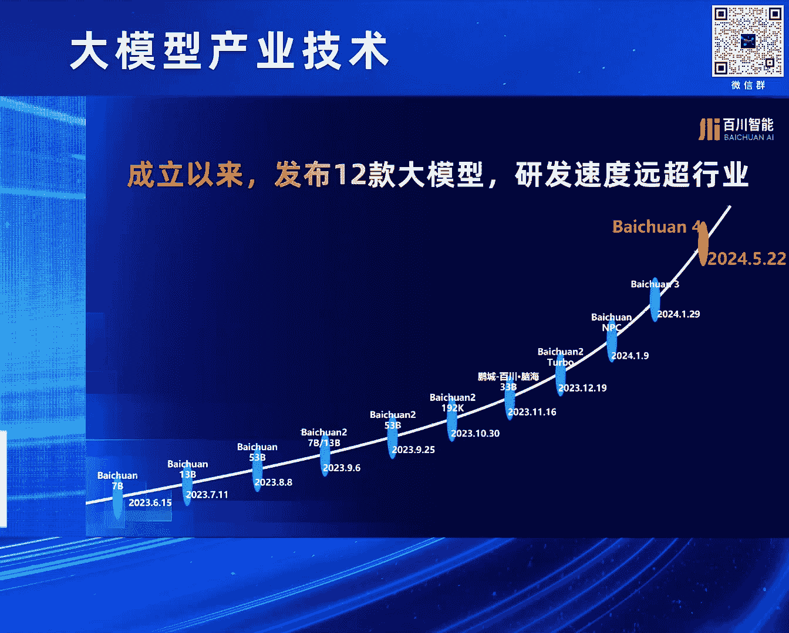

然后去成立这个公司，但是我们也同时是一个奔跑速度非常快的一个公司。

就是大概我们在4月份成立之后，很快在6月份就发布了第一个这个7B的开源的模型，当然当时其实整个市场上应该开源的模型还没有一个，这个真正在中文上可用的，并且可商用的这个模型。

我们当时是这个第一个发布开源并且可商用，同时紧接的很快，基本上是属于一个月发一个模型的这个节奏，然后在这个7月份发13B，然后紧接的很快就到后面基本上到53B，以及在我们在近期也就在5月22号的时候。

我们发布了我们的旗舰的，就是百川4的这个模型。

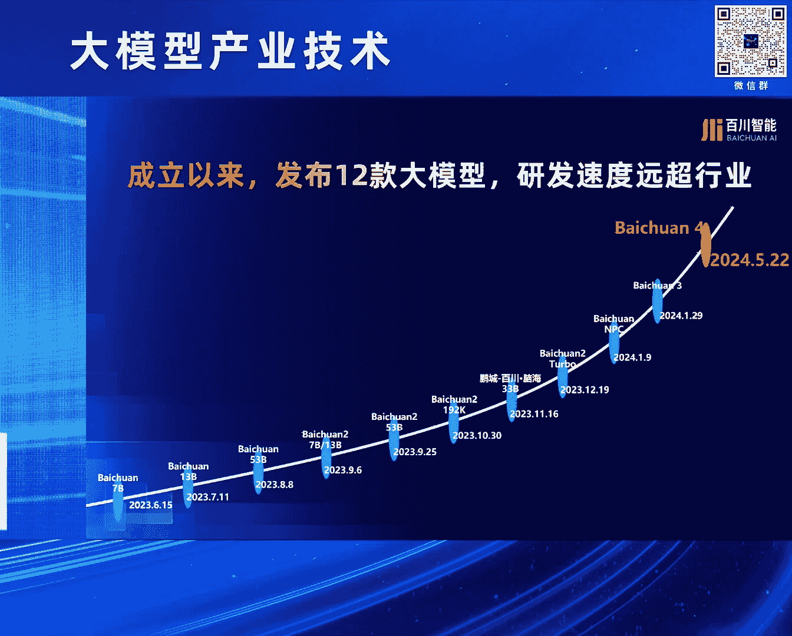

对一定意义上，我觉得还比较自豪的是说，百川一定意义上推动了整个国内中文大模型的开源生态，可能如果大家遥想一下，去年大概在15月份，5 6月份的时候，尤其6 7月份的时候。

其实整个国内中文大模型真正的开源的很少，所以当时我们其实在开了7B，13B以及连续开了第二代之后，现在基本上越来越多的，就是也很开心看到很多的大模型的公司，包括大厂都在开。

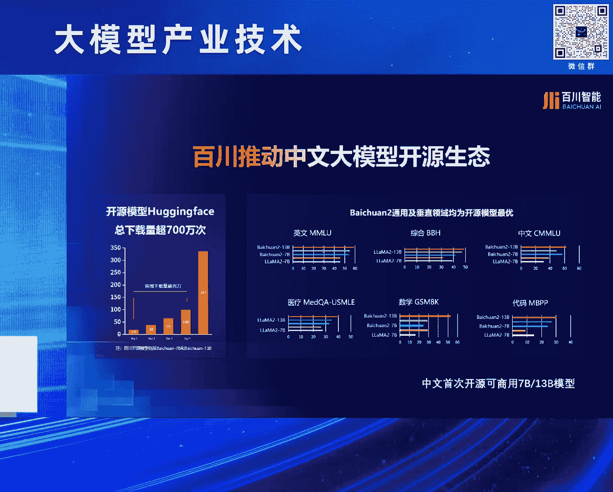

并且也开得越来越大，然后到了我们后面，因为我们觉得越来越大的模型其实开源出来，其实很多人也无法真的很能用起来，所以到后面的这个B元的模型当中，我们其实也在持续的优化，然后百川3是我们大千亿的模型。

这个大概在今年年初的时候发布的，然后也很荣幸在智原的评测。

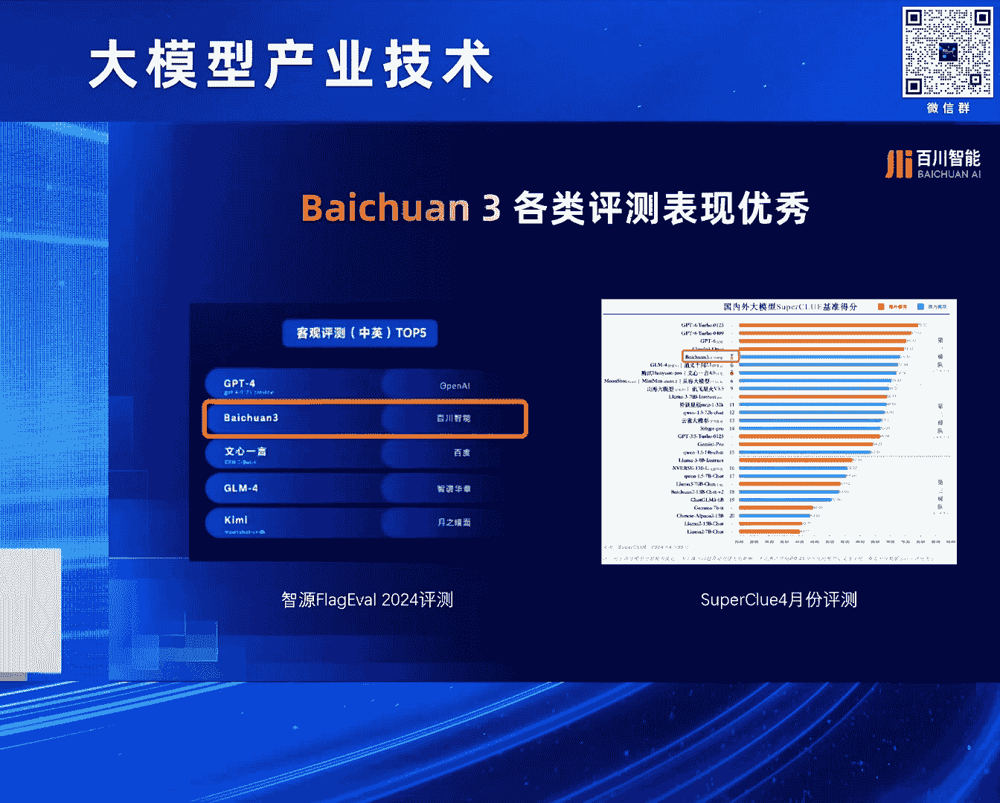

包括SuperCrew的评测当中，表现得还比较优秀，接下来我会重点讲一下，我们在百川4上的一些技术的探索，百川4相对于百川3而言，能力又有了一个比较全面的提升，当然包括很多指令跟随。

信息理解等等各个方面的能力的提升，然后在国内的SuperCrew的评测当中，也就排行比较靠前，当然我们其实实在的来看的话，其实因为它有个分的，在数学能力上其实还是比OpenAI要差。

当然在文科上确实是有一定的优势，百川4同时也有一个多模态的模型，在Benchmark上我们基本上。

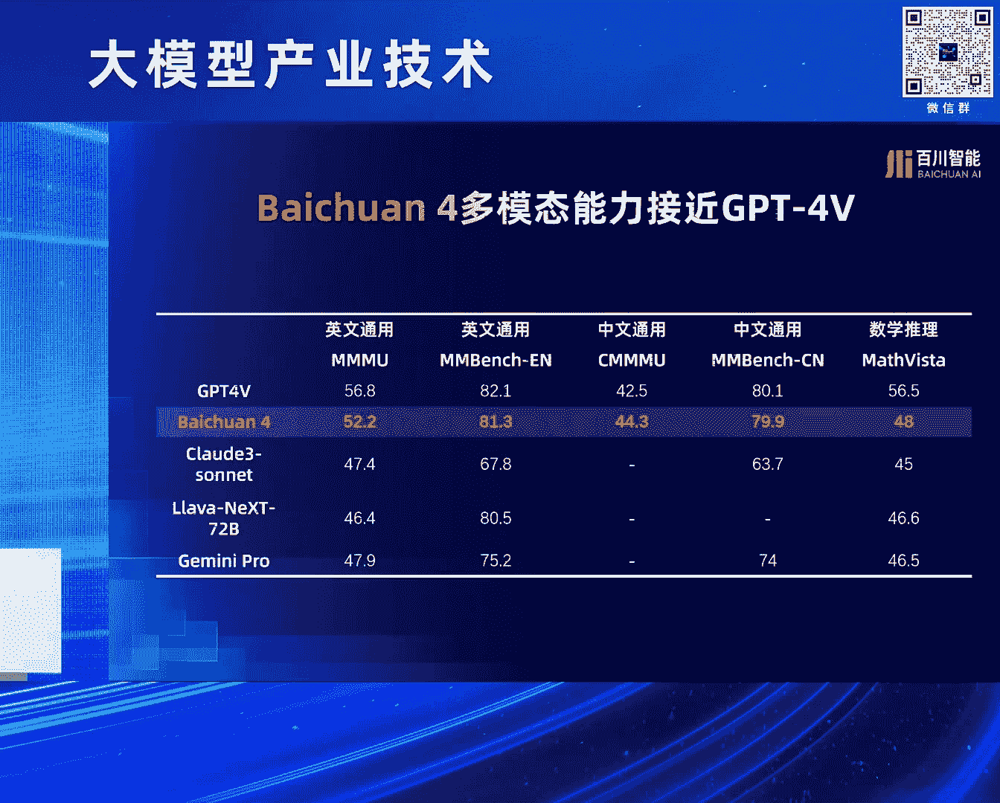

快要接近到GPD 4a，当然在这个里面我们其实，这个模型演进了这么多代，就是在百川4上我们也做了很多技术的探索，也跟大家一块分享一下，第一块其实是在预训链上，我们都知道其实预训链里面数据，是至关重要的。

那么怎么去筛选这个数据，或者说去获得高质量的数据，我相信大家都有非常多的实践，但整个行业的发展趋势，逐步地从人类标准的这种方式去筛选，就是我们觉得什么是好的数据，什么是粘的数据。

但其实人类标准的数据筛选，往往通常情况下有遇到的一个问题是说，坏的数据是很容易能够去分辨的，但什么是真正好的数据，其实并没有那么容易，所以我们其实在这个阶段，逐步地也引入到了这种模型的筛选。

也就是说我们用百川山，这个其实在Meta后面，在公布到拉玛山的时候，也看到他们有类似的工作，其实我们也在做类似的，就是百川山的模型，用相关的一些指标来做数据的筛选，当然除了筛选之外。

你会发现现在其实大模型本身自己生成，就能够生成很多高质量的，尤其是知识密度比较高的这种数据，所以我们在数据合成上，也做了很多的探索和工作，包括模型的改写，也包括高质量的数据的生成和合成，第二趴其实是。

做了这么长时间的训练之后，我们公司的预训练的团队，同学们也开始在探索说，怎么样从经验，真正地做到科学的部分，我们都知道在做残窗口的训练当中，如果大家还是在用ROPE的。

position的embedding的话，通常会有一个经验性的感觉，是我的base，就是我的窗口要大的话，我的基底的base也要大，但大到多少，以及到底怎么样大。

其实大家很多时候都比较empirical的这种方式，然后我们的同学也做了很多的实验，就是真正的做了一个实验是说，如果你要把窗口长度扩大一定的程度的话。

那么你的base实际上是有一个lower bound的，当然这个我们也公开了我们的论文，大家如果感兴趣的话也可以去看，这个The Base of ROPE的这篇论文，所以这样的话实际上我们对于。

这个模型的窗口长度的能力的，扩充过程中也能够做到更加，科学化地去设定我们的base。

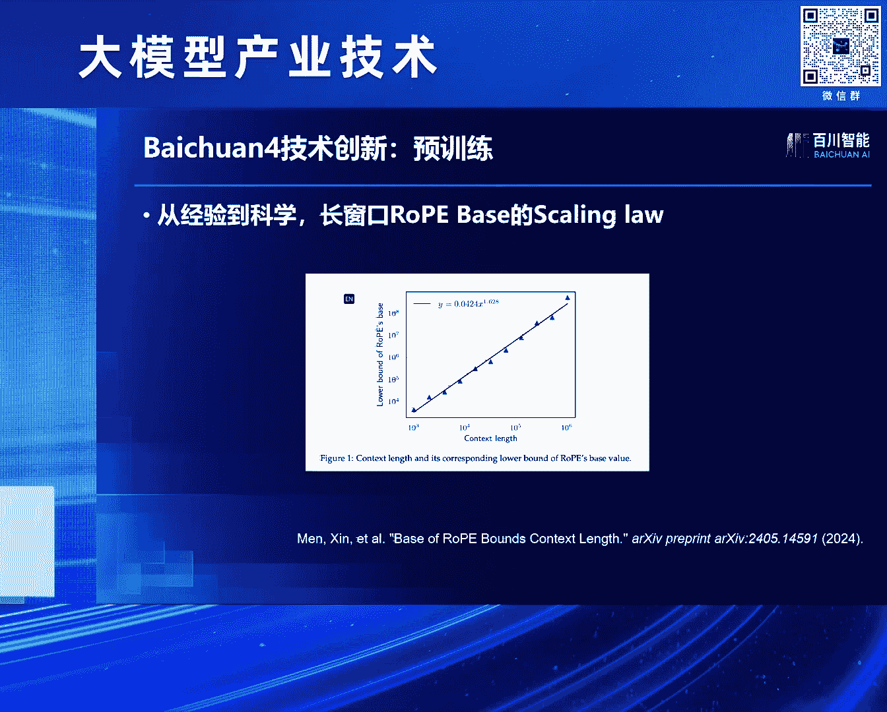

当然除了这个预训练之外，另外一个非常重要的部分就是对齐，在对齐这一块我们做了，几个比还比较有意思的工作，第一个就是我们试图去理解说，在对齐当中预训练的知识，和所谓的在对齐。

你通过对齐的训练把它elicit出来，是这两个之间的关系是什么样子，我们做了一件事情就是把transformer，就整个网络的在过最后的logic的那一层，之前的embedding拿出来。

把这个embedding拿出来之后，我们做了一个剧类，把这个剧类来分说好和坏的，这个部分的区分，然后当然我们把这个把它定义成，叫做cognitive capability，也就是说你不在在做最后一层的。

这个动作之前，实际上这个模型本身，在这个隐藏的表示上，其实就具备了它一定的知识的感知，所以这个的话你会发现说我们在，做这个实验的时候，你会发现说这一层的知识和能力，实际上在随着这个预训链的。

就右侧的图上，你会发现随着预训链的，这个token数的增加，它的整个能力是不断的在提升的，但是另外一个往下看一个，就说我们现在其实是最终是让模型输出，这个结果到底是好和坏。

当然我们在这些篇论文中把它定义成，叫做expressive的capability，也就是说那模型已经自己能够表达出，通文字表达出它的判断好和坏的能力了，那在这个当中你会发现其实，如果你去看右侧的实验图。

你会发现其实在做对齐或者说在LHF等等，就SFT和LHF的这些对齐，其实它是在逐步的在提升，你会看到它的准确率在提升，但是它其实没有超过刚才说的cognitive，capability的这一部分的知识。

所以一定程度上其实是在，在共识一个比较重要的业界的一个概念，就是说在预训链当中，我们其实learn了很多知识，那alignment当中其实更多的程度上，我们是当抛开这个指令遵循本身。

就在knowledge这一上，我们更多其实是能够去elicit，然后这篇paper当我们也在，今年的ICML上发表，大家如果感兴趣也可以去，深入的去看一下，那除了说去探究其中。

alignment里面的对齐当中的一些，关键的这些概念和原理之外，当然在对齐的一些方法上，我们也做了一些不同程度的探索和创新，其中在SFT上，SFT的团队做了，我们做了很多不同的创新之外。

同时做了一个模型融合的工作，这个工作当然可能大家在上一代，就是在传统的机器学习里面，应该有很多类似这种ensemble的这种方法，但是怎么把这个模型本身，通过参数本身自己的融合。

又没有去增加复杂的计算量，同时能够平衡不同的模型的效果，其实也是新的大模型时候的一些，值得持续去探索的一个工作，然后在强化学习这一块，我们做了两个大方面的工作，第一方面就是分了不同的阶段。

第一个阶段其实是做了一些这种，应该说是这种改进版的这种DPO的一些方法，就是在其中我们叫，sequential的preference optimization，这个也是最近发的一篇paper。

就是说核心其实是说，我们有不同的preference，就是对齐的价值观的对齐过程中，可能你会有不同维度的要求，其实如果把这些维度都合在一起，其实你会发现，它其实有时候会比较难平衡。

这个过程中我们其实把这些维度，做了一个区分，同时做了一步一步的这种微调，这是第一个，第二个就是在强化的这部分，就RO的XF这一块，我们做了一个工作比较重要的工作，其实是把RO的HF，就大家可能RO的。

就reinforcement learning，from human feedback，这个可能大家非常熟悉了，也就是OpenAI在推，在一些instruct GPT的paper里面。

明确提到他们用这种方法，更大的提升了模型的这种指令遵循，但同时我们会发现，其实当模型发展到今天的状态的时候，很多时候模型自己能够对一些能力上，它其实是能够做AI的feedback。

所以怎么把这两个做一个充分的融合，这是一个比较重要的点，第二个点就是，大家都知道其实在对齐的过程中，模型的能力，就有点像是在小朋友在学习的过程中，它其实也是一步一步的爬坡的，所以如果能够做到持续的。

叫iterative的这种，RO的这种XF，其实它可以让整个模型的能力，一步一步的往上走，所以这个过程当中，其实我们也做了这部分的工作。

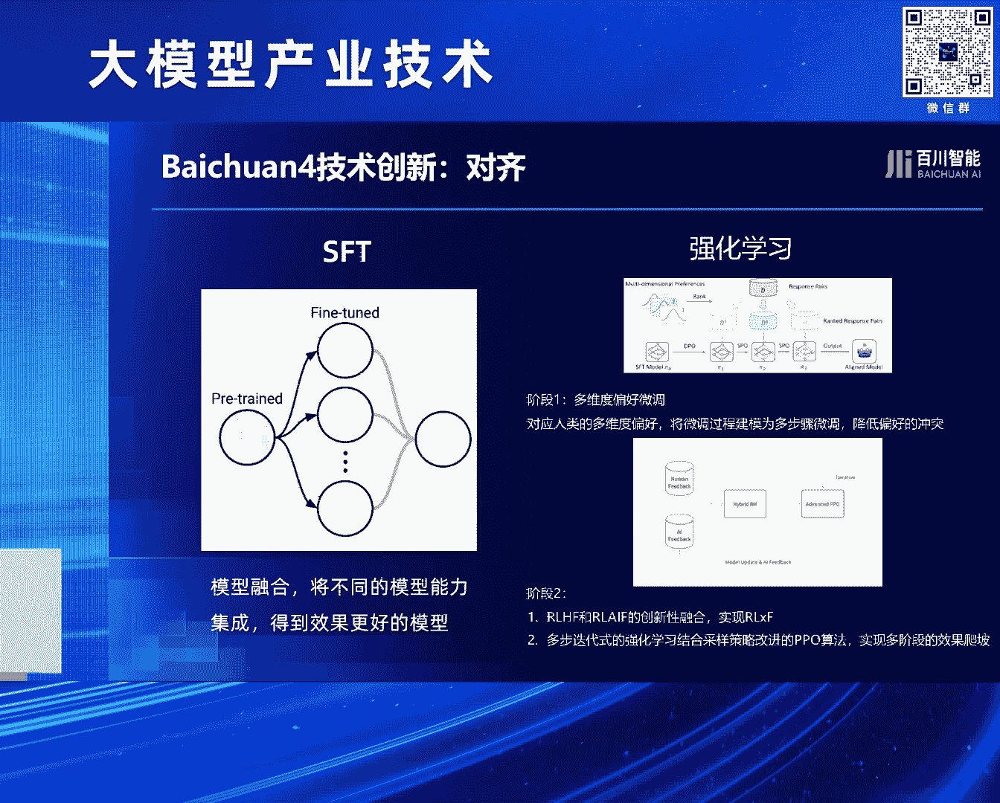

当然除了关注模型的算法的效果之外，大家也都知道今天其实整个成本上，或者说在推理的效率上，其实也大家都非常关注，其实我们在这个过程中，也做了很多的探索，其中比较重要的一个就是。

大家都知道可能有一些降低这种推理成本，和提高效率的这种工作，其实是做这种投机的采样，也就是说你在做next token的prediction的时候，我同时有一个并行的去预测后面好几个token。

我这个过程中就有点像是我提前去预测，后面的好几个token，当然这个过程中现在就是传统的一些方案上，其实它的命中率会相对会低一些，所以我们也跟北大联合做了一个研究的，和这种创新的工作是把一些序列的知识。

跟并行的这种解码去结合起来，使得投机采样的命中率进一步的提升。

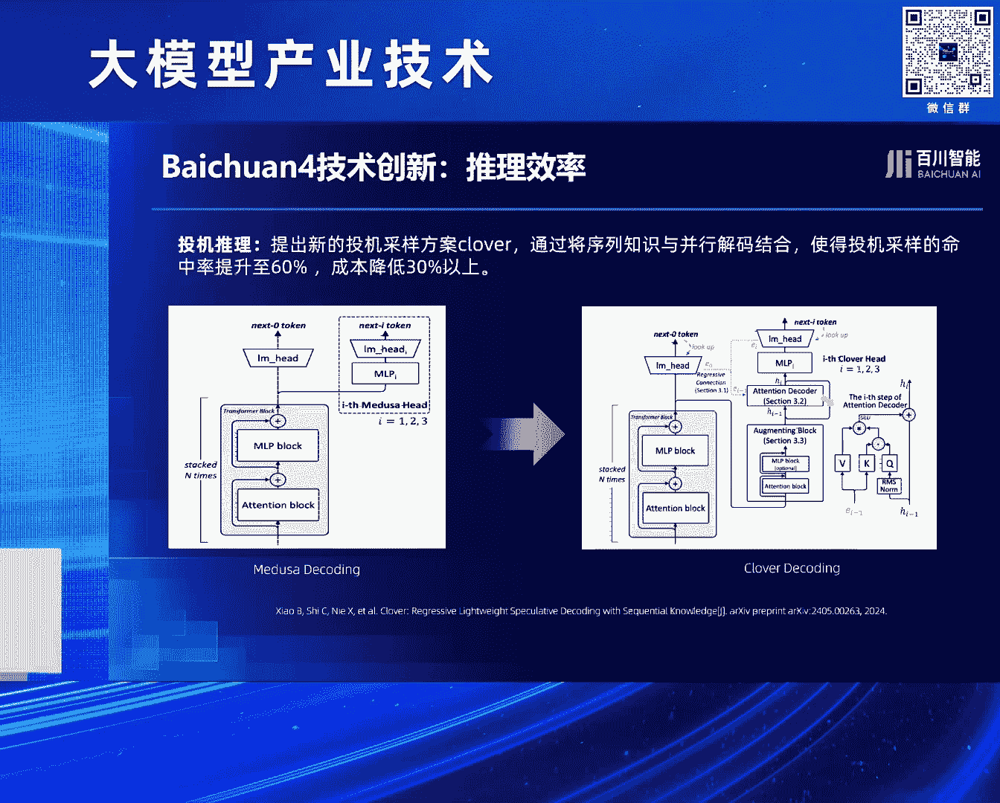

但还有一个，就除了百川是自己的模型之外，其实百川也一直在做一个探索，就是我们希望是说，未来的模型能够有机会去执行更多复杂的任务，我自己一直是这么看的，就现在的模型很多时候其实我们现在很多场景下。

还在做人类中的这种快思考，就所谓的system one的这种思考，但是真正要进入到人类社会中，去真正去帮助人类解决很多复杂的任务，一定要需要慢思考，所以百川在agent上面也做了一些技术探索。

但这个工作其实也是我刚刚临时在下面加的一个，也是比较巧的，也是比较算是在工程产材上，跟大家第一个去分享，就是我们大概在前上一最最近的几天之内，我们拿了复杂任务版就Gaia的全球第一。

就我大概介绍一下Gaia的task的benchmark，是一个什么样子的一个task，其实它是Meta的手机科学家，Yan Lecun和Hackingface的，还有几个在做agent相关的。

提出了一个新的这种AGI的这种评测方案，它其实比较重要的其实是评测一些，需要比较复杂操作和规划的这种任务上的，整个模型的能力，那它的特点是什么呢，就是题目其实对于人类来说还挺简单的。

但对于很多先进的系统来说，却其实有比较大的挑战性，如果你去看的话，其实人类可能能做到90多分，但其实如果你看GPT4加plugin，可能最多能得15分，然后题目有很多很多很更现实的问题。

题目在这个过程中需要去调用很多的这种工具，并且往往都不是一步，基本上都不是一步能做到的，它都需要做比较多步的这个过程，而且人其实大部分的这个任务，都已经超过了6分钟，就超过了5分钟。

所以比如说类似这种问题，就是你看这个可能是美国国立研究院，网站上列出的2018年1月到5月，在寻蝉痔瘡患者中进行的幽默洛杆菌实验的，实际数目是多少，像这种其实你往往都需要把它拆解成，很多不同的这种查询。

然后再去做，对这个也是我们近期刚拿到的一个结果。

就是我们在做的一些这种，一个我们内部的一个系统。

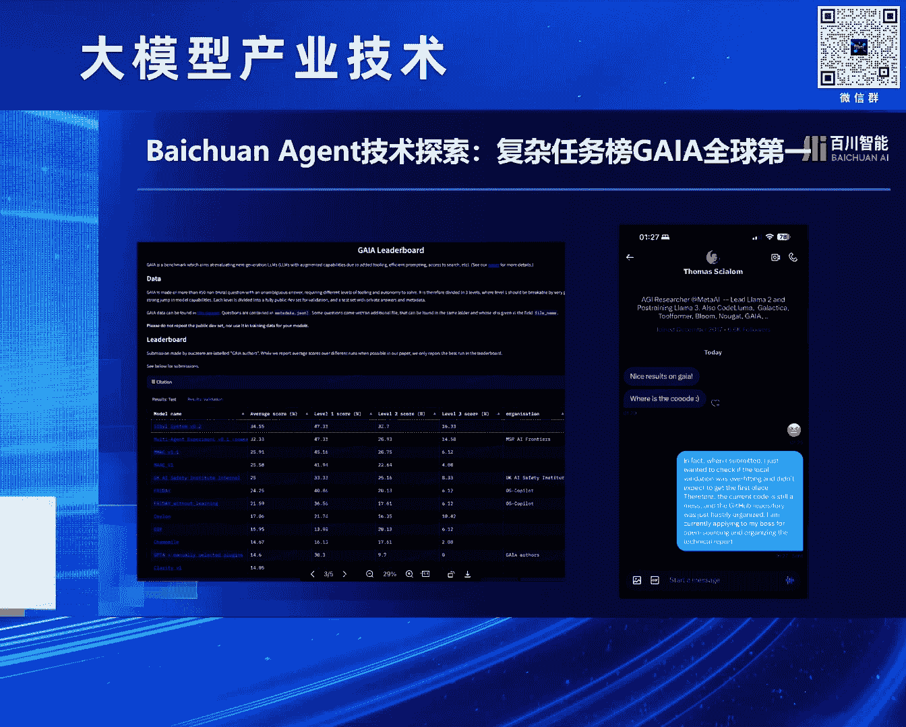

然后拿到了第一，当然其他的参赛者。

就是其他的下面的Benchmark的，有好几个，就之前的第一是微软的一个工作。

但我们拿到这个之后，其实也就在前几天很快，这个Lama的这个Lama2和Lama3的，他们这个核心的工程师，也很快就来找到我们，当然我们现在其实也在整理，因为我们其实发的时候。

也还没有那么confident是说能拿到第一，就是现在也在整理这个代码和记录报告。

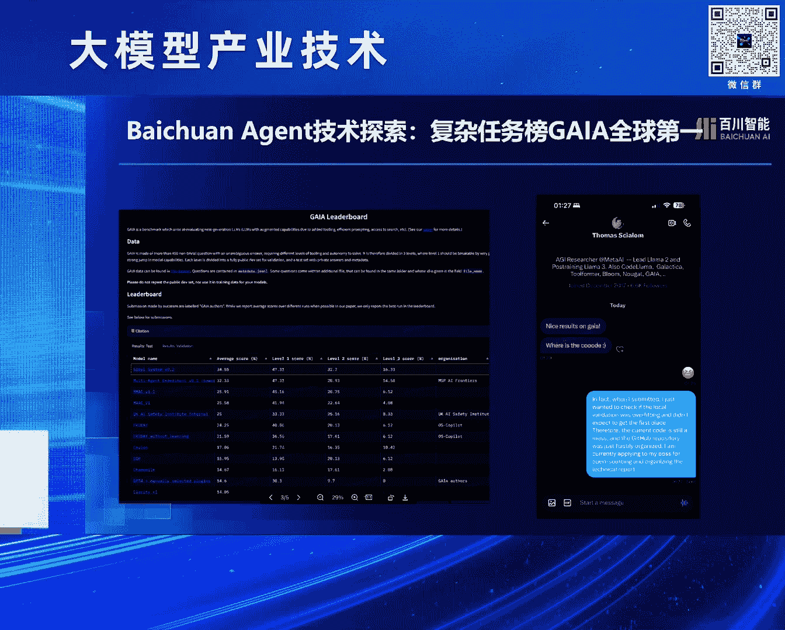

对，然后我大概brief的介绍一下，我们这套系统，其实在这过程中做了一些比较重要的，我们希望从System 1到System 2的，一个探索上一个比较大的改变，其实有几个，第一就是说当Baby AGI。

这个是一个比较common的，就是说我们做thinking， thought， reaction，然后再做reflection，就这一套的编排的机制，其中还有两个比较重要的是说。

要做这么长序列的规划当中，会需要一个global的memory，你怎么去manage这样的一个global的memory，就像人类打草稿，或者说做很复杂的题目一样。

那你怎么去manage这样子一个global的memory，进而去做到几个模块之间互相协同，再一个就是multi-agent的这种方式，当然这个背后叫做social of mind。

就是我们用好几个agent之间，相互去对话，和相互修正的这种方式去提升，然后再一个点就是，从调用工具上来看，我们是把这个IG进化到了所谓的webagent，就是我们都知道现在的搜索，很多的搜索增强。

其实是你把这个网页拿过来，然后我再丢到大模型里面做一个summary，但实际上人类在真正在做这些复杂任务的时候，它其实是把这些所有的这些网页等等，把搜索这些都当成很多工具，你可能是搜索。

搜索完之后再去点击，然后page down page up，就做很多这种的工作，当然我们很快会去开放，就是发出我们的technical report，和公开我们的代码。

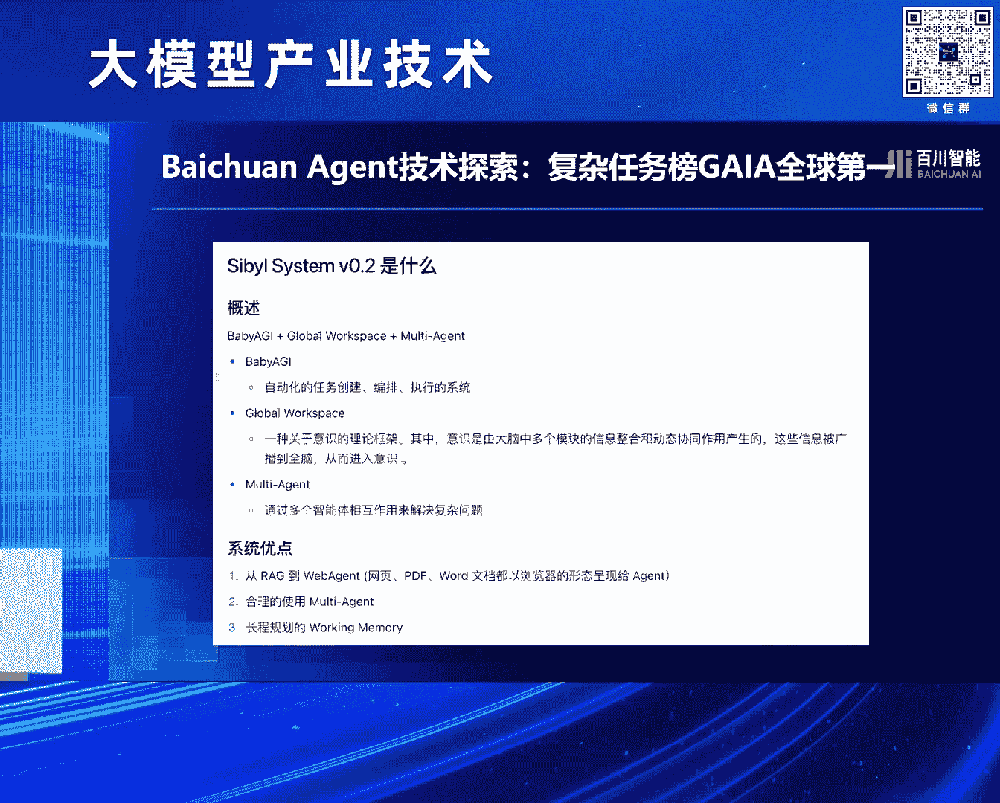

感兴趣的同学到时候也可以关注，对讲完这个，我也很快跟大家分享一下百川大模型，在应用上的原生应用上的一些探索。

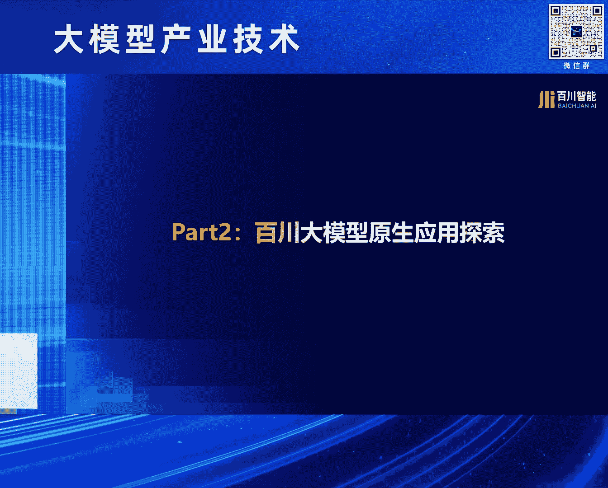

我们认为说，现在在大模型的技术的基础上，我们觉得说如果真的要在助手这个维度上，能给大家在日常生活中提供真正有用有帮助的助手，我们觉得应该具备两个比较重要的，第一是要懂搜索，就是大模型固然知识非常大。

但它更适合其实作为一个reasoning的brain，它的知识一定是有限的，不管从时效性等等各个方面都是有限的，第二个就是，真正要成为一个像人一样的助手，我做了很多年的助手，现在真的要成为助手的话。

其实它应该像人一样能够会互动的这种交互，而不是像GCP这个时候，还更多的有点像是在一问一答的，还是一个这种问答器。

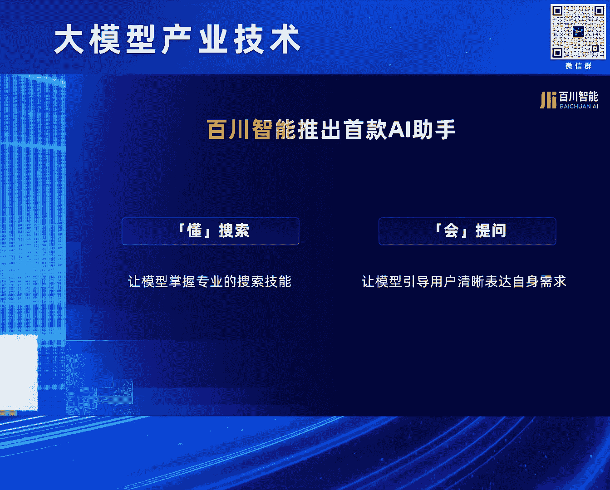

所以基于这两个的思考，其实我们做了AI的原生的应用白小应，白小应上其实，第一个我们说懂搜索，比如说引擎盖打不开怎么办，当然这些大家都其实是在直接的做这种回答，其实我们的一个思考是说。

不太能模仿我大概讲一下。

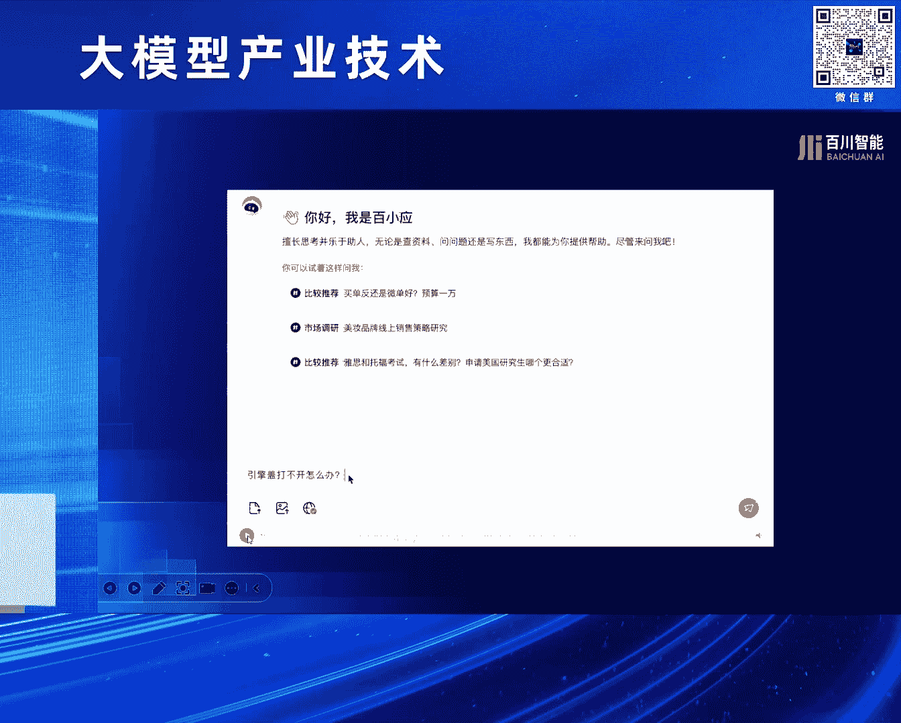

第一个就是懂搜索比较重要的，其实是说我们能够知道说去哪里去搜索，比如说可能如果你要找论文，你应该是去IKEA去一些非常专业的这种网站去搜索，但这些都是大模型把你自己解决了。

就懂搜索能够去定向的网站去搜索，拿到最好的资料，第二个就是多轮的这种搜索，就是你可能不只是一步搜索能做到的，你可能比如说对比中美两国在大模型行业上的这种差距，你实实在在可能需要去先了解中国的大模型对吧。

再了解美国的大模型，然后再去做大模型两个行业的这种差距，所以我们其实可能会做多轮的这种搜索，把这个问题拆解成不同的步骤，最后再给大家一个更结构化的这种解析，再一个就是把搜索的结果通过刚才说的。

就是多轮的这种搜索和更复杂的分析之后，其实是会把这个结果嵌入到整个搜索的最后的结果上，不好意思今天这个播放有点问题，再一个其实就是结构化，大家如果能去看的话，比如说对比过去4年绍兴和宁波的GDP。

就是我们一方面是找到好的搜索员，定向搜索能做得好，然后你能把复杂的任务像人一样，我可能搜第一步搜第二步，然后再做，最后我们还希望说能够更结构化的，能够去把这个信息真正的组织成知识。

比如说这种GDP的这种对比，你其实可能很快用一个表格，你很容易就能看出来他们之间的这种对比，再一个就是会提问。

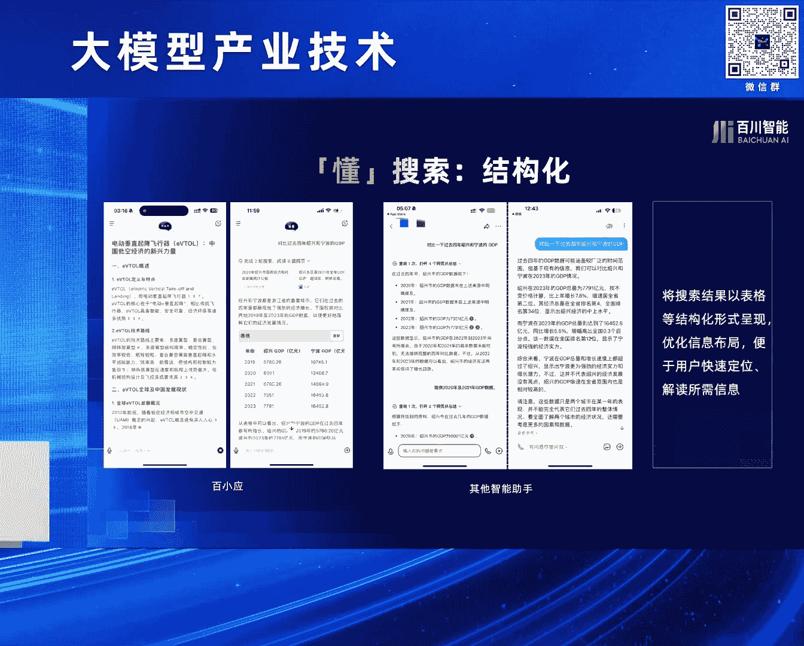

其实你会发现今天大模型有很多problem，其实也挺有意思，以及他的回答，就是说你说让一个大模型说帮我写一个，甚至有很多说帮我写一篇作文，然后啪啪啪他就给你写出来了，这我感觉怎么说。

其实每个人带着这个需求，他肯定不是说你给我随便给我来一篇作文，我就能用的，所以在这种其实是一个典型的这种，其实需求都并不明确的这种情况，更好的这种应用形态是，你应该是跟他能够去做互动和交互。

能够更清晰的让用户把自己的需求表达清楚之后，我再给你一个好的这种结果，所以我们的这个名字，就是我们的整个应用的名字叫做白小应，对这个白名字的来源其实也比较简单易懂，我们希望是一呼百应。

然后不管是响应上能够快，然后反应上能够快。

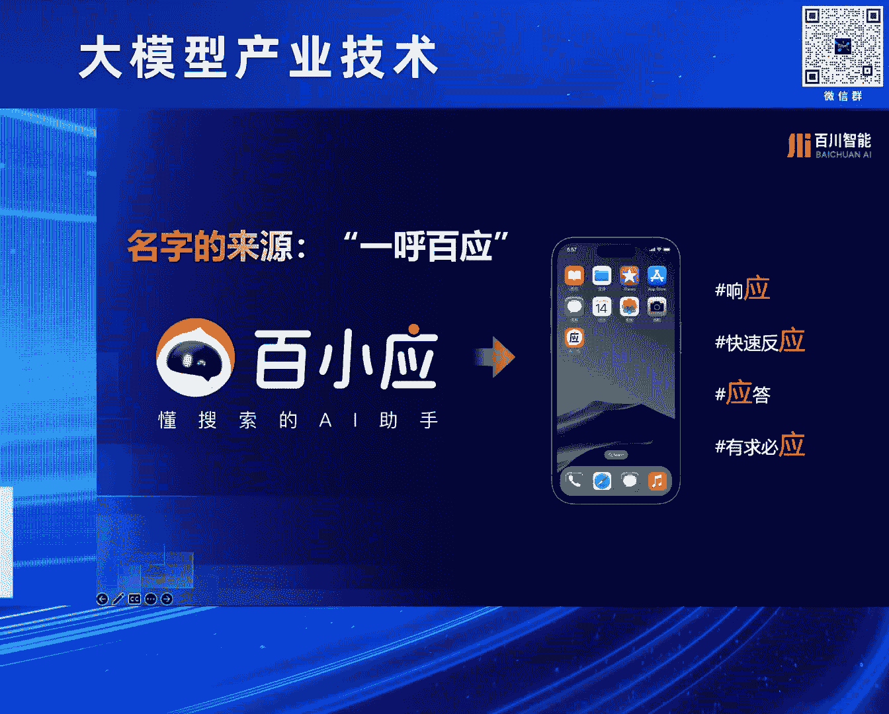

应答上能够好，然后有做到有求而必应，当然这个形象就是算是百川陆海跟结合的这么一个形象。

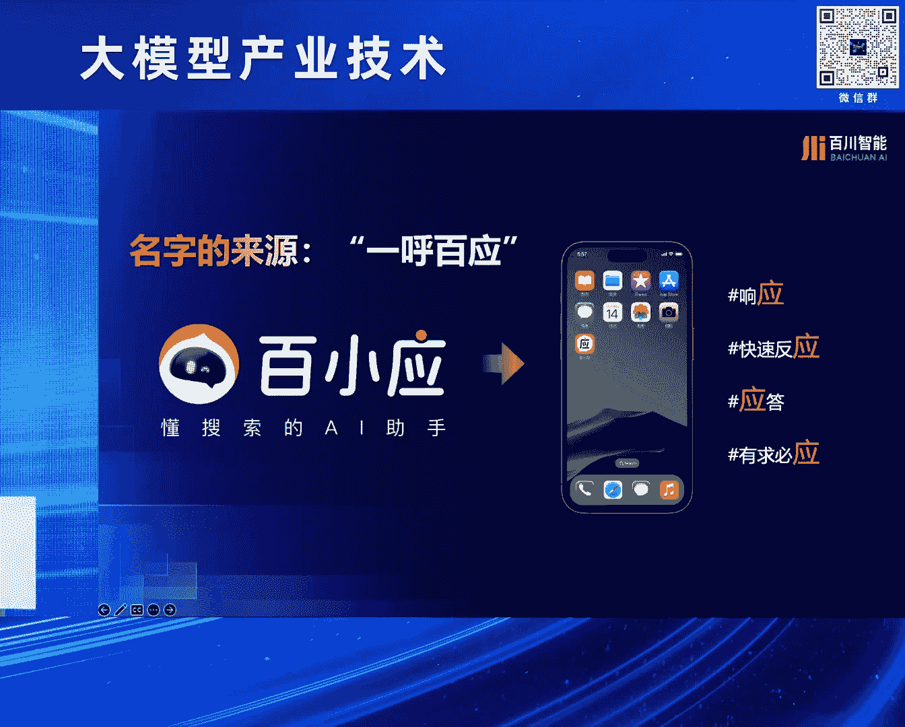

当然我们更期待的其实是能够做一个有温度的这种。

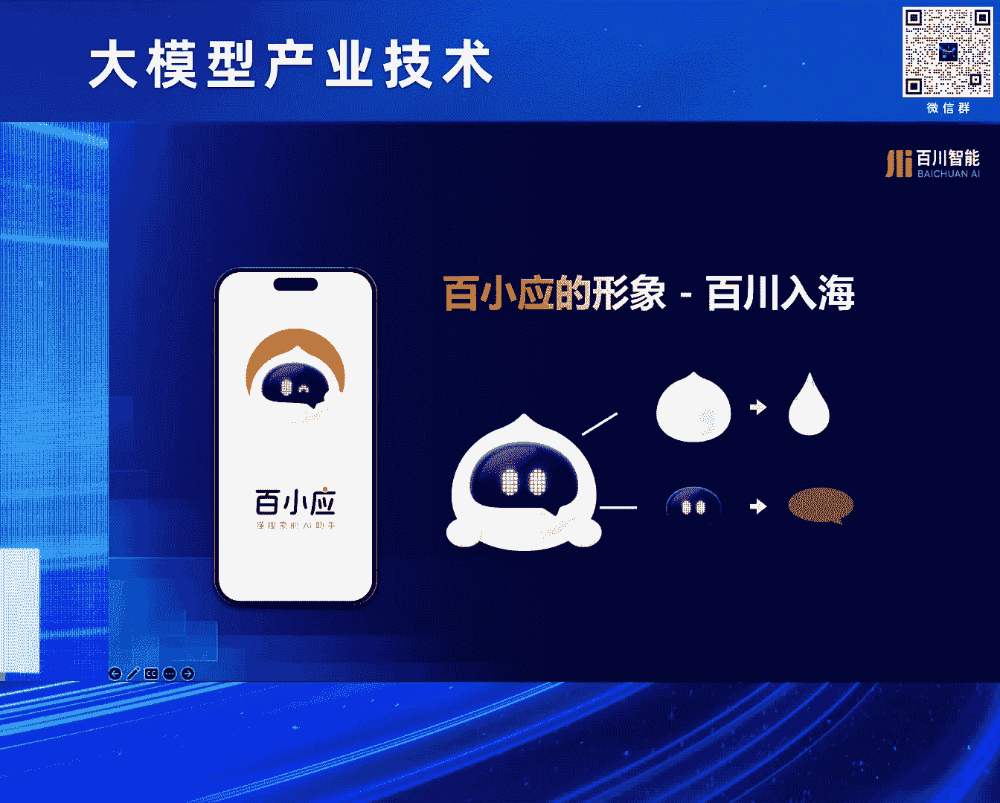

人工智能助手的这种产品，能够真正做到从工具到伙伴，当然更期待的是未来，是我们能造很多不一样的这种人。

对回到百川的从大的价值观上，我们一直期待的是创造健康和快乐，就是在大模型能够辅助人们创造，同时当我们还会在医疗的健康上有很多的探索，以及在快乐上也希望能够给大家带来更多不一样的这种应用。

对讲完我们的技术和应用的一些探索的实践后。

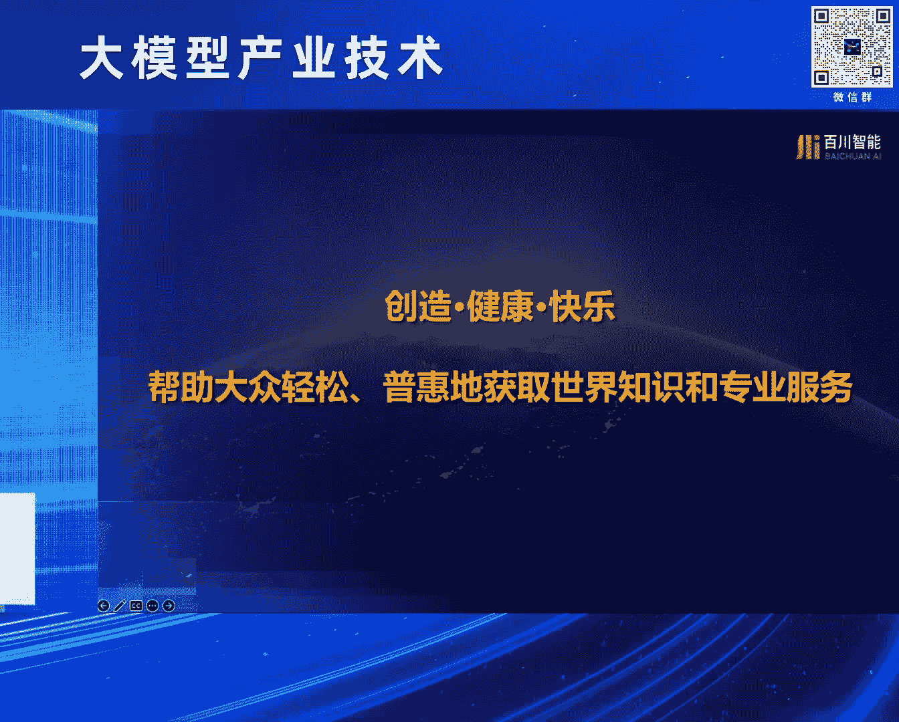

也给大家分享一下，我们对一些未来有一些是代表我个人。

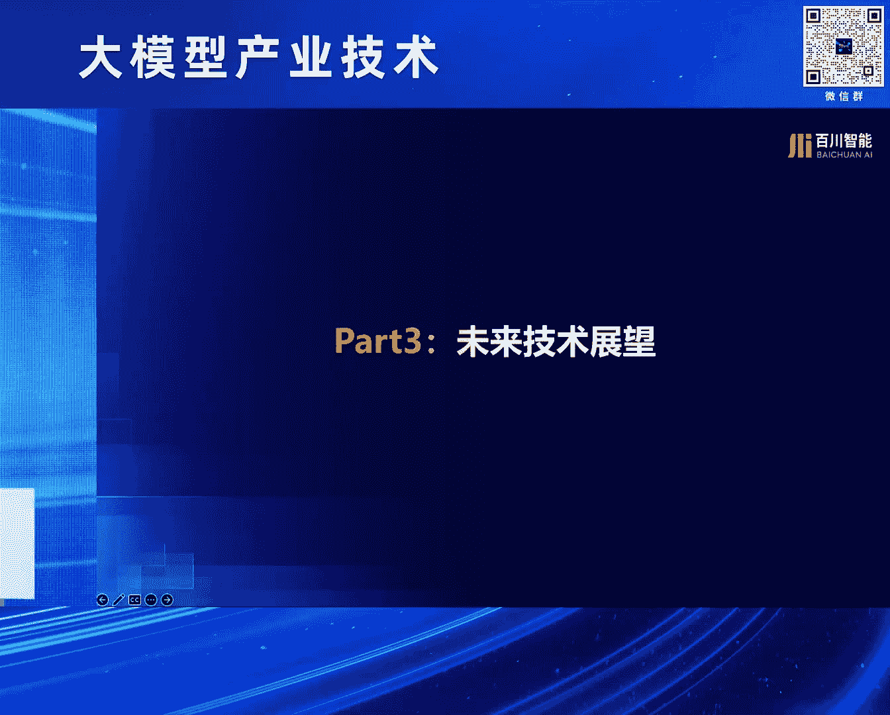

就是我对未来的一些技术的展望，我大概做了几个技术趋势发展趋势的一个总结，前三个叫大多会，大是说当然我们模型会持续的scale up，我看前几天有一些leaking的information是说。

GDP5是50多万亿的参数，当然他可能做MOE之后，他T-flops大概是乘10倍，就他们每一代都希望是10倍的概念，这是第一个当然参数的规模数据规模一定会持续的scale，第二个就是多模态。

这个多模态应该叫any to any，就是从长期来看它一定是any to any的，但同时还有一个比较重要的，其实是实时的这种自然交互，就follow其实给大家一个很明确的这种回答。

是说human like的这种interaction，显然也是未来大模型一个非常重要，或者说AI走向更多的这种应用场景，更智能的更类伦的这种体验，很重要的一个方向，第三其实是普惠。

但其实一定意义上我觉得其实是模型能力，或者说模型在推理成本一定的情况下的，模型能力的这种提升，现在很可能比摩尔定律的速度更快，就是三个月到4个月之间，可能这个cost就能够下降到50%，甚至以上。

所以capability在能力一定的情况下，推理成本会不断的再往下走，不管是从算法本身的优化，还是从硬件本身的优化上，还有两个其实是我觉得比较重要的，未来的一个如果大模型的技术。

或者说通用的在走向AGI当中，非常重要的两个点，第一个就是long horizon的这种task，也就是说现在其实大模型到了今天的状态，其实我觉得更多的还在system one的状态。

就是你快思考的这种状态，那么其实往往能帮助解决人类的任务，是在人类大概5分钟之内能解决的task，往往是怎么样真正能走向所谓的，再往前的AGI，一定是能够帮助人类解决，超过人类5分钟能做的。

所以这种长序列的复杂的任务，怎么样能够真像人一样，用system two，就慢思考的这种方式去做规划，去做工具的使用，去做长程的这种planning，最后能够把这个任务完成，这个显然是接下来非常重要的。

当然可能也可以推荐大家去听一个，John Schuman最近的一个他的talk，他其实也在团中反复的提到这个，当然第5个其实是自学习和进化，但我觉得这个其实就更高level的点了。

就是说alpha go到alpha zero，走了一个另外就走了一个，很重要的一个变化，是说alpha go我们前面还要用很多，人类的棋谱，去做siepher wise的这种learning。

再去做一个起点，但到go就zero之后就说，ok那我就一开始就开始做自我演绎，和这种对抗和学习，那如果说AI再往下走，如果能突破所谓的self boost，或self play。

anyway就是不同的能借助，不就不再借助人类本身的数据，的输入或者说siepher wise的这种，输入的话还能够持续的进展，那这个可能会是对于后面非常关键的，突破也是非常大的一个挑战，Ok好。

那我的分享就今天就到这，谢谢大家，好谢谢谢剑博士，然后我们还有三分钟时间，看看现场有没有朋友想要提问的，举个手，那边后面那位举手的，对想问谢博士一个问题，就是咱们在agent相当于在大模型之外。

去构建复杂的推理网络了，但比如他跟比如说我在模型内部，比如加一些这种tracer这种方式上，这可能是探索的方向上，会有什么样的不一样的这两者，对我觉得是这样子看的，就是实际上这个问题。

其实我们一般来说来解决这种复杂，任务，最后肯定是这两个东西双管齐下，或者说你其实刚才mention的，可能是另外第三个，但其实在我看来，第二第三可能概念一样，我大概讲一下，就是说你首先我在推理的时候。

是不是我在推理的时候，我不管是用tree的这种方式，结合mcts这种搜索的方式，anyway就把推理的过程的多路径，都打都做出来，并且做用plan的方法去做，这肯定要做，但他肯定一定程度上。

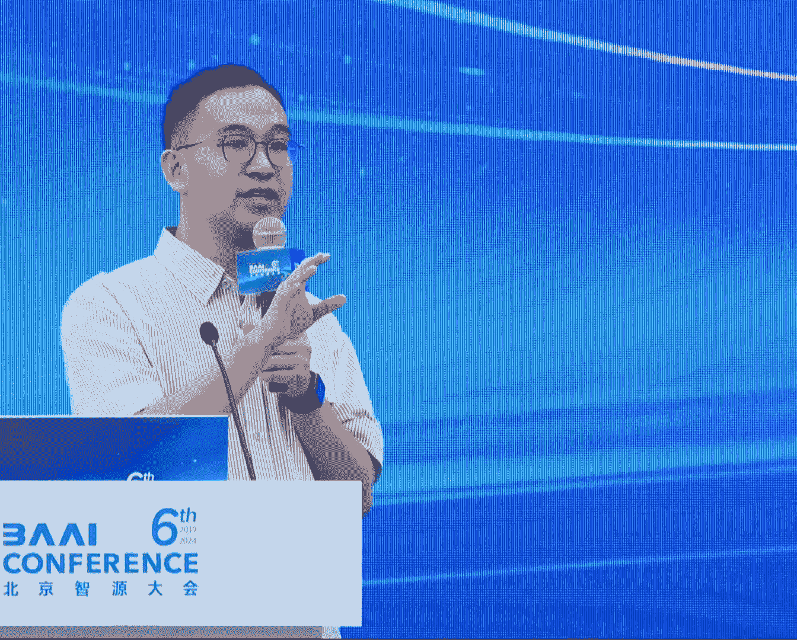

也会提升这个cost的，这个动作其实跟所谓的agent里面去做。

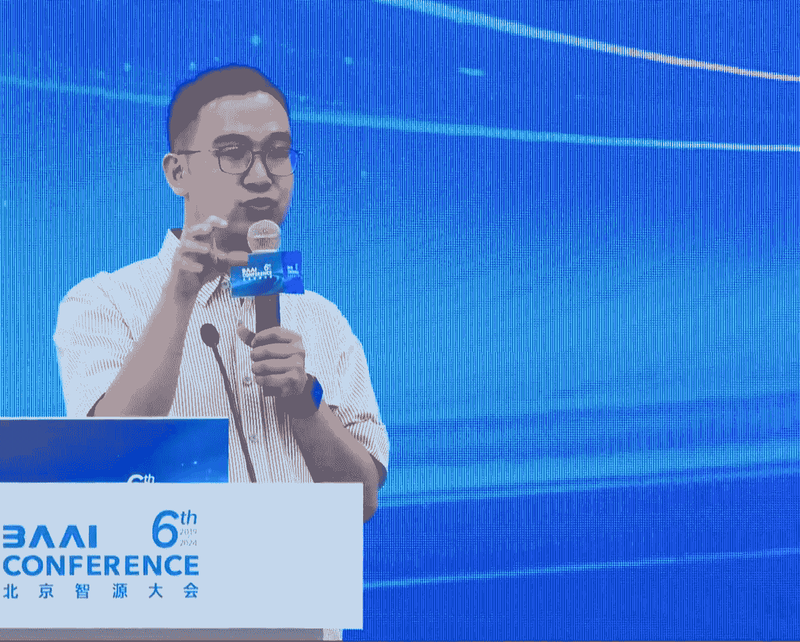

刚才所谓的这种planning，和就思考反思调用工具等等。

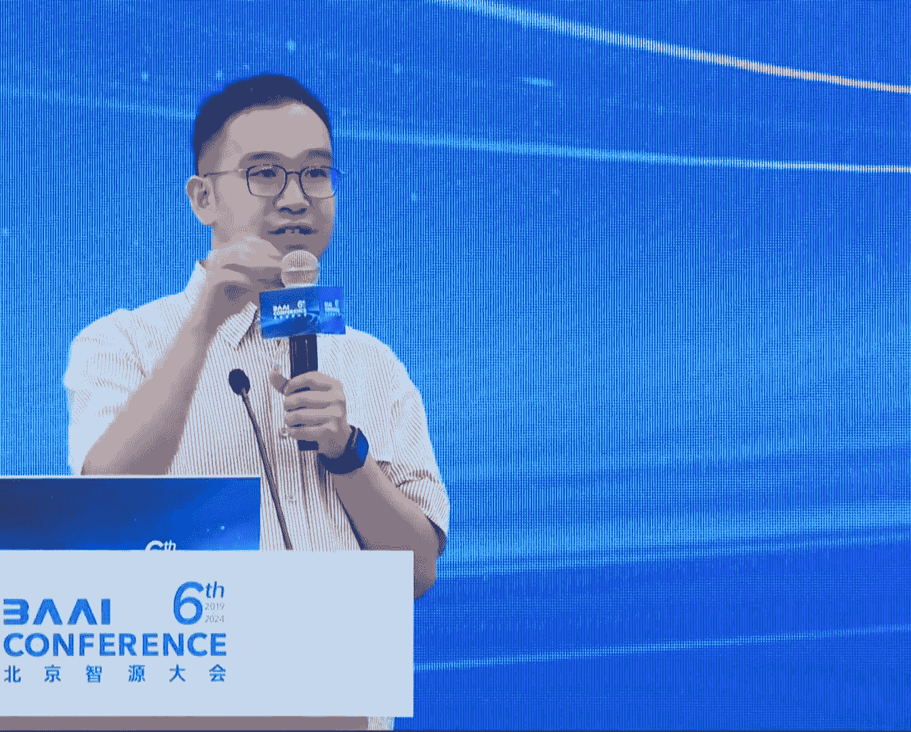

这个本质是一个是，然后再一个是说，我怎么样去真正提升模型，自己本身能够去做这件事情，这个是一定是这个过程中。

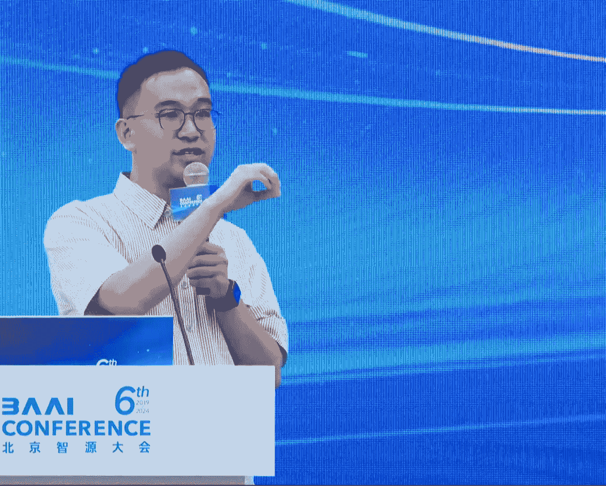

积累的这些数据和方法，要能够重新迅回到这个模型里面去，所以在我看来，这两个是一定是，双管齐下一去做的，明白，所以您觉得会比如说先通过外部的，或加一些tracer的方式，但得出来的结果，可能再返回来。

本身提高模型本身的，对，我觉得这是一个，这就两个路一定要一起走的，明白，谢谢，好。