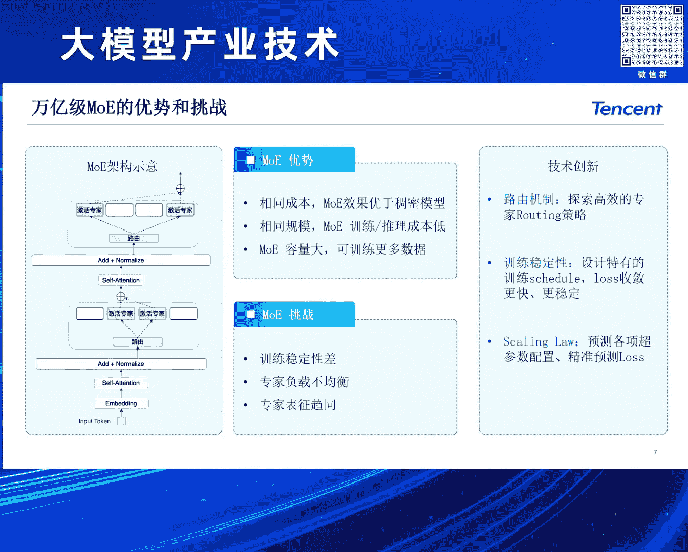
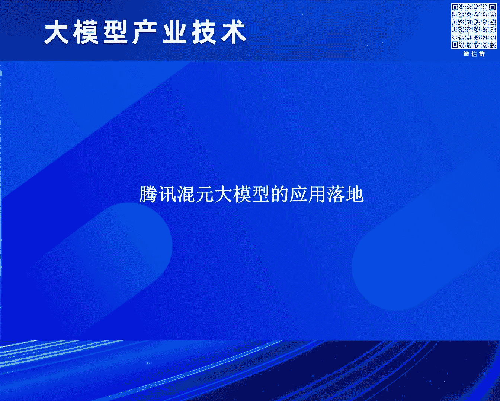
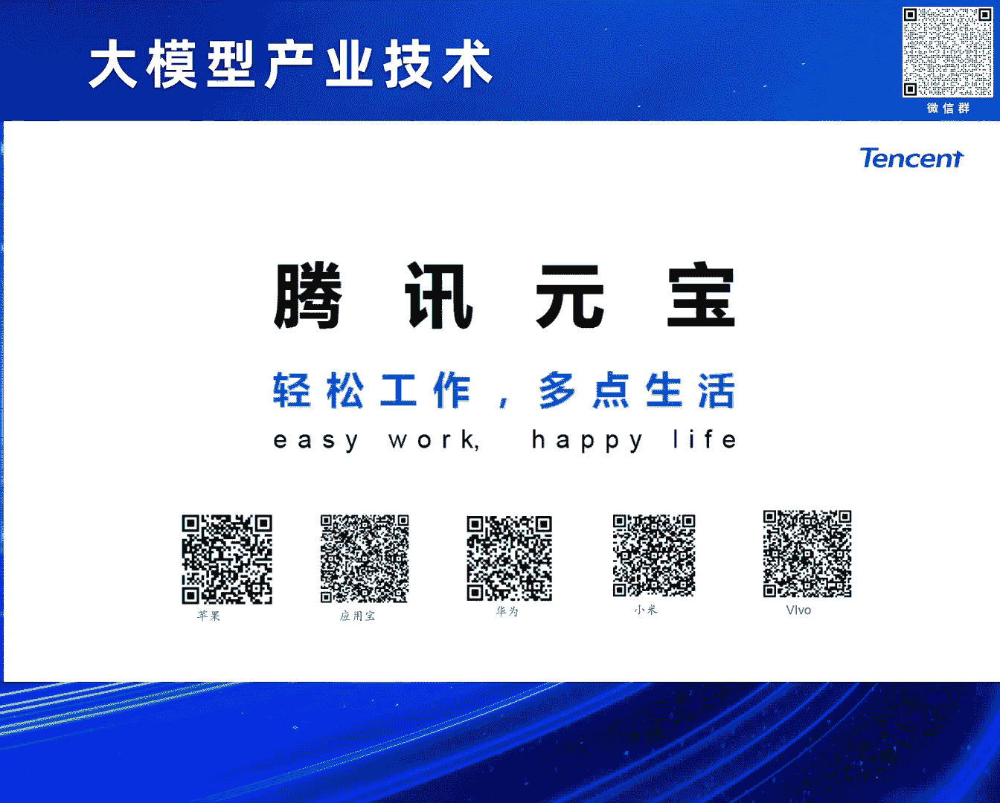

# 2024北京智源大会-大模型产业技术 - P5：混元大模型的研发和业务应用之路：康战辉 - 智源社区 - BV1HM4m1U7bM

好 大家下午好，首先感谢志源和中研院的邀请，我是腾讯会员以及DII搜索的负责人康仁辉，下午跟大家去分享一下我们腾讯会员大模型的一个技术研发。

以及它的应用落地，前面几位刚刚我们的同行嘉宾也提到了，其实诸葛恩溯源我们整个的GPT它的一个基础结构，这个transformer结构其实也不是什么新鲜的东西，是2017年其实就由Google提出来的。

一个标准的完整的transformer，实际上它是一个encoder和decoder这么一个结构，很快随着transformer出来之后，其实业界就存在三种不同的路径，最早期像18年很快。

这种双向encoder的这种典型的工作就是BERT，基本上是代表了上一代我觉得是R&P的一个跨域式的发展，在此之后其实我们国内外很多同行，实际上都在follow这个领域去做那会儿还不叫大模型。

那会应该叫portrait model，另外还一条路就是很快接着基本差不多同时，像最早的GPT-1到后面的Google的T5，很快出来之后你就会发现，这两个路径其实最早期包括到GPT-3的时候。

T5也出来了，那个时候其实大家发现整个的T5，又成为那个时代的一个Sorta模型，就是这种encoder decoder这种结构。

这两个路线就一个叫encoder decoder一个decoder only，基本上也是后来成为业界follow的一个主流，尤其是以下面encoder跟decoder这种结构。

当然上面decoder only像我觉得可能国内各家，其实大家都在尝试过，但这是到GPT-3的时候其实发现，其实这条路线上面其实当时投入最大的其实还是open eye。

包括Google自己其实也没有去follow这个路线，主要还是因为当时GPT-3，刚刚前面就讲这个scaling的问题，还是没有达到说一个效果有一个突然的跃升，所以包括我们自己腾讯会员。

我们会员其实在做大模型或者叫生成大模型之前，其实我们在2021、22年，我们上就已经在做一些跟大模型相关的，不过我们那个时候我们应该叫做portrait model。

那个时候我们是一个tube类似这样的结构，其实讲到三条不同路线，其实我们可以看一下引用了一个李察的飞马，他是一个很有名的物理学家，讲过一句话叫做说如果我不能够很好的创造，我就不能够理解。

翻译到大模型或者AGI领域，我们今天可以解读回去说，如果我不能去生成，我就不能理解，变成了今天我们通过生成式模型，去解决所有理解跟生成的问题，这个其实也是OPI的信条或者叫信章，DICONI。

这里面我提到OPI，我们就讲讲，刚才我们前面文浩不是提到，讲到OPI的信章，OPI的司管旗下，这里面我是深有认同，其实OPI我们今天整个的OPI的XGB系列，能够一锯绝尘。

我觉得他们是深刻的去践行的这四条，四条不同的思考的方式，第一个是说我们要去做，我们要做AGI很重要一点，我们要寻找正确的生成模型，我们从视频网络最早期的BP视频网络，很早了，基本上是1980年就有了。

我刚刚讲2017年就有Transformer，出来之后，其实我们发现，我们怎么能够有一个正确的模型，这个模型的吞吐，它是很容易做的，其实到后面到了22年23年，这一波期，基本上今天我觉得国内外。

我就做生成式AI的，基本上都采用了DICONI这种结构，这是一个，第二个就是我们还是，另外一个问题，我们有一个好模型架构，我们怎么Skin Up，这里面其实，刚才文豪讲到苦涩教训。

就是Jason Wei，COT的作者，他在推特里面提到了，每天都要去读宪章，然后去回顾苦涩教训，这里面其实一个背景，刚刚讲我们有一个好的模型，这个模型的参数，模型的吞吐，我们怎么去扩展。

这是涉及到一个算力问题，我们知道我们的摩尔定律，我们的算力，基本12到18个月扩展一倍，但是我们的大模型，我们去看一下，从GPT-1到GPT-3，到今天GPT-4，甚至GPT-5，可能已经在路上了。

我们发现可能很多时候，是在每一年或一年半时间，都是一个在10倍的速度去扩张，也就是说，如果我们去看模型的size，它的提升的速度，是远远高于我们的物理硬件提升，这里面我们怎么解决扩展的问题。

我觉得这里面刚刚讲，第一个我们的大Batch训练，这个也是2018年很有名的paper，那OpenAI今天能够去，训练超大型模型，它的Batch一定要开得很大，另外还有低精度的问题。

我们用最早期IP32，IP16 BF16，到今天大家可能很多的，我们的一些友商，包含我们自己，都在采用像IP8这样的一些，低精度训练，当然为着随着未来，刚才讲到IP6跟4，这是现在最新的卡。

当然国内现在买不到，但我们知道，可以看到我们不论是硬件，还是在我们的算法上面，实际上整个都是在去探索，模型怎么去能够更有效的扩展，这两个我觉得是非常重要的，它是体现了我们对世界，深度理解的这么两条路线。

另外一个就是我们看一下，后面出来这种我们的原学习，我的MetaIR，这个基本上，这有点乱，好 那我们通过原学习，我们其实可以教会了模型，怎么去做这种FieldShot，ZeroShot。

就我们的ICL能力，本身来讲我们只需要一个，Portrait Model，我们可以给一些训练样本，只要很简单，用一些任务描述，加测试样例，模型就可以follow，这样的输出，最后一个。

那就是我们的StrategyP，推出来之后，其实大家看到业界，我们有这种叫对棋，或者叫模仿学棋，其实上来讲，我们就跟教一个小孩一样，人的智能一样的，我们不需要去告诉他应该怎么做，我们只要给他一些例子。

告诉他什么对的，什么叫错的，他就会学会，这是一种模仿学习，另外我们通过强化的方法，可以更加有效的去拉高我们的天花板，那我们都知道，我们的Portrait Model，或者我们的大模型底座。

其实代表的是我们模型的上限，那我们通过对棋，通过强化学习，我们来解决的是我们的下限，怎么让它提，当然这个如果再往后讲，包括今天我们讲的这个SelfPlay，就是我们怎么让整个GPT。

从类似于AlphaGo时代走向AlphaZero，未来可能我们会有我们自己的GPT-Zero，好，那前面回顾了一下，我们整个大模型的发展历程，以及OpenAI上面的，给我们一个很好的启示。

那我们自己来看一下，我们在做大模型，其实我们面临在算法，工程，跟应用上都有些挑战，包括在工程上面，那我们的算力一方面要强，另外一方面，我们也需要一些高性能的虚拖框架，还有我们整个一站式的去做。

个人高昂的业务平台，在算法上面，我们整个的甚至是AI，我们可以看，比如像我们的大语言模型，文生文，像我们图生文，也是一种多模态大语言模型，包括文生图，包括图生文生视频，这样的一些，我们认为今天主流方法。

可能是以Diffusion为代表的，这样一些算法模型，再者之上，我们整个会员的大模型系列上面，我们目前，我们自己在公司内，我们支持了很多，我们自己包括我们的微信平台，包括我们的QQ平台。

包括我们的浏览器平台，以腾讯，在音乐，在整个我们在腾译云上面，我们就服务千行百业，事实上都在基于会员，我们在对外输出，那目前来讲，我们整个会员的模型，刚刚讲我们的公众平台，我们是有一个超大规模的。

Eagle的算计群，包括我们星海的服务器，以及我们自己自研的，RDMA的网络高速网卡集群，以及我们这种，我们的这种GPU集群，以及我们室内外，包括国内也新创了一些Eagle芯片，再者之上。

我们自己推出了，我们的Android的集群框架，我们目前我们这个会员，我们可以看，我们基本上在文生文来讲，我们大语言模型，其实覆盖像我们中小size的，就7B 13B，到我们最早第一代。

我们去年刚推出第一代的模型，是一个1760亿的，176B的模型，那到今天我们基本上，把这些模型都做了MOE化，像我们最新的，这个主模型的MOE，我们应该是国内，比较早的就推出了，万亿的MOE，再者之上。

我们自己也有一些领域的模型，包括我们这种代码的模型，我们包括我们自己代码，上来我们的会员的Codex，以及我们的可信的模型，还有我们的RAM的模型，广泛去支撑我们公司，内外大概600多个业务，目前来讲。

我们整个我们最主要的，万亿的MOE模型，我们内部中文评测上面，其实跟Jibs Tuber，应该是在处一个梯队，其实可能跟我们现在，国内的一些，我们头部的一些友商，基本上大家处于都是。

我觉得已经基本上处于一个，比较相当的位置，我们刚才讲，我们自己也推出了，我们很多的这种中小模型，包括7B 13B，当然我们可能内部，还有一些1B 3B的一些，端测模型，这些模型基本上。

我们也是做了有Dance版，跟它的MOE版，另外一个就是我们，也在我们的语言模制作上，我们也推出了我们自己的，混元的VR模型，这个模型基本上，我们在中文上面，也是跟GPCV，应该是比较相当的。

最后一个就是我们，最近我们应该是上个月，我们刚刚开源了，我们的混元温生图的DIT模型，目前来讲，应该是中文第一个，中文原生的开源的DIT模型，训练平台刚刚讲，我们自己的安卓的平台。

包括我们的安卓的训练平台，以及安卓的TOOLIN平台，重点来讲，就是它整个来讲，整个框架，我们是支持万卡规模，比我们开源的，比如说Deep Speed这样的，这样的开源框架，我们大概快2。6倍。

我们的成本，我们的GPU的利用率，我们大概给MFPU，可以做到62%，我们整个在千亿模型下，我们同等可比情况下，只要50%算力，就可以训练这样的模型，我们在TOOLIN上面，其实我们自己，也比我们现在。

可以看到的主流的，最好的开源框架，我们大概能够提升，1。3倍的TOOLIN速率，大概我们先在，像我们之前，大家很多开源社区，都在用SD的这种，维生图模型，我们可以像用一个。

最标准的Deep Speed去推的话，我们可以从10秒，可以做到3到4秒，三张图，单图我们大概可以做到，一秒以内，好，我们这里面，最重要的就是，我们万亿级的MOE的，大预演模型，我刚刚讲。

我们从去年9月份，第一次推出的时候，那个时候我们形容是，一个1176B的模型，是个千亿的模型，是个Dense的，那个时候我们大概训练的，大概有两万亿的Token，坦白讲，今天回过头去看，那个模型。

其实我是觉得，整个训练的，还是不够充分的，今天我们最新的，我们其实从去年年底，我们就开始去升级到，我们万亿的MOE的架构，这个架构下面，目前我们最新的，大概是训练了，超过七万亿的Token。

那我们最近大半年，我们其实可以看看，我们其实通过一些优化，包括刚刚讲，前面黄班在讲说，我们这个自然，这个数据的这个，现在够不够用的问题，其实我是觉得，现在整个自然数据，如果按这个趋势讲。

当然按趋势讲的话，自然数据可能是不够了，但是其实我就想，从另外一条路线讲，确实核生数据，很多时候的效果，确实比自然数据要好，这个也是个，我觉得现在可能，大家在行业里面，大家普遍都有一个共识。

包括我们了解到，像是4。25甚至5，其实里面可能有，据说有超过，将近一半的数据是核生数据，然后这里面，包括在数据层面，大量的核生数据，以及我们多种训练策略优化，还有我们的，对其整个强化算法的升级。

我们这种效果，其实比那个时候应该是，累计超过50%的提升，除了我们通过MOE之外，那我们也支持，我们一些领域的，刚刚讲，我们一些，可能在行业业务里面，关心的一些能力，包括我们的角色扮演，像腾讯内部。

我们其实有大量的这种，业务场景游戏，包括我们的这种，很多的像QQ的这种，娱乐的平台，我们需要有些角色扮演，这样的模型，包括方声call，这个是我们agent里面，最关键的一个环节，代码生产。

这个其实在我看来，代码模型其实，不光是说，我这个是一个代码的，本身的，可以用来做IDE，可以做来做Test to Circle，做提效，其实本身来讲，代码也是整个大语言模型，能够突围猛进。

这是一个很关键的环节，万一MOE的优势，其实这个也是，我觉得大家今天，可能已经成为，好像一个共识了，包括我们都知道，包括GBT 3。5，GBT 3。5 Toper，它就是一个，很小的激活量。

的一个MOE架构，包括今天GBT 4。0，GBT 4。5，包括GBT 4。0，都是一个MOE架构，那MOE的优势就在于说，我们相同成本下面，我们MOE的这个效果，是优于我们的筹码模型的，然后另外就是。

我们的序列成本，相同的规模下，也更低，另外就是刚刚讲，Scaling的问题，那我们如果，我们对Dense，当然也可以对上去，但是同等的成本下面，你会发现，那我相同的激活量，那我其实，我可以做更大的。

模型参数量，这样的话，就意味着我可以，做更多的参数，更多的数据，那当然训练MOE，其实MOE本身这个东西，其实最早，我觉得一个千亿万亿级的架构，Switch Transformer，很早就有了。

但是说实话，这个业界，其实没有太多的，最早期没有太多的，大家有这样的经验，能够训练一个，几千亿上万亿的，Transformer的这个MOE架构，其实它里面，有几个它的一些挑战，一个就是。

它的训练稳定性很差，另外就是，它是这种网络的这种Router，它的专家负载，可能不均衡，还有一个就是，它的这些专家之间，FFM其实特别容易去头，那我们怎么解决这个问题，第一个就刚刚讲，我们的路由机制。

我们要有一些高效的，一些Routing机制，另外一个就是，为了整个训练的稳定性，那我们Dance上面，我们探索自己的Schedule，在MOE上面，它有一些特殊的Schedule，包括我们要有一些。

Loss的一些设计，一些Trick，让模型可以训练得更加快，更加稳定，不要平滑下降，那Schedule上面，其实也是一样的，所有的大模型，我们今天第一件事，我很认同刚刚王浩讲的，我们第一件事。

肯定是要先做数据，先去探索自己的模型结构，像是Schedule，今天对我们来讲也是一样，我们自己MOE，我们是因为从无到有开始做，我们很早就探索了自己的各种，一些参数配置。

包括我们自己的Schedule的问题，那另外一个就是讲了，今天长文这一波，基本上我觉得是已经成为，行业标配了，那我们会员，我们自己的MOE架构，其实我们也是支持那种高效的，超长文的Tension。

包括用一些多阶段的方式，最早会开始，我们可以用平方级的Full Tension，到一定程度之后，我们可以做一些窗口外推，再到最后我们可以，甚至我们要，我们做百万级，那我们可能可以做到。

我们可以做到几乎无损，但再往上走，几百上千万，那这个时候我觉得，涉及到，你能不能接受什么样的迅速度，涉及到你有多少算力，包括你推理的时候，你能接受什么样的实验，这里面可能会有一些。

几乎无损的一些西数化方案去做，那目前来讲，我们自己原生的，我们自己API里面，我们自己会员的Pro，就是我们的万亿的MOE，其实我们原生的支持是，百万级的Windows Size。

当然我们也做了一些测试，在业界下用的比较多的，大海捞针，基本上是捞单针，我们自己也构建了捞多针，这样一些Batchmark，那刚刚讲，今天我们的大模型，其实从去年早期，大家比较关注。

说我们的知识能力的文革能力，今天其实已经演进到，大家普遍比较关心数据能力，我们认为数据能力，其实可能很多时候就代表，一个AGI很重要的一个方面，那我们自己其实也是一样，我们这里面的数学逻辑。

其实我们自己采用了，大量的核心数据，包括这种用COT，加上一些用代码解释器的方法，POT的方法，去解决我们很多高阶的数学，跟推理的问题，这里面涉及到，我们自己构建了一个自动化的，大规模的数据的合成。

以及refi的流程，不断去获取更多的，更优质的这种数理的QA对，通过这样的一些数据，我们来去做我们的，包括我们在我们的Protr，里面加了大量这种数据，包括我们在SF对齐，立秘阶段不同阶段。

去做很多这样的一些，数理能力的提升，最后来讲，目前来讲可以说，整个这个也是我们，大概最近几个月吧，经过不同维度的多次的评测，我们在中文上面，我们的数理水平应该是，整体上是接近JP斯托贝尔的。

其中我们在小学和初中上面，小学和初中数学上面，我们是超过JP斯托贝尔的，刚刚讲了我们整个大模型，这个核心的底作用力，那其实今天大模型，即使从最早期3。5，很多人觉得就，20% 30%的这种幻觉。

今年JP斯托贝尔，普遍认为有10%的，当然我觉得那个应该，指的是英语，而且中文领域，我觉得大家应该有感受，应该不止10%，就是它的幻觉力，那怎么解决大模型幻觉呢，除了这个模型必须。

就要有更大的skilling，另外就是模型本身，要训练得更充分，去降低幻觉之外，包括通过对气的方法，算法之外，其实绕不开一个问题就是，模型它没有办法，它对它没见过的东西，它对于甚至有一些。

中常委的一些知识类问题，它其实并不知道，这样的问题应该怎么回答，它这个时候如果强行回答的话，就很容易出现幻觉，那我们自己其实引入了，我们自己会员的ASO所，也就是今天我们，可能大家有体验到。

像会员的元宝，我们的元宝的APP里面，其实我们自己的ASO所，实际上是来自于，主要是说我们来自于，我们内部的包括像用了，我们微信搜一搜，整合了我们微信里面，生态的数据，包括SOGO，它是一个网页的引擎。

当然我们自己也会自建一些，垂帘引擎，以及公司内一些，其他的一些生态内容，都会进到我们会员的ASO所，主要是要解决我们的一些，信源的权威问题，还有我们的一些实行问题，那另外我们在架构上面，我们刚刚先前讲。

我们今天大模型，从System 1到System 2，今天agent这件事情，我觉得已经让整个的大模型，变成一个我们要去，从快思考走向慢思考，那我们自己的ASO所本身，我们主体的架构。

也是一个基于agent的，planner加action，这样的一个机制，那再一个就是，我们今天要去做，要做一个很好的ASO所，当然我们离不开，有一个会员的通用的一段，但同时呢，其实整个的搜索领域里面。

还有很多很特殊的一些任务，那我们需要去通过一些增讯，包括一些多任务精条，去构建我们自己的，SysGPT模型，那前面讲了我们的。

我们的文生微模型，语言模型，OK那后面接下来，我们简单讲一下，我们刚刚说我们自己，现在的会员的V2的多模态模型，目前我们会员的V2模型上面，我们内部评估下来，其实整体上中文上面，是我们是。

基本上跟GB4应该是相当的，那这里面给几个case，包括很多这种场景，那我们拍一个，我们今天吃的一顿饭，对吧，那我们可以计算一些热量，给一些建议，这个其实是典型，他要先解决他的物体识别问题。

同时他还要知道，这里面的理解你的问题，做一些COT做推导，再做一些，给你生成很多这种建议，那导游对吧，那我们再做很多的外出，去旅游，随时一拍，我们给一个景点，那我们就可以做很多很多介绍。

那我觉得我们是觉得，这个多模态这种模型，其实未来在很多应用场景下面，会给大家一些不一样体验，那另外就是我们，我们近期我们在上个月吧，是刚刚开源的，我们的文生图的会员的DIT模型，那这个模型来讲。

我们应该是在开源社区里面，第一个放出来的，中文领域原生的，这个大模型，加上DIT这种架构，那其实它，我觉得它主要是，我们有几个优化点，包括在前面，我们这里面，我们是一个多模态的，一个语言模型。

可以让这个模型，支持多轮的交互式的编辑，以及和这个chat的互动，另外我们在生成模型上面，那这个DIT本身，其实这也是，这个SORA，LINE成功的一个最关键的，核心的一个模型结构，从把最早期。

我们把unite，变成现在我们自己的DIT，可以让模型有更大的，更强的一个图像，更文本的这种，信息的捕获能力，那刚才讲到，我们会员文中图，现在也已经开源，大概我们大概三个礼拜吧，我刚才会前。

我还专门看一下，目前超过2300个star，那目前来讲，我们其实可以看一下，基本上我觉得，还是处于一个在业界吧，排名前三的一个算法吧，那当然现在最好的，DALI3对吧，Mid-range V6。

当然看最近这个SD3，可能也出来了，那我们自己其实，现在放着这个版本，我们内部其实也在，还继续沿着DIT路径，我们不断在去，做我们内部更好的模型，好那整个会员大模型，我目前来讲，刚才讲我们的一些。

除了我们这个，这是左边应该是，我们内部的一个评测，我们大概在最近几个月，每个月会有一个，这个很全面的一个，一个对标评测，我们整体来讲，刚才讲，这个GPS头本，当时最新的GPS。

应该是4月份的GPS头本吧，我们大概是略微超一点点，我觉得中文上应该是，比较相当的，其中中文上面，文科上面我们还是要，领先一些，但理科上面，我觉得还是要略低一点点，那当然，现在外面也有很多的吧。

行业有很多这种，各种这种评测，我们可以看一下，其实我觉得我们今天，可能在这个行业同行里面。

我觉得还是处于一个，第一级队，好前面讲了我们，这个会员大模型的，基础研发的一个状况，接下来给大家去，分享一下。

这个会员大模型的，在我们司令外的一些应用落地，那目前来讲，会员我们其实已经是，作为腾空公司，我觉得一个很基础的，一个团队，一个大模型团队，然后接入了我们公司里面，基本上各个业务线的，基本上主要。

一些主要头部的一些业务，大概超过600多个业务，那几个典型的场景，可能在座大家，可能在日常的工作生活中，有可能也会用过，就包括第一个，像我们腾讯会议的AI小助手，那这个实际上是一个，非常刚需的场景。

我们知道我们开个会，通常人很多，有人上有人下，然后同时可能一个会，就一两个小时，可能我们得好几万字，这些问题，面对这种场景，我们突然中间来了，我们上线了，我们去可能问，之前谁说什么东西，我们能不能很快。

去帮你做这种的问答，包括会后我们都要去写总结，写摘要，那我们今天我们有大模型，我们可以做会后的总结，包括还有一些会议代办，那另外刚才讲我们的代码模型，我们知道就是我们大量的数据，我们是存在互联网当中的。

以Plant test，以多模态形态，但是还是有很多数据，其实并不在公开的互联网里面，可能在各个企业的数据库里面，那我们其中有一个，有一个很重要的方向，叫BI方向，那我们能不能用大模型的。

用语言模型的方式的能力，去改造我们的BI，那我们叫做腾讯，我们自己腾讯的这个，这个会员的这个ChatBI的模型，可以使得我们可以做这种，很多SQL语言的这种，TestSQL的代码生成。

甚至我们可以做一些智能代理，用一些自然语言方式，去完成一些表格的分析，以及我们把这样东西，集成在我们的链路里面，让我们的整个BI，让我们可以认为说，我们过去可能需要，专门有些做BI的。

一些数据分析的同学，今天可能不需要了，今天可能我们只要是说，OK我们的一个诱方，我们就会用我们的ChatBI，用自然语言的方式，去获得自己想要的信息，做很多很多各种各样，灵活的这种数据的洞察。

刚刚讲这个腾讯会议，腾讯会议腾讯文档，是属于腾讯的Office系列，讲了会议之后，还有一个在我们日常工作生活中，经常打交道的一个产品，就是我们腾讯的文档，我们腾讯文档也推出了，基于会员的AI助手。

它支持像基于大模型的文案创作，包括这种表格处理，包括我们甚至可以去，写一段文档之后，很快可以把它变成各种各样的格式，包括能片 PDF这些东西，这个其实我觉得也是一个，我们在日常的办公，包括文字创作中。

非常常用的一个AI的能力，还有我们自己在我们的广告营销产品下面，包括我们腾讯广告的妙思，我们可以去通过会员大模型，我们可以高效去产出，我们很多广告的素材，这些素材因为是我们大模型，自己产生的。

其实我们知道在广告当中，很重要的一点就是，我们素材出来之后，我们要去人审，如果今天这个广告，是我们AI可以做出来，是我们AI生产出来，我们其实也可以通过AI的方法，去加速审核的速度。

其实可以让整个的广告投放的效率更高，包括我们也可以用，我们会员大模型，做我们很深入的，在腾讯的我们各种各样的，一些流量平台上面的，一些数据的广告效果的团结分析，甚至我们可以做一些，我们广告用户的一些。

在这个基于大模型的，推荐领域里面做一些尝试，最后这一个，也可以看一下，像我们最近应该刚刚推出来的，我们的微信读书，我们推出了一个，我觉得还是非常好用的一个功能，叫做AI问书，包括我们AI大纲。

这个其实都是基于整个会员大模型，过去来讲我们读一本书，我们中间有什么一些问题，可能我们要切出来，我们到孙燕琼里面，甚至我们到某一个大模型的，这种chat里面去提一些问题，今天我们不需要了。

我们只需要长按，我们用指尖的方法，我们就可以选取，直接可以去触答，包括这个文章内的，这个书籍内部的，以及它相关的一些知识，这个是我们新推出的，叫做这个微信读书里面的AI问书。

还有一个就是我们现在除了说，我们这个我们的语言模型，我们的多模态模型，在各个场合去发挥作用，其实我们也可以在我们的新闻，这个协作，包括海报的配图当中，以及最近我们跟这个，像人民日报新华社，也就是如媒体。

我们做了很多什么江山如苏多娇，做了很多这种基于AI创意的，很多这种宣传片，最后一趴就是我们介绍一下，就是我们大概是在上个月，5月30号，我们发布了，会员发布了全新的AI助手，我们叫腾讯元宝。

腾讯元宝来讲的话，我们目前向我们主打支持的是，像我们的AI搜索，包括我们的这种常文的这种解析阅读，我们叫AI解析，还有我们的AI写作，包括我们这种写各种各样的文章，包括我们最近，大家可能很多在高考对吧。

都关注到这个大模型，这个写作文元年，今年我觉得实际上也是，这个大家很关注一件事情，另外就是我们也有些，我们自己的发现里面的一些，AI的一些应用，包括我们一些好玩的一些生图，生视频这样的一些玩法。

整个腾讯元宝，我们的slogan叫做，轻松工作，多点生活，这个也是刚刚在5月30号，在各个市场应用市场里面去上架，也欢迎大家多体验，多提问题，好谢谢大家。

谢谢，谢谢谢谢赞辉，看看现场的朋友，有没有想提问的，举个手，那位，你好，我刚才您会议中，讲到了有一个点，我特别感兴趣，希望您能展开说一下，就是说您提到，就是我们可以用这个会员模型，去做这个广告创意。

然后广告创意里面，又可以用AI去做审核，来加速这个审核，请问在这个审核方面，你们用AI是怎么做的，或者是用了一样的，什么样的技术，能去让它能审的，能让这个广告创意，更符合物理世界，更让那个甲方能够接受。

就是在这方面，你们是怎么付出的，我想了解一下，OK 好，首先第一个，我们自己做这个AI审核，因为这个模型，就是这个素材，是整个会员自己生成的，那我们在生成的时候，首先我们生成的时候，就会让它去符合。

比如广告法，比如各个刚才的法律法规，那这个地方，在生成的地方，我们事实上是有些把握的，另外一种，我们在审核的时候，其实也是一样，因为模型是模型生成的，那我们在审的时候，其实我们也很清楚。

模型哪里可能会有些问题，我们可能会有些内部的一些，一些特征，一些东西，会辅助你去判断，这个道理有没有问题，所以我觉得是一个输入跟输出，都会做一个把控，其实这会让整个的，素材的生产的效率会更高。

好 要不然那位吧，那位再加一个问题，那位，好 谢谢，你好，我们是做数据营销的，然后我想问一下，你刚才提到，用在微信里面做AI的数据营销，能够再展开说一下吗，微信里面，我刚刚应该讲的是，微信的AI读书。

最近的问题是，还是刚才类似那个同学，做的说那个，就是广告营销的事情是不是，对 是的，广告营销里面，其实刚刚讲我们一个，腾讯的妙思平台，刚刚讲我们实际上支持，各种各样的广告素材的，生产审核这么一站式平台。

包括像这种纯文本的这种，包括这种图片，以及我们一些，这个生视频，这种短视频短片的这种，生产跟整个的这个审核，以及整个的对广告主的服务的，一个体系，基本上这么来做的，好 时间关系就先这样了。

谢谢 谢谢张辉。