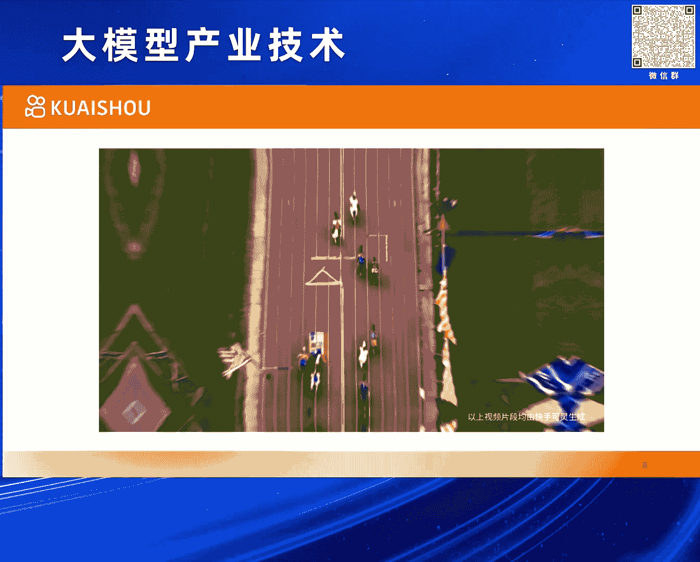
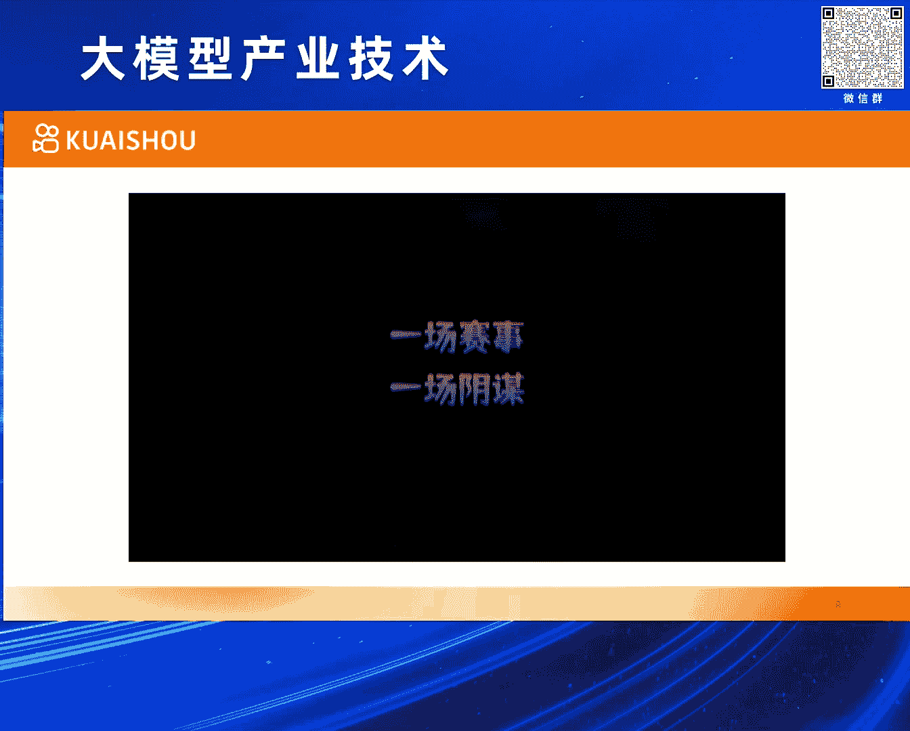
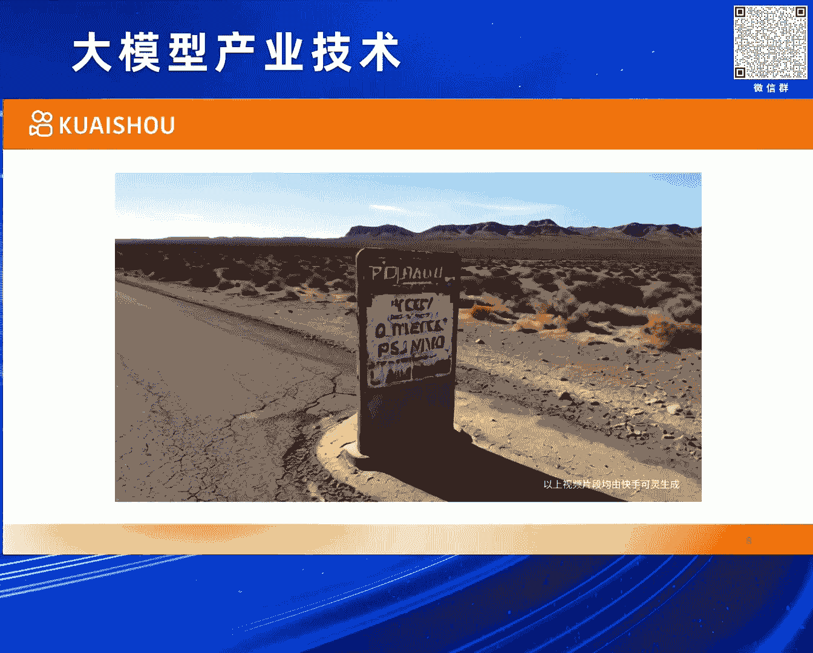
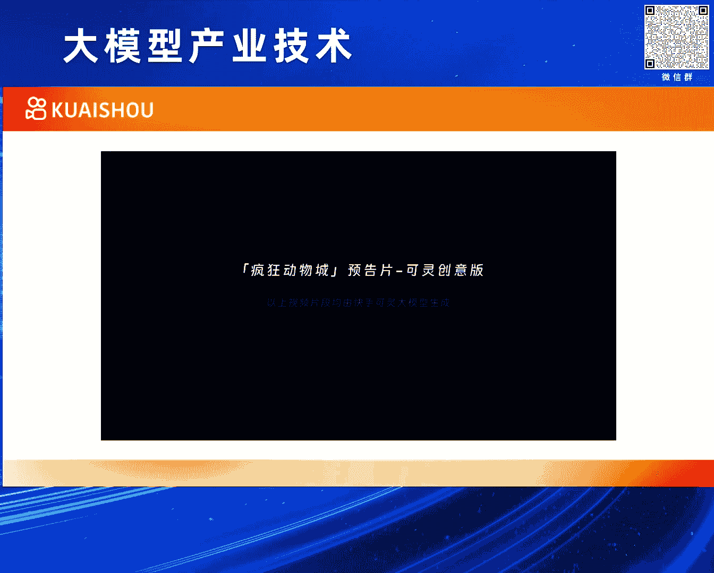
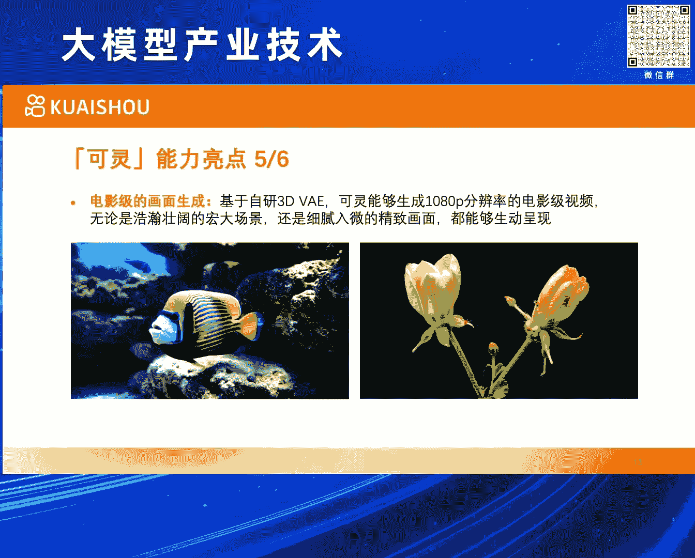

# 2024北京智源大会-大模型产业技术 - P6：可灵(KLING) 视频生成大模型：万鹏飞 - 智源社区 - BV1HM4m1U7bM

感谢众员的介绍，今天非常高兴有这个机会，跟大家介绍一下我们6月6号一周之前，发布的快手克林视频生成模型，我叫万鹏飞，快手可能也不需要太多介绍。

就是快手的slogan叫拥抱每种生活，所以快手是一个拥有将近4亿DAU的，一个短视频的一个内容平台，所以可想而知视频这种内容的形式，对于快手来说是非常之关键的，然后围绕着视频的各种各样的技术。

包括应用也非常的丰富，我们快手在整个大模型这个方向上，其实也有比较广泛的布局和丰富的铲除，这个可以简单分为三层来理解，对底层的话inferior层，这个就是做大模型是一个庞大的，复杂的系统性工程。

需要有AI的平台，然后数据的平台，还有评测的平台等等，这样的一些基础设施作为支撑，再往上的话对于快手来说，其实快手里面的内容的形式是非常丰富的，包含了像大语言模型，多模态的理解的模型，以及图像视频语音。

包括3D的这种生成的模型，对于快手来说都是非常有实际的意义和价值，所以我们在这些方面上都有非常大的投入，和好的铲除，对往上一层的话的应用，从大的方面来讲的话，就是内容的生产创作，内容的理解。

以及内容的分发匹配，基本上在这三个大方向上的话，就可以然后涵盖快手里面的，大部分的一些业务场景，所以可以想象的是说快手的大模型，然后我们做这些事情的话，第一我们是有实际的应用场景。

另外的话我们在这方面的一些技术上，也有深厚的布局，然后最终的话是能够形成这样一个商业的闭环，今天跟大家讲一讲可林，可林本质上是一个视频生成的模型，所以还是有必要讲一下，什么叫视频生成，给它一个定义。

这是我给的一个不太严谨的定义，当然视频生成好像也没有一个官方的定义，然后不妨给一段描述，通过生成是AI的技术，将用户的多模态输入转化为一个视频的信号，这里面有几个点，第一个是说用户的输入。

用户的输入它本质是一个多模态的，真正的视频生成的话，用户可以输入他想要，他对于这个内容的各种各样的一些想法，可以是文本，可以是图像，也可以是一些动作，然后其他的一些控制信息。

然后最终它的输出应该是一个视频的信号，从对计算机来说，它其实就是一个在一个2D的空间上，再加一个时间纬度的这样一个散为信号，用到的技术的话，就是如果我们讲视频生成的技术的话。

我们一般来讲还是说它是用到了一个AI的技术，特别是生成式的AI，所谓生成的AI，从数学上来讲的话，可以简略理解为，就是从一个某一种随机的一些造成或者信号，然后经过一系列的计算处理。

然后得到一个目标的信号，这个目标的信号，可以认为是在某种目标的分布下的一个采样，然后另外的话想跟大家聊一下，就是视频这种信号它的获取方式，通常来说可以用这三种方式来涵盖，第一种方式叫相机拍摄。

相机拍摄大家比较熟悉，大家拍一个视频，包括在快手上，然后我们拍一段视频，这就是相机拍摄，我相信大家都应该做过这样的事情，然后拍一个视频，然后传到网站上，或者自己来留作纪念都是可以。

它本质上是将一个物理世界的一些光的信号，转化为像素的信号，OK，还有一种视频的获取的方式，叫图形渲染，它本质上是将一些预设好的三维的模型，包括它一些材质的信息，通过一系列的模仿物理现象的一些计算。

然后得到了像素的信息，所以它不存在说光到电的一个转换，它所有这些都在计算机里计算出来的，OK，然后它这里面大部分的计算，其实都是叫是确定性的，就是它有一些公式，这些公式是描述了一个场景。

它应该是长成什么样子的，OK，第三种的话就是我们今天要讨论的视频生成，它本质上来讲是说从一个，它本质上是一种从目标的分布中采样样本的一种技术，这个样本，然后去本质上一个三维信号，这个三维信号解码出来。

它就是一个可以转化成一个个的像素，就是大家看到的视频，这不同的方式其实都有它们各自的优缺点，对吧，像相机的拍摄使用成本很低，但是它内容自由度是受限的，为什么，就是拍摄本质是就是3D世界一个投影，对吧。

3D世界长啥样，你拍出来也就是啥样，很难有些天马行空的一些想法，图形的渲染的话，它的好处就是效果可以很精美，对吧，游戏特效等等，这些动画都可以落在这个范畴，但是它的使用上手成本太高了。

就是正常普通的人是没有能力去真正做一个动画，或者蹬一个游戏出来的，对吧，包括说元宇宙前几年非常火，最后的话其实也是最大的限制，也是它的一个成本的一个问题，而视频生成的话。

它的好处是它的内容自由度非常的高，就是它的内容是可以天马行空的，包括概念的组合，然后它一些各种各样的想象中的一些场景，对吧，然后包括一些仿真的场景，它都可以做得很好，它内容的自由度非常高，但是过去的话。

它最大的一个问题在于它的平均效果水平是有问题的，如果大家关注这个方向的话，就可以知道，就是这块领域一直是备受关注，因为这个事情的价值很高，但是过去这么多年的效果一直是有问题的，对吧。

就是它的平均效果水平有问题，那只倒是说最近一段时间有一些新的技术，新的产品出来，然后把它的效果的下限也往上给提了起，OK，所以视频我们来讲是说它的获取方式的话，第三种方式它有它的非常大的一个潜力。

本质上是跟前两者是平行的，从技术的角度来说的话，有几种，我先讲现在比较流行的一种，对吧，就是视频生成是用Diffusion Model，就是扩散模型，对吧，它可以，它本质上是一种数学叫什么。

就是一个模拟概率采样的一个过程，其实它是一个思路，它里面的一个核心是用一个神经网络去预测造生，那用什么样的神经网络，其实这个是Flexible的，比如说早期很多人用CNN的一些方式去预测造生，为什么呢。

是因为CNN它天然的对图像这种信号的话，在过去几年就是表现的性质还是不错的，对吧，然后它的整个设计的原理，卷积的这种方式也比较适合图像信号，所以很自然的就会有一些方法是用CNN的方法去预测造生的。

那现在也会有一些方法是用Transformer的方式，用Transformer这样的一个这一类的结构，在扩散模型里面去做造生的预测，这里面包含了各种各样的一些技术，包含有产品对吧，包括SORA。

包括快手的可林都是落在这个范畴，那它最大的优势和好处在于，Transformer本身它具有比较好的Scalability，对吧，那这个事情就是在其他大模型里面是被反复验证了。

然后在扩散模型的这种语境下的话，也被观察到具有这样的一个性质，所以现在有很多的方法可以转向用Transformer来做，本质上还是有它有很好的Scalability性质，当然还有一些技术的路线。

比如说Auto-regressive的路线，对吧，这样的方法它在概念上也是很直接很make sense的，对吧，因为是一个视频的信号，你是可以把它当成是一种带有某种序列关系的信号的。

那用一个Auto-regressive的方法，然后来对它建模，其实也是非常make sense的，只是说现阶段里面有一些新的方法慢慢出来。

然后只是可能当前这个效果可能还是不如Diffusion Models的方法，但是也是一个合理的路线，当然生成式AI，其实但凡是一个生成的AI。

它只要能够概念上把一个噪声一个随机信号转化成一个目标信号的话，它其实都可以做信号的生成，因为视频也是一个信号而已，所以其他的像概案唯一的这样的一些方法也可以做视频生成，那快手做视频生成的优势。

第一点是特别重要的，就是快手本质上就是一家视频的内容平台，所以这个场景用户的需求应用的场景是天然存在的，这是一个非常非常重要的前提，可能非常多的技术的研发，其实都是要遵循这样一个重要的前提的。

这样的话它让我们能够在做的过程中，基于我们过去对于视频这种内容的一些认知，积累的技术，然后及使用户的反馈，让这个技术能够真的越做越好，当然对快手来说，我们快手从诞生第一天开始。

其实像内容的生产创作就是一个需求，最早的快手是技术快手拍技术的，对吧，然后后面就是拍视频，其实用户的需求，我们一直是在不同的阶段，用不同的技术方案去满足用户生产创作的需求。

所以在这上面我们有超过10年的技术积累和实战经验，以及说我们在大模型领域的布局非常全面且坚决，曾经推出了备受好评的快意大圆模型和可图，文生图模型，效果都是非常不错的，好，那接下来就正式介绍一下可林。

可林如果用一句话然后来描述它的话，它可以这么去说，它是一个可以实际体验的，并且它的效果是呈现了很多SORA这个级别的性质和效果的这样一个视频生成模型，OK，这是可林的官网，大家可以看一下。

那目前的话我们的生成的视频，从应用的指标上来说，它的分辨率可以高达1080p，时长的话可以长达数分钟，然后我们目前开放到了线上的那个版本的话，分辨率是720p时长是5秒钟的，OK。

然后我们自从发布之后也收到了很多的关注，就是这个申请量是非常之爆炸的，我们也在积极的想办法。

能够让大家都能够尽早的体验上，这个就是在我们的快眼APP上有一个体验的链接，就是大家可以提交，不过现在已经好几万的申请量了，我们的就是还是受到了很多的关注，包括好像还有些外国人在各种想办法。

然后拿到中国找到中国手机号来体验我们的模型。

好，那关于可林的话，可能还是先从一个直观的一个例子上来给大家介绍一下，我先声明一下，这个例子是我们的内部的同学，不是什么专业的创作者，内部的同学花点时间用我们的模型做出来的一个小短片。

他大概可以大家可以体感为，这就是一个普通人，然后用我们的模型花一些时间，然后能够做出来的一个效果，然后我们实际上因为我们实际上线了，我们有很多的实际体验者，然后创作者在我们群里。

其实我们发现他们比我们会玩多了，他们做出来的视频品质比这个要高了，我之所以放这个视频，更多的是让大家有个体感。

就是说我们普通人如果用可林模型能做什么，今天是动物场一年度的自行车比赛。

你们俩准备给谁投票，贺尼胡先生身材健硕，我们袋鼠喜欢，我们老侯家当然是支持嘎嘎星的，什么东西过去了，这次我们的比赛是由于我们的设计，所以我们的设计是比较简单的，但是我们的设计是比较简单的。

所以我们的设计是比较简单的，但是我们的设计是比较简单的，所以我们的设计是比较简单的，所以我们的设计是比较简单的，所以我们的设计是比较简单的，所以我们的设计是比较简单的，所以我们的设计是比较简单的。

所以我们的设计是比较简单的。

所以我们的设计是比较简单的，所以我们的设计是比较简单的，所以我们的设计是比较简单的，这个就先给大家一个直观的体感。

然后接下来，接下来我们先从它的一些效果的亮点来展示，然后我总结了六个亮点，讲完这六个亮点的话，我会再去讲它的技术方案里面的一些设计，如果从效果来说的话，第一个亮点应该叫大幅度的合理运动。

因为这个事情对于视频生存来说，是一个相当本质的事情，因为它跟图像最大的区别，就带了一个时间的区别，所以运动的建模，运动的幅度，它的一些合理性，是衡量一个视频生成模型的能力的一个非常重要的因素。

所以我们用到了一些3D时空联合注意力的一些机制，然后建模复杂运动，可以看到生成的这些case的话，就是整个运动的话，不管是幅度和合理性来说都是非常不错的，比如说左边这个视频，这里面有很多东西在运动。

首先镜头在运动，然后马在跑，它后面的尘土在运动，这个人也跟着马在上下颠簸地运动，所以这里面涉及到很多的运动，包括它的运动幅度，然后整个结构，都是相当可以的，右边这个熊猫，这个例子好像也有很多人拿来讨论。

就是说熊猫按吉他，它的一只手是要在那扫，一只手还要按那个品，可能还要摇头晃脑一下，整体的这些运动，不管是精细的程度和它的一些幅度合理性来说，都是相当不错的，第二个亮点我们总结了，叫分钟级的长视频生成。

这个事情就是说，对于一个视频生成来说，它在实际使用的时候，往往在很多时候的话，还是需要能够达到一定的长度的，即使对于一个短视频的平台，短视频的公司，它的视频最起码也得有个十几秒吧。

OK 我们展示了我们的模型具备生成，分钟级的长的视频能力，那下面这两个case，左边这个是一个小孩，穿着蓝衣服戴着头盔，骑自行车的一个小孩，然后在一个公园里面骑，它的场景是在慢慢地发生四季的变化的。

然后它在公园里面也会拐弯什么的，这里要说明一下，就是骑自行车，这个事情本身就是比较有挑战的，其实很多产品是搞不好这个事情的，因为它要知道脚要踩在这个地方，然后它要联动着杆，然后车要往前去骑。

包括它的身体的姿态要跟着去变，所以骑自行车本身是一个比较tough的case，但这里面我们重点要讲的是，它是一个长的视频生成，右边这个是描述了一个火车的车厢里面，从窗户往外看去，然后外面的景色的宫替。

这个视频比较长 有两分钟，有一段时间是一个小镇，然后雪地 然后草原，后面还有大海等等，这里面的话就是，一方面是我们模型有比较好的扩展能力，另一方面的话，也依赖于我们一些高校的训练和推理基础设施。

所以可以看到这种长的视频生成，它的整体的一致性还是相当不错的，很难看得出来这里面突然就变了，崩了 还不一致的问题，第三个能力的亮点，我们叫它模拟物理世界的特性，这个也是非常重要的。

生成的东西它要符合物理规律，比如说左边这个，应该是在咖啡里面倒牛奶做拿铁，首先这个杯子，然后牛奶要留下来，它是一个流体的状态，进了杯子之后，水是不能从杯子里面渗出来的，然后慢慢的水面要往上去上涨。

这就是一个典型的这种体现了，这里面一些流体的这种物理规律的case，右边这个case好像非常多人喜欢，好像我们的模型在吃东西这个场景下，能力非常的强，老外好像也很喜欢这个case，就是吃面条。

吃面条这个case其实很难，大家想象一下，手要以某种姿势抓着筷子，筷子要伸到面里面把面夹起来，这个面还是软的 它要抖，这个人还要张着个大嘴巴，把那个面给吃下去，然后咬断，而且其实他吃了面之后。

嘴巴上还沾了一些油，这里面有很多的一些很有挑战的东西在里面，包括我们吃汉堡那个case，好像也是比Soran那个吃汉堡的case要好，这就是讲的是模拟物理世界特性，这个也是非常之重要的。

或者说它能够反映一个视频生成模型。

它有没有真正学到东西，第四点就是丰富的强大的概念组合能力和想象力。

这个是生成模型与生俱来的一些规律。

但是我们这个效果也是非常的好的。

比如说左边这个是一个小白猫，然后开着一辆黑色的跑车。

在城市街道里面走，然后后面有行人和车经过。

这个小白猫握着方向盘，然后走过右盘，然后包括他车漆上的一些反光，这种很显然是现实世界中不存在的东西，右边这个就更存在了，就是一个杯子里面有一个火山爆发，然后岩浆还流了下来。

这些都是能够非常好的去呈现一些。

天马行空的想法。

第五个亮点是指电影级的画面生成，就是说它生成的画质要能够达到非常精美的程度，比如说这两个case，这个鱼我个人是蛮喜欢的，首先它整体的细节还是非常丰富的，另外它在水里游的动态看起来是不违和的。

如果它在水里不怎么动就在那飘。

那很显然就不是条真的鱼在那游了，然后右边这个花其实也是非常有挑战的。

它的挑战在于说一个花开的过程。

这种现象在现实世界中是非常少。

就是即使在我们的视频，大家平时见到的视频里面，很少有视频是记录这样的场景的，但是我们的模型能够把这个东西呈现出来，那说明它是学到了一些东西，能够把一个不太常见的现象给呈现出来。

第六个能力亮点叫，支持自由输出的视频宽高比，就是我们的模型可以指定任意宽高比的输出，小狗带着墨镜 科技带着墨镜，在热带的沙滩上走这个case，都可以 它会自适应的生成合适的内容。

OK 接下来再讲一些技术上的东西吧，第一个讲模型的设计，我快点说吧，第一个讲的是说影空间的边界码，就是说处理视频这样的信号的话，如果在原始的这种像素空间上做的话，这个是非常不划算的。

它里面有很多的信息冗余，计算的消耗也非常大，视频信号大家都理解，就是非常大，所以我们设计了一套3D VE的结构，然后能够对视频信号向下压缩，其实这个3D VE要做好还是挺不容易的。

它既要能够很好的压缩这个信号，同时还要能够具备，不要有太多信息损失，还能够具备很好的生成能力，然后保持这个画质，第二个是从网络基础结构来说，我们是用了一个transformer的这样一个结构。

然后做扩散的过程，并且我们验证了它的scalability性质，这个是对一个大模型来说非常关键的一个性质，持续信息建模的话，刚才也提到了，我们是用一个时空3D的一个联合建模的方式。

能够把这个时空的整个的感受也打开，然后增加模型的能力，还有一个就是说一个文本扩展编码，就是文字怎么去输入，这里面会用到了一些大圆模型相关的一些能力，然后能够确保是说它能够很好去响应文本的输入。

数据也是非常重要的，对吧，我们有一个高度自动化的一个视频的数据的一个平台，另外的话，我们有非常精细的这种视频的标签体系，帮助我们去把一些这个不合适的，对吧，然后或者质量低的，或者各种各样不符合要求的。

然后的一些数据给筛掉，确保我们训练的数据的质量，然后训练数据里面除了视频之外，还要有对应的文本，所以我们研发了一个Caption的模型，专门用来做视频的这种文本的描述，最后一点就是说数据驱动的效果评估。

这一点对于模型的迭代效率是比较有关键的，就是说我们不断有新模型的产生，我们怎么去评价一个模型比之前的模型好了还是不好，对吧，如果请人来看，这个东西一不准，二效率比较低。

所以我们有一个数据驱动的一个评估模型，计算这一部分的话，有分几部分，第一个是说算法本身，扩散模型本身是可以有不同的求解的方案的，所以我们在这里用的是一个传输路径更短的，一个Flow based的模型。

这个它有比较好的这种效率和效果上的一些性质，这个是目前还是算是比较先进的一些模型，另外的话在训练的话是一个大范围的，一个分布式的训练集群，然后来保证我们的训练效率。

然后在训练的策略上的话也有一些特殊设计，对吧，就是比如说分辨率由低到高，低分辨率的时候可以多过一些数据的概念，然后到高分辨的时候，然后来提升它的品质，所以是可以结合量与质的优势。

另外我们的模型是有很好的能力扩展能力的，首先刚才讲了，它是可以支持输出不同宽高比的视频，另外的话它可以在时序上做延展，这个时序的延展就可以延长视频，或者让一个图像变成视频。

或者是在把视频做一些插帧等等操作都是OK的，另外的话就是支持多模台输入的可控，因为如果仅仅是文本作为输入的话，那在实际作为一个产品功能上的话，它还是有很大的使用的门槛和交互上的不合理性的。

所以我们是支持各种不同模式的输入，确保最终内容是符合用户的预期的，回到最开始的概念，视频生成是将用户的多模式的输入转化成一个视频信号，所以这个多模式的输入这一点是非常重要的，而不仅仅应该是文本。

如果展望一下未来的话，第一个是说我们可以看到视频生成的效果是在快速的提升的，它已经能看到一些case，比如说它的质量已经接近于视频拍摄了，也会有一些case，然后它的质量接近于图形渲染。

随着这个效果提升越来越快，它会对一些相关的行业带来一些机遇或者是变革，另外的话视频生成将视频创作的门槛和效果的ROI大幅提升，这样的话视频创作者和消费者的界限会逐渐的模糊。

假如有越来越多的视频的消费者变成创作者，对于整个视频内容生态的繁荣是非常有价值的，在技术层面的话很显然技术在快速的发展，不同的模态在不断的融合，包括理解和生成这两大任务也在融合。

第二点是说有好的技术不意味着有好的产品，这里面是存在一个巨大的鸿沟的，所以这里面有非常多的工作，然后它能够真正的把一个好的技术推向市场，当然是从技术的基础创新也是非常重要的，生成是AI的技术。

它本质上是一些生成是AI这个任务的一些基础的一些做法，然后在不断的更新迭代，然后带来各种不同的应用的一些算法，然后再带来一些产品的一些效果的提升。

最后打个小广告，我们在招人就是实习校招社招，如果对我们感兴趣都可以联系我们。

谢谢，谢谢老万。

对现场朋友有没有想提问举个手，万老师您好，非常感谢您的精彩分享，也非常佩服贵公司的模型，可林大模型特别厉害，然后能不能向您请教一下，您觉得大概在未来五年左右之后，有哪些是模型大概率肯定比人类创作的好的。

然后哪些是人类导演还能保有一些优势的创作技能，或者流程或者领域什么的，您是大概怎么认为的呢，谢谢，我觉得首先不应该把这个东西隔离来看，对吧，就是模型做什么人类做什么，本质上它长期会是一个共创的逻辑。

对吧，然后技术是帮助人们解决一些实际的需求的，如果从五年的维度来看，我如果看技术这个事情是相当有挑战的，按照现在的技术发展规律，但是如果按需求来说，我觉得还是可以看五年的。

比如说每个人都有表达自己的需求，它的一种体现形式就是内容的创作，但是内容的创作它是有门槛的，创作出来的内容，普通人效果可能是有问题的，对吧，所以不同的需求是一直存在的，不同的时间阶段的话。

是有不同的技术满足，但是即使到现在，比如说用户创作视频的这种需求，也没有被很好的去满足，所以从需求的角度的话，我觉得未来在五年代，这个需求一定还是存在的，只是说我们怎么去解决它，我们可能会有在不同阶段。

有不同的方式，但本质上它应该是一个机器和人，然后协同来解决一个实际问题的，这么一个模式，所以不需要割裂来看，对吧，好的，谢谢，谢谢，把提问的机会留给其他的，好的，后面的可以穿黑衣服的，谢谢王院长。

我今天问题有点多，对我第一个问题是，方便说一下可怜的规模吗，参数量规模，如果不方便可以不说，不方便，好的，对，然后第二个就是我们训练的话，就是说训练的计算规模大概是什么样子，大概是用多少张卡训练的这种。

不好意思，好，我第三个就是，比如说我们这边去生成一个5秒的视频，这边一个生成5秒视频，大概所需要的一个时间和成本，大概是多少，如果你实际去用快影上的东西的话，就是你提交请求三分钟输出结果。

是完整的一个生成时间，5秒钟需要三分钟来生成，对，一个端到端的，产品级的端到端的，等待时长是三分钟，对，所以我们实际下面运行的是A100吗，对，我觉得这是一个选择，对吧，它就是不重要，对吧，好。

估计4090也可以，好好，我觉得可以说的一个是说，这个在可怜这个事情肯定是一个非常复杂的，然后重资源投入的，然后多兵种协作的，这么一个复杂项目，它肯定不是一个单一的，有个天才的想法。

然后啪啦啪啦随便这样一搞就搞出来的东西，好，给这边的同学一个提问机会，就那位同学，感谢您的分享，我刚刚看到我们最后有句话，就是说我们这种好的技术，然后离我们好的产品，然后其实还有一些鸿沟。

就是我本人是一个产品经理，所以我对这句话很感兴趣，就从您的角度来看的话，就我们可怜这么好的技术到一个好的产品，还差那些鸿沟可以被去去被填平，谢谢，这个问题挺大的，首先它可以有不同的产品形式形态。

然后来满足不同的需求，如果寄希望于说它是一个统一的产品形态，满足所有的需求的话，那有的场景可以，但是在视频的生产创作上来是比较难的，一个现实世界中的一个视频的创作的工作流，还是比较复杂的。

所以上从基础的模型到上通应用这一层，是目前来看是不太可能做得很薄的，当然大圆模型可以做得比较薄，但是对于视频来说是不太容易做薄的，以及说不同的领域的视频的生产创作的需求，是应该有不同的方式进行满足的。

它对应了不同的产品形态，这就是先就是大概括的来说，然后具体来说的话，就是对吧，就是一个AI的产品，现在被大家诟病比较多的是说，它的留存等等这样的一些问题对吧，所以它反映出来了一些共性。

就是说我们要重视在产品的打造，包括用户的一些人际交互方面的设计等等，这些工作非常重要，好，最后一个问题吧，这位女士，王老师你好，我想问一下就是可林这个项目的话，我们什么时候是正式可以开源，然后第二。

然后还有，然后就是我想问一下，现在不是线上可以去申请试用吗，然后这个试用的话，就是我是是可林提供了这个算力，还是说我需要对我自己的电脑，这个需要有显卡的要求，第一个什么时候开源，这个事情，我们会我们会。

其实我们放你刚才讲的是，我们放出了一些，我们的一些关键的一些判断和设计，然后未来我们也会把一些，一些一些硬核的东西，然后逐步的上释放出来，然后让大家然后一起来，一起来交流学习，我觉得这是第一点。

至于你说的这种一股脑的开源，这个事情我们，可能还是要去谨慎考虑的，就是肯定不是不是那么简单的事情，就是目前还是没有这个打算，OK，然后关于你说的是使用的时候，我们目前开放过来的用户使用。

都是提交一段文字对吧，然后我们自己的服务器，然后给你反映一个结果，不需要你们不需要自己的机器，对吧，都在云端生成的，对对对，好时间关系，这个问题可能就先到这，問題可能就先到這。

