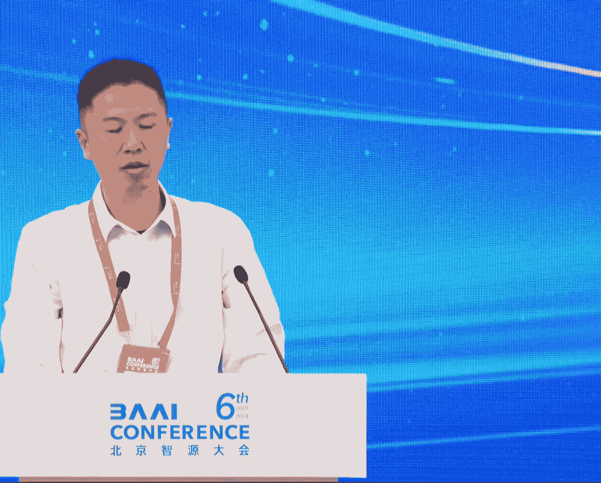
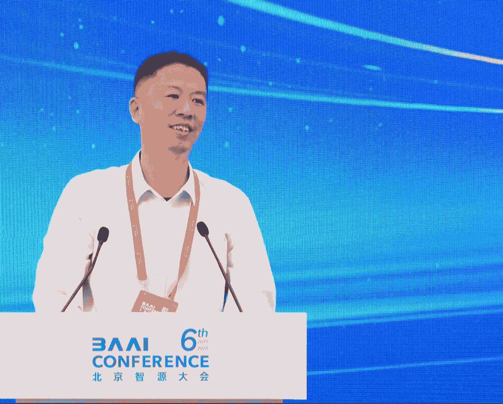

# 2024北京智源大会-大模型前沿探索 - P1：论坛背景与嘉宾介绍;李永翔 - 智源社区 - BV1yS411A73A

[音乐]，尊敬的各位嘉宾，社会各界的朋友，大家上午好，欢迎大家来参加志愿大会，大模型前沿探索论坛，本论坛的重点在于特别看重，大模型前沿技术的发展，我是中国电信人工智能研究院，林永祥，很荣幸。

今天由我和智能，智源研究院青年科学家王燁泉博士，共同担任论坛主席，我们知道，随着深度学习技术的迅速发展，以GBT系列为代表的大模型，取得了显著的成果，我们这个论坛的主题，是大模型的前沿技术探索。

其致鲜明来说，我们是用前沿技术，去解决基础的问题，有哪些基础问题呢，我们都知道，大模型的研发和应用，仍然面临着诸多的挑战，如训练成本的高昂，能耗问题，对齐的质量，以及大模型和小模型的，协同训练和推理。

机器学习理论的反思，以及无约束感知，从视觉的垂直领域，到多模态的统一架构，现在人工智能的大火，很多程度上得益于技术的突破，随着技术突破，慢慢进入深水区，那么接下来，在学术界和工业界的方向。

将会成为一个至关重要的问题，今天在本论坛，我们也会对本问题展开，探索和讨论，下面由我来介绍。

今天出席的论坛嘉宾，王燁璇博士，智原研究院研究员，青年科学家，国家新一代人工智能，国家科技重大专项负责人，FALM团队负责人，清华大学博士，中国人工智能学会，巨神智能专委会委员，王燁璇博士。

是本次大会的，和我一起的大会主席，王燁璇博士，宋双勇博士，是中国电信人工智能研究院，雨衣大模型团队负责人，高级算法总监，集团高级专家，博士毕业于，中国科学院自动化研究所，先后在阿里巴巴和京东科技。

担任算法负责人工作，目前负责中国电信，星辰雨衣大模型，和智能对话等算法研发，宋双勇博士，敖翔博士，中国科学院计算技术研究所，副研究员 博士生导师，CCIF高级会员，先后主持国家重点研发项目，科技一项。

国家自然科学基金项目三项，是担任曾获得多项阿里巴巴腾讯奖项，入选了北京市科技新星，中国科学院青素会，以及担任多项学术会议的程序委员，敖翔博士，黄磊博士，北京航空航天大学，人工智能学院的副教授。

研究方向主要集中在，深度学习训练技术，以及理论分析方面，最后我来介绍赵建博士，赵建博士是中国电信人工智能研究院，多模体认知团队负责人，青年科学家，西北工业大学光电院研究员。

博导 博士毕业于新加坡国立大学，曾获吴文俊人工智能优秀青年奖，吴文俊人工智能自然科学一等奖，赵建博士，好 下面开始我们的主题报告环节，第一个首先由我来给，由王燁璇博士给大家带来，全球首个单体万亿稠密的。

大模型的报告，Pyli-FAR-1-TB，是全球首个低碳的，开源多语言万亿稠密大模型，由智源研究院和中国电信，人工智能研究院共同研发，针对大模型超三敏感，成本极高等关键问题，研发了损失预测。

生长技术等核心技术，实现了大模型训练零调整，并在892张A800计训环境中，成功实现了万亿稠密模型的训练，是全球首个实现了，低碳预训练的大模型，欢迎王博。

