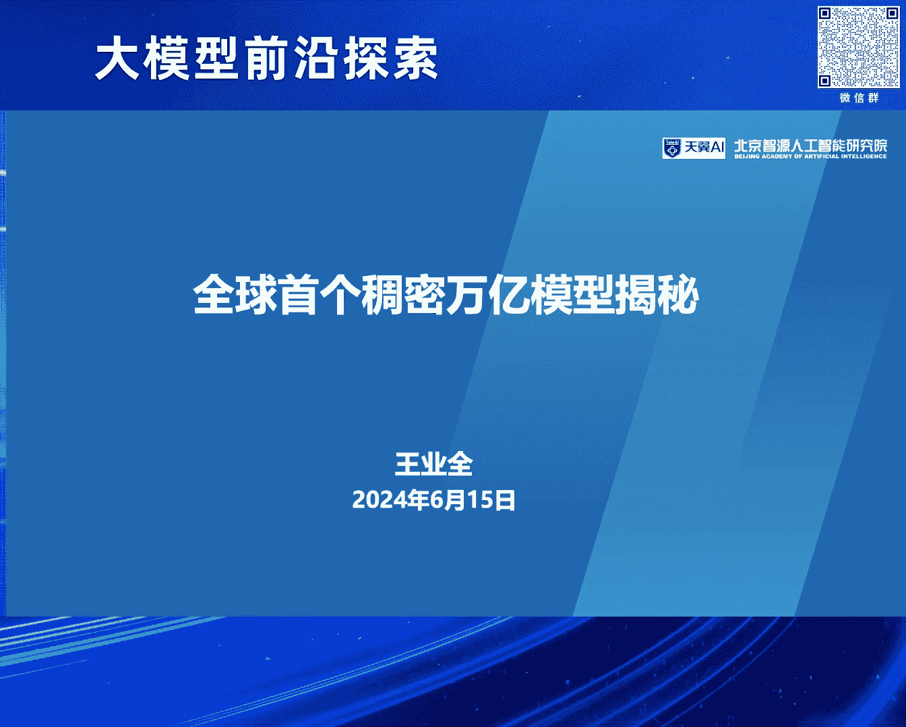
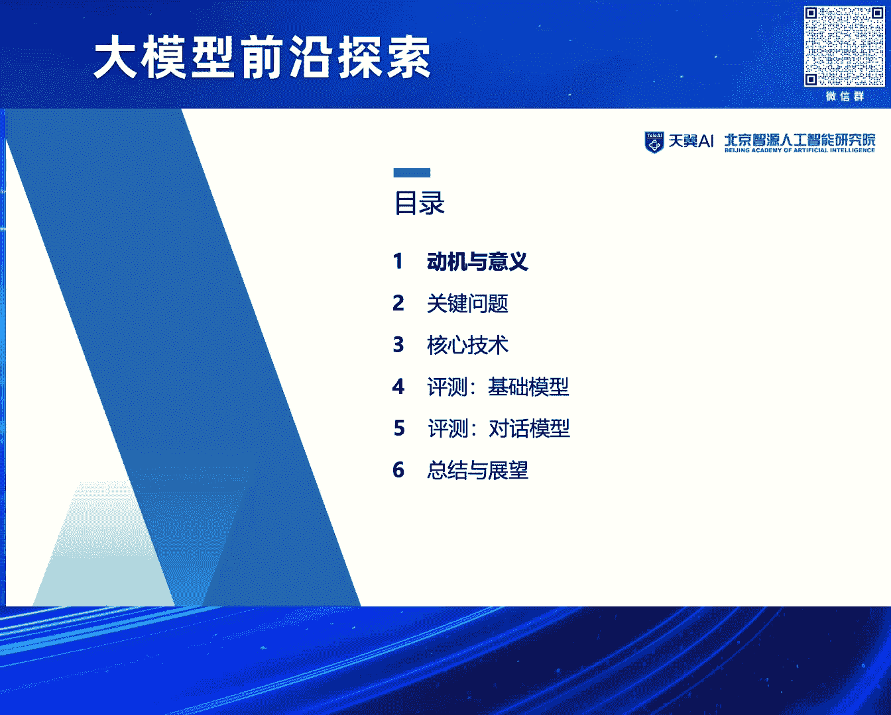
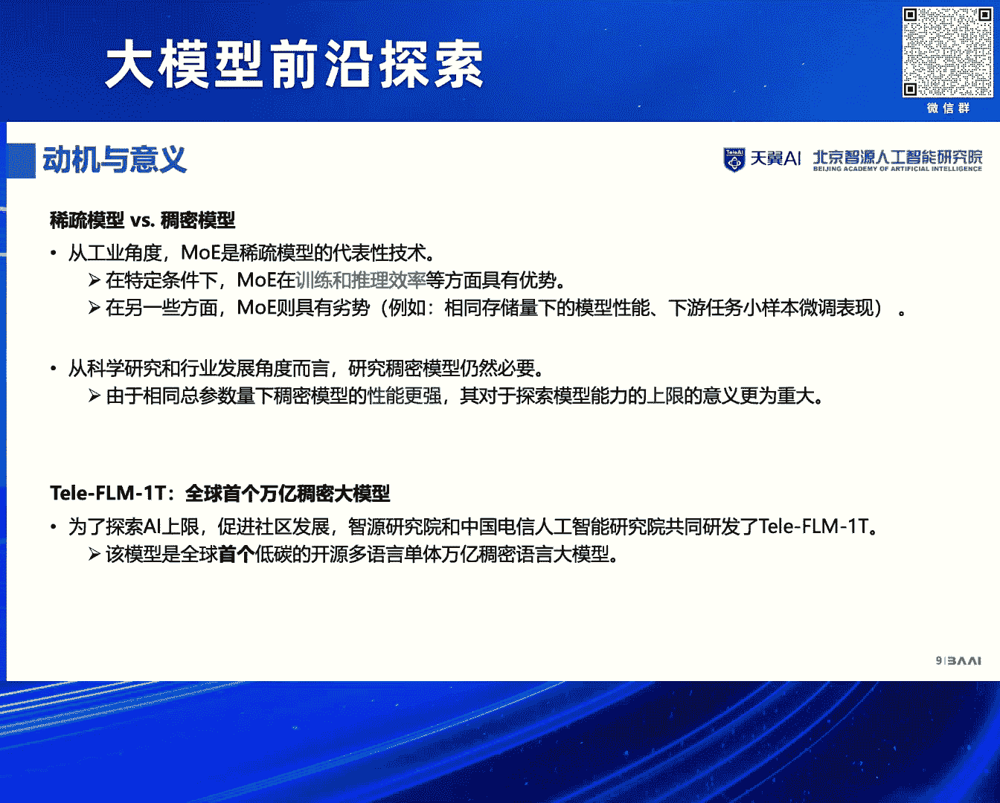
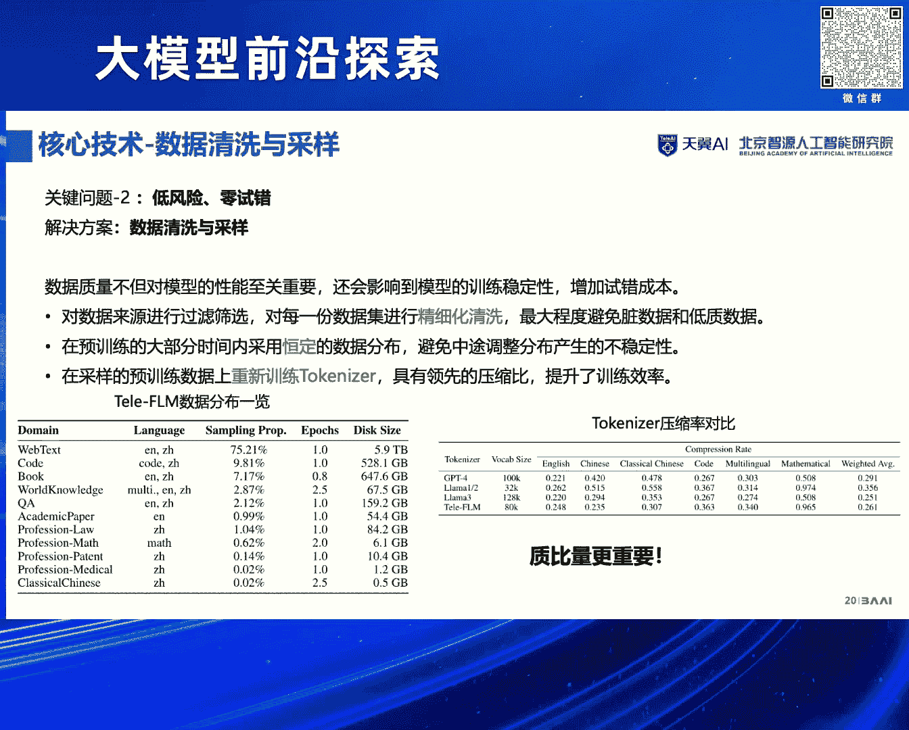
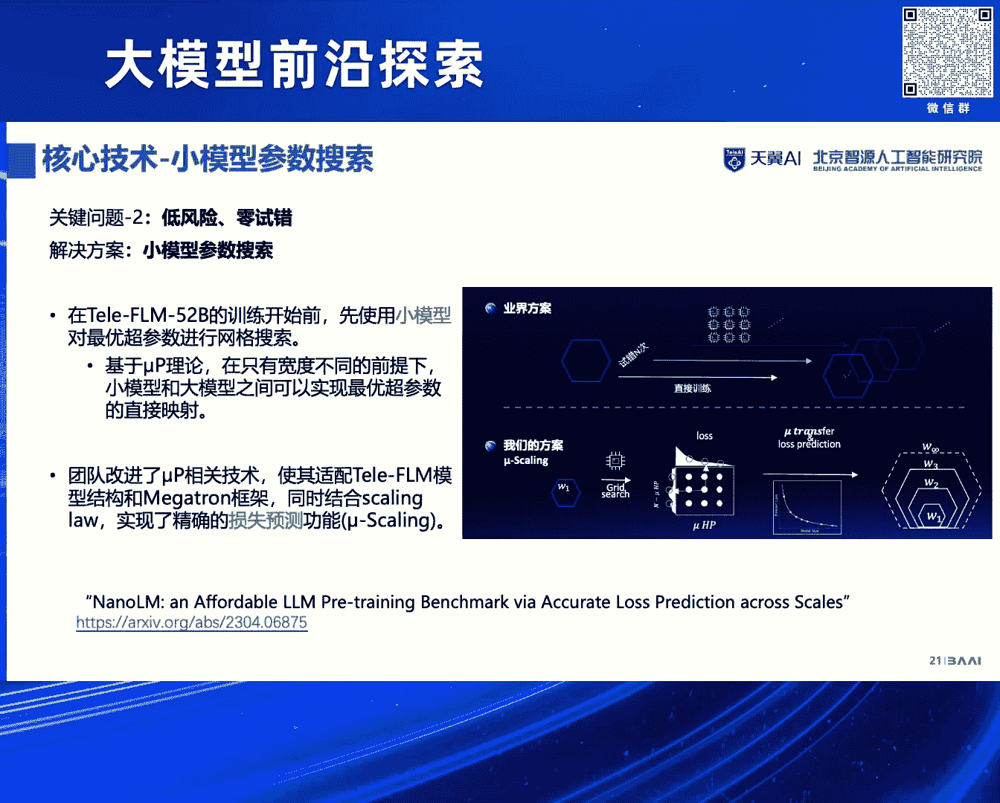
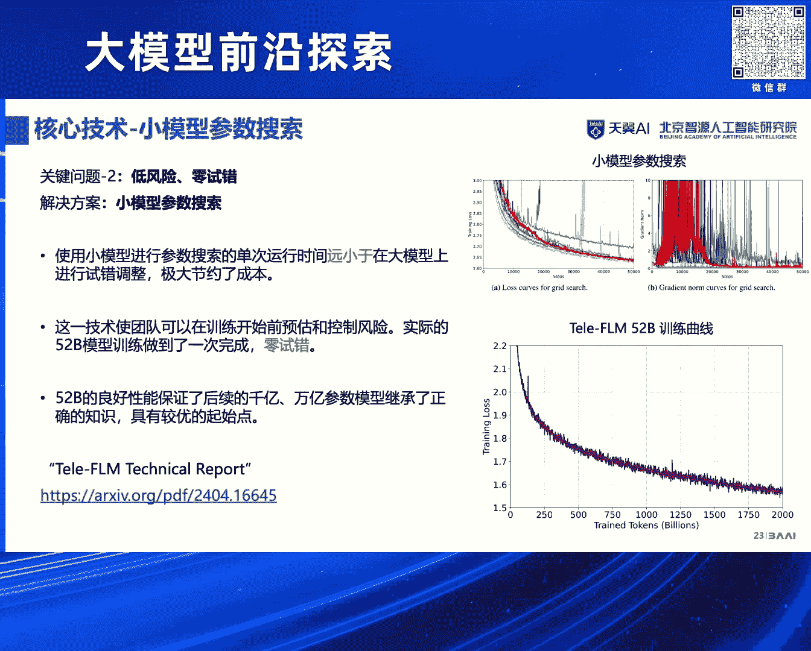

# 2024北京智源大会-大模型前沿探索 - P2：全球首个稠密万亿模型揭秘：王业全 - 智源社区 - BV1yS411A73A

(音乐)，尊敬的各位领导 各位来宾，大家上午好，我是王毅权，下面由我来代表团队，给大家汇报一下，全球首个稠密万亿模型的一些基本情况，昨天在开幕式的时候，我们中远院长介绍了一下，我们模型的一个总体情况。

以及现在能达到的性能，然后我今天主要是来给大家揭秘一下，这背后存在的技术原理大概是什么样子的，当然今天时间有限，可能我并不能把所有的技术细节全都讲到，我会尽量让大家能够听明白。

我们是如何做成功这件事情的，然后具体的技术细节，大家可以参考我们的技术报告，包括接下来我们会开源更多的一些技术细节，然后这一个稠密万亿模型，是我们试验研究院，和中国电信人工智能研究院一起联合研发的。

然后过去的这一个，大概有四个多月的时间里，然后双方的团队一起经过了非常艰辛的合作，然后经常会有这种撤业的连条等等，然后非常辛苦，但是幸运的是我们做到了这件事情，终于做成了全球首个稠密万亿模型。

下面我从动机和意义关键问题，核心技术评测基础模型，评测对话模型，总结和展望总共六个部分，来给大家进行一下简单的概述，首先第一点，动机和意义，我们先来回顾一下，目前的大模型的发展脉络。

我们都知道OpenAI是目前这一波，生存式大模型的一个核心驱动者所在，然后我们首先要强调一个观点，GPT它的能力的最大来源是在哪里，我们仍然认为GPT能力的主要来源，是它强大的语言大模型，后面的SFT。

强化学习等等阶段，更多的是在做一件什么事情呢，和人类做一些相对齐的工作，并不是说把更多的知识给灌输进去，然后它能力的最大来源还是语言大模型，然后相信大家已经在过去。

知道了解比较多的大模型训练相关的信息了，那么大模型训练最重要的三个点，第一个是大数据，第二个是大算力，第三个是强算法，有了这三个非常非常重要的支撑以后，就有可能能够训练成功一个优秀的大模型。

那么首先是大数据，我想强调的是现在的大数据，和以前大家所关注的大数据，可能已经有了一个很本质的区别，在以前的情况下，比如说这种千万量级，几亿的量级，然后大家就可以认为是一个大的数据量。

但是对于现在的大模型来说，可能事情不是这样的，对现在的大模型来说，大家可能要穷尽整个人类互联网上的余量，然后把它当成一个大数据，由于这个数据量比以前的大数据，是大了非常多的，所以说会带来更多的技术挑战。

然后第二个大算力，在以前的情况下，大家常用的大算力，就是各种超算集群，然后在现在的这种大算力的情况下，以前的超算集群是不能够满足需求的，所以说现在大家的这种大数据，往往是采用这种。

非常多的英伟达的显卡的并行计算，来达到的，比如说我们知道最典型的一个例子，GPD3，它在2020年的时候，就实现了上万张卡的互联，然后训练出了1750亿的GPD3，然后第三点强算法。

强算法现在有些情况下，大家可能很重要，但有些情况下，大家觉得这件事情不是特别重要，我想给大家分享一个例子，然后以此来表达算法，其实仍然是很重要的一个点，就是说在LAMA出现之前。

然后大家沿着GPD这条路线走，然后可能是属于走得比较缓慢，LAMA出来了以后，然后大家沿着LAMA的路线走，然后就进展比较快，然后大家仔细分析，你会发现LAMA和GPD，它的区别在哪里。

可能并不是一些很大的区别，甚至来说是在以前深度学习时代，大家认为是一些，脆壳的情况下的一些变化，就能够使得模型的能力发生，巨大的提升，这点是属于我认为是我们这些，做算法的研究人员。

还是说业界的一些工程师朋友们，需要非常注意的一个点，然后最后有了这三项，基本能力的一个好的合作以后，我们就可以训练得到一个大模型，然后这是一个基础的语言大模型，在一个语言大模型的基础上。

可以通过一些相应的微调和对齐的手段，就可以得到目前非常常见的对话模型，比如说SideGPD 3。5，SideGPD 4 GPD 4等等，它们就是在这些，千亿级 万亿级的，语言大模型的基础上。

去训练得到的一个模型，好 刚才讲了这一个语言大模型，我们来回顾一下语言大模型的本质，语言大模型的本质是什么呢，就是用前K一个单词，预测第1K+1个单词，这一个本质是属于直到今天。

仍然一直大家在遵循的一个对象，它就是这么简单，然后给一个例子，the cat sat on the mat，然后它的预测方法就是非常简单，相信在座的所有人都能听得非常明白，自左向右挨个的预测下一个单词。

基本流程，给定the预测下一个单词cat，给定the cat预测下一个单词set，给定the cat set预测on，以此类推，就是这么的简单，但是这一个简单的语言模型的本质的背后。

是存在着非常非常多的这种原理在里面的，比如说当这个context，前面的内容足够长的情况下，那是不是对未来预测得很精准，就能够有非常强大的智能，在包含在里面呢，这是属于目前非常重要的一个。

大家对语言里的认知，然后对于在座的朋友，可能有一些来自产业的朋友，然后大家可能会经常疑虑一个问题，什么叫做模型参数规模，比如说大家经常听到一个词，我有一个模型是70亿。

100亿 1000亿 10000亿等等，然后这个模型参数是什么意思，这个地方我给出了一个非常，简单的通俗解释，比如说我们有一个非常简单的模型，y=a1x1+a2x2+a3x3+a4x4，一直加到b。

然后这里a1到a4以及b这5个量，就是这模型参数，对待这一个模型来说，它的参数量就是5，然后我们可以有很多的历史数据，对这一个模型进行拟合，就可以得到参数a1到a4和b的估计值，然后那么这种情况下。

这个拟合过程本质上来说，就是代表了训练过程，当然实际的大模型的训练过程中，它可能是非常非常难的一个系统性工程，我这里只是用了一种简单的方法，来给大家概述一下，这个模型参数规模大概是一个什么的意思。

然后最后说到大模型，我们一定离不开的一家是OpenAI，那么这种情况下我们去看一看，OpenAI它的技术路线，演进路线是什么样子的，最重要的几个里程碑，2019年2月份，OpenAI做了GPT-2。

然后2020年5月份它做了GPT-3，GPT-3的参数是1750亿，比GPT-2的参数大了足足有1000倍，然后接下来2022年的12月，它发布了Site-GPT，然后这就是属于大家所熟知的一个。

它的技术路线，以及2023年，OpenAI又发布了GPT-4，GPT-4的模型参数，距网传是1。8万亿，以及现在他们正在训练的GPT-5，GPT-5的距网传，它的模型规模大概是在，百亿。

百万亿的一个量级，100T的一个量级是非常巨大的，那么OpenAI的技术路线，说明了一个什么问题呢，首先大家肯定能想到的一个点，就是属于Scaling Law，Scaling Law大家都知道。

对于目前OpenAI的技术路线来说，他们是认为随着模型参数的越变越大，以及相应的数据量的提高，模型的性能会有一个继续持续的变化，这就是属于语言大模型，最重要的一个Scaling Law。

然后OpenAI直到今天，仍然没有找到Scaling Law的边界所在，好 这就是属于我们训练万亿大模型的，一个非常重要的动机所在，Scaling Law已经多次被实验证明。

增加这种模型规模是带来稳定的收益的，然后以及以落实作为指标，这种模型的能力的提升，其实本质上来说是可以预估的，我们想问一个问题，比如说在下游任务上，模型规模会带来能力的提升，它的上限在哪里呢 等等。

这都是属于我们需要做出来一个万亿级的模型以后，才能够回答的一个问题，我们都知道目前其实业界对这个问题，已经有了一个共识，就是现在的模型规模可能还是不够的，比如说国内外的一些主流模型，比如千维1。5。

它现在已经有1000亿的量级，欧洲的Mixor 1400亿，DeepSake 2000亿，Glock 3000亿，Lama 3，现在他们正在训练一个4000亿的模型，说明大家仍然在朝着这条路线前进。

另外对于万亿模型，一个非常关键的问题就是，西数模型和酬亿模型之间的对比，网传的GPC的模型规模是1。8万亿，它大概是由单体的3000亿的模型，用了8个，做成了一个1。8万亿的MOE。

那么为什么OpenAI要采用MOE，而不采用西数模型呢，这个地方我觉得是值得我们每一个深思的一个问题，我们把时间倒钟拨回到2022年的时候，2022年的20，不好意思 是在2021年的时候。

然后当时智原发布了乌刀2。0，它是一个1。75万亿的MOE模型，然后 但是接下来的模型都变成了酬亿模型，为什么会有这种转变，以及直到现在为止，很多情况下又把酬亿模型给拿了回来。

其实本质上来说是有这么一个方面的问题，从工业的角度来看，MOE它会有一些好处，比如说它的这种训练和推理的效率，来说是比较好的，但是在另外一些方面，MOE是有劣势的，比如说在相同的模型参数的条件下。

然后这个模型的性能，然后下游任务小样本的微调表现等等，均是证明酬亿模型要显著地比MOE模型强的，那么这种情况下，一个酬亿模型的这种能力上界的探索，可能是更加重要的。

此外呢 从科学研究和行业发展的角度来说，这个研究酬亿模型是非常有必要的，比如说对于AFO膳食，这种对时效性可能要求不是特别多的一些场合，那么我们做一个能力更强的酬亿模型，其实本质上来说。

对这些科学的发展来说是非常好的一件事情，因此 为了探索大模型的上限，促进社区的发展，资源研究院和中国电信人工智能研究院，我们一起合作研发了TeleFM-ET，然后该模型是全球首个低碳的。

多语言单体万亿稠密语言大模型。

下面我来介绍一下，这个模型训练过程的一些关键问题，首先第一个是属于高效，刚才提到了GPC它的模型参数是1。8万亿，那么OpenAI肯定也知道，稠密模型的能力要比MOE的能力强。

为什么OpenAI没有选择做一个稠密模型，而是选择做了一个MOE模型呢，本质上来说就是因为算力，据估算 如果即使有一个非常大的千卡，甚至来说万卡的一个机群，训练一个稠密的万亿模型。

可能需要的时间是非常长的，大概是长达三年到十年，才可能训练出来一个模型，如果其中存在的一些设置的错误，数据的错误，导致你的模型训练是出现了一定问题的，那么这个时间会继续翻番。

可能是长达一个无法忍受的程度，这就是属于为什么现在目前的万亿模型，全都是MOE架构的一个根本性的原因，所以说对于我们来说，我们的目标是给定数据量和目标模型大小，目标的模型大小已经确定了。

就是一个万亿稠密的模型，那么我们如何在有限的机制内，完成这个模型训练呢，这是一个非常关键的问题，此外呢 这个问题已经有了一个前提条件，我们都知道的一个事实是，模型的能力会随着数据量的变大而变好。

那就说明了我们是希望数据量是尽可能的多的，第二个关键的问题是，大模型的训练对超三是非常敏感的，这个相信是行业内的朋友都有所了解，为什么这么说呢，比如说这个大模型训练的时候。

大家的技术报告中往往会把它所采用的，LR等等关键的一些超三给公开，比如说1。5亿-3 1。5亿-4，3亿-3 3亿-4 3亿-5等等，那么这种情况下为什么会采用这一个设置呢。

是不是有些设置它做了一些试错，只是说没有告诉大家呢，这就反映了一个问题，一些不太友好的设置，可能会产生一个非常高的试错成本，最终导致模型的性能不可预期，那么对于我们来说一个关键问题是。

能不能形成一种成熟的方法论，可以控制风险，在模型的训练过程中尽可能地，不再调整 不再重视，做到一个零调整和零重视的目标呢，是的 这就是第二个关键问题，第三个关键问题就是，对社区的一个贡献了。

我们一直以来是坚持一个开源的路线，希望我们所探索出来的各种技术，核心技术 包括模型参数等等，能够对社区产生一种有益的进步，所以说我们的核心技术，包括模型参数等等 全部开源，下面介绍一下核心技术。

首先跟大家汇报一下，我们对大模型的一个认知，现在的大模型和以前的大模型，可能会有比较大的gap，以前的deep learning的时代，可能一个模型更多的是一个算法，但是目前的大模型。

我们认为其更多是一个系统，是一个系统 这就代表什么呢，这不是一个非常简单的算法工程，它是从质底上上，是有一系列的这种系统工程的一些实现的，包括最底层的音法，然后以及数据 然后框架，然后效率等等各个方面。

这个地方跟大家简单分享一下，首先对于数据这一个角度，我们整体来说，严核研发团队的一个感受就是，对于数据来说 质量是非常重要的，给大家一句可以take away的一句话，无论你如何重视数据质量都不为过。

你越重视它，它越会在你的模型性能中，加倍地回报你，然后数据获取 数据清洗，数据取询 数据打分，这都是属于老生常谈的一些问题，可能大家觉得非常简单，但是这个地方我要给大家说，虽然说看起来简单。

但它其实是非常重要的一个点，而且做不好的情况下，会让你的投资变得可能是，不是特别的好 不是特别的高，数据获取相对来说，只要是属于有足够的数据源，就能做得比较好，数据清洗这个地方我只有一个问题。

如何定义高质量数据集，比如说广告，比如说黄读读的信息是真的差吗，好 这是属于我给大家抛出的疑问，如果要是要大家感兴趣，一会可以展开探讨，然后第三点 数据去存，数据去存我常举的一个例子是这样的。

比如说一个1000万级的数据去存，找一个研究生 博士生就可以解决，一个亿级 十亿级，可能找一个阿里的PC就能解决，然后等到百亿级 可能P8就能解决，但是把全网的数据拿过来呢，阿里的P级可能都解决不了了。

以及目前的技术可能确实都不能够，很好的解决这个问题，这都是属于大模型是一个系统性工程的，一个很重要的表现，然后第二个维度是框架的优化，框架的优化如果你不是做一些底层的。

Fab System的我建议大家就直接，采用BF16 Flash Attention Backdrop等等，直接采用即可，然后效率提升Muse Gating和生长技术等等，这是接下来我们要讲的一个重点。

然后在实际上我们最终就得到了FM系列的模型，FM系列的模型距离至今已经发展了有三代，然后首先是两年前的预言代，预言代的时候我们就发现了一个典型的问题啊，目前的语言模型其实是存在着一个很大的弊端的。

我给大家举一个例子，奥巴马的妻子是张女士，这句话从语言模型的角度来说，它是完全对的，一个男士的妻子是一位女士，它是完全对的，但是从事实的角度来说，我们都知道这句话是不对的。

奥巴马的老婆 奥巴马的妻子是米歇尔，那么这种情况下对于语言模型来说，这就造成了它的一个本质的幻觉的原因所在，我们的方法是在语言模型的训练过程中，就引入了这种国安的信号，希望把这种男妇力给它区别出来。

然后就可以让我们的语言模型生成的质量更高，这是第一代，第二代我们发现了另外一个核心问题，就是对于大模型来说，它的成本实在太高了，然后我们就搞定了生长技术，来训练迁语模型，在去年9月份的时候。

我们是使用了70万人民币的成本，就做到了一个迁语级的语言模型，可以达到GPT-3的水平，然后有了这两项技术以后，然后就共同地构成了我们目前的这个，TelFM-ET，就是和中国电信人工智能研究院。

一起做的全球首个万亿大模型的一个基石，它首先是有一个损失预设技术，可以保证训练零调整零重视的，然后我们全面多维度的能力测评，显示它的语言能力是接近GPT-4的，此外核心技术是全面开源的。

右下角的Loss曲线，上面的那一个是我们模型的一个Loss曲线，右下角的那一个模型是DeepSeq的一个曲线，从这一个Loss曲线收敛值来看，我们最后的值是1。58，DeepSeq的值大概是在1。78。

我们比它低0。2个点，这在一个52对比67B的一个模型的角度来说，是一个非常难的一个进步，好 刚才讲到了生长式域训练，然后这个地方就是要给大家汇报一下，我们这个生长式域训练到底是怎么做的。

然后这个地方我只给大家介绍一个核心观点，然后具体的技术细节，大家可以去看我们的技术报告，以及我们这个技术已经开源，大家可以实际上去看代码都可以，然后首先介绍一下什么是生长技术，目前的大模型训练。

大家都是在训练的时候，你的模型参数固定是多少，到最后它的模型目标就是多少，比如说你训练一个千亿级的模兵，千亿级的语言模型，你的目标是千亿级，那么从模型的开始训练，到最后的阶段。

它的模型规模不变是千亿级的，然后我们的生长技术，它背后的含义是这样的，虽然说我们的目标，还是要训练一个千亿级的语言模型，但是我们在训练到刚开始的阶段，我们训练的一个模型的规模是一个十亿。

然后接下来训练到一百亿，然后接下来训练到五百亿，最后训练到一个千亿，然后这种方法来进行的，那么一个核心问题，就是我打在右边的一句话，生长对模型能力是有增益的，还是有损害的，这是一个核心问题。

然后另外一个核心问题是说，到底能减少多少成本，然后其中的这个左下角的图，B C D则是一个节省成本的预估，对于B来说，它节省的算力成本大概是50%，C来说它节省的是少于50%的，D是节省大于50%的。

那么对于D这种非常极端的一种情况来说，只要是D这种搞定了，那么B和C肯定是行的，所以说我们最后采用的策略是D这种策略，然后第二个点，生长对模型能力是有增益还是有损害的，然后这个地方的话。

本来我们的预期是，既然可以节省了算力，那是不是会有所损害的呢，后来答案恰恰相反，它不仅没有损害，甚至来说还会有些比较微弱的提升，为什么这么说呢，我们探索其本质发现原因是这样的，训练一个迁移模型。

它刚开始的这一个模型的一个优化空间，是一个迁移远模型的空间，但是对于我们来说，我们早期训练的是一个实异的模型，然后它的这个优化空间是比较小的，那么这种情况它的优化效率就会比较高。

然后由于我们在生长的过程中，采用了一系列的技术手段，达到了保值等等关键的这些设置，然后我们就可以达到最后的这个模型能力，会比较好，不仅没有损害 而且是比较好的，然后对于生长来说，有四个常见的扩展维度。

包含影程的宽度 注意力头的个数，模型的层数，还有MOP中间层的维度等等，然后在我们的实际的这个，万语级语言模型的训练过程中，我们成功实现了这些所有维度的通识生长，都是没有问题的，然后生长算法的核心要素。

是生长算子和生长流程，然后这个地方我就不再跟大家具体汇报了，大家感兴趣的话可以关注我们的技术报告，然后最后给大家汇报一下，我们这一个万语级语言模型，它的生长策略，我们到最后依据我们前置的研究。

FL101B的成果，Tile FL最后的生长路线是，首先是有一个500亿级的大模型，是第一阶段训练了2。0T的，Token的数据量，然后在这一个500亿级的，模型的基础上，我们生长到了一个千亿级的规模。

然后第二阶段用了0。3T的，数据量进行训练，最后在千亿级的这个模型的基础上，我们成功地生长到了万语级的大模型，训练了大概是0。015T的数据量，达到了我们万语模型的训练目标，好 然后刚才提到了训练框架。

是一件非常重要的事情，然后呢 所以说为了保证训练的成功，我们也在训练框架的方面，做了一些优化，比如说3D并行，然后序列并行，比如说TechPoint灵活存储，比如说这些自动评估等等，以及很重要的一点。

在我们的这一个，把我们的生长技术等等，相关的技术集成到了，Microsoft框架里面去，综合上述的技术，联合研发团队最后采用了，112台A800的GPU，在4个月内完成了，百亿千亿万亿模型的训练。

第二个关键问题，也是属于目前大家，可能不再常说的一个问题，就是属于数据配比，和数据的一些认知，目前只有LAMA1还是有的，LAMA2 LAMA3等等，均不再提数据配比这一个地方，然后我们这个地方是把。

所有的数据配比相关的信息，都给放在了技术报告当中，然后供大家来参考使用，有三个很重要的一个观察，供大家参考，第一个是属于，对数据来源进行过去清洗，最大程度上来说，避免脏数据和低质数据，然后这个地方。

就是刚才我提到的一个核心问题，我们必须知道什么是高质量数据，好，然后第二个呢，我们是在训练的过程中，采用了恒定的数据分布，避免中途调整会产生一些不稳定，最后的话，我们在这个采样的预训训练数据中。

重新训练了Tokenizer，具有领先的压缩比，提高了训练的效率，然后右下角有个很关键的结论，质比量更重要，即使是我们的目标是训练一个。

优秀的中稳的大模型，然后下面汇报一下这一个超参搜索，刚才提到了目前业界的常见做法，是属于训练一个模型，它可能会试很多超参，那么这种情况下带来的一个不利之处，就是如果超参选择的不好，模型的性能就会不好。

然后我们做到了小模型超参搜索这件事情，它就可以达到的一个目标是，在模型训练开始之前，用一个非常小的模型参数，去大量的搜索，然后搜索到的最优超参，是可以直接应用在最后的，大规模的模型训练上。

而且来说它是可以保证，你的模型是收敛的。

这些都是毫无问题的，然后有了这一个理论以后，我们就做到了，使用小模型在这种，进行了超参搜索，然后就可以做到我们刚才提到的一个关键问题，就是我们在这个万亿模型的实验中，0调整 0试错。

然后此外的话52B的良好性能，可以保证后续的千亿级，万亿级模型参数，继承了正确的知识，会有一个比较优秀的起始点，然后介绍一下评测的情况，首先是基础模型的评测，基础模型的评测最直观的一个指标。

就是落实的评测，然后我们在落实当中，进行了两个主要的评测，一个是中文的评测，一个是英文的评测，然后中文的评测显示，TeleFM它是属于目前最优的一个中文模型，它优于千位1。5 72B。

且优于拉玛3 70B，然后英文的BPP评测显示，TeleFM 52B的英文能力，是接近拉玛3 70B的，然后但是我们要注意到它的数据量，一个是2T 一个是15T，参数量的话是52B对比70B。

然后且它能超过，包括拉玛2 70B在内的其他所有的模型，所以说总体来说，这个基础模型的训练是非常好的，然后第二个评测的维度是对话的维度，对话的维度我们主要进行了中文的评测，包含两个评测。

第一个是外部评测，AliveBench，第二个是内部评测，TeleEvo，在AliveBench的评测当中，显示出来我们这一个模型的语言能力，是特别强的，基本上来说可以达到了。

GPT-4中文语言能力的96%，总体的能力也已经达到了，GPT-4能力的80%，但是这个地方有一个值得注意的点，目前我们这一个模型还是语言模型，GPT-4模型是一个多姆态模型。

所以说多姆态方面的能力不可比，GPT-4还是非常强大的，然后内部的评测是这样的，显示中文对话能力达到了，GPT-4的93%，然后这和外部的这一个评测，基本上来说，它们俩的相符度是比较高的。

好 最后在结束我的报告之前，给大家汇报一下我们的一个实验经验，总结和展望，第一个是数据方面，质量和数量是并重的，且很重要的一点是质量优先，比如说虽然说我们是想训练一个，优秀的中文模型。

但是我们最后英文比中文的配比是2比1，中文只占了大概是30%的数据，但是实践证明，在我们保证了质的情况下，我们的模型效果是非常好的，然后第二个 超参优秀，基于这种我们刚才提到的。

Mewpool的这种网格的超参搜索，是非常有效的，它可以节省大家的大量的成本，避免你一次性投入，几千万的这种算力规模，带来的这种算力损失，最后一个训练的效率和稳定性，一个很重要的关键点是在于落实。

然后大家以前的很多经验都证明，落实发生了坚持这种情况，大家会认为它不够健康，但是我们的实践证明，即使偶发的这种落实的坚持，其实是正常的，而且大概率模型是能够自我修复的，当然这个地方要持续观察轨道纳姆。

轨道纳姆和落实曲线的关系是比较复杂的，有很多种正常的健康的对应关系，最后一种情况可能是比较不好的，就是持续上升的轨道纳姆，可能会导致你的训练的落实曲线，发生一些发散等不利的情况。

好 最后给大家说一下开源情况，我们目前所有的核心技术均已经开源，然后右边二维码是一个，它的技术研讨和效果的反馈群，大家感兴趣的话都可以加入，然后在里面探索一些大模型相关的知识。

大家一起分享，好 我的汇报就到这里结束，感谢大家，现场的同学看看有没有什么问题，这位同学，你好，您在报告中刚刚多次提到了，大模型的训练是一个系统工程，我想请教一下您，就是您觉得这种系统工程的特性。

具体体现在哪些方面，因为系统工程的话它单独是一门，也是一门学科，然后我也觉得它是一门系统工程，但是我对这个它里面的这种关联，以及它体现的这种特性，还是存在一些疑惑，然后这是我的第一个问题。

然后第二个问题呢，我刚看到就是电信大模型，在中文推理上面，就是相比于其他任务，性能要稍低一些，想问问您就是后续电信大模型，在比如说推理，包括符号推理 数学推理等等，它方面有没有什么下一步的。

接下来的进一步的这种措施，以及现在正在研究的这种技术路线，好的 谢谢，非常好的两个问题，首先是第一个问题，是属于那个系统工程的问题，然后这一个问题，我给大家先说一个例子，比如说以前我在带学生的时候。

然后让他写一个深度学习的算法，然后可能啊，好的学生或者说对于，优化做得比较好的学生，他做一次实验的时间是三个小时，我算了下我的成本，大概是花了我五千块钱，然后呢 另外一个学生，他可能动手特别快。

但是呢他不注重效率问题，他认为只要是正确性保证得好就行，他的成本是多少呢，他用了三十个小时跑一个模型，那么这种情况他的这个成本是五万块钱，对我来说五千和五万，这个区别我是可以接受的一件事情。

但是换到大模型这里的话，可能这件事情就会让我变得不可接受，以前我的成本，比如说还是说这个十倍的一个优化效率，以前我的成本可能是五百万，那么现在来说我的成本变成了五千万，那是绝对不可接受的一个问题。

这就是属于为什么要把这件事情做好的一个本质所在，所以说目前只要是训练过大模型的人，以及这个机器比较多的一些实践，大家会非常关注一个指标叫MFU，MFU就是决定你到最后。

你的这个投入成本大概有多好的一个关键指标。

然后MFU本质上来说可以当做，你的一个算力优化的目标，那么在这个过程中，可能制约它的因素有哪些，从你的存储到你的网络，到你的模型结构，甚至来说你的带宽，你的不同的数据量走什么样的地方等等。

都会是有一个系统性的问题，然后对于你来说，可能要把这些问题，都有一个非常清晰的认识，然后在此基础上，把每个问题都做到尽可能的好，有可能这是属于非常重要的一个点，对于你来说，既可以让你的模型效率高。

甚至来说你的投资成本也会变得好很多，这是第一个角度的问题，然后如果是说我们需要讨论一下，具体的怎么做可能时间比较长，我在这里就不再展开了，然后第二个问题，您刚才提到一个非常好的点，目前的模型评测显示。

它的语言模型能力很强，但是推理方面看起来还不是特别好，然后这个地方有两个角度，第一个角度，我们目前是和GPD 4比的，GPD 4是一个1。8万亿的模型，单体模型3000亿，我们刚才给的一个模型的结论。

是52B的一个结果，然后这样的话，我们的规模是远小于它的，然后我们还有一个结果，是和GPD 3。5的结果对比，其实我们和它是差不多的，这是第一个角度，然后第二个角度是这样的，目前我们这一个对齐。

还是有大量的工作要做的，比如说思维链，大家都知道这是一种常见的方式对吧，然后除了思维链以后，思维链以外还有没有其他角度问题，比如说昨天一些嘉宾提到了，慢系统和快系统，思考快和思考慢等等。

这些都是属于接下来我们要研究，而且可能会带来很大的用处的一些点，而且这些研究目前是做得比较少的，所以说我觉得这是一个非常重要的方向，可能能够解答你的疑问，把这个问题整体来说解决到一个非常好的程度。

好 谢谢，鉴于时间，我们感谢王逸泉博士的精彩分享。