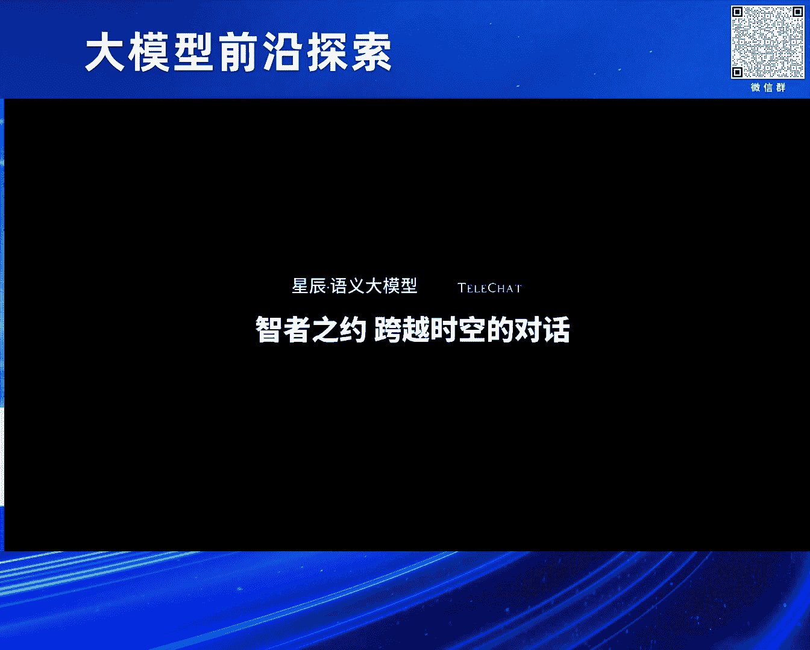
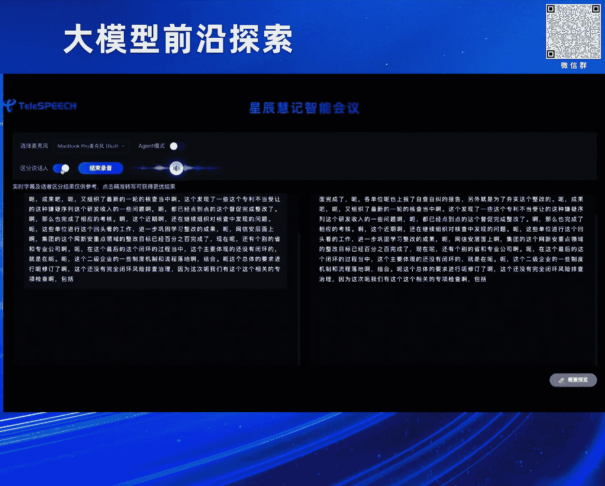
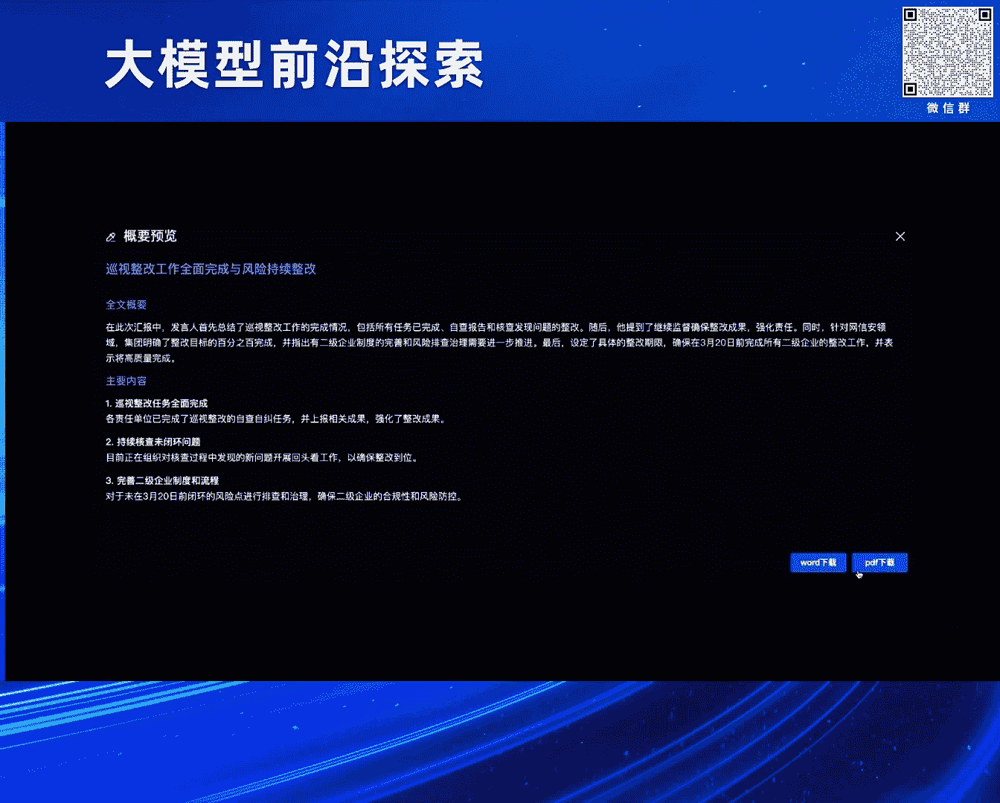
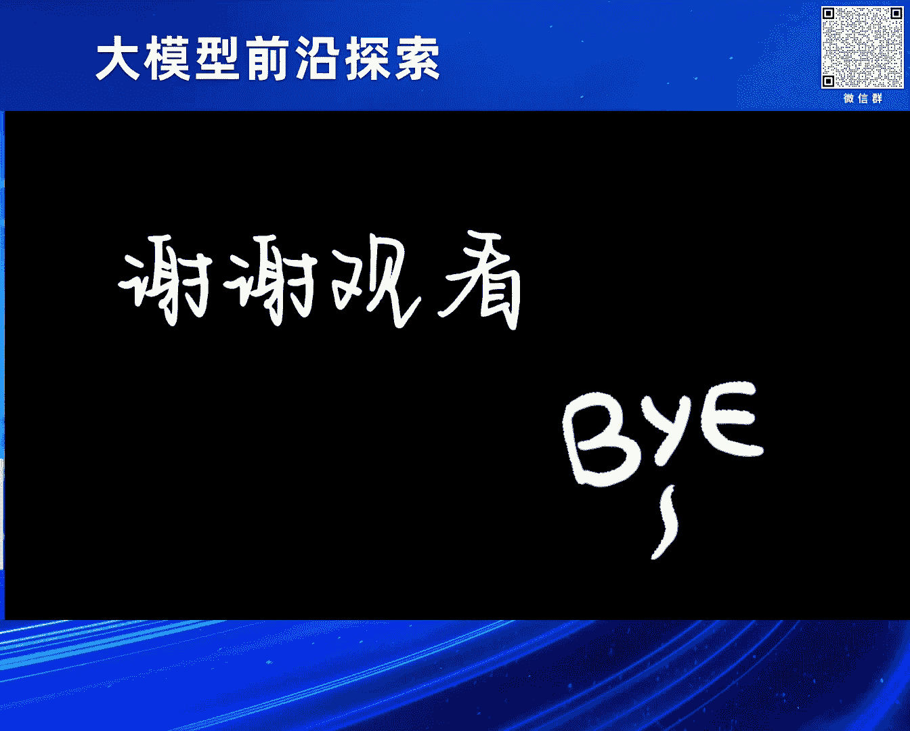

# 2024北京智源大会-大模型前沿探索 - P3：大模型精细化微调和对齐方案：宋双永 - 智源社区 - BV1yS411A73A

[音樂]，感謝永祥總和葉全博士的組織。

感謝永祥總的介紹，我是中國電信人工智能研究院的宋雙勇，我今天給大家帶來的是，關於大模型精細化微調和對齊方案的一些介紹，也是接著剛才葉全博士，關於很多的這種基礎模型訓練的介紹的，這樣有一個順暢的關係。

今天分三個維度，第一個是在大模型精細化微調，然後第二個方向是在偏好對齊，以及說中國電信在大模型場景化能力建設方面的，一些工作進展的介紹，首先 當然剛才葉全博士在這個基礎模型訓練。

也提到了數據的數量和質量的關係，但這裡邊我這兒主要介紹的是在SFT，也就是在微調階段這種大家在數據思路上的一個轉變，可能在2022年年底，ChartDB出來之後，大家在這個處於一個盡快追趕的階段。

不管是在基礎模型還是在這個SFT數據的階段，可能首先是要收集了大量的這種訓練的數據，那麼在SFT這個也都相當於是問答數據，這樣的一個收集的初期，包括中國電信在內，可能到了2023年的3、4月份的時候。

我們手裡就已經超過了千萬條，這樣的問答的訓練數據，那這個時候，可能說我們覺得這個模型本身是一個通用模型，那是不是學到的，不管從基礎還是到問答，我學到的知識越多 越自然，那麼它這個通用的能力都越強。

其實大家帶著這樣的一個思維 然後去做訓練，然後呢 在這個出來結果以後呢，實際上感覺看上來效果還不錯，但是呢 這個一直朝這個方向說，我們還是在想 甚至說很多通過了解，那其他的這種單位廠商也是在想。

那是不是數據還不足，通過增強 增加數據的數量，是不是效果還能進一步提升，然後呢 後來在去年應該是5月份吧，這個出來這樣的一個工作 就是Lima，Lima號稱是說我只用了這個，一千條的高質量的數據集。

就把這個SFT 就這個Chad模型，訓練到一個非常好的一個效果，那個其實這時候的話，就會引起了一個反思，就在一個數量和質量的這個維度上，是怎麼樣達到更好的一個balance，然後來去把這個模型的能力。

去更好地去誘導出來，那其實包括後面的Lima II其實也是這樣，可能用的數據也不多，然後生成的效果也很好，所以這個時候我們對比，就是在這些工作之前和之後的，這個在數據上的一些思路的轉變。

那可能在之前這個數據取勝的階段，基本就是百萬條起步，可能就算比較少，剛才我也介紹中國電信可能，我們訓練第一版在這個，二三年三四月份的時候是用了，超過千萬條的SFT數據，那在後來的話其實質量為王。

質量為王這個階段，我發現很多的工作其實，公開出來之後，說自己的SFT數據可能不到十萬條，但是效果呢也很好，然後對應的有這樣一篇文章，叫這個Qualities All You Need。

這個大家有時間也可以讀一下，其實在這樣的一個背景下，那其實大量的工作，現在開始投入到數據質量的提升上，SFT訓練數據質量的提升，那在這個階段的話，就會有產生很多對應的一些工作，那包括我們其實也是在做。

那精細的話分析在這兩個方面，一個是數量一個是質量，它到底有什麼一些區別，那首先說最開始這個數量的階段，追求數量的階段，可能數據雖然很多，但是它，可能大家並沒有太關注它的一個全面性。

就是我們手裡有哪些數據，然後就把這些數據都，收集起來 都訓進去，我們覺得這樣反正是，模型學得越多越好 對不對，但具體這個裏面是不是有一些缺失，比如說，當然這個不是事實，就是我手裏即使有幾千萬條數據。

但是裏面發現，幾乎沒有這個數學相關的，那這個模型可能訓出來它的數學能力，相當於它是一個不全面的，然後但這個質量為王的階段不是說我，刻意地追求數量的少，而是說要保證質量的前提下，然後再去做訓練。

然後這個時候導致說在目前的情況下，高質量的數據的量相對較少，少只是一個表象，但這個時候少不是單純的少，而是要少而全面，就是儘量要覆蓋全面，這是一個它的非常重要的要求，那第二個階段就是在最開始這個。

粗暴收集數據的階段，可能就是偏freestyle，這個每一種類別的問題，它的格式是非常的五花八門，甚至同樣的一個問題的答案的話，形式也非常的發散，那這個不能說每個答案是錯的，只是說這樣對模型學習來講。

它是一個比較有害的，就好像一個小孩有好幾個老師，教同樣一個問題給的答案是不一樣的，那這個其實對小孩的學習，並不是一個好的事情，那所以其實在這個，後面這個追求質量的階段，我們就要求這個答案格式。

儘量地規範，尤其是同類問題的這個格式，儘量地去統一，這樣讓模型學習的擬合得會更好，然後在這個數量維度，其實還涉及到一個點，那就是說，包括最開始，這個20年年底23年初的時候，大家可能為了儘快地追趕。

那在基礎模型階段，可能訓練的數據不太夠，可能這個大家也可以再翻閱，這個一年前的一些公開的工作報告，可能大家訓一個T的 兩個T的，可能三個T的這個基礎數據，就算比較多的 對不對。

然後大家會有一些錯誤的認知，就是說我在基礎模型訓練不足的情況，我會通過SFT，訓練更多的數據，把這個能力補齊，但其實現在證明這種情況，可能會導致說，就是基礎模型如果某一塊數據不足。

那SFT去硬加訓練的話，可能會導致明顯的幻覺的問題，所以這個時候其實在我們，注重SFT數據質量的同時，反而也能反推，我們對基礎模型的數據，是不是訓練不足，我們要要求在基礎的全面性，和SFT的全面性。

它是有一個這種，互相配合的關係，所以從這幾個方面綜合來看，我們在這個質量維度，其實還是有很多的工作要做，好，然後下一個要介紹的就是，那根據剛才的思路，首先我們要對手裡大量的數據，要進行一個數據的篩選。

對吧，那這個篩選的過程其實現在已經，很多這個研究者提出了非常多的方法，這裡面這塊就簡單介紹幾個，給時間問題，這個方法可以簡單分成兩類，一個叫Nantagic 一個叫Tagic。

這個區別就是說可能左邊這類的方法，更具有通用性，它可以針對各類的數據，做全面通用的一些篩選，那右邊的這類方法呢，可能稍微的更有一些指向性，針對一些重點的具體的任務，它的效果會更好一些。

那比如左邊這個叫IFD這樣的一個方法，它實際上這個思路比較簡單，我比較直觀的介紹，它就是說同樣的一條數據，那我給它加了一些提示的情況下，然後它生成答案的這個得分，和我直接去問這個問題得到的得分。

它這個差值越大，證明說這個數據是更加合理，因為我們直觀的認為，它加了提示之後，它的效果就應該會更好，如果說我加不加提示，然後它的分數是一樣的，或者說我加了提示分數反而降低，那麼這個問題本身。

它可能質量就是有問題的，通過這樣一種方式來篩選，哪些問題本身的質量更好，當然呢這個有一些，這個容易判斷失誤的點，就在於說如果這兩種情況得分都很高，或者都很低的時候，實際上這個判斷會有很大的一些失誤。

所以其實我們目前的工作，也在有一些思想基於這個IFD的基礎上，進行了很多的改進，尤其是針對這種容易失誤的情況，然後下面像這種，還有叫一個Superfluidine這種方法，它實際上是以IFD為基礎。

但是它覺得這個IFD的效率比較低，因為我要遜以一個，比如幾百億或者千億參數的模型的時候，用這種方式來過濾數據，它的效率太低了，所以它希望在一些小參數的模型上，然後過濾數據，然後在大模型上進行訓練。

那這個時候會導致誤差更多一些，因為畢竟是不同參數的模型嘛，它選擇質量的這種結果是不一樣的，然後後面這個就，時間問題就不挨個介紹了，然後右邊這個就是這種，針對具體任務的一些過濾算法。

那像這個NUGETS的話就是，首先它是判斷這個候選樣本，對測試及每條數據的一個訓練增益，這個直白怎麼說呢，比如說我選了20條測試樣本，然後呢我針對一條這個，準備要判斷的候選樣本，如果加入這條樣本的訓練。

能夠讓這20條數據的訓練增益，就是這個loss值，其中有15條這個增益就變大，那實際上它這個叫增益佔比呢，就是15除以20 就是0。75，相當於我給它打一個0。75的分，最後按這個分數來排序。

來找這種質量更高的這種候選樣本，然後這個還有一個方法叫這個LESS，LESS其實是，也是同樣固定這樣的一個測試級，但是它直接考察的是候選樣本，對定義模型這個梯度優化方向，對測試級損失的這樣一個降低程度。

可能不是說按照剛才說這個，15除以20這樣一個佔比，這是這個兩個方法的一個差別，那目前的話我們的工作，其實更多的是基於LESS在做，針對一些重點任務項上，做一些數據的篩選，因為這種效果是比那個。

Nexus的這個方式要更好的。

這是這樣的一個介紹，然後基於這些思考也好，還有基於一些方法的理解也好，其實我們正在做的一個事情，可以概括為這樣一張圖，就是針對一些重點能力的提升，所謂的重點能力就是圖上畫的這些。

三大類 邏輯 認知和理解，然後每個大類下面有一些小類，大概這樣十幾個重點的，這種能力的類別，那我們結合剛才的這種數據篩選的方式，同時結合這個PPL RFT，就是這個拒絕採樣的一個方式，做一些篩選任務。

然後去篩選更優的數據，同時我們還面向一些標準的評測級，來定向提升單項的重點能力，然後在這個基礎之上，那我們怎麼樣做通用能力的融合呢，就是按照這個三個大類，然後劃分能力的維度呢，然後把他們這個關聯任務。

進行一個互促 進行一個強化，這樣的一個訓練，在這個過程中就會非常重要的一個點，就是這個迭代優化數據的配比，那我們在保證每一個能力的數據質量，構建盡量高的同時，每一個能力有提升的同時。

怎麼樣把這些能力的訓練的過程融合到一起，保證每一個能力都有明顯的提升，所以這個過程中其實對這個數據配比，是有很多的一個經驗性的一個積累，這個舉了一個SFT優化的一個效果，這個主要是一個邏輯推理的問題。

這個問題本身就不念了，首先其實像這類問題，在我們原來的經驗來看，那只是通過這種比較粗糙的，基礎訓練加SFT訓練的話，它確實是很難去學習到的一類問題，因為這類問題對數據質量要求是非常高。

這個也是我們在SFT優化過程中，比較重點優化的一類數據類型，那經過剛才聊到的這些很多的，SFT的數據的優化的手段之後呢，其實在這個原有的基礎上，我們整個的chat能力。

是可以提升到大約8%這樣的一個比例，那裡面重點提升的幾項，就包括像邏輯推理 幻覺 數學和翻譯能力，分別提升得也比較高，尤其是這個數學計算，因為數學計算其實就像我剛才說。

可能在之前大量收集SFT數據的時候，是比較少覆蓋到的，並且它的質量很難保證，然後這塊其實是需要很定向地去，提高它的質量，所以這塊的數學能力的提升也比較明顯，然後第二部分就是大模型偏好對齊的介紹。

偏好對齊本身我先，可能說一些我自己的理解，不一定是這個公開的，或者大家公認的一些這種定義，那其實偏好對齊全稱就是，叫人類偏好對齊，怎麼讓模型學習的東西，更加符合人類想要的那個結果。

但其實這樣去說下來的話，好像我們不光是做這個強化學習，還有像現在這個DPO，還有包括剛才提到的SFT，甚至我們把這個範圍擴展到這個基礎模型訓練，好像它都是在做偏好對齊 對不對，因為所有的語言 文字。

所有的文章段落它都是人為地去寫出來的，那麼其實每一條數據的學習，都是在做一個人類偏好的對齊，當然今天要講的這個偏好對齊呢，是一個比較狹義的偏好對齊，就是在通用SFT之後，那麼怎麼樣這個模型。

更好的去按照人類的偏好，去產生更符合人類要求的結果，這個是稍微狹義一些。

這個我就不再介紹這個偏好對齊，目前有各種方法，目前我們用的就是DPO這種方式，我們直接對比一下這個SFT和DPO，到底有什麼樣的一個區別，因為按照剛才來講，好像它都是在學習人類。

呃 這個人類創造的一些數據嘛，但是它本身在這個方法上是有區別的，比較直觀的一個理解就是SFT，我們是不是每過來一條數據我就學習，反正你給我的數據長什麼樣，我就覺得我要把這條數據學會。

但是DPO階段它實際上是一個pair的方式在學習，就是同樣一個問題我該怎麼回覆，我知道哪些問題回覆是得分高的，更好的 得分差的，呃 這個這個我不應該去學的。

所以它實際上有一個pairwise這種概念在裡面，所以我們可以簡單的，比較粗糙的認為說SFT是pointwise的這種方式，然後DPO是一個pairwise這樣的學習的方式，來以此加以區分。

然後這個其實DPO和SFT本身在這個模型訓練上，它的目標函數已經不一樣了，因為pairwise它相當於是這個，呃 中間會有個減法，這個loss它是一個減法的方式，呃 對，這個細節我就不一行一行念了。

然後呢我們具體的這個DPO實踐的方式，其實就是用這種一種迭代的，這種方式來做，其實DPO不是說訓練一次就結束的，而是說我們拿剛才這個通用，SFT訓練好的模型作為出版的這種DPO模型。

那麼在這個基礎上的話，把這個代表性的query數據去生成對應的這個pair，就相當於一個模型我可以跑出不同的結果，然後在這個過程中，我們的標注人員是要去標注哪個pair是，呃 這個效果更好的。

哪個pair是效果 不是，哪個結果是更好的 哪個結果是比較差的，這樣生成的pair數據，在這個基礎上通過剛才說到pairwise的方式，來迭代模型，這樣一輪一輪地迭代。

到最後發現這個模型會越來越接近人類，這個我們標注人員想要的這種生成結果的樣式，最終產生最後的fandom模型，其實思路就是比較簡單的，思路是比較簡單的。

然後針對這個DPO的話，這是舉了一個DPO的這個pair的數據，這裡面通常我們管的叫接受和拒絕，就是剛才說的這個好的結果和壞的結果，那其實這個裡邊我們主要針對的是一些，邏輯等類的一個問題。

就在這塊就沒有像SFT那樣，我們把通用的剛才說的10幾20個這樣的重點領域，以及說這個通用的領域都做優化，這裡面其實優化的這個方向就稍微少一些，這個例子就不念了，然後整個DPO的效果。

那我們重點優化的主要是三個大類，一個是邏輯推理，一個是安全問答，還有一個是幻覺問題，那其實這裡邊幻覺問題提升是比較多的，因為剛才這個葉劍博士也提到，其實很多數據在學習過程中，它其實是符合語言邏輯的。

是符合語言邏輯的，但是模型本身其實很難判定說，這個符不符合事實，尤其是關於一些時效性的事實，比如這個明星之間的結婚離婚，還有就是一些各個國家領導人的一些選舉等等，選舉變化等等。

其實這些 當然這是另外一個問題，這個實時性，但是在本身的一些事實類的幻覺問題上，還是要通過一些定向的這種數據優化來做提升，所以這塊我們在這個基於DPO的，這個幻覺問題優化上，效果提升也比較明顯。

最後一部分是介紹中國電信，在大部分場景化能力建設一些進展工作。

剛才基於整個模型訓練之後的話，我們實際上是在一些技術積累和開源上，有這樣的一些產出，首先的話 我們目前的模型的話，是從1B到千億萬億參數，當然前面這個，這個從 怎麼說呢，這個版本的話。

其實覆蓋面目前比較全，但是真正開源的話，目前我們是把7B 12B和52B模型，以及1T的高質量訓練數據，目前已經是面向全網開源，另外在國產化適配階段，不管是這個芯片禁令也好，還是我們這個國央企。

新創國產化的要求也好，其實在這塊的進展我們做的也是比較多，包括像聲騰 韓5G 隨源和登臨，這種國產化芯片的適配的推理，都已經完成適配，另外還有就是剛才葉璇博士也提到，我們和這個GBT 3。5，3。

5 Turbo和GBT 4的一個效果的對比，其實目前來看的話，我們的 可以簡單理解為，我們12B的模型和GBT 3。5的效果是持平，然後52B模型是和3。5 Turbo的水平持平。

然後達到GBT 4的這個93%，當然是這個我們在內部測試，是基於中文效果上的一個對比，然後基於這些能力的話，我們主要在，當然我們已經在很多的場景上有一些落地，今天主要介紹這樣四個場景，一個是行文寫作。

一個是智能客服，一個是輔助經營分析，其實就是智能取樹的一種特別的應用場景，還有就是一個會議計畫盒子，這個是給出來12B和3。5的一個對比，大家可以看到在各類方向上是有勝有負，然後整體的能力是基本持平。

首先第一個點就是我們介紹，行文寫作這樣一個能力，我們叫星辰繪筆這樣的一個產品，在這裡邊的話其實在寫作的過程中，可能最原始的這種文本生成方式，就是我給一個題目 我直接生成一篇文章。

這個其實不太符合人類的一個寫作的方式，正常我們會列一個大綱，哪怕我們考試寫作文，我會想第一段 第二段是總分 分總 總分總，然後也會有這樣的一個思考，所以這個我們是按照第一步先生成大綱。

然後再從大綱生成文章這樣的一個過程，然後在生成大綱的過程中呢，這個大綱大家還可以根據自己的需要進行一些修改，同時在從題目生成大綱，以及大綱生成文章，就每個段落的時候，都提供了這種參考文獻的能力。

可以基於參考文獻來模仿它的結構生成大綱，然後基於這個參考文獻的內容，來生成每一個長文的章節，同時在生成結果之後呢，我們還會針對每句話進行這種，擴寫 續寫 改寫的這種自動化的能力。

構成了這樣的整個的一個產品化的寫作能力，然後第二點的話是介紹關於這個智能客服，智能客服相信很多老師專家也稍微了解，那其實在這裡邊的話，一個是在線的問答能力，還有一個是離線的，對人工客服的一個輔助的能力。

就包括這裡面列舉到的像智能填單，像這種輔助問答，還有這個大目星知識採編，其實都屬於這個離線針對人工客服輔助工作，這樣的一個能力，那這裡邊我可能簡單介紹一下這個，關於大目星知識採編。

這樣其中的一個能力，那這個知識採編我要介紹是什麼，這個可能是電信特有的一種叫法，那就是在離線的話，人工客服要對很多的一種產品介紹，或者是套餐介紹，進行一個內容的抽取，那這樣方便它在客戶服務的時候。

會有快速的準確的一個回覆，那這裡面的字段和傳統的這個，命名實體識別還有很大的差別，因為這裡面不光識別實體，句子有可能是很長的一個段落的一個介紹，然後在這個傳統的採編靠人力呢，肯定是費時費力的。

然後基於小模型的話，相當於每一種類別，每一種這個抽取知識的類別，可能要單獨訓練模型，而且一個疊帶起來，相當於是要疊帶很多模型，所以這個時候像我們用大模型做知識採編的話，就是用統一的模型。

把剛才說的這種看似結構化，但實際內容又五花八門的，這樣的一個能力去實現，這樣大大提升了一個人工抽取的效果，然後下一個能力的話是，這種輔助企業經營分析，它其實是智能取出的一種特別的應用場景。

我用在這個經營分析，包括像這個數據自動的提取，然後數據展示，以及自動的數據分析，和基於分析的結果的一個報告生成，這個其實在目前大模型落地場景上，是一個比較火的方向，然後在這個方向上。

其實我們還在持續大力的投入，然後把這個能力做得其實越來越精細化，還有一個點是在這個高精準會議就要生成，當然這個首先第一步是要保證高精準的一個語音轉寫，還有就是這個畫者分離，然後在這個基礎上。

我們這個基於大模型的會議就要生成，包括像這個整個會議的，主要內容的生成，以及針對每一個說話人的主要內容的生成，這個其實都做了很多的這種優化的迭代。

當然剛才都是一些靜態的介紹，最後一個整體的一個視頻也給大家展示一下，比如第一個展示的是剛才提到的星辰繪筆，那個長文寫作功能，我們發現在這個基於標題寫大綱的時候，就可以加入一個參考文獻。

我們相當可以參考這個文獻裏面的內容，以及這個文獻對於這個，章節題目的一個寫作方式，然後來生成這樣大綱，這樣就能保證是說，比如我要寫的是一個電信，這個內部風格的公文的話，那其實我給你一篇這個參考。

你寫的就會更精準，這樣相當於在大綱位度改動就會更少，那這個裏面就具體介紹了一些其他的能力，在我們這個問答平台上，包括一些表格讀取以及像這個表格生成，還有像各類的這種代碼語言生成。

還有像這個應該是一些古文的理解的能力，對，還有這個是關於邏輯推理，邏輯推理剛才我在介紹SFD和DPO數據的時候。

也重點介紹過很多，包括像數學計算，剛才也有一定的介紹。

是說我們在這方面其實做了很多定向的提升，目前其實關於K12的能力覆蓋得比較全面。

那這個是比較偏娛樂性，這個可能十幾個歷史人物的一些對話的能力，也是集成到了我們彈幕信中，這個是剛才提到的星辰會計，第一步是先是一個精準的會議語音轉寫，然後在這個基礎上的話。

就會生成一個這樣精準的一個會議機，當然這個我們測試壓力比較短。

所以生成的內容也比較短，好的，感謝大家。

這個是我的，現場同學看看有什麼問題，要問一下就是，現在就是我們今天介紹的，其實關於這種域性的大模型和這種翻寸的大模型，就是從您角度來看，我們比如兩到三年之後，這樣一個大模型它的一個體量。

就是參數量大概會到一個什麼樣的一個量級，好的，這是第一個問題，然後第二個問題是說，就是其實今天是說微調和一些預訓練，主要是說在數據上有些差異，那如果我看到就是我們對於很多國產化的。

這個芯片算力其實做了適配，那未來的趨勢來說，如果我們對於顯存 帶寬 互聯，還有一些基建通信，就是對於這一方面，從我們的這樣一個訓練的過程中，有沒有一些就是比較這種量化的趨勢的分析，大概兩個。

抱歉第二個問題中間其實回音比較大，沒太聽清，對 第二個就是關於那個顯存 帶寬 互聯，和一些基建通信，這樣的一個未來趨勢，有沒有一些比較量化的這種分析，抱歉 顯存在什麼，顯存 帶寬，顯存 帶寬。

對 基建通信 互聯 對，好的好的，首先第一個問題在參數量這塊，在參數量這塊，怎麼說呢，反正目前這個參數量的增長大家也看到了，包括昨天跟葉劍博士還在聊，現在我們發布的模型是1T。

未來可能就是10T 100T起步，像剛才說的這個傳言的GPT-5，可能已經達到了幾次百T這樣的一個參數規模，所以我覺得參數規模肯定是要上去的，因為其實我們現在，我個人理解我們追求的這個參數的量。

其實並不是盲目地去追求參數的量，其實在下一個階段，我們要考慮落地的話，肯定要考慮基於這種大參數量的，這種scaling loss的這種效果，怎麼樣把它，可能徵流或者進隨徵流的方式。

把它的效果給它去映射到一個小參數的模型上，然後實現一個參數小，但是效果會更好的這樣的一個模型，其實我們現在並不是追求一個大參數量，因為如果說一個模型部署一路要幾十台。

甚至上百台這種A100 A800的機械來做推理的話，這個其實對於我們的實用性是，不太友好的，所以下一步其實就會涉及到一個從大到小，但是這個大的探索一定要去做，因為我們到現在還沒有探索到。

多大的參數量是達到一個能力的上限，對吧 我們其實在探索到這個上限之後，才會去考慮怎麼樣把它縮小，然後第二個問題 關於這個問題，其實我在想這個量化的事情，其實很難去給出一個公式，因為這個本身和硬件相關。

其實現在我們在做這個事情的過程中就會發現，怎麼說呢 我就直白一點，我們在軟件維度 模型維度，可能我們是在快速地追趕，其實我們國內在這個硬件方向，也是有很大的空間要去做追趕，然後現在涉及到這個芯片機令。

導致說我們剛才也提到在這個，聲騰啊 隨意源上做了很多的適配，但是我可以直觀地來講，那具體這個數字就不說，確實和我們剛才提到這個A100 A800，甚至說我們現在這個，只能聽到還碰不到的是B200 對吧。

這樣的一些，這個GPU比起來確實差距還比較大，所以這個，我覺得目前談到量化可能還是一方面，最重要的還是一個持續的這個，軟件硬件的持續的提升吧，您看，我能加問一個問題嗎。

對 就是那虛量化其實沒有辦法做一個量化的提升，但是我們看到如果現在這種前沿的MOE的模型，它這種可能從傳統的這種TPPP到DP的避免方式，可能會像這種。

就是EP甚至是可能SP就是Sequence Lens，這種Sequence的一個避免方式這樣轉變，這種轉變的方式，對於我們再去做這種硬件系統的時候，它主要是在什麼方面去做一些調整呢。

比如我們之前其實是一個算力棒的過程，在後面我們會是一個，通信和基金互聯的這樣一個棒的過程嗎，嗯 對 是的 其實現在，現在其實，您說的這幾個點啊，反而是它的目前我們訓練遇到的很多的一個限制。

其實好多時候它這個單卡或者單機，它的訓練的性能其實可能還好，但是涉及到一個通信，比如像這個我們的IP卡，對吧 像那個GPU用到的IP卡，其實現在在這個方向也是一個限制，那我們現在遇到一個問題。

比如在這個三四千卡和七八千卡，它很難達到說一個兩倍的計算效能，其實就是在這個問題上，所以當然這個關於硬件本身呢，我並不是一個這個方向的專家，我可能懂得稍微少一些，所以在這個維度上的話，呃 怎麼說呢。

我覺得您的問題本身就是，答案就在裡面，就是這個東西確實很重要，但是怎麼樣我在這個地方給出一個量化的結果，好像也比較難，是的 是的，不好意思，好的好的。

