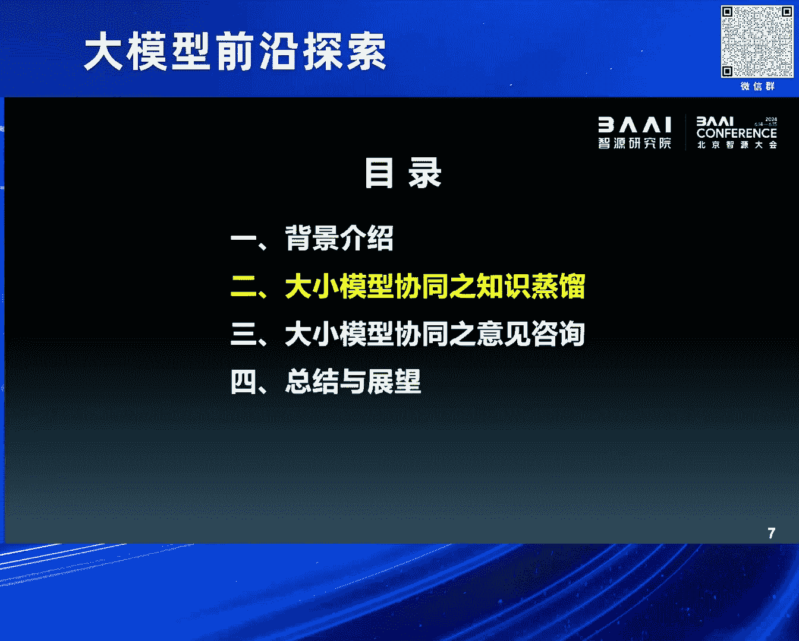
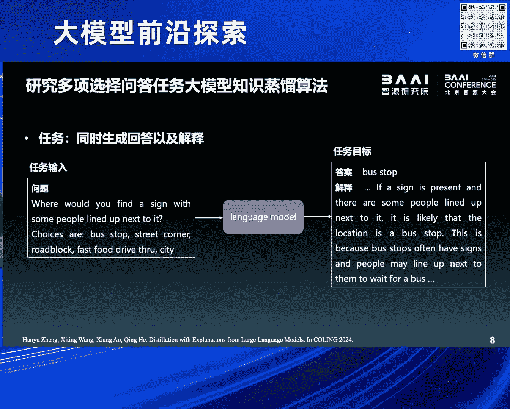
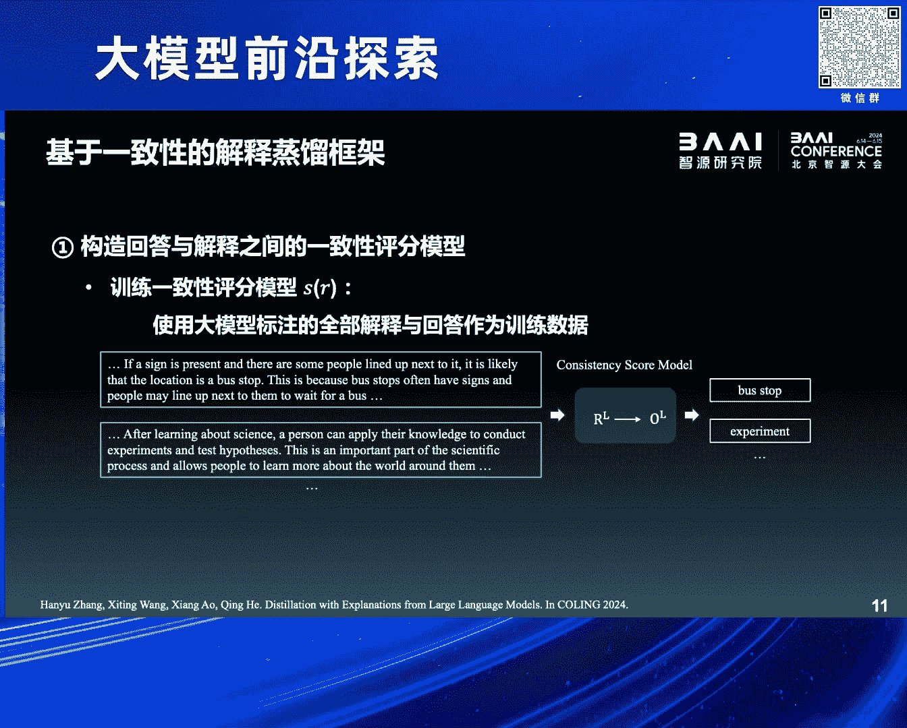
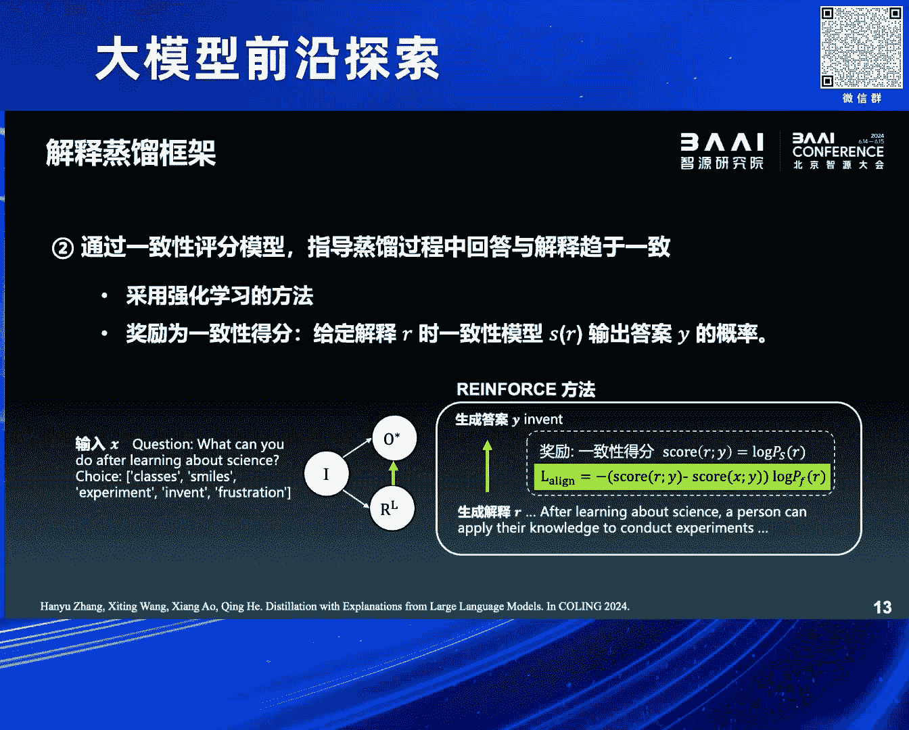
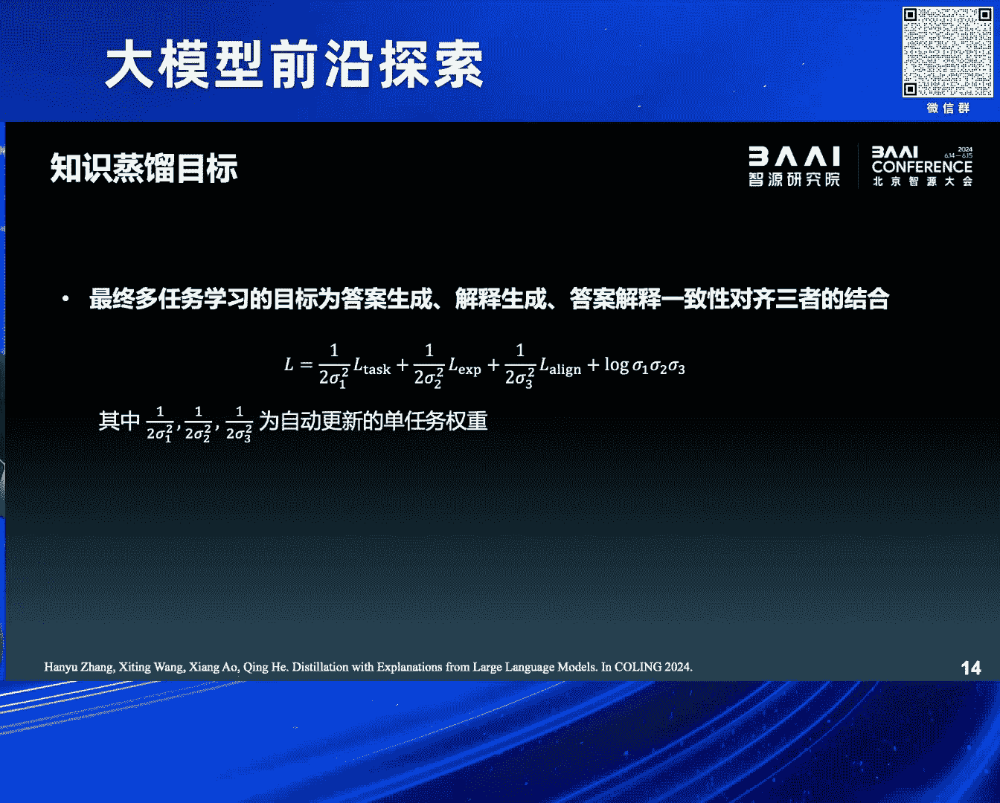
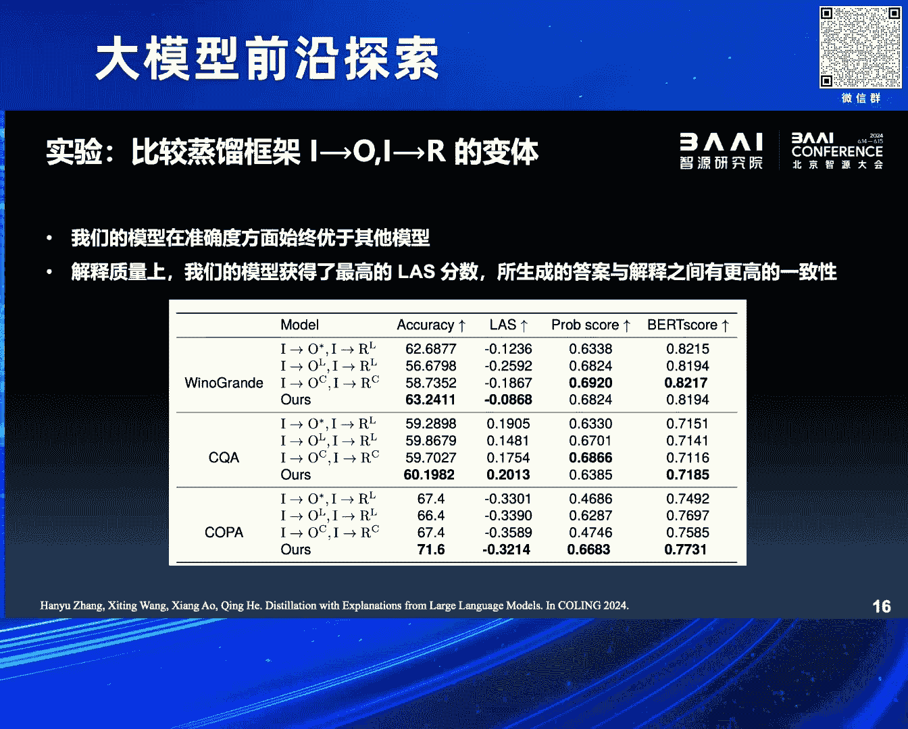
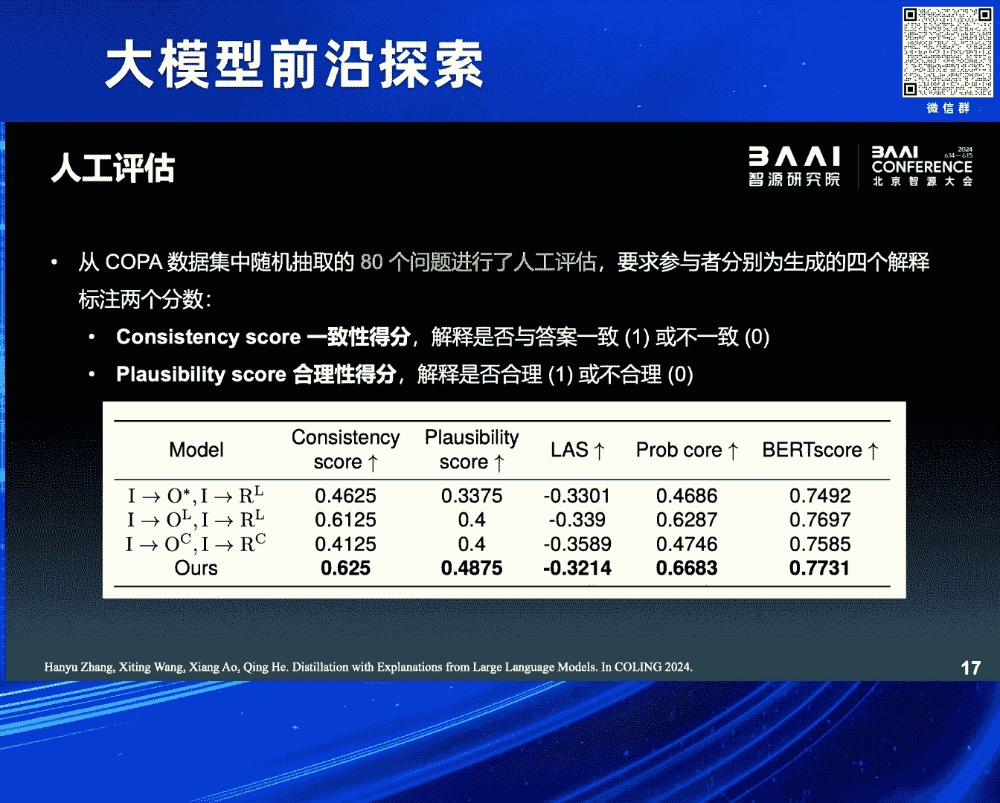
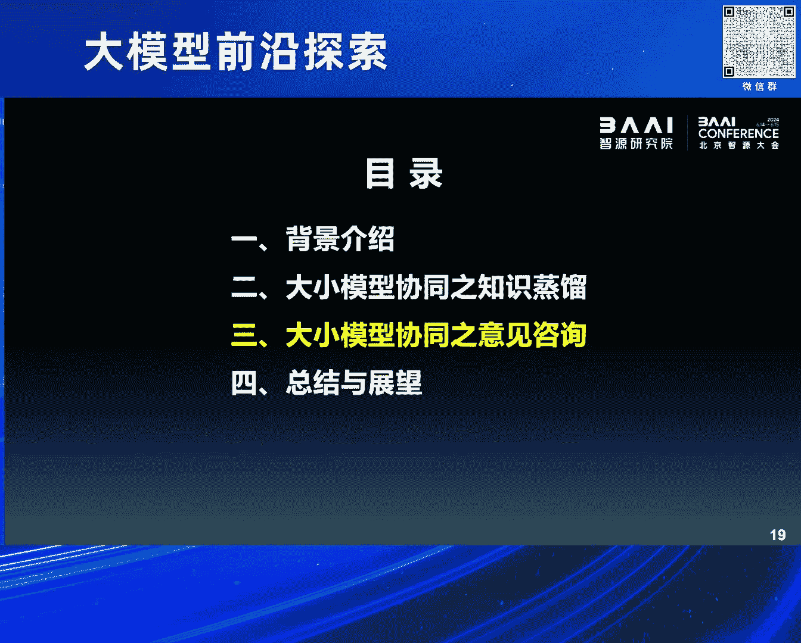
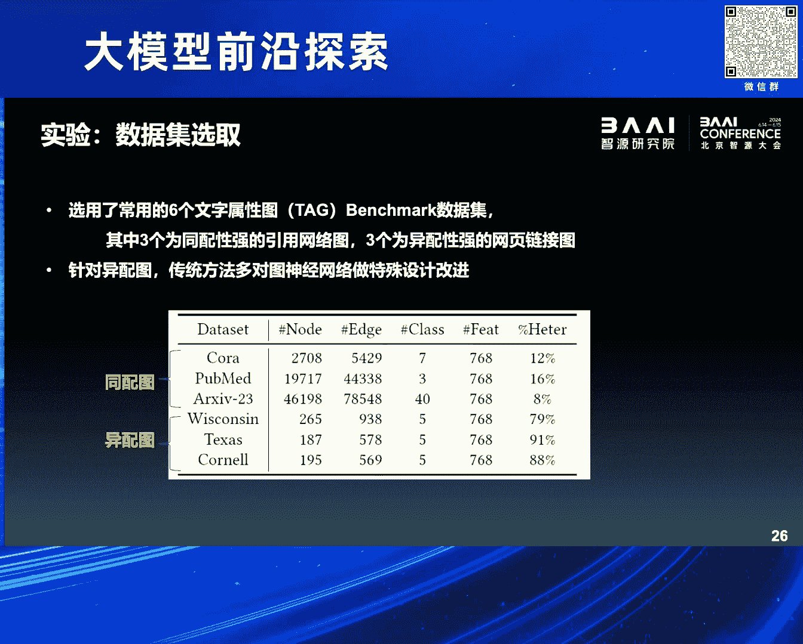
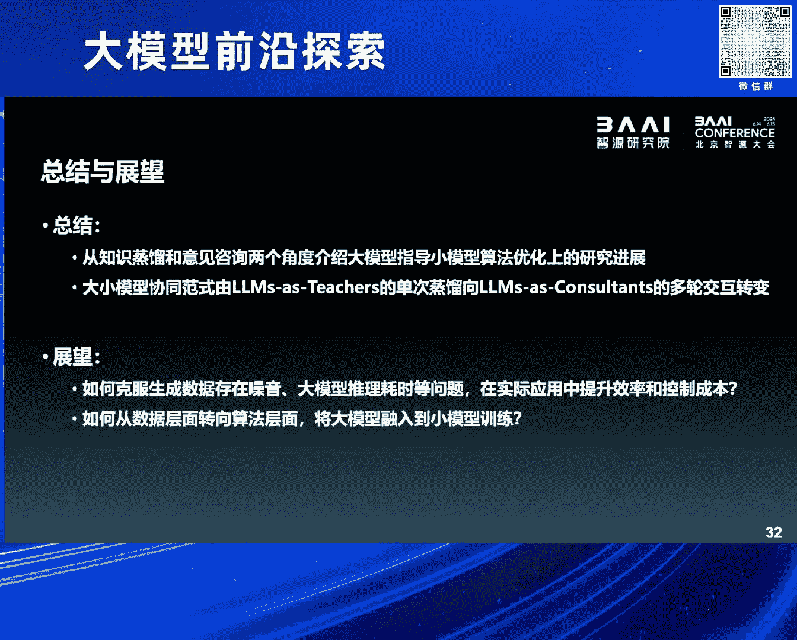

# 2024北京智源大会-大模型前沿探索 - P4：大小模型协同训练初探：敖翔 - 智源社区 - BV1yS411A73A

好 谢谢叶璇的介绍，谢谢两位主席的邀请，很高兴能够在GN大会来报告我们团队的一些研究进展，主要是在大小模型协同训练这一块，其实很惭愧，我们做这个方面的研究也是被逼无奈，就为什么这么讲。

你看基座模型一般都是像智原，像BAT这种大厂，人家有算力 有数据，然后有一堆算法工程师才能玩得起的，如果说想做垂鱼的行业的大模型，得像咱们中国电信这样有数据，然后有算力中心。

有很多这样的行业数据的机构才能做得起，如果作为我们这种高校研究机构，既没有特别大的算力，然后也没有特别多的行业数据的积累，我们也想做大模型，这时候怎么办呢，只能把大模型当成一种工具了。

作为一种比较高级的工具，然后来辅助我们日常的一些，关于小模型的研究，所以就有了这个报告，就是大小模型的一些协同训练方面的研究。

我分四个方面来介绍，首先大模型现在有多火，就不用我再赘述了，我特意浏览了一下，咱们今天上午的三个平行的论坛，除了咱们这个论坛，名字里面是显示的提了大模型三个字，另外两个论坛我看了一下名字。

一个叫做多模态论坛，多模态模型论坛，另外一个叫AI安全论坛，但是里边的报告的内容或多或少的，其实都和大模型是息息相关的，所以说就通过志愿大会这样的一个，在同一个时期举行的平行论坛。

都能够看出来现在大模型有多火，那都更不用说我在这列的这个slice了，就每一次我出来做报告，用这一页的时候我都非常的焦虑，为什么呢，就总得check一下，是不是又有一些新的东西没写上。

特别是在这个箭头上面的这些模型的名字，对吧，就从今年春节之后，大家这个耳熟能详的一个是SORA，一个是这个GPT-4O，就必须得写上对吧，但是好在呢，底下的这个核心的技术，似乎到目前为止。

我认为还没怎么变化，但是刚才听了这个叶全博士的报告，我觉得可以加上一个生长的这种训练的方式，也许可以写到这个核心的技术路线上，作为人类反馈的枪法学习的一个更先进的，更先进的一个替代。

写到最新的这个时间轴上，但不论怎么样，就是大家其实，我们说现在叫这个大模型，其实省略了几个字，叫做生成式的人工智能大模型，就前面这个生成式，大家觉得能力是非常强的，非常震撼。

但是我在这儿必须要强调的一点，就是说它除了生成能力以外，其实它的意图理解能力，还有包括分析推理能力，也是非常强的，但是可能大家都被它的生成能力震撼了以后，就忽略了这两方面的能力，那我们这个研究。

实际上主要是在用大模型的意图理解和推理的能力，然后来帮助我们做一些事情，除了我们这块有一个案例以外，昨天也是在苏州市公安局做了一定的调研学习，他们其实也是在和百度合作。

然后在用生成式大模型的意图理解和分析的能力，他们在做什么事情，他们是在用大模型做反诈的案件的推理，还是非常有意思的，大家有兴趣的话可以去关注一下，我在这就不多说了，可能有人会问说你们这么多人。

现在这么关心大模型，大模型出来以前，你们这帮做人工智能的人都在干什么呢，答案非常简单，就是我们一直在研究小模型，就是画了几个区域，原来每一个框实际上都代表了不同的门派，不同的门派。

比如说我们在分析时序数据的时候，可能大家就会用 LSTM，做这种关系数据处理的时候，可能会用图形网络GN，然后我原来可能在GN这个方向做的是比较多的，那么即使是这种生成的领域，就是在大模型出来以前。

实际上也有以干模型为代表的，这种图像的生成模型一直是存在的，包括Transformer等等，原来大家门派之间，或者说研究领域之间是基本上互斥的，就没有大模型之前，我们都认为自己是属于不同的领域。

就举个例子，可能在我后边讲的黄磊老师原来是做CV的，然后我可能是做Data Mining，做用户行为建模的，我们按理说是不会产生交集的，就不会在一个同样的论坛里，大家来做报告，因为我们属于不同的子领域。

但是现在因为有了大模型了，可能都认为你是做人工智能的，所以今天我们也在同样一个厂子碰着了，但其实多年以来小模型在各自的领域里面，还是比较不错的，都是一些SATA的代表，已经有了一些卓越的能力了。

因为大模型出来了，我们小模型还要不要，就面临了这样的一个选择，我们的回答应该是还是得要，要不然我们这么多几十年来的努力全都白费了。

对吧，而且大模型它并不是现在可以直接替代很多小模型的，只举了两个场景，第一个就是在这种端侧做轻量化部署的时候，你这么大参数的一个模型，这么耗算力费电这样的一个模型，如果放到手机里面去。

特别是大家讲如果C端的应用，对吧，一定要强调用户隐私，我要在本地部署，对不起你的手机可能会很快就没电，对吧，因为大模型非常耗电，所以在端侧部署的时候，小模型还是有一定的用武之地的。

另外在一些特定的任务上，可能还没有取得特别好的表现，比如说在一些非常专业的领域，或者是我们给他提出一些比较苛刻的要求，就是每次问他同样的问题，但是要求他的回答要保持一致。

这个对于大模型来讲可能都非常困难，因为大模型是一个生成式的，一个比较flexible的模型，对吧，所以说在当前的时代小模型并不是就一下被丢弃了，还是有一些用武之地的，怎么来让小模型发挥更好的作用。

或者说怎么让大模型去指导，优化小模型能够更好的在现在这个时代发挥自己的作用。

我们就做两方面的尝试，第一个方面我们就是用知识征流的这种思路，这个当然是比较传统的一个思路，现在如果想说大小模型怎么结合，基本上都是采用了右边的图的这样的一个方式，就是让大模型当老师。

让教小模型怎么着去更好的进行优化，然后完成它的任务，我们就用了一个代表性的任务做了一个尝试，就主要是做问答，但是这个问答跟传统的问答不太一样，在给出答案的同时，还是希望小模型能够给出一些所谓的解释。

就现在说可解释 记忆学习比较流行，所以这个问题的输入就是给一段问题，然后中间那个language model，它可大可小，可以是一个比较小参数量的一个语言模型，右边的output有两个field。

第一个就是答案是什么，关于问题的答案是什么，下边有一个解释，就这个模型必须要输出关于回答的一些解释，这是我们的一个任务的设定，但是很遗憾就这个任务实际上没有标准化的数据。

就原来我们所谓的NLP领域的benchmark。

可能只有问题和答案，但是没有解释，我们想得到这个解释怎么办，大模型就可以来稍微借鉴一下，因为大模型作为一个生成模型，你即使问它一个问题，然后让它给出答案，它会天然的生成一大堆解释。

这个时候我们就让大模型来帮我们这个任务，来生成一些所谓的训练数据，大概的形式就长这个样子，我们问大模型一个问题，然后让它回答答案，并且给出它的解释，然后它就巴拉巴拉能生成好多右边的这种训练数据。

但是我们必须要注意到，现在大模型的能力并没有完全达到一个非常巅峰的水平，它即使是做一些比较标准的benchmark，它的回答正确率也就大概是个七八十分的水平，有大概二三成的答案是回答错误的。

但是我们发现一个比较有意思的现象，即使大模型它回答这个问题回答错了，它生成的解释和它的错误答案还是非常相关的，它推理的还是比较正确的，这有一个柱状图可以看到，橘色的是它即使是回答错了。

但是它的推理依然非常有道理 非常有逻辑，跟它的错误的答案是非常一致的，比例甚至比回答正确的那部分还要高。

有了这个观测以后，我们就想能不能，我们就去训练一个所谓的这种一致性评分的模型，然后我们来评价一下，答案和解释之间的逻辑的一致性，如果一致性高的话，我们就可以用这样的数据来训练我们的小模型。

那么一致性不行的话，我们就把这个数据给扔掉了。

就非常简单的一个想法，好 这个时候我们面临这个任务的话，我们想用大模型来收集训练数据 对吧，然后就面临了两方面的选择，那么一方面就是我们完全相信大模型给的东西，就给了一个输入之后。

不管大模型回答的对或者错，然后都用它的答案和解释的这个pair，当成训练数据，这么做的话可能，虽然它的解释和答案是相对来说比较一致的，但是毕竟它的回答是错误的 对吧。

这种错误的数据会对小模型来引入一些所谓的训练噪声，最后小模型可能训练训练就跑偏了，当然还有一种做法就是，我们不是有真实的答案吗 对吧，就原始的数据集 没有解释 但是有答案 对吧。

我们可以用训练集里的ground truth当答案，然后用大模型的解释当成所谓的回答的explanation，但是这样做的话很显然，因为大模型有的时候会回答错，所以它的解释和答案之间会发生不一致 对吧。

会发生不一致，那我们怎么办呢，我们就采取了一种tradeoff的方法 对吧，刚才提到我们可以去设计，构建一个所谓答案和回答之间一致不一致的，这样的一个一致性的判别模型 对吧，就中间那个黄色的箭头。

这个时候我们就可以去构造一个所谓的一致性的函数，来评价大模型给的解释和真实答案之间的一致性，就通过我们刚才讲了判别的模型。

那么有了这个黄色的箭头以后，实际上我们再去做这个任务的时候，这就有点细节了，就简单讲一下，就三部分的loss，一部分就是给一个问题，然后给生成答案的一个loss，然后给一个问题生成解释的loss。

以及这个答案和这个解释之间一致性的一个loss，三部分这个loss，这样的话就会让小模型，从大模型给出的这些数据里，去学习到它所谓的知识，我们在三个benchmark上做了一些实验。

最后一行是我们的方法，可以发现我们跟其他的一些这种征流的框架比的话。

还是能够取得一些比较不错的提升的，然后同时我们也用这种人工的评估的方法，大概检测了80个问题，也会发现在不同的方面，我们的这个方法都会比原来的一些框架取得了一些提升。

最后看一个K-study，这个是英文展示的。

因为书籍就是英语的，它大概讲的意思就是说，这个货商对吧，货商他决定去买进羊毛对吧，卖出棉货。

因为什么东西的价格比较高，如果是我们来做这个问答题的话，肯定会选棉花对吧，就是选2B，因为价高对吧，低买高卖，因为它价格比较高，所以我把货物进行卖出，可以看到我们对比的几个方法，首先是拆GBT。

就没有回答正确，给出了一个错误的答案，那么它的解释呢，因此我们就不用看了，不用看了。

我们看其他的对比的框架，比如说一种传统的征留的框架。

它虽然答案回答的是对的，选择了棉花，但是它的解释里面，一直在写什么羊毛的价格比较高，所以答案应该是A对吧，它跟它自己已经发生了冲突，所以它的解释肯定是不正确的。

我们所提出的这种征留的框架，就不仅选择了正确的答案。

同时对答案的产生的过程，也给出了一个比较make sense的解释，就是说棉花的价格比较高，所以答案应该是选择2B，因为价高的话，它会让供货商去卖掉这个东西，然后同时去选择购买更便宜的，另外的一种商品。

所以这个是我们在NLP的子任务上，然后来看了一下，大小模型在数据层面发生协同训练之后，能够对小模型的能力能够取得一些提升。

那么除了这种比较传统的框架以外，我们团队最近也做了一些小小的探索，就是在意见咨询的视角上。

也可以去做大小模型的一个训练，那么在这我们的研究对象就不再是做NLP了，就变成了图神经网络这个领域，也就是大圆模型和graph的数据怎么来结合，这个方向还是相对来说比较前沿的，那么现有的两个范式。

分别是最左边和最右边的那种范式，左边的这种我们可以把它叫做大模型作为预测器，就是说来了一个图的数据，我们直接把这个图结构，翻译成一些文字表述的prompt，然后扔到大圆模型里面去。

然后让大圆模型去做出一些预测，然后再基于这个预测做一些精条什么的，但是在这个范式上我们会发现，GN这三个字压根都没出现过对吧，就完全用大模型在做图了，但是我们刚才知道我刚才也提到，就是在图数据的处理上。

现在图神经网络肯定是骚它，我们没有必要另起炉灶，就完全用大圆模型，而且说实话，现在大圆模型在处理图数据上，它也不是非常的擅长，我指的是graph不是image，那么当然就有，由于没有结合GN对吧。

就出现了右边的那种范式，叫做大圆模型作为增强器，在那个图上我们会发现，GN出现在最下边对吧，说明大圆模型，确实是和图神经网络发生了一些交互，但是这个交互相对来说比较初级，就有点像我刚才讲的。

我们做的第一个NLP的工作，就是通过大圆模型，去帮GN准备一些数据，就还是把图数据的结构，翻译成prompt以后，让大圆模型去做节点的属性增强，因为我们现在可能属性上，是文本的数据是比较多的。

那么增强了以后相当于，graph的data它的信息量就得到了扩充，然后再去训练GN的时候，也许效果能够提升，那么这种范式虽然跟GN发生了交互，但是我们注意到它的交互，仅发生了一次对吧。

没有充分的去利用大圆模型的推理的能力，那么于是我们就结合现有工作的一些缺陷，然后提出了一些改进，就给出了中间的一种新的范式，叫做大圆模型作为顾问，作为consultant，那么中间是一个循环对吧。

就是说我们在GN的训练过程当中，总会遇到一些比较难的case，就好比说我们看病对吧，总有一些疑难杂症对吧，可能是GN这种初级的医生是解决不了的，那么这个时候我们就把这些疑难杂症对吧。

交给一个专家大圆模型，大圆模型来针对疑难的杂症比较难的节点，去做一下预测，那么预测之后我们会把这些信息再反馈给GN，然后再去做调优，那么如此循环的这样迭代的话，最后会获得一个更强的GN，获得更强的GN。

所以这个是我们GN报告的一个核心的思想，就是用大圆模型作为工具，然后去提升那些原来传统方法的一些效果。

那么大概的一个框架就分成这几个步骤，就包括不确定点的选择，自动提示工程，大圆模型的咨询和回复的利用等等。

分别来看一下，我们刚才讲就是说我们并不希望所有的点，都去问大圆模型，原因因为GN它能力还可以对吧，有一些简单的case，我们就没有必要惊动专家了对吧，所以我们只去挑选部分节点，那怎么来挑呢。

我们可以用简单的一种策略，就是通过不同的参数，去构造不同版本的图神经网络，然后对同一个图来做预测，那么预测的时候总会出现在某些节点上，它的预测的方差，就是分类的概率它的方差比较大，那么这种概率大的节点。

这个方差比较大的节点，我们就认为是所谓的疑难杂症。

然后我们就开始向大圆模型发起咨询对吧，那么咨询的时候，我们就得向大圆模型来描述节点的情况，这块也比较简单，我们就把节点周围的一些邻居，就是连边，连边的一些一二阶的邻居的信息。

包括这些节点的属性以及label，还有GN是怎么预测的，就像写病历一样，写成一些文字的信息，然后来向大圆模型发出一个提问，那么大圆模型接到了这些输入之后，它会根据它的一些理解对吧，做推理分析。

最后给出它的回复，它的回复我们要求的格式也比较简单，一个就是这个节点到底是哪个类，标签是什么，第二就是对于它的分类，要给出它的推理的解释，那么有了这个回复以后，我们毕竟要和GN做联合的训练对吧。

我们怎么来让GN来使用这些文本呢，那么这块用了一些比较启发式的方法，我们知道大圆模型对图结构，就图结点做分类的时候，无非会遇到两种情况，一种情况就是大圆模型。

它的预测和我的ground truth之间是一致的，就是它预测对了，那么预测对的时候，我们就自然相信它的解释也比较合理对吧，因为刚才我第一个工作里面已经讲了，就是它大圆模型每次对自己的回答的推理。

还是比较合理的，我们也相信它的解释是比较合理的，我们可以遵循像大圆模型，作为增强器这样的方式，把大圆模型反馈回来的文本的解释，作为图上这个节点的属性的补充，就直接把这个文本堆到它的属性里。

这样的话能够带来更丰富的，一些语义信息的补充，当然大圆模型也会有失误的时候对吧，就是它的预测和ground truth之间是不一致的，就是大圆模型也没有搞对疑难杂症，那么在这种时候我们就做了一个假设。

就之所以GNN预测放差比较大，这个节点比较难，大圆模型也做不对，是因为它周边的图结构出了问题，可能是在我们构图的时候，由于我们的这种规则设计的不好，它有一些噪声连边被加进来了。

或者是这个节点遭到了某些注入的攻击，有一些噪声的连边存在，这个时候我们就把它周围的结构做一个简化，让它连边的关系得到一个比较简单的情况，看能不能做对，说白了就是把一些连边给它剪掉。

剪掉之后看下一次GNN还能不能预测对，所以有两种利用它反馈的方法，那么整个的设定我大概就讲完了，然后因为我们是在transactive的场景下做的，所以我们在大图上一上来。

就能够看到所有的training sample跟test sample，所以我们任何一次大圆模型的反馈，无论是属性增强也好，还是结构的去造也好，都是在整张图上能够可见的，那么在最后的测试的阶段。

由于我们的GNN已经在不断的，和大圆模型的交互当中得到了强化，所以在测试的时候，它已经是一个得到了专家指导的，一个中级医生了对吧，所以它就不用再去向大圆模型发起咨询了。

直接对那些test sample做出自己的预测，当然我们的实验结果也是比较受鼓舞，我们为了去充分的验证，这样的一个方式能不能有效，所以我们在同配偏好的图上，还有包括异配偏好的图上，都分别做了实验。

可以看到我们的训练的方式，然后和一些非常传统的GNN做了一些结合，就上半篮这些方法，基本上都是在19年以前的，一些经典的GNN的方法，那么当它和大圆模型发生了协同训练，开始交互学习之后。

它可以和底下的这些22年23年，提出的SALTA的GNN的方法，达到一个可比的状态，在某些数据集上，甚至会比SALTA的GNN还要更强一些，当然我们也可以把这种范式，装配到这些SALTA的GNN上。

也许会更好，但是我们没做这方面的实验，这是相容实验跳过了，同时我们也可以跟其他的范式，做了一些对比，比如说大圆模型作为预测器，作为增强器都是已有的范式，我们的方法也能够在更小参数的，大圆模型的加持下。

取得一个稳定的提升，对我还有一分钟的时间，做一下总结和展望，实际上作为高校研究所，没有算力资源，没有数据资源，我们也去想用大圆模型，帮助我们做一些工作，所以我们就选择了，用大圆模型来辅助。

机器学习模型的构建这个角度，我们采用了两个框架，一个是智识征流，比较传统的结合的方式，还有意见咨询两个角度，分别在大小模型的协同训练上，做了一些探索，那么特别是大圆模型，作为咨询师或者作为专家。

这样的一个框架，我相信不只是在GNN的训练上，也许在其他小模型的训练上，都能够得到一些应用，那么当然我们目前的这种方式，它还有很多局限，很多局限，比如说大圆模型，它整个的推理过程还是比较慢的。

我们现在做图数据的训练，说句实话还是非常高效的，那么结合了大圆模型以后，尽管我们只问部分的节点，那么整体的训练的效率也会被拖慢，所以在实际的运用当中，如何去提升效率 控制成本，这是一个非常重要的问题。

那么另外我们目前大圆模型，和小模型之间的交互，还是停留在数据层面的，第一个工作是做训练数据的生成，对吧，第二个工作是在训练过程当中，做一些数据的增强，结构的去造等等，还是在数据层面。

那么什么时候能够在算法层面，比如说在模型的设计上，对吧，这个Loss的改进上，能够采用上大圆模型的能力，也许是更值得研究的一个话题，好 那以上就是我今天的报告，说的不对的地儿，敬请各位批评指正 谢谢。

感谢敖乡博士的精彩报告，现在请现场观众提问，谢谢老师，我提个关于图的一个小问题，就是我想问一下，现在用的是现成的大圆模型，是不是，有没有针对图数据的这种大模型，就是我这个大模型，在前期训练的阶段。

就是用的图的数据，然后我在各种各样的图的任务上，都会有一些效果，而不是说用的预训练的大圆模型，就这方面，不知道老师看能不能给一些，展望或者说看法，好 谢谢您的问题，就实际上您说的针对图的数据。

去精调大圆模型，或者是构建所谓的图基础模型，还是有的，但是我们团队，反正我个人，我是不支持这样的技术路线，因为是我感觉这样的，就首先就说你精调完了以后，因为图的下游任务，无非就是两种，一种是节点分类。

一种是链接预测，它不像自然语言，或者是图像，它的下游任务非常多，所以我们是否有必要去，构建一个需要大量的，数据的标注，因为你要做精调肯定要标注，然后甚至是丛林，构建一个针对图的基础模型，是否有必要。

这个是存疑的，而且现在对吧，像叶全他们万亿级的参数的模型，能力已经非常强了，我们在这轻量级的用一下，如果能够帮助我们做提升，何乐而不为，这是我个人观点，谢谢您的问题，不知道能不能回答您的问题。

对 您说那种路线实际上是有的，而且也非常火，好 谢谢奥像博士。