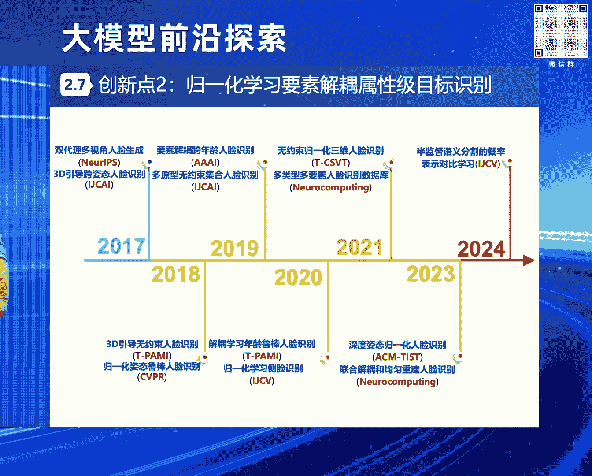
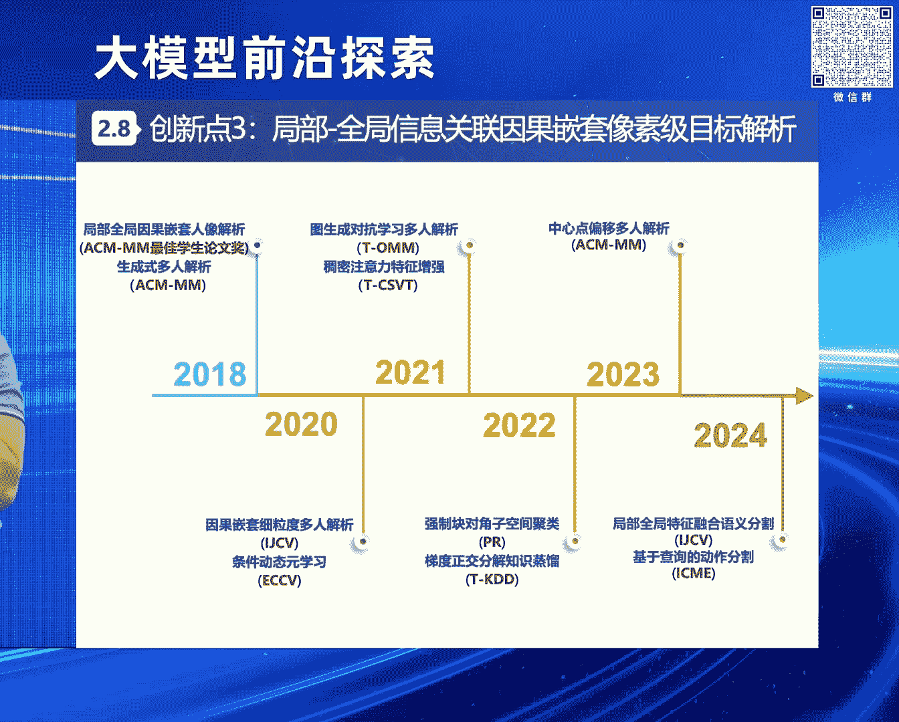

# 2024北京智源大会-大模型前沿探索 - P6：无约束感知理解：从视觉垂域建模到多模态统一与多任务协同：赵 健 - 智源社区 - BV1yS411A73A

【採訪撰稿/後製作：莊奴 攝影剪輯/蘇顯榮】，感謝葉全老師的介紹，感謝永祥總和葉全老師的精心組織，實際上剛才大家很多專家老師，介紹的都很全面了，然後從葉全老師一開始介紹我們，電信和智原研究院合作的。

全球首個稠密的大模型，到雙永老師介紹的，電信在大模型方面的一些，比較好的一些實踐和探索，然後再到敖老師介紹的，大小模型的這個協同，然後再到黃磊老師介紹的，從機器學習到深度學習。

再到大模型時代的一些理論分析，所以我主要是結合一個具體的，一個問題也好 或者是一個場景也好，或者是一個應用也好，來跟大家做一些我們在這個無約束感知理解，從視覺垂域的建模到多模態統一。

和多任務協同方面的一些研究思考和體會。

剛才葉全老師已經對我做過了一些介紹，在這裡我就不贅述了，那麼人工智能發展到現在這個時期的話，其實大家可能都有很多的這種感觸，就是說以前我們的創新模式的話，實際上是學術界一直在引領工業界。

那麼現在大模型時代多模態生成式，實際上就是很多的很多程度上，或者是某種程度上，是這個工業界在開始引領這個學術界，進行這種創新和應用的這種發展，所以這個我們電信的話，其實在這個數據算力場景等等方面。

都有非常大的優勢，那麼我們現在也在吸引一些人才的加盟，所以如果大家有自薦，或者是推薦的一些優秀的候選人的話，歡迎跟我們取得聯繫，然後視覺目標的感知理解的話，實際上是一個非常重要的一個國家發展的需求。

比如說2019年國務院新聞辦，這個新時代的中國國防裡面，就指出這個複雜對抗環境下，國防安全任務艱鉅繁重，那麼需要重點發展視覺目標的感知理解，那麼2022年國自然的這個十四五的發展規劃裡面。

也指出需要這個攻克多元異構信息的融合感知理解，這個意義是十分重大的，所以迫切的需要這個視覺目標的感知理解，那麼視覺目標的感知理解是什麼呢，它實際上就是去獲取我們圖像或者是視頻裡面。

一些比如說像人車物等等這樣的一些目標的，關鍵信息和關聯屬性，那麼多年以來，它一直都是我們這個人工智能領域的非常重要的科學問題，同時也在比如說像國防反恐，公共安全以及民生經濟等等方面。

有非常廣闊的應用前景。

但是的話無約束條件下，我們的視覺目標感知理解仍然面臨很多的這種挑戰，這些挑戰主要包括各種內外在因素的偶合的這種影響，那麼會對我們的視覺目標的感知理解，造成求解建模上面的這種困難。

比如說我們為了防範某個核心區和它周界的安全威脅，那麼我們需要對它的監控圖像視頻裡面的重要目標的，關鍵信息和關聯屬性，進行一種層次化的感知和理解，那麼首先我們需要去對態勢信息來進行感知。

包括檢測可疑目標的狀態信息，來預測它的趨勢信息，然後進而進行屬性信息的關聯，關聯關注目標的屬性信息，得到它的屬性的描述，再進而去理解它的精細化的語意的信息，也就是解析重點目標的像素級的語意信息。

來獲取到它的精細化的這種特徵，那麼實際上我們發現就是說在這個裡面的話，在影空間裡面的話，它的各種挑戰性因素以及跟目標息息相關的，它的這種關鍵信息實際上是緊偶合的一個狀態，那麼這個不利於我們去對目標的。

它所涉及到的一些信息來進行這種感知和理解，所以這個裡面一個關鍵的科學問題，就是說我們怎麼去探究，在這個複雜要素偶合空間裡面。

來進行這個屬性關係挖掘和識別的激勵，所以我們也是圍繞這樣的一個科學問題，來提出了一個科學的思路，叫做數據與知識混合驅動的深度感知理解，那麼我們也是進行了這個三項，層層遞進相互支撐的研究工作。

包括這個多模融合學習的態勢感知，要素結偶學習的屬性關聯，以及因果嵌套學習的語意理解，並且也分別進行了相應的這種創新，首先我介紹一下這個第一項研究內容，每一個研究內容我都是從一個問題背景來引入。

這個第一項研究內容它的這個問題背景，比如說我們現在這個國際上，大家都關注的一個問題是反無人機的一個問題，就是說為了保障某要地的低空安全，我們需要對這個微小型無人機等等一些可疑目標的。

這個時空關鍵信息來進行這個感知取證，並且輔助一些這種反智的手段來進行管控，那麼在這個多模融合學習態勢感知裡面，我們主要是研究怎麼樣去通過融合這個紅外啊，可見光啊等等一些多元信息，它的一些互補的優勢。

來實現這個目標的空間位置等等狀態信息的檢測，和它的這個運動軌跡等等一些趨勢信息的預測，但是在這個裡面其實存在很多的挑戰，比如說在我們所說的這個無約束條件下，或者是非配合條件下，那麼目標它在運動的過程中。

會不斷的受到速度背景障礙物等等一些影響，那麼會導致它的這個視覺觀測會產生多變性，那麼會導致我們這個態勢信息的獲取不精確，那麼針對這樣的挑戰呢。

我們也是做了一系列的工作，那麼在這個RGBT的這個弱小目標跟蹤的這樣的一個場景下，那麼傳統方法呢主要是針對這個基於這個一接交互和靜態模板的方式，那麼會導致這個力度單一表徵低效。

那麼我們提出一個創新的思路，是這個雙流知識遷移的多模融合實例及目標跟蹤，可以通過這個多接偶和雙流集聯，聯合著去感知它的這個全局和局部的這個信息，能夠實現多接信息的這個融合互補。

時空線索的連動建模和這個層級知識的集連遷移。

那麼同時的話我們也構建了一個大規模的，這個多模融合的無人機跟蹤的這個基準數據集，那麼相比於此前這個相關的一些這個數據的話，我們有效標籤實際上超乎了35。9%。

那麼如果有這個老師或者是同學們關注我們這個方向的話，我們這個方向叫NTUAV，如果有人關注我們這個方向的話，實際上也會知道就是說我們一直是圍繞這個方向在進行深耕，國際上我們是首次提出來這個問題。

就是反無人機這個問題，然後我們也是多年來持續的在圍繞這個方向，不斷的在進行這個構建這個數據，然後不斷的在這個像CVPR， ICCV這樣的一些國際頂會上。

在組織這樣的一些workshop和challenge，來推動這個領域的發展和進步，然後接下來我們馬上要依托CVPR 2025，組織這個第四屆NTUAV workshop and challenge。

也是歡迎大家關注和參加，然後我們的方法的話也是，在這個複雜環境多重遮擋的這樣的條件下，相比於此前這個最優的方法，相對精度提升了有19。95個點，然後這個是國際上面的一些學者。

對我們方法的一些正面的一些評價，然後我們的相關的算法也拿到了，比如說中國人工智能大賽A級證書，以及CVPR上面的一些比賽的獎項等等，然後剛才我也介紹了，我也是多次作為第一負責人。

來在國際的頂會上組織這樣的topic的一些學術活動，吸引了很多的國內外的機構來進行參加，然後我們的相關的成果，現在也落地到了一些，包括一些國家的重要部門，我們也跟花樣滑冰協會做了合作。

開發了相關的一些系統，然後目前估值也非常好，然後下面介紹我們的第二項工作，比如說我們在某個突發的公共安全事件裡面，我們需要對實施違法行為的一些關注目標，它的面部的特徵來進行感知，識別它的身份的信息。

來實施這種追查佈控，那麼在要素結偶學習的屬性關聯裡面，我們就需要研究怎麼樣去通過，充分挖掘目標的內在屬性偶合的結構，和它的這種相互之間的這種關聯關係，來發現屬性和屬性之間的這種複雜的依賴。

來實現這個目標的身份類別等等，這樣的一些信息的精確的識別，但是在這個無約束條件下，實際上目標經常會受到這種姿態等等，一些內在屬性的偶合影響，和這種視角啊 分辨率啊等等，一些外在因素的干擾影響。

那麼就會導致它的這個屬性識別的結果不夠精準，那麼我們也是做了很多的工作，來解決這樣的一些挑戰和難點。

那麼傳統方法的話主要是通過，比如說合成圖像直接學習的方式，那麼就會導致這個分佈的差異和屬性偶合的一些挑戰，我們提出這種皈依化學習要素結偶的屬性及目標識別的這種解決思路，通過這個多屬性依賴的這種關係建模。

和皈依化學習要素結偶，可以充分的釐清屬性偶合的結構，然後統一的去處理各種各樣的一些挑戰性的因素，然後實現這種各種關聯屬性的皈依化學習。

我們的方法的話相比於之前馬爾獎得主，Andrew Zissman的Fisher Vector等等一些經典的算法，相對識別精度提升了超過50%，然後此外的話我們在一些大姿態。

極端姿態等等一些條件下相比於之前的方法，相對識別精度也得到了大幅的這種提升，然後特別值得一提的是我們也把我們的方法做了開源，在GitHub上面我們release了一個repo叫Face Evolve。

相信很多同學也都用過，目前在GitHub上面反響非常好，有3000多次的STAR和700多次的FORK，然後我們也對國產化的深度學習的框架，比如說百度的PedalPedal以及清華的寄圖。

進行了這種適配，並且被他們官方引入了，現在大家的反響和使用率都非常的高，也幫助了很多的學者，包括做了研究和轉化，這個是國際上面的一些評價的一些情況，然後我們的相關的算法的話。

也獲得了包括ICCV2021的口罩人臉識別競賽的冠軍，因為當時正好趕上疫情，所以口罩人臉識別也是一個比較熱的話題，然後以及美國國家標準技術研究院，搞的一個無約束人臉識別競賽。

我們是在所有的track上面都拿到了冠軍，然後還有之前微軟搞的百萬名人識別的一個比賽，我們也是在所有的track上面都拿到了冠軍，然後也是因此我跟微軟亞洲研究院的一些組織。

這些學術活動的老師得到了這種很好的交往，也成為了朋友，不打不相識，然後我們也是在這個方向上面組織了很多的學術活動，包括在軍委科技委支持下，我們組織了地面哨兵的挑戰賽，以及VALS的這種系列的活動。

然後我們的一些成果也成功的落地到了一些國家的重要部門，包括還有螞蟻金服的可信人臉識別系統裡面，服務覆蓋了1。2億的用戶，然後累計支持了150億津貼的發放等等，然後下面介紹一下我們的第三項內容。

比如說在某個聚集性的活動裡面，我們重點目標通常是藏在人群裡面的，那麼我們需要分析不同目標的這種詳細的特徵，來理解它的這種精細化的語意信息，實施精細的這種檢索，所以因果嵌套的語意理解的話。

主要是研究怎麼樣去逐步地建模這個複雜的場景，然後以及由粗到精信息的漸進式的反饋，把這種高複雜度的任務向低複雜的任務進行分解和轉化，最終實現這種精細化的語意的理解，但是在無約束的條件下。

因為人群裡面這個目標的話，它可能距離比較遠，會導致輪廓的模糊，並且因為交互的問題或者是遮擋的問題都比較嚴重，會導致它的場景的複雜度會產生多元性，那麼就會導致我們最後的語意理解不夠精細。

那麼我們也是做了一系列的工作來解決這樣的問題。

傳統方法主要是這種基於cascade的方式，就是多階段相互獨立 多階段分開去進行處理，那麼會導致特徵沒有關聯 語意也容易混淆，那麼我們提出局部全局信息關聯的，因果嵌套像素級目標解析這樣的一個方案。

通過局部和全局的關聯以及因果嵌套的學習，可以實現特徵的協同優化和語意的因果推理。

那麼此外的話我們也是構建了這方面的一個，大規模的 細膩度的語意理解的數據集，然後在數據的規模上相比於之前的工作超乎了5倍，在數據標注的類別上相比於之前工作超過了3倍。

然後現在也被多個國際上的知名機構所廣泛的使用，反響也非常好，然後我們的算法的話相比於之前的比如說MH-PASR等等，一些經典的方法的話，在保證性能有些許提升的同時，在推理速度上也提升了10倍。

相比於RestNet作者何凱明的一個MAS-RCN，我們的平均的精度提升了13。95個點。

然後也得到了一些國際學者的評價，然後我們的相關的算法的話也拿到了一些，比如說像ACM Multimedia的Best Student Paper，然後以及新加坡模式識別協會的金獎。

然後同時的話我們也是組織了很多這方面的學術活動，來推動這個領域的發展和進步，我們的最後的學術成果也成功的落地到了一些國家的重要部門，以及像75360等等這樣的一些單位，取得了一些經濟效益。

那麼我們在長期的研究和實踐的過程中，實際上發現就是說在視覺目標的感知理解方面的話，只利用視覺信息，往往我們獲取到的有用的信息的話，實際上是不夠全面的，然後只研究我們所謂的專用智能。

或者是某個領域的針對某個問題的，所開發的這種模型的話，實際上它的認知能力是有限的，那麼這樣的話就是沒有辦法去應對，多模態非完整信息的感知理解的這樣的一個新的需求，因為我們人在感知這個世界的時候。

實際上就是包括了觸覺 聽覺 嗅覺等等，它實際上本質上就是一個多模態的，但是在每種模態下，它所獲取到的這些信息實際上，更多的是這種非完整的信息，就是每種模態下面的信息是不完備的。

那麼怎麼樣去針對這種多模態非完整信息，這樣的條件下獲取到更精確的目標畫像，來進行更好的感知理解，實際上我們思考就是說從三個方面來進行擴展，一個是從視覺模態來擴展到，各種各樣的一些多模態進行融合。

另外一個是從各個子問題，或者是各個垂域的專用模型，來擴展到跨域的通用模型，然後面向的場景的話，實際上也是從之前的這種單一的場景，負壓度比較低的場景，來向多樣化的一些場景。

負壓度比較高的場景來進行拓展和延伸，那麼最終的話，我們的願景的話是構建一個多模態。

多任務聯合驅動的通用模型，那麼實際上這個就是說從視覺垂域建模，到多模態統一和多任務協同，這個也是所謂的需求牽引突破瓶頸，有這樣的屬性，就是說它既符合國家的一些需求和指引。

那麼同時的話也是近幾年國際上面的研究前沿。

那麼這個是我們所設計的一些，研究的思路性的一個架構，就是說針對探究多模態非完整信息與一對齊，和多任務協同激勵這樣的一個科學問題，我們從哪幾個方面來入手，那麼主要是從四個方面，一個是多元融合。

就是解決多模態理解的問題，然後再到通用模型的設計，解決模型的設計問題，然後再到多任務學習，解決多任務學習激勵的問題，再到增量學習持續優化，然後也分別去尋求一些不同層面的創新。

然後最後面向比如說區域安防 居神智能等等，一些不同的應用的場景，來進行驗證和賦能。

那麼時間關係的話，我在這裡面可能不會介紹一些特別細的這種技術細節，主要是一些介紹不同研究內容下面所面臨的挑戰，或者是一些綱領性的思路，那麼在多模態建模和與一對齊裡面。

實際上我們主要是想要解決怎麼樣去實現，多元異構信息的優勢互補和交互協作，那麼得到各種各樣的一些信息融合的通用學習的框架，那麼主要我們考慮的話就包括兩個大的部分，一個是多模態數據的離散結構表示。

一個是特徵與一空間的這種對齊，就是把不同模態的數據來進行引空間的結構，利用強乳棒性的離散表徵空間，對這個數據進行建模，同時的話引入與一空間對齊的機制，實現多模態信息在引空間的真正的這種對齊。

然後第二個內容的話就是通用模型的設計和輕量化，這個裡面主要是要考慮，怎麼去編碼不同尺度的多模態的信號，來提取模態間和模態內的複雜的交互關係，並且在多任務學習等等一些任務裡面，來減小我們的計算量。

那麼也是包括了兩個部分，一個是多尺度的數據的長程建模，還有多模態的聯合表徵學習。

在多任務學習裡面的話，我們主要是要考慮，怎麼去設計這種多模態的輸入和多類型任務的，一種輕量化的模型的架構，來實現一體化的多任務聯合的處理，實際上就是要研究清楚多任務學習的機理和機制。

因為大家都知道多任務學習的過程中，有些任務是相互促進的，有些任務是相互抑制的，我們要搞清楚機理和機制的話，才能更好的進行多模態多任務統一的這種學習和表示。

然後最後一個的話是增量學習，就是說怎麼去構建一個統一的優化框架，來不斷的去處理我們現實世界裡面的連續的信息流，構建一個共享的表徵空間，來增強我們模型的小樣本學習能力，零樣本學習能力和泛化的能力。

讓我們的模型在實際的問題裡面，能夠不斷的迭代 不斷的進化，不斷的變得越來越聰明，這個也是不管是學者也好，還是產業界的同仁們也好，所關注的一個比較重要的問題，實際上我們現在就是在基於這些方向的話。

也在不斷的去做一些研究和探索，然後很多研究成果的話，我們不久都會放出來，不久都會放出來，剛才這個雙勇老師講的一些成果的話，實際上是裡面的某一些維度，然後其他一些維度包括我剛才講的。

後面我們不斷的會有新的成果，會跟大家見面，然後最後的話做一個小的總結吧，就是說現在人工智能發展的非常快，每一天都會有新的進展，每一天都會有新的這種突破，雖然這個未來可能是不確定的。

但是我們相信這個未來一定會越來越好，然後我們也是希望跟各界的同仁們一起，我們一道大家一起努力，然後讓一些不可能變成可能。

好 謝謝，感謝趙建博士的精彩報告，讓更多的不可能變成可能，然後下面有請觀眾提問一個問題，請，剛才老師說的那個關於無人機的那個，就是它的距離控制和那個識別的問題，我也關注過這個一點。

我是用那個想用那個什麼叫，「透視」空間就是找座標，就是它沒法聚焦和座標，去控制它的距離到底是哪裡，當時我剛才看到那個視頻裡面也有，用光譜來做，但光譜它的干擾的那個因素太大，其實它就是可以用建築物的座標。

用地標 是吧，這樣子的話我覺得可能會解決這個問題，對 您說的這個很好啊。

就是說我們實際在實際應用裡面，在實際應用裡面去解決這個反無人機的問題的時候，實際上是包括了三個子系統，一個是預警探測，一個是防禦處置，還有一個是指揮控制，實際上跟這個感知相關的，就是在這個預警探測裡面。

那麼在預警探測裡面的話，我們是一個多模態的，是一個多模態的，就是說除了視覺的這個設備以外，視覺的設備就是指的這個光電探頭，帶轉台的光電探頭，有這個紅外的視場，也有可見光的視場，然後它上面帶激光測距的。

然後呢此外的話，我們還包括了這個雷達的探測設備，和無線電頻譜的偵測設備，所以實際上就是一個多模態融合，來解決這個目標位置信息，和它的這個其他的一些關鍵信息的探測的，這樣的一個問題。

當然我們在做這個學術研究的時候，因為我們可能更多的，比如說涉及到這個多媒體啊。

涉及到CVE啊，這樣的一些問題的時候，我們可能主要關注這個，在一些視覺領域怎麼更好地解決，這個目標的這個狀態和趨勢信息的感知，謝謝，感謝趙建博士。

