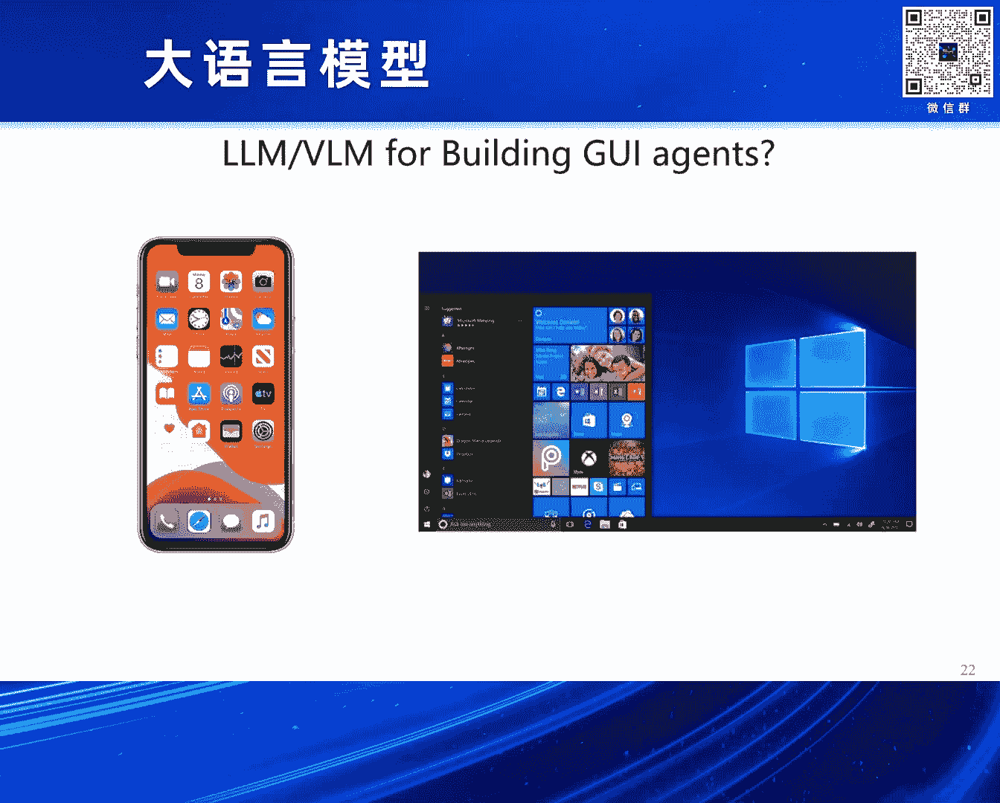
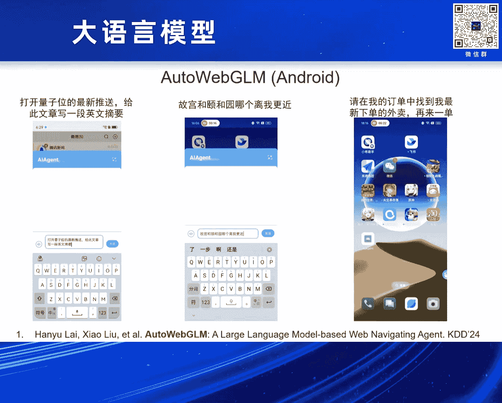
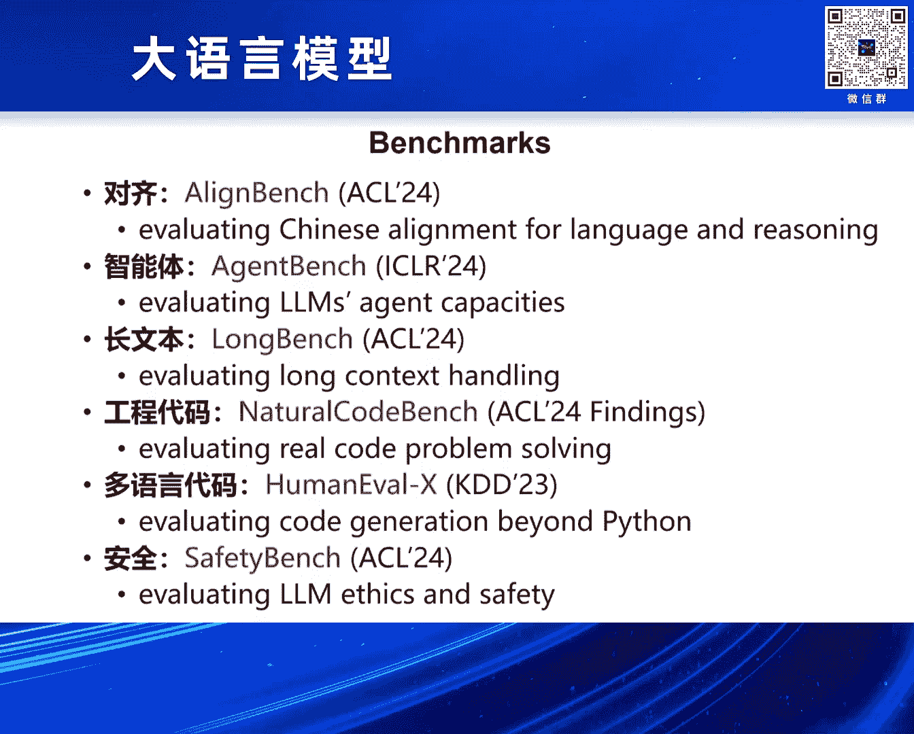
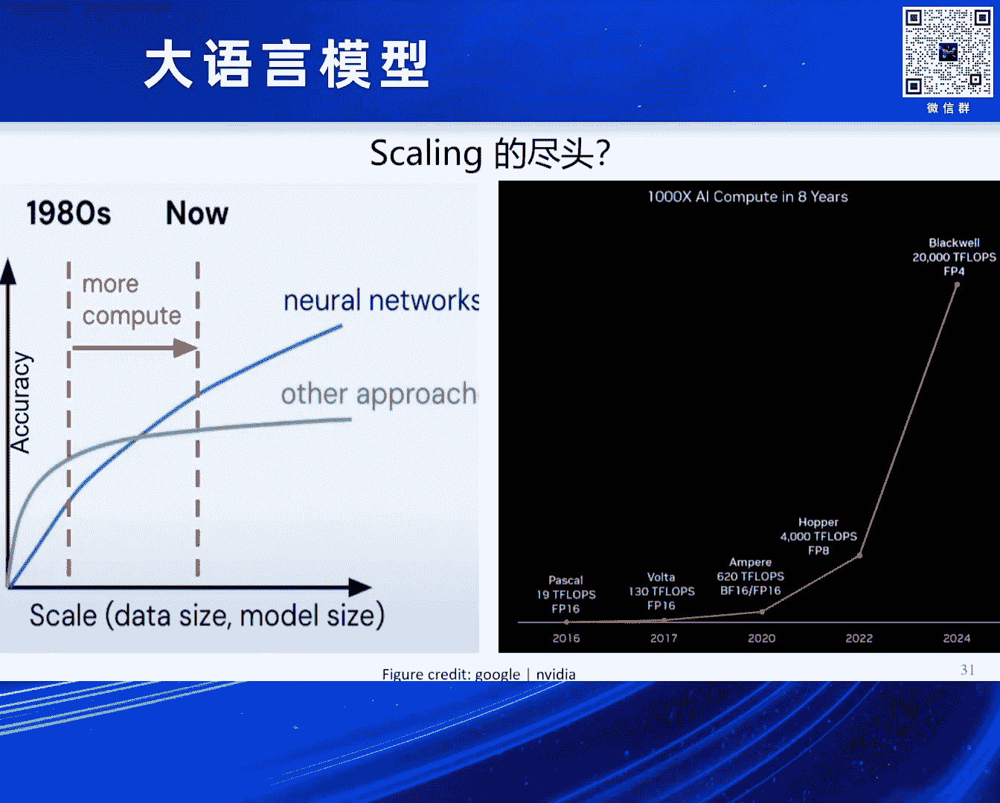

# 2024北京智源大会-大语言模型 - P3：理解与探索大模型能力涌现--东昱晓- - 智源社区 - BV1zE421N7UJ

然后大家下午好，我是来自清华计算机系的东云晓，然后今天给大家分享，我们其实在其实是我们做JL模型，系列模型做了很长一段时间，但是今天的报告可能更多的是过去半年的一些，呃成果，KOK那首先大家知道。

其实我们做大模型其实其实需要算力，需要数据，需要所有的这些，其实最终的一个前提是需要人对吧，需要我们过去呃，呃大约34年四五年的时间吧，很幸运，其实跟呃很多青年的同学，青年的同事呃，青年的老师。

还有那个那个在唐杰老师的带领下，其实我们一直在折腾大模型，然后我今天介绍的工作，其实主要是呃这几位年轻的同学和学者呃，在过去一段时间的一些成果，可那我们直接直入主题，其实我特别开心，那个赫迪老师。

刚才关于最后一个问题的那个答案，他如果说理论上已经证明了，我们我们应该怎么堆积木，或者是不需要堆积木，或者是怎么堆啊，堆多少，我觉得今天我这个报告就可以就轻松了，或者说我们接下来的这个这个工作就轻松了。

就不用像过去很长一段时间，相对来说非常焦虑的，这个跟大家就不得已的这种互卷大模型，互卷训练，互卷对齐等等一些情况，可那呃首先直入主题的话，大模型其实这张PPT或者这个截图。

应该大家在过去从ChatGPT出来之前吧，大家应该都经常看到这个图，就是那个JASONWEI他们在呃，那个在google和STANFORD一起合作的一个研究，他当时实际上就是empirical的呃。

揭示了一个现象，就是说随着就是比如说在这张图里，随着横坐标这个这个这个参模型参数量的大小，或者说计算量的大小，对相关的一些呃，这个学术的benchmark或者test set的一些成果呃。

一些这个这个所谓的performance性能，大家可以看当时的一个结论，核心它的一个imperial的一个核心的结论，就是说随着参数量的变大，实际上呃模型在呃达到一个阈值之前。

参数量或者是计算量达到阈值之前，效果其实没有呃，比随机猜，或者是这个普通的模型取得更好的一个呃，这个效果，那但是达到一个阈值，大约是一个百亿到接近千亿的一个规模时，大家就发现了所谓的这个量变引起质变。

这个现象，就所谓的他在论文中叫所谓的这个，Emergenability，咱们翻译成一般翻译成这个这个这个叫呃，大模型的这个能力涌现呸，那当然大家可能也知道。

去年的那个neurope outstanding paper，实际上是给了这篇这篇paper，核心也也当然也是来自STANFORD团队，他当他核心研究的一个，或者说它核心的一个结论是说。

实际上它从某种意义上是想说明说，其实这个emoderate ability，或者大模型的涌现能力，实际上可能与这个model的size，Model skill。

无论是by model size这个参数量的size，或者是by这个computer size，其实关系都不是很大，这是呃最上面那个title，实际上它是原文中的一句话，他就是说。

实际上可能更多的是我们使用的MATRIC相关诶，比如说他就说可能是，比如说左边的图和右边的图的对比，他就说如果我们用非线性的，或者这个非呃这个连续的这种metric。

实际上我们可能会观测到这个所谓的emergent，Ability，但是呢如果我们把它变成linear的这种score，或者是说呃连续的score这种metric的话。

实际上这个好像是随着模型的这个scale，up起来之后，其实效果并没出现所谓的那个faze transition，那个那个那个那个月变的那个过程，或者那个那个那个节点，可OK这是他们的一一个核心结论。

实际上对于我们来说，我们过去一段时间就是一直在训模型，其实也一直想了解说到底什么能够盖的，我们或者说决定帮我们做这个各种decision，当我们训练一个模型的时候，训多大，训多久，训多少数据量。

用多少计算量，实际上我们在做这个过程，最近呃应该是去年下半年，当然我们放出来是今年年初呃，我们有个同学叫郑晓，实际上他咳实际上也是GM的一作，它实际上就在呃训练大模型的前线呢，实际上就发现了一个规律。

那具体来说是，它实际上CONFIGU了大约七个不同的模型大小，比如说从3E参数55。400000000参数，一直到320亿参数，然后用不同的这个数据量的大小来训了，From scratch。

训了30几个这个所谓的大模型，然后看呃fix很多factor之后，看这个模型在这个这个downstream的各种task上，各种奔驰Mark上的一个效果，然后试图发现有没有一个潜在的规律，来帮我们呃。

指导我们更好的在做模型训练的各种decision诶，这是核心的呃一个结论或者一个观察吧，就大家可以看这个图的，每张图的横坐标是这个预训练的这个loss，就是loss是越来越呃越小。

然后纵坐标呢是在不同的benchmark上，它的一个效果，大家可以看上面四行呢，比如说在这样的数据集上，实际上大家可以看模型的效果，实际上与这个loss，当然这个是非常intuitive。

就是说非常直观的，随着loss的降低，效果其实是一个呃提升的呃一个现象，当然更重要的是大家可以看，实际上如果我们fix瑞星的话，大家如果忽略图中的颜色对吧，一点55亿模型呃，60亿320亿参数的模型。

如果大家完全忽略这个颜色的话，大家可以看，基本上这不同这个parameter size的模型，随着这个loss的这个降低，实际上它取得了不同的模型，在同样的loss情况下，实际上取得的效果是一样的。

K实际上某种程度上，我们如果想在某个奔驰Mark或者某些呃任务上，取得一个target的目标的话，target performance目标的话，实际上实际上最终一个中间的factor是这个loss。

但是当然loss又是由这个模型参数，当然计算量能够根据skin law能够决定出来的，K那更重要的是是下面这行大家可以看，当这个在相对相对来说比较复杂的一些任务，比如说MMLU呃。

还有GSM8K这些偏数学，偏推理的一些任务上，数据集上这个模型的loss随着模型loss降低，其实在前期我们发现它这个效果跟这个虚线的，黑色的虚线随机猜是差不多的，也就是说其实模型也没有产生相应的能力。

但是随着loss大约降到2。2到22。1之间，大家可以看这个模型的效果，其实突然有一个所谓的跟那个JSON，we第一页slide类似的现象，就有一个所谓的涌现的情况，就是模型突然开始有某种能力。

随着loss降低，不管你这个模型是320亿，还是这个这个15亿参数对，就是说，这个本质上其实与模型参数量大小没有关系，实际上更多的是与loss有关。

OK当然我们再回过头看去年NEUROX那篇best paper的，那个结论是说，实际上我们这个观察的现象，很有可能与我们所用的metric呃的连续性，metric的这个线性非线性与非线性相关是吧。

那我们经过这个所谓的算是abolition，也不算abolition吧，就算是一个对比实验，我们可以发现实际上按照NEUROPE那篇paper，Best paper。

outstanding paper的这个实验方法，我们采取不同的metric，实际上核心结论是没有变的，也就是说这个模型随着loss呃，我们预训练loss，降低模型的这个所谓的涌现能力。

仍然可以被观察到，可以，那因此的话，实际上我们就可以根据loss以及这个模型的size，当然结合之前那个open i的或者DeepMind的skin law，我们实际上可以把两个事结合起来。

就可以得到一个非常简单的，根据loss和模型size相关联的一个，关于EMERGENABILITY的一个定义，那最直接来说就是说，当模型loss小到一定的程度上，它才能涌现出来的能力。

我们叫做呃这个IMMORGAN呃ability，而不是原始paper当中，是说，当模型的大小，或者模型的计算量达到一定程度上，我们来呃这个出现的能力，才叫呃这个emergent ability，诶。

这是我们在呃这个模型，某种能力出现或者某种能力提升呃，前期做了很多观察，很多实验，但有了这个观察，实际上接下来我们就想，我们怎么真正的提升模型的能力，诶，那我们实际上从22年年初训这个千亿的GM。

130B模型，一直到呃去年年初的一代的对话模型，chat gm到二代到三代呃，其实上整个过程我们尝试把这个这个context sense，提升，尝试让模型有function call。

有这个多呃这个agent智能体的能力，那其实从诶其实在那之后呢，去年10月之后，我们其实更多是想怎么能够让呃，我们自己的GM系列模型，可以有更强的智能体系能力，可以在呃这个这个智能体相关的任务上。

取得更好的一个效果，其实主要的一个出发点或者动机，也是因为我们去年暑假其实想试一下，我们当时这个这个，这个整个LIM大模型的研究，或者是这个探索，其实关于这个智能体方面的这个理解，或者是是探索非常少。

然后我们发现就自己做了一个本benchmark，叫agent bench，就是说来看这个我们自己的模型，在这个智能体的各种任务上到底怎么样，然后做完发现，即使我们的模型包括其他开源的很多模型。

其实就是说在很多比如说MMU在gm m8K，在这个这个CEO等等数据集上，我们都可以取得接近或者差不多的一个效果，但是在智能体上，我们发现我们明显比，比如说当时的GB4那个版本。

当时的cloud那个版本有非常大的一个差距，但是我们就在想，怎么让我们模型可以有智能体的能力诶，那具体来说，比如说我们以GEM为例，如果想让它有智能体能力，有agent的能力，实际上就是说那类不同于呃。

也不能今天也不能叫传统的，不同于去年年初的那种对话模型，chat模型的话，实际上给定一个query，给定一个prompt，我们这个模型给一个呃。

next token prediction这样的一个任务呃，给呃一个response对吧，我们是希望这个模型本身，如果能不能基于这个模型作为一个智能体，然后如果我们问他相关的任务。

如果他自己能够判断说第一他能不能干这件事，如果不能干，他能不能自己planning，自己来靠外部的function，外部的工具来解决相应的任务，K这里图中是一个相应的例子，比如说我们让这个模型呃找呃。

找到从2000年到2023年全球的人口，并且把呃这个年均平呃，人口的这个平均呃年均增长率呃，呃这个年度增长率计算出来，K，那这个模型，首先如果不确定它是否有相关的信息，或者相关信息准不准。

这个模型可以自己做个判断，说我可以去上网搜，利用browser search engine来做，然后搜到了之后，自己可以打开相关的网页，自己决定打开哪些网页，拿到相关的结果，拿到相关的结果。

当需要算这个平均增长率的时候，他能够说我这个时候做一个DEDECISION，我需要自己写的代码，并且调这个外部的工具，把代码的执行了，得到相应的结果，然后返回来给我们这个用户呃。

这个以自然语言的方式返回相关的呃结果诶，这是我们的目标，那做这件事的呃怎么形容呢，做这件事要实现这件事，实现模型除了要有这个智能体的能力，或者是说这个这个这个这个感感知环境。

或者说planning action这个能力之外，其实一个前提条件是，模型需要有相对来说非常长的context length对吧，就刚才所有的这些信息，如果按照这个流程走一遍的话。

实际上模型所process这个context length非常非常长，可那实际上在这个过程中，我们就呃呃其实也探索了很多路径吧，当然开源社区有很很多各种各样的探索。

如何把模型由四K8k exchange得到，比如32K呃，128k，甚至最近这个疫苗领，那我们实际上在探索的过程中，有几个核心的发现吧，或者主要的发现，第一个就是说呃。

我们做long context的这个这个事情的时候，让模型有这个处理更长context能力的时候，其实除了在预训练阶段，需要让这个模型呃不停的外推，有处理这个long context能力。

其实在对齐的阶段，尤其instruction阶段，我们发现其实这个对最终模型的效果也很重要，所以我们在这个时候就呃呃提出了这个la land，这个strategy，本质上就是说怎么让模型更好的。

在长数据上做对齐，那同时还要保证，大家可能知道说今天对大模型做领域呃，微调或者相关的一些任务的微调的时候，很重要的一个挑战，就是说，当你当我们尝试把某一项能力提升的时候。

在这里就是超文本这个能力提升的时候，其实很多时候可以赢，很多时候会negatively的影响，模型在其他尤其是通用任务上，它已有的任务上的一个一个性能对吧，那在这个过程中，我们实际上是需要保证。

模型在长短和短文身上的这个能力，能够同时提升的很高，或者说至少在成本提升的时候，能够保证短文本的能力不被降低诶，那第二点就是说很自然的，当我们比如说以这个instruction，或者对齐数据为例的话。

我们在做这个微调的时候，或者做instruction tuning的时候，实际上在需要很精细的模型呃，这个数据配比，把这个长文本，短文本的数据能够很好的这个这个结合，然后在这个结合的过程就自然产生了。

这个当这个这个这个这个这个在一个batch里，不同的这个instance它这个长度不不同的时候，其实在计算的过程中会容易产生这个ADOTIME，也就说这所谓这个气泡。

那实际上这里我们就需要采用呃packing和soft呃，呃sorted batting的技术，然后尝试让这个这个尽量减少气泡的时间，那又同时我们知道在训练的时候，这个短文本和长本。

如果正常的把它这个在求算loss时候，正常的算一起的时候，其实合并在一起的时候，其实它会导致这个这个这个这个对loss的，contribution实际上是一个不均衡的状态，只要在这个时候。

我们也需要对于长文本和短文本对loss的影响，产生呃做一个所谓的这个waiting，或者做一个balance诶，那呃通过采用相呃相关的这些呃策略的话，实际上我们最终可以让我们这个模型的。

在成本这个instruction阶段，比如说训练的时候，能够大约有两到三倍的一个，训练效率的一个提升，OK这是呃基于这个技术呃，Framework，我们最近呃几个月又呃。

进一步把这个模型的context length，有128K，64k128 k，其实上个周我们刚开源了一个9B的模型，把这个context length推到了这个E没有那token，就是说如果汉字的话。

按照那个那个那个那个我开播的那个那个那个，token nether那个情况的话，其实也接近，是这个200万的一个汉字的一个情况，可然后这是我们自己在benchmark上测的一个结果。

大家感兴趣也可以试一下，就是说呃比如说那个9B的one million，就是下面最上面那个那个高亮的GM4，9b chat one million，这个模型呃，目前是上个周是开源了K嗯。

然后这是模型有了long context能力，那有了long context能力，现在我们就要专注于说，如何让模型的这个智能体agent能力进一步提升，对吧，那我们刚才提到了。

我们去年暑假发现我们自己的模型，在智能体的任务上，其实相比这个这个其他这个尤其是open i的模型，安索尔pk模型有相当大的一个差距，那在这个过程中，我们就发现其实核心的一个难点还是数据。

就是说我们设计或者说收集智能体数据的时候，其实非常难，那大家知道，那你如果做简单的SFT，做简单的对话的，实际上一个一个问题，你给一个这个写一段答案，当然这个一般也不是很容易，当然至少它是一个一对Q呃。

这个这个这个所谓的q repair问答，对对吧，那对于agent来说，我们可以想象一下，我们让这个模型尝试解决一件事，如果我们要让它通过调外部工具，通过function call的方式。

实际上某种程度上，在整个这个模型解决这个问题，它这个trajectory当中有很多很多的分支，比如在某一步失败了，在第二步失败了，在下一步成功了之后又失败了等等。

实际上这个对数据的设计以及数据的这个收集，有很大的挑战，实际上我们在这个过程中是设呃，设计并开源了这个agent instruction，呃。

instruct这个智能体的一个trajectory的数据集，本质上我们是呃simulate的六个这个智能体的，或者说六个这个环境，然后让这个模型在里面探索自己，这个这个这个也不能叫随机游走吧。

这个模型在里面产生相关的一些数据，然后当然也有些人类的呃，这个这个标注的辅助，然后让收集到相对来说还比较有效的，这个智能体轨迹的数据，然后通过混合训练的方式，可以通过少样本让模型有呃。

这个很强的智能体泛航能力，实际上最终我们只需要1800多条智能体，这个轨迹数据，就可以让模型取得非常好的，这个这个处理智能体任务的能力，诶，那当然同样的我们是声明的是六个环境。

在60个环境里很很直很直接，我们的这个模型取得了一个不错的效果，但实际上在这个这个这个其他的智能体任务上，它没有过经过微调的任务上，我们也可发现中间这个图，也就是说所谓的在外分布上。

实际上它这个泛化性也非常强，然后用1000多条的数据，智能体的轨迹，数据，就可以让模型在其他的这个智能体任务上，取得一个不错的效果，当然呃对我们来说，可能更重要的一件事是。

我们需要确保模型在智能体能力提升的时候，它的通用能力，比如说MMLU代码，数学推理等等能力不能有所降低，这是最右边那个图所展示的，就是说我们确保了在智能体能力提升的时候。

我们最关心的基础通用能力不被呃损伤，OK那有了这个line online和agent tuning，实际上是某种程度上，让我们的模型有更长的context length。

然后在这个context length上可以处理呃，这个有更强的这个这个智能体的能力，然后能够取得呃，对我们来说还不错的一个呃效果诶，那这是我们去年呃，今年年初一月份发布的推出的GM4奥拓子，这个模型。

实际上大家感兴趣也可以在智谱清源尝试，就是说比如说我们让模型解决一些相对来说，对于next token prediction非常复杂的任务，当下对next token prediction非常复杂的。

比如说这个X3次方加AX方减五，X加九除以X加四，一商是X方加BX减一，然后余数是13，计算AB的值，实际上模型在处理这个任务的时候，他前期通过整理，把这个问题转化成中间那个等式。

然后它自己做了一个decision，这个时候我需要写一段代码，把这个任务完成，它实际上是写了这个代码，并通过Python解释器把这个代码运行，得到了A和B的值，最终通过这个语言的方式。

把这个相应的结果返回诶，那类似的还有比如说多工具的一个混合调用，比如说通过就是类似于刚才那个例子，比如说查一下呃，全球过去十多年GDP画出趋势图，如果哪年GDP下降，在趋势图用红色标出来。

就右边那个图实际上就是模型，在网上拿到了相关的数据之后，写了段Python代码，通过嗯matt plot lib把这个图画出来，而且还满足我们的要求，如果哪一年的这个增长率下呃，GDP下降的话。

用红色的点标出来诶，OK然后呃我们相关的模型实际上也刚才提到，上线了质朴青研，然后其实用户现在可以自己，基于我们这样的一个通用模型，可以创建各种各样的智能体，目前大约呃用户创建了30多个。

30万多个智能体，然后更重要的是，除了通过这种界面式的方式access这个智能体之外，实际上每个智能体也通过，也可以通过用户创建的智能体，也可以通过API的方式访问，然后处理哎，某种程度上。

我们在尝试实现通过零代码创建智能体，以及呃通过智能体AAPI的方式提供服务。

K呃这是我们这个在语言模型上做了一些尝试，当然呃在这个过程中，我们也逐渐意识到，实际上如果以我们人为例，我们每天大部分的时间，可能都花在这两个屏幕上，移动手机或者说这个电脑上对吧，然后我们就想模型。

某种程度上能不能像我们人一样，在处理相关的这个这个这个故意或者，图形界面的问题时候。

能够有智能体的能力，可那首先呃我们团队的呃，丁明同学实际上带着很多年轻的同学呃，开发了这个coo v l模型，实际上就是一个呃vision language model，然后这个模型其实核心的想法。

跟当时在当时提出这个模型时候，其实核心的一个想法，或者当时面临的一个问题，就是说如何将视觉或者image，这个这个这个这个这个空间能够跟language model，能够很合理的对齐在一起。

同时让这个训练被cost不要太大，可那一般的假设是说，我们希望这个语言模型经过很长期的预训练，甚至对齐之后，这个语言模型是fix住的，或者说尽量不要对这个原模型做大的，然后在这个时候。

如何让这个视觉的这个这个信号，或者视觉的space能够呃，跟这个原模型的这个space alan起来，那我们的同学实际上就提出了在这个语言模型，就是右边这个呃架构图上。

在这个标准的transformer这个架构上，实际上外接一个紫色的，也就是说这个视觉模块视觉的export，让这个视觉模块，然后处理新来的这个这个呃email的图像诶，呃email的数据。

那在此进一步的话，实际上基于这个模型，我们的同学呃团队又提出了这个cover agent，实际上就是尝试解决这个视觉语言模型，在处理这个呃，比如说agent能力，尤其是处理我刚才提到的这个手机或者电脑。

界面的时候，其实它那个那个里面的这个视觉的这个，比如说各种图标啊，各种像素啊，各种信息，有的时候非常非常小，如果这样，这个模型在计算量或者说这个训练量不很大，提有很大提升的情况下。

保证这个视觉模型可以呃很好的处理，这种呃这种这种呃，这种需要高清晰度表示的一些任务，比如说呃，在1000 1120×120，这样的一个像素级别下，如何让这个模型在训练量不提升的时候，同时取得这个呃。

我们期待这个模型取得的一个效果，实际上呃在这个模型当中，我们的同学就提出了这个cross attention的机制，通过一个cross attention的model，然后让这个模型在能够处理。

低这个分辨率图像的时候，同时也可以用较小的计算开销，能够对这个这个这个这个所谓的这个，高清的图片能够进行同步处理，诶，呃这个是基于我们这个模型最新做出的一个demo，当然大家可能上周或者上周看苹果和呃。

微软的发布会，可能呃见过类似的，但是我们这个完全是作为一个第三方，从模型的视角没有利用windows API，没有利用IPHONE安卓API的情况下做出了demo，完全是模型，像我们人一样看着这个屏幕。

无论是电脑还是手机屏幕，做出的相关的一些呃反应，感觉卡住了，好像，比如这个是让他在呃就是给模型的指令，就是删除PB中的个人信息，目前的整个操作过程都是模型自己在操作，可关于点什么怎么点。

点完了之后该干什么，可，咦感觉这个电脑有点卡住了是吗，还是，OK那我们先看下一个，Ok，那接下来呢，呃进一步在手机上能够处理网页相关的任务时，我们又提出这个呃。

这个诶我时间可能差不多auto web g m，然后通过create rome，learning DP o以及拒绝采样等等相关的技术，我们搭了这样的一个框架，让模型的处理这种agent ent的能力呃。

更强的一种呃呃方式，OK然后这是我们最新出的一个demo，是其实是那个下面团队刘潇同学，带着大家一起呃最近折腾的一个情况，比如说任务是为我筛选出价格在100~300原，同时包邮的女性钱包产品，接下来。

其实整个过程完全是模型在操纵这个手机，可就每一步他根据他看到的结果，然后一步步操作这个手机得到的呃，相关的一些情况，比如这个时候他知道他要筛选，点开这个界面，他知道他要填什么，选包邮。

在那个价格框里选上相应的额价格，OK但是呢即使我们今天做的其实相对来说，在具体的这个task上，这个任务上做到跟GBT4O或者4turbo，差不多的一个任务呃情况。

然后我们最新的那个版本g m o s web，这个system其实也可以做到接近50%，但是其实离人类performance78%，还有相对较大的一个差距，K呃，接下来三个例子，包括在微信里，在地图里。

在美团订单里，我我们就快速跳过。

呃然后最后的话，实际上在我们开发各种模型的时候，大家知道就是各种各样的benchmark，各种各样的evaluation，其实都大多时候都不太靠谱，实际上我们也在内部。

也开发了很多的相关的benchmark，其实更好的get得我们指导，我们在我们做各种开发训练决策的时候。

能够更好的呃做design o k，然后最后一页的话，我实际上是想说呃，刚才那个鹤迪老师也讨论过呃，简单提到刚才有观众也问到相关的一个问题，就是说呃左边这个图呢是google deep man的。

我一个截图，当然大家都有各种各样的类似的一个plot的，核心就是说transformer或者是神经网络，给了我们一个SKILLING的可能，然后目前来说，至少我们自己不知道spilling的尽头在哪里。

从算法从数据的角度对吧，那目前来看模型，随着模型的这个SCALLING，模型的参数或者计算量越来越大的情况下，我们并不知道这个这个拐点，或者是那个那个地面。

should return的那个那个turning point在哪，可那从另一方面，从算力的角度，大家知道大家可能经常会说摩尔定律放缓，然后但是从英伟达最近几年，两三年给我们的这个输出来看。

像这个英伟达单卡的性能在提升，英伟达的这个GPU，在这个从系统层面单卡提升之后，把多个卡连在一起组成一个系统，像它的这个这个计算，flops或者计算性能，也在不停的这个成倍数的增长，比如这里提到的说。

8年有1000倍的这个计算效率的一个提升，那在这两个词scaling的这个拐点，目前我们还没看到的时候，我们接下来做一个，无论是从呃呃一个团队的角度，还是大家对大模型感兴趣的一个角度，大家怎么能够一起。

能够让这个模型继续死scaling下去，以及SCALLING的更有效率，skill in的更好，取得更好的效果，当然在这过程中，很多时候其实不仅需要工程上的技术上的探索，还有需要可能理论上的一些突破。

其实都需要呃，我们大家一起来一起来讨论，一起来探索，那其实也是个开放性的问题，留给大家，然后那我今天的分享就到这里。

