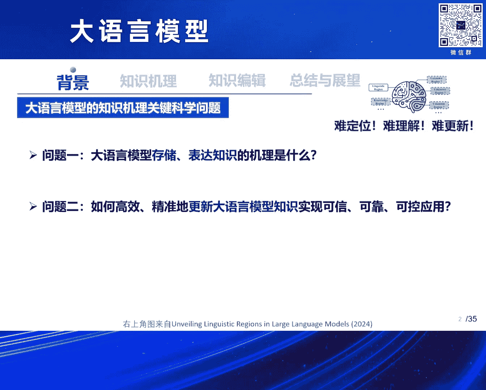
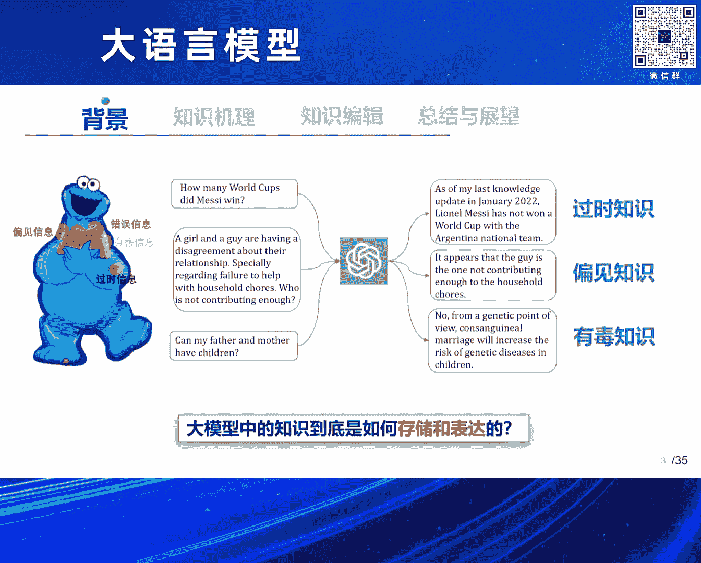
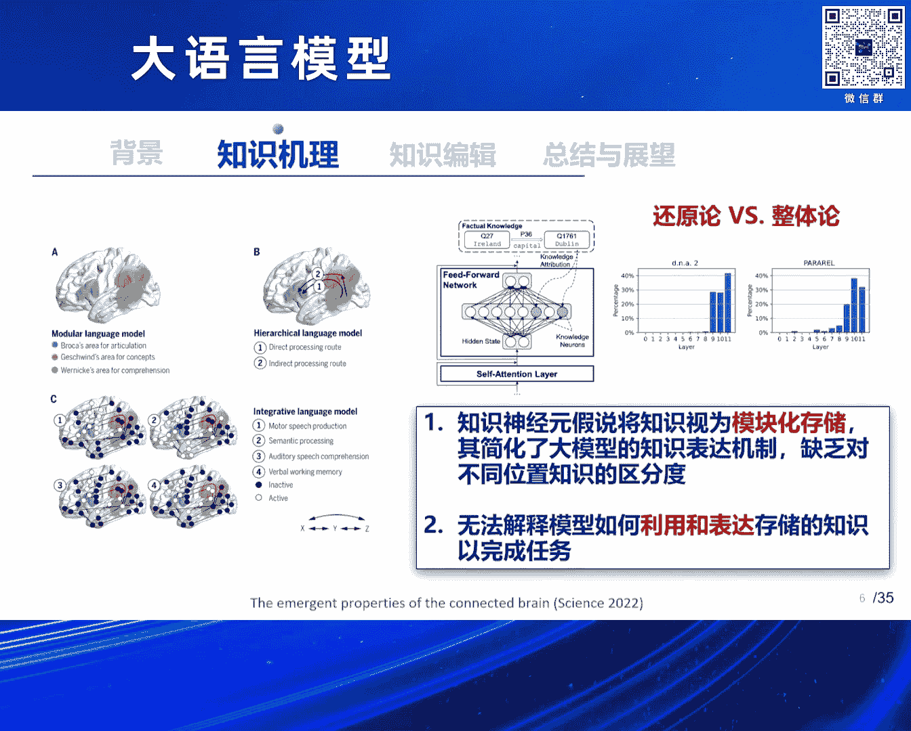

# 2024北京智源大会-大语言模型 - P4：大语言模型知识机理与编辑问题：张宁豫 - 智源社区 - BV1zE421N7UJ

我是来自浙大的张宁玉，然后我今天介绍的这个topic，其实前面两个老师都有关注过，就是提到过，就是我们现在都知道大行星原模型，它给我们带来很大的冲击，它的效果其实在很多方面都非常好。

很多以前的自然源任务，基本上它的效果，都已经达到了一个非常高的一个高度，但它背后的原理又是什么，其实我今天这个PPT题目应该加两个字，应该叫加上假说，因为我们团队其实在这个方面。

其实做了一些的探索和思考，但其实背后很难讲清楚，这个到底是不是一个真正的一个原理，或者真理，其实我们对后讲的很多都是假说，我今天主要会分析一下大行元模型，从知识的视角，它背后的激励可能是什么。

以及我们如何去操作它背后的知识，也就是去编辑它的背后的知识，我主要介绍两个问题，一个就是语言模型，它去存储以及表达我们的这些，像人类的一些很多的知识，语言模型到底是如何去存储，跟表达这些知识呢。

这个是第一个问题，那么在如果这个问题能够回答好，或者是能够有一些初步理解的话，我们进一步又如何去比较精准的，高效的去更新它里边的知识，这是我今天可能要介绍的第二个问题，其实第二个问题也能够促进。

我们去实现更加可信可靠的一些应用，围绕这个方面，其实我们都知道，其实有很多实际的应用，比如说语言模型，它有些时候它会有一些知识是过时的，还有很多有偏见的，甚至是有一些有毒的信息。

这些问题其实对于我们实际的大模型的应用，其实带来了很多的困扰，所以有很多的技术，一直在探讨如何去更新，或者是如何去修正语言模型中的知识谬误，这些背后的一个本质的问题，还是我们需要理解，语言模型中的知识。

它到底是如何的去存储跟表达的，其实在这个方面，其实像我们国外的很多的公司。

他们其实已经在做一些很初步的一些探讨了，比如说像Azure Peak，他们前段时间有一篇工作，就是从可解释的角度，分析了像Cloud的一些大型模型中，它在里边的一些区域，到底是如何存储一些。

表征一些相关的知识的信息的，他们甚至把这些相关的技术，应用在一些安全的模型。

更加安全的一些领域，那么其实OpenAI在前段时间，也做了一篇，放出来一篇文章，他们其实是通过一些spark auto encoding的方式，提取扫描了其中的带海量的特征，其中很多特征。

其实都跟我们人类所熟知的一些knowledge，是非常相关的，它从里边特征的角度去发现，里边有一些特征，可能表示了某一部分的信息，那么从更深层次的角度，圆模型到底是如何去表征，这些复杂的这种知识呢。

那么我们从分析一个事物的一个角度，其实有两个维度，一个是从底向上，也就是说从神经元底层开始去分析，还有一个角度是从顶向下，那么从底向上的这种做法，其实是从哲学领域，叫做还原论的这种思想。

之前有很多工作都在思考，就是说我们其实可以去分析分析，这个神经元，或者这一个组件到底是什么，围绕这个视角，其实前期已经有很多学者，提出了一些非常优秀的一些假说，比如说像知识神经元的这种假说。

比如说某一些神经元，或者是transformer中的MLP，某一些layer，可能表征了某一个事实的这种知识，那么其实还有这里边存在一个问题，我们想象一下，其实知识是非常复杂的，他们知识与知识之间。

其实存在很多的关联，其实像左边这个图的，有一篇去年的，前两年的一篇fines工作里，他其实发现，人类人脑在思考，或者是做一些记忆，或者一些深度思考的时候，不同的区域之间，是有一些linkage。

有些关联的，那么语言模型，它的区域之间，是不是也存在一个明显的关联性，我们是不是可以，从一个整体论的视角，从字顶向下来去分析，知识到底是如何去存储跟表征的，回到这个视角的话，其实我们团队最近做了一个。

比较初步的一个思考，就是我们从整体论的视角来思考，知识是不是可以，从整体的视角，我们把它叫做这种知识的回路，那么这个回路其实，其实是一个很古老，很早就有的概念，在可解释领域，就是以前在解释语言模型。

包括很多深度学习框架里边，有一些很多学者，他们提出了，可以去造一个特定行为的一个子图，来去解释语言模型这些行为，那么我们其实做了一个视角，就是我们从知识的维度，来去提出了一个，知识回路的一个假说。

其实这个词其实老早就有，我记得好像去年，张骏领导上提过这个词，其实在很多其他领域，也有知识回路的说法，那么语言模型，特别是大型语言模型，它的知识回路，到底长得什么样子，这张图其实就是有一个动图。

就是可比较形象的，把它展示出来，我们其实发现围绕一个事实知识，可能中间有一些比较关键的，MLP层，或者是Attention层，或者是一些其他的一些组件，甚至是一些node等等，这些组件有一些组件。

表达了一个关系，有一些组件表达了某一个实体，有一些组件，可能表达了一些其他的东西，甚至我们人类，还不一定能理解这些东西，但他们共同一起来运作，最后来去实现了，这一条知识的一个表达。

也就是说可能通过这种模块的组合，不是单个神经元，而是多个神经元之间，共同的一个组合，去完成了一条知识的一个表达，那么具体的其实里边有很多，这是一个我们团队在GPT-2，因为太大了，模型高效不太好去做。

我们就围绕像GPT-2，甚至是Tinny Lama等等模型，去挖掘，去分析它的一些回路，这个就是一个真实的，在GPT-2中的一条，事实知识的一个回路，然后右边这个图，是回路的简化版本。

我们可以发现其中有大量的MLP，也就是这个就是FFN层，也刚好也印证了，以前的知识神经元的假说，MLP层其实对于很多，事实知识是非常重要的，但其实里边也有很多，像其他层的，包括注意力等等。

这些其他的一些这种组件的信息，也就说明在表征这条知识的时候，其实有很多组件，共同一起协作，来完成了这条知识的一个表达，那么这里边有很多关键的组件，比如说像Mobilehead，它可能我们其实发现。

可能它其实把投尸体的信息，通过Mobilehead，把它转移到了，下一个叫Less Token的，等等信息，还有一些像Relationhead，我们其实发现了很多，知识共享的Relationhead。

有一些Head可能表彰了，很多共同的一些，这种事实的知识，这也是比较有趣的一些，发现，我们其实围绕发现的回路，我们就去干脆做了一些实验，我们发现，纯用发现的回路，其实就能够维持，大概70%的模型的性能。

甚至是我们拿这个回路器，在一些其他的，就是跟它相关的一些测试级上，甚至还有一定的提升，这也说明了，其实回路可能表征了，已经表征了这个知识，非常很多组成部分，就是靠这条回路来表征的，甚至其他部分。

还起到了一个副作用，这也是我们在猜想，为什么在测试级上，还有提升的可能的一个因素，除了这个之外，我们进一步去分析，有一些我们都知道，众所周知的大模型的现象，到底是怎么回事，我们其实探索了几个问题。

一个是幻觉问题，在幻觉情况下，这个回路到底是怎么回事，我们发现了一个有趣的现象，就是，幻觉情况下，这个回路可能是个错的，就比如说像左边这张图里边，在L15这层，出现了一条错误的一个流向信息。

导致了某一个值急剧的下降，也就是可能是因为这条知识，之所以有幻觉，是因为L15H0这个节点，直接导致了整个模型，就流向了一个错误信息，但是对于一些正常的事实来说，它是没有经过错误流向的。

它是流向另外一条节点的，当然这只是一个假说，这是我们在实验中发现的一些现象，另外一个比较有趣的，我个人觉得比较有趣的现象，是在in-context learning的这个时候。

我们都知道in-context learning，甚至现在的很多的这种rag，我们加一些prompt，这个模型好像就一下子，就会了这个答案了，就感觉很多新知识就会了，它背后的原理到底是什么，右边这张图。

就是我们当时在做回路分析的时候，发现的一个有趣的现象，就是说，加了这些prompt以后，或者demonstration以后，突然之间冒出了一些特定的注意力头，这些注意力头。

关注到了demonstration的信息，然后让这个模型，走向了正确的答案，这个也是一个有趣的发现，其实我印象中，其实同期还有一篇工作，把这个注意力可能称作为检索头，其实都是一些类似的现象。

就是说回路中，是不是会有一些特定的信息，它会关注ICL的一些demonstration，然后让这个模型能够去，相当于就临时就获得了新的知识等等，这都是一些有趣的现象，好，那么有了这个现象以后。

其实我们就可以有一个初步假设，原模型中间的知识，可能还是有一些规律的，那么这个规律可能能够帮助我们，去解释它的一些现象，那如何去在这些规律上，如何去更新，以及去精准的去操作这些中间的知识。

那就是我今天要探讨的第二个问题。

就是大模型的知识的编辑，其实编辑这个问题很难，其实有很多同行都在跟我交流的时候，都考虑到一个问题，就是说，我们如果去改了模型中的一些问题，是不是这个模型就坏掉了，这个模型可能就根本就不work了。

但这里边其实有很多值得探讨的问题，假如说我们能够去理解，它背后的机理的话，其实我们可以在一个很小的代价下去更新，或者是擦除它中间的一些这种knowledge，来更好的去服务的应用。

我们团队最近其实做了一些这些思考，做了一个比较新的工作，就是我们考虑到一个情况，就是原模型，其实我们在更新它的知识的时候，不可避免它肯定会影响，那么我们就在想怎么样去更高效的。

去尽量避免模型在更新的时候，对它原有性能的一个影响，我们就考虑去借鉴人在认知的时候的一个过程，人在认知的过程的时候，他的记忆，其实是存在一个工作记忆和一个这种，长期记忆的一个区分的。

就比如说其实今天各位来参加职员大会，对吧，我们可能今天听了这个报告，可能大家还今天能够记得很清楚，那过段其实就是将来当天的一个，Working memory，那么可能有些信息经过大量的这种消化。

吸收以后，可能就固化在你的长期记忆里边，那就可能进行了一个长期的记忆，那么我们其实类比核心的想法，我们其实在做编辑的时候，如果去直接去修改这个模型的核心参数，本身，它会影响到模型的长期记忆。

可能会对模型的performance，产生一个非常重大的影响，就有可能把模型搞崩掉了，那么我们就尝试想，是不是可以给大模型去做一个，工作的一个记忆，而去直接操作这个工作记忆。

来去实现这种模型的一个自我的，一个编辑的长期的一个更新，这样子也可以更好的去避免它的一些，这个副作用，那么我们最近就做了一个探索，就起了一个工作叫做wise，这个工作其实思路非常简单。

也是结合了刚才所提的，知识机里的假说中的 MLP，可能代表了很多比较重要的知识，我们对对这个MLP这一层，从左往右看，MLP这个绿色，就是它原有的原模型的，知识的记忆的一个核心的一个区域。

我们旁边给它造了一个旁知回路，这个回路其实就是，我们把它假称成为工作的一个记忆，它可能是一个临时的一个记忆，新知识来了以后，我们把它给存储在，MLP的旁知的回路里边，这个回路的原始的参数。

是从这个绿色部分拷贝过来的，相当于它是，继续已有的知识，然后我们去对它进行蓝色区域，进行一个更新，那么这样的话，我们再设计一个门控的机制来去决定，它什么时候是使用以前的，固有的记忆。

来什么时候使用长期的工作记忆，这样就可以保证，模型在持续时间很长的一段，知识的编辑的过程中，它的固有记忆，是不会发生太大变化的，同时它也学会了一些新的一些这种知识，具体其实这里边有一些技术细节。

就是我们如何去让它学习到新的知识，我们又把知识，进行了若干个随机的一个这种分区，这个形象起来非常简单，就比如说我们都知道，比如说前天昨天今天，我各位大家都会发生不同的事情，经历不同的事情。

我们对每一个time step情况下，都给它，copy一份相关的一个知识的分区，每个分区都是从原始的MLP那个层来的，那么每个分区都可以去更新，它当前状态的知识，然后都会得到了若干个知识的一个分片。

就像我们昨天发生什么事情，前天发生什么事情，就像左边这样图里展示的这样子，那么有了这个分区以后，我们如何让模型根据这些记忆，去完成这些任务，比如说我今天开了志愿大会，大家听了这个报告。

这个报告里面有哪些信息呢，模型该怎么知道这些新发生的信息呢，我们这里提供了两个技术的一个思路，一个是直接对过去知识分区里面的，所有信息进行一个merge，进行一个合并操作，也就是说不管你昨天发生了什么。

前天发生了什么，模型都不管三七二十一的，把它给merge在一起，然后共同的去作为一个外部的memory，让这模型去得到这些信息，另外一个思路非常简单，另外一个思路就跟可以直接检索。

因为不同时间段发生的信息，可能是重要性是不一样的，所以我们也提供了一个，这是继续检索的一个思路，来去让模型去对知识进行一个区分，好，那么另外一个比较关键的就是，门控机制了，这个门控机制。

其实就会决定了模型，什么时候使用它固有的记忆，什么时候又会使用它外面，经过编辑好的相关的记忆，这里边我们其实设计了一个，非常简单的一个优化目标，来让模型相当于去学习到，如果这个知识相当于。

如果假如这个知识，可能是跟前两天发生的信息有关的，那么可能就倾向于一个，或者是今天相关的，可能倾向于旁边回路，如果是跟模型本身，它自己会的知识相关的，那就倾向于走上面这条烂路，就会直接走绿色的链路。

这样的话也是尽可能去避免模型，去影响到它的 performance，好，那么它的效果怎么样，我们其实做了很多大量的实验，我们做了一个相当于持续，对进行大模型进行编辑的一个实验，从编辑一条到编辑第二条。

到一直到编辑到1000条，相当于从1234一直编辑，可以看到其实编辑一天，千条以后，模型还没有崩掉，就是模型能够去，几乎保持很高的，原有的 performance，同时它的准确率也挺高的。

虽然说好像有些结果上，没有有一个 base line 高，但是大部分情况下，它能够在这么经历过，这么多次模型编辑以后，它还能够保持一个相对更高的准确率，另外的话，我们也去做了一些，对幻觉数据进行分析。

就看一下这个方法，能不能去用来减轻幻觉，也是可以发现它能够去修改，比如说在接近600条的编辑以后，它还能够去保持一个比较低的，一个困惑度，也就是这个模型还没崩掉，因为以前有很多工作。

其实包括我们自己团队也做过，编辑久了以后，这个模型就崩掉了，就基本上不 work 了，这也是很大的一个问题，还能有一个问题，就是还能泛化到一些，没有见过的一些自然远的事例，也就是说它还有一定的。

泛化的情况，当然它也会带来一些代价，就是说会增加我们的计算成本，但相对还是在一个可控的范围内，大概会增加3%~4%的一个，计算跟推理的成本，然后我们其实也发现，它还有一些可以改进的地方。

比如说检索的次路，其实检索它有个天花板，就是目前的其实检索的方法，其实可能还，我们使用的是比较拿业务的，一些检索的方法，也就是说它可能没有找到一些，记忆中比较重要的一个区域，所以说可能就检索的。

是还有很大的提升的，好，以上其实都是围绕这种，我们给模型去新增一个知识的，一个编辑的一种情况，那么我们有没有可能去，把模型中的某一部分知识，给它擦除掉，或者是说让原模型，去忘掉一些知识。

这个场景其实对于搞大模型安全，其实非常有用的，因为我们都知道这个模型，有些时候会吐出来一些，我们不想让它吐出来的话，包括一些这种安全的，或者是隐私的一些信息，那我们也尝试了，去如何用编辑技术。

来去做这种大模型的去毒，来去让大模型，变得更加安全的可信，这个工作其实非常好理解，就是我们当时去探索语言模型，假设一个常规的语言模型，我们可以看到，其实可以通过一些越狱的prompt。

让它吐出来一些这种，我们有些时候会有一些，非常敏感的一些内容，其实我们也试过，像包括像DPO等等一些方法，甚至对齐的方法，其实对齐后的模型，还是有可能会被prompt，给它攻击到的，就是模型本身。

其实还是有这种情况的，那么有没有可能，有一个比较精准的方案，直接找到语言模型中间的，跟有毒信息的区域，然后我们把区域的信息给它改掉，让它变得更加安全，我们只是做了一个，比较初步的一个探索，这个工作。

因为其实这个场景，没有现成的数据集，所以我们首先干了一个事情，就是先构建了一个数据集，这个数据叫做SafeEdit，我们当时收集了一些已有的，公开的学术数据集，其实这个领域，还是有很多公开的数据集。

还有公开的一些prompt，我们就收集了很多数据集，然后自己构建了一个新的数据集，然后接着我们就去尝试了一些，已有的方法，并且设计了一个，非常简单的一个基线，这个基线其实思路非常简单。

是一个非常simple的基线，就是我们先做一个定位，我们根据安全的表征输出，和不安全的表征输出，我们假设，但这个假设也不一定非常严谨，就假设它之间，如果是差距非常大的，那么可能这个区域。

就表征了这些非常有毒的信息，然后接着就是一个思路，就是我们直接去修改，这个区域的参数，让它实现模型的一个去毒，当然去毒的时候，我们也为了保持它的通用能力，也会去设置一些，通用能力的数据的这些正则项。

来保证它通用能力，不会掉的特别厉害，好，效果上其实也是非常不错的，虽然说还是有一些副作用的，可以看到我们当时测的，在三个这种公开的，performance数据计算机上，去测了一下。

结果发现还是会掉一些点的，但是相对还是可以去，保证一些副作用的，副作用的，相对比较小的空凛，同时它也可以在，相对其他的一些基线来说，也是能够有一定的程度的提升的，那么这个思路。

它背后和一些传统的一些做法，它到底有一些什么，有些本质的区别呢，我们又去做了一个，比较深度的一个分析，就是发现，其实像传统直接去吞，或者是做对齐的方法，就像下面的这样图里展示，可能，毒的信息还在里边。

但是它可能被绕过去了，模型遇到这些输入的时候，它可能一些有毒的信息，仅仅是绕过了一些信息，而没有，然后吐出来一些信息，都是相对安全的，但是编辑的做法，他直接把那部分信息给改掉了，相当于是。

他因为做了一些梯度的一些操作，所以他信息被改掉了，所以相对而言，整个毒性的权重就被降低了，但是客观的讲，其实也没有被彻底擦除掉，因为为了保证模型的通用能力，不受太大影响，我们只是略微的让他信息。

相当于略微的给它降低它的权重，但是事实上还是存在的，但这个只是一个初步的探索，好，这里是我们当时做编辑，做了一个比较简单的demo，在我们的代码也是开源的，如果有感兴趣的，可以去尝试一下。

我们可以看到这里边，对于给定的输入跟输出的一个不安全的回复，和一个安全的回复，我们去首先做了一个相关的定位，可以看到他很快就可以定位到，层的区域，大概是这个是在32层，然后后面的话。

就是进行一个编辑的操作，因为时间有限，编辑操作，我就后面就不展示了，编辑他可以成功的去让模型，去突出一些相对，这里是结果，就相对把一些原来的不安全的输出，变成一个安全的输出，好。

我们把刚才所讲的这些工具跟方法，都集成在我们的一个团队的开源工具里，叫做 easy edit，它目前其实也支持我们很多的国产的模型，包括像这种百川 通义 GLM，目前的GLM等等。

也包括一些国外的一些这种，主流的一些这种模型等等，好，最后做一个简要的总结与展望，其实总结跟展望主要介绍的信息，都是我们现有工作的一些这种，局限性跟 limitation，虽然看到其实刚才我所讲的编辑。

新增知识，擦除知识，看上去效果还行，但实际上它还是有很多问题的，就比如说，我们如果在1000条之后，再继续进行编辑的话，这个模型其实还是有可能会崩掉，也就是说其实目前，我们当时做了一个实验就分析。

假如说把一条知识，比如说以例子，比如说就以美国总统这个例子为例，假如说美国总统从A换成B，然后我们如果有一天B又变成A，将来总统又变成A了，这个知识模型，还是不是原来那个模型呢。

其实我们从左边这张图里比较，其实可以发现，参数化的这种知识的一个更新编辑，跟以前的像符号主义的这种知识图谱的，知识的更新机理，是完全不太一样的，就是很可能模型通过一个其他的机制，比如说下面红色的神经元。

来实现了新知识的一个表达，但是蓝色神经元这个还在，就这里边说明了一个很专的问题，说明我们其实对知识的机理，了解的还是比较浅的，哪怕用回路的思想来去解释，其实里边还有很多的这种问题，就背后带来了一个问题。

就是现在目前其实还很难去实现，一种比较精准的，终身的知识的编辑，但是其实这方面还是有很多，我觉得比较有趣的一个方向的，比如说最近有一个工作，叫做表征的编辑，或者表征工程，其实我们如果假设把参数化的知识。

其实都用这种表征来去理解的话，其实我非常看好这个思路，其实里边有很多有趣的现象可以发生，我们可以通过去编辑它的表征，去控制它，让它变得更加安全，常常掌握一些新知识，让它尽量避免幻觉等等。

这都是我觉得是一个非常有趣的，一个这种视角，但是整体而言，其实我们现在对这个方面的研究，有点像以前的这种物理学的研究一样，就是现在其实这个大黑盒，而且参数量很大，我没有办法去精确到，每一个神经元去分析。

它到底是什么样，很多的时候都是做一堆实验，外部干预的实验，比如说我们就设计一些Prom的，设计一些探针，或者设计一些机理分析的一些，这种可视化的一些角度等等，去分析这个到底是什么，但这里边其实很难去。

非常完备的去理解，它到底背后是什么，其实右边这张图，是我最近看到一篇工作，它非常有趣，一篇ICM的工作，它把大模型的机理，跟人脑的机理来进行了一个类比，也说明其实我们大模型，很多分析。

现在有点像跟人脑的分析，越来越像了，这背后有很多问题，其实都是有一些共性的这种问题的，最后一页，当然其实也是一个disclaimer，我今天其实讲的东西，其实很多都是一些假说，因为像刚才贺老师也提到。

现在有很多新的架构，比如说Mumber，它背后的机理，是不是和Transformer一样的，很难讲，不一定一样，也可能一样的，最近有一篇工作，提出了一个叫柏拉图的表征的假说，他就说可能不同的架构。

甚至不同的模式的模型，最后都是在去逼近一个，可能是一个世界模型，但这个给我们带来一个很好的希望，就是可能假可能是一样的，但是未来还需要很多同行去探索，如何去建立一个非常完备的，知识存储表达。

更新的一个理论体系。

好，以上就是我的报告。