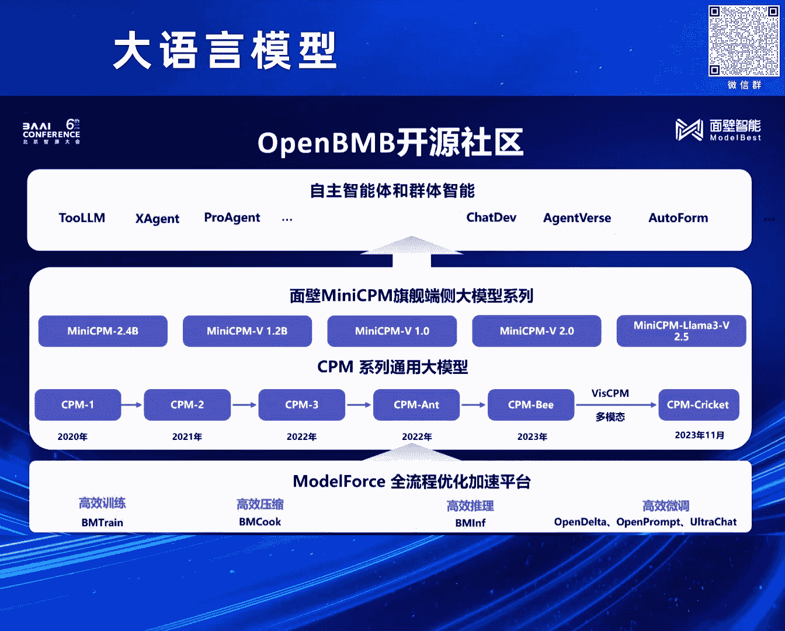

# 2024北京智源大会-大语言模型 - P5：小钢炮MiniCPM是如何炼成的？-曾国洋 - 智源社区 - BV1zE421N7UJ

大家好我是曾国扬。

然后非常高兴，今天能跟大家一起分享一下，我们在训练mini cpm系列模型中的一些技术发现，以及最后的一些经验，然后正好也开个场。

就是前前几天呢，其实发生了一个还比较大的事情，就是苹果在2024年的开会者大会上，就推出了apple intelligence，然后也是标志着，成呃，苹果也是正式的开始去啊，做自己的端测的ai。

啊其实在苹果之前的话，有不少的国内外厂家就已经开始布局啊，端测的模型了，然后在这个方面的话，其实我们也是做的比较早，所以今天也正好能有机会跟大家分享一下，我们在探索端测模型中的一些发现。

其实从我们的一些之前的结果来看，端测模型的出现，基本上是大模型发展历史中一个比较必然的事情，我们呃，图上面两张图，左边那张图的数据来源是papers code上，呃mmu数据级的相关的水平。

啊然后我们以gb3 175b，就是最早20年那个版本，的那个指标作为一个参考的话，啊我们把那个图中红色的点其实就是，呃水平大于等于gb3 175b的模型，然后浅色点就是小于的模型，然后画了这样一张图。

我们可以发现随着时间的推移，然后呃达到最原始的gb3 175b的，知识水平的模型尺寸在逐渐的减小，并且非常巧妙的是他，满足了一个规律，就是我们发现他差不多每8个月时间，模型的知识密度其实会提升一倍。

也能看出来，呃随着模型训练技术的发展，模型能够将越来越多的知识，给保存在越来越小的参数量上，如果我们把这个理解为，模型的一个制程的话，其实也可以，呃看出来就是，像计算机领域最开始出现的计算机。

像aniac其实好几个房间那么大，但是随着制程的发展，到现在我们可以把，呃这样一个计算机给拿在手上，像手机一样去使用它，啊这也是我们推测大模型，呃在这个发展历程上，端测模型未来一定也会这样出现。

然后同时除了在文本领域，我发现在多模态领域的话，其实也存在这样一个大的趋势，啊然后他和那个文本领域也会比较像。

然后这就不多讲了，在今年早些时候，然后我们其实发布了mini cpm系列的模型。

包括最早的mini cpm，呃1。0就是它的2B版本和1。2B版本，以及mini cpm-v，还有mini cpm-v的2。5版本，啊然后今天主要就是介绍一下，这些版本中模型所使用的一些技术。

以及它取得实际效果，啊今年最早的时候，其实我们发布了mini cpm-2B，啊其实发布这个模型，最开始我们没有想过，要训练一个2B的模型，只是因为我们在实验过程中，然后这个2B模型。

是我们产出了一个中间版本，然后这个中间版本呢，它达到什么效果，相比就是它之前的，比较知名的模型，像Mistro，啊甚至在它后边发布的，Google的Germa，啊它都能够取得和，就是和它们相当的水平。

同时，在这样一个小的规模的参数链上，啊这样的模型，它能达到这样的效果，在之前看来也是非常不容易的，在这里边的话，其实我们主要做了非常多方面，在训练方法上的一个探索，比如，呃在模型训练的时候。

其实大家都会涉及到，调整非常多的超参数，当我们训练更大规模模型的时候，要调整超参数，它的成本也会更高，而且呃，就是对于不同规模的模型来说，其实它的自由超参数也是不一样的，在一个之前的工作中。

其实有相关的研究，应该叫，就是说在我们这里边，其实使用了Mup这样一个框架，啊之前的工作应该叫什么Tensor Program，所以忘了具体是啥名字了，啊然后在这个框架中之后，他提出了方法。

能够对参数进行一些规划，然后能够，通过规划之后，然后就能够确保在不同规模上，模型能够共享一套最优的超参数，然后在我们的实验中，我们也对它进行验证，其实除了那个，呃这个图是一个Learning Rate。

其实除了Learning Rate之外的话，我们对其他的一些指标，也做了一些测试，啊包括像啊模型的什么深度，还有模型的宽度之类的，还有一些其他的超参，啊然后最终发现其实在，对模型最终效果影响比较明显的。

其实就是这个Learning Rate，选择一个合适的Learning Rate，不仅能让模型训练的更快，同时当Learning Rate选择的不好的时候，它最终收敛到的位置也不会那么好。

然后我们在复现了MUF的工作之后，我们发现一个非常巧妙的值，就是Learning Rate使用0。01是非常的好，啊所以这是我们在mini-CPU训练中，选择0。

01作为Learning Rate的一个。

呃实际的原因，然后在确定了完Learning Rate之后呢，然后大家也会遇到，就是在实际训练过程中，我们都会有Learning Rate Scheduler，啊这个Scheduler的话。

其实也是一个非常重要的一个指标，啊从最开始训练BERT，大家用的是那个Norm的那个方法，然后再到后来大家普遍会使用，Cosine的一个啊调度器，啊但是我们对Cosine的调度器，做了更深入的研究。

其实在Cosine调度器设置的时候，它最重要的是要设置一个最终截止的部署，啊然后我们对不同的截止部署的，Cosine调度器都做了实验，上边那个n是指那个模型的参数量。

20n是指训练20倍模型参数量的数据量，啊或者叫Token量啊，然后通过设置不同的截止部署，我们可以发现其实当一个Cosine Learn Rate，它取得在它曲线中啊，效果最好loss最低的位置。

往往是它到达波谷的那个位置，也是它的那个最终的那个，应该叫最终的Lr最小的那个位置，同时的话我们发现就是，当我们能够给那个Cosine的Learn Rate，给它就是当它能让它重复足够多次的时候。

我们发现它其实在越往后的话。

它其实最终也会达到一个差不多的水平，所以基于这个话我们就进行了一些进一步的探索，我们把这个Learn Rate上，Learn Rate Scheduler做了很多的不一样的实验。

然后后来我们就试出了一个叫WSD的一个Scheduler，然后它非常简单，就相比于传统的那个Cosine各种曲线来说，它就很粗暴，它就包含三个阶段，第一个阶段Warm Up，第二个阶段Stable。

第三个阶段Decay，Warm Up的话其实是现在所有Scheduler，都会自带的，就是前期从最开始Lr是0，然后通过训练持续增加到我们最终的初始Lr，然后同时和Cosine不一样的是。

就是Cosine的Scheduler，它会在那个训练过程中持续的下降，而对于我们WSD来说，它会在中间保持相当长一段时间的，Stable的一个学习率，我们发现通过一个更大的学习率。

其实模型能够实现更快的学习，而为什么最后又会有一个Decay的阶段呢，是因为我们发现，当我们一直保持比较大的Lr的时候，模型确实会学得比较快，但是它最终到达的Loss的水平，其实并没有那么高。

但是当我们去降低Lr这个过程中，然后它Loss会出现一个快速的下降，在这个过程中我们就是实验，得到了右边那张图，我们可以发现，通过WSD的优化器，然后它在Stable阶段。

虽然它的Loss会比Cosine更高，但是就是随着我们在不同阶段，使用Decay的方法的话，然后它就可以在Decay阶段，实现Loss快速下降，甚至在后期就是可以，在那个Decay阶段完成之后。

它得到的模型的Loss，是会比使用Cosine的学习率，在对应时间得到Loss会更低，同时的话，WSD的优化器也有个好处是啥呢，就是当我们训练模型的时候，可能通常要，就是其实训练的过程中。

可能数据会发生各种各样的变化，甚至我一个模型训练完了之后，还想再训练一段时间，这都是很常见的问题，所以对Cosine的Scheduler，它需要在训练之前，预先设置好一个它的截止时间。

但是对WSD它是不需要的，当你随时要用的时候，你随时把它拿出来，然后训练一下它的Decay阶段，就能得到一个非常好的模型，这个对于大模型的持续训练来说，也是非常有用的，然后右边是一个。

我们实际训练时候的Loss的情况，可以看出比较明显的变化，就是它从大概两万五千到三万，中间那个步数的时候，我们开始进入Decay阶段，然后它的那个LR在那个阶段，会发生快速的下降。

对应的带来也是Loss，会发生快速的下降，然后其实还有些比较有意思的结论，其实在之前包括OPI的研究中，Batch Size的选择，会和你最终的Loss，收敛到的位置会相关，但是在这里边理论上。

它应该在Decay阶段，选择更大的Batch Size，但是我们做了些实验，发现好像并没有什么效果。

反正也感觉挺奇怪的，然后针对这样的模型的话，我们也对它实际进行了一些评测，在之前的话在模型训练阶段，其实有个叫，Tranquility Optimum的一个说法，就是说当我们训练多少Token的时候。

能达到一个最有效的，就是在这个训练，在这样一个运算量下，会最有最高效的一个模型的Size，和它要训练的数据量，然后我们使用了相同的数据配方，然后去训练了Tranquility。

根据Tranquility Optimum去训练一系列模型，可以发现使用我们这样的方法，训练出了模型最终能够超越，大概是我们MiniCPU 2B的一个模型，它最终Loss是2。4，大概的水平其实等于。

Tranquility Optimum 9B规模的模型，这也是为什么MiniCPU，可以在一个更小的规模上，去战胜更大规模模型的原因，然后这个是一个最终的效果，然后我们将MiniCPU这个2B模型。

最终也是能跑在手机和各种的。

就是PC上，然后同时能够有一个比较高的一个速度，然后这个的话也是，而且这个速度其实当时我们最开始，适配的时候也还没有做任何的优化，就单纯利用手机的CPU，其实就能跑到一个比较快的效果。

然后因为时间原因我就不放太多。

对，然后有了MiniCPU之后，我们又在MiniCPU上面加入了多模态能力，就是我们的MiniCPU-V的2。0版本，相比于其他多模态模型，我们发现在我们的实验过程中。

我们发现对一个支持图文多模态输的模型来说，文本的基座模型的水平，其实会比较大影响它在多模态最终的一个效果，所以在这里边的话，我们也是将MiniCPU这样一个比较强力的模型，应用到了多模态场景下面。

然后可以发现通过一个更强的文文基座，我们能够超越数倍于我们规模的一个模型，然后这个其实是一个比较旧的图了，就是当时发布的时候一个图，然后可以看出来，就是MiniCPU能够全方位的超越。

甚至一些比自己大好几倍的模型，这其实也是在我们实验中发现。

是依赖于文本模型的一个强大的能力，然后在MiniCPU-V2。0中，我们能够做到对，高清图片的各种的理解，同时还能够把图像中那些比较小的字都给识别出来，同时的话也能够识别。

也能够做非常长的图片的理解，这个在文本领域其实有个常见的任务叫做长文本，就是我们给它一篇很长的文章问一些问题，我们有意思的是我们发现，其实把这些文字转换成图片，然后通过图片这种多模态的形式输入进去。

模型也能够做一些，也能够做一些这种长文本的一些问答的问题。

在这里边的话其实我们主要用到的技术就是，一个就是Lava UHD论文里提到，就是我们的多分辨率高清解码的一个技术，在这里边的话其实我们在这个工作中，我们也是对多模态领域最常见的一个问题。

就是对于不同数据尺寸的图片，它很难用统一的形式去编码，然后做出了一些相应的探索和研究，在图文多模态领域的话，其实比较知名的模型，像GP4V这样一个模型的话，然后我们也对它做了比较细致的实验。

左边是一个我们的实验，我们发现在GP4V它可能用了某种，将更高清的图片切块的一个方法，同时它在块和块之间会有一些重叠，然后来做的一个图像编码，然后这样的一个方案的话，我们也发现就是它会经常在。

就是做一些数数的任务中，然后它会数错个数，左边是一个比较明显的失利，就是我们构造了一个9个小球的图片，然后我们发现以不同的尺寸，将它放入到模型里边，然后GP4V它会数出不一样的数量。

当几个小球它的大小是比较合适的时候，模型能够正确的数出是9个球，但是随着它的规模放大，可以看出来它会逐渐从9变成12，再变成16，为什么变成16呢，其实我们会猜测它在这里边，它在实际处理过程中。

它会包含一些就是，就是把大的图像切片成小的图像，然后在小的切片中会有重合的部分，所以导致有些小球它会被重复的计数了，然后除了GP4以外，我们也探寻了就是LAVA1。5。

它对于不同分辨率图像的一个编码方案，然后发现它这样基于一个padding方案，其实在一些比较极限的场合比下的话，也会存在一些问题，所以在这个工作中的话，我们是综合的提出了，就是说我们要做一个。

动态分辨率的一个编码方法，具体的方法其实也比较简单，对于一个图像来说的话，它其实会存在多种切分方法，比如一个非常高清的图片，我们可以直接竖着切，也可以直接横着切，也可以切2×3，也可以切3×2。

它有很多种切法，但是在这里的话，我们经过实验发现，要达到最好的效果，其实是需要尽量去保证和原始训练的时候，每一个原始训练时候，那个VRT encoder，它的一个训练的一个场合比，最合适的一个情况下。

然后它能达到最好的效果，所以在这点的话，我们其实采用那种比较精妙的方法，就是我们去通过给那个，通过计算就是图像的，一个高清图像的一个像素数量，是我们训练时候像素数量的多少倍，能确定大概要分到块数。

就是那个n，然后根据n的话，我们能美理出所有可能的切块方法，然后在所有可能的切块方法里边，再去找到一个长宽比和训练时候最接近的一个方案，然后作为我们的切块方案，基于这样的一个算法的话。

我们最终能实现一个，就是能实现多种不同分辨率下，就是图像那个高清图像的一个识别，同时包括传统比较难处理的长图，也是能比较好的解决，然后在这个的基础上，然后后来因为LAMA3推出了之后。

然后我们又继续LAMA3，然后将一样的技术移植了上去，然后发现确实，基于一个更大更强的模型的话，在多模态的能力也会得到一个比较明显的提升，在这个模型中的话，我们在多种任务上。

其实最终综合能力是达到了GPC4V的一个水平，同时在OCR能力上都会有一个比较强的体现，然后这个是一个例子，我们发现就是在这样一个模型中的话，它能够比较好的去识别，就是包括中英文的一个识别。

然后包含也能比较好的去识别，像图像中的票据的信息，同时也能做信息的抽取，比如让它按照Jason格式做输出，对，然后像传统GPC4V有一些，让大家觉得是比较难实现的能力，我发现当模型的。

特别是基础模型能力起来之后的话，它都能够得到比较好的解决，比如像一个辅拉流程图的理解，这个其实是对于之前很多多模态模型来说，是非常困难的，但是随着模型能力的增强的话，这些也是可以解决的。

还有就是一些表格信息的提取，对，然后除了这个之外的话，我们还发现，在当多模态模型具有OCR能力之后的话，它能够有效的将文本空间和图像空间，给更好的联系到一起，然后就能够利用语言模型的多种能力。

然后能实现各种不一样的效果，比如在这里边的话，我们因为拥有OCR能力，然后我们还能就是我们就能和语言的跨，语言模型的跨语言的多语言能力，给融合到一起，导致我们能够通过这样的方法去实现。

对于各种不一样的主流语言的一个多模态支持。

最后这个发布的话，其实也在社区上受到了比较广泛的好评，包括在hacking face上的话，也是受到非常多的关注，然后包括前段时间其实也出现，被套壳的问题，然后同时的话，除了mini c屏系列。

我们在开源社区的话，也是有很多其他相关的工作，包括大家可能了解的比较多的，就是开源模型那些，还有底层的训练框架，还有高更往上一层的，就是agent相关的框架，然后我们都是有涉及到。

然后也非常希望大家能够持续关注我们，那些更新的工作，然后最后就是端测模型，下一步我们会做什么，对我们目前来说，我们还会继续去沿着我们最开始提出的，那个大模型的摩尔定律继续走下去。

同时的话我们也是想要让一个，GPU 3。5水平的模型，能够真正的运行在端测，能够运行在手机上，同时我们也会为我们的模型，去添加更多的模态，我们可以我们能够感受到，端测的AI是大势所趋。

并且端测的AI能力，也会随着硬件的发展和普及，变得越来越强，对然后以上就是我今天说的内容。

