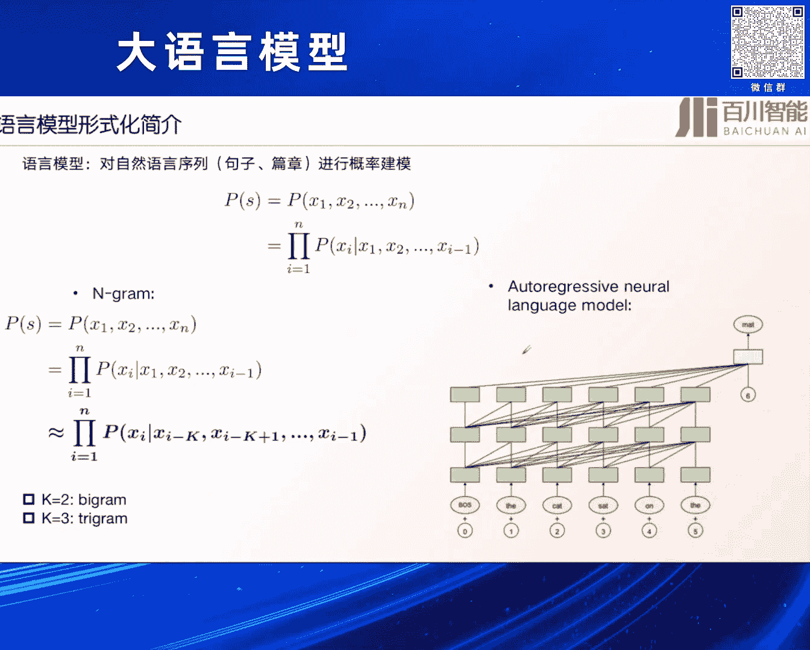

# 2024北京智源大会-大语言模型 - P6：大语言模型预训练的效率优化-王炳宁 - 智源社区 - BV1zE421N7UJ

是來自百神智能的王筆，然後今天給大家分享一下，我們在那個大語言語言大語言域訓練的一個模型上的一個效率優化上的一些，一些探索可能今天主要聊的是一些已經有的一些工作，包括我們的一些思考。

而且今天可能我這邊主要給大家講的都是一些可能跟本質是域訓練相關的，這些東西可能像類似於下游的一些對齊，Agent的這個可能不會涉及到，對首先是先介紹一下Background吧。

因為我們剛才其實前面幾位講者也都介紹到，其實現在我們的大模型已經進入到大模型時代了，然後它的一個比較顯著的特徵就是它大，然後大模型的提升能力的一個非常關鍵的方法，其實就是Scaling law。

就是不斷擴展它的一個模型的大小，不斷擴展它其中訓練的數據的大小，對但實際我們發現其實在真正訓練中，其實本身我們除了說無腦就是無限制的去擴展我們的參數大小和數據的這個之外。

其實我們還有一個非常需要去做的事，就是我們怎麼在單位時間內提升對我們的數據，比如我們的模型更好的一個壓縮，就實現更好單位時間內更高的一個智能，這可能是我們現在很多在做大圓模型。

不管是預訓練還是反停頓階段，這種都在做的這樣一個事情，對所以其實我們今天就主要給大家介紹一下這些一系列的一個方法，但可能有些局限，因為可能我們就講了只是一些預訓練的一個方案。

而且是主要關注當前的一些短暫的可能的一些結論，可能對長期long term這些結論是不是有效，可能還是會有些疑問的，對所以其實可能從幾個方面來去做這個來去進行一個分享，對首先是為什麼要做這樣的一個優化。

其實語言模型我這裡就簡單介紹一下，它其實說白了就是語言模型就是language model，就是對這個language進行建模這樣的一個方法。

對它其實核心就是你根據一個把一個句子的一個概率進行一個統計建模，然後由前面的一些句子得到下面一個單詞的這樣的一個概率，就是next token prediction。

這是一個非常經典的這樣的一個預測的一個方案，但其實我們知道現在有傳統的其實語言模型不是一個新的事情，它傳統的方法有類似這種ngram，就靠之前前面幾個單詞然後來預測下一個單詞。

對然後當然現在其實我們知道大模型來的時候之後，基本上現在都會落腳到這種所謂的autoregressive這種modeling，也就是說我們如何根據前面若干個單詞，直接去預測後面這個單詞這樣的一套方式。

也依靠神經網絡，其實是網絡有點問題，那我就稍微講的把一些重點講的慢一些，然後可能這個現在能聽清楚了吧趙老師，好的好的那我繼續，然後可能現在的一個語言模型發展的一個比較重要的特征就是。

它越來越大就是不管語言模型訓練的數據還是說本身的參數規模，scaling其實就是我們現在基本上取得所謂的現在，AGI通往AGI之路上可能是最重要的一個突破的一個關鍵因素。

然後右邊其實是左邊是一個那個英偉達他們那個黃仁軍，他在那個GDC2024上面keynote可以看到，最近幾年其實對AI發展其實最重要的一個一個變化，就是我們的一個模型的參數量還有它訓練的。

總共的一個flow是非常非常誇張的在提升的，從之前很少的一個transformer GPT-1，到現在可能GPT-4它可能是一個萬億的這樣的一個MOE了，然後對於我們整個發展歷程來看。

我們可以看到我們之前在很早一段時間在做這種各種各樣的語言，醫療這種各種各樣的feature engineering的模型，到後面可能是2010年之後隨著深度學習的發展。

我們都在研究怎麼把這些不同的任務用一個模型給做起來，都是在研究一些模型，但其實現在特別是2020年之後我們發現scaling loss，是一個非常重要的因素。

現在大家都在做所謂的就是我們怎麼把這個模型做大，然後把所有的這些東西進行一個統一，對 所以其實這是一個我們認為是現在大圓模型發展的最重要的一個原理，就是scaling loss。

其實scaling loss如果是我們把它形式化的表達一下的話，它可能就是一個非常簡單的就是對loss的一個進行的一個預測，其實我們剛才講了語言模型其實就是對一個句子的概率進行建模。

然後我們一個loss可以分為irreducible loss，還有一個reducible loss，就是說我一個本身一個模型對我們整個的數據進行一個建模。

其實達到了就是我要讓在這些數據上得到我最小的一個預測的一個損失，然後當然了我不管是模型有多大還是我的數據有多少，我最後可能是有一個下界的，就是這個ir的這樣的一個無窮大的這樣的一個。

它其實就是說我有一個下界，就是我無論怎麼去優化我的模型和數據，它其實會有一個下界的一個損失，但除了這個下界之外的reducible loss，就是我最後需要去做的這樣的，不管是我通過我大量的把參數擴大。

還是把我的數據量訓練的時間更長，都可以讓這個loss變得更低，所以其實這就是scaling loss一個基本的一個簡單的表示吧，當然其實對於scaling loss，其實現在有很多不同的一種表達的方法。

比如說有左邊的最開始就是openai他們發的一個，所謂的這種基本上跟三個指標跟數據量，跟我的訓練資源跟我的參數量相關的幾個指標，而且他們通過訓練不同的模型可以把這個scaling loss給擬合出來。

當然還有一個比較經典的就是陳切拉他們的一個scaling loss，他是把它當作也是一個所謂的power loss，就是一個指數函數的一個擬合方式，e其實就是剛才上面的iris reducible。

就是不可去降低的，然後ab nd其實都是一些超參數，我們可以進行去alpha beta都是可以去進行優化的，n和d就是我們的模型的參數量和我們的數據量，對大概就是這樣的一個情況。

所以其實我們今天其實在優化的很多很多的動作，都是在不管是我們模型結構的優化還是什麼樣的優化，其實都在去優化這樣的一個scaling loss，如何讓我們的loss變得更低。

所以其實你看現在我們很多情況下不同的模型設計，不同的訓練方案，剛才其實那個曾老師其實也在介紹了，就是mini-ccm他們在做了很多的優化，其實都是為了讓我們這個scaling loss去更好。

就是你去優化我們這個scaling loss，讓我們的這些參數去發生一些變化，然後當然在提到我們的scaling loss，是我們今天要做報告就是最根本的一個原理，或者其實就是大模型的一個最基本的原理。

但是我們要首先要假設scaling loss是存在的，但對它的估計可能是非常脆弱和可能粗略的，其實最近有一篇文章就我們大家都知道，scaling loss可能本身這個公式是對。

但對它的擬合比如說我今天要把這個，α β a和b擬合出來其實是一個非常困難的事情，然後這篇工作大家回頭可以去看一下，其實他們就發現其實擬合不管是現在成績大了，還是實際上基本上大部分的工作。

對這個數據的擬合就這個超參數的擬合，其實是很弱的，你需要可能非常非常多的這種參數樣本，才能把這個給這個scaling loss給擬合出來，所以這個是scaling loss可能是它本身是正確。

但是要把它真正的擬合出來可能是有一些困難和難點，對 但是如果我們擬合錯了，就會發現其實會對我們的結果和預估會造成很大的影響，我舉一個簡單的例子，對這個scaling loss本身來說。

就是我們剛才講的這個成績大，就是這個是不可去減少了這個loss，然後後面有兩項一個是參數，這個d是數據量，然後這就估計a和b α β，然後我們其實對這個模型結構優化，其實可能就會把這個α進行優化。

因為n就是參數對吧，或者跟模型相關的，然後我們假設能把這個從0。34優化到0。35，就這個越大了，我們肯定是讓這個loss可能變得更小，但其實你知道我們可以看到，如果你對這個估計差一點。

其實對整個loss來說，它是一個非常非常大的一個差別，所以說其實這個想講的就是scaling loss本身一定是正確的，但對它的估計可能就是差值一點，一點到人命一千里，對 可能是一個非常一個一個多的。

所以其實我們今天現在很多的，不管是我們的做法，其實還是說我們的很多的一個所謂的經驗，其實就是在不斷地增大模型的尺寸，提升我們的這個n，就可以讓我們的模型變得更好，還有就是說像我們知道。

拉瑪塞用了更多的15T的數據去訓練，他就是用更多的這個data，去來降低這個loss，但其實還有另外一個方面，除了這種比較原始吧，或者我們認為是可能是比較暴力的方法。

其實我們還有就是我們上標出來的紅色的部分，我們可以設計更好的模型結構，比如像分次器啊，或者是類似各種各樣的這種，tension啊優化接口去提升這個α，或者降低a，然後可能是我們可以用更好的數據。

比如提升數據的質量配比，然後提升去β，或者說降低這個b，但也可以最後就跟剛才那個wsd那種方法一樣，就是我們用更好的訓練技巧，然後同時去優化我的這個參數和這個d，所以他其實是一個去在這個固定的這個參數。

或者在我們固定的這個loss下，去優化這幾個結構的這樣的一個過程，對所以其實今天講的主要就是這幾塊，就是從數據然後模型結構的設計，還有訓練方法的優化，去來去對這幾個進行一個統一的一個優化的一個過程。

對首先是一個效率的優化，其實剛才第一個賀迪老師其實也講了，現在有很多這種效率優化的方法，包括linear tension包括很多的，他其實核心就是想解決本身transformer裡面。

最核心的這個框架tension，它裡面的一個問題，比如說像最左邊就是我們標準的，這樣的一個tension它的一個結構，可以看到它是一個全連接的，就是說你有更長的話，它就是下三角的一個矩陣。

所以它其實計算的一個複雜度是n方的，但所以說這個n方當你的長度很長的時候，就會有很大的問題，所以後面有很多的工作都是對它進行一個降低，比如說把這個n方的複雜度降低到更小的。

比如說一個常數像這樣的一個工作，比如像sparse transformer，這樣我們知道最近有很多的工作，包括Fy3他也用了，包括剛才介紹到的block sparse這種方法。

但核心其實相當於我們如何在這方面，把這個n方的這樣的一個效率進行一個提升，對 當然最近還有一些很多的這種去提升，不管是它的目標是常文本，還是說它就是提升這個本身transformer建模能力的。

它其實就是去來提升這個優化這個tension，它這個結構，比如說像Dense就是像StreamingRM裡面提升的，提出了這個tension sync，因為他也發現現在的模型好像對第一列的這種。

tension關注的非常多，也就是說不管你後面是什麼樣的詞，它其實對第一個單詞或頭部幾個單詞，關注的非常多，所以由這發展出來一個，對這對tension進行一個改造。

提出了一個非常不錯的一個效果叫StreamingRM，然後最後效果還是挺好的，當然除了這個我們講了tension這個優化之外，有很多的工作，還有一些其實就對本身整個這個模型結構，進行一個優化的。

比如說現在比較新的，可能大家也看到前兩天，就是進一張出來了叫Mamba或者Java，就是它其實本質上是一個類似於這種，循環的神經網絡，其實我們知道循環神經網絡，就是在現在的大語言模型時代。

它其實被忽略了，因為可能在前幾年最開始，比如10年左右，其實大家做的對於文本處理，都是用循環神經網絡，因為它本身有這種地規的這種信息，因為文本也是從左到右一個詞一個詞地說，其實循環神經網絡也是這樣。

它可以一段不就是地規地進行建模，把之前的信息引入到後面的信息，所以本身以結構來看它是一個非常好的，只不過可能transformer出來之後，它靠它的更好的性質，然後得到了很好。

但其實現在RM現在反而在這個大模型時代被淡忘了，但最近大家發現了這種RM的這種效果，可能是可能它的一個效率上，是會有更好的相比transformer，所以大家很多人包括Mamba很多RMKV。

都在做這樣的一個優化，首先先講一下，為什麼之前的很多模型結構沒辦法代替transformer，就是為什麼像LSTM這種方法沒辦法替代，其實可能也不是說在它的，它的什麼就是效果差或什麼樣。

它核心的一個缺陷是它的一個scaling property，就是說如果我把我的這個模型參數變得更大了之後，transformer是可以很好的進行一個擴展的。

但是像LSTM或是傳統類似於這種convolution這種方法，它也有在用文本上做convolution，它可能很難去做擴展，比如說兩層三層四層或是更多的，它其實可能效果就已經達到瓶頸了。

這可能就是LSTM或者其他的這些很多學生，它的一個非常大的一個痛點，就是它很難做scaling，這個當然是很早之前的一些工作了，就對研究不管是Albert這種很多其他的工作的方法上。

對比這種它的scaling的性質，可以發現其實還是transformer是scale最好的，當然現在有一種新的結構RWKB，也可能是在大模型時代出的一種RN的形式。

大家就發現它其實還是可以做到很好的一個scaling的性質，但它本質其實也是一種RN的這樣的一個結構，對 或它其實本質叫state space model，就是空間狀態機，但核心還是RN的一種形式。

但它的一個做法其實如果你圖的形式可以看的話，它其實就是把之前的一些信息引入到當前信息，並且有一個類似一種time miss的一個方法，就可以引入了一個持續信息，但是它的一個建模是一個不會像RN。

就是像transformer這種平方向的一個增長，就是會把它固定在一個空間時代裡面，所以這個可能在現在裡面如果做長文本處理，做時效性 就是效率化是很好的一個結構。

對 當然它也做了很多scale的這樣的一個做法，可以看到我們發現這RWKB在大模型時代，也是會有一個不錯的一個scale的一個性質，然後當然現在也有很新的像Mamba什麼，它都是基於這種SSM RN的。

依靠DV機制將信息進行壓縮在一個狀態裡面，不斷地進行DV更新，它其實都是依靠這種其實跟RN的思想非常像，就不要讓它是平方向的增長這樣的一個思路，其實第二種還有一種叫做memory based。

就是將信息依靠一個固定的，不管是內部還是外部的一個memory進行存儲，減少歷史的信息，然後防止它是一種N方的一個增長，這樣其實就是一種想法，我不管是你上下面有多長。

我都把你固定到一個固定的一個空間裡面，所以這個其實也是一種，很多方法都在做這樣的一個優化，但其實這個不管是結構優化還是RTN優化，其實我們都會發現，現在的大語言模型都會存在一個問題，就是非常冗餘。

我們知道我們現在不管是transformer，還是一個LSTM，還是各種各樣的方法，其實它都是一個語言模型，它都是一個深度網絡，神經網絡，但其實我們，這也是我們百傳前段時間，剛發現的一個問題。

就是現在的大語言模型可能非常非常容易，這個例子我們舉左邊的這個圖，就是它是一個，就是LAMR的一個7B的一個模型，當我們直接就是非常簡單的，把模型最後面的一些層把它直接砍掉，然後讓它輸出。

意思就是你最後幾層就不用了，直接讓比如說它總共有30層的話，32層的話，你直接可能把最後4層全部砍掉，它基本上在MMU的效果，基本上沒有什麼影響，所以從這個角度來看，我們現在就可以發現。

現在的模型其實是非常冗餘的，所以我們提了一個這樣的一個方法，但是其實從這另外一個角度，就是模型冗餘，它可能是現在大面積優化的一個，一個痛點或者一個必然點，依靠類似於之前有一個叫深度學習。

的每個叫做叫Lottery Ticket Hypothesis，就是叫彩票模型假說，就是只有模型夠大之後，你才能找到一個比較好的小的空間，來去作為一個本征的表示，但如果找到這個本征空間，是需要很複雜的。

所以其實後面的模型優化，我認為可能是需要去找到，這個比較好的本征空間，然後來降低這樣，大模型的一個訓練的一個代價，然後當然前面提到了一個效率的，結構上面的方法，其實還有一個方法上的一個提升。

這方面的工作就其實比較多了，其實我們本身看，就是這個大模型發展，或者本身這個圓模型發展，它就開始我們之前是沒有預訓練，和強化只有一個有限度微調，就是你有一個數據，想一個model就可以了。

但後面發展到像Birds來臨之後，就有預訓練這樣的一個事情，你可以先預訓練完之後，再有限度微調，但其實現在就更多了，就是我們如果把它apply到，真實的場景裡面，我們可能還需要讓它去。

跟這個environment進行交互，所以從範式來說，這個整個我們訓練，或者大模型發展的這個範式，就是在不斷地進行一個，效率提升的一個過程，開始這個可能是很低效的，到後面它這幾個有預訓練之後。

有這個人類反饋之後，它可能是一個效率很高的一個事情，對 然後提到這個效率訓練效率，當然我裡面很多很多的，就是我們怎麼去訓練好，出來一個好模型，我們結構已經確定了，data已經確定了，怎麼好。

其實第一個就要提到，是我們的優化器，現在其實大家談這個很少了，大家基本上默認的，基本上就是ADAM，或者講一個Weed Decay，這樣的一個方法，但實際上對這個事情研究，幾乎現在已經沒有了。

但其實在傳統裡面，其實對這個研究是非常多的，比如說像傳統的裡面，他們就認為可能在ADAM，它對於SGD它的一個優化，它對比它的，有些認為ADAM是比SGD要好的，但有些人認為ADAM是沒有SGD。

比如像我記得他們在圖像裡面，比如像Mijinette，如果你要想調一個比較好的模型，你最後基本上都用SGD，來做最後的一個優化，但其實現在的模型我們知道，其實在語言模型ADAM可能更好。

所以其實對優化器這個事情來說，其實沒有一個定論，到底應該是什麼，是一個比較好的樣的一個模型，對 所以其實這個是我們現在可能，不是說有一個定論說ADAM就已經，完全是解決了這個問題。

然後但是ADAM可以從另外一個視角來看，它為什麼會比SGD在現在，大語言模型時代可能更好，原因就是因為它贏了一個，所謂的二階的這樣的一個優化，我們知道其實我們如果對Tiler展開的話，可能就是一個時刻。

它的一個一階加上一個二階的信息，加上後面那些榮譽項，可能SGD它的一個問題就是，它這個二階我們把它稱為一個sharpness，它的一個問題就是它的二階太sharp，就是說它的那個抖動會特別大。

然後ADAM它一個好處就是，它會把這個二階的sharp變得更小，所以說這是一個它的一個優化的一個方法，這也是為什麼它可能在大語言模型去搜參的，這個過程中取得更好的優勢的一個，一個關鍵的一個因素吧。

對 所以其實現在很多的方法，不管是在記憶翻譯，還是真實在就是auto-regressive，這種自回歸的預測裡面都可以發現，ADAM確實是要比這個就是SGD要好，非常非常多的，然後其實這個裡面人。

ADAM現在當然研究的少了，但其實我們發現其實在大語言模型時代，應該也不能把它忘掉，因為可能SGD這個咱們知道它，之所以沒有ADAM表現好，其實有很多工作發現，就是因為它對長尾的這種優化是很差的。

比如說這個黃色是長尾的，高頻的就所謂低頻吧，然後藍色深色的就是高頻的這些，可以看到ADAM可以把高頻和低頻，都進行一個很好的優化，越下降就是它的loss，但是SGD可能低頻的東西，它就處理得非常差了。

所以從這個角度來看，我們認為可能還是要，就ADAM它可能對低頻的這種優勢，是非常非常大的，如果是我們大語言模型時代有很多，比如說小數民族語言，或者說很低頻的一些pattern。

它可能有用ADAM可以很好的，去對它進行一個學習，對 然後當然二階的一個優化，優勢我們就不用講了，它肯定是比一階的好，不管是從它的找的這個，最後找到極小值點的一個速度來說的話。

它都是會比純一階的這種SGD要好很多的，最近其實有一些在大語言模型時代，對這個優化器進行優化的一個方法，比如像索菲亞，它其實就是對這個優化器進行了一些，比如二階的一些進次，然後達到了非常不錯的一個效果。

然後可以看到它其實就是一個效率，它能去取得比更快的一個速度的一個加速，對 然後當然除了這個之外，其實最後一個就是跟訓練方法來，就是超參數，剛才其實上面前面一個，就是面壁的一個同事，其實也已經介紹到了。

其實很多超參數我們現在需要去調整，你看不同的模型有很多不同的超參數，像GB3跟LAMA2，它們有很多很多參數，好像大家都是不太一樣的，有長度啊，Learning rate還有Batch size。

所以其實有很多這種方法，像MUIP這種，叫Tensorgram，這個也是現在它們之前有很多，去搜參的一種方法，就是我如何去初始化這樣的一個模型，讓它最後不管是什麼學習方法，在這個模型上都能去起作用。

所以其實它們就提了一個，依靠小模型的初始化，通過比它其實核心就是說，我那些MLP層，我的輸入和輸出，應該以什麼方法來進行初始化，然後就可以發現，通過這種初始化方法，它能達到一個非常好的。

一個極小值這樣的一個效果，對，當然這個也是，它們最後實驗中和最後理論中，都發現確實依靠這種，非常好的初始化和超參數的調節，就可以達到同等的時間內，可以達到最好的這樣的一個，Loss的一個水平。

這樣其實就在同樣時間內去降低，就提升那個Spun了，當然除了這個之外，還有一些Batch size Learning rate，這個當然也是，面壁剛才那個MiniCPM，他們團隊的工作。

剛才這個已經介紹過，就是我，他如何去找到這樣的一個Batch size，和這個Learning rate的一個關係，讓它最後的一個下游的表現是更好的，通過這樣不斷的做Scaling。

然後去擬合出來這樣的曲線，找到這樣的一個關係，對，所以其實它這幾個裡面，其實還是會有一些搜索過程，但其實現在可能大家認為，這個裡面可能它沒有絕對的關鍵，反而是它這種策略。

就是這種所謂的Learning rate，它可能在一個很大的區間內，都可以達到一個很好的優勢，它不是說我必須得到，設到一個具體的值，可能是在一個範圍內，都可以達到不錯的一個效果，對。

然後當然剛才這個就是Scaling，就是它的一個Scheduler，就是我其實對比那些超參數來說，這些本身訓練的方案，是Cosign Learning rate，還是說我的一階段二階段。

這樣的訓練可能是更重要的，所以現在有很多方法，就是把它分為幾階段，我有什麼Warmup，有Stable，然後有最後Decade這樣的一個階段，這個可能是一個比較新的，而且可能是在大模型時代。

非常有用的這樣的一個Scheduler，對，然後就總結一下，其實就是效率提升的話，有很多就優化器，科學數據，還有一些就是科學的超參數設置，要學習方案，但可能要去，都可以提升我們剛才講的這些。

在同樣的單位時間內，降低我們這個訓練的一個代價，但可能有一個問題，就是可能我下面也是要講的，就是說，就是所有的方案，其實都在一個，可能都是在小尺寸，或者說一個一定規模下，調適得到了，而當尺寸變大之後。

這個是不是能完全Scale上去，或者這些，我們不能把它叫Trick，它可能是一些，一些Empirical的東西，是不是能起到預期的作用，其實現在其實我，我現在看到很多，不管業界還是工業界。

其實都沒有一個完全的一個定論，對 所以這可能是一個風險，最後其實還有一些精度上的優化，比如說用FQ8的訓練，這肯定都是可以提升優勢的，這個當然是一個GPU跟硬件相關的，一個方法，對。

基因偉大這幾年也在不斷的優化，最近他們的GQ200，已經發展得非常好了。

最後就講一下，簡單講一下數據工程，其實數據工程就是和，也是剛才，我記得是一個觀眾在問的，就是說，除了你說你改模型結構，訓練參數，你是不是數據上能做一些優化，能讓最後同時同樣訓練同樣的時間。

能讓最後效果很達到很好，其實確實是，我們現在其實數據工程，也是一個非常好的一個作用，當然現在數據其實對它優化，無非就是篩選採樣，還有一些合成的方法，包括一些組織的方法。

對 今天簡單介紹一下，採樣這個方法，其實採樣是一個很重要，我們數據，你看這不同的模型，有不同的這種採樣的方法，但實際上其實沒有一個科學的方法，大家可能都是拍腦瓜啟發式的，但其實最近就有一篇工作。

其實就是說我如何去確定性的依靠，scaling law，就是我把這些不斷的用小的方法，擬合出來大的這種東西，它其實就是把這個不同的領域的配比，然後進行一個科學的一個調配，先去訓一個小模型。

然後訓一個大模型，最後然後把它擬合到一個大模型上，最後它去發現可能用更少的，這樣的一個數據量，就可以達到更好的perplexity，這個比一個就是我找了一個，這樣好的一個採樣的一個方法。

當然還有一些工作，是我通過這種細微度的數據的採樣，就它不是這種大領域的採樣，而是說我的token，我一句話可能有些很重要，有些不重要，通過這些token上的採樣，對它進行一個優化，這個裡面應該是叫。

對它應該叫做Rail1，它這種方法其實就是一個優化的過程，對，然後當然這個方法它裡面做了一個方法，其實發現已經可以在很短的時間內，就可以訓練出來一個很好的模型，然後讓它最後下個任務中。

達到一個很理想的狀態，得到了一個不錯的結果，所以其實最近對這種採樣的優化，其實大家發現也是非常非常重要，能單位時間內提升很強的，這樣的一個模型的效率，對，然後除了這個之外的話，最後就總結一下吧。

因為時間關係，其實我們現在發現，其實我們所有的這種動作，不管是我們結構上的優化，還是我們數據上的優化，核心就是我們要去優化這個scaling load，幾個參數，然後其實不管是數據的優化參數。

它其實都在單位時間內，我們都想讓這個東西降下來，但其實這個東西要涉及到最後一個，就因為這些所有的這個引入，這種不管是我們的trick還是技巧，還是這些二階三階的很多東西，它可能本質都是人類。

所謂的叫inductive bias，就是我們人類想故意改變這種客觀規律，而引入了像讓它加速的這種叫bias，但其實可能是一個，就Richard Souton他去在，他是一個強化學習之父。

他就想其實你縱觀可能AI，這些年的發展，它最重要一個原理就是，你不要把人的鮮豔，引入到這個裡面太多，最好是把它給排除掉，這個就是所謂的一個bitter lesson，就是我們不要去把人引入。

更多人的bias，就讓它以scale為第一項原理來做，所以可能未來的話，我可能我個人認為，這些雖然重要，但可能最重要的事情，還是把它無限制的去把它擴大，然後去做spilling up。

這個可能湧現出來的是，更高級別的一個智能，對今天我的報告就到這，謝謝大家。