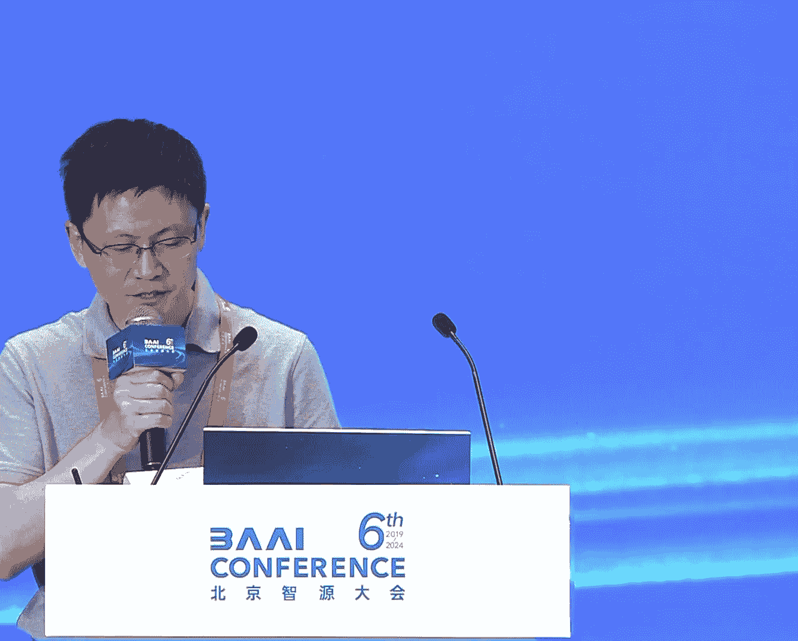

# 2024北京智源大会-大语言模型 - P1：论坛背景与嘉宾介绍-赵鑫 - 智源社区 - BV1zE421N7UJ

尊敬的各位来宾大家下午好，非常欢迎大家来到我们大语言模型论坛，相信大模型这个名词，可能几乎在座所有的听众应该都很清楚，这是这两年最前沿的一个技术，也是最有可能实现AGI到目前为止。

最有可能实现AGI的一条技术路径，但同时我相信可能有很多人也有很多的一个疑问，比如说大模型是如何去训练出来的，然后大模型底层的工作机制是如何去建立的，所以我们今天这个论坛。

不能针对所有的问题都给出非常清楚的，非常确切的一个答案，但是我们试图针对这些核心的问题，去做一次深入的一个探讨，所以我们这次技术论坛，我整体上定位还是技术上应该是比较硬核的。

我们也是邀请了可能全国顶尖高校，包括训练大模型的顶尖公司，来的青年的技术人员为我们来讲解，包括后面我们还有一个panel讨论，去探讨这些最底层最核心的一些技术问题，我们首先就先开始我们的第一个报告。

我们第一个报告是来自于北京大学的贺迪老师，我先简单介绍一下贺迪老师，贺迪老师是北京大学智能学院助理教授，然后前微软样样院主管研究员，那么他所从事的方向主要是机器学习，算法与理论方向的研究工作。

然后已经在重要的期刊会议上发表论文多篇，引用次数超过了8000，然后他所设计的模型和算法，多次被Diplomat的OpenAI，微软Meta等国际顶尖机构所使用，然后也曾经获得机器学习顶级国际会议。

ICLR的杰出论文奖和ICLR2024的杰出论文提名奖，下面我们就邀请贺迪老师给我们带来精彩报告。

