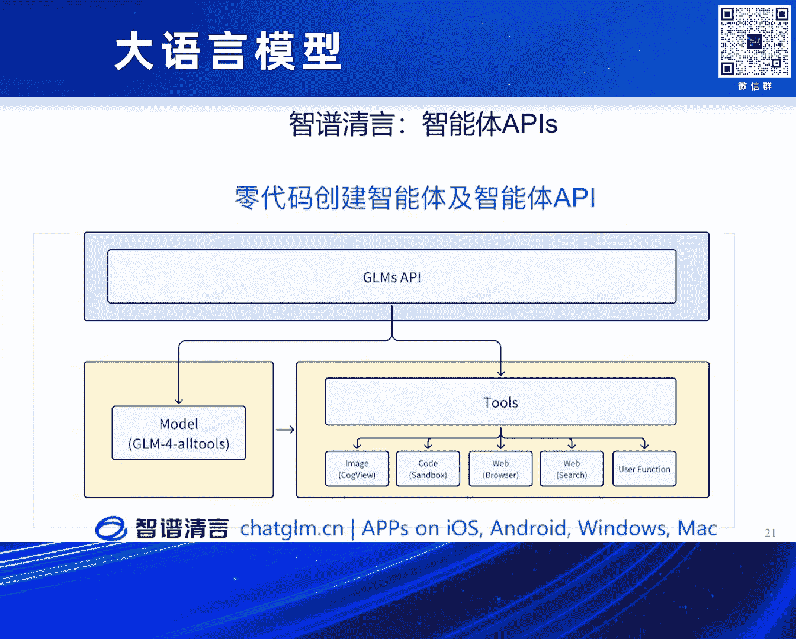

# 2024北京智源大会-大语言模型 - P3：理解与探索大模型能力涌现--东昱晓- - 智源社区 - BV1zE421N7UJ

然后大家下午好，我是来自清华计算机系的东宇小，然后今天给大家分享我们其实在，其实是我们做计量模型，系列模型做了很长一段时间，但是今天的报告可能更多的是过去半年的一些成果。

OK，OK，那首先大家知道，其实我们做大模型其实，其实需要算力，需要数据，需要所有的这些，其实最终的一个前提是需要人，对吧，需要我们过去，大约三四年四五年的时间吧，很幸运其实，跟很多青年的同学。

青年的同事，青年的老师，还有那个，在唐杰老师的带领下，其实我们一直在折腾大模型，然后我今天介绍的工作其实主要是，这几位年轻的同学和学者，在过去一段时间的一些成果，那我们直接直入主题。

其实我特别开心那个贺迪老师刚才关于最后一个问题的答案，他如果说理论上已经证明了我们应该怎么堆积木，或者是不需要堆积木，或者是怎么堆多少，我觉得今天我这个报告就可以，就轻松了。

或者说我们接下来的工作就轻松了，就不用像过去很长一段时间，相对来说非常焦虑的，跟大家不得已的这种互卷大模型，互卷训练，互卷对齐等等的一些情况，那首先直入主题的话，大模型其实这张PPT或者这个截图。

应该大家在过去从Chess GPT出来之前吧，大家应该都经常看到这张图，就是Jason Wei他们在Google和Stanford一起合作的一个研究，他当时实际上就是Empirical的揭示了一个现象。

就是说随着，比如说在这张图里随着横坐标，模型参数量的大小或者是计算量的大小，对相关的一些学术的Benchmark或者Test Set的一些成果，一些所谓的Performance性能。

大家可以看当时的一个结论，他的Empirical的一个核心的结论就是说随着参数量的变大，实际上模型在达到一个预值之前，参数量或者是计算量达到预值之前。

效果其实没有比随机猜或者是普通的模型取得更好的一个效果，但是达到一个预值，大约是一个百亿到接近千亿的规模的时候，大家就发现了所谓的量变引起质变这个现象。

就所谓的他在论文中叫所谓的Emergent Ability，咱们一般翻译成大模型的能力涌现，当然大家可能也知道去年的NeurIPS Outstanding Paper，实际上是给了这篇Paper核心。

当然也是来自Stanford的团队，他核心研究的一个或者说他核心的一个结论是说，实际上他从某种意义上是想说明，其实Emergent Ability或者大模型的涌现能力。

实际上可能与Model Size Model Scale，无论是by Model Size 参数量的Size，或者是by Compute Size 其实关系都不是很大。

这是最上面那个Title实际上是原文中的一句话，他就是说实际上可能更多的是我们使用的metric相关，比如说他是说可能是比如说左边的图和右边的图的对比。

他就是说如果我们用非线性的或者是非连续的这种metric，实际上我们可能会观测到所谓的Emergent Ability，但是如果我们把它变成Linear的这种Scale。

或者是说连续的Scale这种metric的话，实际上好像是随着模型的Scale Up起来之后，其实效果并没有出现所谓的Phase Transition，那个越变的过程或者那个节点。

这是他们的一个核心结论，实际上对于我们来说，我们过去一段时间就是一直在虚模型，其实也一直想了解说到底什么能够盖得我们，或者说决定帮我们做各种decision，当我们训练一个模型的时候，训多大，训多久。

训多少数据量，用多少计算量，实际上我们在做这个过程最近，应该是去年下半年，当然我们放出来是今年年初，我们有个同学叫郑晓，实际上也是JM的一座，他实际上就在训练大模型的前线，实际上就发现了一个规律。

具体来说是，他实际上configure了大约7个不同的模型大小，比如说从3亿参数，5。4亿参数，一直到320亿参数，然后用不同的数据量的大小来训了，from scratch训了30几个所谓的大模型。

然后看fix很多factor之后，看这个模型在downstream的各种task，各种分叉方案上的一个效果，然后试图发现有没有一个潜在的规律，来帮我们知道我们更好地在做模型训练的各种decision。

这是核心的一个结论或者一个观察吧，大家可以看，每张图的横坐标是预训练的loss，loss是越来越小，然后纵坐标是在不同的benchmark上的一个效果，大家可以看上面四行，比如说在这样的数据集上。

大家可以看模型的效果实际上与loss，当然这个是非常intuitive的，就是说非常直观的，随着loss的降低效果其实是一个提升的现象，当然更重要的是大家可以看。

实际上如果我们fix everything的话，大家如果忽略图中的颜色，对吧，1。5 15亿模型，60亿 320亿参数的模型，如果大家完全忽略这个颜色的话。

大家可以看基本上这不同parameter size的模型，随着loss的降低，实际上它取得的不同的模型，在同样的loss的情况下，实际上取得的效果是一样的，OK，实际上某种程度上。

我们如果想在某个benchmark或者某些任务上，取得一个target的目标的话，target performance目标的话，实际上最终一个中间的factor是loss。

但是当然loss又是由模型参数，当然计算量根据scaling log能够决定出来的，OK，更重要的是下面这行，大家可以看，当在相对来说比较复杂的一些任务。

比如MMLU还有JSM8K这些偏数学偏推理的一些任务上，数据集上，这个模型的loss，随着模型loss降低，其实在前期我们发现，它这个效果跟虚线的黑色的虚线随机猜是差不多的。

也就是说其实模型也没有产生相应的能力，但是随着loss大约降到2。2到2。1之间，大家可以看这个模型的效果，其实突然有一个所谓的跟JSM8K第一页slide类似的现象，就有一个所谓的涌现的情况。

就是模型突然开始有某种能力随着loss降低，不管你这个模型是320亿还是15亿参数，就是说这个本质上其实与模型参数量大小没有关系，实际上更多的是与loss有关，OK，当然我们再回过头看。

去年New York那篇best paper的结论，是说实际上我们这个观察的现象，很有可能与我们所用的metric的连续性，metric的线性与非线性相关，是吧。

那我们经过所谓的算是evaluation，也不算evaluation，就算是一个对比实验，我们可以发现实际上按照New York那篇paper。

best paper outstanding paper的实验方法，我们采取不同的metric，实际上核心结论是没有变的，也就是说这个模型随着loss，我们预训练loss降低模型的所谓的涌现能力。

仍然可以被观察到，OK，那因此的话，实际上我们就可以根据loss，以及模型的size，当然结合之前OpenEye的，或者DeepMind的Skull and Law，我们实际上可以把两个是结合起来。

就可以得到一个非常简单的，根据loss和模型size相关联的，一个imaginability的定义，那最直接来说就是说，当模型loss小到一定的程度上，它才能涌现出来的能力。

我们叫做imaginability，而不是原始paper当中，是说当模型的大小，或者模型的计算量达到一定程度上，我们来出现的能力才叫imaginability，OK，这是我们在模型蒙住能力出现。

或者蒙住能力提升，前期做的很多观察，很多实验，那有了这个观察。

实际上接下来我们就想，我们怎么真正的提升模型的能力，OK，那我们实际上从2020年年初，训这个千亿的GM130B模型，一直到去年年初的一代的对话模型，Chad GM到二代到三代，其实上整个过程。

我们尝试把context-sensitive提升，尝试让模型有function call，有多agent智能体的能力，那其实在那之后，去年10月之后，我们其实更多是想，怎么能够让我们自己的GM系列模型。

可以有更强的智能体能力，可以在智能体相关的任务上，取得更好的一个效果，其实主要的一个出发点或者动机，也是因为我们去年暑假，其实想试一下，我们当时整个LIM大模型的研究，或者是探索。

其实关于智能体方面的理解，或者是探索非常少，然后我们发现，就自己做了一个benchmark，叫agent bench，就是说来看我们自己的模型，在智能体的各种任务上到底怎么样，然后做完发现。

即使我们的模型，包括其他开源的很多模型，其实就是说，在很多比如说MMU，在GEMS M8K，在CEO等等数据集上，我们都可以取得接近，或者差不多的一个效果，但是在智能体上，我们发现我们明显比。

比如当时的GB4那个版本，当时的Cloud那个版本，有非常大的一个差距，但是我们就在想，怎么让我们模型可以有智能体的能力，那具体来说，比如说我们以GM为例，如果想让它有智能体的能力，有agent的能力。

实际上就是说，那不同于，今天也不能叫传统的，不同于去年年初的那种对话模型，chat模型的话，实际上给定一个query，给定一个prompt，我们这个模型给一个。

next token prediction这样的一个任务，给一个response对吧，我们是希望，这个模型本身如果能不能，基于这个模型作为一个智能体，然后如果我们问它相关的任务，如果它自己能够判断说。

第一它能不能干这件事，如果不能干，它能不能自己planning，自己来靠外部的function，外部的工具来解决相应的任务，这里图中是一个相应的例子，比如说我们让这个模型找到。

从2000年到2023年全球的人口，并且把年均人口的平均年度增长率，计算出来，那这个模型首先，如果不确定它是否有相关的信息，或者相关信息准不准，这个模型可以自己做个判断，说我可以去上网搜。

利用browser search engine来做，然后搜到了之后，自己可以打开相关的网页，自己决定打开哪些网页，拿到相关的结果，拿到相关的结果，当需要算这个平均增长率的时候，它能够说。

我这个时候做一个decision，我需要自己写的代码，并且要外部的工具把代码执行了，得到相应的结果，然后返回来给我们用户，自然语言的方式返回相关的结果，这是我们的目标，那做这件事的，怎么形容呢。

做这件事要实现这件事，实现模型，除了要有智能体的能力，或者是说，这个，感知环境，或者是说planning action，这个能力之外，其实一个前提条件是。

模型需要有相对来说非常长的context length，对吧，就刚才所有的这些信息，如果按照这个流程走一遍的话，实际上模型所process的context length，非常非常长。

那实际上在这个过程中，我们就，其实也探索了很多路径吧，当然开源社区有很多各种各样的探索，如何把模型由4K 8K，extend到比如32K，128K，甚至最近这个1M，那我们实际上在探索的过程中。

有几个核心的发现吧，或者主要的发现，第一个就是说，我们做Lang context的这个事情的时候，让模型有这个处理更长context的能力的时候，其实除了在预训练阶段，需要让这个模型不停的外推。

有处理这个Lang context的能力，其实在对齐的阶段，尤其是instruction的阶段，我们发现其实这个对最终模型的效果也很重要，所以我们在这个时候就。

提出了这个Lang-on-Lang这个strategy，本质上就是说，怎么让模型更好的，在长数据上做对齐，那同时还要保证，大家可能知道说，今天对大模型做领域微调，或者相关的一些任务的微调的时候。

很重要的一个挑战就是说，当我们尝试把某一项能力提升的时候，在这里就是长本能力提升的时候，其实很多时候会negatively的影响，模型在其他尤其是通用任务上，它已有的任务上的一个性能，那在这个过程中。

我们实际上是需要保证，模型在长本和短本上的能力，能够同时提升的很高，或者说至少在长本提升的时候，能够保证短本的能力不被降低，那第二点就是说，很自然的当我们，比如说以instruction。

或者对齐数据为例的话，我们在做微调的时候，或者做instruction tuning的时候，实际上在需要很精细的数据配比，把长文本短文本的数据，能够很好的结合，然后在这个结合的过程就自然产生了。

当在一个batch里不同的instance，它这个长度不同的时候，其实在计算的过程中，会容易产生这个add-on time，也就是说所谓的气泡，那实际上这里我们就需要采用。

packing和sorted batching的技术，然后尝试让这个，尽量减少气泡的时间，那又同时我们知道在训练的时候，这个短文本和长文本，如果正常的把它在算loss的时候，正常的算一起的时候。

其实合并在一起的时候，其实它会导致这个，对loss的contribution，实际上是一个不均衡的状态，所以在这个时候我们也需要对于，长文本和短文本对loss的影响，产生一个所谓的waiting。

或者做一个balance，那通过采用相关的这些策略的话，实际上我们最终可以让我们这个模型的，在长文本instruction阶段，比如说训练的时候，能够大约有两到三倍的训练效率的提升。

OK 这是基于这个技术，我们最近几个月又，进一步把这个模型的context length，由128K 64K 128K，其实上个周我们刚开源了一个9B的模型，把这个context length推到了。

这个1Million token，比如说如果汉字的话，按照那个tokenizer的情况的话，其实也接近是，这个200万的汉字的一个情况，然后这是我们自己在benchmark上测的一个结果。

大家感兴趣也可以试一下，比如说那个9B的1Million，就是最下面那个高亮的，JM4 9B CHAT 1Million这个模型，目前是上个周是开源了，然后这是模型有了Lang context能力。

那有了Lang context能力，现在我们就要专注于说，如何让模型的智能体agent能力，进一步提升，对吧，那我们刚才提到了，我们去年暑假发现我们自己的模型，在智能体的任务上，其实相比其他。

尤其是OpenAI的模型，AnswerPick的模型，有相当大的一个差距，那在这个过程中，我们就发现其实核心的一个难点还是数据，就是说我们设计或者说收集智能体数据的时候，其实非常难，那大家知道。

那你如果做简单的SFT，做简单的对话的时候，一个问题你给一个，写一段答案，当然这个一般也不是很容易，当然至少它是一个一对Q的，所谓的QA pair，问答对对吧，那对于agent来说，我们可以想象一下。

我们让这个模型尝试解决一件事，如果我们要让它通过调外部工具，通过方向code的方式，实际上某种程度上，在整个模型解决这个问题，它这个trajectory当中有很多很多的分支，比如在某一步失败了。

在第二步失败了，在下一步成功了之后又失败了等等，实际上这个对数据的设计，以及数据的收集有很大的挑战，实际上我们在这个过程中，是设计并开源了agent instruct。

这个智能体的一个trajectory的一个数据集，本质上我们是simulate了六个智能体的，或者说六个环境，然后让这个模型在里面探索自己，也不能叫随机游走吧，这个模型在里面产生相关的一些数据。

然后当然也有些人类的标注的辅助，然后让收集到相对来说，还比较有效的智能体轨迹的数据，然后通过混合训练的方式，可以通过少样本让模型有很强的智能体放号能力，实际上最终我们只需要1800多条智能体轨迹数据。

就可以让模型取得非常好的处理智能体任务的能力，那当然同样的我们是simulate六个环境，在六个环境里很直接，我们的模型取得了一个不错的效果，但实际上在其他的智能体任务上，它没有经过微调的任务上。

我们可以发现中间这个图，也就是说在外分布上，实际上它放号性也非常强，然后用1000多条的数据，智能体的轨迹数据，就可以让模型在其他的智能体任务上取得一个不错的效果，当然对我们来说可能更重要的一件事是。

我们需要确保模型在智能体能力提升的时候，它的通用能力，比如说MMLU代码数学推理等等能力不能有所降低，这是最右边那个图所展示的，就是说我们确保了在智能体能力提升的时候，我们最关心的基础通用能力不被损伤。

OK，那有了LanAlign和Agented Tuning，实际上是某种程度上让我们的模型有更长的context lens，然后在这个context lens上，可以处理有更强的智能体的能力。

然后能够取得对我们来说还不错的一个效果，这是我们今年年初1月份发布的，推出的GM4 All Tools这个模型，实际上大家感兴趣也可以在智普清源尝试，就是说比如说我们让模型解决一些相对来说。

对于Next Token Prediction非常复杂的任务，当下对Next Token Prediction非常复杂的任务，比如说这个X³+AX±5X+9除以X+4，商是X³+BX-1。

然后余数是13计算AB的值，实际上模型在处理这个任务的时候，它前期通过整理把这个问题转化成中间那个等式，然后它自己做了一个decision，这个时候我需要写一段代码把这个任务完成。

它实际上是写了一段代码，并通过Python解释器把这个代码运行，得到了A和B的值，最终通过这个语言的方式把这个相应的结果返回，那类似的还有比如说多工具的一个混合调用，比如说通过类似于刚才那个例子。

比如说查一下全球过去十多年GDP划出趋势图，如果哪年GDP下降，在趋势图用红色标出来，右边那个图实际上就是模型在网上拿到了相关的数据之后，写了一段Python代码。

通过MATPLOTLIB把这个图画出来，而且还满足我们的要求，如果哪一年的这个增长率GDP下降的话，用红色的点标出来，OK，然后我们相关的模型实际上也刚才提到上线的质朴清严。

然后其实用户现在可以自己基于我们这样的一个通用模型，可以创建各种各样的智能体，目前大约用户创建了三十万多个智能体，然后更重要的是，除了通过这种界面式的方式，access智能体之外。

实际上每个智能体也可以通过用户创建的智能体，也可以通过API的方式访问，然后处理，某种程度上我们在尝试实现通过零代码创建智能体，以及通过智能体API的方式提供服务，OK。

这是我们在语言模型上做的一些尝试，当然在这个过程中我们也逐渐意识到，实际上如果以我们人为例，我们每天大部分的时间可能都花在这两个屏幕上，移动手机或者是电脑上，然后我们就想模型某种程度上能不能。

像我们人一样，在处理相关的固语或者图形界面的问题时候，能够有智能体的能力，首先我们团队的丁明同学实际上带着很多年轻的同学，开发了靠谱VR模型，实际上就是一个Vision Language Model。

这个模型其实核心的想法跟，当时提出这个模型的时候，其实核心的一个想法或者当时面临的一个问题就是说，如何将视觉或者Image空间，能够跟Language Model能够很合理的对齐在一起。

同时让训练的cost不要太大，一般的假设是说，我们希望这个语言模型经过很长期的预训练，甚至对齐之后这个语言模型是fixed住的，或者说尽量不要对这个语言模型做大的训练任务。

然后在这个时候如何让视觉的信号或者视觉的space，能够跟语言模型的space合栏起来，那我们的同学实际上就提出了，在这个语言模型就是右边这个架构图上。

在这个标准的Transformer这个架构上实际上外接一个紫色的，也就是说这个视觉模块，视觉的export让这个视觉模块，然后处理新来的image的图像，image的数据，那在此进一步的话。

实际上基于这个模型，我们的同学团队又提出了Cog Agent，实际上就是尝试解决视觉语言模型在处理，比如说agent能力，尤其是处理我刚才提到的手机或者电脑界面的时候，其实它里面的视觉的比如说各种图标。

各种像素各种信息有的时候非常非常小，如何让这个模型在计算量，或者是训练量有很大提升的情况下，保证这个视觉模型可以很好的处理这种，需要高清晰度表示的一些任务，比如说在1120x120这样的一个像素级别下。

如何让这个模型在训练量不提升的时候，同时取得我们期待这个模型取得的一个效果，实际上在这个模型当中，我们的同学就提出了这个Cross-Attention的机制。

通过一个Cross-Attention的模型，然后让这个模型在能够处理低分辨率图像的时候，同时也可以用较小的计算开销，能够对这个所谓的高清的图片能够进行同步处理。

这个是基于我们这个模型最新做出的一个Demo，当然大家可能上周或者上周看苹果和微软的发布会，可能见过类似的，但是我们这个完全是做一个第三方从模型的视角，没有利用Windows API。

没有利用iPhone Android API的情况下做出的Demo，完全是模型像我们人一样看着这个屏幕，无论是电脑还是手机屏幕做出的相关的一些反应，感觉卡住了。

这个是让它在给模型的指令，就是删除PB中的个人信息，目前的整个操作过程都是模型自己在操作，关于点什么怎么点，点完了之后该干什么，感觉这个电脑有点卡住了，OK 那我们先看下一个，OK 那接下来呢。

进一步在手机上能够处理网页相关的任务是，我们又提出这个，诶哟 时间可能差不多，AutoWebJM，然后通过Core Chrome Learning DPO以及拒绝采样等等相关的技术。

我们搭了这样的一个框架，让模型的处理这种Agent的能力更强的一种方式，然后这是我们最新出的一个Demo，其实是下面团队刘骁同学带着大家一起最近折腾的一个情况。

比如说任务是为我筛选出价格在100到300元同时包邮的女性钱包产品，接下来其实整个过程完全是模型在操纵这个手机，就每一步他根据他看到的结果，然后一步步操作这个手机得到的相关的一些情况。

比如这个时候他知道他要筛选，点开这个界面他知道他要填什么，选包邮在那个价格框里选上相应的价格，(刘骁：我现在是在做什么呢？)，OK，但是呢即使我们今天做的其实相对来说。

在具体的这个Task上这个任务上做到跟GPT 4O或者4Turbo差不多的一个情况，然后我们最新的那个版本GMOS Web这个System，其实也可以做到接近50%。

但是其实离人类Performance 78%还有相对比较大的一个差距，接下来三个例子包括在微信里在地图里在美团订单里，我们就快速跳过。

OK，然后最后的话实际上在我们开发各种模型的时候，大家知道就是各种各样的Benchmark，各种各样的Evaluation，其实都大多数都不太靠谱。

实际上我们也在内部也开发了很多的相关的Benchmark，其实更好的Guide我们知道我们在我们做各种开发训练决策的时候。

能够更好的做Decision，然后最后一页的话，我实际上是想说刚才那个贺迪老师也讨论过，简单提到刚才有观众也问到相关的一个问题，就是说左边这个图呢是Bullet DeepMind的一个截图。

当然大家都有各种各样的类似的一个Plot，核心就是说Transformer或者是神经网络给了我们一个Scaling的可能，然后目前来说至少我们自己不知道Scaling的尽头在哪里，从算法从数据的角度。

那目前来看模型随着模型的Scaling，模型的参数或者计算量越来越大的情况下，我们并不知道这个拐点或者是Diminished Return的Turning Point在哪，那从另一方面从算力的角度。

大家知道大家可能经常会说摩尔定律放缓，然后但是从英伟达最新几年两三年给我们的输出来看，像这个英伟达单卡的性能在提升，英伟达的GPU在从系统层面单卡提升之后，把多个卡连在一起组成一个系统。

像它的这个计算Flops或者计算性能也在不停的从倍数的增长，比如这里提到的说八年有一千倍的计算效率的一个提升，那在这两个Scaling的拐点目前我们还没看到的时候。

我们接下来做一个无论是从一个团队的角度，还是大家对大模型感兴趣的一个角度，大家怎么能够一起能够让这个模型继续Scaling下去，以及Scaling的更有效率Scaling的更好取得更好的效果。

当然在这个过程中很多时候其实不仅需要工程上的技术上的探索，还有需要可能理论上的一些突破，其实都需要我们大家一起来讨论一起来探索，那其实也是个开放性的问题留给大家，那我今天的分享就到这里谢谢大家。

