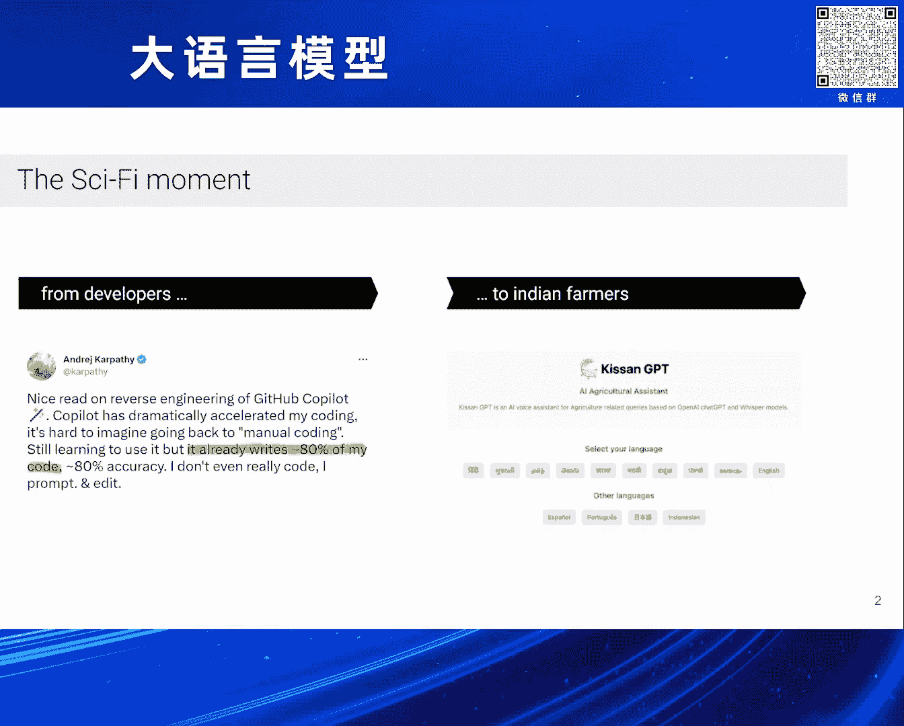

# 2024北京智源大会-大语言模型 - P7：Large Language Models： Past, Present and Future：Thomas Scialom - 智源社区 - BV1zE421N7UJ

大家好，我是Thomas Salam，我的講座會是關於，Large Language Models 過去， 現在， 未來的，我會放大LLM的近期歷史，特別是我們在LMHF的後訓練做的事，還有我的看法。

以及未來的方向，首先，我想先講一下我們在哪裡的想法，(咳嗽)，抱歉，還有它們的速度，從一年前開始，我們只有LMH2和Chad GPT，我們從來沒有看到這麼快的科技。

我認為是Nick Bostrom的哲學家說，當它成功，它就不是AI了，我喜歡這個定義，我們可以從AI的影響力，到科學史上的數量，它就消失了，它基本上不是科學史了，我認為在Chad GPT之後。

我們有一個轉折的時刻，在歷史上，它是AI，它成功，但它還是科學史的一部分，Large Language Model， a Brief History，Large Language Model是什麼？

Language Model就是一個語言模式，它是一個重量，現在的形式是一個轉折，以及我們訓練的數據，即是Token，它是一個自主管理的方式，這就導致了Loss的下一個Token的預測，所以。

我們有兩個方式去規範，重量還是數據，在GPT-3的工作中，請給我一分鐘，我去拿個水，我有一些東西在我手上，(音量注意)，抱歉，在GPT-3的文章中，他們其實是在測量重量的影響，重量是模型的大小。

或是測量數據的大小或步驟，他們發現最大的影響，藍色的部分，是測量模型的大小，他們就用這個方式去測量GPT-3，兩種重量，從GPT-2，比例少於1億個數據，到175億個數據，你可以看到，用更多的模型。

你完全不改變任何東西，同樣的規範，同樣的模型，同樣的數據，只要是更大的模型，你會增加準確度，這就是我們所說的測量，這樣你甚至可以得到，非主流的表現，來自於細緻的特定模型，只要是測量，測量重量就是測量。

我們有一個新聞，來自深思熟慮的Chinchilla，他們做錯了一些事，在他們的分析中，在他們的規範中，他們忘記了應用計劃器，在訓練期間，所以這並沒有，進行到對的規範，對於細小模型，導致不好的實驗規範。

事實上，測量數據也會影響到訓練，他們有一個測量規則，每次測量模型的方式，都會測量數據，以正確的平衡，這份報告非常有趣，DeepMind有份報告叫做Gopher，比GPD 3還要大，比GPD 3還要大。

超過80個數值，需要大量的計算，從很多細小的分析中，他們說，對於同樣的計算，我們認為最好的方法，是訓練一個比較小的模型，Chinchilla，超過70個數值，但需要大量的數據，對於同樣的數據。

我們認為平衡不太好，我們會做，他們把Chinchilla擴展了，這大致對這款模型造成了影響，所以現在有方法平衡量和數據，但我覺得這不是故事的結局，我們現在建議，重新思考數據的最佳方法，從這個圖表。

可以看到損失一直下降，但問題是，你有很多數據固定，你想找到正確的平衡，但這個平衡，只能給你最好的最佳訓練，最佳報告結果，但如果你想讓人們使用你的模型，我們希望有多個百萬人使用我們的模型。

你也需要有一定的效率，不只是訓練，所以，我們可以說有兩個層次，數據和重量，但問題是，在訓練時間之間，兩者之間有正確的平衡，但在重量訓練時間之間，重量越多，重量的數據就越多。

但數據是一個可以隨便下降的層次，你可以訓練無數個數據，讓你的模型沒有影響，在重量訓練時間之間，所以我們可以說，我們可以說我們可以超過訓練，我們可以得到更好的結果，但在重量訓練時間之間。

我們有非常小的模型，非常有效率，但它們都是LAMA家庭，所以模型就像，Raspberry Pi，GPT-3的表現，我們有很多模型，像Alpaca，Villaman AO，這些模型。

我猜它們下載了50萬次，LAMA 1的訓練，我們被要求停止重量訓練，記得一年前，Foundation的模型，沒有開放式的文字，只有GPT，從那裡開始，它們的速度是多快，我們在LAMA 2上工作。

基本上是在訓練前，在LAMA 1上，在更多的優惠圖上，進行重量訓練，但同時也有，在訓練過後，跟著編排的訓練方式，我們在LAMA 1上，進行了超級快速緩衝，讓我來放大，請注意。

我們很快就會有LAMA 3的報告，我們有所不同，在LAMA 2上，但基礎還是一樣，所以，超級快速緩衝是什麼？這是基本的訓練方式，去調整模型，你有一張標題，你請筆記者寫下來，我們付了很多錢，給筆記者。

去寫這張很有趣的標題，寫一首詩，幫我記住第一十個字，每個字都有一個字，是自己寫的，我對他們來說，不確定我會是好筆記者，這很難，我會有這些工作，筆記者也寫下，他預期筆記者的標題，最好答案，然後我們把標題。

寫在這張標題上，我們收集了很多指引，另一個方法，叫做人類的選擇，訓練獲得標題，然後的ARLHF，你只寫標題，筆記者還寫標題，然後我們用模型，來分析兩個答案，筆記者不需要寫答案，他只需要說他喜歡哪一個。

你可以看到，這十倍不貴，因為需要時間去寫，寫答案通常很耗時，當我們開始這個項目的時候，我認為，SFT是標準標準，但因為我們有時間限制，期限和限制，我們可能會像其他人一樣，去做這個，這是我最初的想法。

你可以看到，我們訓練不同的獎勵大小，然後用越來越多的數據，我們一直增加獎勵模式的準確度，這是什麼樣的獎勵模式？只是一個模型，輸入一個答案和答案，然後給我們一個分析分數，然後我們可以說，這個分數比這個高。

所以最後是一個評級的任務，當我們使用這個獎勵模式，我們可以利用它來提升答案，並且訓練我們的模型，來進行強化學習，我們發明了一個系統，叫做反差測試，你可以拿出一個答案，測試從1到10，和更多的測試。

你可以看到，如果你拿出獎勵的平均值，它會停止不變，這是橙色的線，但如果你拿出獎勵的最高分數，每個測試我們都會用，我們訓練的獎勵模式，我們測試我們所有的最高分數，每個新的測試，我們有更多的機會。

測試出最高分數的測試，你可以看到，獎勵的最高分數，變得更多，你可以想像RLHF，如果我們用這些測試，來得到最高分數，相比中間的測試，這個範圍是一個增強的潛力，利用獎勵模式來增強獎勵分數，如果我們訓練。

如果我們訓練，如果我們訓練，我們測試的最高分數，我們應該從中間獎勵，去到下一種模式，最高分數，增加平均獎勵分數，你可以看到，我們做了很多次，我們用了我們的，我們的MetaReward模式。

以及GPT-4的Reward模式，我們在我們的模式，對GPT-4的，幫助和安全的，獎勵分數，我們用了超級潛力模式，我們開始非常低，我們一直增加，當然我們的分數，在我們的旁邊比較好，因為我們像這三個模式。

只訓練我們的分數，來跟隨我們的規則，GPT-4可能不一樣，我感到非常強烈的是，即使根據GPT-4，最後我們的模式，被評價為，50%以上，比GPT-4好，你可以看到，在每個回合，我們都在測試，分數的變化。

我們有很多的提示，還有很多的樣本，我們會檢查，分數的分數，然後我們會看，他們的分數，你開始是混合的，你希望在每個回合，減少接近零的數字，然後把他們拉到右邊，讓更多的樣本，接近1，這是最高的分數。

這是我們做了，很多回合，我想給大家看一個有趣的現象，我們非常驚訝地，觀察了時空的觀察，只要把時間和切割的知識，切割到時，模式應該停止學習，我們可以，改變答案，在時空的方式，當然，1940年後。

模式學習了很多東西，但只要告訴模式，你現在不知道，就像你不知道一樣，你問他誰贏了第二次世界大戰，他就告訴你，我不知道，同樣的方式，如果你說，這是一個平行的回合，我們在2023年，已經有了GPS技術。

但如果你問，在1000-200年前，他會說，我不完全確定，有些人會這樣說，但沒有提到技術，我覺得這很酷，但我告訴你，我們在做這個項目時，發現了什麼，真正的魔術在於什麼，我告訴你，我們開始的時候。

我認為超音頻訊號，是更好的，在質量方面，因為人類還是比機器還要好，我們無法訓練我們的模式，它是機器生產的，但現在，我會說，想想這個問題，寫一個大語言模式的謎題，我給你們五分鐘，想想辦法，想出一個答案。

我非常擅長，也許有些人比我好，但想出一個創意的答案，其實對人類來說很難，我們的模式，馬上就能做到，在蜥蜴座的家裡，語言的蜥蜴住在那裡，蜥蜴在那裡，這比大部分人類都能做到的好，我們在開始的項目中發現。

在非常少的監控數據下，我們的模式已經比平均輸出，還要好，RLHF的真正的魔術，就是，我們的模式已經有超人類的能力，另一件要注意的事情是，我不是因為不好，在這裡創造答案，而是因為我不好在評價質素。

我們都不像皮卡斯，在畫畫，但我們可以，欣賞一件好作品，相比一件不好的作品，我們有這個能力，分辨好和壞的答案，不一定要寫好答案，這就是RLHF的力量，我認為RLHF並不是，關於強化學習，或是人類的反應。

我認為只是，創造超人類級的文字，由人類協助機器人，我們明天可能會有新的方法，把人類和機器人組合起來，但我們還會有更好的能力，訓練未來的模式，接下來會發生什麼，我會給大家，我會給大家，總結一下。

如果大家有任何問題，我們已經到了，畫面幾乎完整，速度快，但多模式輸入輸出，GPT-4。0已經顯示了，這是一個明顯的方向，我認為現在我們已經，完成了語言模式，我們還會看到一些進步，一些增加。

但這些還沒有完全完成，我們已經達到了，正常的程度，由於早期訓練和後期訓練，所以下一步，是將更多的內容，包括任何輸入或輸出的模式，包括視覺數據、語言數據，視覺影片，我們已經在進步，我們在做這件事的時候。

更多的工作已經開始了，包括代理人，基本上是一個會運作的系列，我認為代理人，可以是一個系統，有一個計劃的元素，一個記憶的元素，以及一個結合的元素，但這些元素是由，由早期的語言模式解決。

加上多元素、輸入和輸出，所以我們可以看到，研究在一層層的進步，來解決下一代的可能性，然後，我認為下一步的進步，就是機械人，我們可以想像，我們會第一次，與代理人交流，所以不僅僅是生產代幣。

並獲得代幣基礎的獎勵模式，現在我們只需要文字，與代理人已經在，數位世界上建立，與模式能夠運行密碼，並且看到環境的輸出，如果密碼失敗或失敗，模式可以看到，並且能夠反應，同樣的，如果模式不知道資訊。

可以在網上搜尋，搜尋資訊，並自行改善，有時候你會覺得，如果有一個事件，你搜尋網上，你會覺得我錯了，或者我對，你可以更新你的數位，以此來看，所以你不再是，用語言模式來運行，單純的語言模式，下一步的進步。

就是機械人，我們開始看到，越來越多的進步，HuggingFace 剛剛下載了，開放式資訊欄，價格現在每年都在下降，我們現在已經到了，我們將來幾年，可以看到，一些機械人，我們可以在這方面。

我們喜歡便宜的價格，這是目前的主要模式，然後自然的階段，就是將我們的代理人，進入物理世界，並且提供更多的訊息，我覺得這個方向，是邏輯性的，我們知道的，確實是一個重要的課程，數據是我們需要的。

我們知道規格是有效的，我可以告訴你，模型運行10次，100次的數據，會有更好的結果，這是一個明顯的趨勢，就像是一個民間法律，這是我們最早可以預測的法律，但是我認為，AI在這幾年來教導我們。

就像是AlphaGo，我們在10年或12年，從ImageNet，以及模型認識像是狗和貓，從遊戲模型，到人類模型，以及生產文字，這些都在超人類的層面，有一定的能力，模型是解決數學的標準，以及理論的標準。

也許還沒有達到，世界上最好的數學專家的水平，但實際上比我們大部分人都能做得更好，我們有很多的進步，是預期或是意料之內的，我認為我們在這個領域，有越來越多人在工作，每年都有新加入，這個領域是非常近期的。

100%的AI研究家，在世界歷史上，其實正在研究這個議題，他們還在離開，我相信，新的研究會發生的，意料之內的，其實是我們應該預期的，我告訴你，我完全不知道是什麼，我會結束這個講座，我們可能在生活著。

科帕尼克斯時代，對於智慧來說，AI可能是我們世代的，科帕尼克斯發展，我們在發現地球上，地球並不特別，我們在發現，一個正常的星星在正常的星球中，那時代是一個大革命，也許我們在學習，智慧並不是太瘋狂。

只是一堆數字多數，為了NVIDIA的享受，謝謝，繼續建造。

