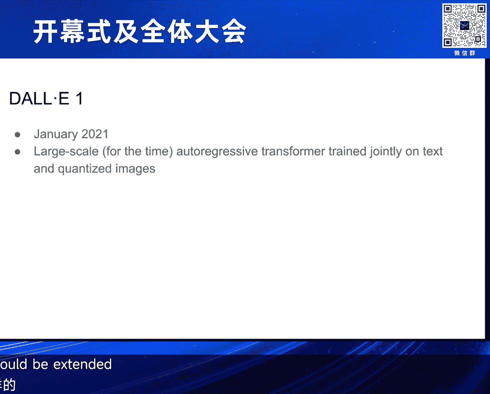

# 2024北京智源大会-开幕式及全体大会 - P2：主题报告：多模态大模型-主旨演讲：Aditya Rameah-对话嘉宾：谢赛宁 - 智源社区 - BV1uH4y1w77V

(英文)，大家好，我是一個榮幸的來訪，我是OpenAI的影片發展總監，今天我想談談一些觀察，關於過去幾年發展的創新模式，(英文)，首先我想談談一些很老的結果，至少在深入學習的層面上，在1月2021年。

我們發布了一篇文章，關於DALI-1，是一款大規模的，至少當時的自動變形器，是集體訓練的文字和數位圖像，我們決定做這件事是因為，我們看到了原始生命的証明，模擬語言與變形器，我們也在想，同樣的技術。

能否延伸到其他模式上，結果，結果是很順利的，模型能夠以字幕作為輸入，並把它轉成數位圖像，所以，它是有提示的，模擬語言模式，我們還訓練了VQ自動變形器，並且模擬了數位圖像，這些圖像的圖片。

是用原始語言模擬文字，整個平行的圖片，是由一款變形器模擬的，最有趣的是，我們看到了DALI-1的規模，就像我們今天看到的語言模式，所以，如果你開始訓練，一個小規模的自動變形模式，你可以看到光影和反射。

複製物件，顏色的能力，在一個小規模，然後在一個大規模的模式，你可以畫出物件，以多種標記，改變藝術風格，等等，當你增加規模，你可以看到像是文字製作，組合式的整合，還有在相關的場景中，學習的標記。

我們嘗試了，像是DALI-1的進步模式，即視覺智能測試，模型看到了，這條線上的第一八個元素，然後要填充最後一格，我們還嘗試了，圖像對圖像翻譯，你給模型上半部分的圖像，然後要它畫下半部分，這些東西。

有時候需要花點時間，來完成，然後我們在想，如果我們把它調整得更大，所以在DALI之後，我在想，這是一個好方法去學習智能，因為你只要訓練一個模型，來壓縮所有的畫質，和視覺世界，看起來，是一個複雜的任務。

只是需要很多資訊去模型，當時有研究顯示，這不是一個正確的方法，所以Mark，之前訓練的IGPT，是第一款，大規模的，自動變形器，這個模型並沒有，靠文字來設計，但這個模型的有趣發現，是單純學習壓縮。

圖像的效果，模型也學習了視覺世界的，下層結構，也學習了視覺的表現，例如，當你把IGPT模型加大，它們就開始得到，視覺網路的好結果，然而，這比Clip更不夠有效，Clip也在DALI1，推出了。

Clip的理念是，學習文字和圖像的，交界點，如果你想像一下，文字和圖像的Venn式式圖表，你需要用視覺網路，來學習，圖像和圖像的交界點，而這就變成了，比IGPT更有效的，大規模的自動變形器，來取得智慧。

所以我當時的結論是，DALI1是一個有趣的項目，很棒的項目，但它並不是，能夠取得智慧，從視覺世界的方向，現在我會說說，Clip的運作，如何從圖像和文字，交界點取得資訊，我相信很多人，都已經對此感到熟悉。

Clip學習了，圖像和文字的交界點，文字交界點需要一個標記，圖像交界點需要一個圖像，在訓練期間，Clip的模型會提供，一張圖像和文字的，對比圖像的圖像，文字交界點會對所有文字，和圖像的對比。

Loss功能會鼓勵，兩個輸入器，對比每個圖像，和相關的標記，當時Clip出現時，是一個很大的改變，因為相反於需要手工製作標記，來訓練一位好的標記師，這很耗時和很痛苦，我們可以利用，網上的訊息。

來學習一種，對所有領域的標記，如果你想標記動物，你可以建立一張標記，標記動物的類別標記，然後你可以使用，標記的標記，來標記，所有文字的圖像，然後用軟碼，來決定，標記的圖像的類別，所以，那時。

我們覺得標記學習，開始進步了，最初深入學習，有了一些成功的第一步，我們都知道的標記標記，那裡，你訓練一位標記師，來從圖像中，抽取一些資訊，例如標記，標記的類別，幾年後，我們有了一個影片，我們可以從網上。

學習標記的，一種標記模式，讓你不需要，手工製作的技術，一段時間後，我們發現標記學習者，也能夠用，標記模式來學習，所以我們不需要，用對比式的方式，來模擬標記和圖像的，標記模式，來模擬標記。

就像一個語言模式，學習標記圖像，所以，看來，時間上有些變化，我們可以問，我們會如何，在花費上增加，所以看來目標的功能，改變了，我們學習標記的方式也改變了，我們學習標記的方式也改變了。

我們學習標記的方式也改變了，我們學習標記的方式也改變了，我們學習標記的方式也改變了，我們學習標記的方式也改變了，我們學習標記的方式也改變了，我們學習標記的方式也改變了，我們學習標記的方式也改變了。

我們學習標記的方式也改變了，我們學習標記的方式也改變了，我們學習標記的方式也改變了，我們學習標記的方式也改變了，我們學習標記的方式也改變了，我們學習標記的方式也改變了，我們學習標記的方式也改變了。

我們學習標記的方式也改變了，我們學習標記的方式也改變了，我們學習標記的方式也改變了，我們學習標記的方式也改變了，我們學習標記的方式也改變了，我們學習標記的方式也改變了，我們學習標記的方式也改變了。

我們學習標記的方式也改變了，我們學習標記的方式也改變了，我們學習標記的方式也改變了，我們學習標記的方式也改變了，我們學習標記的方式也改變了，我們學習標記的方式也改變了，我們學習標記的方式也改變了。

我們學習標記的方式也改變了，我們學習標記的方式也改變了，我們學習標記的方式也改變了，我們學習標記的方式也改變了，我們學習標記的方式也改變了，我們學習標記的方式也改變了，我們學習標記的方式也改變了。

我們學習標記的方式也改變了，我們學習標記的方式也改變了，我們學習標記的方式也改變了，我們學習標記的方式也改變了，我們學習標記的方式也改變了，我們學習標記的方式也改變了，我們學習標記的方式也改變了。

我們學習標記的方式也改變了，我們學習標記的方式也改變了，我們學習標記的方式也改變了，我們學習標記的方式也改變了，我們學習標記的方式也改變了，我們學習標記的方式也改變了，我們學習標記的方式也改變了。

我們學習標記的方式也改變了，我們學習標記的方式也改變了，我們學習標記的方式也改變了，我們學習標記的方式也改變了，我們學習標記的方式也改變了，我們學習標記的方式也改變了，我們學習標記的方式也改變了。

我們學習標記的方式也改變了，我們學習標記的方式也改變了，我們學習標記的方式也改變了，我們學習標記的方式也改變了，我們學習標記的方式也改變了，我們學習標記的方式也改變了，我們學習標記的方式也改變了。

我們學習標記的方式也改變了，我們學習標記的方式也改變了，我們學習標記的方式也改變了，我們學習標記的方式也改變了，我們學習標記的方式也改變了，我們學習標記的方式也改變了，我們學習標記的方式也改變了。

我們學習標記的方式也改變了，我們學習標記的方式也改變了，我們學習標記的方式也改變了，我們學習標記的方式也改變了，我們學習標記的方式也改變了，我們學習標記的方式也改變了，我們學習標記的方式也改變了。

我們學習標記的方式也改變了，我們學習標記的方式也改變了，我們學習標記的方式也改變了，我們學習標記的方式也改變了，我們學習標記的方式也改變了，我們學習標記的方式也改變了，我們學習標記的方式也改變了。

我們學習標記的方式也改變了，我們學習標記的方式也改變了，我們學習標記的方式也改變了，我們學習標記的方式也改變了，我們學習標記的方式也改變了，我們學習標記的方式也改變了，我們學習標記的方式也改變了。

我們學習標記的方式也改變了，我們學習標記的方式也改變了，我們學習標記的方式也改變了，我們學習標記的方式也改變了，我們學習標記的方式也改變了，我們學習標記的方式也改變了，我們學習標記的方式也改變了。

我們學習標記的方式也改變了，我們學習標記的方式也改變了，我們學習標記的方式也改變了，我們學習標記的方式也改變了，我們學習標記的方式也改變了，我們學習標記的方式也改變了，我們學習標記的方式也改變了。

我們學習標記的方式也改變了，我們學習標記的方式也改變了，我們學習標記的方式也改變了，我們學習標記的方式也改變了，我們學習標記的方式也改變了，我們學習標記的方式也改變了，我們學習標記的方式也改變了。

我們學習標記的方式也改變了，我們學習標記的方式也改變了，我們學習標記的方式也改變了，我們學習標記的方式也改變了，我們學習標記的方式也改變了，我們學習標記的方式也改變了，我們學習標記的方式也改變了。

我們學習標記的方式也改變了，我們學習標記的方式也改變了，我們學習標記的方式也改變了，我們學習標記的方式也改變了，我們學習標記的方式也改變了，我們學習標記的方式也改變了，我們學習標記的方式也改變了。

我們學習標記的方式也改變了，我們學習標記的方式也改變了，我們學習標記的方式也改變了，我們學習標記的方式也改變了，我們學習標記的方式也改變了，我們學習標記的方式也改變了，我們學習標記的方式也改變了。

我們學習標記的方式也改變了，我們學習標記的方式也改變了，我們學習標記的方式也改變了，我們學習標記的方式也改變了，我們學習標記的方式也改變了，我們學習標記的方式也改變了，我們學習標記的方式也改變了。

我們學習標記的方式也改變了，我們學習標記的方式也改變了，我們學習標記的方式也改變了，我們學習標記的方式也改變了，我們學習標記的方式也改變了，我們學習標記的方式也改變了，我們學習標記的方式也改變了。

我們學習標記的方式也改變了，我們學習標記的方式也改變了，我們學習標記的方式也改變了，我們學習標記的方式也改變了，我們學習標記的方式也改變了，我們學習標記的方式也改變了，我們學習標記的方式也改變了。

我們學習標記的方式也改變了，我們學習標記的方式也改變了，我們學習標記的方式也改變了，我們學習標記的方式也改變了，我們學習標記的方式也改變了，我們學習標記的方式也改變了，我們學習標記的方式也改變了。

我們學習標記的方式也改變了，我們學習標記的方式也改變了，我們學習標記的方式也改變了，我們學習標記的方式也改變了，我們學習標記的方式也改變了，我們學習標記的方式也改變了，我們學習標記的方式也改變了。

我們學習標記的方式也改變了，我們學習標記的方式也改變了，我們學習標記的方式也改變了，我們學習標記的方式也改變了，我們學習標記的方式也改變了，我們學習標記的方式也改變了，我們學習標記的方式也改變了。

我們學習標記的方式也改變了，我們學習標記的方式也改變了，我們學習標記的方式也改變了，我們學習標記的方式也改變了，我們學習標記的方式也改變了，我們學習標記的方式也改變了，我們學習標記的方式也改變了。

我們學習標記的方式也改變了，我們學習標記的方式也改變了，我們學習標記的方式也改變了，我們學習標記的方式也改變了，我們學習標記的方式也改變了，我們學習標記的方式也改變了，我們學習標記的方式也改變了。

我們學習標記的方式也改變了，我們學習標記的方式也改變了，我們學習標記的方式也改變了，我們學習標記的方式也改變了，我們學習標記的方式也改變了，我們學習標記的方式也改變了，我們學習標記的方式也改變了。

我們學習標記的方式也改變了，我們學習標記的方式也改變了，我們學習標記的方式也改變了，我們學習標記的方式也改變了，我們學習標記的方式也改變了，我們學習標記的方式也改變了，我們學習標記的方式也改變了。

我們學習標記的方式也改變了，我們學習標記的方式也改變了，我們學習標記的方式也改變了，我們學習標記的方式也改變了，我們學習標記的方式也改變了，我們學習標記的方式也改變了，我們學習標記的方式也改變了。

我們學習標記的方式也改變了，我們學習標記的方式也改變了，我們學習標記的方式也改變了，我們學習標記的方式也改變了，我們學習標記的方式也改變了，我們學習標記的方式也改變了，我們學習標記的方式也改變了。

我們學習標記的方式也改變了，我們學習標記的方式也改變了，我們學習標記的方式也改變了，我們學習標記的方式也改變了，我們學習標記的方式也改變了，我們學習標記的方式也改變了，我們學習標記的方式也改變了。

我們學習標記的方式也改變了，我們學習標記的方式也改變了，我們學習標記的方式也改變了，我們學習標記的方式也改變了，我們學習標記的方式也改變了，我們學習標記的方式也改變了，我們學習標記的方式也改變了。

我們學習標記的方式也改變了，我們學習標記的方式也改變了，我們學習標記的方式也改變了，我們學習標記的方式也改變了，我們學習標記的方式也改變了，我們學習標記的方式也改變了，我們學習標記的方式也改變了。

我們看到一些有趣的東西，我們看到一些有趣的東西，在DALI-2中，我們看到一些有趣的東西，在DALI-2中，你可以做出一些有趣的風格轉換，你可以做出一些有趣的風格轉換，你可以用圖片的圖片。

你可以用圖片的圖片，來做出一些改變，來做出一些改變，來做出一些改變，來做出一些改變，來做出一些改變，來做出一些改變，在DALI-1中，在DALI-1中，我們看到了視覺和現實的變化。

我們看到了視覺和現實的變化，在DALI-1中，我們看到了視覺和現實的變化，在DALI-1中，我們看到了視覺和現實的變化，我們看到了視覺和現實的變化，我們看到了視覺和現實的變化。

我們看到了視覺和現實的變化，我們看到了視覺和現實的變化，我們看到了視覺和現實的變化，我們看到了視覺和現實的變化，我們看到了視覺和現實的變化，我們看到了視覺和現實的變化，我們看到了視覺和現實的變化。

我們看到了視覺和現實的變化，我們看到了視覺和現實的變化，我們看到了視覺和現實的變化，我們看到了視覺和現實的變化，我們看到了視覺和現實的變化，我們看到了視覺和現實的變化，我們看到了視覺和現實的變化。

我們看到了視覺和現實的變化，我們看到了視覺和現實的變化，我們看到了視覺和現實的變化，我們看到了視覺和現實的變化，我們看到了視覺和現實的變化，我們看到了視覺和現實的變化，我們看到了視覺和現實的變化。

我們看到了視覺和現實的變化，我們看到了視覺和現實的變化，我們看到了視覺和現實的變化，我們看到了視覺和現實的變化，我們看到了視覺和現實的變化，我們看到了視覺和現實的變化，我們看到了視覺和現實的變化。

我們看到了視覺和現實的變化，我們看到了視覺和現實的變化，我們看到了視覺和現實的變化，我們看到了視覺和現實的變化，我們看到了視覺和現實的變化，我們看到了視覺和現實的變化，我們看到了視覺和現實的變化。

我們看到了視覺和現實的變化，我們看到了視覺和現實的變化，我們看到了視覺和現實的變化，我們看到了視覺和現實的變化，我們看到了視覺和現實的變化，我們看到了視覺和現實的變化，我們看到了視覺和現實的變化。

我們看到了視覺和現實的變化，我們看到了視覺和現實的變化，我們看到了視覺和現實的變化，我們看到了視覺和現實的變化，我們看到了視覺和現實的變化，我們看到了視覺和現實的變化，我們看到了視覺和現實的變化。

我們看到了視覺和現實的變化，我們看到了視覺和現實的變化，我們看到了視覺和現實的變化，我們看到了視覺和現實的變化，我們看到了視覺和現實的變化，我們看到了視覺和現實的變化，我們看到了視覺和現實的變化。

我們看到了視覺和現實的變化，我們看到了視覺和現實的變化，我們看到了視覺和現實的變化，我們看到了視覺和現實的變化，我們看到了視覺和現實的變化，我們看到了視覺和現實的變化，我們看到了視覺和現實的變化。

我們看到了視覺和現實的變化，我們看到了視覺和現實的變化，我們看到了視覺和現實的變化，我們看到了視覺和現實的變化，我們看到了視覺和現實的變化，我們看到了視覺和現實的變化，我們看到了視覺和現實的變化。

我們看到了視覺和現實的變化，我們看到了視覺和現實的變化，我們看到了視覺和現實的變化，我們看到了視覺和現實的變化，我們看到了視覺和現實的變化，我們看到了視覺和現實的變化，我們看到了視覺和現實的變化。

我們看到了視覺和現實的變化，我們看到了視覺和現實的變化，我們看到了視覺和現實的變化，我們看到了視覺和現實的變化，我們看到了視覺和現實的變化，我們看到了視覺和現實的變化，我們看到了視覺和現實的變化。

我們看到了視覺和現實的變化，我們看到了視覺和現實的變化，我們看到了視覺和現實的變化，我們看到了視覺和現實的變化，我們看到了視覺和現實的變化，我們看到了視覺和現實的變化，我們看到了視覺和現實的變化。

我們看到了視覺和現實的變化，我們看到了視覺和現實的變化，我們看到了視覺和現實的變化，我們看到了視覺和現實的變化，我們看到了視覺和現實的變化，我們看到了視覺和現實的變化，我們看到了視覺和現實的變化。

我們看到了視覺和現實的變化，我們看到了視覺和現實的變化，我們看到了視覺和現實的變化，我們看到了視覺和現實的變化，我們看到了視覺和現實的變化，我們看到了視覺和現實的變化，我們看到了視覺和現實的變化。

我們看到了視覺和現實的變化，我們看到了視覺和現實的變化，我們看到了視覺和現實的變化，我們看到了視覺和現實的變化，我們看到了視覺和現實的變化，我們看到了視覺和現實的變化，我們看到了視覺和現實的變化。

我們看到了視覺和現實的變化，我們看到了視覺和現實的變化，我們看到了視覺和現實的變化，我們看到了視覺和現實的變化，我們看到了視覺和現實的變化，我們看到了視覺和現實的變化，我們看到了視覺和現實的變化。

我們看到了視覺和現實的變化，我們看到了視覺和現實的變化，我們看到了視覺和現實的變化，我們看到了視覺和現實的變化，我們看到了視覺和現實的變化，我們看到了視覺和現實的變化，我們看到了視覺和現實的變化。

我們看到了視覺和現實的變化，我們看到了視覺和現實的變化，我們看到了視覺和現實的變化，我們看到了視覺和現實的變化，我們看到了視覺和現實的變化，我們看到了視覺和現實的變化，我們看到了視覺和現實的變化。

我們看到了視覺和現實的變化，我們看到了視覺和現實的變化，我們看到了視覺和現實的變化，我們看到了視覺和現實的變化，我們看到了視覺和現實的變化，我們看到了視覺和現實的變化，我們看到了視覺和現實的變化。

我們看到了視覺和現實的變化，我們看到了視覺和現實的變化，我們看到了視覺和現實的變化，我們看到了視覺和現實的變化，我們看到了視覺和現實的變化，我們看到了視覺和現實的變化，我們看到了視覺和現實的變化。

我們看到了視覺和現實的變化，我們看到了視覺和現實的變化，我們看到了視覺和現實的變化，我們看到了視覺和現實的變化，我們看到了視覺和現實的變化，我們看到了視覺和現實的變化，我們看到了視覺和現實的變化。

我們看到了視覺和現實的變化，我們看到了視覺和現實的變化，我們看到了視覺和現實的變化，我們看到了視覺和現實的變化，我們看到了視覺和現實的變化，我們看到了視覺和現實的變化，我們看到了視覺和現實的變化。

我們看到了視覺和現實的變化，我們看到了視覺和現實的變化，我們看到了視覺和現實的變化，我們看到了視覺和現實的變化，我們看到了視覺和現實的變化，我們看到了視覺和現實的變化，我們看到了視覺和現實的變化。

我們看到了視覺和現實的變化，我們看到了視覺和現實的變化，我們看到了視覺和現實的變化，我們看到了視覺和現實的變化，我們看到了視覺和現實的變化，"語言模式過於高級"，我必須說，從視覺背景來說。

我非常喜歡這個說法，但是您能否更多的看一看，您認為視覺世代，將會在HCI的重要路上，它會帶領我們去HCI，您如何看待人類語言模式，與感應力的現實，與感應力的現實，是的，我肯定認為如此，在任何視覺影片中。

有很多資訊，但在視覺影片中，有很多資訊，語言並不容易代表，例如我提到，"雷文"的進步模式，它們只是一種智慧，您可以從視覺學習，但難以模擬的語言學，所以我認為語言，將是一個重要的部分，讓我們能夠。

更加了解智慧系統，能夠理解一些事情，但是在某個地步，我認為我們只會，從視覺學習語言，變成一個比較典型的介面，我認為，能夠模擬任何東西，將是一個重要的步驟，未來的踏步石，太棒了，我會繼續討論，你提到語言。

希望能夠為智慧，擴展，你會如何確保，語言不會成為一個短路，因為它帶來一個很強的前提，它可能只能夠補充，我們擁有的視覺代表的缺點，你有什麼看法嗎，是的，所以，我認為我預期會發生的，就是當你訓練一個。

用簡體標題的圖像模式，它並不需要學習很多東西，但是我們在DALI 3中看到，當你訓練一個，用簡體標題的圖像模式，和一些短文字的模式，短文字的表現會有所改進，因為我們訓練了，更多的簡體標題，所以方向上。

我們可能需要去想，我們可以用語言，來訓練產生的模式，並且使它們更加有效地訓練，但是當我們把更多的規格放進去，模式就變得更少依賴語言，來定義資訊，然後可以開始自行思考，好，我們來轉個話題。

來專注於Sara的才華，因為Bill和我，在他最後一年PhD的時間，一起研究過Diffusion Transformer，他也在伯克利的PhD中，研究過長影片的世代，我覺得很不可思議，Bill和Sam。

他們的PhD可以，對食物帶來這麼大的影響，你們的團隊，是否有關於開放AI的文化，或是你們團隊的文化，讓這些事發生，讓年輕的研究者，可以真正地實現自己的熱情，和過去的經驗，來做出這樣的貢獻。

這是一個好問題，我認為開放AI有幾個方面，讓這種事物成功，其中一個是，我們的聘請策略，我覺得這與其他公司，相當不同，Tim和Bill當然有PhD，和他們在開放AI前，有很強的宣傳記錄。

但我們也曾經聘請過，因為我們對有信心的人，更加注重，但未能得到，正式的學術獎，例如，我認為James Betker，是DALi3的領導人，幫助把音量支持，轉為GPT-4。0，他是一個很好的例子，第二。

我們可能是，專注於，有一個長期研究目標，並不受到日常，或是每月改進，或是在這個領域進行改進，我們設定了一個，在未來的遠遠不足的目標，我們認為能達成的，是基於我們的目標，我們可以完全專注於這個目標。

而不是反應，每天改變的事物，最後，我認為，每個人都有，大量的GPU，這對我們有幫助，我回到你身上，Yang曾經告訴我，你和他一起讀書，你也在考慮，加入PhD的計劃，你選擇了OpenAI。

然後決定留在那裡，我還注意到，OpenAI有很多，非常有成功的研究員，他們沒有經歷過，所謂的，傳統的研究，或是正式的研究訓練，我想聽聽你的意見，關於學業的角色，你認為PhD，是否被過度地扮演。

我不確定你能否看出，這場活動中，有很多熱情的面孔，你有沒有什麼建議，讓下一代的研究員，想要追求AI的工作，是的，我覺得這是一個好問題，因為我們能夠，將一切融合在一個單一的平台，我們擁有一個可擴大建築。

就是Transformer，我們知道如何代表數據，尤其是BPE的文字和視覺數據的圖案，東西都在融合，所以計算是很簡單的，但是我們也知道，我們需要多點技術，來讓數據能夠達到更好的結果，我覺得這會改變了。

你追求學術的項目，我想解釋性是一個方向，也許會關注Evaluator，以及在現存的深入學習系統中，我們還能夠達到更好的結果，我認為現在做PhD的學生，很難期待能夠得到，一種現實的結果。

因為他們需要的資源，比以前還要多，是的，我知道Alpine有一個研究員應用程式，給學術學院一些獎學金，來進行研究，多模式學習，謝謝你，我認為有很多機會，建立這種合作的夥伴，謝謝。

我認為很多人都很期待SARA，我們很喜歡你分享的視頻，但問題是我們還沒有收到，我相信我們有看過，最近的視頻，例如短片公司的Clean模式，還有Luma AI的Drain模式，我想知道。

你對於視頻生產的計算方式，有什麼看法，我們會期待SARA的更新嗎？這是一個好問題，我認為最重要的，就是我們對於，發放強力的視頻生產系統，的安全和社會影響，我們要小心，當我們發布SARA模式時，我們知道。

人們不會用它來提供假訊，而模式的行為，是人們期望的，我們需要很多工作，才能確保模式安全，才能有信心發布，這是我們的優先，我認為在一般來說，比賽是很好的，也很高興看到，其他科技研究所和公司。

也在發布視頻生產模式，我認為有不同的方式，讓不同的人，有不同的發展方式，會帶來創新，回到DALI-2的情況，我們在Google Brain和OpenAI之間，有一個交流，每個實驗室都會發布一份。

有關於模式的，現實化和流動模式的報告，例如，Prof。Lin和Alex，在《模式模式》的初期，就在視頻生產系統上，提供了標準指引，然後Jonathan Ho和其他人，就發布了標準自由指引。

這些創新都在其中，我認為看到有趣的產品，在視頻生產系統中，是很好的，我希望我們可以，更多的了解，這些工具在藝術家和創作家手中，是多麼的有用，謝謝你，Aditya，我想時間差不多了，我可以再問一個問題。

關於創意世界，我每次去紐約的AI影院，我會問所有的藝術家，和影院導演，一個問題，你需要哪個功能，來自視頻生產系統，意外地，他們的答案都是一樣，例如，控制能力，或更好的控制能力，我想知道。

這可能是Solar，在下一代，會專注於的，或者因為我知道，你和不同的藝術家，有很多的合作，你學到了什麼，你覺得語言，會是最終的，媒體和介面，來提供更好的控制能力，給創意世界嗎，是的，我認為我過去的講座。

很多都是關於語言的角色，在這些模式中，我認為，更好的控制能力，和減少機器位置的部分，應該是我們從工作人員，提供的第一項，功能要求，我認為，能夠做到，重新使用角色和資產，和其他元素，從過去的場景中。

是一個大改變，因為這似乎是，我們將會做到，第一項，讓影片生產模式，能夠在製作環境中，變得有用，我覺得這有點有趣，因為我提到，我們看到，在DALI 1中，很早就看到，這些在現場學習的能力，出現，現在。

這些能力，正在製作中，好的，我們應該還有時間，問一個問題，如果可以，我想問一些關於數據的問題，因為我知道，SORA的數據，大多是來自互聯網的影片，你認為，尤其是AGI的路線，通過人工智能，你認為。

現在的互聯網影片，足夠支持這個目標，還是我們需要，找到新的數據源頭，甚至不同的感應中心，來幫助這個目標，這是一個好問題，我認為，我認為存在的數據，應該已經有足夠的幫助，我認為，我們可以繼續進步。

只要把模型升級，因為有足夠的數據，但是，我認為有很多有趣的東西會發生，當模型，足夠成為世界模型師，在他們的一方，然後，你可以開始做，像是在影片製作中，進行近距離模型的測試，這樣我們就可以開始，融合。

各種不同的，有趣的限制，從現實環境中的環境，開始學習有趣的東西，謝謝你的精彩資訊，我認為在結束之前，Aditya，你有什麼想跟觀眾分享嗎，特別是對中國AI社會，不，我意思是，在這裡聊天很棒，是個榮幸。

謝謝你邀請我，好的，謝謝，是個很棒的榮幸，和你聊天，再次感謝Adita，謝謝，謝謝，(掌聲)。