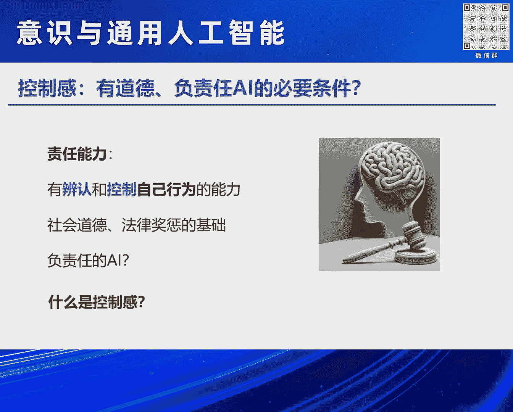
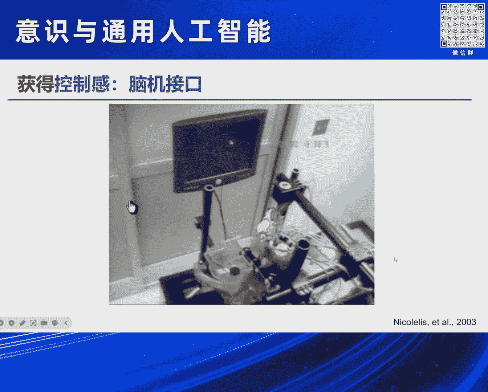
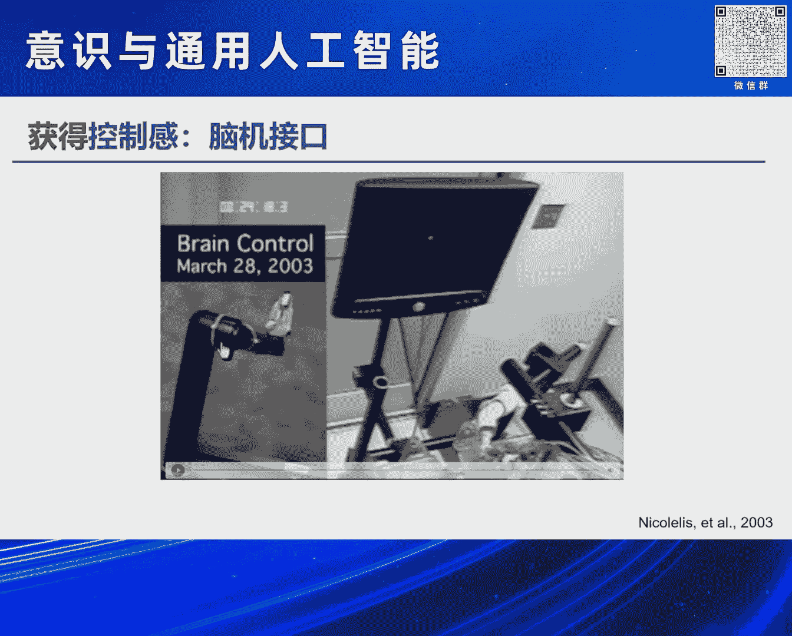
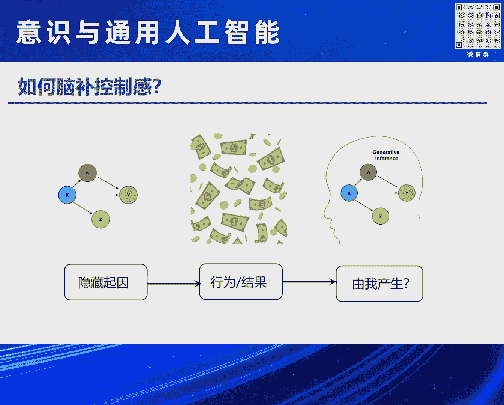
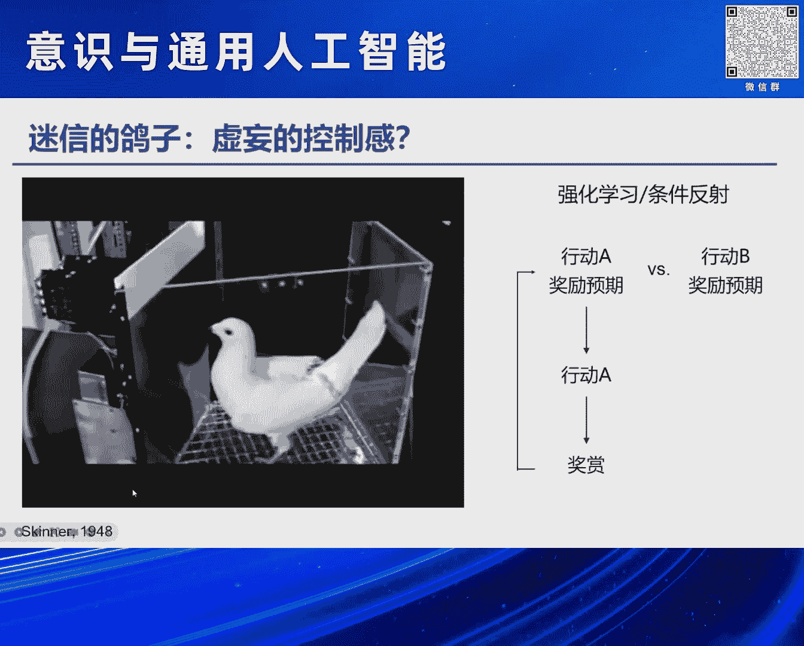

# 2024北京智源大会-意识与通用人工智能 - P4：可计算的自控感-主讲嘉宾：朱露莎、提问嘉宾：吴思 - 智源社区 - BV11b421H7JY

OK 谢谢大家，然后我今天要讲的题目是，可计算的控制感，那什么是控制感呢，给大家举一个例子，Imagine你现在，回到家天黑了，房间一片漆黑，你伸出手去，非常习惯你要伸出手去按一下那个，电灯的开关。

这都是你每天做过很多很多次的工作，你不会有任何的感觉，但是，如果万一你伸出手向着熟悉的地方一摸，诶 那个开关不在那里，或者你还没有按到那个开关，那个灯突然之间亮了，或者你按下了那个开关。

结果那个灯没有亮，在那一瞬间，你大约会感到心中一惊，那这种一惊的感觉，其实就是我们控制感的丧失，虽然很多时候我们对，对于自己，control自己来做一些事情，说一些话并不一定有控制感。

但很多时候当这种控制，当我们这种非常流畅的和外部世界打交道的时候，出现了这种错误的时候，这种控制感的丧失，其实会带给我们一个警觉的信号，那我想说的这个控制感，它其实呢就是，我们有一个主观的意愿。

采取了一种行为或者行动，然后会导致一个外部结果，我们对它的一种感受，这种感受呢有的时候呢会叫做self-agency，也有些地方叫做controllability，或者还有一些其他的词汇。

我们在这里呢不做这种讨论，那简单地来说呢就像，凯撒说的我来我见我征服，它描述的是一种人类，也许是人类独有也许不是的一种主观的感受，这种感受是，我们知道我们自己在做什么。

我们知道我们自己做的这件事它的后果是什么，而这样一种对于外部世界，对于自己行为的一种控制，其实是我们的自由意志，和我们的意识的一个重要的基础，那给大家看一个例子。

在这个例子里其实跟刚才的隋老师讲的有一丢丢的关系，这是我经常给本科生上课的时候，我们在课上会做的一个演示，在这个演示里面呢，如果你想自己把自己的手抬起来，事实上你大脑的运动皮层，会要发出一个指令。

这个指令呢会通过我们的这个脊髓，然后传递到我们的胳膊，所以呢如果我们在胳膊上贴上这么一个电极，它其实会截取到我们这样子一个，从大脑传递过来的电信号，我们把这个电信号呢通过一个放大器放大了以后。

这个电信号呢会操纵一个机器臂，使得这个机器臂也发生运动，大家可以看一看，这个旁边的机器臂跟着一起动，如果现在声音太小，不然你还可以听到这个机器臂运动的声音，但是在另外一个情况下。

我现在呢请另外一个同学把，把这个同学的胳膊抬一抬，所以呢胳膊仍然举起了，但是呢并不是它自己自主的运动，而是由别人产生的运动，我们可以看到这个时候其实它的运动皮层，并不会散发这种指令。

因此呢我们也不会从它的胳膊上，截取到任何的电信号，这个时候呢这个机器臂，也不会做出任何的运动，这个例子呢事实上就告诉我们，我们这种自主产生的运动，和仅仅只是我们的胳膊抬起来，其实它们在生理上。

在神经系统上是有fundamental的区别的，而我们人类其实可能可以不依赖于，一个机器，我们看到这个机器臂有没有动，我们就能够感受到，能够判断到这个运动是我自主产生的，而且不仅是运动。

我能判断到某一句话某一个想法，我能够抑制我的本能我的情绪等等等等，这些都是我们的自主控制，那为什么我在今天这个会上要谈这个问题呢，一个很重要的一个原因是我们猜想，建立一个有自主控制能力的人工智能。

可能是建立一个有社会道德负责任的AI的，一个必要条件，那在法律上有一个概念叫做，刑事责任能力，它指的是一个要为自己行为负责的自然人，必须要有能够辨认，能够控制自己行为的能力。

否则这个人不需要为自己的行为承担法律责任，这是为什么儿童很小的孩子，他们不需要负法律责任，为什么有些精神疾病患者不需要负法律责任，为什么有时候你的大脑里长了一个肿瘤。

然后这个肿瘤损害了你的这种控制的能力，这个人也不需要负法律责任，这是为什么有的时候我们被教唆犯罪，被命令犯罪，我们的责任比较小，但是那个教唆犯，那个命令犯，他的责任比较大，这也是为什么有的时候。

我可能因为一个无心之举，比如说我不由自主地打了一个喷嚏，造成了一场悲剧，在这种情况下可能我受到了社会谴责，道德谴责比较小，而如果是我故意地蓄意地去做一件事，可能我的谴责会比较大，因此我们想说的是。

这种我自己能够意识到的，对自己行为的一种控制感，它是所有的社会责任，道德，法律的基础，没有这种自控感，所有的奖励，惩罚都失去了意义，那如果有一天我们要建立一个，能够具有社会责任的AI。

也许仅仅只是对其AI的奖励系统，和人类的奖励系统，让它知道人类喜欢什么和不喜欢什么，可能是不完全够的，我们可能还需要这个系统，它能够把自己的行为和行为的后果，建立连接，这个时候我们才有可能。

给它带来一些和人类类似的道德感，那下面一个问题来了，这种自控感听起来是一个非常玄学的东西，就像我们刚才讨论的意识一样，那到底什么是控制感，我们能够测量它吗，能够在计算上实现它吗，首先我们想说一说。

那的确是有可能可以测量的，而且测量的结果是，这种自控感很有可能是一种脑补，这是心理学家一个非常经典的实验，在这个实验里面两个人，一个是参与实验的一个被试，另外其实是做实验的一个假被试。

他们两人一起面对面坐着，然后需要用手来控制鼠标，这个鼠标就会在电脑屏幕上移动，但其实当鼠标移动到，这个电脑屏幕的某一个地方的时候，其实这个鼠标并不是由这个被试在控制，而是由他坐在他对面的这个假被试。

他在操纵，但这个被试他需要判断说，是不是我的运动，使得这个鼠标在屏幕上发生运动了，我们发现事实上，如果这个假被试做出来的行为，和这个真被试是一样的时候，这个真被试其实很多时候，他自己会脑补说。

其实就是我的胳膊的运动，使得这个鼠标动起来了，事实上其实明明不是那样子，而这就说明说，我们看到了我们行为，我们看到一些结果是吧，这个鼠标在屏幕上运动，我们知道自己做出了行为选择，所以我们脑补说。

我们的行为造成了这个结果，那比这个例子更极端的例子是什么呢，那还有一些科学家让一个被试戴上手套，然后他的手可以做各种各样的手势，然后我并不会直接地看见我的手在做什么手势，而是通过一个镜子看屏幕上。

那个录像机录出来的我的手，实时地在做什么手势，可是有的时候我看到的其实不是我自己的手，而是这个屏幕播放的那个录像机在另一头，另外一个人戴了和我一模一样的手势，在做的一模一样的手势。

当这个手势比较复杂的时候，这个被试事实上是有相当的概率，会以为说，诶 我看到的其实明明不是我自己的手，但是我会认为那是我的手在做一些手势，而且当我们的大脑左侧的顶叶受伤的时候，这种错误会变得更加的明显。

所以在刚才我讲的这几个例子里面，我们说的其实都是一种叫做回顾性的控制感，什么意思呢，今天其实前面很多老师讲的东西都是一个前瞻性的，比如说我有一个主观意愿，所以我知道我要控制我的行为产生结果等等。

然后这种研究事实上也非常多，但是比较难以研究，所以我偷了一个来，我来把它转换成一个相对比较好研究的东西，那就是回顾性，也就是事实上当我们的大脑在看到我们做出了一个行为，产生了一个结果的时候。

大脑事实上会随时随地地问自己，说这个结果是不是到底由我产生的，是不是我操控了这个结果，那为什么我们要研究这种回顾性的控制感呢，有两个原因，第一个原因是这样子的一种控制感，它可以通过学习来获得。

可以使得我们建构一个更强大的控制能力，变成更强大的智能，第二个原因是这种控制感，它可以在计算上实现，那首先我们先说一说它为什么可以获得，那这里面的一个例子就是婴儿，这是一个UC Davis。

还是UCSD的一个实验室做的一个工作，他们研究的是婴儿怎么笑，那事实上婴儿刚刚开始笑的时候，其实只是一个反射性运动，一个reflex，大概是在六个星期左右，他们开始有社会性的微笑，然后更有意思的是。

在四个月左右，他们开始有策略性微笑，什么意思呢，也就是说在那个时候，那些科学家会研究说，当婴儿和母亲互动的时候，母亲和婴儿他们都什么时候开始笑，什么时候结束笑，然后发现一个很有意思的现象。

那就是当母亲的策略事实上是，我选择我开始和结束笑容的那个起始点，使得我和baby我们一起笑的时间越长越好，而婴儿其实不是这样子的，他选择开始和结束的起始点，是使得母亲对他笑的时间越长越好。

并不是我们俩一起笑的时间越长越好，所以你可以看到这个图上，这个图的灵点是妈妈在笑，而婴儿已经停止了微笑，那这个显示的是，婴儿在什么时候又会开始微笑，他并不会马上开始微笑，他会等等等，等到一两秒钟。

妈妈已经有可能会停止微笑的时候，他又笑起来，使得妈妈会维持他的微笑，这样使得妈妈对他笑的时间越长越好，而我们甚至也可以用这个策略，来建构一个仿生的机器人，然后用这个仿生的baby和母亲互动。

发现母亲的这个笑容的模式，和他面对真的婴儿的时候是一模一样，那这个例子就说明，我们可能可以具备一种能力，来控制我们的肌肉运动，从而能操控外边的世界，那除了对我们自身的操控以外。

事实上我们还会学习操控很多，不是我们自己身体一部分的东西，比如说工具，比如说脑机接口，那这个例子事实上是世界上最早的，第一例脑机接口，比Elon Musk不知道早多少年，这是20年前的工作。

这是每个Duke的科学家，他们在猴子身上实现的，所以大家现在看到这个显示屏，是一个显示屏，这猴子坐在这儿，他面对着这个显示屏，这是他的大脑，他大脑上开了一个洞，插了很多的电极进去，这些电极可以实时记录。

这个猴子运动皮层的神经元的活动，然后这是这个猴子的胳膊，他的胳膊放到一个遥控器上，它可以遥控这个游戏杆，然后操控这个屏幕上的光标的移动，当这个光标要切过一些目标物体的时候，那这个游戏就玩赢了。

这个猴子就可以喝到好喝的果汁，所以这个猴子的工作其实还挺幸福的，他就每天坐在这儿玩电脑游戏，然后可以喝好喝的东西，我们可以看一看，所以大家可以看到他的胳膊在运动，你看这个东西它穿过那个大圆盘。

那就说明他胜利了，然后他就可以喝到果汁，所以他已经玩得非常非常熟悉了，他可以非常自如地操控这个游戏杆，这里面一个很有意思的事情，大家可能也都知道，做脑机接口的，我们就可以通过我们实时记录的这种神经。

运动皮层的神经活动的信号，来训练一个机器学习的算法，由此我们能够解码出这个猴子，这个时候他希望他的胳膊往哪个地方运动，然后我们可以把这样解码出来的一个机器学习的算法，就交给一个，诶，为什么不跳，对。

交给一个机器臂，然后呢，让这个机器臂来代替这个猴子，来操控这个游戏光标，然后呢使得他获得好喝的，但是这里面有一个trick，什么呢，那就是我们没有办法告诉猴子说，你现在不需要移动你自己的胳膊了。

你只需要想，你只需要用意念就够了，那猴子他有没有可能真的能够学习到，或者获得到这种控制感呢，那大家现在看到的情境呢，就是这个猴子获得了这个控制感，他把他的手放到这个操纵杆上，但是他没有移动。

他在用自己的意念控制这个机器臂，从而来实现了这样的一个操控，这说明一件什么事情，说明我们智能体，包括猴子在内，我们可以通过学习获得超越自身的，对假肢，对工具，甚至呢是对比如说运动员是吧。

对球拍对球等等等等的这种控制感，实现我们对外界更强大的这种控制能力，实现更强大的智能，那事实上这只猴子在几年以后呢，他们也就实现了说让这只猴子，他可以用意念操控，在日本大洋彼岸的另外一个。

比他高六倍的一个巨型的机器人，而且可以实时的实现，就实现了这种对外界的控制，那下面一个问题来了，既然这种控制感是可以学习和获得的，那我们到底是怎么样来获得这种控制感的呢。

那一个经典的神经科学里面的假说是，我们的大脑其实是一个时时刻刻在进行推理，预测和归因的这么一个机器，举这种视觉的例子来说，比如说现在呢我的眼睛看到了一个苹果，这个苹果其实是一些光线投射在我的。

一个二维的视网膜上，我这个视网膜上有些地方亮了，有些地方黑了，然后我的大脑需要通过我这个视网膜上，对光线的感知，来判断说我看到的到底是什么，那我们大脑到底是怎么做这件事的呢。

它大脑里面也许有一个生成模型，这个生成模型它需要想说，如果我看到的是一个苹果，我的视网膜上的感受是什么样子的，如果是一个橘子，它的感受又是什么样子的，通过来比较这种不同可能的因，它造成的这个果。

我们来推理出最有可能，我们看到的到底是苹果还是橘子，那与之类似的，这种脑补的控制感，它很有可能也是一个类似的一个归因的计算，我们看到了一些行为的结果，我们在大脑里面形成一个这样的生成模型。

来判断说这个因到底是不是我来产生的，比如说我获得了巨大的成功，得到了很多的金钱，我要判断说到底是运气好，如果我运气好，得到这么大成功的概率是多少，如果是我很努力，我得到这个成功的概率是多少。

由此来反推出，到底是不是由我产生的这样的结果。

OK，那下面一个问题就是，这样子的一种归因的计算，事实上它有时候会产生一些错误。

会带来一些问题，这里面举一个很简单的一个例子，这个是一个非常非常有名的心理学家叫斯金纳。

他研究鸽子的条件反射。

具体来说鸽子它只会搓一搓刚才一个按键。

搓几下以后，这个箱子里面就会掉下来一个好吃的，所以鸽子就迅速地会学会说，我搓这个箱子就会带来好吃的，斯金纳做了一件什么事呢，他紧接着他马上就让这个箱子随机地掉好吃的。

换言之就是对鸽子来说就是天上掉的鲜饼，所以这个鸽子它需要做的事情是啥都不干，就坐在那儿等，等着天上掉下来好吃的，它就去吃就好，可是鸽子并没有学会这件事情，鸽子做的呢是它不停地去搓那个门，不停地去搓。

有的时候掉下来好吃的，它以为是自己操控的那个门得到了好吃的，所以它会继续去吃那个好吃的，然后继续去敲这个门，从强化学习的角度，这其实是一个非常非常奇怪的现象，因为在强化学习里面。

比如说这个鸽子要决定说我要不要搓这个门，如果呢我如果决定要搓，可能是认为我觉得它带给我的奖励，比我不去搓那个门带给我的奖励去更高，所以我采用了搓这个门的行为，可是如果我现在发现我搓好多次。

我都没有得到奖励，这个时候我就会调整我的预期，觉得搓这个门其实没有什么好处，以后呢我就不会再会搓这个门了，可是为什么这个鸽子不会做这件事情，但相反会形成一种虚妄的控制感，产生一只迷信的鸽子呢。

迷信说只要搓门它就会有好吃的呢，一种可能是在我们的这个大脑的这个归因系统里面，可能有一些系统性的算法会带来这个现象，一个可能是这样子的，比如说在前面的例子里面。

这个by the way这是斯坦福大学最近，这一两年特别特别红的一个一系列的工作，他们发了一堆science nature等等等等，那他们的这个工作想讲一个核心的观点，其实特别特别简单而且聪明。

他们想说的一件事是什么呢，在传统的强化学习里面，我们可能是conditional on我们的行为，然后来做一个推理或者是归因，比如说我搓了一下这个门，然后我有没有得到好吃的，可是在这个鸽子的世界里面。

因为它搓门特别特别的频繁，所以每次都要进行一个归因，对这个生物体来说非常非常的辛苦，那还有可能这个鸽子做的是另外一件事情，它其实并不是conditional on它搓了一下门，或者听到了一个声音。

而是conditional on它得到了一个奖励，所以当我得到了奖励的时候，我就往回去看，说我得到奖励之前我干嘛了，我搓门了，因此它就建立了这么样子的一个连接，而由这样子的一个连接，它可以来推理出。

因为我搓门会得到奖励的概率是很高的，所以我要继续地去搓这个门，在这里它想讲的一个故事是，我们的归因可能或者是这种获得自控感，可能会有一些系统性的算法里面的偏差，比如说我们的归因。

它可能是基于一个事件的相对稀疏性来进行的，我们可能会对那些相对来说发生了比较稀疏的事件，来进行一个归因，而这个可能会带来一些虚妄的控制感，这个结果事实上比如说在老鼠的实验里面，在多般神经元的层面。

都有一些比较强的证据，那大家下面可能还有一个问题是，你把这个控制感说成是归因好像有一点不对，因为这个控制感是一个关于自己的归因，是说某一件事情是由我自己造成的，而不是一般general的归因。

那这样子的一个关于自己的归因和general的归因，有一些什么样的区别呢，我看我还有没有时间，我就快速地讲一讲，事实上呢，那这个科学家也发现它有很多系统性的区别，比如说在这个。

这是机器学习的人都很熟悉的，Multi-armed Bandit Problem，就是有很多个老虎机，你要在这些老虎机里面，每个老虎机都对应着一些概率，然后呢他们的概率你是不知道的。

你的目标呢就是找到那个给你奖励最高的老虎机，一直玩，然后得到很多的钱，所以人们在做这种任务的时候，我们办法是什么呢，我们就是试错是吧，我们挑一挑看看哪个老虎机，它给我的奖励比较多。

然后呢我们在这个里面去做一些试错，可是呢我们发现，这个科学家们发现，人类有一个非常非常有意思的一个现象是什么，就是如果我挑了一个老虎机，它给了我很多的钱，我会觉得这是因为我挑到了那个正确的老虎机。

可是如果我挑了那个老虎机，它那一轮没有给我钱，我会把它，我会认为说我运气不好，这一轮正好呢是一个小概率事件，所以钱没有出来，换言之，当我们得到了奖励，我们会把它归因为我们自己，而我们没有得到奖励的时候。

我们可能把它归因为外界，而这个呢事实上呢，可能说明了这种关于自我的归因，和Gemini一般性的归因，它有一些系统性的偏差，可能也可以解释很多社会上大家看到的一些现象，比如说某些，富二代啊等等。

他们会说我取得今天的成果是因为我非常非常的努力，可是呢还有很多人在旁观者的立场上会说，你是在电梯里面做俯卧撑，是吧，你升得很高可能是因为那个电梯的原因，而并不是你在做俯卧撑的原因，而从另外一个角度。

事实上科学家也发现，比如说抑郁症患者，他们的这样子一个归因的情况，可能跟刚才是反过来的，他们发现，我得到了我没有得到奖励，他们会觉得那是因为我没有挑到一个正确的老虎机，而我得到了奖励。

他们会觉得可能只是我运气很好罢了，而那个精神分裂症的患者，他们在这种归因上，更是有一个系统性的和正常人的偏差，说明这种关于自我的和关于一般性的归因，他们其实是有我们的神经系统在进行系统性的计算。

OK我最后小结一下，那这个，Vagenstein，他有一个非常非常有名的问题，他的问题是说，如果我把我的手胳膊被抬起来，和我举起了我的手，这两个事情之间有什么区别。

那我们猜测他们的区别可能就是所谓的自我控制感，我们想说这个自我控制感可以通过学习来获得，使得智能体变得更加的强大，可以控制外部的世界，甚至可以控制社会和虚拟的社会。

并且这种自我控制感可以通过归因的算法来实现，在人类 在动物，甚至在人工智能里面，它都是一个可以实现的东西，而实现这种自我控制感，它有可能是我们道德和责任的基础，然而在另外一个方面，至少在生物智能里面。

我们发现这种自我控制感的实现，它有可能存在着系统性的偏差，比如给予吸塑性的归因，或者自我和非自我的不对称的归因等等，那这又引发了新的问题，如果有一天我们希望人工智能有这样子的一个自我控制感。

我们希望它和人类有一样的偏差，还是不一样的偏差，还是它本身就会带来它天然的其他的偏差，这些就是我要讲的内容。

