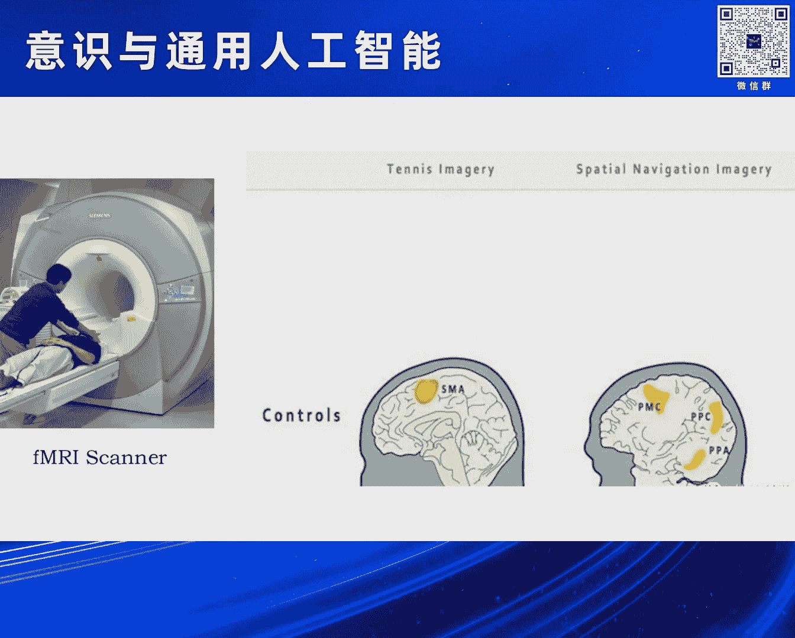
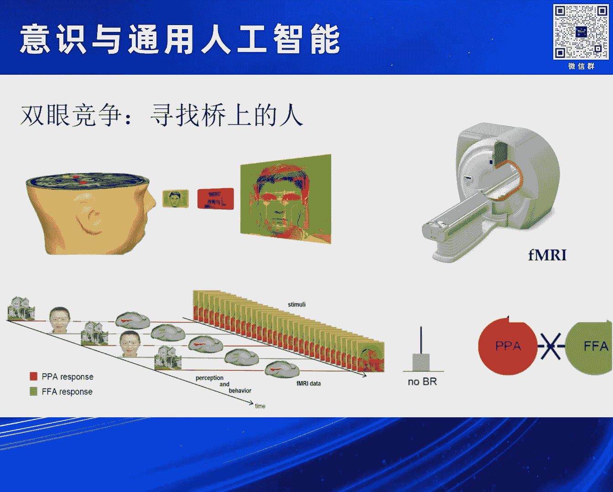
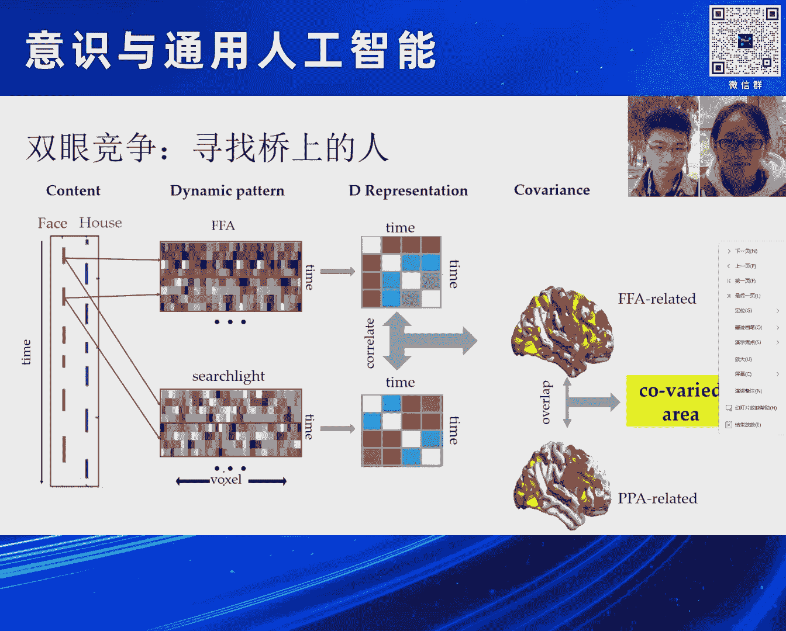
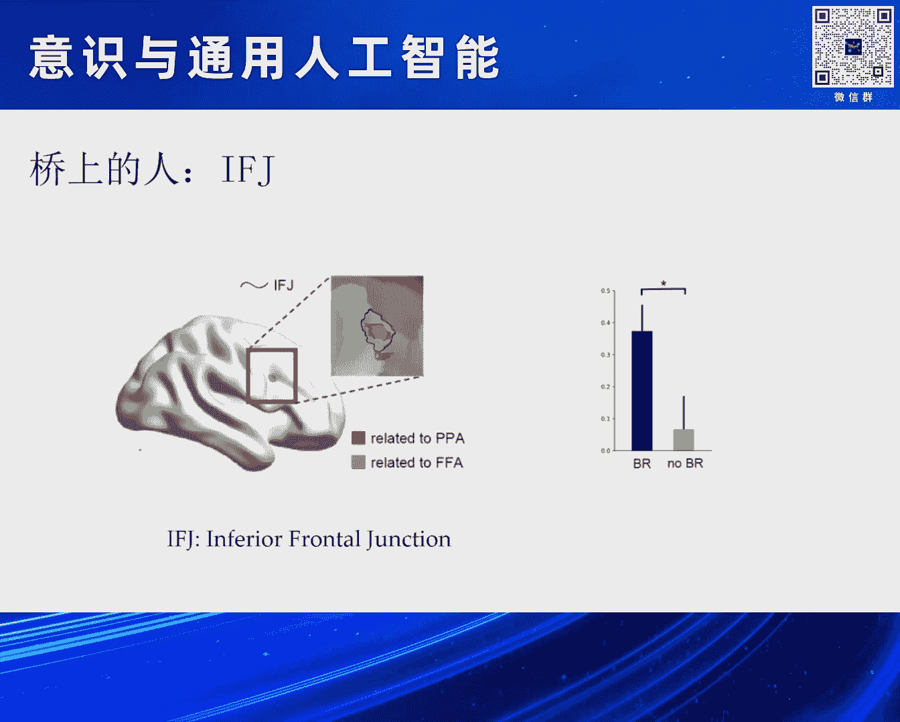
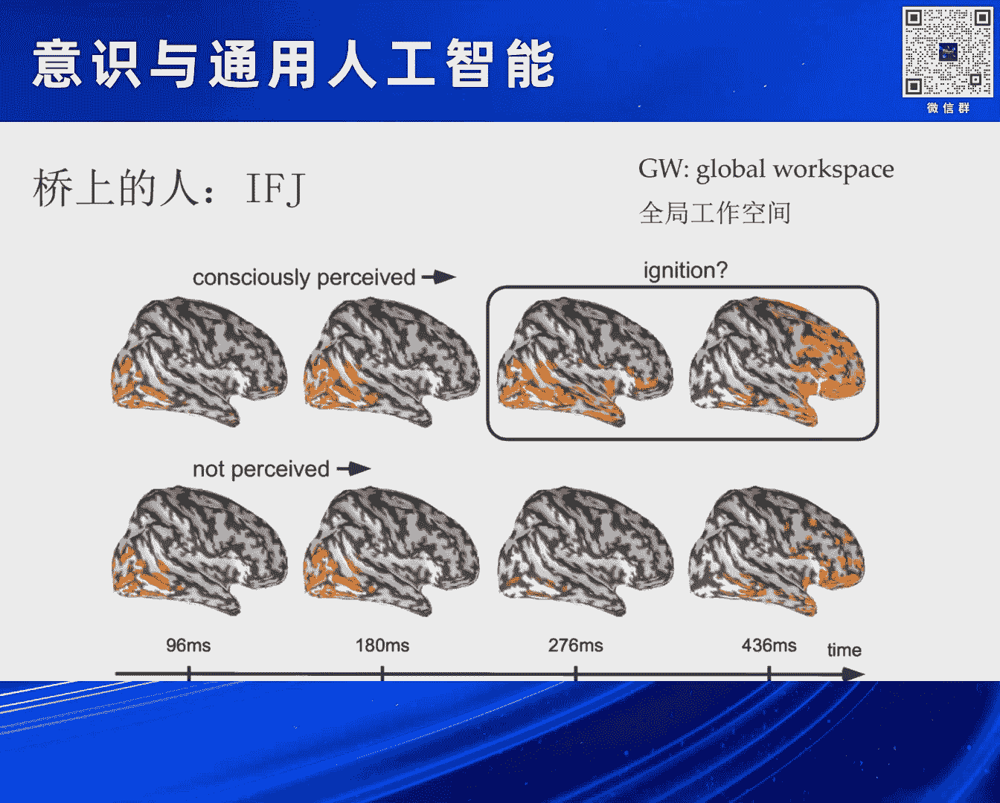
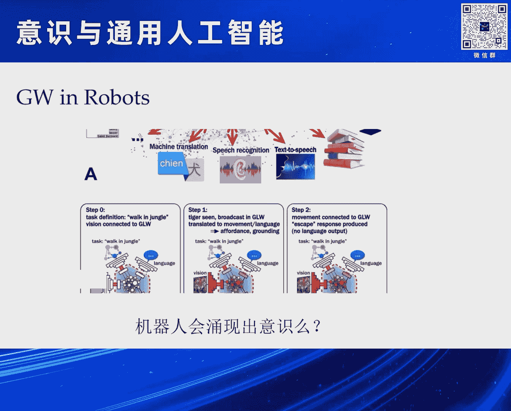

# 2024北京智源大会-意识与通用人工智能 - P1：意识是通向AGI的必由之路-主讲-嘉宾：刘 嘉 、提问嘉宾：罗欢 - 智源社区 - BV11b421H7JY

非常高兴又参加我们每年一度的那个自圆大会。

就像我们刚才主持人李后明老师所说的一样，很多时候来就是，当你面对通用人工智能的事儿，你谈未来通常你所讲的东西就是一个笑话，这是我去年讲的一个笑话，但是换一个角度上来讲，人有一种很奇怪的特质。

他总是希望去看未来究竟会发生什么事情，因为当下我们是需要专注，但是像我们这一个大会，我们更多的想知道未来可能会发生什么事情，所以说今天我们就选了两个最著名的词，一个是在心理学领域最著名的词，那就是意识。

没有任何一个词比意识这个词更加底层，更加让人心动 更加迷人，同时我们在人工智能领域里面，我们选用了通用人工智能这个词，因为这个词在人工智能领域，没有任何东西比它更宏大，也没有任何东西比它更困难。

那我们今天试图把这两个东西，把它绑定在一起，我们来看看未来究竟发生什么事情，所以今天我和吴师老师讨论了之后，我们觉得要走得更远一点，把我们今天的这个报告，把它变得半科学半科幻。

我们来看看未来究竟可能会发生什么样的事情，因为我想只有当我们去畅想未来，以一个充满好奇的傻瓜去看未来的事，也许我们能看见一个和聪明人，专注当下的人所看见的未来是不一样的，所以今天呢我的分享题目就是。

意识是通向AGI通用人工智能的必由之路，其实我应该打个问号，但是后来想想既然都已经到了这步。

问号就不用打了，那么这是一个骑摩托车的人，他不小心出了车祸，头撞上了路边的马路牙齿，所以说你可以看到，他前额叶丢了很大的一块，那么丢了这么很大的一块之后，就出现了一个很大的问题。

他就进入了我们通常所说的植物人的一个状态，植物人有什么样的特点呢，第一个他能够进行能量的代谢，具有呼吸心跳血压等生理的这种活动，就像植物一样能活着，同时呢他有一些本能的神经反应。

但是他没有任何自主的行动，脑电波呢也呈现杂乱的状态，所以说我们给植物人一个清楚的定义叫什么呢，他现在是自我意识，他就已经丧失了，但是他大脑里面真的没有任何活动吗，还是只是他被囚禁在一个笼子里面。

无法和外界进行沟通，所以说心理学家呢，找到了一个非常聪明的方法，就是用持共症来研究，他们大脑究竟有没有活动，那比如说我们把在座的各位正常人放进去，我们会看到这么一个结果啊。

就是首先我说请你想象一下打网球，你不要告诉我任何东西，你躺在扫描仪里面，你想象一下你在打网球，这个时候你的运动辅助区，SMA就会让他兴奋，因为这块参与你的运动，当你想象运动的时候。

你大脑这块区域就会活动，说OK那现在不用想象打网球了，现在请你想象一下，你们家长什么样子，你们家然后有几间房子等等怎么样，这个时候你的与运动相关的区域，SMA就不会活动了，但是呢。

然后你的与场景加工的区域，比如说PPA等等这些区域就会活动，这个时候表示你在想象，那么现在一个很好玩的事情，就是我们在座每个人他的表现，但是我们把我们刚才所说的这个植物人，把他放进去了。

我们给他说请你想象一下打网球，他大脑会发生什么样的事情，虽然说他现在完全没法做出任何反应，我们给他说，你现在想象一下你们家像什么样子，那么这是有些植物人大脑的活动，他没法对外界做出任何反应。

你看他就像一个植物一样，但他大脑里面还在征讯你的指令，做出相应的反应，跟我们在座的人完全一模一样，这就带来一个很大的问题，为什么他大脑的功能还在正常的运作，但是他已经不能做出自主的反应。

到底意识和认知功能究竟是一个什么样的关系，那么哲学家做了一个非常恰当的比喻，就是一个非常漂亮的风景，河水在慢慢地流动，桥上站着两个人正在看着河水的运动，这就是我们主观感受和意识之间的关系。

也就是说即使我们处于，只要不是太严重的植物状态，那么我们的河流依然流动，这个河流代表是我们大脑对外部信息的一个加工，它在不停地流淌之中，而我们的意识就是桥上这些人，看着这个河流，他对这个流动河流的观察。

所以哲学家约翰诺克说了这么一句非常著名的话，他说意识是对心中经过自恋的感知，那么经过自恋就是这个流动的溪水，而这个感知就是在桥上的人，那我们刚才的植物人发生了什么事情呢，河流依然在流动。

它可以照样对外部的声音做出相应的反应，但是桥上的人不知道去哪里了，那然后我们实验室就用了一个非常简单的方式来研究，桥上的人究竟在什么地方，那么这是在心理学研究里面一个非常经典的方式，叫做双眼竞争。

那么它把一个红色的房子和一个绿色的脸叠加在一起，那么这时候给你戴上一个眼镜，这只眼镜只能让红光通过，这只眼镜只能让绿光通过，也就是说你左眼看见的是房屋，右眼看见的是脸。

那么这个时候呢把你放到扫描仪里面去，那么请问你现在能同时看见脸和房子吗，答案是不能，因为左眼进去的脸和右眼进去的房屋，它们会竞争，最终你只能看见一个图形，同时呢这个图形它两者之间会切换。

一会儿你看见一张脸，一会儿你看见一张房屋，但是你绝对不会同时看见脸和房屋，来回地这么一个切换，这叫双眼竞争，这是一个非常经典的方式，还是按照刚才的方式，我们把它送到scanner里面去。

然后我们来看它大脑究竟怎么活动，那么这个时候呢我们就可以看见它的这么一个波动，那么就是你可以看见，FF和PPA这两个脑区啊，它在来回地切换，FF呢就是与面孔加工有关系，而PPA呢。

嗯 怎么回不去了，而PPA呢就是与房屋有关系，所以说当你看到面孔的时候，FF然后与面孔加工有关会亮，当你看见房屋与PPA有关的区域会亮，它来回地切换，抱歉啊因为考到一个新的图上面去，它的PPT有点乱。

嗯 新的计算机上面去，没关系 大家可以看一下，那我们怎么去了解呢，我们就很简单，当你看见面孔的时候，我们用红色标示，我把每一段你看见面孔取出来，我把时间串成一串，我来得一个关于时间的这么一个表征矩阵。

同时呢我去满脑袋搜，我去每一个脑袋搜，我看哪一个波动的时间的这种pattern，和我面孔变化的这种模式是一样的，那么这样呢我就可以得到一个脑区，这个脑区呢就是，只要我PPA怎么活动，它也跟着同样活动。

同样的我可以把房屋里出现的事，我把这个脑区的时间模式把它提取出来，我拿来然后和整个大脑再搜一遍，我看哪些脑区和这个房屋的时间的模式，它是一样的，抱歉啊这个具体的细节我就不讲了。

大家知道一个大概意思就可以了，那么这个时候我把这两个脑区叠加在一起，我看它有没有一个，当你看见面孔的时候，我和你面孔保持同步这种波动，当你看见房屋的时候，我和你房屋开始同步的波动，那我们找到了这个脑区。

我们找到这个脑区，这个脑区在那个就是，Inferior Frontal Junction，它会弹出一些安全提示警告，在这个脑区里面，它很神奇，它是当你看见面孔的时候，它和你面孔保持时间的同步。

以同样的模式运行，而当你看见房屋的时候，它又转头和房屋一块来运行，它是在我们前额叶所在的一个地方，而且这个脑区特别的神奇，仅仅只有在双眼竞争的时候，它会出现同步，当你单独给它看见面孔。

再单独给它看见房屋的时候，这个脑区和FFA和PPA，这两个视觉区域，它不会存在任何一个同步的状态，那么也就是说，它参与了我们面孔和房屋的主观感知，那么这个时候呢，我们就其实和以前。

一个MEG的一个著名的研究，其实保持了一致，它是一个什么结果呢，当你看见一幅图的时候，记住你看到了这幅图，进入了你的意识，它先是视觉区域活动，X轴是时间，然后它就像火一样，慢慢传输到我们的前额叶。

到前面就开始亮起来，就跟点火一样，前额叶开始亮起来，我就看见这个图了，但是如果假设我这幅图呈现得非常快，你没有看见，但是你看到了，但是没有看见，这个时候呢，你就可以看到，只是视觉皮层会亮。

但是前额叶就不会亮，这个结果就表明，前额叶它对于我们意识加工，是非常一致的，当然了基于这个结果呢，我们就可以对桥上这个人，做一个建模，它就是让一个这种，动态交替的过程，那么桥上的这个人。

它是怎么来转换的呢，我们就设立了一个，动力学的一个模型，那么我们用了一个，就是Steamergy，就是一个共识，协同性还是什么之类的，共识论里面的一个概念，那么然后我们来模仿，前额叶它得到了。

然后FF的输入，得到了PPA的输入，它怎么来，因为时间关系，我就不讲这个细节，那么同样的，我们对于FF和PPA，我们也可以同样地进行建模，这里面在FF有个很重要的，就是它自己有一个。

就是adaptation，它内部有一个内场的变化，那么这样我们就可以，对意识建立一个公式，那么在后面呢，朱禄沙老师和吴时老师，都会对，到底我们的意识可计算，还是不可计算，然后做出一个讨论。

那么这里呢我然后就是，暂时站在可计算的这个角度，我们就可以来做这件事情，那么最后我们得到的结果就是，然后一个大脑里面，一个场的这么一个分布，当开始的时候，它是处于一个安点上面。

当你一旦开始发生变化的时候，它就可以滑向，其中的一个吸引值，当吸引值呆一段时间之后，它又会滑向另外一个吸引值，它在这个场里面来回地波动，所以这个时候你就可以，在我们这个简单的模型里面，你可以看到。

对于面孔和对于房屋，这两个状态的一个切换，而这个切换，它让这么一个分布，和我们在人身上观察的分布，是完全类似的，那么这个时候，我们就是得到了一个，IFG这个区域，大家会问，IFG这个和通用人工智能。

到底有啥关系，你对吗 你在讲意识，你在讲这所有的一切，其实我们可以看这么一件，很简单的事情啊，我们还是回到刚才那个，很不幸的投掷上，被撞了一个大坑的哥们儿，你可以看到，它的功能都还在。

它能够想象我在打网球，我能够想象在做房屋，我的每一个功能，都是齐全的，但是它什么地方出了问题呢，它让每个功能都在，但是它没有把它整合在一起，这就是关于意识的，一个非常重要的假设，就是假设理论。

叫做全局工作空间，也就是说你每一部分，你每一个特殊功能，你都可以玩好，但是我们要形成意识，需要这些功能，一块到某个地方来进行交流，就像我们一个公司一样，我们到时候你是销售部门，你是生产部门。

你是什么部门，最终大家要坐在一起来聊个天，这样公司上才能正常地运作下去，而不是生产部门，只负责生产就可以，大家一定要到一个地方来交流，这个交流的地方，就被称为Global Workspace。

而然后一种假设是，当这个Global Workspace，受到损伤了之后，它可能就不能再去产生意识，但是各个独立的模块还是OK的，简直太恐怖了，那个然后就是，anyway然后就是。

我也不知道为什么会出现这样子，那么然后这个时候，如果讲现在有搞人工智能的，就把这个模型，然后就开始用到，我们的机器人上面去，我们机器人要去抓，要去拿，要去走，要去听，要去做各种各样的事情，那么这个时候。

然后一个很重要的理念就是，我怎么把这些独立的功能，把它整合起来，让它像我们人一样，我可以一边喝水，一边聊天，我可以一边骑自行车，一边打手机，然后打电话，我可以然后干很多事情。

我能不能把这个Global Workspace，Building到我的机器人里面去，让我机器人能够变成一个，能够完成多项任务，能够协调完成，就像我们人一样的这种进行工作，那么这是让大家的一个努力。

但是这个努力，然后就会出现一个问题，因为Global Workspace，它与我们的意识有关系，当你试图在机器人里面，去模仿这件事情的时候，那么会不会机器人，它也会莫名其妙地，自涌现出意识出来呢。

这是一个问题，但是我今天想给大家提供一种猜想，这是的确有可能的，那么正是我们刚才主持人，李洪明老师提到的，那个GPT-4O，那么它的然后就是，它到现在为止还没有公布，它的然后一个架构。

但是大家一个普遍的猜测了，它是一个混合专家模型，就是它与我们传统的GPT-3，一个大模型不一样，它是有很多小模型，把它拼起来的，比如这个小模型，它更多的善于做推理，这个小模型，它更多的善于做语言理解。

这个小模型，更善于做其他什么事情，那么然后当我信息来到之后，我都输给这些小模型，让他们然后各自去处理，那么处理了之后，这些都把他们的工作，提交到一个什么地方呢，提交到一个Getting Network。

Getting Network，它要做一个判断，我究竟采信哪一个小模型的结果，来进行一个输出，那么这就是，然后那个就是混合专家模型，那么你看，这个模式和我们的。

刚才所讲的Global Workspace，是不是然后有同样类似的，这么一个功效 对吗，大家各干各的，最后然后我要统一一下，让大家进行一个交流，来干这件事情，但是这样干，它会产生意思吗，在2022年。

然后2月10号的时候，当时GPT-3，然后还没有正式，Chart GPT还没有正式发布，但是当时GPT-4，已经出了 已经练好了，当时它的GPT之父，Ilias Zkovor，当时就是在推特上面。

莫名其妙地就发了这么一段话，他说，我觉得现在的大的网络啊，大的神经网络，已经有了一丝一毫的意思，当这句话发出来之后，当时大家都笑话他，因为当时大家还没有见到Chart GPT。

更不用说后面的GPT-4了，所以大家就追问，你的脑袋是不是出了什么问题，他也没有再进一步地解释，那么现在回过头来看，是不是他当时感受了什么，那么在今年那个就是4月份，然后那个就是Hinton。

接受了一个采访，在那个来，当时主持人然后问他，说 然后把这段视频放一下，没声音啊，有任何的主观经验吗。

是的 我有，我觉得他们已经有了，主持人问他，说你认为现在的机器，已经有了主观感知吗，Subjective Experience，然后Hinton毫无犹豫，Yes， I do，我认为他已经有了。

所以说从这一点上来讲，我们然后那个意思，当你要去把各种模块，当你把各种特殊的任务，把它集合在一起，用一个Global Workspace，把它连接在一起的时候，也许它就会产生一个意想不到的。

一个Epiphenomenon的一个东西，那就是我们的所说的意思。

那么所以说你可以理解为什么，那个然后就是，SAMUltra会被，当时伊利亚发动政变啊，赶出，然后那个就是，那个OpenAI的公司，为什么，因为当时让大家意识到，这是一个很严重的问题，这就是当时超级对齐。

和有效加速之争，那么然后那个，伊利亚是Coverless，超级对齐，一定要把AI的这种观念，和我们人的这种观念，把它让对齐，你不要让成为人的工具，而不是让成为人的terminator。

而SAMUltra说，OK 这些东西不重要，我们先把这件事情推动起来，就说有了这个政变，但是我们知道后面的结局，就是SAMUltra王者归来，重新回到了OpenAI，而伊利亚是Coverless。

干什么去了呢，然后被迫离开了OpenAI这个公司，那么现在然后就是，我们又到了这么一个，关键的节点，我们然后试图在推动AGI的时候，我们让它向前发展的时候，那我们究竟未来，会变成什么样子，所以说这里呢。

我想借用，然后那个就是，马文明，这哥们现在已经去世了，但是当年他们是世人，在Dartmouth College，他们当时命名了AI这件事情，这可以标志为，AI的一个正式的诞生的日子，那么他当时在。

推动情感计算的时候，强调情绪的重要性的时候，他说了这句话，他说现在的问题，不是智能机器是否能拥有情感，而是不拥有情感的机器，是否能拥有智能，所以说他这句话就推动了。

Affective Computation，这个领域的一个极大的活动，那么现在我想用他这个句式，来表达一个观点，可能明年我们在这个时候，谈论这件事情的时候，可能李鸿明老师又会说，你看他们去年说了一件。

特别愚蠢的事情，但是我还是决定要把它说出来，因为有可能明年这个时候，机器已经拥有了意识，或者AGI已经实现了，这都是一切都是有可能的，到时候就不再是我们来发言，而是机器站在这儿发言。

那么我把这句话说到这儿，说现在的问题，不是AGI是否能拥有意识，而是不拥有意识的AI，是否能拥有通用智能，所以说我觉得现在，然后关于老科学和AGI的研究的，一个特别火的一个领域，或者一个热点。

就是我们应该去，勇敢地去理解意识，因为关于意识的定义究竟是什么，我们还不清楚，但是我觉得现在已经，我们迫在莫及，我们必须要去关注这个问题，因为我觉得这才代表了，未来的AGI，而不是我们现在再去调调模型。

再把参数增加一倍，因为这些东西它不重要，它只是一个工程上的问题，那么但是，当我们真的来面对这个问题的时候，我们有太多太多的问题了，除了我们刚才讲的，Global Workspace这个理论之外。

还有其他理论吗，它们对应的神经基础到底是什么，其实Global Workspace，它只是众多理论中间的，一朵小水花而已，我们的来自于北京大学，心理与政治科学院的罗欢老师，到时候会给大家分享一个主题。

就当认知神经科学，在争论意识问题的时候，它们究竟在争论什么样的问题，所以他会给大家一个overview，然后就是，关于意识这块理论的这些研究，我相信对大家有启发，罗欢老师刚才说，他昨天工作到凌晨两点。

把这种理论弄起来了，所以我觉得大家一定值得一听的，因为为什么他一定要工作到两点，因为他把最新的东西呈现在面前，那么这是第一个问题，第二个问题是，然后就是我们有了这个，然后就是这一套之后。

那么机器人它可能有意识吗，如果它有意识，它应该是通过什么方法来获得，它应该会是什么样的，那么来自于，然后就是清华大学航天航空学院的，那个就是隋亚兰教授，他会给大家讲，就构建巨身的意识，就是从机器人。

从它的肌肉，从它的控制，我们来看，是不是像少林寺的武功一样，自外向内 对吧，然后你先去练一身钢筋铁骨，然后你的意识就有了，就像你内功就开始有了，那么我们来看这一方面，究竟会是一个什么样的问题。

那么让我们谈到意识，然后因为意识有很多层次，从主观感受，然后一直到它的最高峰，就是我们的自由意志，Free will，那么然后裴多辉有句很著名的话，叫做，那个就是叫，生命诚可贵，爱情价更高，若为自由固。

二者皆可化，这个自由啊，不是我们说的freedom，而是free will，我们自由意志，我们按照自己的想法去做事，这是最重要的，那么这是我们人类最隐喻为豪的，那么让现在一个问题是，机器。

当时那个就是Hinton在讲，机器可以有subjective experience，对吗，这么一个问题，主观感受，但它能有自由意志吗，它能够让自己去控制这些东西，它的自控感究竟是什么样子。

那么来自于北京大学心理与认知学院的朱洛沙老师，然后会给我们讲，可计算的自控感，那么这个自控，self agency，那么就是提到的，我们刚才有我们的自由意志，它们有密切的关系，那我们的最后呢。

就是要从一个比较玄学的角度来讨论意识，什么是意识，你说了那么多意思，到底它在指什么样的东西，它是一种神学吗，是哲学吗，还究竟是一种科学，对不对，如果讲它是玄学的话，我们就不用去了解这些东西。

那么来自于北京大学心理与认知科学学院的吴时教授，会给大家讲一个问题，就是意识是可计算的吗，你看这就是显得比较玄学一点，打个问号，不像我这么坦诚啊，但是我们可以听到最后到底是什么样子。

那么这些问题只是我们列出来的一些非常小的问题，但是一些更重要的是，我们应该怎么办，对吧，面对这么复杂的东西，面对我们自己说不清道不明的意识，以及更加说不清道不明的AGI。

因为这两个东西到目前为止都是没有定义的，意识没有定义，AGI同样没有定义，那我们究竟应该怎么办，所以说我觉得到最后呢，我们一定要拿一个东西来对付这两个严重的问题，那就是我们的群体智能。

那么这就是我们最后的一个圆桌讨论，让大家可以敞开，让自己的心可以聊各种各样的东西，这就是我们说的，前面是半科学。

这就是在半科幻的部分，好 然后这个是我的报告。

谢谢各位。