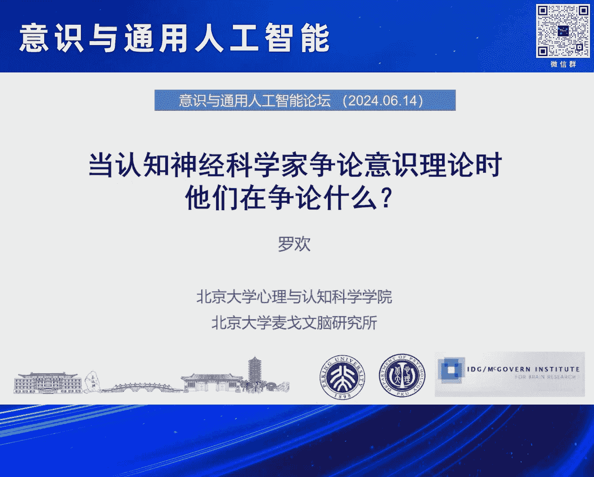
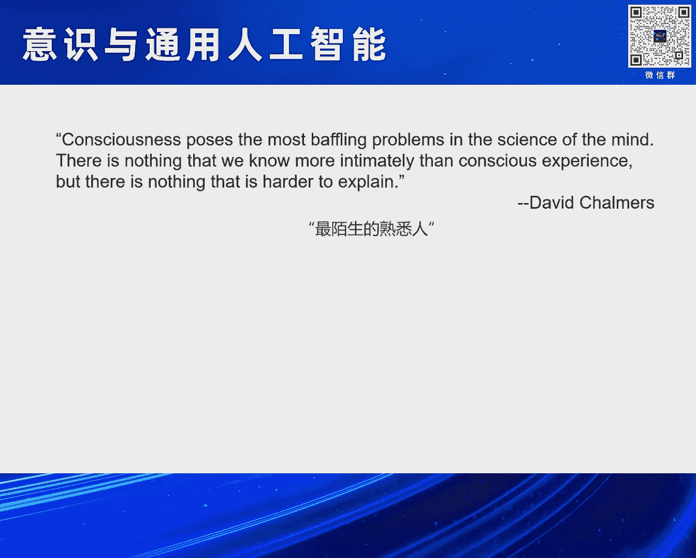
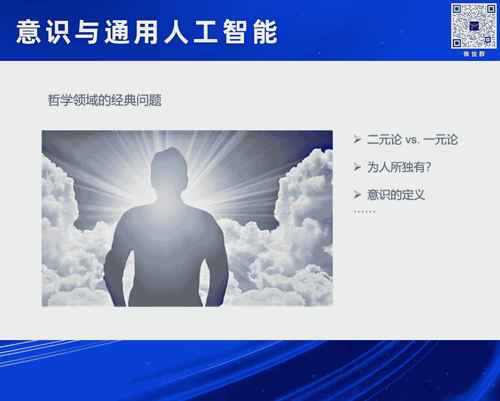
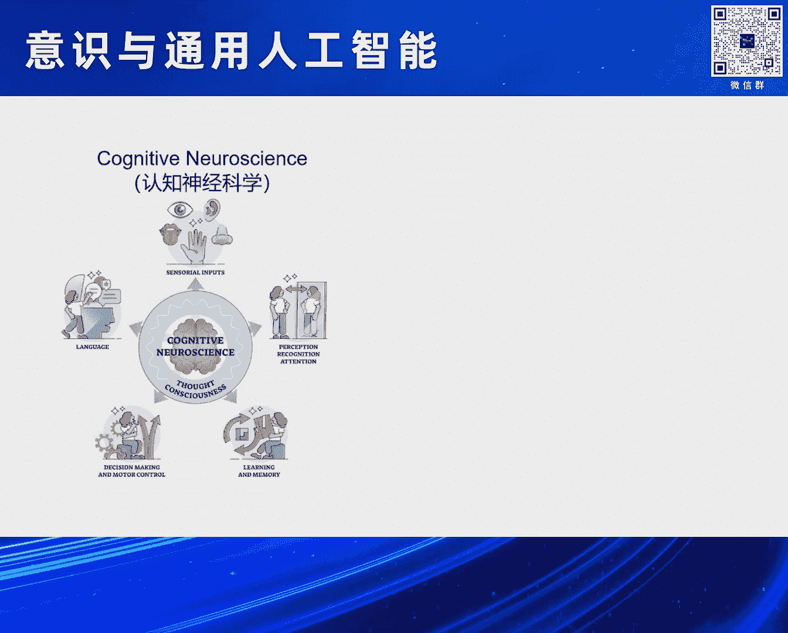

# 2024北京智源大会-意识与通用人工智能 - P2：当认知神经科学家争论意识理论时他们在争论什么？--主讲嘉宾：罗 欢、提问嘉宾：眭亚楠 - 智源社区 - BV11b421H7JY

各位下午好 听得见我说话吗，然后我非常荣幸参加这样一个论坛，我们这个symposing是刘佳老师组织的，然后她刚才也说了，我昨天晚上工作到凌晨两点钟，为什么呢，因为这个题目对我来说就是这个感觉。

我的脑袋的一片空白，并不是说我没有做过认知神经科学的研究，也不是说我对意识的神经机制一点都不了解，而是当我们面对这样一个问题的时候，所有的人都会有这样一种感受，就是意识一方面我们都知道它是什么。

觉得它很神秘，但另外一方面我们又不知道它是如何产生的，所以我想这样的一个一片空白的感觉是很正常的，然后我想引用一个著名的哲学家David Chalmers的一句话。

来进一步去为我刚才说的这句话来backup，那就是意识实际上是构成了我们关于心智科学中，最迷人的或者最困惑的一个问题，因为我们好像每个人都非常清晰地知道意识是什么，但是另外一方面呢。

它好像又是世界上最难去解释的一件事情，所以我把它总结为意识就是我们最陌生的熟悉人，我们每个人好像都知道它是什么，但是你又发现它非常地神秘，它如何发生，如果是作为一个，我猜在座可能有不同的背景。

但是我想你们都是喜欢科学的，不然你们也不会来听这样的一个报告，其实市面上有很多很多的书，这是我随便搜集的，有些书我看过 有些书我没有看过，比如说前一段时间去世的Daniel Dennett。

他是最著名的心智科学的哲学家，他活到应该是100岁左右，他写过大量关于意识的研究的书，他也是非常早期的这样的一些哲学家，去把心理学 生物学 进化论等等方式，来放到关于意识的这样一个思考中。

他有一个非常铁定的定律，就是认为意识是一定能够被解密的，它就是来自于我们的人脑这样的一个，或者是根据我们的进化史上，它背后是有物理基础的，当然它有很多的敌人。

然后第二本书就是David Chalmers，我刚刚提到的这个哲学家，后面两本书实际上是我今天可能想给大家分享的，他们都是认知神经科学家，他们关于意识的理解，当然最后一本书也非常有趣。

也是大家我猜都会想的问题，除了人其他的生物有吗，那个聪明的章鱼有没有意识，所以我只是放了一些书放在这里，有很多很多关于意识的书，所以我今天要跟大家分享的是什么呢，我想说的是意识是哲学领域的经典问题。

这个问题在哲学领域讨论了非常久非常久，因为它关乎到一个非常基本的问题，就是二元论和一元论的问题，笛卡尔认为我们的身体和我们的心灵是分开的，是二元的，所以我们理论上没有办法去回答意识这个问题。

但是一元论认为实际上我们的主观思维，是来自于我们这个物理器官的，那么这个是一元论，这个在哲学上是有很多很多的讨论的，还有就是说意识是不是为人所独有，包括意识的定义，这些都是哲学领域的经典问题。

或者换句话说其实我对它们的了解，是可能和大家很多中，或者甚至于比你们还少，但是另外一方面呢，科学家其实不是这样想的，科学家应该在30年前，没有哪个科学家敢说自己研究意识，大家知道是为什么吗。

因为科学家要显得非常serious，如果他30年前就说我研究意识，估计他也找不到工作，也拿不到基金，所以呢，因为当科学家研究意识的时候，他既然是科学家，他肯定不是二元论，他肯定是一元论。

所以主观体验如何从物质实际产生，今天大家坐在这里可能会觉得科学家有答案，但是我想30年前说，这个桌子或者这个东西能产生意识，没有人认为你是有科学的态度的 对吧，所以我觉得这是一个背景。

而且呢就算有科学家心里有这样的小火花 小种子，他也不敢说他要研究意识，为什么呢，因为我们在回答这个问题前，我们还需要解决更多基本的问题，那这些基本的问题是什么呢，首先我们要打好基础。

打好基础就是了解我们这个脑这样的一个物理器官，它能够做一些什么，比如说我们怎么看 怎么听 怎么学习 怎么记忆，怎么注意 怎么做决策 等等等等，还有包括我们怎么产生语言，我并不是说这些问题我们现在都知道。

但是相比意识，他们应该了解得越来越多，包括我自己的研究其实不是研究意识，我也是研究这些category部分的，这个里面的一部分而已，那这个领域我们把它叫认知神经科学。

认知神经科学实际上是神经科学和认知科学，认知心理学等等的结合，它的意思是去研究一些我们认知中的问题，但是我们研究的思路是，这个认知问题背后的脑基础是什么的，所以在这个方面经过这么多年的发展。

大家对于很多的认知功能越来越有了解，所以我们可以告诉你们说哪些脑区参与了什么，它们是怎么参与的 等等等等，OK 这是第一点，我们要打好基础，了解基本认知功能的脑基础，第二点就是我们肯定是要有工具的。

那我们需要发展很多的科学测量的工具，因为当我们说科学的时候，那其实就是不以我们的主要意志为转移的一些测量方式，其实脑电这里面有些技术很早，但是大部分的技术大概都是在近三四十年，三十年的左右发展起来的。

特别是功能词工阵的这样一种发展，它会使得认知神经科学达到了一个新的高度，如果你在一些科普书上或者公众号上，读到脑区负责什么，很多很多研究 特别是人的研究，都是在我们的实验设备上做出来的。

我们任何一个正常人都可以成为这些实验设备的受试，把你们塞到这个机器里面，让你们做一些认知的活动，刚才刘家老师也提过了，然后我们去测量你们的大脑活动，了解你大脑活动如何和你的各种认知任务有关。

比如说当你看到一个图片的时候，你大脑哪些脑去激活呀，我能不能从你大脑的活动里面去解码出你看到的东西呀，你的语言 你听到了一个语言它会激活什么样的脑区啊，等等等等。

所以这些就可以在正常人通过非侵入的方法就可以去进行研究，第二个就是行为测量方式的发展，当然这个发展的历史是比较久的，主要是来自于认知心理学，刚才正好刘家老师也讲了一个双眼竞争的范式。

可能大家经常会说所见，就是你看到的东西一定是真实的，但是大家想一想，如果你看到的东西都是真实的，魔术是如何发生的，所以我们经常会视而不见，这是生活中很正常的事情。

原因就是我们的大脑实际上是不断地在被动地接受外界的信息，但是实际上这些信息虽然在你的大脑中留下了很多的痕迹，包括视觉的 听觉的 嗅觉的等等，但它都没有上升到你的意识上，然后你没有觉得你看到过它。

甚至于你觉得你看到过它，可能你之后也不能记起来，所以换句话说，认知心理学发展了很多的测量方式，能够真的去测量你有没有看到，你看到的是什么 等等等等，当然最后一部分就是，这个和很多这个。

刚才正好刘家老师也说到了，就是医院里的一些病例，比如说我们人有不同的意识状态，比如大家现在如果听我的报告昏昏欲睡，你的意识状态也在降低 对吧，然后刚才提到了这个植物人。

那么医院 医生和这种认知神经科学家互相的合作呢，也可以开始让我们去了解，我们怎么知道他有没有意识，我们从外面看他好像是没有意识，但我们能不能通过一些方法来读取他的意识。

知道是不是还适合于对他进行进一步的治疗和拯救 等等等等，所以这一部分也是发展科学测量工具来帮助我们，那在这样的一个基础上，我们有了测量工具 有了行为的，有了非侵入脑成像工具 对吧。

有了各种各样的 大家开始感兴趣，我们还了解了我们人脑各个部分在做什么，等等等等，那么这个时候貌似就到了一个时机，就是可以研究意识问题了，因为意识我认为它是一种集大成者的皇冠问题。

意识既不是视觉 也不是听觉 也不是记忆 也不是决策，好像也不完全是自由意志，意识也不完全是大家经常听说的自我意识，意识好像是一种把人，就像一个小仙女的点睛棒一样，有了意识这个东西就显得特别智能。

所以它就成了一个大家现在讨论的很多的问题，之所以在这个moment可以讨论，就是因为前面的这些基础的奠基 对吧，就是我们从科幻小说里听到的，从我们的哲学思考里说到的，真的到了这么几十年来。

科学实验的累积和技术的进步，让我们到了这个关口可以去研究这个问题，但是是不是我们就知道呢，我的答案是肯定不是，因为真的还没有到那个地步，所以它实际上是一个frontiers，值得很多人去继续研究。

第二呢，就是原来的时候意识大家可能觉得是一个哲学问题，或者是一个心理学问题，但是呢现在呢有了很多很多学科的交叉和思路的涌现，比如说Daniel Tannet他早就把进化论的这种思维。

还有很多很多进行整合，然后认为这可以解释我们的意识，脑科学的进步包括现在人工智能技术的进步，还有复杂系统 还有数学，还有很多基础科学的这个发展，都让我们对于意识如何从大脑这样的一个，物质系统里产生。

有了更多的假设，我说的是假设和思路，所以这种多学科的交叉也可以帮助我们去理解意识问题，当然我觉得意识在这个时刻成为这个热点，还有一个最重要的原因，什么原因呢，就是Chad GPT的出现。

所有的人都开始觉得，天哪 这个东西看上去好聪明，好像有意识，所以大家不要问我这个问题，Chad GPT有意识吗，或者说每次我们一讲报告，第一个问题就是老师请问什么是意识，这个完全没有办法回答的问题。

所以说这个是人的一个很有趣的地方，就是你会隐约觉得它有意识，但你又说不清楚它到底有没有意识，但是这个问题就把我们意识研究的这样一个皇冠问题，进一步地推向了前沿，因为我们又有了另外一派。

就是它们完全不是基于生物 不是基于人脑，但是这个东西貌似有意识，所以我们如何去了解意识，意识是如何产生呢，这就更加地重要，它确实成为了近期的头条，今年据我不完全统计。

Nature上各种无论是观点性的文章，实验性的文章还是等等的文章，它关于意识的 特别是脑机制的研究，当然还有和大圆模型，还有和Chad GPT这个，也有很多很多不计其数，比如说这个是刚刚，你看是五月份。

这一期在《神经科学》的最顶级的期刊，《Neuron》上的一个专刊，专门就是讲意识，它邀请一些人来去对意识进行综述，然后也有一些文章，另外刘家老师之所以找我讲，也是因为有一个项目。

这个项目最近引起了很多的围观，这个项目大概是2020年开始，由美国的一个基金会支持的这么一个，其实钱不多，但是这个项目之所以现在大家讲得比较多，就是叫Cultivate项目。

我等会儿会给大家非常非常简单地介绍一下这个项目，这个项目就是在世界上找六个实验室，大家一起去测试意识的两个理论，然后我们实验室就是这六个实验室之一，所以我们这几年也在参与这样的一些项目。

这样的一个项目一旦出来了以后就进了头条好多次，比如说Science里面专门讲，哲学家和神经科学家，他们齐心协力一起来研究，我们能不能够把自由意志或者意识，这样的一个神经机制能搞清楚。

我们这个项目有两个实验，实验二在去年的Nature上，它也被评为了九大科学期待之一，和大家知道的超算，还有登月等等项目，所以说也许我们平时做的东西，我们会觉得没有那么重要。

但是看来这个问题在很多人的心中，大家都觉得是挺有趣的一个问题，好的 那么我们再回到这个题目，所以大家可以看出来我起的这个题目是有技巧的，我没有说当我们争论意识的时候我们在争论什么，这个问题太大。

我这里面有很多的限定语，首先是当认知神经科学家争论意识理论的时候，他们在争论什么，所以我们focus的是认知神经科学关于意识的理论，并不是意识的哲学讨论，另外我们强调的是它的争论。

也就是说这些不同的理论之间的相似或者是差别，他们如何去，就像两个人吵架，你如何说谁对谁错呢，这个事情到底有那么难吗，其实是挺难的一件事情，这里面就有四个点我想给大家highlight一下。

一方面就是认知神经科学的意识理论显然是一元论的，这里面是排斥二元论的，不是说二元论不对，但是当你放在认知神经科学这样的一个框架下，我们本来要研究的就是，意识的大部分的功能能不能用脑来解释。

如果它不能我们就继续研究，那么就给二元论留下一些空间，但是我们的这个出发点是一元论的，第二就是它基本上是基于一些人脑的发现，现在动物的研究不多。

因为动物有没有意识或者是不同level的consciousness，还是一个继续争论的问题，第三个特别强调，我不是讲我的理论，我也没有理论，我讲的是别人的理论，我给大家总结一下，所以我要是没有回答清楚。

我也OK，第四个就是可能，特别是对于不做科研的同学，不是老讲同学去了，不做科研的听众，你们经常会觉得说，这有什么好争论的，你拿出一个证据，谁对谁错不是一眼就很清楚吗，任何一个理论有那么多区别吗。

那是因为当你说一个理论的时候，比如说你说我这个发现支持了我的理论，但是有可能你的发现，能够被除意识以外的认知功能解释，那在你的同行里面，就会觉得你的结果不干净 不清晰，所以他们就会继续吵 继续吵。

所以这个就是吵架的一个源头，也是今天可能会给大家介绍一点点的，好的 我就，应该说我主要是想给大家讲三部分，主要是集中在第一部分，第二部分我会非常简单地过去，因为第二部分比较细节，第三部分我开始也没想讲。

但是如果有时间可以去讲，我们第一部分就是来给大家讲一讲，什么叫认知，就是认知神经科学的角度，如何去解释意识从脑中产生的，那其实这个是来源于，我刚才说过意识在哲学里一直是个很大的话题。

但是想用科学的办法去研究意识的脑机制，实际上大概1990年以后才发生，那它的主要的发起者呢，就是诺奖得主克里克，就是发现DNA结构的，以及这个克里克是现在意识领域的，他现在是美国艾勒研究所的所长。

然后他对意识的一直都非常感兴趣，当时你看还是非常非常年轻的一个小伙子，然后他们就提出来了这样一个hypothesis，这个hypothesis非常简单，就是他认为在人脑中会有一个。

最小的神经的这样的一个集群或者一种机制，他们就足够充分必要地能够解释任何的，产生意识的现象，比如说你看到了一只狗，假如你有狗这个体验，那么这一部分的NCC的这样，你可以把它想象成是一堆神经元的集群。

它们就会被激活，相反 如果你把这些NCC给打乱，那么这个关于狗的意识就会消失，非常非常简单，所以他就可以想象成他就认为，你大脑里有这么一小团的关于意识的神经的相关在那里，能够解释意识的发生。

他提出这个假设，但是他没有什么证据，那之后的研究就是在做，其实不同的理论呢，它是有不同的着重点的，我们也经常会去混淆，比如有的人是强调我意识的内容，比如当你想象一个，在一个麦田里傍晚的时候这种感受。

你想象的是去经历的这种意识感受，这个叫意识体验，但还有一种情况就是刚才讲的，睡觉或者是植物人他是意识的状态，所以意识分内容 意识也分状态，这是不同的理论的着重点，还有一部分就是说，有的人是认为。

其实也跟我刚才问刘家老师的问题有关，有的人认为这个意识它最重要的是体验，它是一种现象，换句话说你的意识是不依赖于你去报告的，就是你自己本身的一种意识体验就是意识。

但还有一些人认为意识它最重要的是它的功能，换句话说意识本身这个体验不重要，重要的是你如何把这些信息，把它放到你的注意力 放到你的记忆里，所以这些都是不大一样的。

这个地方有点confusing 大家不用管，我就非常简单地给大家解释一下四个现在比较主流的理论，就是关于意识的来自于脑的这个理论，大家可以看到这都是脑，所以他们其实就标记了他们怎么认为这个意识发生的。

然后这四个理论里面，其实那个项目里面主要测试的是那边两个理论，这边两个理论还没有被测试，有一些项目开始去测试，我们先来讲这两个没有完全进入热点的理论吧，一个理论它就认为它叫高阶理论，它是什么意思呢。

高阶理论其实非常有哲学含义的，它大概意思就是说比如说现在大家在听我说话，那其实你听到我说的这些话的声音，肯定是会进入你的大脑的听觉皮层被加工，然后你知道我在说什么，但是这不代表意识。

意识是把我说的这个话作为一种体验，变成一种高阶的我们叫matter level的这种表真，这种东西已经不同于你真实听见的 真实看见的，它是这样的一个思路，所以它就认为这样的一个你关于外界的。

物质世界的这样的一种高阶的体验，会表真在一个比较靠我们大脑前部的这个区域，而且它强调意识是独特的 为人所独有，它不认为动物有，它认为动物可以体验，但是动物不会产生这种高阶的意识表真，这是高阶理论。

还有一个理论其实我把这两个合并了，叫做载入和预测加工理论，那么这个大概是什么意思呢，就是我们这边是以视觉为例，我们都知道我们的视觉信息从我们的眼睛会进入我们的视皮层，我们的视皮层在哪呢。

大概就在我们的后脑勺这个位置 就是后面，然后这个地方的信息会沿着我们的视觉通路传，传到我们貌似更聪明的前面的前额叶这块，这个理论就是认为呢，我们对于外界信息的加工。

并不是一个简单的一个潜溃的这样一个过程，而是不断地在去预测外界，所以我们会有潜溃 有反馈，而你的意识体验呢并不是一次的事情，而是要信息进来，然后你经过后面的这个反馈，然后两个产生了一个闭合环路。

这样的一个过程才是一个产生意识的过程，这个也很好理解，比如说我刚才说了你经常生活中有很多东西视而不见，视而不见的意思是说这个信息在你面前，它已经进入了大脑，但是它没有在你经过加工返回回来。

没有完成这个一个闭环的话，它就不会进入你的意识，当然这里面还有很多很复杂的这个我就不去讲了，我现在就着重在讲两个，刚才刘家老师也提到过理论，因为这两个理论也和这个项目有关，第一个理论呢其实是很好理解的。

就是刚才刘老师说过的，叫全局工作空间理论，它是这个法国科学家Standard Hunt，其实还有其他的一些人一起提出来的，他的理论其实很简单，他就是说有点像我们现在这里。

假设我们这个屋子里的所有的人就是我们一个大脑，其实每个人都会有自己的一些小的功能模块，都会被激活，那什么叫意识呢，意识就像是我现在站在了这个聚光灯的下面，这个舞台我们把它称为全局工作空间。

就是global workspace，它就像大脑中间的一个剧场一样，所有的信息只有进入这个剧场，才能被广播给大家，换句话说现在我们听众中有人有一个想法，但你没有像我一样站在这儿。

那你的信息就没有广播给全脑，那你就不能上升到意识，但我不一样，因为现在我站在这个全局工作空间，我就可以把我的所有的信息广播给大家，这个东西一旦被广播出来，它就认为进入了意识，OK。

所以这个就是这个全局工作空间，所以我说它其实是最好理解的，就是它需要把信息在你的前额页被点燃，然后进入了这个全局工作空间，广播给所有的人，那么所有的人都知道了，它就成为意识上。

如果你这个信息没有进入全局工作空间，那你只是残留在你那个地方，那它就没有进入意识，然后全局工作空间呢，我这边就写了一些非常简单的一些summary，就是它强调这个前额页很重要。

任何进入意识的信息都必须在前额页被点燃，如果没有被点燃，它就不能被进入意识，OK，好 这个就是全局工作空间的理论，然后呢这个另外一个理论呢，和它相对的，也是我们这次测试的呢，叫做整合信息理论。

这个理论呢实际上是最复杂的一个理论，这个理论呢实际上，它是来源于物理学家的一些思考，它呢刚才那个是在讲，我怎么样进入全局工作空间，我来解释一下什么意思，首先它是注重现象意识，就是你不用报告，就换句话说。

当我看到了一个东西，我的体验是什么的，它认为什么叫意识体验呢，首先它是必须要有信息的，比如现在大家就有一种意识体验，它认为它有信息的，另外它有整合的，整合的意思就是说，你的意识不是破碎的分离的。

而是一个整合的东西，你现在回想一下，你现在的意识体验是不是整合的，确实是整合的，然后这种整合又可以区别于其他，它在这样的定义系统下呢，它就去找一种物理的结构，能不能解释这种信息整合，OK。

然后它的一个最重要的假设就是认为，我们的意识是来自于，这个神经元网络本身的复杂特性，就是这些神经元和神经元之间的连接，包括它突出地址的这样的一个传递和调控，然后这样的一个抽象的神经元形成的集群呢。

它们如果具有某些特性的话，这里的特性就叫causal effect structure，意思就是说，它们之间的关系是很复杂的，可以涌现出一些特性，当这个特性达到一定程度的时候，它就可以自然地涌现意识。

大家看到没有，这里面隐含了一个假设是，你不用去问它有没有意识，只要它的结构具备了，它就有产生意识的可能性，OK，这是非常非常不同于前面的，前面类似于你要去报告，对吧，这里说不是的。

比如说还是刚才那个剧场，就假设我们这边的桌椅形成了一种非常复杂的结构网络的话，即使你们不用走到这个前台上来，你也可以产生意识，所以这个理论跟刚才那个理论是有特别大区别的。

那么这个理论非常难测试的原因就是，如果你想测试一个系统的这样的一个，它们叫causal effect structure的这个值，他们把它叫Phi，它需要大量的测试，它需要去扰动。

而且可能两个一起扰动 三个一起扰动，再去观察它的扰动效果，最后根据这个计算这个复杂系统的这个程度，通过这个程度来测量这个结构，所以它在实验上是非常难操作的，但是它有一个假设就是它发现人脑的后部的脑区。

特别是顶页的这些结构，它有很多层级的反馈的很多的结构，他们认为这个结构是非常具有高复杂度的，所以他们认为意识不依赖于前面的脑区，而是应该产生于后面的脑区，所以这就是这两个理论最大的区别。

前面一个理论认为我们的前部的脑区很重要，这个理论认为后部的脑区很重要，前面的认为意识要进入全局工作空间，后面认为意识不需要被报告，它在后面这个结构中就会自发地涌现，所以我把这四个理论讲完了以后呢。

我再给大家总结一下这个特点，后面那个项目我就会非常简单地过了，就是这个全局工作空间呢，它其实在证据支持上是非常非常之多的，有很多的研究都支持它，但是呢 大家最大的批评就认为。

这个全局工作空间和我们很多认知过程都会混淆，比如它可能跟工作记忆有关，跟注意有关 跟报告有关 跟很多有关，所以它好像不是一个很纯粹的意识现象，那么IT呢，它虽然避免了这个问题，但是它太理论了。

然后比较难解释，而且它也很难去测量，就变得貌似不可证伪一样，所以它也是一个被诟病的这么一个理论，那这个我们参加的这个Quality的Project。

其实就是测试这两个理论，大家可能会说，那你们是不是测试出来结果了呢，所以我会非常简单的，理论很复杂，在生活中 在实验中是非常骨感的，这个我们只要做科研的人都知道这一点，然后这个项目它的初衷呢。

就是右边的这幅图来解释，就是科学家当有一个理论的时候，他往往会有一种confirmation bias，他会在这个世界上寻找证据来支持他自己，然后他就会形成这种信息检防。

就是每个人就在自己的这个圈里面找，你的证据支持我，好 我们是朋友，我们俩就扩大，你的证据不支持我，我就不跟你讨论，或者我觉得你的实验设计有问题，所以这样的confirmation bias。

就导致很多理论互相之间没有办法talk，所以这个项目呢，就是也是这个Kalk他们等等能提出来的，他们就希望变成一个对抗性的 合作性的，由六个实验室独立的去验证的这样的一个项目。

那这个项目呢，我就非常快的过了，我们把它叫quartet的项目，他强调team science，由世界上六个实验室独立的采集数据完成，他强调预注册，预注册就是在你做实验之前，先把你的假设给出来。

放在网上，你不能再偷偷地改假设，OK，然后呢，他是用了三种模态的技术，包括功能词公证，脑词脑电和一种颅内脑电的技术，我们就是负责这个脑词这部分的，还有呢，他是标准的一个模式，他是标准化这个实验分析的。

就是你在做实验，在发布数据之前，你的这个分析都要在网上share的，你不能说我自己去developing一些，我再调调参，不行，然后呢，他会把big data在发布以后，全世界的人们都可以去分析它。

然后他这个analysis code，比如可能有人说，我不会分析怎么办，那么这些分析的这个代码，也都会共享在网上，最后呢，我们实际上是先做出完了以后，再去replication另外一个。

导致就是可以去很多比较fair的，去做这样一件事情，你可以看到这个Cauchy的项目是非常大的，然后里面有一些postdoc，然后还有一些center PI，还有一些consultant等等。

但我特别想讲的是那个，正好刘琳也在，就是我们这个项目里面最主要的这个，真的是干活的人，就是现在在北京语言大学工作的刘琳博士，她是参与了这个项目从2020年到现在，包括收集数据分析数据和大家去交流等等。

在这个项目里面设计了两个实验，我的时间已经到了，但是anyway这个实验我不给大家解释了，因为解释完了大家就觉得没有意思了，如果你真的对科学感兴趣，其实这两个实验在网上都查得到，而且具体的这个细节。

就是因为在预注册的文件里都有。

然后呢在我们做实验之前，我们都会给假设，这个假设呢就会产生这样的图，比如说GNW他就认为有两个假设，这两个假设呢在实验一实验二里他发现什么，如果他比如说大家可以看到这两个绿的都发现了。

那就是表示pass了就表示他成功了，假如他有一个是红的表示他这个理论fail了，对吧如果是一个绿的一个黄的表示他有一些challenge，还有等等等等会把它全部列出来，这两个理论各自都会列出来。

那么最终呢你就把六个实验室的结果汇集起来，然后去测试这个东西，我把这些都去掉，因为这两个实验室focused on不同的这个方面，这些都非常的，我们直接看结果吧，我觉得大家也只想知道结果对不对。

ok我们来看一下结果，其实这幅图就是结果，这个还是很有趣的一个图，这个图呢其实就是把这两个理论各自的发现汇集完了以后，用绿和红来代表支持还是反对，如果纯绿就是代表完全支持，然后红色就是代表反对。

那大家通过这个图已经看出来了，哪个理论好像胜算高一点呢，是IIT对吧，GNW稍微弱一点，然后因此呢我一定要在这个，哪怕今天没有时间我一定要把这个讲完，原因就是因为大家看到这个图了以后。

你们的第一印象是什么，就会说啊我明白了，那个IIT赢了GNW输了，所以如果我们中间有很多媒体的朋友在，我特别想强调这一点，就是我们经常会非常简单的去解释一个结果，然后本来呢这个结果不是这样的。

但是我们会把它放大传播成一个理论赢了一个理论输了，就是因为这个结果就导致了一个最近一个非常严重的事情。

正好那个孙涛老师也在，就是有120忘了120几个科学家，联名写了一封信在去年的时候，来认为IIT这个理论是伪科学，然后当时那个科学报的那个孙涛老师记者还采访过我这个问题。

然后大家就说啊为什么IIT是伪科学，其实很简单，原因就是这个实验的发布貌似支持IIT，但是其实它只是支持IIT在这个实验中间提出的假设，它这个实验并没有去算IIT里面很核心的那些特别难的东西。

所以它其实只是部分知识，或者说我们需要在一定的约束下去解释这个理论，比如说这个实验并不能够完全支持IIT里面最核心的假设呀，这个实验也不能够完全被解释成IIT赢了呀。

总之我觉得这个地方是一个非常非常重要的一个point，不是说IIT赢了，而是在说在给出这几个假设中IIT的证据更多而已，OK最后我总结一下就是说，意识这样的一个问题呢。

大家都我说了他是一个最陌生的熟悉人，那么通过这几十年认知神经科学的发展，我们感觉我们已经到了一个地步，可以去慢慢地回答这个问题，我也希望我今天说的在明年的时候不是被打脸，但是我觉得好像应该永远都是对的。

我不觉得明年咱意识问题能解决是肯定解决不了的，但是我们可以有多学科的交叉，多学科的角度对意识理解的革命能够去帮助我们，好的谢谢大家。

