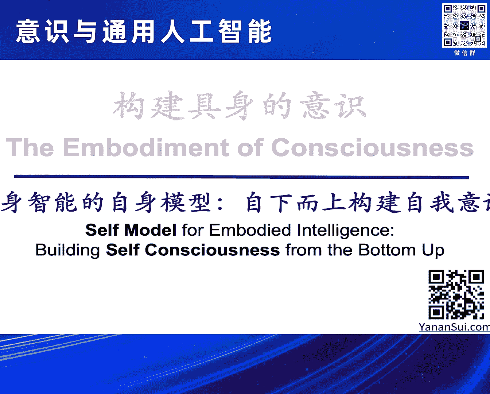
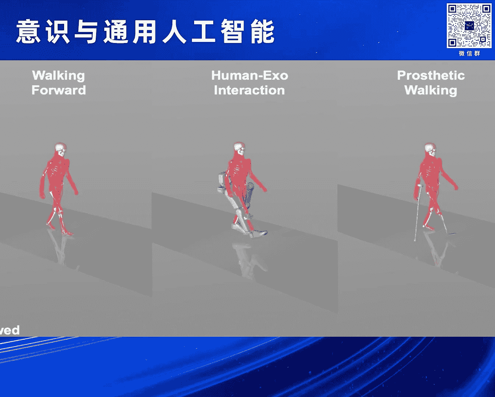
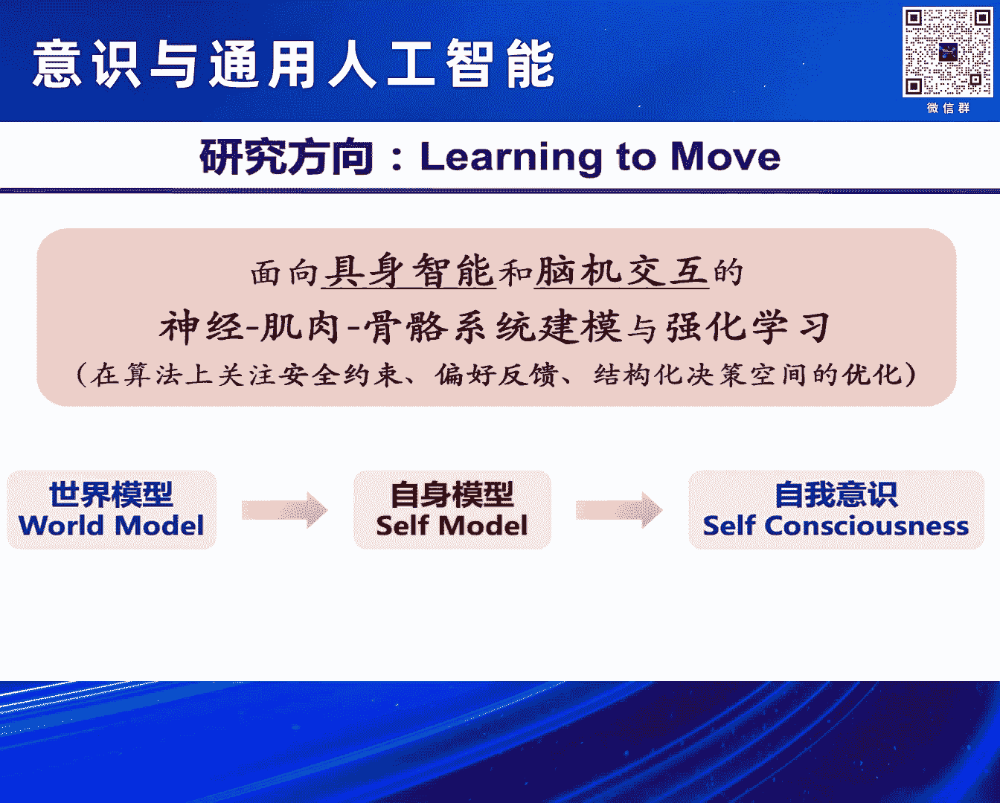
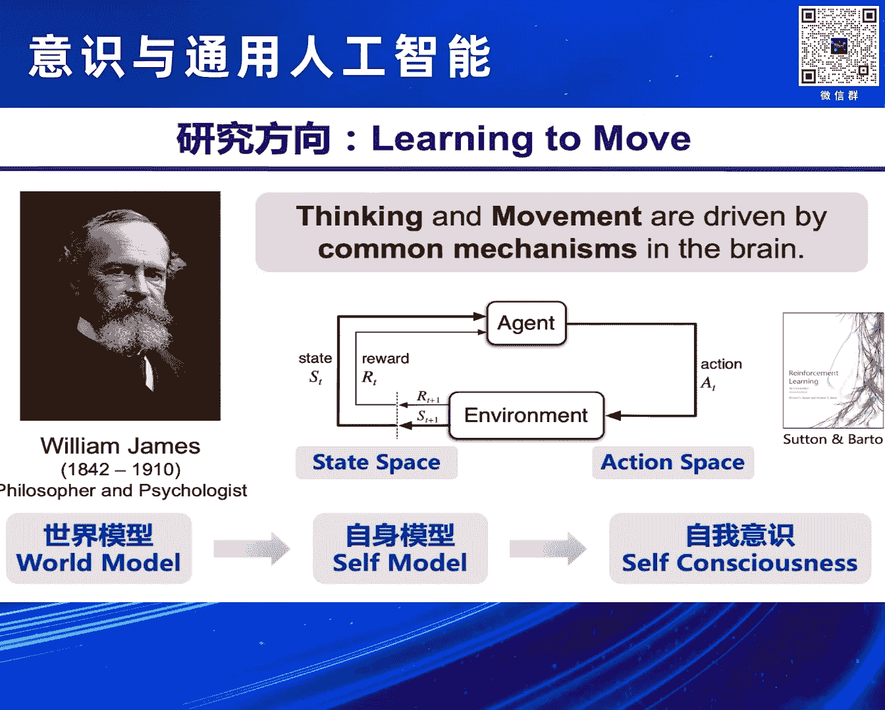
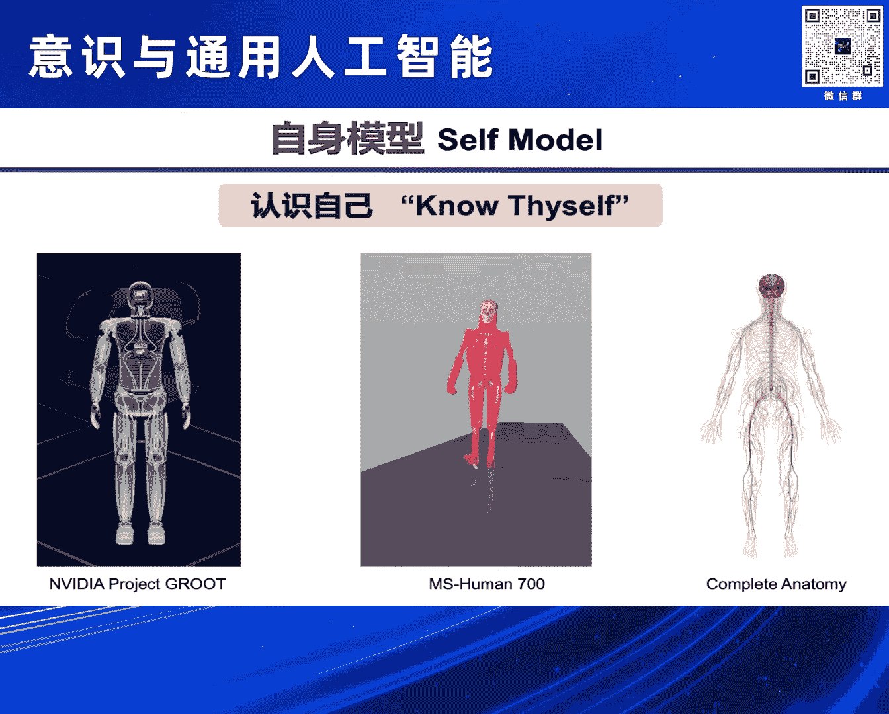
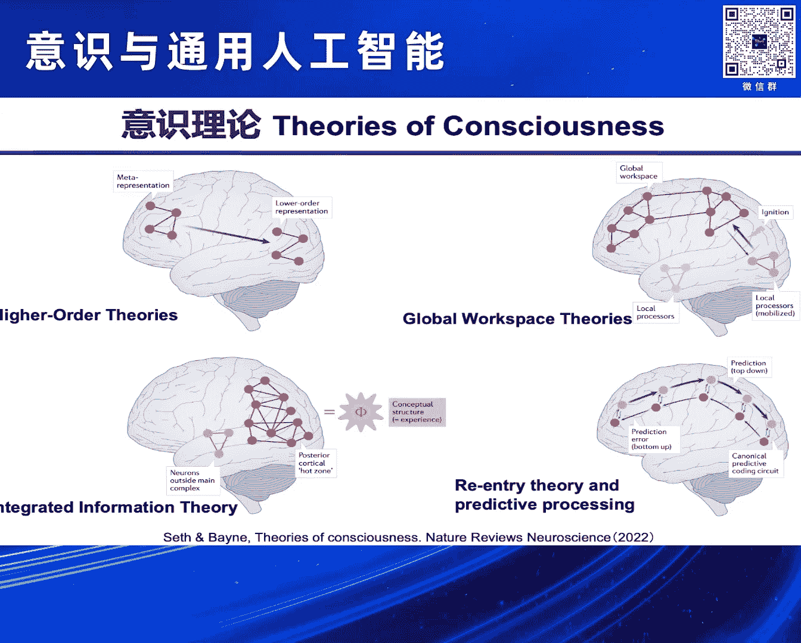
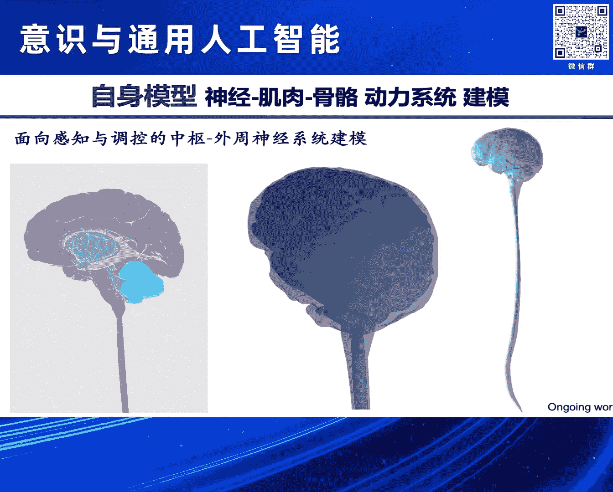
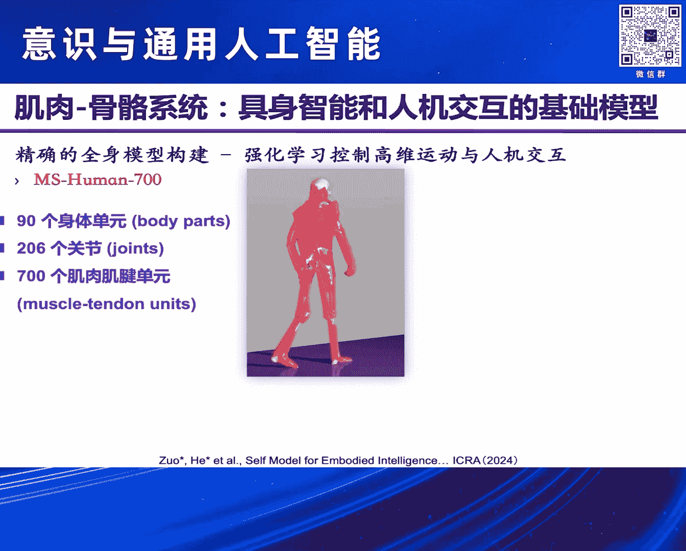
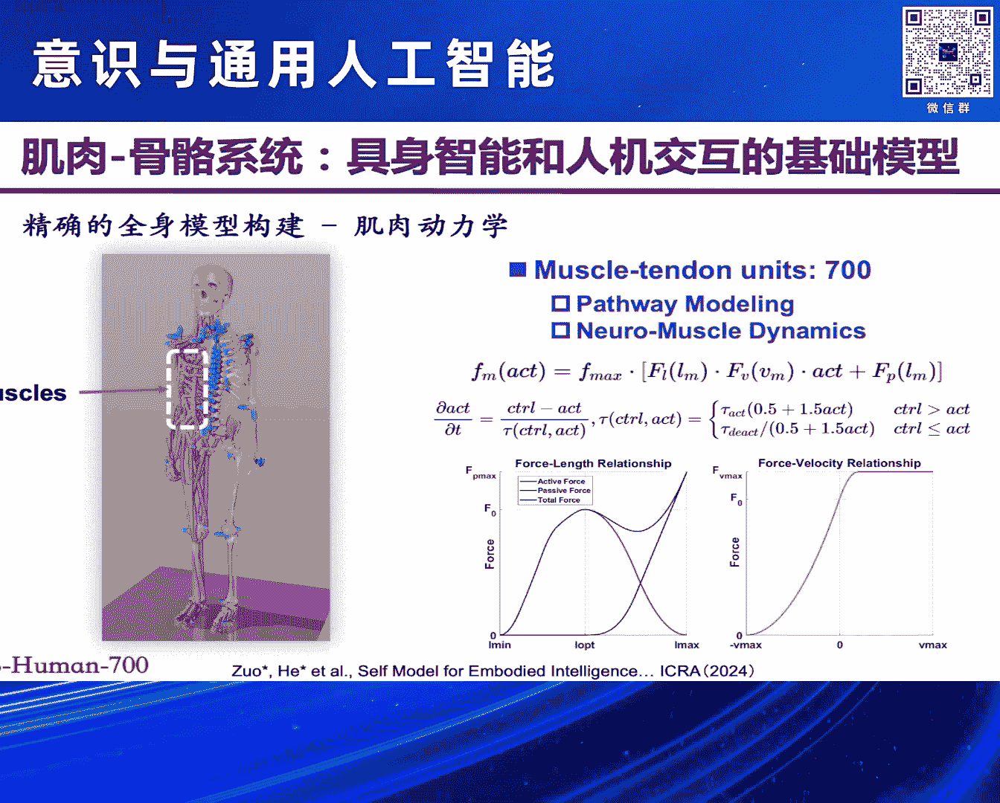
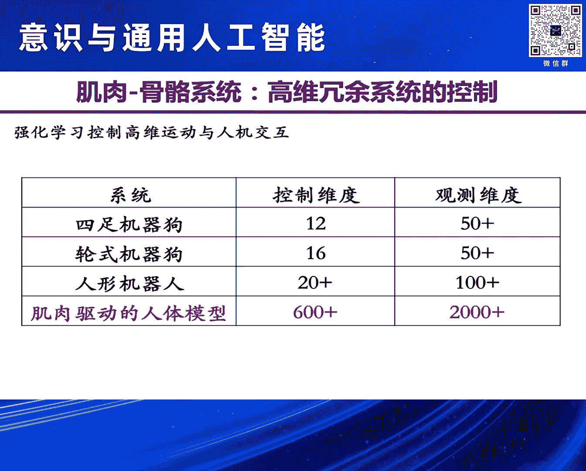

# 2024北京智源大会-意识与通用人工智能 - P3：构建具身的意识-主讲嘉宾：眭亚楠、提问嘉宾：朱露莎 - 智源社区 - BV11b421H7JY

我是做相对来讲更偏向于工科计算的，所以今天这个报告也会从一个工程的角度，就是从一个构建的角度，我们如何来构建巨神的意识。

How do we do the embodiment of consciousness，大家看到这个不是电脑有问题或者是屏幕有问题。

这个背景是我们的consciousness的一部分的呈现。

所以我们会在后面来讲它为什么是这个样子，但是在这个之前先部分的延续我们这个报告很好的传统。

就我们每个报告之间都会有相互的这些连接的，我的报告和前面刘老师的报告，还有罗老师的报告都会有比较多的连接，首先第一处刚才我们说Chet GPT，Do you have consciousness，对吧。

这个有多少，大家可能在罗老师提了这个事情之后，自己来查了一下，然后大家估计一下Chet GPT会给一个什么样的一个结论，或者给一个什么样的回答，他会认为自己有意识，会认为自己没有意识。

我们猜一下多少人认为他会去回答自己有意识，这个多少人会认为他回答他自己没有意识，好，我现在再换一个问法，多少人认为Chet GPT有意识，多少人认为Chet GPT没有意识，好的。

我们来看一下他给的答案，两种语言给出来的回答基本上是这个基本上是一样，Chet GPT，Do you have consciousness，那么我们看中文的吧，我整个报告主要用中文来讲，没有我没有意识。

我是用OpenAI开发的人工智能，旨在基于数据的模式处理生成文本，缺乏人类和动物所有的自我感知情感和主观体验，这些都是意识特征，所以他把意识特征在这个里面列了一下，我的回答是通过算法生成的。

没有对内容的理解或感知，大家注意这个里面其实出现这个结论，对于我们比较熟悉这个model building的这个群体来讲的话，这是不太意外的，因为所有这类问题的结果全部都被manipulate过。

是我们经过了这个安全经过了对齐经过了好几轮的这些处理，最终让大家看到一个让我们觉得，not very offensive，或者是even not offensive at all的这样一些结果。

那么这个结果本身是这个4o的这个版本给出来的，那么不同的版本大家也可以来测试一下它的这个效果，那么这里呢前面老师们也讲了说，这个意识到底是人所有还是这个人独有，还是人和动物可能都有。

大家可能从Chai GPT的这个回答里面，他至少在这个事情上他是有倾向的。

那么这是简短的一个对于我们前面问题的一个回应，回到我的报告的这个主线上来讲，我们把那个意识的背景去掉，清晰的看到我们如何来想通过接下来的20多分钟时间，来给大家来讲一讲我们可能以一个什么样的方式。

可能能够从下而上的，以这种自下而上的方式来构建自我意识，我们的意识包括有对外的有对内的，那么今天其实主要讲的是对内的。

How to build the self consciousness from the bottom up，那么也就是说我们这个在报告的结尾的时候，我们看到这是什么。

How to dive into the sea of self consciousness，那么以及它和接下来的我们的非常直观的这些运动行为之间，到底有什么样的关系。

那么他们两个之间的这是怎么样来关联上的，那么这和我的研究主线有关，那么我研究什么，我其实研究learning to move。

我们如何来运动，那么这里更为具体一点，learning to move是一个非常宏观的描述，那么更具体的我的研究命题是面向巨身智能和脑机交互的，主要是人类的神经肌肉骨骼系统的建模与强化学习。

那么下面这个小括号的其实会更加偏向于一些理论还有方法上，会比较关注安全，关注偏好反馈，关注解构化的决策空间的优化，那么前面两个安全约束和偏好反馈，在大概2018年到2022年之间逐渐变成了比较热的话题。

那么解构化的决策空间，这其实我今天要讲的主要的内容，也就是其实是我们如何来构建世界模型，如何来构建自身模型，以及在这个基础之上到底什么是自我意识，以及我们如何能通过构建的方法来形成，那么今天时间有限。

我们主要可能还是会围绕着自身模型的构建，因为本身世界模型的构建其实是，巨神智能领域里面，大家如果明天去听巨神智能的报告，几乎所有的报告里面主要都在讲世界模型。

自身模型可能这是我们是唯一一个来讲这个事情的，好，那么我们在座的很多是对于心理认知感兴趣的同学们，大家可能对于这个名字比较熟悉，William James，也是美国的早期的非常有代表性的心理学家。

那么同时早期的这些都是全才，既是心理学家也是哲学家，那么他在1890年，也就是130多年之前的当年非常有影响力的一本教科书里面，当然就提出来过，不是原话，但是我做了一定程度的不改变其本意的转述的表达。

Thinking and movement are driven by common mechanisms in the brain，这是当年心理学仍然在很早期的阶段，人物智能领域不存在。

那么研究movement本身是有一些比较优秀的传统，大家知道达芬奇在以前我们很多的定量的对movement研究，那个时候他提出来的这个假设，直到今天我还是比较认同。

那么当我们把thinking和movement，driven by common mechanism这件事情可以放在一起来，谈的时候，其实这里面就进入到了我研究领域强化学习。

reinforced learning，大家看到右边这是经典的Southern Bartle reinforcement learning的教科书。

中间这是说reinforced learning是什么，是我们有个体，智能体可以是agent，我们有环境，然后我们有状态空间，左边state space，我们有动作空间。

那么他们共同来构成强化学习的主要的这些单元，那么在这个基础上，我们来看如何把世界模型，自身模型和自我意识，一步一步来来构建，那么可能在座听众不一定对于这几个关键词都那么熟悉，没关系，我们一个一个来。

What is the world model，那么world model本身在今天其实有两大类的这样的描述，大家如果你们去看的话，这里并没有形成一个统一的对于什么是world model的一个。

完全没有争议的一个结论，也在于说这是一个快速发展的领域，但是大的其实是两类，一类是什么，一类是上面的小标题，The image of the world around us。

which we carry in our head，is just a model，那么从这个视角来看，就是我们如何构建一个抽象的对于世界的这样的一个表征，这是一类很重要的很有道理的一个想法。

什么是world model，This is the world model，那么右边的其实是另外的一类，我们从工程和技术的角度上来讲，以构建的方式。

我们来构建simulation environment，大家今天看到的所有在现实世界里面能够用的比较好的这些机器人也好，我们巨神智能的也好的这些场景，都是有赖于过去的这几十年里面。

simulation environment出现了一个快速的提升，那么这是我们对于世界模型两类主要的理解方式，这里其实可能这只是主流的认识，并不是特别的精确，但是我们今天也是不追求特别的精确的细节。

再就是自身模型，What is a self model，那么self model，那么这个其实也有非常悠久的历史，know the self，就是我们如何来认识我们自己。

这也是雅典的神庙里面非常重要的格言之一。

这其实self model，看我们对于self的定义是什么，它可以是巨神智能领域里面研究非常多的，机器人 机器狗 机械臂的这些场景，或者是自动驾驶的这些无人车等等。

那么它可以来做一个非常高精度的数字孪生的一个展现，那么这是一种来构建自身模型的方式，那么未来的环境里面，如果没有人只有这些设备的话，那么我们能以一个近乎完美的方式，对于他们来进行模型的构建。

但可能那不是我们希望看到的，我们希望在未来看到的环境里面，仍然是有人的存在，那么对于人的存在，就需要我们有对于人的模型，对于人的构建，那么可能终极的我们的环境，反过来是要和人来交互的。

而不是完全和没有人的这些系统来进行交互的，那么这里就会有人的骨骼肌肉系统的展现，也会有人的神经系统的这样的呈现，共同构成我们非常复杂的self model，好那么我们有world model。

我们有self model，在此基础之上我们可以来谈一下意识，好这里同样的前面两位老师都讲了，我们其实对于意识今天没有一个很好的定义，上面这其实是一个描述性的定义，这个描述性的定义也是翻了很多地方。

最终回到了wikipedia，大家在wiki上面找consciousness这个头条，第一句话就是这句话，但它是一个描述性的，它不是一个很好的一个定义，为什么我们来读。

consciousness at its simplest，首先这里有一个简化，at its simplest，这就是我们不喜欢的，对吧，但是没办法，我们继续来，接下去。

is awareness of internal and external existence，这里其实问题主要出现在那个，标黑的关键词awareness，它用同一词来对这个概念进行解释。

这不是一个好的解释，对不对，我们相当于数学上，我们用本定理来证明本定理，这件事情肯定是老师会给我们扣分的，对不对，但是没办法，在我们的这些偏向于前沿的很多这些领域里面，它会存在大量的这种模糊。

我们一看这个概念觉得非常有道理，我们第一印象会觉得非常有道理，但是接下来一看不对，awareness是什么，awareness就是consciousness的另外的一个描述，好。

那么这里面我们不纠结它的这些具体的定义，今天我们没办法给它一个明确定义，但是我们看下面的，It's awareness of what。

It's awareness of internal and external existence，这里的internal和external existence，就对应着我们前面几张片子里面给大家讲的。

self model and world model，好，那么今天我们不讲world model相关的事情，我们就从self model出发，从它以它为基础来构建self consciousness。

这里我专门写了个括号，self awareness，大家如果上网来查，说what is self consciousness，会发现大量的用self awareness来解释它，来做这个替代关系的。

对吧，还是说这个本身并不是一个很好的一个解决方案，但是没办法，这就是我们在这个领域里面的现状，下一页幻灯片会非常有意思，下一页幻灯片大家刚刚看过。

It's theories of consciousness，主要的这几个，但是这里我不去讲它的这些细节，这里我们讲它的limitation是什么，整个这一系列的工作。

其实一个很大的limitation，是最后谈出来的这一项，It's brain in a vat，这是肛中之脑的研究方式，所有的关于这个领域里面的，大家的这些重要的研究。

前面的这个罗尔斯·蒋·比奥尔的研究，佟唐尼的这些研究等等，大家在就脑子，在说脑子这件事情，那么就脑子在说脑子这件事情，和这个没有区别，我们把它放在一个好的培养基里面，然后我们认为它可能，重要的是什么。

重要的是到底输入和输出是什么，在这里如果我们只看一个片段，一个截面，意识是不存在的，意识一定是一个有时间变量的，而一旦有时间变量，就涉及到了它的输入和输出，是要同时存在的，以及是要连续性存在的。

大家回想一下我们前面讲强化学习的，这个loop本身，就是在讲这件事情，所以这也是引出了我们为什么要讲说，意识的具身性，那么一元论和二元论，在这个事情上，本身这个报告是来支持是一元论的。

意识是有它的这个具身性的，以及它的具身性，有可能是不是能够通过，对于世界模型，还有对于自身模型的深入的研究，去实现一个理解，好，那么这里最高量的自身模型的部分，我们来简单的来，向大家来汇报一下。

我自己的研究组，在这方面的一些探索，那么首先我们来看说，self model对我们人来讲，可能和环境交互的这个系统，首要的是人的神经肌肉骨骼的，这样一个动力系统，那么我们是不是可以把这个系统。

来做一个建模，来作为我们self model的一个起始，好，那么要做面向感知和调控的，这个中枢和外周神经系统建模，对不对，因为我们说如果只有中枢，又只有中枢的脑的上面这部分的话。

可能我没有办法充分的来体现，意识的具身性，所以我们从中枢和外周，来做这些模型系统的构建，这里有一个非常幸运的事情，是我们本身有大量的这个领域的同行，大家在做脑的建模，从图谱的角度。

从整个功能的这些连接的这些角度，所以我自己的研究组，这个规模非常有限，我们能做的事情非常有限，我们其实把中枢的这件事情，希望我们的同行们能够快速的，把它做出来，所以我们更多的是做外周，我们更多的是。

为什么我们抬头叫做这种，自下而上的方式，我们希望先从简单的这些部分来做起，好，那么这是神经的方面，不是我们今天的主要的这个，这个报告的主题，今天主要报告的是从神经的再往下的，肌肉骨骼的系统。

这也是我们今天，不管是来累人的人形机器人也好，还是我们自身也好，这是巨神智能和面向巨神智能，和人机交互的一个基础模型，这是我的研究组来做的一个，我们叫精确的全身的肌肉骨骼模型系统，构建与控制。

我们给它起了个名字，叫做Muscular Skeletal Human 700，这个MS作为这个Muscular Skeletal，这个肌肉骨骼模型的这样一个缩写，那么700是什么，我们下面会说，好。

这是一个完整的人的骨骼肌肉的，这样的一个，这个肌肉基建单元的构建，我们在这里所谓的完整，就是在我们有限的这个进化，如果我们往前看，一百年一千年一万年十万年，大概在这样的一个尺度上的话。

我们大概不会比这个模型，再发生什么实质性的变化，所以这个模型做到这一步上，我们至少从肌肉的数目上来讲，我们已经做够了，从我们这个物种，从我们这个物种来讲，我们希望来做到高的解剖精度。

以及在这个高的精度上，能够和外界环境来交互，以及可以来实现一个高的计算的效率，我们做了这么多的这些肌肉骨骼，如果没有办法去很好的控起来，没办法让它来实现类人的这些行为的话，我们在它的基础之上。

也没有办法来研究任何和意识相关的东西，好，那么这是我们为什么管它叫MS Human 700，因为它一共有700个肌肉基建单元，我们人有多少块肌肉，200多块，还有吗，肯定不是700，告诉大家。

因为这肌肉基建单元是有这个拆分的，多少，有200多，300多，还有，我们有600多块肌肉，那么在座的各位，其实大家的肌肉的数目，可能精确的数字是不太一样的，我们的肌肉介于骨骼和神经之间。

我们的骨骼基本上健康的成年人，大概的骨骼的数目是一定的，那么人的神经元的数目，大家是千差万别的，那么肌肉其实是600多块，但是不同的人，在我们的进化的链路上来讲，肌肉的数目会多少有点不一样。

但是也不会差太多，600多块肌肉，我们把它做成700个肌肉基建单元的，这样的一个呈现，这是我们的面部以下的整个模型的构建，那么它可以做什么，它可以做和机器人的交互，和外界的这些设备的交互。

它可以做很多的，我们从世界模型到构建了自身模型，可以在这个基础上来实现自身的控制，那么我们可以在此基础上来实现，一些是不是和意识相关的一些研究，那么这里其实是关于这个模型本身，构建的一些具体的细节。

我们如果想以自下而上的方式，来构建高级的这些功能，我们希望先把低级的底层的这些东西，尽可能地做得精确一些，那么这是body segments，大家可以这个粗浅地认为，这个简单认为这本身是骨的。

这些这个不太可以整体连接在一起的，这样的一些单元的数目，我们的关节的数目，然后我们总共的这个肌肉基建单元的，这样的数目，好，那么为什么我们说，我们有600多块骨，但是要做700个肌肉基建单元。

那么这里其实是大家看，右边这个是一个典型的例子，腰大肌，我们来维持站立的姿势，非常非常重要的一个主要的肌肉，那么它其实是有多个连接端的，那么这样的多个连接端的这些肌肉，我们会把它做相应地拆分。

拆分成若干个肌肉基建单元，这是为什么其实我们这个模型整个建立起来，虽然它还没有包括我们面部的肌肉，我们一些其他的这个运动相关的这些，这个但是和骨骼运动这些没有太大关系的这些肌肉，但数目也已经超了。

我们还可以再继续地把它再进行更精细的一些拆分，以及对于每块肌肉，肌肉的控制，本身上来讲，它其实是也是一个非线性的，一个通过神经激活的这样的一个过程，那么好了，我们希望是能够以一个神经激活的方式。

来得到肌肉的激活，从肌肉的激活再得到肌肉的力，从肌肉的力再得到它驱动我们关节运动的力矩，从驱动关节的力矩，再得到我的这个人是如何来运动的，这个样子来进行一个自下而上的构建，那么这也要求我们。

确实在整个建模的这个过程当中，对于人的解剖，对于人的整体的这样的一个系统的构建，要有相应的这些工作，那么这样的模型也会比今天我们看到的，巨神智能系统里面的这些典型模型，大家会看到说我们会今天看到很多。

四足的机器狗，轮足的机器狗，人形的机器人，等个机械臂等等，这些控制的维度和我们观测的维度，也就是前面讲的action space，and state space的数量大概是在怎么样。

数量基本上都是在这个few dozens，几十这样的一个数量，那我们肌肉驱动的人体模型，已经在这样一个简化层次上，它是要上了一个多数量级，将近两个数量级的这样一个规模，所以我们如何把它来控制起来。

其实也是一个非常困难的一个事情，那么这里我们不去讲特别细节的，我们如何去把它来控制起来，在这里面我们来讲说，简单说一下这里面，其实自我意识是如何来体现的，自我意识在我们的这个问题里面。

我们认为它是你所有可以以这样的形式，来上升向上传的这些信息，那么它是自下而上来形成意识的唯一的源头，所以我们的这些preperceptive，本体的相应的这些感觉，我们人在实时的从我们身上的。

所有的肌肉获取这样的信息，至于这个信息到底到哪一级被整合，到哪一级被过滤，到哪一级开始能够被我们的意识，进行显著的放大，这个事情我们今天还很不了解，但至少我们知道的是，这些是我们对于本体感觉意识的。

这样的一个来源所在，好 那我如果能够有好的控制的方法，能够把这样的一个，这是今天为止可能最累人的一个，动力学的模型能够把它驱动起来。

那么我们可能就有希望能够知道说，那么这个运动相关的这些意识的来源，是什么样子的，因为当我们看到这些模型的时候，我们会知道说，人来做这些动作我们都会做，但是来做这样一个动作的，整个时间序列里面。

你身上的每一块肌肉是怎么样来收缩的，这件事情没有人知道，我们也没有实验可以来对这件事情进行测量，那么我们能做什么，我们能用模型来逐渐的逼近这个过程，然后模型可以告诉我们一些。

我们可能永远都没办法真的在人身上，去实测的这样的信息的输入，并基于它来看，到底什么是我们形成高级意识的，这些基础的输入的信息源，好 那么同时我们还要在人上来做，这样的这些实验，来确保什么。

确保模型和真的人的这些运动的过程，本身它是符合的，它没有一个显著的这样的一个偏离，这是怎么样我们从世界模型到自身模型，到最终能够形成自身的这样的控制，那么大家可以看到说。

这是本身我们来可以控制它来模仿一个，一个特定的人的一个步态，那么左上角这是我们本身，都是我们的模型，整个四个图都是我们的模型，但只有左上角是我们的方法，我们最开始希望把模型做出来之后。

现有的方法就能够把这模型很有效地驱动起来，但后来发现显然不是这样子，不管是自然行走也好，还是我们让这个人来穿上一个外骨骼也好，将来大家可能会想一下，我自己来在各种各样的这些与环境交互的这些测试里面。

在你真的去做这个之前，我们可以来做这样的一个事情来试一试，以及对于一些残障的人士，比如说需要安装甲值的人，我们来simulate本身这个甲值，装上以后，他拿着这样的一个东西到底舒不舒服，到底能不能走。

到底能不能实现，他的整个在这个过程中的信息，本体感觉的所有的这些信息是怎么向上传的，以及基于他们，可能我们如何来形成相应的运动相关的一些意识。

所以这些都要求我们能够有效地把这些系统能够控起来，那么前面的这样的一些就是，算法类的工作，其实我会相应的我们都略过去了，这里涉及到大量的需要这些，记忆学习的优化，还有一些高性能计算的。

所以在这里大家会看到右下角，我们也会致谢AMD，对我们来提供这种高性能的计算的这些平台，那么最终我们自下而上来构建的这些自我意识。

大家看到的我们其实在开篇，整个这个蓝的非常闪，让人觉得看不清标题的，这是什么，这是我们本身整个这个人在实现左边的这个步态的，十秒的过程当中，当然我这里在重复循环的在放着十秒钟。

那么本身他的本体感觉向上传的这些，将近三千维的这些信息，当然我们这是简化了，因为是每块肌肉，我们把它来做一个有限维度的这样的一个处理，下面红的这个矩阵随时间变化的。

这是本身我们的给他所有肌肉的这些控制信号，你要有这样的控制信号，他才能够动起来，不然的话他是可能马上就会摔倒了，大家注意这里是基于动力学的真实的这样的这个控制的方式。

它不是computer graphics，像计算机图形学动画一样这些来做一个动画效果，这是真实的可驱动的这个物理的过程，那好了，那么在这个层面上来讲。

我们可以后面更进一步的去把它和人的向上的行行系统去结合，去看我们如何真正能够对于意识的自下而上的一步一步的这个形成，有一个量化的一个描述，好，所以左边我们会这个点今天的题。

这是我们今天的self model，也是AGI路上的很重要的一步，今天这个我们我们觉得这个AGI只是时间问题是吧，可能不是有无的这些问题。

那么整个的我们的背景其实是这个我们如何来dive in the sea of the self consciousness，好，那么最终这个我做一个简单的总结，今天的报告呢。

其实是主要聚焦于我们巨神智能的这样的一个自身模型的构建，也是希望通过它能够以这种自下而上的方式，from the bottom up的方式来构建一个这个意识的一个量化的一个描述。

我们从世界模型到自身模型到最终的这个自我意识，可能在此的这个呈现的这个方式，那么也是在这个过程当中，我们这个会在可预见的这个将来，我们会希望和大家一起来迎接我们人类智能的这样的一个巨变的时代。

这个巨变是fusion，这个巨变不是那个dramatically changing或fast changing，虽然说这个也是一个很有可能发生的事情。

但是the fusion of human intelligence，这是我们在今天有非常强的感觉正在发生，以及会持续的快速发生的，好的，我就在这里结束我的报告。

