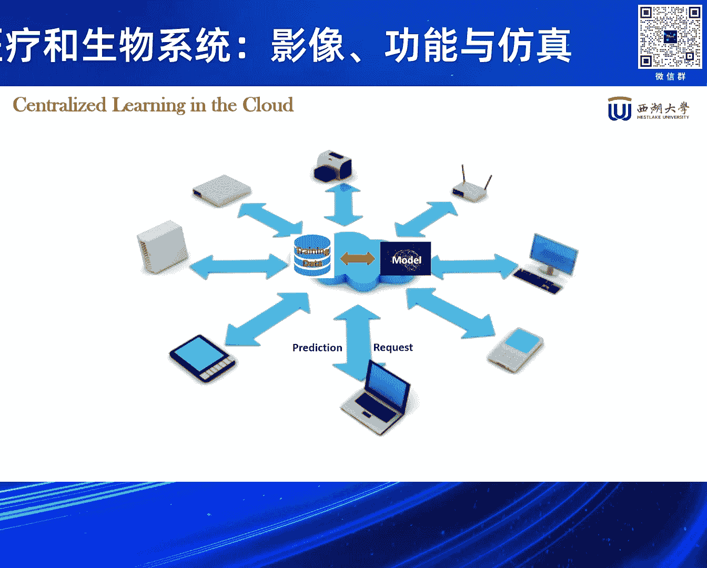
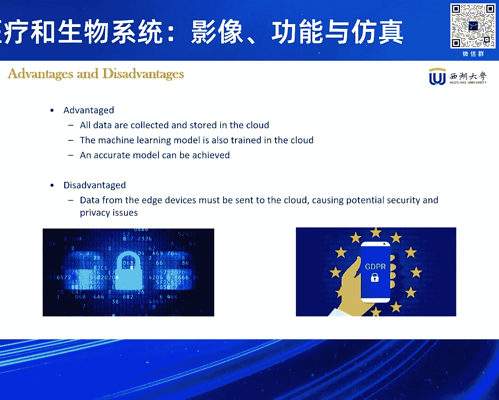
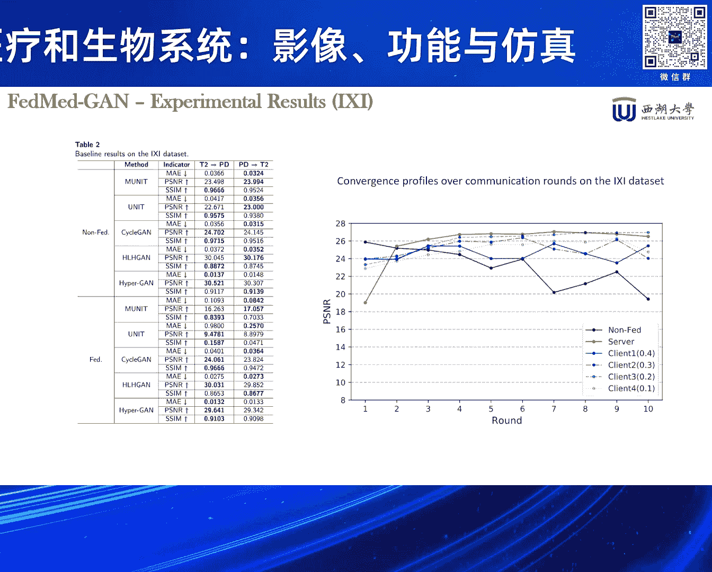
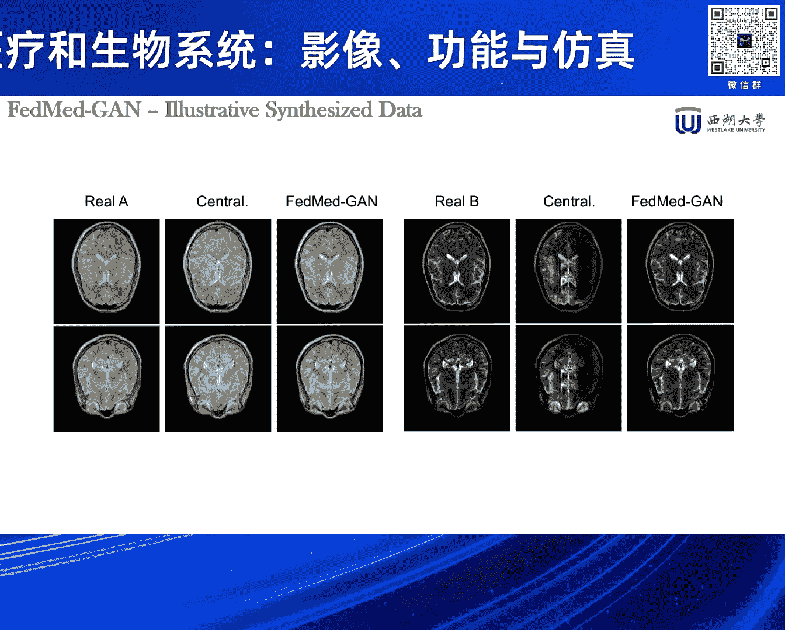
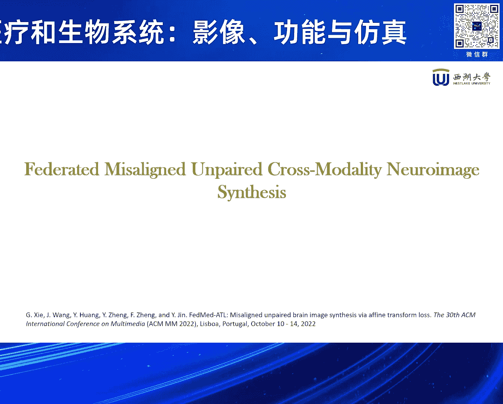
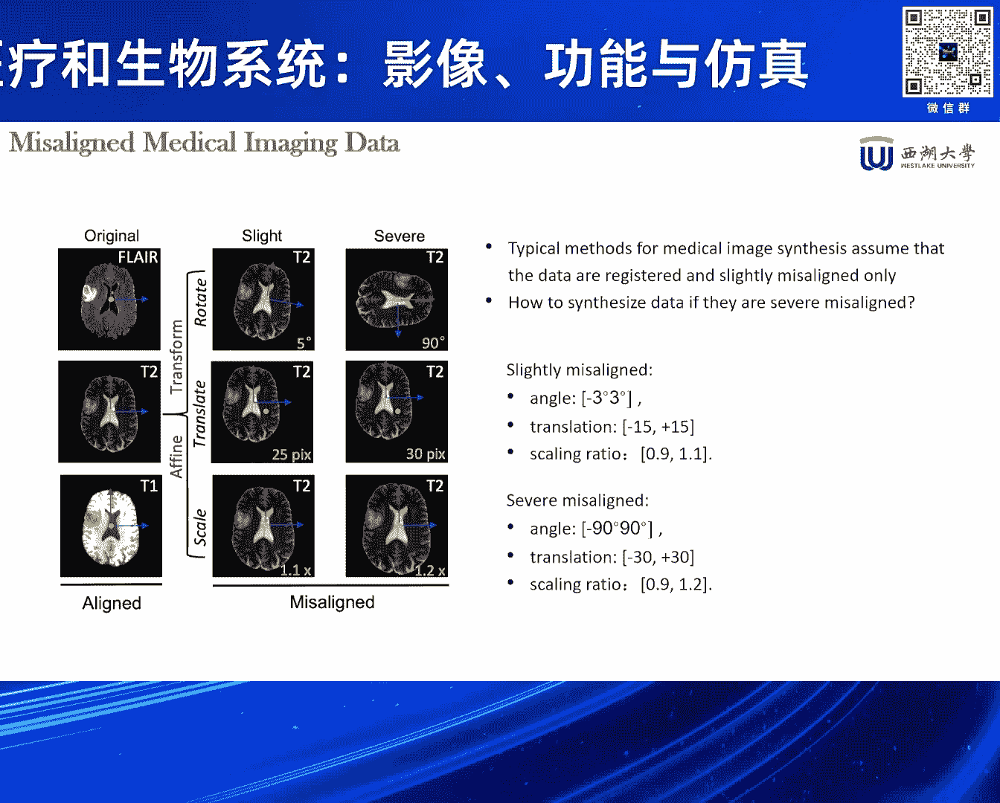
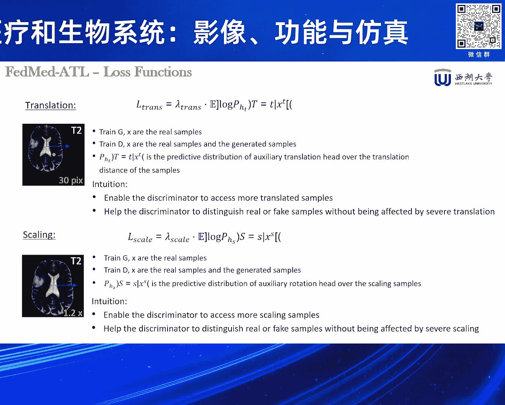
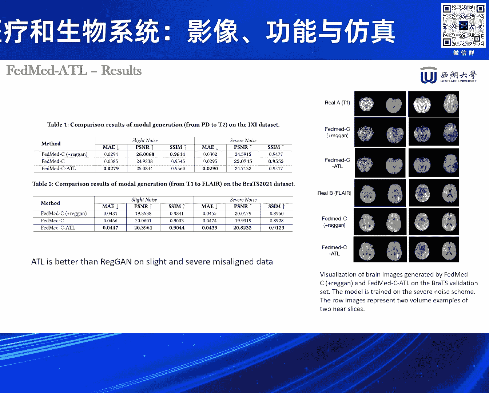
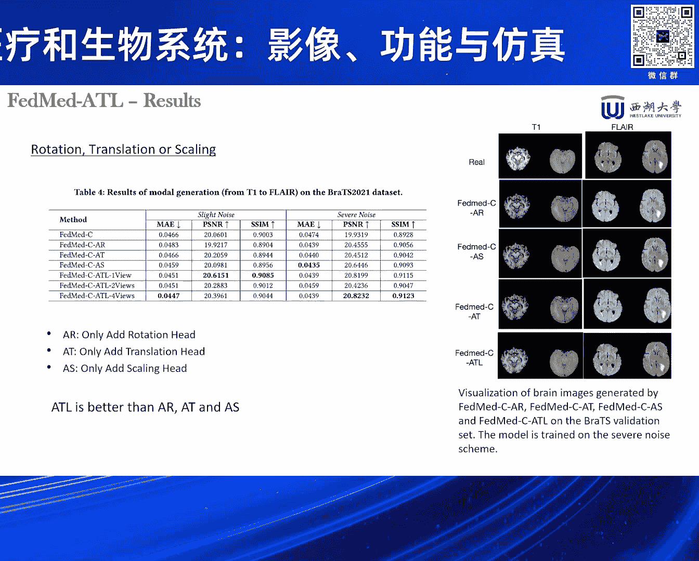
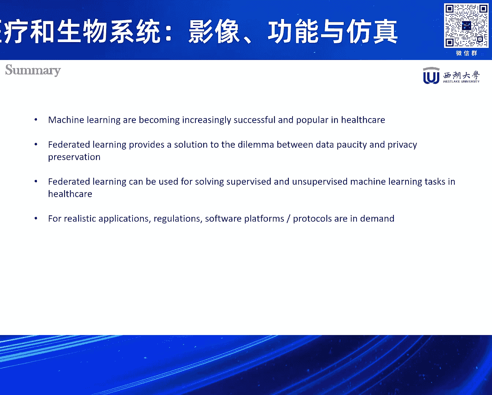

# 2024北京智源大会-智慧医疗和生物系统：影像、功能与仿真 - P2：Privacy-preserving machine learning in healthcare；金耀初 - 智源社区 - BV1VW421R7HV

下面有請我們第一位演講嘉賓金耀楚教授，金教授分別於1988年、1991年、1996年獲得浙江大學學士、碩士和博士學位，並於2001年獲得德國彭博洛爾大學工學博士學位，他是歐洲科學院院士。

IEEE Fellow，同時也是國家級高層次海外人才計劃主選者。

他目前為西湖大學人工智能講習教授、可信及通用人工智能實驗室負責人，金教授長期致力於人工智能與計算智能的理論、算法和工程應用研究，他研究成果豐碩，迄今為止已經發表論文500多篇。

查引5萬多次H-Index為108。

自2019年以來連續5次被列為全球高背影科學家，下面有請金教授給我們帶來的隱私保護計算機器學習。

專家各位朋友，大家下午好，首先感謝張老師的邀請，我非常高興有這個機會分享一些我們做的一些工作，所以我今天講的就是我們一些隱私保護的計算機器學習，在跟健康保健有關的一些應用，很抱歉。

因為我去年六月份才加入西湖大學，所以還沒有把它改成中文，大部分還是英文的，那我稍微講一點點西湖大學，西湖大學可能了解的不一定很多，我們是2015年創辦，然後18年正式成立的，所以去年十月份剛好是五周年。

那麼西湖大學的定義叫社會力量舉辦，國家重點支持。

這是一個比較正式的定義，目前我們西湖大學有四個學院，有理學院，工學院，生命科學學院，去年十月份剛剛成立了一個醫學院，我們現在總的家門的PI，就是助理教授以上的有230多個人，其中90%是從海外引進的。

所以我們的教授大部分是海外回來的，那麼現在我們在校的博士生有1500多個人，本科生因為才招了兩屆，所以才153，那麼今年是第三年可能再招90個，所以我們就說研究型大家也能從這個數字上看出來。

目前是這樣一個比例，那未來的話也就是本科生可能2000，博士生大概是3000這個比例，大概是總共5000名學生的樣子，那麼我呢就是去年從德國回到休大學，成立了一個叫做可信及通用人工智能實驗室。

那麼其實是兩塊，一塊就是說可信人工智能主要是做工業人工智能，當然這個工業可能也不是只是工業，也有一些可能像我們在health care這一塊，只是一些應用性的，但是要考慮它的可信。

就包括隱私保護安全等等科技性，大家都可能也了解，那麼第二塊就是我們稱之為通用，這個通用可能跟我們一般講的通用稍微有一點點不一樣，因為我們現在對通用人工智能討論非常多，做大模型。

然後就說能夠希望未來能夠模型越來越大之後，跟人一樣聰明，甚至說比人還聰明，那麼我們自己就說想探討一條稍微不一樣的路徑，主要是我過去二三十年一直做的工作，一直從演化和發育這個角度。

就是說來探討人工智能的一些基本的一些方法，所以我們希望是從模擬生物的演化和發育這個角度，來看有沒有能見一些不一樣的跟大模型不完全一樣的一些模型，然後它也能夠表現出一些通用智能特性。

比如說自主學習這樣的一些能力，那麼這個就是我的過去這三十年的一些主要的研究內容，大家可以看到就是HelpsCat其實這裡面很小一點點，那麼我稍微說一點點，我們現在講人工智能其實大部分都在講學習。

都是模仿人是怎麼學的，神經系統怎麼學的，那麼其實在生物裡面我自己個人覺得，我們的自生的機制其實不只一條，學習只是其中一個，那麼從長的時間齒輪上講，自然演化是一個很重要的過程。

那麼在生命過程當中其實至少還有兩個，除了學習之外還有一個發育過程，那麼發育的可塑性其實是對生物的演化是起了非常非常重要的作用，但是我們一般現在人工智能裡面幾乎不看發育這塊。

那麼我們做一些像神經系統或者形態，形態是指身體發育的過程，那麼它在進行建模，希望來看看比如說身體的發育對神經系統發育有什麼影響，那麼也很湊巧，最近大家又聽到一個非常熱門的詞彙叫做巨聲智能。

因為發現你只是單獨的去研究大模型肯定是不行，那麼事實上就是這樣，你如果把模型或者說神經系統完全跟身體脫開了，完全跟環境脫開了，你想去研究它是怎麼能夠有像人一樣的智能，我覺得是蠻難的。

就需要把它放到一個具體的環境裡面，一個有其他的agent的，有具體的環境的生成環境的一個地方，然後要把它跟這個身體結合在一起，這個身體其實你有一個傳感，一個是認知世界的功能，還有一個是改造世界的功能。

或者說不一定是改造，至少是你跟這個環境有交互的能力，所以這也是我們以前做這個，從發育這個角度上講其實也是非常重要，就需要有這個巨聲這個功能能力，那麼今天我要講的話主要是講這個。

想介紹一點我們在做隱私保護機器學習的，以及在跟health care相關的一個工作，我這裡今天會講三個小的工作，一個就是說一個是在聯邦環境下，做一些數據醫學這個影像數據的數據生成。

然後在這個基礎上又做了一些拓展，那麼第二個工作是在文本處理方面的，一個叫做關係抽取，關係抽取本來是一個自然源處理裡面，一個比較基本的任務一個基礎任務，那麼現在有了大模型之後可能做這方面的不是很多。

但其實還是很重要，為什麼呢因為比如說我們要做一個語意網絡，因為現在大模型老犯錯，那我們說要做一些局部的或者是domain knowledge，來幫助他怎麼糾錯，那麼這個是文本抽取還是有意義的。

機器學習的話我想我們大家都已經聽說了非常多了，其實但是我們可以把各種各樣的模型，我們總是把它可以分成兩類，一類叫做判別式模型一類叫生成式模型，那麼現在聽說大家都聽到特別多的。

像這個chart gpt或者是transform或者是solve這些東西，大部分是生成式模型，那麼其實我們還有一個很重要的叫判別式模型，那麼這個是判別式指認，就是說在這裡我們講的是。

他在學習之後實際上要判斷，比如這個例子當中你給的一張圖像到底是貓還是狗，這是判別式那麼學習這個生成式的話，就是說你用一堆貓的圖像給他訓練之後，他最後能生成一個貓來，這個就是兩種兩類不同的模型。

那麼這個歷史上有很多很多不同的生成式模型，判別式模型但是我想不詳細講了，從最最基本的這個mce模型，那個時候只是模擬一個細胞，然後到後來現在這個有上多少千億的數量級的模型，然後模型裡面也有少數個。

就是說我們不知道大家有沒有聽說過，大部分的神經網絡模型都是連續信號，但其實人的人腦或者是動物的腦，信息處理是用脈衝信號的，所以也有少量的這個用脈衝模型，那這個目前還不是主流模型。

這是一些比如說生成式模型的傳統的方法，但我也不詳細講了，那麼現在流行的比較多的，就比如像這個變分這個自編碼器，那麼像這個GAN就是叫生成對抗模型網絡，那麼還有很多很多別的，但是我不詳細講了。

只是一個介紹一點點背景，假設如果對這方面不了解，那麼接下來我就講這個隱私保護了，因為其實大幕，現在我們人工智能很成功，大幕性成功，其實有一個三個條件之一，我們講經常講三個條件之一，第一個就大數據。

那麼這個大數據的話，我們有一個假設就是說，你可以隨意的獲取數據，對不對，其實我們假設有很多很多東西，比如說從網上拿來數據，然後我存儲在一個地方，然後去訓練一個大模型，這樣的話你這模型能力很強。

但大家肯定也聽說了，曾經前一段時間紐約時報去告OpenAI，說你用了我的數據了，你沒有經過我同意，那麼其實這個數據的隱私問題，或者數據的所有權問題，是很早就已經引起注意了。

我們2017年歐盟就發布了一個叫GDPR，那個時候就說不能隨便的收集數據，來訓練的模型，所以這個隱私保護的話，現在就是已經一個，非常非常大家很關心的一個話題了，那麼這個就是我們傳統的。

就是用一個所謂叫Centralized Learning，就是說把數據從各個地方收集來之後，存儲在一個地方，然後去訓練一個大模型，那麼好處當然，我可以把所有的數據都用起來，但是這個侷限性的就是說。

就是你的問題是在於你要去收集數據，所以你要經過人家同意，那麼這個數據一旦出去之後，你的隱私可能會洩露，或者是有安全的隱患。

那麼你肯定說，我不要收集數據也可以，我每個終端設備上，我自己現在都算力很強，我每個手機都是比我們讀書時，一個計算機還厲害了，算力很強，那麼是不是可以每個設備上訓練一個模型，那當然大家可能會知道。

這個話題會有些侷限性的，因為你每個設備上收的數據畢竟有限，分佈可能也不是很好，這樣的話就不能充分利用，不同設備上存儲的數據，所以我們其實要解決的問題是什麼呢，就是說要解決的是一個。

一方面我們希望把所有的數據裡面的價值，這些都把它利用起來，而另一方面呢，我們要保護這些數據的隱私，以及安全，所以如何來解決這個矛盾，就既能用這些數據，又能夠保護這些數據的隱私，那麼傳統。

這裡有很多很有趣的符號，不知道哪來的，這個這個有很多隱私，保護這個計算的技術，包括像我們多方安全計算，或者是差分隱私，這個差分隱私的話，就是說我在我原有的數據上，我加了一定的噪聲之後，那最後呢。

你就外面就看不出來，這個數據原來是從哪裡過來的，還有像比如常見的就是同態加密，同態加密就是你對數據進行加密，加密之後再進行訓練，然後這樣的話，你就你哪怕把數據給別人，也不會擔心你的數據。

你的數據的隱私會洩露，那麼這些方法當然有，有各自的優勢和局限性，那麼像特別用的比較多的，差分隱私和這個同態加密，那麼這裡面差分隱私，就是說它有個什麼樣的缺少符呢，就是說你噪聲加少了。

你可能隱私保護能力不夠，噪聲加多了，你這個模型的質量會受到影響，所以這是一個缺少符關係，那個同態加密呢，有這麼幾個問題，一個呢，它的計算複雜度會比較高，你每次計算之後，要加密解密加密解密。

這個計算複雜度很高，這是一個，第二個呢，它只對它雖然我們講同態，這個同態只是個相對的概念，就是說只是對加法和乘法同態，那麼我們機器學習裡面，其實還有很多非線性的操作，那麼這些非線性操作，就沒法直接。

就是用這些加密數據，那麼一般我們做這個線性化，比如用Tele展開線性化，那麼這裡會引入一定的誤差，所以就是也是一定的局限性，那我們今天講的主要這個框架呢，是一個聯邦學習的框架，這個框架其實是2016年。

谷歌提出來的一個，就是說隱私保護的一個計算的框架，那麼這個框架其實一個最最，如果你要很簡單的說的一句話的話，就是它是一種分佈式的一個計算方法，然後呢它就說希望這個數據，就在分佈在不同的設備上。

或者不同的個體那邊的數據，就叫可用不可，就叫可用不可建，就你能夠用它，但你不需要建它，你不需要看到它數據裡面，到底藏了什麼東西，那麼這裡面當然，聯邦學本身現在這幾年，從16年提出來開始。

這幾年其實是發展非常非常快，我今天其實並不是專門講聯邦學，只是講一些非常基礎的東西，那麼這個聯邦學最基本的，假設就像這樣的框架，它是有不同的用戶，每個用戶有自己的數據，然後呢它現在我們這個怎麼做呢。

就說我們假設這些數據，有一定的滿足一定的條件，所謂叫做水平分割，也就是說你這些數據呢，雖然數據條目是不一樣的，但是每一個用戶，他都有這些所謂的特徵，我們這裡講的X1到X5，就是你這些特徵。

然後呢也有都有標籤，那麼有這樣的情況之後呢，只是那些數據分別不同的地方，那麼我在做的時候怎麼做呢，就具體做的時候，就是提出這麼一個框架來了，這裡一個就具體怎麼做的，就說我們假設主編是一個服務器。

或者是雲，或者是一個大比較，就能計算力比較強的一個設備，然後呢我們有很多這個小的中段設備，比如汽車也好或者手機也好，或者這個laptop也好，那麼它每一個設備上，都有它的私有數據，那麼這個時候呢。

我這個服務器上的先初始化一個模型，然後呢把這個模型的參數呢，發到所有的中段設備上去，那每一個中段設備呢，就用這個發下來這個模型參數呢，用自己的數據來訓練這個模型，訓練之後呢。

你訓練了各個iteration之後，你就或者epoch我們講，又把這些更新後的參數呢，送回到這個服務器上面去，然後呢服務器呢，把送回來的這些參數呢，又把它聚合起來，我們就聚合，那麼怎麼聚合。

反正其實當時谷歌的提出來聚合，是非常簡單，是一個加權的，簡單的一個加權聚合，在這裡的話，再看一下，像多少來做個線性的加權聚合，就非常簡單的聚合，當然這個聚合，不一定是最好的聚合方法，然後聚合之後呢。

我又把聚合後的模型參數，又重新發到每一個用戶那裡去，然後每個用戶呢，又根據更新後的這些參數，繼續用本地的數據，私有數據來訓練，這樣經過若干輪之後呢，希望這個最後這個模型呢，能夠跟你把所有的數據。

放在一起獲得的一個模型，是一樣的好，那麼這個當然是一個假設，沒有人能夠證明，事實上在很多情況下，也不一定能夠真正做到這個效果，這是前面講的橫向的聯邦區域情況，那麼當然還有一些縱向情況。

那麼縱向情況是什麼情況呢，其實也很常見，就說我們看不同的用戶那裡，他的標籤可能會，有的有標籤，有的沒有標籤，這是一個，第二個呢，他的所謂的attribute呢，也是不一樣的，就舉個簡單例子。

比如說你同一個人，我在銀行裡面，可能有我的收入，我的這個存款，貸款這些數據，在醫院A呢，你可能是我有檢查這個肝臟的數據，醫院B呢，可能有檢查這個胃的數據，或者其他器官，所以呢，就說每個地方。

他擁有的數據，這個不一樣，那這個不一樣，是我們用機器裡面叫attribute，這個不一樣，而且有的地方的數據，就是有的這個用戶呢，他沒有所謂的label，比如說你醫院裡並沒有說，你這個人到底所謂是什麼。

中產階級還是這個，還是什麼樣階層，他沒有這個標誌，或者說這個銀行裡也沒有，你到底是健康還是不健康這樣的數據，所以這個label就沒有，那麼這樣的就屬於垂直分割的情況，那麼這個情況很明顯。

跟前面的相比的話呢，就會更複雜了，好，那麼聯邦學習現在就說，雖然是一個能夠保護這個數據隱私的，這種分佈式的計算方法，但是呢他也會掉了帶來一些額外的挑戰，這個挑戰包括一個呢，其實通訊。

大家可以想像我們這個，剛剛那個框架裡面，你這個服務器先把參數，模型參數發到每個用戶那裡，用戶那裡訓練之後呢，要把它發回去，然後不斷一輪輪的做，這麼傳送，那麼如果你這個模型很大，比如現在我們講大數據。

雖然不一定是千億級的，但是也可能很多，那麼這個通訊量就會很大，所以這個怎麼來降低這個，減少這個通訊的量，其實是一個很重要的一個研究方向，這是第一，那麼其次的話呢，就是這個數據的，因為我們前面假設就是說。

用這種分佈式的訓練方法，最後你訓練車模型，跟你這個把數據堆在一起，訓練車模型是一樣的好，但這其實是一個很強的假設，那麼有很多情況下你是做不到這樣，那特別是像比如說不同的用戶那裡，不同的設備那裡。

這個標籤所謂的不平衡，所謂的不平衡就是說，你一個用戶那裡，你可能有很多你這個有關，比如你這個健康方面說，另外跟你很多有關是這個，你其他收入方面數據，那麼這個這裡面就是，有個標籤不平衡的問題。

那麼還有一個就是這個，H比值不平衡，所以這些存在數據不平衡的情況，那麼這些情況都會影響你，前面講的我們這個聯邦學習的框架，訓練出來的這個模型的質量，那麼另外一個就是挑戰是什麼，叫做我們講這個用傳參數。

或者是梯度，而不傳數據的方法來保護數據隱私，你似乎像你這個數據沒傳出去，所以我很安全，但是這也不一定，現在有這個已經有證據表明，就在這個框架裡面，我們在這個框架裡面，我們假設有些用戶。

是所謂的叫惡意用戶，那麼他的所謂，什麼叫惡意用戶，就是他不是只是參與這個學習過程，而是想知道別人的數據到底怎麼回事，那麼因為他擁有自己的一個本地的模型，以及從服務器上傳下來的全局模型。

那麼他用一些機器學習方法，利用這兩個模型，他可以倒推別的，就反推別的用戶的數據，那這樣的話也會造成這個數據隱私的洩漏，所以我們往往需要在這個聯邦學習的框架上面，再加一些其他的隱私保護的方法。

包括前面講的差分隱私，和這個像是有的時候也需要加密，當然這裡面就有個成本的問題，計算成本的問題，那麼最後一個挑戰，就是說其實是一個所謂叫做異構性，這個異構包括前面講的數據的異構。

數據其實還有模特方面不一樣，所以你有的可能圖像，有的是音頻數據，有的是其他的數字數據，這不就是模特上有差別，還有每個設備的計算能力和通訊能力不一樣，我們前面這個框架假設說，這個更新過程是一輪一輪的。

大家同步的，其實很難保證這個同步，那麼有這些不同的異構的特徵存在的情況下，我們怎麼來保證這個框架還能夠正常的運作，還能提供好的訓練性能，這裡面就又有很多的研究，那麼目前的話，當然聯邦學還有很多別的。

包括所謂叫做公平性問題，因為我們這個框架是最後的說，我要訓練出一個全局模型來，對所有的用戶都一樣，那麼有的用戶說，我對其實這個不感興趣，你說你要，比如說假設這裡面的模型包含一個人的credit情況。

他到底有沒有信用，還有一個是包括一個人健康情況，你其中有一個人說，我對credit不感興趣，我只對健康感興趣，那麼你一定要說把它訓練個模型，你可能會犧牲健康方面的信息，為了增加credit方面的性能。

所以就是說每個用戶他的要求不一樣，那麼這裡面有些如何來照顧不同用戶的需求，這樣東西，或者是公平性這樣的問題，有很多很多別的問題，那麼接下來的話，我就講幾個我們在這方面的應用，那麼第一個應用是在腦層。

這個層下裡面一些數據的生成，主要是為了數據生成，那麼數據生成，首先這個motivation是什麼，就為什麼要做數據生成，因為大家知道，我們現在一般腦層下有很多方法，有的用比如說這個。

用這個mri持共振的，或者是PET的這種，但是每次做一個檢查，可能會很花錢，因為我還看到一篇文章，說我們現在做一次持共振的還要幾千塊錢，我不太清楚是不是價格對不對，但其實就是很貴的，那麼就不太可能。

你一個病人去把所有的這些成像方法去做一下，那麼機器學習裡面，有時候就希望你對同一個病人，這些圖像都有，就不同的模式都有，那麼有的時候，也有可能就說因為這個PET，在做數據的時候，可能就說因為這個病人。

比如說他的姿勢不對，或者有動，那麼造成這個數據會質量不好，或者是這個成像效果不好，那麼你可能說是不是可以分享，不同的醫院可以分享這個數據，那麼就是涉及到我們前面講的這個隱私保護的。

因為現在其實你要不同的醫院分享，共享這個數據是很難的，所以這裡面我們就提出來，有沒有可能在前面這個聯邦學習框架下，來利用不同醫院的這個數據，來更好的生成質量更高的這個影像數據。

同時又不會洩漏這個數據的隱私，所以這裡面提出一個框架，其實就基於一個生成對抗網絡的，一個影像的這個數據的生成，就說希望就如果說有這個缺失的數據，缺失的情況下，那麼我利用別的這個病人的。

別的醫院的這個數據，來幫助我更好的生成這個PET的數據，這是一個最基本的思路，那麼具體怎麼做的，其實就這個框架，大家看到這個左邊的話，其實就是我們前面那個聯邦學習框架，你有不同的醫院，這裡是不同的醫院。

然後每個醫院的都有自己的數據，是吧，就私有數據，那麼我那不能把數據給到別人，但是呢，我又希望能夠用這些數據呢，來幫成剛剛這個，就是這個生成對抗網絡，這個框架呢，能夠生成高質量的這個數據。

那麼這裡面其實我們做的事情什麼呢，就其實對這個，因為在這個生成對抗網絡裡有兩塊，一個叫做這個是一個叫generator，還有一個叫做判別器，一個叫生成器，generator叫生成器。

那麼另外一塊叫判別器，那麼我們自己其實做聯邦這一塊呢，只是在生成器這一塊，就是說我們在生成器呢，在自己的數據上進行這個訓練之後，然後呢把這個模型參數呢，送到這個一個服務器，假設一個第三方一個服務器。

然後呢這個服務器，再把這些不同用戶那裡，不同的醫院生成出來的這些參數呢，把它綜合綜合之後再發回去，然後呢這個判別器的訓練呢，只用本地的數據，這裡面就是這樣一個基本的思想。

所以應該說從這個框架上講是非常簡單，只不過我們大部分的聯邦學習，都是討論的是這個判別社，就我們前面講判別社和生成社，一般都只討論判別社的這個模型的這個，這個聯邦學習方法，那麼這裡用的是這個。

針對這個對抗生成網絡裡面的，這個生成器的這個訓練，用到了聯邦學習這個框架，具體的呢就是我不詳細介紹，基本上這麼一個有這麼一個框架，那麼這個對抗生成網絡，其實我們這個所謂的桿是吧，大家可能也聽說過。

有非常多的變形，這個桿那桿的，這裡用的是我們其中有一個叫cycle桿，但其他也很多，這個不重要，那麼重要的是什麼呢，就是我們在訓練的時候，就是為了保護隱私嘛，所以我們就加入了一個叫做。

Differentially Private，就是叫差分隱私的T2訓練方法，那麼這個簡稱叫做，這裡是叫DP，DP SGD，就是說DP就是叫這個差分隱私保護的，那麼然後呢，SGD就是這個隨機T2法。

那麼它基本上其實也很簡單，就是說首先每個用戶，他要生成一個一個域子，這個域子就是差分隱私裡面，這個隱私保護的一個參數，就是說這個域子，比如說這個數據一大，那麼隱私保護能力強，這樣的。

然後有了這個值之後呢，我就去做這個在T2的訓練的時候呢，先把這個T2這個叫clip，就是我把它限制在，這個負C和正C之內，然後呢根據這個數據的多少呢，我確定一個值。

它這個值叫做叫做Global Sensitivity，就是這個GS，那有了這個GS和跟這個Epsilon之後呢，我就可以確定訓練之後，我加多少噪聲，加到這個樣本上去，加到這個參數上去，那麼這樣的話呢。

就是說在理論上能夠保證，我能夠在Epsilon條件下滿足這個差分隱私保護，這是一個叫做這個在訓練過程當中，保護這個隱私，這個的一個方法，這個用根據這個差分隱私的方法，好，那麼這個因為這個感染裡面。

有很多很多的這個訓練的東西，但是呢我就不詳細講了，這有好幾個Loss函數，有的是針對這個生成器的，有的是針對泡沫器的，那麼不同的感染，還有不同的這個其他的這些量要加上去，然後下面這塊呢。

就是這個我們講差分隱私，這個保護的這個SDD的方法，總個算法框架我也不講了，好那麼做的實驗的這個結果的話，就說其實就說，主要是測試它的效果，在兩個常見的這個數據庫。

這一個是叫Blood Tests 2021，還有一個叫IxI，那麼這裡面其實我們要想研究什麼呢，就說我們想知道，當不同醫院的數據分布很不均勻的時候，所謂的這個能IID，這是基學院裡面一個術語。

就說它的分布差別很大的時候，我能不能保證這個模型，剛剛提的這個方法還是有效，所以主要是在這方面，那麼詳細的這個測試的東西呢，我也就不討論了，但是有一條可以看到，就說在所謂的叫做能IID很強的情況下。

你用這個傳統的方法做的話呢，它會出現這個模型發散的情況，就是所謂的模型發散，就說我這個全球模型，不能收斂到一個統一的模型，因為每個用戶的數據差別很大嘛，所以訓練到後來它會發散掉。

沒法收斂到一個統一模型上，那麼用剛剛這些方法來做呢，反而會能夠提升，提高這個模型的收斂性，OK，這是一些例子，就看看我們比如說，A是真實的，然後B是用這個。

Centralized Learning來訓練的結果，那麼第三類呢，是用這個我們剛剛講的這個框架，就用Synthetic Data，就是這個生成的，合成的數據，是這樣的情況，那麼其實看這個質量。

應該還是不錯的，這是第一個，那麼第二個我要稍微介紹一下呢，其實是一個，剛才在工作上一定的一個擴展，那麼這個擴展，主要是在擴展在哪裡呢。

擴展在這個，泛黴器的訓練上面，因為我們前面講的是，在生成器這塊，我如何來利用不同醫院之間數據，幫助這個生成器，生成更加高質量的這個數據，但是呢又不會去涉及到，這個隱私這個洩漏的這個問題，那麼這個。

這另外呢還有一個問題，其實這個泛黴器本身，也怎麼來提升它的這個質量，那麼我們前面講說，哎呀很多這個影像的模糊，它可能不存在，但其實也有很多，就是講比如說病人，因為動了，或者是由於各種各樣的原因呢。

它的數據沒有，所謂的沒有對好，沒有對齊，也有這樣的情況，就數據有但是沒對齊，那麼如果一般以前的話呢，我們往往把這個數據，當作是有造生數據，可能就沒法真正用起來，那麼我們現在這個想法，就能不能把這些數據。

在沒有對齊的這些，沒有配配的數據呢，把它充分利用起來，來更好的訓練我的這個，這個這個這個這個泛黴器，那麼這個沒對齊，我們這裡是考慮了三種情況，一種就是旋轉，這個圖就是這個角度不一樣。

還有一個呢就是叫這個，這個平移是吧，translate就平移，那麼scale就是速放，這個這個速放，那麼我們這個當然你可以有，有不同的角度，有嚴重的有可能，稍微輕微的這個變化，不管怎麼樣。

就是考慮這三種不同的情況。

然後呢我們就分別，就是說主要的思想剛才前面，就如何把這些，有一定的沒有完全對齊的，這個數據拿來充分利用，它的價值提升我這個，這個泛黴器的訓練的這個，這個這個質量，那麼這裡怎麼用的，其實是加上一些這個。

額外的這個螺絲函數，你看我們在這裡面就除了，原來的這個原來的這個數據之外，我們下面有三個，一個rotate一個translate，一個scale，就是說我在訓練的時候，有時候故意去旋轉。

旋轉它然後呢去做一些移動，或者做一些速放，然後呢再把這些，變就是這個這個變換過的數據呢，也放到這個螺絲函數裡面去，這樣的話呢我在訓練這個泛黴器，是不只是訓練這個，原有數據上這個損失，而是呢也對那些進行。

這個叫做這個放射，這個放射這個，變換以後的數據上的這個螺絲，也把它考慮進去，所以呢其實就說到底呢，就把這增加了三個螺絲的這個，這個像一個是旋轉，那麼第二個就是平移，那麼還有一個就是這個速放。

然後我們把所有這些都合在一起，最後就把所有的這個，都合到一個這個審查函數裡面，然後呢再去看這個模型訓練情況，那麼最這個詳細的我也不講了，就是說這個這個性能。

還是有有有有，有比較大的提升，那麼這裡做一些判斷，就是說如果只做其中一個會怎麼樣，那麼我總體來說呢，肯定你把這三個旋轉。

平移和設放都考慮進去，會效果更好，ok好，那我最後一分鐘呢，再講我們最後一個一個小小的一個工作，就說前面兩個是在這個，醫學圖像的生成方面，那麼這個呢就是，我們是在文本的這個，自然源處理。

這個是這個biomedical的一個文本，那麼這裡面主要是叫關係抽取，那麼關係抽取，其實以後還是有很多研究，有這個句子層面上的關係抽取，就是說一句話，然後呢來找出這兩，其中兩個你想知道的。

關鍵字叫做叫實體之間關係，那麼這個當然就比較簡單，只在同個句子裡面，那麼稍微複雜的就是，我們叫這個document level，就說是整個文本，你文本可能比較長，那麼這個抽取就會更複雜。

我這裡舉個簡單例子，就說你看我們這一段話裡面，我們有四個地方提到了一種化學物質，然後又有四個地方提到這個甲肝，這個這個字，那麼到底如果你不加區分的，把它去說，提取這兩個有關係，其實就錯了。

因為事實上最終的話，只有其中有一次，真正的有表示了兩個相關的關係，這樣的話就說就非常，我們就是非常非常，就是在文本這個提取的時候，就需要關注到這一點，好的，我的時間已經差不多了，那麼這個裡面其實用的。

這個基本的思想就兩個，一個呢就聯邦學習的框架，就是剛剛我們前面提到的，我們把假設這些文本，是放在不同的這個醫院那裡，是吧，他每個醫院都有帶一些診療的記錄，但是呢，我希望用到這些數據。

但又不能把這些數據改出來，這是一個，第二個呢，因為是我們是在document level，就文本層面上的關係抽取，所以呢，加入了一些這個新的，一些一些這個約束，這些新的主要是一個。

用這個對比學習這個思想，把它加到這個Loss閒數裡面去，這樣能夠提升這個關係，提取的這個這個性能，這些一大堆數學我就不講了，然後就是，你看這個公式就是我們前面講的，這個平均的這個公式。

把不同局部模型的這個參數，就是簡單一個線性加權，好，那麼這個這個這個具體的結果，我就不多跳過了，就總之呢，就是我們在文本層面上的，用聯邦學習方法來做這個，做的話呢，也能夠有效的提升這個。

這個學習的這個性能，這些都是實驗數據，OK，那麼最後的話呢，今天講這個我的報告，其實一個最主要的訊息，就是說我們機器學習裡面，並不是所有的時候都是大數據，有的時候是小數據，然後呢。

數據呢有這個隱私和敏感信息，那麼如何來，在希望利用的，充分的利用這些數據的價值，但是呢又不能，威脅到這些數據的這個隱私，以及它的敏感信息，那麼我們舉了幾個，在醫學領域的一些應用的這個場景。

那麼其實醫學領域是一個，隱私保護機器學習，一個很典型的場景，那麼其他領域像金融啊等等也有，好那我今天就講這些。

謝謝大家，謝謝，謝謝。