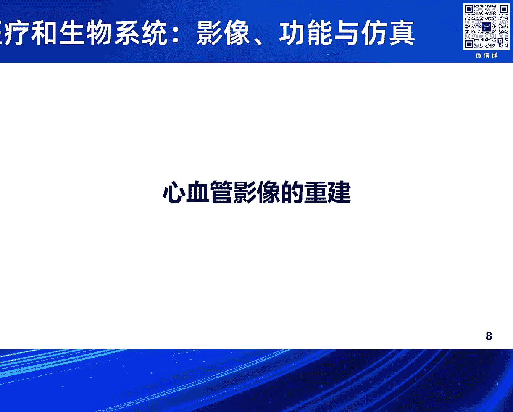
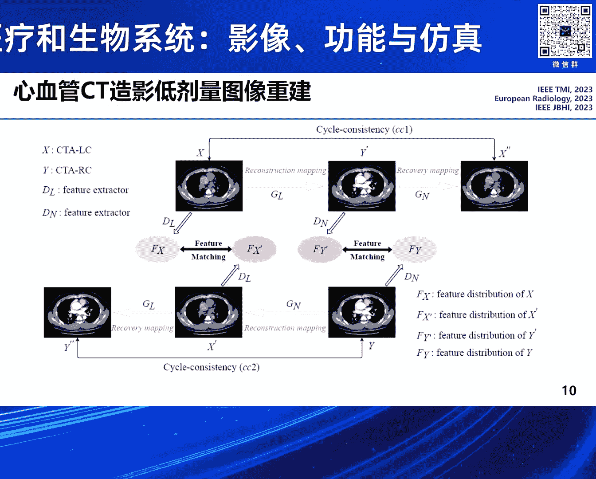
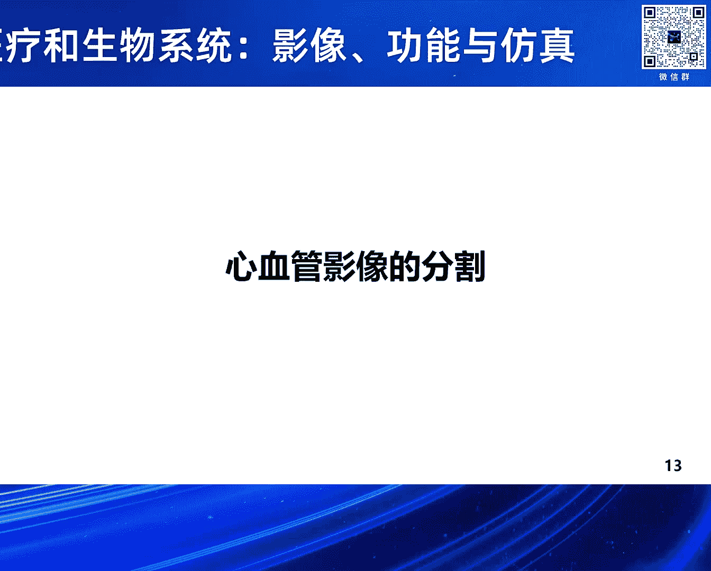
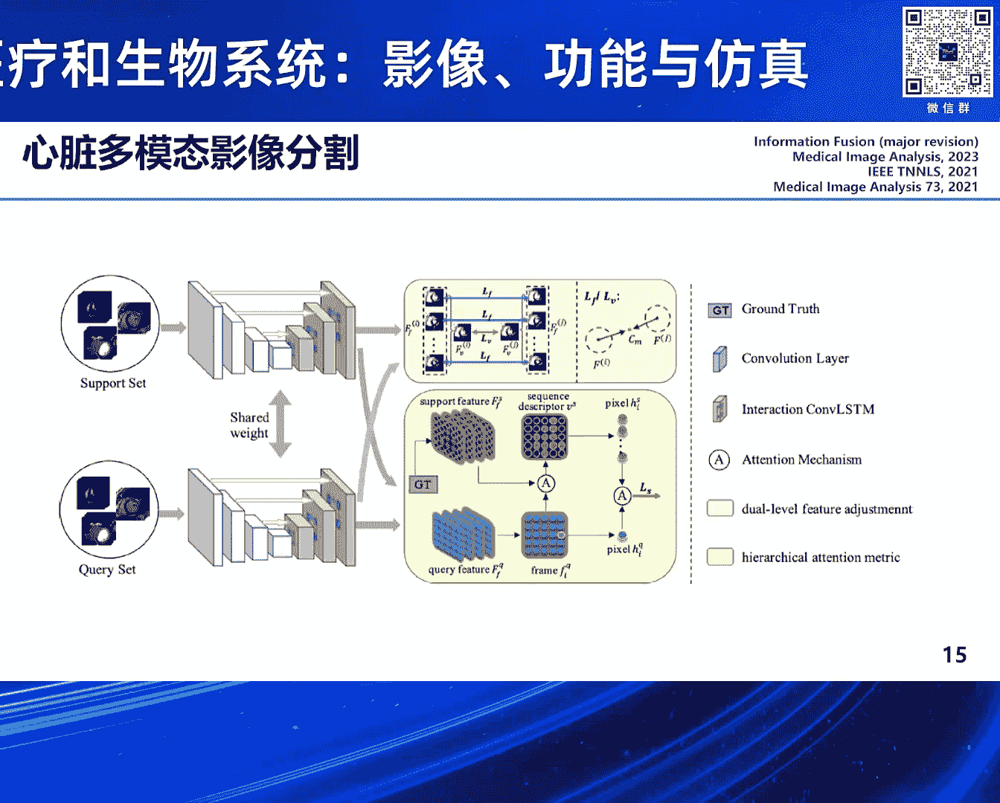

# 2024北京智源大会-智慧医疗和生物系统：影像、功能与仿真 - P3：健康信息学定量分析研究：张贺烨-主持人：马雷 - 智源社区 - BV1VW421R7HV

好各位嘉宾各位专家，我们接下来欢迎张赫燁教授为我们做报告，张赫燁教授现任中山大学深圳校区生物医学工程学院教授，他主持的项目包括国家洁清项目，国家万人清拔项目，国自然联合基金重点项目。

广东省洁清项目和广东省科技厅人工智能重点专项项目，他主要从事健康信息学定量分析研究工作，以临床健康信息需求为驱动，推动并发展一系列健康信息定量分析的技术与方法，截止目前发表学术论文已经超过100篇。

申请或授权中国发明专利5项，获吴文俊人工智能科学技术创新奖三等奖，和浙江省科技进步二等奖，张教授的报告题目为基于机器学习的心脏影像处理，我们用热烈的掌声欢迎张教授，(掌声)，(音乐)，谢谢张老师的邀请。

在金老师后面做报告压力非常大，我尽量去讲好，我今天主要的报告是基于机器学习的心脏影像处理，我们为什么关注心血管的疾病呢，心血管疾病一直还是全球，当然在中国的死亡率还是最高，但中间其实有一个很小的差异。

让我们意识到我们做这些研究的一些意义，从这张1990年到2017年的中国城乡居民心血管疾病死亡率的变化，我们可以看出大概在2012年的时候，农村地区的死亡率开始远高于城市地区。

那意味着我们一国有一些很好的图像处理算法，或者无创的诊断的方法，我们可以在医疗条件相对落后的农村地区进行应用，所以我们就是，我就觉得我们可能做这些研究的一些意义和方向。

那我们为什么关心心血管的心脏影像呢，我们先来看一下，对心血管的图像来讲，有非影像的筛查心电或者血压，影像诊断有超深的CTMI，它们更好地提供心血管的心脏的结构或者功能方面的信息。

所以我们就会觉得说在做图像的分析的时候，一会儿能把机器学习应用进去，极大地提高图像的识别和理解，帮助医生诊断的过程，那我们在，当然很自然，在我们医学图像处理上。

我们最常见的是把计算机视觉的技术给拿过来再用，那我们其实大概看了一下，我们发现在计算机视觉里面，比如说做目标的定位，做目标的分割，还有做视频的运动追踪，其实跟这个医学图像都有很多类似的工作。

比如说做定位的时候，我们在看做心脏的定位，在做分割的时候，我们做这个管枪，这个内膜外膜的这个分割，运动追踪的时候，比如在这个spark tracking，这一超声里面是做了非常多的，那多视角的分析。

比如说最简单在那个树中的DSA的这个识别上，其实也是做有很多的这个应用的可能性，但不是说我们把这个计算机视觉的技术给拿过来，我们就一定能用，比如说我们最近我们也试过用那个Meta的。

那个SAN Segment Anisim这个模型，去试过超声的这个图像，不是在那个心脏超声的图像上，还有包括那个IOS的图像上，其实它的这个效果还不一定特别好，还需要进行的进一步的这个调试，对吧。

但在这个医学图像里面，还有很大的一个问题是，它因为成像的机制差异特别大，比如说超声是用超声波的反射的方式来进行成像，CT是透射的成像，衰减成像，MI其实是电池的这种，电磁波的共振成像。

但前面的大部分的这个计算机的视觉技术，都是基于这个自然光的这个成像，那既然这个图像成像机制的这个不一样，必然会对这个图像处理的这个方法，会提出不一样的挑战，那更重要的在这个心血管图像里面。

我们不能简单的只关注这个结构的这个信息，还很重要的是关注这个功能学的信息，比如说在这个血管里面的血流的流速，还有它的这个压力的状态，对吧，这个希望我们能从这个结构的图像上，能够去把它无创的计算出来。

这也是医生很关注的一些点，那所以在我们的里面，我们通过对这个计算机领域，还有医学图像领域的调研后，我们觉得在这个自然图像里面，它要做到这个泛化性的，其实经常干的两个比较好的一个方法，就是有改进学习模型。

比如说现在增加这个大数量，进行这个大模型，那在这个医学图像上，特别是一项一项改进这个学习模型，我们当然可以从计算机视觉里面，去学到很多新的基础来做这个新的学习模型，但受限于现在这个医院的。

这个数据量的这个问题，这个数据量在医学影像上，一般是不太可能得到大规模的，超大规模的这个数据量，所以这个数据训练样本，本身是个受限的情况下，那怎么去实现那个泛化性，那就变得很有挑战的一个事情。

所以在我们组里面，我们很重要的一个想法是，引入新的知识，那新知识包括这个结构结构相关信息，那图像信息是哪些，就是我们组里最近一直在关注的，像物理信息，比如说我们怎么把流体力学方程，还有这个机器。

这个力学方程，还包括我们电视力学方程，怎么嵌入到这个学习模型里面，那把这些物理信息的模型，嵌入到这个学习模型里面，有助于我们去降低对这个样本的需求量，那这样呢，你把这个新的知识加到了这个模型里面。

那你很必然的，你要针对这个样本量的小模型，去做这个设计，那你会发现，你不需要去针对这个样本量的设计，去做这个设计，那你会发现，你不需要去针对这个样本量的设计，去做这个设计，那你会发现。

你不需要去针对这个样本量的设计，去做这个设计，那你会发现，你不需要去针对这个样本量的设计，去做这个设计，那你会发现，你不需要去针对这个样本量的设计，去做这个设计，那你会发现。

你不需要去针对这个样本量的设计，去做这个设计。

那你会发现，我们最近关注的一个点是那个照影剂，我们最近关注的一个点是那个照影剂，当然我们这个照影剂不是指那个S光的辐射剂量，是在做那个CD成像，所以一般会把那个照影剂，注射到你的静脉以后。

然后再推到CD里面去进行那个成像，那这样的这个照影剂，一般它是对生动脉的那个循环有问题的人，或对生动脉有一些影响的，那医生很自然地希望说，是否可以用比较小的少量的这个照影剂。

能得到高质量的这样的这个成像效果，所以在我们这个里面，我们就得到了安生医院影像科的这个支持，所以他把这个病人进行了多次的扫描，当然这个扫描的剂量是符合那个伦理的要求，那这样的这个病人。

一个是注射了少量的LODOS的这个对比剂，还有正常剂量的这个对比剂完以后，我们去看这个主动脉的这个结构像，是否是合适，然后这样的话你可以看到，我们就通过这样的一种方式，可以小量的照影剂。

重细高质量的这个冠状动脉的这个图像，这样的工作以后能重建起来，那至少不是说假设能减少到50%，那就意味着这个整个照影剂，在安生医院的话，那至少可以减少一半，那这样的这个市场价值是很高。

所以在我们的这个方法里面，我们同样是用的是CycleGAN的方式，进行这个对比，那因为这个的确是个Unpaired的一个数据，所以我们有一部分的这个病人，他可能有一部分的病人是少了两种的图像。

有一部分病人是只少了一种的图像，然后我们用CycleGAN的方式，把这个配对和不配对的图像进行学习，大家可以看到我们在146个病人上的数据，就是量化的这个结果，这可能这个数值上展示不是特别直观。

我们来看看这个图像的质量，这个图像质量你可以看到，我们把这个低剂量的图像重建好以后，放到安生医院的影像工作站，然后进行这个主动脉的重建，所以这个重建是用标准的流程来看做出来的，你可以看到在我们这里面。

这个是超低剂量的，这是低剂量的，然后我们用这种方式可以看出来，这个诊断的这个重建出来的主动脉的效果，还是非常清晰的，完全是在这个病人所能够接受的状态。

这篇工作的图也是发在European Radiology，安生医院他们牵头发的一个工作上，所以通过这种方式，从视觉上还有质量上这样的重建方式，就意味着人工智能的确是能提高重建的质量。

能降低病人的对比力的涉入，图像的分割是我们很自然的一个基础性的工作，一定要把这个图像分割做好了以后。

才能做很多后面辅助诊断的一些工作，在我们里面我们主要关注的一个是，如何把多种模态的心血管的影像都利用起来，因为在医院里面，就前面金老师讲的，可能这个医院有大量的超声数据，那个医院有大量的MRI数据。

但这个医院可能就有稀疏数据，这些模态之间不同人之间的多模态数据，是否能够利用起来，一个多模态数据分割能利用起来，其实对结构性心脏病或者CRT的治疗，其实很有意义，在术前的时候。

这些病人他做超声或者做MRI，他其实医生都希望说，把不同模态的心脏的影像分割好，再融合在同一个病人的结构上，然后对CRT的治疗进行更好的，提出治疗的策略，在这里面就碰到一个很自然的问题。

比如超声大概200多块钱，CT是1000多块钱，MRI大概是1000到2000这样扫描的东西，那你这数据量在一个中心，其实收集起来就很难，我们就希望用Metal link的方式，把不同模态之间的数据。

它其实共有了一个，很共有的一个信息是心脏结构，不管你这个人不同的人，你的心脏一定是四个腔室，两个心室两个心房，这些结构的信息，把我合在里面以后，其实能帮助我们去看到，不同模态之间的，心脏的结构的信息。

同时还能看到，不同视角的心脏的信息，这样的工作其实是一个很简单的，Meta的网络结构，这个网络结构就不具体讲了，如果大家有兴趣，可以去看一下我们的TMLS，和Metal image的文章。

但你可以看到我们在两个数据，刚开始我们在一个小的数据，2018年的公开数据，CT和超生，CT是安征医院的私有数据，超生是我们在深圳医院，和广州路径总医院，再单独采集的数据，所以你看到我们这个数据里面。

有MI和CT超生，最后的心内膜心外膜的分割路，是比较吻合的，这个精度展示在这里，然后这是我们最后的，分割的结果可以展示，你可以看到这是ground truth，最后这是我们的结果。

结果的分割程度比较好，最后我们讲的像是，我们主力很重要的一个工作，是怎么做功能学的定量评估，功能学定量评估，其实在数学上看，其实它是一个逆问题，因为功能它是决定了你的结构，包括你的临床的观察。

但其实我们在临床上，我们大部分可能得到的都是观察，怎么通过观察的数据，反推去得到的功能，其实这个挑战很大，它是一个逆问题，逆问题其实是个病态的。

大部分是病态 很难求解，在这里我们主要做的是，首先今天讲的主要是，以冠脉血流处分数来做个例子，血流处分数的定义很简单，它是狭窄前后的压力的比值，比如说这是远端的压力，比上近端的压力，正常的时候。

如果这个地方没有狭窄的话，Fvr应该等于1，但如果这有狭窄的时候，Fvr就会降低，降到小于0。8的时候，必须要放支架的治疗，那美国Hot Flow的公司，它是用流体仿真的方式，做这样的技术。

比如说它可以通过流体仿真，网格化了以后，去再算出这个狭窄地方，小于0。58，那就意味着就要放支架，那整个过程是完全用流体仿真干的，是用数前的CTA扫描来做计算，那不是说做介入的导线的压力治疗。

所以这个技术很有意思。

那在我们这里，我们首先也试了它这个技术，但我们用了一些，改动了一下它的流体边界条件，先做好这个仿真，所以你看到我们把这个，二级血管我们其实用的很少，但它在Hot Flow的二级血管，用的可能多一些。

我们把这个重建完以后，做Mesh，用新的流体力学的边界条件，去模拟打那个线杆的情况完以后，再把这个压力的值给计算出来，然后我们在这个221个人，这应该是301的数据，然后你可以看到我们这个结果。

吻合度还相对比较好的，这篇工作也是发在，Medical Fix上面的封面文章，对 Medical Fix上面的封面文章，但这样的仿真做完以后，其实对我们来讲，我们还有一个很有意思的想法。

说那我们能不能用深度学习，替代这个仿真，让深度学习学习物理行为，那其实这个在经济视觉里，已经开始在做，比如说在学习小球的运动，学习流体力学的这个pattern，其实已经在用深度学习，去干这个事情。

那我们在这里面，我们就采用前面我们做好的，流体仿真的模型，来产生这个训练样本，请注意我们所有的训练样本，都是用流体力学模型来产生的，就没有一粒的病人的数据，然后这个时候我们在训练的时候。

我们用了一个树状的LSTM的网络，它去提取血管的形态，然后这样的时候我们训练，我们仿真数据产生，这个训练样本是仿真数据产生，那我们训练的时候，是用LSTM去学习这个仿真的数据，那这个时候训练数据。

是包含了仿真的血管结构，和仿真的压力的数据，那1比1匹配我们学好完以后，测试的时候，我们完全用的是真实人的数据，那这个对于计算机模型来讲，是很有意思，它的训练数据和测数据，完全是不同源的。

那更难证明这个模型的分化性，那当然这个工作是我们当时，跟那个深圳科亚一起合作，很重要的一个工作，包括这两篇文章，都是跟他们一起合发的，然后最终我们在，180个人的这个真实血管数据上，这都是测试数据。

那训练数据是13000人的仿真数据，你可以看到我们不论是在，Cut-off是0。75或者是0。8的时候，我们的AOC值的效果都很好，当然这个后续，那个科亚的时候，他们做了更大的训练，超过了那个。

在拿闪耐症的时候，已经做得更准确 更好，这篇文章是在，Neural Network上发的时候，当时我们就用了，这么小量的数据，做的这样的效果，那我们后期呢，在灌卖工人多参数，比如说在做IMR这块。

我们这个工作应该是，应该很快就要投出去了，跟那个西南医院合作的，那个主动脉这块，我们跟北大 北一三院的官员，我们应该要投出去，所以如果大家有兴趣的话，可以关注我们的工作，也希望后续，跟大家进行多多合作。

谢谢大家，这是我的邮件，再见！谢谢大家，谢谢大家，观看更多「時尚高潮」頻道，搜索「時尚高潮」專頁。