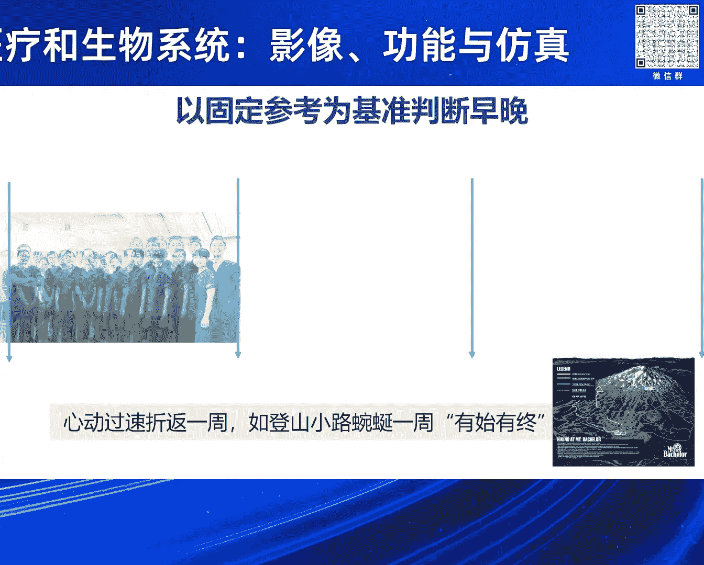
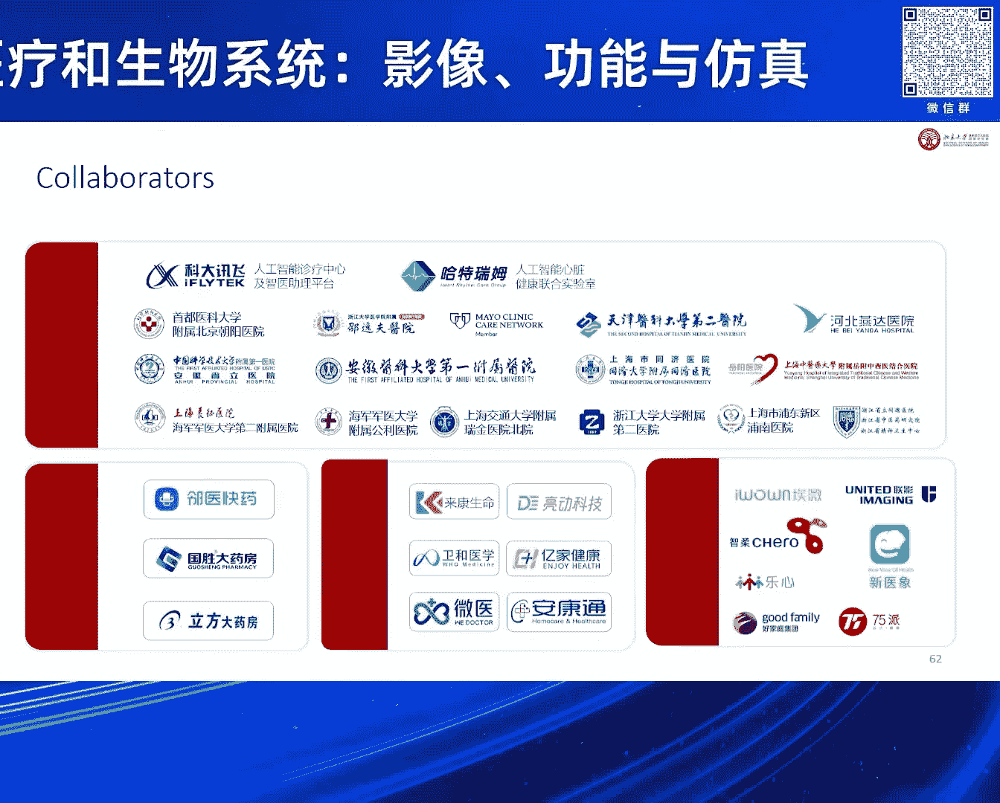
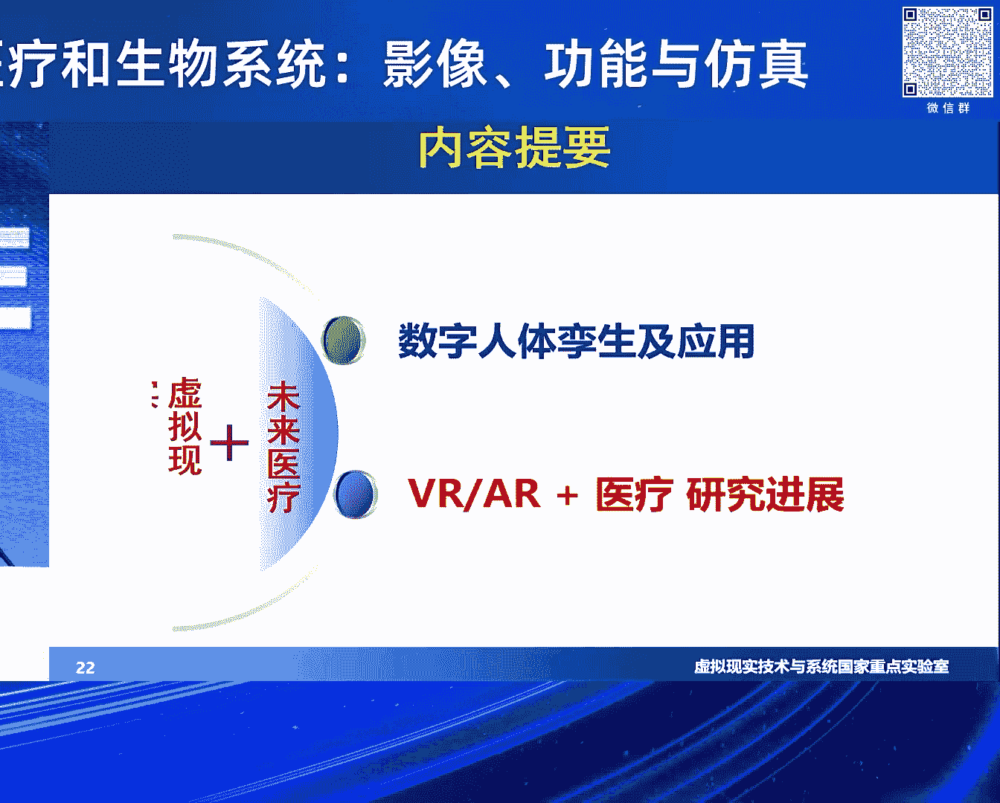

# 2024北京智源大会-智慧医疗和生物系统：影像、功能与仿真 - P8：智慧医学与生命系统目前挑战与应对策略 - 智源社区 - BV1VW421R7HV

尊敬的各位专家，接下来我们进入下一个专题，下一个专题是智慧医学与生命系统的挑战与应对策略，我们的第一位讲者来自朱天刚教授，朱天刚教授是北京大学人民医院心血管内科主任医师，超生心动图示主任。

长期从事心血管疾病的临床科研和教学工作，擅长先天性心脏病，心肌病，风心病和冠心病的诊断和治疗，现任美国超生心动图学会终身荣誉会员，亚太超生心动图协会执行理事，中国医疗保健国际交流促进会常务理事。

中国医师协会超生心动图工作委员会副主任等职务，在European Heart Journal，HeartRhythm等顶级期刊发表论文150余篇，朱教授的报告题目是。

超生医学人工辅助智能诊断的困惑与挑战，有请朱教授，谢谢红柜教授的邀请，非常高兴第一次参加人工智能这个大会，以前十几年前参加过一次，医疗大数据的这个研讨会，当时我就觉得当时的医疗大数据。

不是大数据而是数据大，到现在目前我感觉仍然是数据大没有大数据，因为我是今天刚刚收到，宁芬市中心医院他们一个体检中心，4年的体检检查的结果，发给我的有16万接近8000个人次的数据。

结果篩查出来结果大概一半的人不能用，一半人不能用，所以数据很大用不了，今天跟大家一起来分享，人工智能在心脏影像方面的应用，我觉得人工智能在医学方面有很多热点，就是大家可能在这个跟医疗环境里面有关的。

可能一个是做服务管理层，比如说那个分诊问诊现在做得很好了，另外还有就是辅助诊断这个层次，就是诊断工具，怎么去应用一些技术做一些医疗规划的，还有一个就是智能知识的提升，这个也做得比较好了，这是班门弄斛。

大家都是这方面专家，我想就是咱们需要人工智能驱动的话，一个是要大数据，第二个就是大模型，第三个是大算力，这个都是我们目前国家重点扶持的。

大家可以看就是说我们人工智能领域，在医学领域的应用是非常受了重视的，有医学影像智能诊断，有语音的电子病例癌症的智能诊断，这个已经是非常热门，但是人工智能加医学影像的话。

现在目前就是说在放射科是已经非常好了，就做肺结节，还有就是大家经历过三年的疫情，大家一到医院去可能就是给你做个胸片，做个胸片，然后查肺部有没有感染，同时的话在照胸片，照CT的过程中。

可能发现你的肺部一些病变，这样子的话就可以很快地给你进行诊断。

目前有些公司已经做了这方面很多的研究，大家可以看一看我们这个应用场景，主要是说我们这个病人就像刚才，李建平主任讲的一样，这个病人如果胸痛来了之后，我们怎么样去，第一个就是问诊，就做影像检查 做化验。

这是我们的医疗场景，如果是心脏病人的话，通常是第一个想到要做心电图，第二个想到要做一个心脏超声，做了心脏超声发现有问题的时候，接着可能就做一个CT，或者是做一个CTA，就是关门动脉血流。

关门动脉下降的评估，如果这个病人有缺血的话，他就是做一个心肌灌注的评估，还有就是，或者做一个心肌核磁，看他心肌有没有纤维化，那么这样子的话，大家可以看到这个医学影像，最后要到医院去，需不需要做支架。

也要做一个关门照应，大家看看就是说，这是铁路警察各管一段，相互不干涉，实际上心脏是一个整体，大家知道心脏的话，它是有自己的传导系统，它电传导，就刚才很多专家讲的，第二个它有机械系统，就是半膜关闭。

把血给它闭住，不让它出去，不让它反流，这是机械系统，同时的话它也有什么呢，它有内分泌系统，它自己还可以分泌一些激素，另外一个它有管道系统，大家可以看到，关门动脉狭不狭窄，有没有这个。

所以它是一个完整的独立系统，我们现在人为地把它分开了，人为地把它分开之后，你现在用大数据来做它的话，你最好是能够把这些数据，能够融合成一个平台，这是我自己理解的，还有比如说心肌核数。

看心肌代谢是不是有异常，所以这些都是我们需要将来，可能把它整合在一起的，所以医学影像就是，贯穿了整个的诊疗过程，包括我们诊断之后治疗，治疗之后的这个，临床预后和评估，都会什么，都会跟着有关。

所以大概医学AI团队，可能这些专家的话，都是第一位专家，就是做放射的，这是院士，第二位专家的话，是做甲状腺，超生的AI的，后面两位专家都是做放射科的，AI的，但是对人心脏超生这一块，就是说很难去涉足。

以前跟王光贤，叫做我们叫做事果，事果就是这个里面有很多的问题，所以今天想有这个机会，大家如果说是能一起合作，我觉得可能把它做得很好，但是有很多企业和很多的公司，都在做这个医学影像。

真正能够推到临床应用的。

实际上还是极少数，那么就是国内外的各种影像公司，主要是集中在放射科，少数的公司是用于治理病理的研究，另外隔壁的公司，都是做心脏核医学的研究，有一些公司治理超生，但是全都不在心脏，至少我们国内的公司。

但是美国的一些公司和欧洲的一些公司，它已经开始把人工智能，能够植入到机器里面去了，就是说做一些简单的水分数的评估，应该说在十几年前，美国硅谷有一家公司，曾经希望在中国跟我合作。

来做一个人工智能的自动分析系统，实际上它的一个系统非常好，最后没谈成，它就是有一个远见，我们只要把超生图像，把它一抓 抓到那个Fold里面去，它就自动地算出色影分数出来，它做了个颈动脉。

颈动脉的超生大概是从下往上扫查，你这样把所有的图像一抓到Fold里面去，它那个远见里面去，它就自动地给你三维重建，然后斑块给你切割什么东西的，那个就是十几年前已经做得非常好了，但是可惜就是国内的公司。

我跟很多的科研院所，比方北大的新科院，以前是黄荣祿院长，当校长，现在调到中南大学当校长去了，还有就是清华的，还有中科院的，但是一做起来，几乎都是半路就停掉了，因为遇到很多困难，那么现在困难在哪个地方呢。

就是为什么就是说，我们那个超生星动这个影像，在国内的一些公司往往缺布，第一个就是图像存储，这个量比较大，我就讲一讲为什么这个量大，就是我们曾经就更新一个信息系统，更新后我们把所有。

就是一天的检查的超生数据，直接传到我们医院的云平台的一个，这个服务器上面去，结果不到一个礼拜，第五天，当了，全院的这个服务器就停下来了，所以这个量特别大，就是这一般的服务器它存储不了。

另外一个就是标准化和规范化的图像，这个流程不一样，各个老师教的不一样，有的是先打一个长轴，有的是先打一个短轴，有的是先打心肩四腔，所以就是你每个医院都不一样，另外就是获得数据的确定的，这个标划也不一致。

另外就是结构化的数据也不统一，我们曾经计划就是把北京大学，十家的这个教学医院，包括我们附属医院，曾经想把那个超生星动图的这个报告，能够统一，结果我们讨论了半天，结果我们北医三家自己都统一不了，为什么。

因为不同的医院进来了公司，做的工作站 做的服务器，做的这个超生报告的服务器，都是不一样的公司，你要把三家公司统一把它弄在一起，基本是不可能的，所以就是说后来也没办法了，这就是不了了之。

所以不同的疾病的话，获得的数据的再定义和结构化数据的变化，它也是不一样的，就像我们大家看的就是说，你说你胸疼，胸疼的话大家可以诊断可能是一个心肌缺血，但是还有可能不是心肌缺血的。

比如说食道有问题的时候他也胸疼，比如说我们得了这个，就是那个，脾肌炎的时候也胸疼，还有一个就是我们刚前三个礼拜，一个朋友的父亲，他老是心疼半夜疼，然后就是做了一次关门照应，结果过两天还是疼。

关门照应是阴性的，结果没办法医生又去做一次关门照应，做一次关门照应结果是什么呢，也是正常的，再把那个病人就做一个心电图的时候，做个超生心动的超生医，拿起来是什么，带种炮诊，就是一个病毒感染。

做了两次关门照应，所以我就是说，有些数据只能说明是具体的数据，但是我们真的需要把所有的临床，和其他的数据都要整合在一起，还有就是我们需要，算法上面有突破，不同的疾病可能需要不同的计算模型。

这样因为他们的数据性质是不一样的，还有就是不同的医院的影像学的数据，同质性的差别比较大，我们就觉得这个超生心动图来讲，三不 三无，我老是跟他们讲你们三无，一个什么没有心电图连接。

不知道哪个是收据期哪个是收据期，有经验的可能性，那你做收据末期和收据末期的定位，那一针，这个如果不接心电图的话，也是有问题的，所以就是说不入狱之病人基本信息，还有就是流程，就是个性起到随因所欲。

基本测量参数不统一，重要的这个测量参数有缺失，还有这个缺乏统一的结构化数据，报告这个超生报告的文字格式，大家也不同意，所以描述起来也是五花八门，所以另外就没有中国的这个专家共识，所以就是很多情况下。

我们是借国际的一些经验，所以我们时不时。

遥望星空哀叹，还是我们要付诵底力前行的，所以就是说我们只能借助国际上的一些经验，来做这些事情。

我们想就是说我们自己是刚刚开始，甚至有很多做得非常好的美国人，这是中国的这个清华大学王莲依教授，他们曾经做了一些这个图像的自动识别和这个深度学习。

另外的话还有其他的专家也做了这些东西，就是美国的一些专家，对这个超音信图像进行分类分格。

以及这个定这个这个标注定位，他也做得非常好。

这是我们看他用各种的这个算法，或者神经深度学习的模型来进行这个就是计算。

这都是做了很多的工作。

但是这大部分都是在国外做的。

所以我就想就是说这个是超声图像，可能需要我们用不同的这个技术来进行这个计算。

所以我们想的就是理想的话是比较丰满。

现实很骨感，就是我们能够做些什么，第一个就是说我们希望就是工程，工作流程的规范化，那么这个是可能跟咱们没关系，但是我觉得我们可以就是倒闭厂家，将来可能就是在这个做超声仪器的时候。

把一些标准的图像怎么第一步第二步，第二个数据获取和定量分析的这种标准化和规范化，还有图文报告的结构化和规范化，这个是需要我们将来去做的，所以我们希望就是说这个图像这个获取和流程的这个标准化和规范化。

有利于统一的图像，但是现在的有一些这个公司的话已经做出来，就是我们不需要信念图，就是我们自动识别收缩器和舒张器，来进行这个自动的这个内膜的勾换和标注，然后就是对这个心脏进行切割。

所以我可能我觉得就是将来可能这是最现实的，对中国人是最现实的，因为美国人和欧洲人做一个超声线图是45分钟到一个小时，中国一个小时要做一个超声线图，你几乎就没法活了，医院就把你开掉了。

咱们五分钟做一个病人都是算快的，算是慢的了，有一次美国的这个ACE的主席，就是美国商业主席到我们来参观，参观的时候我们的病人下就上来，他走了就说两个词，一个是叫terrible。

第二个词就是unbelievable，所以他觉得是可怕，那是太可怕了，所以咱们就是现在医院的这个工作量非常大，所以临床医生基本不接信念图，为什么不接信念图，就是不接信念图，就是用于接信念图耽误时间。

所以我觉得就是可能，我们可能就是说有一些新的突破。

就是说我觉得可能，还有就是面临着一些问题，我们面临着一些问题，一个是刚才就是很多老师也讲过，就是数据的隐私和安全，医院是对于一些图像是有限制的，它不是说可以公开发给你。

还有一个就是缺乏高质量的图像标注集，我们国内基本上没有，就法院都没有，我这个法院审稿的时候，我说你们怎么自己不建立这个数据库，他说我们用美国的数据库，我就把那个文章给他K了，不能。

那么要缺乏解释的透明度，也就是说我们医生不能得AI的结果，来进行解释的话，你这样可能很麻烦，还有就是模型的泛化能力是有限的，就是各地差异比较大，你要想普世性的话，可能就是不同的疾病，我们要建立模型。

我觉得就是说无论是对冠心病，腺心病肺活性疾病或者是什么其他病，所以就是说还有一个就是，有些新的技术在更新。

我们要适应，也就是多模特影像，我们综合评估，我觉得将来大的可能性。

这是一个病人，我们看看这个病人的话，他的发现心肌梗塞，然后就是后来也出现失忆中毒症，然后这个病人的话，就是看大家常常有操伤，他这里面就这么多数据，那么入院检查的时候，心肌损伤标志物数据，血连的数据。

床床操伤的数据，还有CTA的数据，还有心肌核数的数据，还有操伤性脓疏，这些数据都是对我们诊断这个病，或治疗这个病有效的。

所以就是说这个病人看，一诊断十几个病，你说你AI怎么去算它，你怎么去评估它，需要大模型，需要不同的模型，我们来进行评估，所以我们看看，这个操伤心动只是一个方面，所以我觉得就是说，可能我们关门CT。

这个关门照影的结果，我们怎么去读它，这个就是说我们看，这个操伤的报告，还有就是这种评估，这种描述，所以我也想就是说，我们可能将来发展方向是，操伤加上AI，这个就是主要是动态的连续的数据处理。

另外一个就是操伤心动毒是，操伤里面的难上之难，所以我将来就是说，应该有人现在研发机器人，做这个GCB来进行扫查，但是这个还很遥远，但是我觉得就是云平台，加上这个AI的大数据，或者是大模型。

不同大模型结合起来，我觉得将来是，我们可以突破的。

好 谢谢大家，感谢朱教授的精彩报告，接下来我们第二位讲者来自龙德勇教授，龙德勇教授是首都医科大学，附属北京安真医院主任医师，心律失常中心主任，兼任中国心律学会的副主任委员，中华医学会心血管病。

分会青年委员会副主任委员，主要从事心房颤动等疑难病例的导管消容，参与或者承担国家级科研课题，二十余项发表SCR论文一百余篇，或国家专利十余项，龙教授的报告题目是，计算机模拟技术在心律失常诊疗中的应用。

有请龙教授，谢谢 非常感谢介绍，也非常感谢张老师邀请来参加，这个关于志愿这个活动，对我们医学来说呢，我们现在特别流行，是拥抱人工智能，因为我回顾人类历史，最新的科技总是用于两个方面，一方面就是医学。

另一方面非常不幸，都是用于战争，一个是K-need 一个是Saving，我题目稍微变了一点，其实内容变化不大，我们心理处长是个什么专业呢，我们那个学名叫心脏电生理，上来就是电。

我们心脏其实跟这个房子是一样的，有门窗 有结构 有墙壁，有下水管道，那也有这个电线 电灯，那我的专业就是管电 电灯的，我们心脏的电跟大自然的生物电，没有任何不同，是完全一样，只不过它在人体是个非常弱电。

那么对于这个心理处长呢，其实人体获得关于心脏电的，很早的一些理解，比如说刚才有个教授讲了，关于细胞电生理，细胞的每个电位，事实上第一份获得心电图的一个人叫，是一个荷兰人叫Esserin。

他通过做了一个这样的一个心电图集，把心电图展示出来了，当然这些具体的方式我就不讲了，实际上在我们，这个心电图它展示的是什么呢，我们整段心理治疗我们就靠心电图，那么心电图实际上它展示的是两个方面。

一个是时间的向量，因为在心脏的不同的部位，它收缩 就是发电的时间是不一样的，它这个电是有顺序的，对于一个正常的人，它非常规整 非常有顺序的，那么我们通过一个秒计的装置，可以把这个心电图给记录过来。

我想我们每个人，几乎每个家里边老人他去医院的话，经常会做心电图，这是一个非常常见的检查，实际上我们心脏病最常见的是什么病吧，是心律失常，很多中国人都认为是高血压，事实上心律失常的发病率要远远高于高血压。

大家可能很多年轻人都有一种感觉，晚上熬夜了，比如说要做个毕业论文了，喝咖啡 喝了很多咖啡，觉得自己怦然心动了一下 是吧，其实那就是早波，这个早波就是心律失常，所以我们有时候经常开玩笑说。

怦然心动不一定全是爱情，有可能是心绪长，就是这种，总之它是非常常见的，如果你要做一个筛查的话，那么心电图其实它除了反映时间的向量之外，它也反映一个空间的向量，为什么呢，因为它整个心脏的电穴的出击方向。

是有一定的固定的方向的，那么我们知道我们要做心电图或者做体检的时候，你要接胸前要接一些导链，四个肢体要接一些导链，像这个导链是一个立体空间的，反映了XYZ轴上不同的出击方向，它反映了这样一个概念。

但是呢，当你做完心电图之后，你最关心的是，对一个非医学界的人来说，你最关心的是，就是这一项内容，我的心电图是在正常范围之内，但是实际上心电图机它看到的是什么呢，它看到的都是这些参数，这些参数就是什么。

实际上是最简单的人工智能，那么心电图机就根据这些参数的，是否正常来判断你的心电图是否正常，当然对于我们医生来说，我们还要结合，他的心电图里这个波形的变化呢，是不是有微妙的改变呢，我们要结合它有体型。

是不是以往有什么心脏病史，我们要结合去看一下，但是如果用人工智能的话，它或许它就能可以通过一份心电图，能读懂它背后的故事，这个背后的故事就是你是男的还是女的，你是高的还是矮的，你是胖的还是瘦的。

你的体型是什么样的，甚至它能根据这心电图微妙的改变，来预测在未来几年当中，你会出现什么状况，那么这就是人工智能在我们这个领域，最显著的一个应用，另外我说过我们使用心理智商诊断。

最主要的一个诊断工具就是心电图了，那么大家可以看出来，实际上对于这种波形的识别，那么其实人工智能的能力是非常强大的，它远远超出了刚才几位老师讲的，关于在核磁，在投入CT方面，这种它的可实现性。

它的能力会更强大，其实今天你看看了，也有很多关于心脏的东西特别多，像我们心脏科也是个特别大的专业，在我们人体里非常重要的器官，比如你经常听到说有人得肝病了，肝切一块，肠子得病了，肠子切一块。

甚至中枢得病了，也可以毛一块也可以切一块，至少他不是生命中枢都可以，但是我们心脏里很少说，听说哪个人把心脏切一块去治病的，心脏每一块都不可或缺，它不能切的，所以说关于心脏的研究总是非常。

就是占据了很大的临床医学的篇幅，那么人工智能它在我们的应用，它有个什么好处，它让这种临床的合理推断变为现实，比如刚才朱天刚老师讲过，比如一个人心脏肥厚了，我们要通过超声去确定，我的心肌是不是肥厚。

因为超声它就能看这个墙壁一样的，是不是厚，是不是薄 尺寸多大，它看它结构，那么或许我们通过心电图，我们可以预知到中间这个变化，我们可以越过这个中间的阶层，直接给它得一个临床结论，这就是在通过一份心电图。

它能实现的这些目标，那么其实在我们国内我们有一个团队在做了，曾经做过这种研究，就是通过人工智能来判断心电图，那么跟这个心电图医师进行对比，发现就是通过人工智能来读心电图。

还超过了这个心电图医师的这个水平，我们曾经有一年在我们心电图专科会议上，就搞了比赛，这个让机器读，那一张让一帮博士们读，最后是博士们大败，败于机器了，当然我想大家都能理解的这些东西。

就像当年那个奇圣跟那个AlphaGo败掉一样的，因为这些固定的这些模式，就像考医师证，说美国医师证考试，这个医生怎么也考不过，就真人怎么也考不过那个机器人，就这个原因，因为对于这种固定模式，城市来说。

我觉得机器它是非常大的优势的，那么在美澳，他们曾经有一个就是预测肥后应心肌病的数据，就通过心电图来预测肥后应心肌病，就像朱贤刚老师，他是做超生的，我们确定肥后应心肌病是肥后应，我们要看超生，要看核磁。

要看CT，但是他通过心电图来预测，发现他的复合率和特性都非常高的，尤其是对于年轻的患者，这个复合率更高，因为特别强调这个年轻患者，因为他的意义就在于，很多年轻人他不知道自己心肌肥后了，他参加各种活动。

尤其是进行体育运动，他会发生猝死，刚才夏老师曾经展示了一个图片，那个图片不是一个足球运动员倒在场上吗，大家知道那个人叫拉斯尔森，他是丹麦队的10号，他当年在欧锦赛的时候，他倒在场上了，然后装了ACD。

然后前面卡塔尔事业杯，我发现他依然在场上戴着队长的袖标，这种比较极端的故事，但说实话，或许他以前他要通过一些技术，因为一般的很多人体检，他不会去常规做这些细微的微妙结构，如果我们有一种能力。

通过他的常规体检的心电图，或许他发生这种猝死的概率的话，或许他在运动场上的悲剧就不会发生，是这样子，然后在我们心肌肠领域呢，这几年因为有出现了一个特别大的进展，就是说，我们知道心肌肠有一种叫防颤。

就是心防颤动，那北京的话就是叫什么，北京话叫心颤 对 心颤，这种防颤它最大的危害就是老中风了，因为很多人没有症状，他都以老中风为首发症状，而这个防颤引起老中风致残率又非常高，那很多人你想一老中风了。

我想一个家里面只要有一个老中风的，整个家庭都不会幸福了，全家人都围着他转，因为他没有劳动能力了，没有生活能力了，会给家人带来很多痛苦，但是我们给人群去筛查这个防颤，又不太可能，你想想全国14亿人民。

每个人给他做一份心灵图筛查防颤，这还是非常痛苦的一件事情，但是我想大家现在都做体检，很多单位都会体检，甚至入校也要做体检，但是可以通过你体检心灵图预设，你未来多少年中发生防颤的概率。

如果能通过一份单份心灵图来预设，你防颤发生的概率的话，那么就可以提醒你在，或者体检的密度要增加一点，比如不能像以前一年一次做一体检，我可三个月做一次体检，这样在防颤发作的时候，我可以及时发现。

可以避免这些劳作中的悲剧，实际上在我们心理学场里面，有一个特别大的应用就是，我们知道我们很多心理学场，上他的视频他不动了 当然，他其实在心理学场里面，有很多心理学场的发生，他都跟折返有关。

英文叫reentry，reentry就是什么 就转圈，他围绕这个跑道不停地转，他其实第一个关于心理学场的，这种折返的机制他就来自于什么，来自于计算机的模拟技术，因为过去人们对这种。

心理学场上的展示不是很清楚的机制，那么他们可以通过很多这种，把一些密集的电极放到心脏表面，然后通过计算机的方式来重建，那个等视图重建，这个等视图重建是什么重建的，大家都知道这个地形图的等视图。

比如说高度等视图，其实我后来发现，这个等视图不仅用于各个领域，比如海拔之外还用于气压气象，就是你可以看到每天的天气图，那也是一个等视图，比如哪儿下暴雨 那个地方红的，它也是跟这个道理是一样的。

那么我们通过这个等视图来分析，心脏的这种聚众顺序，你会发现它有优先的一些通道，就像就是说我们从出关中，总有一些必经之路，那么心脏也是这样子，其实心脏的这个电流的机动，特别像流体力学，流体力学是特别像的。

就是非常像的，这个不能动了的视频在这里，就是大家如果有机会去，你看一下小溪里边水，你会经常发现有一个漩涡，为什么这水往下流的时候会有漩涡呢，漩涡的原因就是前面遇到阻力了，一阻力之后它会回旋一下。

像水或电都是一样的，那电的流动是，电压高的地方向电压低放流，那么电阻越小的地方，电流通过性越好，那水也是这样子，如果我这个河沟很平滑的话，那水流速度很快，如果这个河道有很多石头的话，沙子的话。

或者河道很窄的话，它的阻力会很大，都会同样的这种情况，所以它和流体力学是一样的，我们心脏特别像这种方式，以至于我现在想，是不是要用这种方式来研究一下，我们房产的这种波形的存在形式，因为房产是特别乱的。

它不是规则的电流，它非常稳定的电流，不能动了，所以说没事，我就跳过来，那么，我们刚说到体表心电图是这样获取的，实际上我们获取这个心电图，在体表获取心电图，是成千上万个细胞，积累在一起形成的一个电的变化。

一个向量的变化，但实际上呢，对我们心肠医生来说，我们更关心，在每一个心动瞬间，我们心脏的每一个地方，它是如何跳动的，它的顺序是如何激动的，那么我们需要把电极放在心脏里面，一个电极。

这个电极就像普通的电线是一模一样的，原理是一样的，只不过是我们的设备的滤波范围是不一样的，因为人都是弱电的，它的滤波范围是不一样的，我们要滤掉交流电的影响，我们要滤掉我们其他生物电的影响。

事实上你眼睛眨一下，你手动一下，你都会有电的，我们要滤掉影响，但是每一个地方的电流它包括两部分，一部分是真正的，电极下面覆盖的细胞产生的电流，还有一个是临近细胞产生的电流，它是一个叠加电流。

如果你把电极直接放在这个地方，你是无法区分的，那么对我们来说，我们就要想办法去区分它，如何区分激动的顺序和早晚，但是我们在人体在描述激动的顺序的时候，特别像我们照一张照片，比如说我们这个团队。

好多年前我是在这个团队里面，这是我的师傅，是我老师马教授，说我们照照片会把老师放在中间，以他为中心照个照片，但是实际上，我刚才说心理上的折返，就像照一张照片一样的，有始有终。

那么我在做心脏顺序的描述的时候，我需要我描述的窗口，要cover到我整个心脏激动的窗口，就像照一张照片一样的，我这个参考我可以以他为中心，实际上，以他为中心的话，就是前窗后窗各占一半。

但实际上我也可以以他为中心，以美女为中心，以美女护士为中心，那么以他为中心的话呢，就是前一小辈 后一大辈，但是我cover的是同一帮人，但是其实实际上，就是这样一个情况，其实上我可以以我为中心。

但是cover窗口可以是这样子，但是前后人数没变，这就是我们对于心肌肠，它这种折返机制，它的理解的一个理解，如果你去hiking的话，野外徒步的话，你从这个地方，我们说我们从这儿出发。

要从沿着三角转一圈，要回到这个起始点，因为速度不一样，我们要回到同一个路径，我们大家再会合，它道理是一样的。

那么我们把这些理念付诸实施，来通过技肢折返机技术，我们就可以重建出，心脏的每一个激动顺序，就像雨点落下有前有后，但是这个雨点落下的有前有后，如果你不要依一个人为基准的话，那我们的海拔测定高低等视图。

都是以海对面为标准的，跟这个道理是非常相似的。

实际上我们在羌内的话，就是我们心梗后死宿的病人，刚刚夏老师讲过，这是我们特别严重的一种死宿，这个病人发心梗后死宿了，他急性心肝发第二株了，他的心梗就发得不停，什么药物都没有效果，我们叫电风暴了。

就是能卖的药物，世界上能卖的药物都没效了，上人工的那种心脏替代的时候，这个时候我们做死宿的时候，我们就发现我们把一个电极，这个时极放到这儿，呈现在我面前的第一直观是这个东西，你看这个电极。

你看这是同一个时空电极的话，它有早有晚，它是有顺序的，那么我们通过它自身的顺序的对照，通过相邻电极的对比。

其实我可以把这个顺序瞄击出来，瞄击出来之后，呈现在最后我面前我就知道，因为它不能转，如果能转大家就能看得很明显，我知道这个圈怎么转的，这个圈哪个地方是关键部分。

那就需要我去阻断它，实际上对这个构建的过程，就如同是，这是我们安宁院里，比如说一个大楼的整个照片，实际上如果你构建的话，你只是某一瞬间的像素的话，就是一个像素的构成，我构建的点越多的话。

那么它整个顺序通过点构成一个面，然后再构成了整个的这样一个，三维重建的这样一个顺序，其实过去我们都很难实现的，我们现在通过这些技术的运用，尽管它不是说一个完整的三维重建，一个人工智能的方法。

但是你会发现，我们用了很多很多这种算法的东西，来帮助我们去确定心理上的病因，或诊断，所以说如果在星星管领域，有一个特别大的应用能开始的话，我觉得一定是我们心理上的应用，我最近也在申请一个课题。

我不知道现在进入四进一了，我申请的就是关于这个人工智能的，我想做个什么东西呢，我想做一个跟我水平一样的医生，他在急诊可以值守的医生，就是因为很多，可能朱老师可能也知道，其实很多心理上的人，好多猝死的人。

80%都发生在院外，而他抢救成活率很低，而80%这些人他都是基层医生，很多基层医生看到一个心电图，他都无法确定到底是什么心动过速法，他该怎么用药呀，他打打电话或者是怎么一转诊都延误时机。

可能运到路上 病人就猝死了，其实我们要做一个这样的东西，就是让这个机器去读的话，它达到专科医生水平的话，这样可以显著地降低心脏死亡率，因为心脏死亡率是我们中国人死亡率低的原因，而这个心脏死亡率占了一半。

就在我们国家每年有200万，这200万人当中有100万都是猝死，如果有这样的话呢。

就是会有助于帮助，我们刚才说的三位重建，我们怎么去建它呢，其实我们基于GPS原理，每个人都有玩过这个游戏，有的人喜欢比如说2008年或者2010年，今天早上跑步，跑步的时候他就拿着他那个跑步软件。

跑出一个形状来，跑出一个数来，有的像女朋友情婚就跑一个，沿着公园跑一个I love you，我们经常听到微信上这样晒，上次我们重建的方式是一样的，我们有一个GPS原理，我们在体外模拟三个微信。

建三个磁场，然后一个导管的远端有一个传感器，它可以感受三个磁场的位置，就像你开车一样的，发现你在打车软件，一看车开到哪了，地图上箱子的位置都能看出来，如果你有机会让北京城转一圈的话。

那北京城的形状不就出来了吗，像我们这个重建的方式跟这个是一样的，然后我们就十一五的时候，我们做了一个国家的一个，这样的一个国产的这种设备，就是用于我们现在目前在，已经在武林厂应用的一个设备。

我们就是通过这种三维重建，过去我们心理医生要，X线下做手术，那么现在有了这三维系统的话呢，我们都是在这个三维系统下做手术，我们不用穿牵衣 你看，都不用穿牵衣，这样对我们医生也是个很大的保护。

其实我们也用了很多超生技术，但是我们的超生技术是枪力超生技术，我们要借这种超生做个三维重建，其实它，当然还不能，未来的这个超生技术它就可以，完全自动重建了，现在还做不到，现在需要我自己去辨别一下。

这是哪个结构 这是哪个结构，未来它这个都是全自动的，它可以全自动的做，我们跟苏州一家公司在合作做这个东西，就这个东西放到心脏之后，它自己能识别是哪个结构，当然也具有很多数据的学习，除此之外呀。

这个就是未来对我们来说做手术的，也不一样 方式也不一样，以前我们都是手动做手术，未来可能就是鼠标做，因为我们刚说了一个，我们心脏导管放到心脏去，它远端有传感器，其实它远端它可以做一个。

有磁牵引力的东西放到那里，一个体外磁场可以使它实现一个球面的运动，就是，不是360 180度，是球面这种运动，就是没有死角 全向那样子的这种运动，当然我们现在做了这个东西做出来之后呢，就是还有一点缺点。

就是还不能小心化，就是放在屋里边这个噪声比较大，耗电量也一小时都耗60多电，这个现在还要克服一下这些缺点，总之我只想跟大家分享一下，其实从我们医生来讲，我们特别想拥抱这些计算机的或者人工智能技术。

我也觉得在我们医疗领域，一定是有非常非常大的应用前景，我想在未来将替代很多急诊门诊的工作，它一定会实现的，当然我们也希望在座的各位老师，还有各位同学，希望你们能跟我们医学多拥抱一下。

希望我们能碰撞出火花，促进我们国家在这个方面的发展，谢谢，好 感谢龙教授的精彩报告，接下来第三个讲者是李清澈研究员，李清澈研究员来自哈尔滨工业大学，计算机科学技术学院。

主持参与了国家自然科学基金青年面上重点等多项科研任务，致力于利用数学和计算科学的方法，解决工程和生物医学的重大问题，研究主要方向是，应用计算机模拟人工智能等技术，更好的研究和治疗心血管疾病。

已在领域高水平国际期刊和会议发表论文60多篇，李教授的报告是，多病理阶段心肌缺血的多尺度建模与药物作用机制的研究，有请李教授，非常感谢张教授的邀请，感谢李帅教授的介绍，我今天的报告是做虚拟生理心脏建模。

然后用它来研究心律失常，就是刚刚龙教授讲的折返产生的机制，以及我们做了一些药物，看看哪些可能是特定的靶点，对治疗心律失常有作用，好，我的报告分为以下四个部分，首先第一部分是研究背景。

就是在心脏病里面有非常重要的一种心脏病，今天好多教授都从不同方面介绍过了，就是心肌梗塞和缺血，这个心肌梗塞和缺血它也是有一个发展过程的，在血管狭窄的过程当中，整个人的心肌的细胞。

它会有一个生理性的缓慢的这种演化的过程，在医学上大概分为这几个阶段，叫缺血一阶段，大概是缺血的0~15分钟，然后缺血一臂阶段，大概在45分钟左右，然后短期心梗几天，然后还有长期心梗。

在医学上，不同阶段的这些细胞或者是心脏，它的这种生理功能其实是不同的，然后这多种的病变，共同存在于人心脏里边的时候，为什么会更容易引起这种心律失常，就是在心肌梗死或者是急性心梗的情况下。

这种多发心律失常的原因究竟是什么，我们就希望通过这样的计算机模拟的方式，来研究这样的一个机制，然后看看能不能找到它相应的一些治疗的把点，怎么样去构建这样的一个模型呢，整个模型构建的这样的一个方法论。

大概就是我们要从底层的心肌细胞的生理功能，把它的产生电的整个过程给它描述出来，然后还要把整个缺血过程当中的这些病变的因素，同样给它描述出来，然后把这些因素集成到一个细胞里面。

然后再把一个细胞通过这样的电扩散的这种过程，描述到整个组织以及整个心脏上，去仿认它这个病变过程，其实有很多很多这种医学的数据，来描述整个心肌功能发生的病变的过程。

我在这个地方就简单地列了一下缺血EA阶段，当然EB性梗短期性梗长期性梗都有很多，然后基于这些数据，我们就可以对整个心脏这些离子通道，大家可以看前面有很多这种离子通道，以及离子的这样的一些浓度等等。

对于这些过程进行计算机模拟，当然这些计算机模拟背后涉及到一些复杂的物理学知识，我就不在这简单地不在这详细介绍了，通过仿真我们就能够仿真出，单个离子通道和它的这种动力学变化。

在正常以及这种病变的情况下的变化机制，然后再把它整合到，把所有的这些东西整合到一个细胞当中，就可以仿真出它的电的变化，当然你仿真出的，你基于一个电流的这样的病变，然后把它们全部集合起来。

能不能仿真出完整的细胞整个层面的病变，需要做验证，需要再一次地用实验数据去论证你的模型，对还是不对，这是第二次的验证，经过这两番验证之后，我们就可以构建出这样人在正常以及多缺血阶段的。

多缺血阶段的这样的心肌细胞的这样电生理变化的模型，大家可以看到左上角的这个图，在短期缺血或者是急性心梗阶段，心脏的细胞电动势都是变短的，而在长期心梗阶段，细胞的电动势是变长的。

然后有了心脏有了一个比较完整的这样的模型，有一个骚类的模型之后，我们不光要构建出这个模型来，我们基于这个模型能够做到的是什么，我们能够分析出在这个模型里面有这么多种离子通道。

有这么多种离子通道的控制参数，哪一些控制参数是对于我们心脏上电信号的某一个功能是至关重要的，它的敏感度是有多少，这是我们计算机擅长做的，我们通过这个就分析了，也简单举了一个例子。

就是一阶段的细胞的它的电生理变化的这样的敏感度是跟哪些因素有关，就可以分析出来，分析出来之后，我们接下来就可以仿真出这样的心律失常，就是一旦发生了缺血，是不是能够引起心律失常。

为什么能够引起这样的心律失常，为了做一个全面的仿真，我们做了两维和三维的这样的模型，两维的模型就是比较简单的，这种idealized的这样的组织，方形的包括了多病理阶段，它水平分布以及上面分布的。

这是两种情况，我们后面会讲到为什么这样的设计，最后再把我们的模型带到一个完整的真实的心脏上，然后心脏的数据，它是心肌缺血引起的这种斑横的数据，也是一个病人的真实数据，有了这样的两维结构的设计。

我们就可以仿真出两维组织上心电传导的过程，我们可以看出通过不同的刺激方式，我们给一次SESR的加快刺激，或者是在动态的快速的刺激之下，都可以引起上面折返螺旋波的产生，下面就是螺旋波导致波破裂的过程。

下面是我们仿真的心电图，大家可以看出一个人产生了心率失常，这是在第二种情况下，就是上面分布的病理状态的情况下，它也可以引起折返，从两边往回返的这样的一个过程，最终在三维心脏上也是。

我们在这样的一个刺激点上，给三次快速的刺激之后，也会引起心脏内部复杂的这样一个巅峰暴的，就是刚刚龙医生讲的巅峰暴产生的这个过程，仿真出来的这个过程。

大家可以想为什么会产生这种过程，人产生了缺血，当然为什么会产生折返，最直接的一种方法就是龙教授刚刚提到过的，有不同的路径，路径不同就会引起这种折返，但是我们在仿真的这个过程当中。

很多时候在临床上也会发现，其实病人的心脏结构并没有发生变化，也没有产生纤维化，那他怎么样，为什么他会正常情况下我们就正常跳，那他怎么产生的这种折返，我们就分析了不同的这种机制。

但可能在三维上分析非常复杂，但是我们的模型就有这个好处，可以把一些复杂的过程给它简单化，就是你在三维上传导再复杂，也可以分成两种情况，一种就是波从左往右传的时候，你的不同的缺血组织是从上往下分布的。

所以说它就是垂直于波传导的方向，另外一种上面就是你从一个左上角给刺激了，它波是均匀地往右侧进行扩散的，那你这样上面分布的话，你的波传导的过程跟你的病理组织分布，它是一个平行地这样传播的过程。

第一种就比较简单，因为在你垂直的方向上产生了不同的接贴状的病理分布，所以说它会在上下传播的速度不一样，就可能引起这种折返，但是第二种情况就非常特殊了，我在左上角给一个刺激，我扇面上都是均匀分布的。

可以看第二张图，它最右下角的那张图，它是非常均匀的在扇面上，这么均匀的情况下，它为什么还能引起折返，我们就利用计算机仿真做了一些相应的分析，分析的结果，这个过程比较复杂，我就不说了，分析的结果就是。

虽然它在扇面上一开始是均匀的，但是到最后我们可以发现，它细胞的传播势能的驱动力，其实是在中心区域比在周围区域更强的，而我们的心脏它在传导的过程当中，尤其是在心梗区域发展，心梗的区域。

它通常是需要更强的这种刺激能力才能够把它刺激起来的，所以说在很快速的心跳，心跳很快速的，也就是心动过速的这种情况之下，在心梗区域，你通常是需要一个非常强的这种刺激才能够把它刺激起来，但是你在两边。

它那个刺激，驱动力又不够，所以说很容易在两边就产生传导阻值，然后在中心就产生这样的一个折返，这是分析其中的机制，然后有了这样的一个机制分析，我们就想，我们分析了确实它能够引起心脏这样的变化。

能不能够找到一些相应的这种药物来阻断这样的一些变化，治疗避免心律失常的产生，首先我们考虑了非常常用的一种，心三类的抗心律失常药物，安甸酮，安甸酮它是一个多把年的药物，它作用于非常多的离子通道。

我们也是用相应的方法，对它对每一种离子通道的作用做了仿诊，集成之后，我们仿诊的结果发现，它确实是可以延长心律，延长细胞的这种电动势来仿诊，它确实可以延长细胞的电动势，然后这也是它预防心律失常的这种机制。

对吧，总上级的第一个图，是细胞确实电动势延长，但是在缺血阶段，安甸酮的这种作用，它就跟我们预想的就差了很多，在缺血的情况下，你用了安甸酮，反而使细胞电动势变得更短。

这就导致了在两维组织上，它引起折返的，更容易引起折返，一开始是正常的，没有折返，然后第二排是缺血的，它产生了这种螺旋波折返，第三种是用了安甸酮，折返并没有消失，我们就想，这种安甸酮，只考虑安甸酮的话。

不能有效的消除心律失常，我们能不能找到一个非常有效的这种把点，然后这就是我们刚刚提到的敏感性分析的，这样的主要原因，利用这样的敏感性分析，我们就提取出来了，哪一些粒子通道。

可能是对于我们消除心律失常非常有帮助的，在这个地方就总结了以下的几个因素，包括了钠通道，然后IKATP，然后还有细胞外甲，离子能度，然后还有钙性，离子通道，然后调研了几种可能对这些粒子通道和相关的离子。

有作用的这样的一些药物，或者是compound，来测试了他们的抗心律失常的结果，发现了提米沙罕确实是可以，它可以提升钠粒子通道的通受性，然后让传导速度可以更快，可以确实看到让传导速度变快了。

但是电动势并没有变化，它的作用它消除了心律失常，但是对于整个产生折返的时间窗。

并没有很好的变化，然后相同的这样的实验结果，也在甲离子通道的组织剂上。

也得到了相同的结果，然后最后一个我们做了一个格力本尿，格力本尿这个药物也挺特殊的，它其实不是一种抗心律失常的这种药物，但是它能够作用于这两个非常重要的点，一个是IKATP。

另外一个就是细胞外甲离子能度可以降低，我们仿真了它这个作用，发现它对于心律失常的治疗效果非常优秀，这个时候我们就觉得IKATP和外甲，可能是心律失常的非常重要的一个把点。

然后在三维组织上和两维组织上，都做了类似的这种仿真，对于不同浓度的离子通道，就发现它的抗心律失常效果确实都比较优秀，以上就是我的报告，谢谢大家，谢谢，非常感谢李教授的精彩的报告，然后接下来的三个话题。

很荣幸由我来主持，接下来第四位演讲嘉宾是，来自哈尔滨工业大学的王宽泉教授，王教授是哈工大感知计算研究中心的主任，是教育部首批新盟学者，CCIF的杰出会员，然后爱一的高级会员，曾在坎内基梅隆大学。

曼彻斯特大学，香港理工大学访问学习，他主要从事计算心脏学和医学图像分析相关的研究，主持国家自然科学基金等国家级项目十余项，在领域权威期刊和会议发表文章两百余篇，已经被引用超过一万次。

那王教授给我们带来的题目是，心脏医学图像智能分析方法研究，有请王教授，感谢李主任介绍，也感谢张教授的邀请，有机会在这个地方给大家分享一下，我们团队最近几年所做的工作。

我们主要是在心脏这个方面做了很多方面，包括心脏仿真，就我们团队包括刚才上一个报告，秦翠阳老师也是我们团队的教授，所以说我这个地方就聚焦到图像这方面，因为AI在图像那边做得比较多一些。

我们实验室主要是包括从心脏的几个方面，心室 心房 肝脉 肺动脉 主动脉 肺静脉都在做，今天项目我主要是讲一下，心室 心房和肝脉三个方面的一些工作，那研究意义呢 刚才其实很多人已经讲了。

我这个地方就不再重复心脏这块，那心脏呢 现在从影像来说有很多种模态，包括心脏的超声，刚才已经很多人讲到，超声的超声心动图也是非常常用的一些影像，像核磁，核磁也是CT。

CT 还有OCT 最近关于肝脉的OCT，以及呢 可能还有血管内的超声IOS，以及PAT，都在应用，那首先我介绍一下，基于核磁共振图像的一些图像分析这方面的一些工作。

那我们做这个构性化的心脏解剖结构建模，包括做仿真也好 做其他也好，首先呢 要在心脏的结构来做建模，那么结构建模呢 我们拿到这个核磁图像呢，我们可能要对它进行分割，那在分割各个器官的时候呢。

对心脏的分割和其他器官的分割相比的话，它存在一些困难，首先第一个困难就是说，它的心脏是在动 一直在运动，所以说呢 它的运动呢 它的几何形变也比较大，包括心脏的舒张期 收缩期，还有边界也比较模糊。

包括这个运动尾影，还有各个人体本身的差异，所以说它有一些难度。

那首先呢 要做的就是说，一般先做心室 比如做心室的话 做检测，那拿到核磁图片呢 我们要把心室检测出来，这个大的图像里面，比如说检测左心室 右心室，或者双心室 把它ROI检出来。

那这样的话 对下一个分析呢 可能会更好一些。

效果会更好，那第一个工作呢 就是说我们有一个简单的办法，包括这个关键点的检测，那我们包括这个长轴的影像和短轴的影像，用几个平面 用几个点，比较简单的方法，我们大概可以计算出左心室的一个中心点。

那也可以算出右心室的一个中心点，这是做基本的一个检测方法，那如果要做进一步的检测呢，可能有很多种其他的方法，包括这个配准的方法，比如说我们要做图谱，就把这个心室呢 做很多的图谱，然后构造一个通用的图谱。

那么我们拿到一个核磁图像，我们先做配准，配准完了以后呢，我们就基本上能够找到心室的这个位置做检测，还有呢 我们当然也可以做这个一般的，深度卷积网络来检测心室，大家知道检测 无体检测现在已经研究很多年了。

对吧 有很多种方法，包括FastRNN，这个ULOR现在已经很高，十几版本了，这个都是很多，当然自己也可以设计，我们自己也设计了一些检测的方法，那下面介绍一个，这个工作呢就是比较早期的。

前几年发表的一个工作，那这个工作呢，就是说我们来计算这个心室的这个容积，特别是左心室，它的容积以及它的摄血分数，当然一般情况下是先做分割，那这个工作呢，就是不用做分割，不用做分割。

那直接用这个神经网络来估计这个心室的这些质量，包括它的摄血分数，那这个估计的话，也不是用所有的数据，而是我们要挑，挑一些切片，那做这个Multi-view fusion，做一个融合，也就是说提出一种呢。

高表征能力切片的，高效多视图融合一个策略，那这个策略呢，就是说我们做到端到端的一个估计，那这样的话就是说，速度呢也是很快，能做到实时的估计，所以说也算心室的这个参数计算的，从不做分割这种方法呢。

也算比较早的一个提出来一个方法，那在这个基础之上呢，我们，哎呀，哎 这个图，哎呀，抱歉啊 这个图不知道，没了，哎 后面，哎呀 不好意思，这个图不知道，原来，好像是有的，那这个工作呢。

就是提出了一种动态构建的，一个深度学习网络，那这个网络的话，比刚才那个呢，应该说，更加的准确啊，提出了一个矫正的网络，这个网络呢，一个是动态构建了这个网络框架，从单模型呢，变成一个双模型。

直接建立这个设计分数相关性，第二呢，就是引入了一个错误矫正策略，通过随机配置，残差节点，优化体积估计，三的形成端到端联合优化框架，实现有效错误的矫正，四呢，首次在自动形式体积估计中实现错误矫正。

提升了临床应用，这个潜力，多阶段优化策略，这个是在，测试数据上呢，应该达到，应该是最优，哎，出来了，不大是，啊，这个反应有点慢啊，可能是，我再回个去啊，它这个是有点慢，那下一个工作呢。

我们等一会它会出来啊，这个就提出了一个，啊，新式的分割方法，刚才我们说不分割，那这个方法呢，就是既有分割，也有直接估计，那么这个合在一起的，所以说呢，这个叫做一个，深度共生网络。

将新式分割和直接面积估计呢，整合到一个，深度学习的框架里面，那网络通过口微分的这个面积算子，实现端到端的一个优化，采用高效一次性推理方法，和不确定性估计，那么实验结构表明了，这个方法呢应该说是。

精度非常高，而且方法性啊也是非常好，方法性非常好，哎呀，这个，这个图，半天不出来，不知道是，原来是好使的，不好意思啊，不好意思，不往下，下一步。

那下面呢我们看看这个，新房的一个分割工作，那这个新房的方法呢，这是分割的结果，我看前面的这个方法。

这个好像对不上啊。

这个，那么这个是做的新房的分割。

新房的分割呢，比新式呢应该说是更复杂一些，因为它的结构呢，更加复杂一些，那这个工作呢是提出了一个，对称的一个多深度结构的一个网络，那么而且呢，用一个这个不确定性的目标函数，来进行指导。

那这个得到了非常好的一个结果，我们在这个里面呢，不仅仅是这个不确定性的，在上一个模型里面，我们得到的这个不确定性的，可以给医生做参考，就是分割的结果，但这个模型里面呢，不仅仅给医生做参考。

是拿来直接引导这个分割，所以说它呢，会得到一些更加准确的一些结果。

这是这个分割的一个，一个展示。

那这个工作呢，这个好像提出一种新的，这个半监督的一个，左心房的一个分割框架，那我们说半监督，因为我们做数据，现在数据是稀缺的，所以说呢，半监督呢用的数据会少很多，那是把分割模型和分类模型呢，融合到一起。

利用这个标记和未标记的数据呢，进行增强的，进行一种对比的学习，那么我们可以做到，类间距离就是，扩大类类距离来缩小，这是大家知道，搞模式别的，这个一个基本的原则，就是做这个，那么我们把分类和分割呢。

搁在一起，这个的话能够得到，一个非常好的一个结果，而且呢这个工作呢也是，同时呢提供了一个，不确定性的一个估计方法，这也是心房的方面做的一些工作。

这是心房分割的这个结果，另外一个呢关于这个配准方面，那么我们做这个心脏的这个运动分析，做根据配准来做这个运动分析，我们把这个配准的网络和分割网络呢，进行联合，上面是通过分割，然后呢来做配准，下面是配准。

下面是分割，它互相促进，作为一个互相的优化，这个呀我们对心脏的这个核磁运动的时候，像从收缩模型到舒展模型，每一个阶段进行配准，最后呢我们来看这个心脏的运动，那么我们可以看出正常的心脏和性梗的心脏。

它的运动模式呢是有比较大的差异，这是这个一个配准的一个方法，包括用的这个，大家可能搞神经网络知道，这个Teacher Student的这个模型，就互相学习。

那么一般说呢是Teacher教给Student，那我们这块呢是互相学习，Teacher教给Student，Student也反过来再去教Teacher，这样的话可以得到更加的优化的一个结果。

好下面呢我们再来看看这个超声的一个结果，这个模型呢是提出了一个超声的一个分割，这个分割工作呢早期还是在这个朱天刚老师的鼓励下来做的这个工作，那么这个呢就是说提出了一个超声心动图的三维的一个。

左心式的一个分割半间度的一个学习框架，那么首次呢将左心式图谱，图谱呢这个鲜艳集成到一个学习框架里面去了，提升了有限标注的性能，提出了一种多极信息，多极信息一致性约束，增强模型在复杂的解剖模型中的表现。

实现了端到端的一个优化，保证了高推理的效率，在有限的一个少量的数据标识下，分割性呢是非常好，结合了对抗性，通过一个couple GAN，一个双的一个GAN模型来做的，这是在不仅仅是在精度上很高。

而且在效率上也是很高的，这样一个方法是新，那这是这个结果的一个展示，那么绿色的是这个ground truth，红色的是预测的一个边界，那么可以看出来呢，我们的这个模型和已有的其他的模型相比的话。

应该是好了不少。

那讲到这个超声以后呢，我们再说一说这个CT，那CT我们说，在心脏疾病诊断，特别是光心病诊断用的是很多的，刚才很多，前面很多老师都讲到这个，CTS的照应，那可以诊断这个斑块，这方面的一些。

那么我们可能说要对心脏的关脉进行提取，而且对这个关脉它的狭窄部分，特别是它的斑块进行追踪，而且呢进行测量，这样一些工作，那么早两年呢我们提出了一个，在这个米开这个会上发表了一个关于。

关脉的中心线的一个提取方法，一个追踪方法，那么这个呢是一个通过一个强化学习的方法，那么这个强化学习的方法呢是，直接用三维的一个数据，三维的数据，那么我们提出了一个自动的追踪关脉分支，主要工作呢包括。

提出了DTQ分支追踪器和分支感知，这个检测实现了准确的追踪，而提出了基于向量点击的心奖励计算，和基于26个相邻体数的移动策略，提高了追踪的速度和准确性，在公共数据上达到一个最先进的一个性能。

包括这个时间成本，覆盖率 符合率 总体精度和平均距离等指标，都是当时是最好的，提供了公，而且呢这些前面讲的工作，包括这些工作呢我们这个源代码，都是可以下载在一个，包括预信联模型都是有的，这些创新呢这个。

可以说在这个关脉的这个提取方面呢还是，比较好的，那在21年的时候呢我们在米开上，我们又对关脉狭者程度的定量分析，又提出了一个工作，那么这个工作呢是一个，叫TR-NET的一个Transformer结构。

前面呢我们说是强化学习，加上这个卷积神经网络，那这个呢Transformer因为后来，用的也比较多了，在Transformer下做了一个，自动检测关脉CT血管噪音中的这个狭者。

充分利用了这个Transformer和，卷积的融合一个优势，可以说比较好的检测了这个狭者，而且效率呢也是非常不错，那这个工作呢是今年的，一个工作也是在米开上，那么提出了一种呢叫做，时空。

这个对比学习的这个新型的数据，高效学习网络，那专门为这个CCTA的这个，关脏动脉病诊断设计的，这个工作呢主要创新采用，临床可信的一个是数据增强，数据增强结束，解决样本不平衡的一个问题。

其次呢通过这个时空的这个语义学习，布置了CPRT中的空间和时间的关系，实现全面的一个特征分析，最后呢利用双任务，这个对比优化促进和共享和误差，提高犯法能力，实验结构表明呢，这个减少训练样本的情况下。

仍能够超越现有的一个最先进的一个方法，所以说呢展现出它的一个，可能的临床应用的一个前景，这是最新的一个工作，那下面呢我们再看看这个OCT，OCT方面的一个工作，那OCT呢我们就要基于光学相干。

断层成像的一个技术，那这个是在血管里面导师送进去，实时地在检测这个斑块，以及对斑块的性质进行检测，那在1900年的时候呢，我们提出了一种，具强化学习的这个框架，包括血管内这个OCT图像的。

逐帧的这个斑块跟踪，包括呢设计了八个变换动作，实行的斑块变法，利用时空位置相关性实现，进行连续的跟踪，这是全自动 也有半自动模式进行跟踪，在大规模的临床上验证了这个，跟踪的一个精度。

那就是在1900年的时候这篇论文，这是它的具体的方法，大家有兴趣呢可以去看这个论文，我有一时间呢我就不细讲，那这是在这个工作呢，其实早在1920 17年的时候呢，我们在CCCV。

就是中国计算机视觉大会上呢，我们这个方法呢其实拿到当时这个，比赛的一个冠军，那另外呢一个工作呢，在2023年我们发表了这篇文章呢，对于这个OCT的这个，不好意思时间到啊我就快一点。

这个呢是驱逐这个胃炎啊，就是导师的胃炎提出了这样一个工作，可以很好地驱逐这个导师，最后呢我们看看我们实验室做的一些，系统研制，这些系统呢大家有兴趣呢可以去看，我们在勾在云上面呢可以去用。

好 谢谢大家，好 非常感谢王教授的介绍，可以看到确实王教授团队在，整个心脏影像上做了非常多的工作，然后接下来给我们带来报告的是，洪森达教授，我简单介绍一下洪教授，他是北京大学助理教授。

副研究员 博士生导师，研究方向呢是医疗时序数据的人工智能，算法研究及其在临床和智能可穿戴的应用，在领域顶级会议期刊发表论文50余篇，担任Science合作期刊。

Health Data Science副编辑，国家药品监督管理局，医疗器械技术审评中心外聘专家，中国心律学会心脏人工智能学组的，副组长等职务，那洪教授带来的题目是，医疗时序数据的人工智能算法研究。

及其在临床和智能可穿戴的应用，有请洪教授，非常感谢张老师的邀请，很高兴能在这里跟大家分享一下，我们过去做了一些研究，然后对我的研究方向是，Time Series Data。

然后我的背景也是人工智能的背景，但我今天主要介绍的是一类，比较典型的这个时序数据，就是星天信号数据，刚才有很多老师，我大概看一下，基本每个专家的PPT中，都提到了星天信号。

然后也提到了这个星天信号的重要性，然后我主要是对这一块，做了一个比较深入的探索，然后首先有一个小问题就是，在座的各位这个听众，有多少是曾经或者正在从事，人工智能研究的，可以举个手吗，大概可以看一下。

好的好的好的，谢谢，行，那接下来开始我的介绍，然后我主要从四个方面开始讲，第一是数据算法，可参赞设备以及临床应用，首先有一个小视频，可以大概看一下，我们过去做了一些工作，看能不能播放。

今天视频都不太能播放，那我就继续，简单来说，就是我们最终，不管是算法还是数据，还是这个模型，最终都汇集在一个小的片上面，然后我们希望，做的人工智能算法的研究，真正能够解决临床问题，能够被所有人所触达到。

所以说这个是我们最终所集成的一个功能，然后今天这个视频比较可惜，不能播放，那就继续，首先花一小点点时间，去介绍一下星天图的背景知识，然后这里面的总结是，最熟悉的陌生人。

刚才其实龙老师也非常详细的介绍了一些背景，我这里面就非常慢慢弄。

再简单过一下，我相信大家都看过自己的星天图，左边这个图是大家做起检，或者去医院里面做这个12点的星天图的时候，你需要躺在床上面，身上这一大堆倒帘，所挫出来的一个图，那右边这个图呢。

是这个Apple Watch的一个照片，这个人他的这个手表，他的背面有个电机，然后他的右边这个旋钮也是一个电机，如果你把人的心脏想象成一个电池的话，那我其实就需要通过某种方式。

把人的某个地方连成一个回路，这样就可以记录这个电池的一些电压的波动，那么手表就通过这种方式把人的这个给连接了起来，那么他的这个数据其实和星天图当中的这个一导连是等价的，所以说这个是我们常见的两种星天图。

那么为什么是星天图呢，现在几乎所有的AI Healthcare里面的研究，都是在大部分都是在关注于这个院内场景，那么你想想你的家里面，如果我们在不是在医院里面，在家里面想去检测自己的身体相关状况。

我们能做什么，比如说家里面可能会有些血压计，可能会有些体温计，那去年新冠期间，这个京东淘宝上面的这个血氧仪已经被抢购一空，这些都是已经在家里面或者未来即将进入家里面的场景，那么星天信号呢，其实也是一类。

我们觉得是下一个很有可能在走进千家万户的这么一种，数据，那么它有这么几个好处，第一就是它是无创的，现在有一些比如说连续血糖检测的装置，它其实是需要在手上扎一个小孔，所以它其实是一种有创的，此外的话呢。

像刚才那个图里面展示的，不管是单导人还是十二导人，它这个采集的原理是一样的，所以它的图，它这个数据也是非常的一致，最后呢，就是它的相对比较稳定一点，如果说我们人体的电信号，除了心脏之外。

其实大脑也会产生电信号，但是脑电的检测会非常的困难，你需要图各种各样导电胶，然后人也不能动，但是心电的话呢，你把两个电极放上去，基本上看到那个波形，就是一个心电的信号，所以这个是心电的一个特点。

那么这里面有一些非常，这个是Wikipedia上面一个图，大概意思就是心房心室，然后雏集复集，然后呢，二乘二一共等于四个，然后呢，就形成了P波，然后QS波和T波，这个心房的复集跟心室的雏集是叠加在一起。

形成QS波，所以我们可以看到，因为心室的肌肉比较厚，所以说它的这个电压的幅值也就比较高，这样的话呢，我们就会通过一些算法去分析出心脏的健康状况。

那么这个图刚才罗老师也有了，这个也放了一个一样的图，就是说，大概在一百多年之前，然后呢，有一个荷兰的叫Eintoffen，然后他发明了心电图。

然后也获得了诺贝尔学奖，那么在现在的话呢，我们心电图的检测，其实这个图也是非常相似的，有很多很多的导联，那么为什么这么多导联呢，其实就是人的人体，它是一个3D的结构嘛，就是像心脏。

它本身也是一个3D的结构，所以心电的信号在心脏里面传的时候，它也是一个立体的结构，就像我们拿着照片，拿着相机去拍一个人一样，我每次只能拍到人的某一个侧面，那么心电信号的每一个导联。

实际上也是有类似于这么一个原理，所以我们希望通过在心脏上拍摄多个照片，最后重构出整个心脏的一个状况，那么心电信号能干什么呢，在19年之前，简单来说就是一个更快，更准确的心电图机器，那么能够做反差识别。

可视波检测等等，那么在19年之前的时候呢，我们也是刚开始做了这个研究，但这个就是我自己去做这个，AI Healthcare Research的起点，就是2017年的时候。

我们参加了这个FacebookNet的一个比赛，这个比赛是在Computing Cardiology会议上面的，然后我们当时是提出了一个集成的生理学计算法，然后呢是得到了第一名，然后呢这个主题是。

单导联心电信号的防颤分类，那么这个数据呢，是一家叫做AliveCore公司的提供的，AliveCore这家公司后来是帮苹果手表做了万代，就是采集心电图的这个功能，后来两家公司闹掰了。

然后他们自己做了一个心电检测的一个设备，那么现在能做什么呢，刚才龙老师也提了一些，然后简单来说就是在心电图机之外，我们做更多的任务，比如说到了主刊上面发的那篇，痘疗防颤以及后续的这个RCT研究。

再包括用通过心电图去识别心室的这个收缩功能，包括甚至是做一些全因死亡风险的预测等等，这些过去从来没有想过的任务，都可以作为一个实现，那么传统的分析方法的话呢。

就是去提取刚才看到的PQST等等一些波形的特征，然后把这些特征跟一些疾病之间做关联，比如说如果PR宽度大于0。2秒的话，那就是心房道心室之间传递出现了阻滞，所以就可以被确诊为异度方程上的阻滞。

那么现在的话呢，基于这个大数据和深度学习算法，我们通过很多很多的数据学习之外呢，我们就可以得到过去临床上面得不到的结果，那么这个其实是突破了现有的医学知识体系的这么一个基本的原理。

那么接下来我介绍一下目前关于心电相关的一些数据集，简单来说就是有两个平台，一个叫做FacebookNet，一个叫PTSP，PTSP基本上就可以得到你所有的这个数据，那么从数据的角度来说。

心电信号是一种波形数据，是一种Time Series Data，就是从这个Computer Science角度来说，它不是Image，这个非常强调一下，因为跟很多临床大夫合作的时候。

他会拿出一张纸质版的图出来说，你们能不能做这个分析，所以这个我希望能够在这里再去澄清一下，那么作为一个数据而言呢，它可以是我们关注心电信号的数值，也可以关注心电信号数值的一个变化。

或者是一种叫做Tempo Events这么一种方式，那么总而言之呢，它们都是Time Series相关的一些视角，那么在很早很早以前，早到1980年，那个时候心电图机都不是现在的样子。

然后呢MIT的一帮人，他们就做了一个叫做MIT B&H的一个数据集，这个数据集当时我上面画了一个圈，就是这个CD Room，据说他们现在的办公室里面还堆了很多的CD Room。

因为那个时候没有什么互联网数据，都是通过光盘去传输的，这个历史也非常的有意思，然后我觉得大家如果对这一块，这个数据集相当相当，我相信很多人都用，但是可能关于背后的故事不是很了解。

但我觉得这个还是挺有意思的。

那么关于FacebookNet的平台呢，它自己也进行了几次升级，目前比较大的几个数据集，比如说PTP XL，比如说这个MIMIC4 ECG等等，这些都我们现在做各种相关的研究。

提供了非常好的丰富资源，那么还有个新的平台呢，叫做Brain Data Science Platform，它主要是关注于脑电数据比较多，主要其实是Sleep的数据比较多。

但是上面也有些ECG的数据集，比如说这个数据集就是我当时在做博智后的期间，我们去发布的一个数据集，它的特点就是超大，这个是简单来说就是把哈佛系统过去40年的，所有的信息信号全部给捞出来。

超过1000万例，我们有时候对，说我们自己这个作为AI研究的人就像是一个厨子，就如果把训练模型像是炒菜一样，我们就是个厨子，我们正是有十八般武艺，研究出了各种各样稀奇古怪的菜谱。

但你如果去菜市场只能买到土豆跟茄子，那你最多也就只能做鸡三鲜，对吧，但如果说你能买到红烧肉，买到猪肉，你随便炖一炖就是非常好吃的，所以数据其实是个非常重要的基础资源，在这一块的话呢。

我们希望不仅算法能够解决这些问题，我希望数据也能够跟得上，那么OK，这个是关于信念信号的特征，然后关于时间关系，我这里就不展开说了，方法方面，我们做了一些研究，比较早期的就是关于这个骨干网络的研究。

以及关于这个learning strategy的研究，最后我们把这个东西部署为一个服务，那么现在其实虽然transformer比较热，但是现在其实你看到了所有刚才那些top期刊的文章。

它的方法还是比较基本的，这个resnet架构，所以说我们在比较早期的时候也做了这么一个网络，但是我是把它给做了一个开源，这个特点就是我们可以通过这么简单的几行代码。

就去建立一个可宽可窄可深可浅可厚可薄的一个卷进生鲜网络模型，然后这个模型的话呢，也被很多其他领域的人在做生理信号研究的研究中给用到了，所以这个我觉得还是比较好的一个比较有意思的一个工作，那么除此之外呢。

我们就考虑在数据量比较少的情况之下，或者说是我们怎么去结合过去已有的专家特征啊，这种事里面就是也是比较早期的一些研究，把生存性网络和专家特征做了一个结合，那么现在的话呢。

这也是大概在两年到四年之前的一个尺度，这个比较热门的是自研读学习，那么我们希望不是说有以有监督学习的方式，同时得到数据和标注，而是说我们希望通过数据本身去构造一些标注，做一个pre-check。

比如说做重构任务，或者是做自研读学习任务，然后呢，再把这个预先好的模型加上少量的标签就可以得到比较好的效果，这个是自研读学习，那么在这一块的话呢，我们是站在时间序列的角度做了一些工作，然后呢。

也发在机器学习的顶会SML啊，还有这个TLS啊，以及Triple AI啊，iClear等等这些会议上，时间关系我就不去细说了，在learning strategy方面呢，我们也是做了一些工作。

比如说这个continue learning，然后呢，这边工作是发在了Cell的这个patterns纸片上面，然后啊，当然现在的话呢，这个做AI的人不去搞一些LIM这个就不太能跟上节奏。

所以说我们也是做了些简单的探索，一个就是说我们把这个，这是第一篇，就我们去年投在这个Meadow上面的，是第一篇把星天信号跟大眼模型结合的工作，我们通过ECG text的一个这个对齐。

然后可以实现一个检索生成和零样本学习的一个任务，然后呢，大概是这么一个工作，此外呢，我们也是把这个time series data和这个Large language model做一个对齐，也就是说。

其实今年iClear上有很多文章，宣称是做这个GPT加time series，但其实相对比较多的还是把GPT的架构直接拿过来去建模时间序列数据，并没有说它只是用它的架构而已。

并没有跟这个LLM或者是Foundation model等等产生任何的关联，但我们这个里面是把它做一个对齐，然后也是比较有意思的发现了这个Word和一些这个time series，之间一些有趣的关联。

当然的话，我们也是把它部署了一个服务，这个是我们这个一个比较早期的工作是部署为一个云服务。

然后可以给一些厂家提供一些这个星天分析的自动接口，这些还是在星天图机的那个这个范畴下面，包括这个和讯飞和美年等等都有些合作，那么后来的话呢，因为遇到了很多大夫，他们手里只有星天图图片。

所以我们也是没有办法也做了这么个工作，通过这个一个也有微信小程序，然后呢，通过拍摄一份纸版的星天图可以自动的给出一个星天图的整段报告，当然我们当时做这个工作非常不顺利。

但是今年发现这个今天的CNC比赛也办了这么一个这个主题，也是从星天图片中去把信号给抠出来，然后做一个二分类，我觉得很有意思，目前还有一些正在做的工作，就是关于这个Foundation Model。

还有一些AutoModels等等，因为还没有进行完成，所以这里面就不给大家做一个详细的介绍，如果你对于这块工作更感兴趣的话呢，可以关注我们团队之前做了一些综述的工作，第三部分是关于这个可穿戴设备。

然后目前可穿戴设备还是相对比较多了，然后我们是做了两个做一些比较有意思的东西，一个是刚才看到的这个手持式的这个单导人星天信号检测设备，就是这个东西，然后我们现在也是已经拿到了医疗器械注射证。

大家在京东和天猫上面搜星天仪应该都能搜得着，然后右边是一个真实的用户的反馈，然后虽然很小，但是我觉得还是确确实实看到自己的研究解决了一些实际的问题还是比较好，然后其实发表一篇文章相对比较容易。

但是如果你把你的算法真的让别人给用到其实还是比较困难，所以我们在这方面在这个真的到用户的使用过程中也是做了非常多的工作，比如说这个设备经常会有人拿反。

所以我们就得专门训练一个渗透学习模型去识别导人的倒置，比如说一台设备，他可能会给他的家人去使用，所以我们需要去做一个星天信号的身份识别，比如说关于星天图的检测报告，虽然他已经很简单。

足够简单到你是逗情心理，相信大家都看到这个这个结果，但是我觉得有很多一部分人觉得逗情心理是一个很可怕的疾病，所以我们也是把信念图的这个做一个augmentation和大圆模型做整合。

然后使得普通人也能够读懂自己的星天报告，还有一个是这个pass版本，这个是主要是检测长程的星天信号替代目前一个halter，大概是这么一个，那还有一些比如说星天一呀，然后呢，等等等等。

包括甚至我们前段时间看到有人在nature的BME上发了篇文章时做了一个马桶。

然后也可以测星天信号，对都很有意思，然后现在的话呢，我们团队也在做一些深圳市模型的探索，所以我们也是做了PBG，深圳ECG，还有单导人的ECG，深圳市二导人ECG的工作等等。

总观点说了就是全是围绕着星天信号，希望能够做一个非常完善的一些一些一些一些研究吧，真的能够使得算法去解决实际问题，那么最终到这个临床实践这一块，刚才也提到了说星天信号已经突破了心理市场诊断。

到了整个大的循环系统，所以我们现在也是把这一块的算法部署在我们的设备上面去，然后我们可以通过采集一份单导人星天信号去计算这个人的左心理摄影分数，右心理摄影分数，GLS等等，包括其他的血价值。

呼吸频率等等，这些都可以做了，然后以及我们也可以把单十二导人的深圳信念都放在这里，给医生做参考，不好意思，可能稍微有点超时，除此之外呢，我们做了这个刚才荣教授也提到了这个心脏年龄。

我们去年在中华心理学材料医学杂志也做了这么一个工作，这个功能目前在我们的设备上是有的，你可以采用心电图看一下，他预测的年龄跟你真实的年龄的差别是什么样的，如果他的年龄比你真实的年龄大。

说明你可能最近心脏有点老化，此外，也在这个正发性房产的健康管理，然后这个冠状动脉微循环的这个筛查，包括血压的检测等等，这些其实我们并不希望，我觉得也没有能力去真的替代医生，更多的还是弥补院外的一个场景。

那么至少我能够提供60分的方案，那么给现有的很多医生，特别是比如说出了院的患者，这么一台设备，让他能够去监测到自己的心电信号，让他能够分析自己的心电信号，让他能够对自己的健康状况有一定程度的了解。

从而一定程度上减轻医疗的压力，那么一句话总结就是说，我希望通过这一部分的研究去使得已经有100多年历史的心电信号，能够重新放换发出这个生命活力，make ECG great again。

然后这个是我们的团队，其实我们现在因为我现在是在医学医学，北大医学部里面工作，所以我们的团队里面现在是，计算机背景的同学也有，医学的同学也有，甚至我们也会开一些这个课程。

教一些对人工智能很感兴趣的临床大夫去写python代码，我觉得这个也是一个非常有意思的过程，然后如果各位这个临床背景的专家对这个感兴趣的话，可以关注我们学院的这个官网，然后这个是一些合作伙伴。

最后这个简单说一下，我们学院办的期刊，这个是叫做Hairstylist Science，然后是Science的Pattern Journal，明年预计会获得第一个影响，因此目前还是是一个OA的状态。

然后呢还不收这个转变费，我们会欢迎所有跟健康数据科学相关的投稿，所以各位专家如果有感兴趣的话，可以关注一下我们的期刊，好的，这个是我的微信，谢谢。

好。

非常感谢洪教授的精彩的这个汇报，那最后呢就，有请我们今天的最后一位这个演讲的嘉宾，来自北京航空航天大学计算机学院的潘俊军教授，潘教授呢也是博士生导师，是国家万人计划青年拔尖人才。

目前任职有中国仿真学会医疗专委会的秘书长，吴洁平医学基金会模拟医学部虚拟技术专委会副主任委员等，他的主要研究方向是虚拟现实计算机动画手术导航。

那在国内外的顶级和知名期刊学术会议上发表了80余篇的学术论文，授权16项国内外专利，成果技术转化三项，承担了多项的国家级课题，那潘教授今天给我们带来的报告的题目是数字人体孪生及在医学中的应用。

有请潘教授，好的，首先呢，感谢这个詹教授的邀请，然后也感谢主持人李老师的介绍，然后我今天给大家分享的话题是数字人体孪生及其在医学中的应用，我本来准备了一个简单的自我介绍，还有我们实验室的介绍。

因为时间关系我就不讲了，然后呢，我们实验室是北韩的虚拟现实技术与系统全国重点实验室，也是虚拟现实与证券现实国家工程实验室，刚才的第一位主持人李帅老师跟我是同事，我们都在这个实验室工作。

我们当时获得了一些奖，然后呢，今天的两个话题呢，首先呢，我想与大家来分享一下就是数字人体孪生及其应用。

其中呢，这是科学美国人杂志就发布的2020年全球十大新兴技术，其中的把虚拟病人而入选其中，他们呢，就希望以后就是我们通过AI还有种虚拟现实等技术，我们构造一个虚拟的病人。

然后可以在上面进行各种的那种诊断学习，甚至是用来进行那种宏观的手术规划，这样可以一定程度上的摆脱对动物和尸体的依赖，也不会拿人去做小白鼠，可以说呢，就是说虚拟人体是虚拟现实的一个高级目标，这里呢。

我们就是定义虚拟人体呢，就是对真实人体进行多元数据的采集，并通过几何物理和生理建模，然后在计算机数字空间中呢，构建在那个数字化的这种人体，我们也把它叫做数字人体孪生，但当他这个是偏医用的。

跟我们现在这个很多娱乐方面的，比如说数字人啊，那数字偶像啊，那个虚拟偶像还是有有一定的区别，这里我们从两个角度来看，一个是的就是我们首先呢，从这个出现集散，比如对真实人体进行这种啊，比如说CT啊，核瓷。

构造这样的一个数字化的人体，这都是一些点位数据，如果是这个时候我们对他进行一些史量化的处理，就可以得到几何人体，这个时候就可以在上面进行，比如说做些虚体手术，比如说啊，变形和切割。

但是这个时候他并不是物理准确的，之后呢，我们如果说我们对他进行一个物理的这种建模，比如有线圆啊，或者说这种台湾这两模型对他进行构建，我们这个时候就可以得到物理人体。

就是说这个时候他的器官人体是具有物理特性，可以体现出物理反应，这个时候在上面进行那种虚体手术，比如说切缝，他就有比较准确的物理反应了，然后更高一级的就是生理建模，就是这就是生理人体，就是这个时候呢。

包括刚才几位专家介绍的，比如跟这个心电有关系的，就属于生理建模，这个时候就器官人体具有生理特性，可以体现出生理反应，比如我们这个时候在上面做一个，比如说做一个虚体手术，把一个重要的血管剪断了。

那可能这个时候开始血压降低，然后那个心跳加快，然后还有这种各种基数水平会发生那种，那种变化，这个时候其实就是体现出生理反应，而最高级的可能就是智能人体，就是这个时候呢，就是我们如果说我们通过这种。

比如说对他进行那种行为建模，我们可以得到，这时候可以反映出人脑的自由，这样的一种思维特性，跟脑科学可能结合起来，然后它具有喜怒哀乐，然后它具有这种智能特性，这是从这个抽象机上来去划分的。

如果说我们从这个尺度上来看，比如从宏观到微观，比如微观从原子集这个尺度的话，我们可以比如说用基因网络，来进行这种模拟离合，然后到蛋白质这个级别，我们可以用逻辑模型，到细胞这个级别的时候。

尺度的时候我们可以用随机模型，然后再到组织，比如说我们现在做虚体手术，一般来说就是组织和器官，这两个尺度这种级别，可以用比如用微温方程，用连续模型，然后宏观的时候就是到系统，比如说这种呼吸循环系统。

消化系统，我们可以用系统模型来进行模拟，我们如果说从宏观到微观，然后从这种数字人体到智能人体，都能做得非常的那种精确的话，其实我们可以构想，以后假如说我们有个很强大的这种，比如说这种高性能计算机。

比如说量子计算机，把一个小孩刚他出生的时候，从回光到微观，从他的体重血型细胞，然后到他的这种整个的身体，都构造一个数字化的备份，我们可以把它叫做数字人体完身，这个时候就比如说当他不断的成长。

然后我们虚拟的小孩，就是说他的一个可以说是一种，数字化的克隆也不断的成长，如果说真实的小孩，他遇到一种一览杂症了，我们可以在数字化的人体上，对他进行，比如说各种药物的研制，然后那种比如说手术的这种治疗。

如果失败了我们再重启，这样仿佛的进行演练，然后找到一种可以解决问题的，一种方法，比如说新的药物的研制，或者是手术技术，然后这个时候，确保他成功之后，再作用到真实人体里面去，这是它的最大的意义，甚至说。

当然这有点科幻，就是当真实的这个人，他可能总有一天他会死亡，对吧，但是他的所有的这种信息，从微观到宏观的备份，可以永久的保存下来，就达到有点像这种，现在很多科幻电影里面的，这种永生的这种概念。

当然这个是未来的一个终极目标。

可以说数字化的虚拟人体，就是医学研究的一种，新的这种技术平台，它可以用在，比如说这种医学教学，比如说解剖教学，还有这种微观的这种，比如说靶向药物的这种研制，比如通过分子动力学，分子生物学一些研究。

还有这种新的手术器械的研发，这个里面都会涉及到这种，比如说虚拟人体的平台，可以说就是说虚拟人体，是为实验室到病床，和病床到实验室，这种双向转化医学，提供了一种新的这种实验手段，比如说我们这种。

之前疫情的时候，比如我们研究疫苗，传统的都要通过，比如说活体的动物实验，然后到一期临床，二期临床，三期临床，如果说我们有了这种虚拟人体，我们一定程度上可以在上面，比如说减少它的这种研发周期。

还有降低它这种成本，然后之后说到它的周期之后，我们再用到，比如说一定的动物，还有这种临床实验，再把它推向市场，这样其实是可以，极大的这种，就是说促进科研的这种研发的，还有它的成本的降低的。

这里是一个药物的研究，他们就是说，这个是北卡罗大学，就是北卡罗大学，用这个globe3虚拟反射器，可以让研究人员看到，感受一种药物分子，是如何与其他分子生物学，分化学物质进行相互作用的。

然后这些先进的仪器，技术可以大大加快，各种疾病的这种药物的研发，比如说现在很火的人工智能，就是alpha fold，也是把人工智能，用在这种药物的这种研制里面，因为我本人是研究虚拟手术，还有手术导航的。

偏宏观一点，所以说我这里想给大家，重点稍微讲述一下，它虚拟手术的主要作用，第一个就是，它可以做手术规划与设计，就是它可以提供高度真实感的，这种沉浸式的虚拟手术平台，然后进行手术规划，包括手术方式。

手术流程通路，怎么样走，能够使它的损伤最小，然后根据不同的专家的不同意见，提供出各种方案，然后我们找到一种最合理，然后损伤最小的这样的一个方案，然后这个方案定下来之后，我们可以做第二件事。

就是手术预言和决策，这个时候我们依托虚拟手术平台，然后手术组可以，根据我们规划出来的这种方案，进行手术预言，就是相当于手术小组，在上面进行一个这种实际的，站前的一个演练，仿佛的操作，你熟练之后。

再对真实的病人进行手术，它既可以对不同的手术方案，进行评价，也可以使手术组成员熟悉手术流程，极大的提高手术的精确性和成功率，提高腰水平，这个是在三疗医院，他们做肝脏切除手术，这个是有文献之称的。

就是它确实改善了手术的质量效果，第三个就是手术研究与转化，这个稍微多说一点，因为当时其实我举的例子，就当时我在美国，做research associate的时候，就是一个NIH制作一个叫做。

Note手术，这个Note手术，它就是说它是通过人体的自然强盗，比如说生殖道 蝉道 食道进去，然后在体表上没有任何的疤痕，很多美国的这种富豪，他特别喜欢到海滩去度假，不希望肚皮上留疤痕的那种。

很希望这种手术，但是这个手术，虽然流血少住院时间短，但是它对医生的要求，外科医生的要求特别高，因为他每次只能操纵一个手术器，就像单手操作，原来传统的腹腔镜，比如说双手操作，现在变成单手操作了。

而且它的通路也比较远，所以说如何对这种手术进行验证，它的优缺点的验证，然后如何对它进行推广，我们不能拿动物去做练手，因为动物解剖结果跟人还不一样，所以说我们当时在，哈佛大学医学院。

就是我们大学跟哈佛医学院一起合作，开发这样一个虚拟手术平台，然后验证它的优缺点，然后它的缺点优点验证之后，然后同时也用这种模拟器，来训练外科医生，可以说它是一种新的手术技术的，研究与转化。

我们可以用这种虚拟手术平台，来作为载体，第4个作用，可能说是目前用的最多的，手术训练和评价，它用于这种各种外科医生的手术训练，可以减少对动物和尸体的依赖，并尽可能的降低，实际患者作为对象的这种风险。

最后可以用来做AR和MR手术导航，通过各种虚实融合，展现术中的一些关键目标，比如说血管 肿瘤，然后包括它的边缘还有深度信息，这个时候引导外科医生，进行精确的这种手术操作。

并帮助医生解决这种解剖结构不清楚，而导致的手术事业下方向迷失的问题，这是我列举的一些这种手术模拟方面的。

一些重要的一些技术挑战，也是我们这个方向的一些研究的。

重要的一些研究领域，我这个就不展开讲了，然后这方面也是我列举了一些，目前已经商业化的一些黑科技，包括虚拟解剖台，它是用来进行可以帮助外科医生，进行这种解剖教学，还有比如说现在的很多手术的这种VR直播。

就多个角度多个机位，然后可以全方位的去观察手术，观摩手术的，另外还有带力反馈的微创手术训练，这也是我本人，包括我们实验室一直在研究的，另外还有虚拟手术室，它其实是相当于一个手术模拟器。

加上了一个VR头盔，这个时候医生在做手术训练的时候，他是进入了一个虚拟的这种手术室，这个感觉就跟他的真的做手术是最接近的，临战感最强，他可能一紧张就容易犯错误，这个对他的技能提高是非常有帮助的。

另外还有包括比如说现在很火的达芬奇手术机器人，很多手术机器人造价非常高，它不可能一开始一个外科医生就擅手去做，要做坏了那就损失太大了，它都是用VR模拟器，外科医生在模拟器上仿佛的演练。

比如说学到多少个学识，两个月之后你通过考核了，才能去做真的这种机器人手术，另外还有比如说基于AR的手术导航，还有现在的很多康复，我们都会把它设置成那种虚拟的，那种像游戏一样的这种形式。

然后让病人能够更积极主动的，他觉得很有意思，更积极主动的配合医生去做这种康复训练，接下来我想也讲一下我本人。

还有我们团队在VRAR医疗方面做的一些成果，这些都是我当时在英国和美国，但还在国外的时候做的，包括腹腔性直肠癌的手术模拟，还有NOATS，就是胆囊切除的训练系统，当时跟我们伦士利工大学。

跟哈佛大学医学院一起合作的，包括还有味素带的手术，就是美国的重度肥胖病人特别多，然后怎么去训练外科医生做这种减重手术，味素带手术也是通过VR模拟器，还有一些基本功的操作，这是当时的一些成果的报告。

包括BBC的专访，还有一些医学的杂志对他的采访，然后我回国之后，就是参与了我们Science的，叫做可交互人体数字器官及虚理手术的，这样的一个重大项目的研究，是2000万的一个课题。

然后我本人主要是在负责腹腔腱手术的虚理反针，现在已经目前技术，目前已经也是属于商业化了，我看能不能播放，我不知道行不行，希望它能够播放，还真不行，抱歉，我带了U盘好像也不好播放，控制权不在我这里。

然后这个是相关的一些专利，包括美国的专利，还有国内的专利，还有老年制作权，然后这个是当时的一些，包括新闻联播，就是反映了社会媒体报道，还有社会影响力的一些报道，包括央视频道，还有财经频道对它的一些报道。

就是我们手术模拟器的，这都是一些报纸，还有中国青年报，其中它谈到就说，别担心这场手术可以重来，可以仿佛让外科医生来熟悉手术流程，另外我本人也做过一些手术导航，就是悲哀手导航的一些项目。

这个是当时跟北一三院一起合作的，做联发计划项目，就是脊柱微创手术的，这种多膜态的这样的一个手术引导，稍微说一下，现在很多种白领，就是他常去做办公室，可能有要求这盘突出，比较严重的时候。

可能就要用这种叫做脊柱微创手术，进行治疗，它就相当于用一个脊柱内镜，打到你的脊柱缝里面去，然后进行这种钙化组织的这种切除，但是穿刺的过程非常凶险，因为脊柱上面有很多那种血管神经，你要是穿错了。

那可能就是瘫痪，甚至是那种大出血，所以一般来说，这种骨科的医生或者疼痛外科医生，都是每穿一点点，那就踩一次X关，拍一下照，看他到什么地方了，这样其实刺射线刺的特别多，对病人和医生都是有害的。

所以我们这里就是通过，相当于我们通过术前拍上X关，然后通过AR的这种叠加，然后把它叠加到病人的背部上面去，然后这个时候，就是我们用术前的这种CT，两张片子，一个正位片，一个侧位片。

然后加上这些官学的跟踪设备，能够看到你穿刺针，就你穿刺到什么地步了，这样可以减少它刺射线的量，目前也是完成了动物实验，还有临床实验，可惜不能播放，这确实有点遗憾，另外我们也做还有眼角膜置换手术的。

这种手术导航，这个是跟同仁医院一起合作的，现在很多这种比如说眼角膜外伤，很严重的外伤或感染，这是要进行那种能供角膜的置换，我们也是用深度学习的方法，主要用unet，然后对它的轮廓进行一个跟踪。

然后这时候在包括能够解决血液污染，气泻遮挡的时候，它都能够让它能够跟踪的特别好，然后提示出缝合点，因为医生在缝的时候特别要注意，就是它要均匀的缝合，如果说缝的不均匀，它可能受力不均匀。

就会造成严重的闪光，表面就是不光滑的，就要重新做，我们可以提示医生就是进行均匀的缝合，OK，另外还有一些，我们也是参与的手术机器人的一个项目，就是ERCP手术，这个我们也不说了。

然后另外我们实验室也做过心血管介入手术模拟器，这个就是李帅老师在负责，就是他们跟协和医院，还有第三军医大，还有展家他一起合作的，就是目前已经用在PCI手术的医生范制下里面。

另外我们实验室也做过牙科手术模拟器，主要是用来训练牙周的各种，比如说治疗还有拔牙，目前也是产业化之后是卖的最好的，跟北大口腔还有华西口腔合作的特别多，好，这个是最后我们实验室的一个照片。

然后这是我年轻方式，有机会也请各位专家和主任到我们实验室参观指导工作，谢谢，谢谢大家，我的感谢，感谢各位专家，各位主持人，今天给我们带来一场学术盛宴，大家也可以看到，AI跟医学之间的拥抱。

能够频出不一样的火花，然后我们现在做AI的往往是在大模型上，语言模型，实际上医学方面是结构影像方面，我叫做结构语言，功能的心电图实际上是功能性语言，还有生化指标实际上是一个生化语言。

怎么样把这些语言融合起来，构成多模态的多元的数据源，通过AI对我们心脏病的自动诊断，然后将来来预测，还包括治疗能够提供比较大的帮助，我想在座的各位将来肯定有机会，在这方面做出你们的贡献。

同时我要感谢大会的工作人员，感谢你们的辛苦劳动，使得我们今天的会议特别的顺利，最后我要十分感谢在座的各位听众，感谢你们的热情与积极支持，特别是现在已经比较晚了，你们仍然在场，十分感谢，再次谢谢大家。

谢谢各位专家，各位主持人，各位听众，各位工作人员，十分感谢，谢谢大家，謝謝大家。