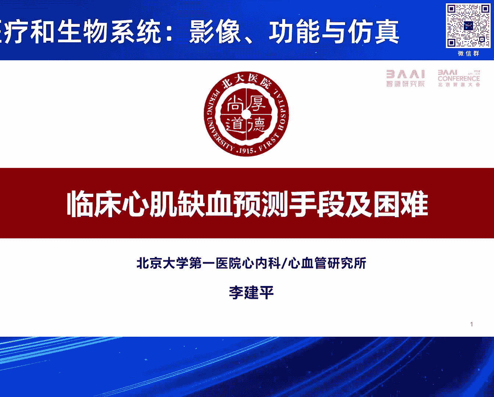
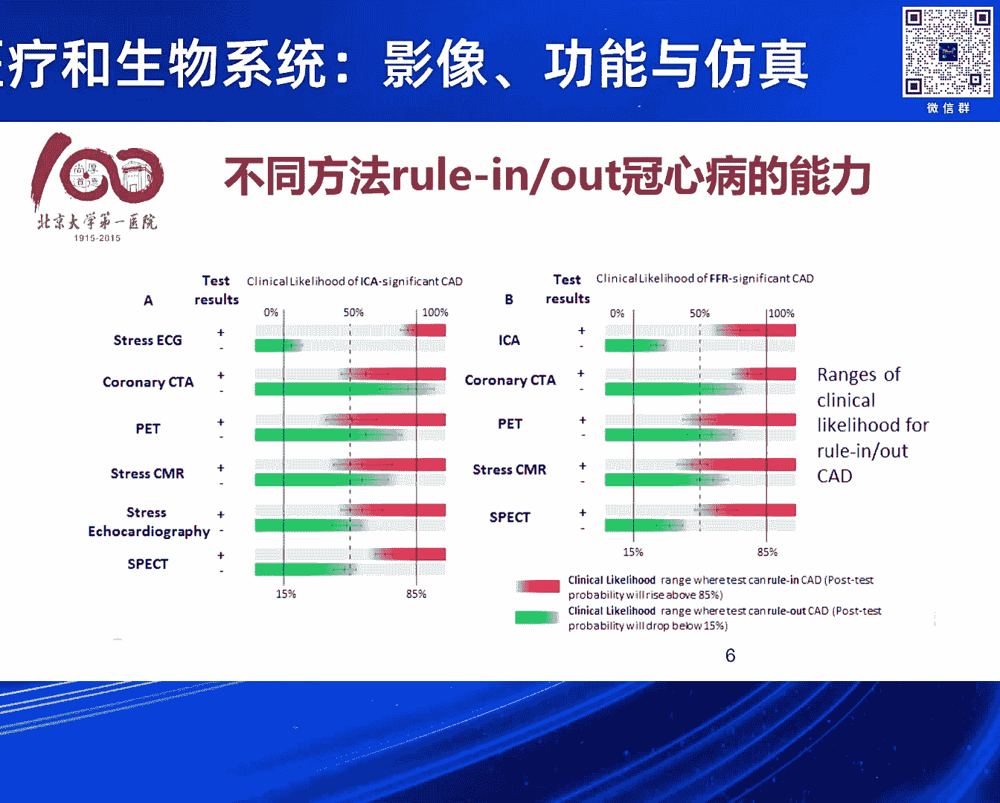

# 2024北京智源大会-智慧医疗和生物系统：影像、功能与仿真 - P4：临床心肌缺血预测手段及困难：李建平-主持人：马雷 - 智源社区 - BV1VW421R7HV

好感谢张教授的报告，下面呢，我们欢迎李建平院长给我们做报告。

李建平院长，北京大学第一医学院副院长，心血管疾病研究所所长，主任医师教授，博士研究生导师，血管稳态与重构全国重点实验室副主任，国家卫生健康委员会心血管分子生物学与调节态重点实验室，北京大学副主任。

北京大学医学部血管健康研究中心，副主任李建平主任二十多年来一直从事冠心病介入治疗，开展高血压，冠心病等动脉周样硬化疾病的相关临床和基础研究。

在国际学术期刊发表SCI文章237篇中文文章128篇获一项国家科学技术进步二等奖，三项省部级奖励一等奖，一项省部级奖励二等奖，李院长的报告题目为临床心肌缺血预测手段及困难。

那么让我们以热烈的掌声欢迎李院长，好尊敬的张宏贵教授，还有各位专家同道，大家下午好，那特别高兴，我看今天已经是第六届了，那我是第一届参加，而且我觉得作为一个心血管科医生，一进入这个会场，我就特别震撼。

因为我们的学术会议哈朱教授和那个龙德勇就是主任在哈，我们很少见到这种场景哈，各个会场是个爆满，而且这个有有大家站着参会的哈，所以确实能够感受到大家这样一个这个热情激情哈，去迎接和拥抱新技术这个大数据。

所以呢，这个我们无论从北大医院哈，还是从科室其实很早也特别关注和参与到这个这个这个技术里面来哈，所以我也借助于这样一个这个特别好的机会，有幸跟大家汇报一下我们自己的工作哈，这个还是说临床需求哈。

这张老师给我一个任务，就这个题目也是能够看得出来哈，临床是有需求。

我们才去借助于这样一个新技术哈，解决临床的这个难点，卡点和痛点，那对于冠心病的诊断而言，其实大家都知道我们冠心病的其实简单跟大家科普，还因为有些人可能不是做我们有医学的一个专业，我们两大类型一类呢。

是稳定的这个心脏病，另外一大类呢，是不稳定心脏病，我们叫急性冠脉综合征，其实最典型的例子就是急性心肌梗死，那从临床上对这两大类型的疾病的诊治过程中，其实第一对于急性冠脉综合征，大家都知道急性心肌梗死。

他非常危重，他后续的临床的预后哈，虽然经过我们抢救，也可能有不好的预后，但是这稳定的冠心病病人，他不一样哈，他其实临床预后相对的是好的，但是从诊断而言，这两类是不一样的，那个最重的急性冠脉综合征。

包括急性心肌梗死，不稳定心绞痛，或者是叫非癌症抬高心梗，他在临床上诊断非常容易哈，这个病人一目了然，只不过我们能不能给他治疗好，取得一个最好的结果，但是对于稳定的临床预后相对好的这些人。

在诊断上就非常的困难，因为这些人目前诊断的方法有很多，我们大概可以分为无创的，还可以分为有创的，那怎么样选择最好的这个检查方法给病人做出诊断，那牵涉到很多的问题，好，包括这个病人的获益的问题。

包括医疗费用的问题，因为非常大量的，其实临床我们给他诊断带引号的冠心病，所以去做了好多可能没必要的这个有创的检查，所以这一块在我们临床上是个需要解决的问题，那无论是国外的指南呢。

还是从国内的指南都给了我们很多的这个从指南层面的建议，但是在操作起来却很困难哈，我给大家举个例子，这是来自于欧洲的对于这个临床稳定的冠心病病人的一个诊断的一个流程哈，这个这个我们快速的过哈。

实际上大家看到的第一步就先看症状是不是典型，我们如果是一个典型的心绞痛的症状，我不给他做什么任何的检查，那我基本上百分之七八十的把握度，我说你是有病或者是没病哈，这是从我们老师那儿学来的。

过去没有那么多检查手段的时候，就靠问诊哈，就跟中医大夫要做基本功，要望闻问切，那我们对西医的时候，我上学的时候，老师给我们讲，如果你好好的问病人的症状是不是一个典型的心绞痛的症状，那你有七八十的把握哈。

告诉这个病人是不是后续要做检查哈，那当然典型的心绞痛的症状，我们有时间再讲哈，因为很多科普的这个场合呢，我们也给大家介绍有些症状真的不是心脏病，大家不用特别紧张，这点就提出来了，其实路径很清晰。

但是操作起来有困难，大家看他是一步一步的推进，那刚才那个叫诊前的可能性，那根据你的症状就判断你得这个后续的真的有病的可能性有多大，百分之十五以上，百分之五到百分之十五哈，我们会推荐接下来的路径。

那你下一步该做什么检查了，大家听说过哈，心电图诊断冠心病，但一般的时候做心电图拿出来，我们体检，后来有些大夫就说你有有点心肌缺血，这个非常不科学哈，我们要诱发病人犯病的时候，心电图才能发现问题。

所以那个检查叫运动实验哈，运动的时候做心电图，哎，在你心肌养好量增加的时候，如果你心电图出现了明显的缺血性的变化，我们就给你诊断，那如果你不运动了哈，心率下来了，那马上心电图又恢复了。

那这个诊断我们也可以有80%以上的把握度，认为你是有问题的，那当然借助于这样一个负荷，包括运动和药物去诱发病人犯病，我们产生了一系列的技术，包括心电图，包括超声心动图，也包括核数。

这都是在功能学检查无创的功能学检查，那当然大家知道，刚才张教授给大家介绍的基于CTA，CTA是什么呢，是通过一个增强的CT造影，也是一种无创，相对于我们给病人做穿刺动脉，做贯穿动脉造影。

那这个检查其实它也是一个通过CTA来看，你的血管是不是有斑块有狭窄，但是有斑块有狭窄以后，它是不是引起缺血了，刚才张教授给大家介绍的CTFFR，实际上就基于CT影像的功能学评估。

功能学评估可能刚才张教授也给大家铺垫了这部分的内容，我等一会再简单跟大家说，那无创的检查方法有很多，大家这点刚才我提到的运动实验，就是负荷的心电图，包括贯穿动脉CTA，负荷的核磁，负荷的超声心动图。

还有这种负荷的核数的心肌灌注显像，这个SPECT，它对于诊断或者是排除，都有自己各自的一个准确性，所以另外我们关注稳定心脚痛的病人，其实我们特别想把稳定的心脚痛的病人给他诊断准确，给他干预的准确。

提到了干预，那么大家都知道，这个冠心病从治疗模式上，治疗手段大家都知道，我们有药物治疗是基础，那么接下来的治疗就是介入治疗，介入治疗是个微创的手术，那跟几十年相比，有好多的冠心病病人。

因为这项微创的手术，而避免了开胸去做搭桥，这是一个治疗技术的一个革命性的改变，但是新技术出现以后，又伴随着其他的问题，就是提到了我们真的是治疗一个病变，还是治疗一个缺血，所以提出了功能学的评估。

功能学评估是什么意思呢，就是你冠状动脉存在的狭窄的过程中，我们等会可能有一个图，还不是这儿，那么我们在冠状动脉，实际上它出现狭窄了以后，因为冠状动脉循环，它不止只是我们刚才，张教授给大家演示的。

那个冠状动脉的图形，好那冠状动脉大家可能刚才那个图，等会给大家看，我这可能也有那个图形，它实际上它冠状动脉，更远端连接的跟心肌细胞相接触的，那些微血管，它占到了90%以上，我们能够在CT。

或者在冠状动脉造影，看到的那个血管只占到了10%，不到10%，所以说这么庞大的血管床，它有非常好的调节能力，你这边窄了，我远端扩张，那导致的结果，就是你的心肌细胞并没有缺血。

所以这就造成我们不精准的评估，不精准的治疗，就可能造成治疗过度，或者是治疗不足，造成治疗不恰当的问题，所以也就导致了，我们在临床上，对于稳定的冠心病病人，再去评估介入治疗好，还是单纯的吃药好的时候。

我们没有得到阳性的结果，这个实际上跟我们临床的，个人的经验，那完全是不一样的，我们认为，我们在临床上收治的病人，如果我判断他，这个病人应该做冠状动脉造影，做支架治疗，那他的结果，从我个人的感受。

我们80%90%以上，病人都是明显，获益症状改善的，但是我们在看临床研究的时候，他做这么一个大样本的，随机对照研究，他却非常遗憾的，没有显示出，在优化的药物治疗的基础上，我们给病人放一个支架，两个支架。

能够进一步的改善病人的获益，那这个获益既有硬指标，比如改善病人，再发心梗，再次死亡，还有再次血液重建，这个再次血液重建，包括再做支架，或者再做搭桥，他并没有在这些心血管事件上获益，那当然可能在生活质量。

在心脚痛的改善方面，得到了一些改善，所以这并不是我们需要的，那根本的原因是什么呢，是我们没有对病人的冠状动脉，缺血做一个很好的功能学评估，那这就是刚才张教授介绍的，我们通过CTA的影像。

去看他是不是真的缺血了，那当然我们在过去，这是我给大家显示的，就是我们冠状动脉是从粗到细，那小的冠状动脉100个微米以下的，我们做冠状动脉造影的时候，是看不到的，但是那部分占到了更大的，绝大部分的比例。

那因此我们从冠状动脉上，有了功能学一个指导下的治疗，就是FAME系列的研究，那它是通过一个压力导师，把压力感受器，放到你冠状动脉狭窄，比如说我们在血管上，有一个70%的狭窄，那他把压力感受器。

那么放到病变远端以后，通过对微循环的，一个最大程度的扩张，你不是微循环可以有调节功能吗，那我就暴露出在最大的扩张，你能够最大扩张的情况下，我暴露你这个病变，导致的你血液，在这个病变前后的。

一个压力的阶差，这个如果压力阶差大了，就提示他有缺血了，所以在过去，我们是做了基于冠状动脉造影的，这个CAFFR，CAFFR的好处，也是不需要压力导师了，不需要压力导师，我们通过算法，把功能学算出来了。

那当然张教授介绍的CTFFR，就更前一步，他没有去做造影的时候，他就算出这个FFR了，那这是我们跟企业合作，这个也是已经上市的一个产品，这个也是发表了很好的一个文章，我们看它的准确性。

大家看那个跟FFR相比，它有很好的诊断的准确性，右边那个IMR，就是我们做微循环阻力指数，现在我们也是一个北京市的，一个首发基金的重点项目在评估，基于我今天要给大家介绍的，心肌硬变的IMR的测评。

这个是心肌硬变，我们朱天刚是我们国内的超生的专家，我们超生心动图会获得一些，这个也是超生上面的，非常简便的一个数值，它叫心肌硬变，它反映我们，因为我们的心脏的波动，不是一个气球一样的，吹起来缩回来。

它在收缩的过程中，多少亿个心肌细胞，它其实是一个非常复杂的力学的协调运动，导致像拧毛巾一样的运动，它是一个最有效的去蹦血，达到一个，我们去测这样一个心肌硬变，就可以反映你可能存在心肌缺血了。

这是我们跟佐治亚大学和清华大学的，人工智能的团队合作，那么基于我们自己的数据，做的一些初步的结果，好，这个我就不斑斑弄斧，这是一些具体的方法，这是我们当时的一个研究的设计，好，最后我们最后也是。

结果应该还是不错，通过一个最大限度的一个学习的，可以通过心肌硬变，达到一个非常比较理想的一个预测心肌缺血，那么我也略过了，所以还是觉得等一会儿我们还有关于缺血，我们从心脏去关注到肾脏。

因为肾动脉也有狭窄的问题，肾动脉肾脏也有缺血的问题，所以我觉得确实有很多机会也有很多挑战，我个人感受其实我们需要跨学科的人才，我看现在有很多年轻人，我不知道大家的背景是什么，其实跨学科的人才特别重要。

虽然我们现在有了医工交叉融合，我们也跟智原成立了人工心脏的联合实验室，但是我们还是觉得现在临床医生可能这个角度上，涉入的还是不足，我们希望能够跟我们专业的这些人能有更深入的合作。

也更希望有这方面的人才来到我们的医院里面来，这是我们跟张老师这边，北京大学第一院和智原成立的人工智能研究院，也希望借我们今天这次大会能够开展更多的合作。

再次感谢张教授，感谢各位，谢谢，謝謝大家，謝謝。