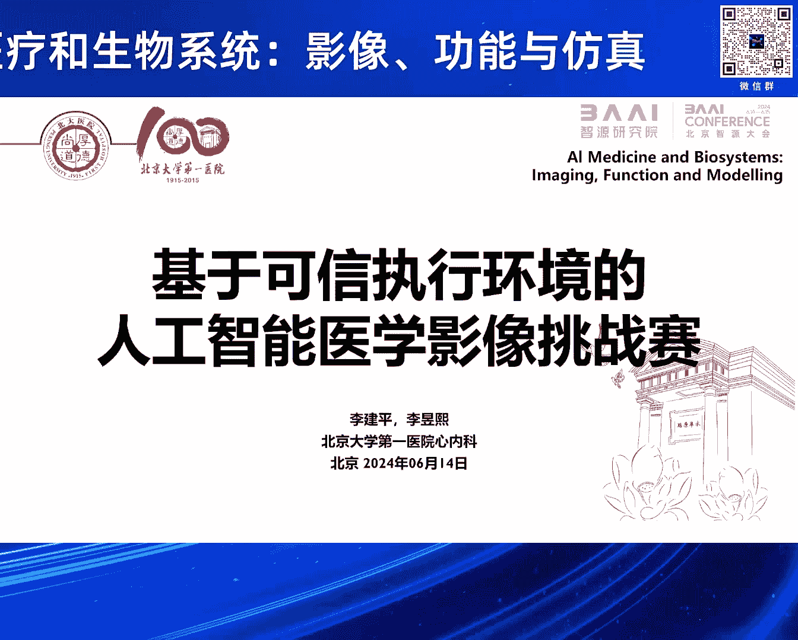
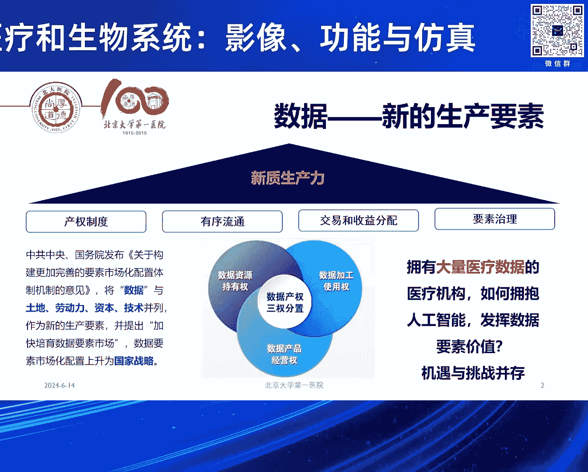
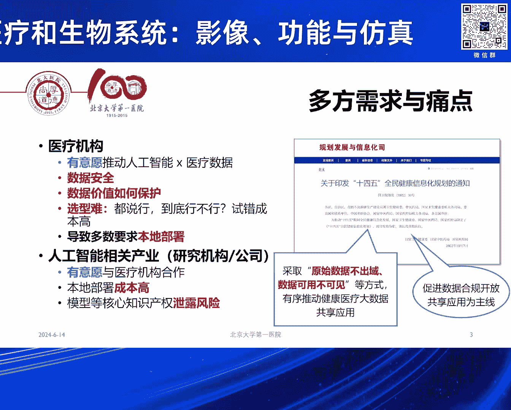
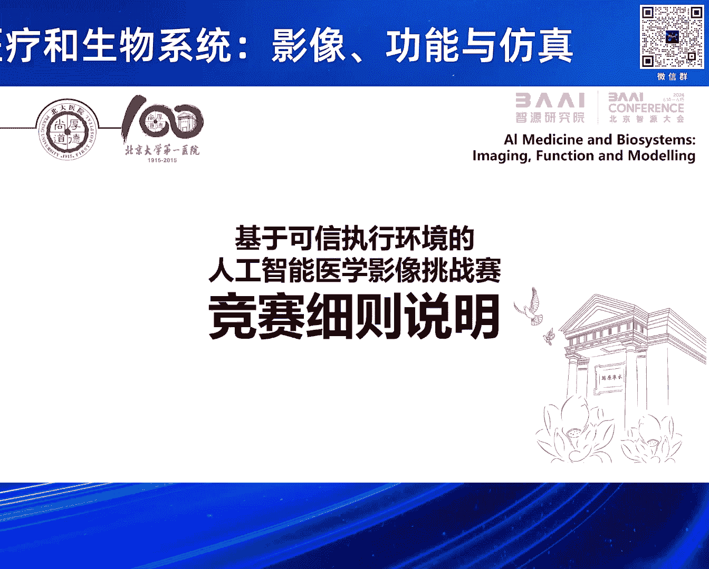

# 2024北京智源大会-智慧医疗和生物系统：影像、功能与仿真 - P5：基于可信执行环境的AI医学影像挑战赛发布：李建平-主持人：李昱熙 - 智源社区 - BV1VW421R7HV

感谢李主任的精彩报告，接下来由李玉熙主任介绍基于可信执行环境的AIE学影像挑战赛。

李玉熙是北京大学第一医院信息中心副主任，心内科副主任医师，擅长常见心血管疾病的临床评估与诊治，尤其专注灌脉及高血压介入治疗，参与多篇心血管疾病大型临床研究项目，以第一作者发表SAI论文十余篇。

接下来有请李玉熙主任介绍挑战赛的背景。

好的 非常感谢张教授的邀请，然后也特别荣幸能有这么一个机会，跟今天在座的各位专家还有领导来汇报我们的设想，然后其实真的是一个非常胆大的设想，然后今天能够在这样一个场合逐步把它实现。

那简单说一下为什么要做这件事，其实刚才金教授已经讲到了，其实医院的数据非常的宝贵，可能中国的专家没有这个感受，但如果你真的去欧美，像金教授肯定知道，要跟医院去合作用这个数据真的是很难的。

所以国家整体的战略数据肯定将来是咱们的新的生产要素，那在这里面我们拥有大量医疗数据的医疗机构，其实是有意愿来拥抱人工智能，让这些数据真正发挥作用，但是这里面我们都有需求，但是也有痛点。

比如说医院是很有意愿与人工智能的研究机构公司合作，但是这里面数据安全，尤其中国的医疗机构，其实很缺乏数据安全的这种防范的能力，那再有就是这里面数据价值如何去保护，因为一旦这些数据哪怕是我脱敏的数据。

给到了任何的第三方，未来实际上我就失去了这份数据本来可能有的价值，再有就是这中间我们到底怎么去合作，因为到底谁做的好，其实很难有一个这种条件来证实，因为大家都说做的好，但是到底好不好。

其实这里面的成本是很高的，所以导致的一个后果就是医院会要求所有人必须来我们医院合作，包括刚才张教授讲到，我相信很多工作他们都必须到医院里面去做，这个反过来对于我们的研究机构还有公司。

其实无疑就增加了大家的成本，而且我相信公司也会有顾虑，我把我的模型，我的核心的算法放在你的医院，又有其他的竞争者去，其实也是有这方面的风险，所以在这里面这样的一个背景下，其实国家包括刚才金教授也提到的。

有可能实现这种原始数据不出狱，数据是可用，但是不可见，所以从这样的过程中，我们就提出这样一个非常胆大的想法，好在有张教授，还有志愿研究院的支持，使得我们能够利用这样的一个机会，我们最初的想法。

其实就是想利用众多人工智能，学会开展的这些测评的竞赛，因为这是一种很成熟的模式，我们提出一个任务，大家都来在同一个公平的平台上，看看到底是做的好，但是这里面怎么解决刚才的一个痛点，现在志愿研究院。

包括我们提供技术支持的荣安数科公司，达出了所谓T1可信执行环境的，这样的一个技术路线，在这个技术路线以上，其实我们希望的是，通过小小的尝试，能够打造未来的一个生态的这种模式。

比如说我们医院将来就可以来对内，建设我们本身的医学影像数据的，资产管理的平台，因为这些数据是很好的，可以去隐私化，并且我们可以把它有哪些维度，这些病人有什么样的临床资料，随访了多长时间拿出来。

这样对外我们就可以形成一个交易，或者说查询的平台，未来任何的第三方，好比公司，药厂，保险企业，你需要了解我医院的这些数据的时候，我可以告诉你，之后其实就有可能进行，我们后续的这种数据的确权。

以及产生的这样的一个良性的合作，最后我们如果有这样的一个，隐私计算的平台，能够给大家提供一个更公平竞争和选行，甚至有可能改变未来，我们很多的这种招标的流程和模式，这次的竞赛，其实前期特别感谢张教授。

包括职员研究院，还有今天在座的，像张赫燕教授团队，然后像王宽权教授团队，其实还有李帅教授团队，其实都给了我们大力的支持，也很有意愿参与到，我们未来的竞赛里面，在这我在以一个简短的时间，跟大家汇报一下。

我们竞赛的发起的初衷，和一些简单的细则，背景其实刚才各位专家也都讲到了，灌脉的功能学是很重要，我们这次的竞赛，其实是围绕在肾动脉，肾动脉其实是我们引起高血压，和缺血性肾脏病，一个非常重要的病因。

肾动脉狭窄，其实治疗也就是药物和支架，但是介入治疗到目前为止，几个大规模的RCT研究。

也都是阴性结果，跟刚才李院长讲到的，稳定性冠心病，如出一辙，过去这些研究，我们回过头来分析，它肯定是有一些，可能的偏移的问题，比如说它纳入了很多，狭窄程度并不重的患者，另外有那些非常严重的患者。

因为是随机对照研究，其实医生和患者，都不愿意参与到这个研究里面，因为你一旦参与，你可能会被随机到，药物治疗那一组，但是医生和患者都觉得，我其实应该放支架，这些病人的数据，其实并没有进入到这样一个RCT。

导致的一个直接的后果，就是欧美现在基层的医生，基本不再给大医院推荐，做生脉支架的病人，所以最后一篇RCT研究，是2014年在新英兰杂志上发表，到现在已经过去了10年的时间，在去年实际上。

欧美的专家就认识到，RCT其实影响了很多病人，很多病人可能耽误了，最佳的救治的时机，所以在去年的Hypertension，就发表了一篇最新的，关于肾血管性高血压，血运重建的一个专家的立场声明。

其中就说明，不是所有的病人都不该做，而我们应该去挑选合适的病人，问题来了，我们怎么去挑选，目前无论是中国，美国，欧洲的指南，其实都没有一个特别确定的，什么病人我们该给他放支架，什么病人不该放。

我们就回想到，其实灌脉是走过了，这样一个寻证的历程，最早我们就是基于造影，超过70%放支架，70%以下不放，但是一系列的研究，甚至他们拿假手术对比的，随机对照研究，都没有看到阳性的结果，随着压力导斯。

到后续我们基于灌脉造影的，所谓这种人工智能的QFFR，CFFR，现在其实积累了大量的，循征医学证据，就是基于功能学的支架治疗，是优于过去基于造影，甚至要优于单纯的药物治疗，所以我们这样的一个工作。

就是希望看看，能不能把同样的功能学，引入到我们的肾动脉，在这个基础上，其实我们在临床中，已经开始了探索，我们最早的一例病人，是2019年开始做，当时这个病人，通过了功能学的评估，也获得了非常良好的预后。

到现在随访超过5年的时间，他的血压，肾功能都保护得很好，我们就想把它转化成为，一个循证的这种证据，在刘院长牵头下，我们也是开展了，所谓Fair Pilot的一个研究，这个研究完全是一个。

随机对照研究的设计，我们有很好的前期的研究的方法，然后中间我们也给病人，进行了多模态的，这种影像的评估，有肾动脉的超声，有磁共振，当然也有我们树中的造影，和FFR测量的，肾动脉的压力的参数。

我们就是希望能够看看，到底这样的一个方法，是不是可行，在Pilot研究，目前我们已经完成了，所有病人的入组，正在进行随访的过程，我们总共是随机了，106例的患者，这些患者，我们现在已经有了一些。

初步的数据的分析，今年主要的研究，可能也要在今年的，欧洲心脏病学年会上，进行汇报，在这个过程中，其实我们就希望能够开展，这样的一个临床的挑战赛，它的背景和初衷，第一个就是我们将来，一定像跟灌脉一样。

是要跨过压力导丝，进入到利用影像，和人工智能的算法，直接得出肾动脉的功能学指标，第二个其实就是刚才的背景，有没有可能通过这样一种，隐私计算的方式，使得我们探索出来一个新的。

这种创新的模式，我们就把 pilot 的，106个病人的数据，全部进行了汇总，我们提供了一批样例的数据，然后希望大家能够在这个基础上，来开展我们人工智能算法的，研发的工作，这些数据。

我们提供了几类样例的数据，第一个就是，树中的肾动脉造影的图像，一个动态的DICOM原始格式，去隐私化的数据，并且在这里面，我们进行了QCA软件的标注，由专业的医生，完成了它一个狭窄程度。

和狭窄的部位的一个标注，第二部分，就是我们在手术过程中，用压力导丝测得的，肾动脉的 FFR，包括远端的平均压，病变近端的平均压，以及它基线的，这样一个压力的数据。

在这个过程中，我们很遗憾，确实只能提供少量的数据，就像刚才金教授，还有前面几位教授讲到的，在医学领域，可能很多场景下，我们只有小数据，还没有大数据，但是我相信，在咱们人工智能，非常专业的。

这些专家团队的带领下，我们即便用这些小数据，应该也能够探索出来，我们未来的方法，所以我们初步计划，会提供10例的，标注好的样例的数据，每一例都有病人的，渗透脉的详细的直径，狭窄，病变的直径，参考血管。

还有FFR，包括当时树中的压力的结果，还有我们的影像，最终我们希望得到三个任务，拆分了，第一个任务，其实就是识别，我们血管狭窄的关键针，因为一个噪影的图像，从一开始的空白，到我们填充了噪影剂。

其实里面有很多关键针，是可以识别它的狭窄，第二个任务，就是根据关键针的图像，完成图像狭窄的勾勒和分割，最后一个任务，就是完成我们盛顿脉FFR的，一个人工智能算法的预测，这里面，智源研究院。

包括我们合作的，隐私计算的团队，给大家提供了，运行的硬件和软件的环境，所以后续也期待，各位专家如果有兴趣的话，可以跟我们进一步的合作，关于整个的挑战赛的背景，还有任务，我简单就汇报到这。

最后我们也是再次邀请张恒贵教授，然后邀请李建平副院长，然后还有李亚聪老师，我们一起来进行一个简短的，挑战赛的发布的仪式，有请几位专家，我们还是一个特别感谢，见证我们盛顿脉的，一个功能学的计算的。

基于隐私环境下的一个，计算挑战赛的一个正式的宣布启动，好，谢谢大家，谢谢，然后我们再次感谢各位专家的精彩报告。

