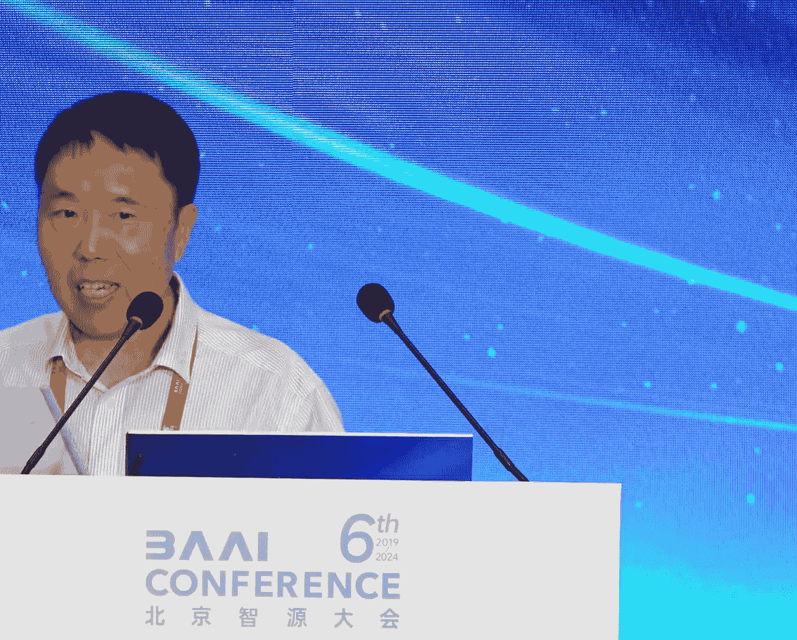
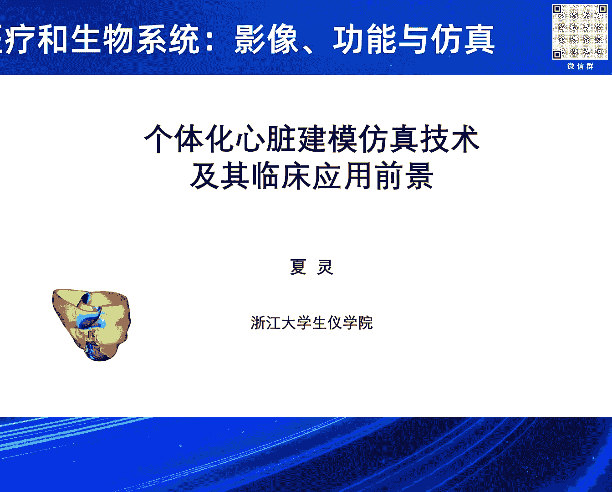
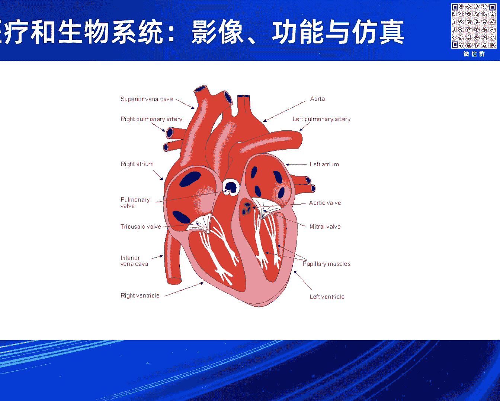
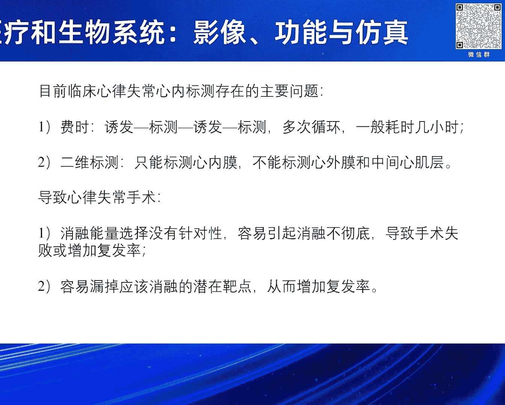
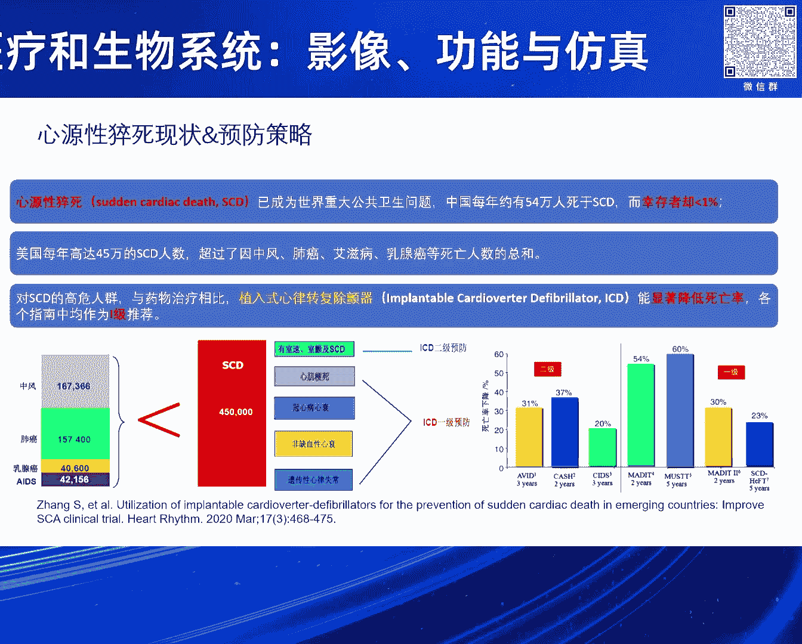
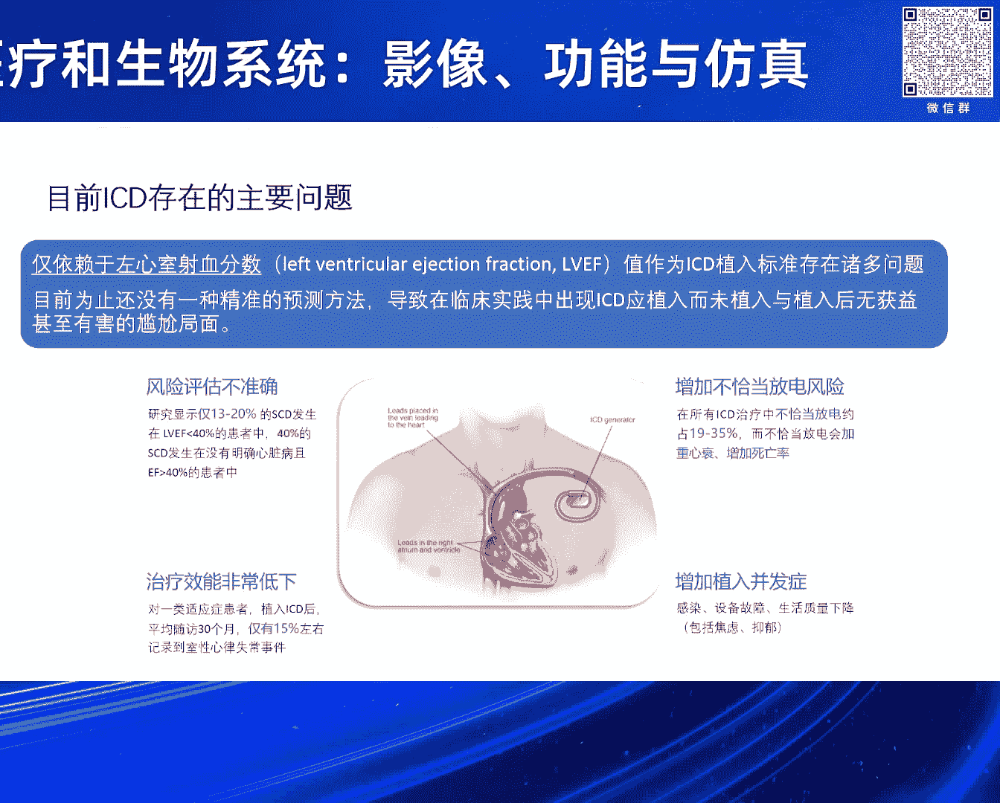
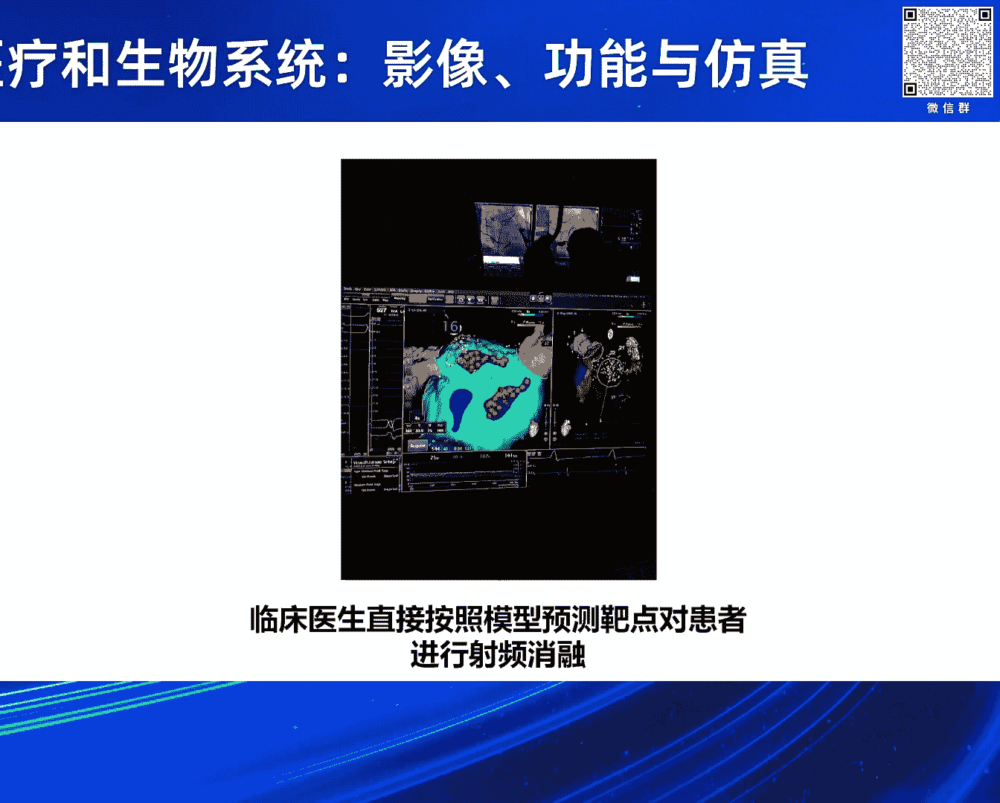
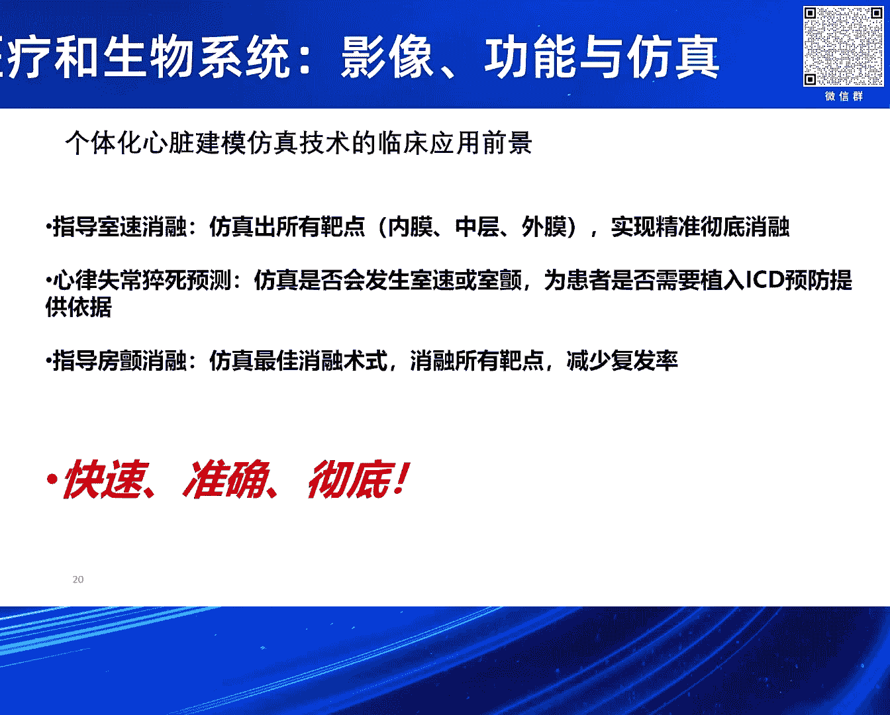

# 2024北京智源大会-智慧医疗和生物系统：影像、功能与仿真 - P6：个体化心脏建模仿真技术及其临床应用前景：夏灵-主持人：王宽全 - 智源社区 - BV1VW421R7HV

尊敬的各位专家各位同仁大家下午好，我是这个环节的主持人王宽权，来自哈尔滨工业大学计算学部，那么非常荣幸的介绍我们这个环节的第一位讲者。

夏琳浙江大学教授博士生导师，前任浙江大学生物医学工程研究所所长。

浙江大学生物医学工程教育部重点实验室副主任，兼任中国生物一切工程学会理事，医学图像信息与控制分文会主任，国际生物医学工程杂志编委等学术职务，长期从事心脏电生理或持工症呈下系统方面的科研和教学工作。

主持陈丹尼尔七项国家自然科技基金，三项973计划项目指课题，一项国家资深计划指课题和一项863计划项目，夏教授的报告题为，个体化心脏建模仿真技术及其临床应用与前进，大家欢迎。

非常感谢张教授的邀请以及王教授的介绍，我那一辈子就做心脏建模仿真，近几年我重点就是跟随欧美的步伐，最近几年欧美国家特别是美国约翰霍普金斯大学，他们就说一个个体化心脏建模仿真技术，主要是针对心律失常治疗。

我们知道心律失常是心脏疾病整治的难点，因为其他心脏疾病我们现在相对来说好一些，因为有影像检查都看出来，就是哪里有毛病就直接看出来了，但是心律失常它是跟电相关的，电相关的就是比较麻烦。

看不到就是影像方面看不到，所以我们左边这个图就是我们正常心脏病心室，它的气氛次序就非常有规律的，你要比右边这个比较，心肩上给它一个刺激它就稳了一点了，那么就是心跳速度非常快，使心动过速甚至死颤。

那么像右边这个要颤动的话，心室颤动的话要死人了，就立马的出颤不吃饭肯定就死掉了，关键是我们怎么把它消融把它就打停下来，那么你要是最简单办法就给强电流刺激，让所有心细胞恢复到静息状态。

那么又恢复原来有规律的节律跳动，关键是我们怎么消融得白一点，我们知道就心脏我们连着血管，所以我们做心脏的医生都知道，就是德国医生福特斯发明了，就是自己导管进去直接伸到心脏，那么就是设备消融。

那么这项技术就是推广之后，他还获得诺贝尔奖，从此以后心内科医生，就是很多手术心内科医生就干掉了，原来可能都要心外科医生。

那么既然这个电看不到，那么现在临床有几种方法，就是心力标测，我们用的最多可能就是强生公司的Cartoon系统，以及就是亚培的InSight系统，那么就一点的去标测，那标测就是为了目的。

就找那个靶点 消融靶点，但是现在我认为就是这个心内标测，还存在一些问题，那比较费时，一般是又发出心律是强生标测，又发标测这么多次循环，那时间大部分时间都耗在这，那实际上第二个它看起来三维。

实际上二维就是说那个壳是三维的，但是实际上它就是标测心内膜，对吧，实际上心内膜，但是它心脏它是立体结构，它是心基层，它只能标这个心内膜，对吧，它导管生了心内膜器，那心外膜标测不到。

特别中间心基层就更标测不到，这样就有些就是说，因为你这个白点在心内膜跟心外膜是不一样的，你特别中基层，人家用设备消融能量的选择不一样，对吧，或者你的心外膜的话，你的可能要穿刺过去，就是才能消融。

所以这样有时候就是会导致心内消融这个失败，另外就是还可以就是容易漏掉这个潜在白点，那一般的医生就是说，他诱发心内膜可能就选几个点，对吧，就是可能就是选择一个心间部刺激一下，或者是又是流刺刺激一下就完了。

那很多其他地方他就不去诱发。

那实际上可能还有潜在的白点，所以漏掉，这样就导致他复发率要高，所以就是最近就是，欧洲有特别是美国我们就是，约翰霍普金斯就是拿他那点教授那个科理组，就用个体化心脏建模这个仿真技术。

那么他就是我们对患者就少一个持空镇，特别是嘎森强这个颜值强化的就是，这样就可以少出来，就特别是比如说心梗，心梗就是心梗就救回来了，但是他也留下疤痕，有些疤痕留下来，或这样的有些心肌细胞是死掉。

那有的心肌细胞还半死不活的，我们称为灰区，这样就是死掉了心肌细胞，它不会传导电，那你半死不活的心肌，它能传导电，但是它传导速度慢，这样很容易形成一个CP市场，那么这样模型我们通过就是，构建这个模型。

这个当然这部分就是因为，构建这个模型很费时，要手动的话就花非常花多少钱，现在我们就用一个全自动，用AI的帮助下就是构建这个模型，这样就三位模型构建出来，这样我们就算，过去模型之后。

就是我们不光是结构模型，我们电生理参数都给它附上，包括心肌宣传选项，因为它这个心肌宣传选项非常有规律的，我们给它自动附上，然后包括动作定位，那心肌包包括就是你心内膜跟，中间心肌层跟心外膜。

动作定位不一样的，这样你仿真然后刺激我们，按照美国心脏行为，那个几个点不要忘了19个点，对吧19个点，那么刺激，就相当于就是我们，给它去施加一个虚拟刺激，实际上我们有时心理上它，它诱发因素就是那枣果。

对吧相当于给它一个电脉冲这么刺激，那么这样就是我们有没有心理市场，就是可以算出来了，那包括就是，这个我们就计算模型，包括左边的右边的是实际上，就是它标签的模型就是，下面这个图，更清楚一点。

那么这个模型算出来之后我们就是，比如这个灰的这个地方，就是我们笑容右边那个图，这样就是它的心理上就可以消失掉了，那么这是第一个就是标签点，实际上还有就是标签点，就是林川是，8。1是第一次手术标签到。

后来8。2是第二次手术的事了，它复发了现在又标签到，那么我们模型实际上就，一次性你把所有潜在8。1的法论出来，那么就一次性手术就可以结束了，直到就是，你再诱发不出来就是，有些折返。

这样的话就是减少这个复发率，那么这是就是，使信心度过速，这个是右边这个图就是我们，青色的部分就是我们算出来，只要笑容这么一点就行了，那个红色区域是，医生就是，实际手术中就是我们就吻合得非常好。

那实际上对心肌细胞就是，正常心肌细胞损伤还少，那么还有一个就是，前面就是我们算出8点，假如我们不管就算出8点在什么地方，那就是猝死，我们知道就是猝死越来越多，越来越年轻化，特别是有些，先耿虽然救回来。

但是他有些疤痕留下来，有些扩张性心理病或者肥后性心理病，特别是肥后性心理病，我看到个报道就是年轻人呢，就猝死有1%肥后性心理病，在这呢就是我们，现在就是抓ICD就是临床上，就是，没有很好的方法。

就好像就只有就是，左心是社学分数，这个就是35%下，那么就建议植入ICD以上。

就是不植入，这样就是非常不准，这样就导致就是你该植入有时候不植入，不该植入植入，那就是有些浪费资源，有时候还要诊房诊所，所以这个就非常不准，就是我估计是20% 30%了不得了，我们无准说按这一个。

那么就是我们做这个。

我们就是算得非常准，这是一个典型的，比如说我们一个扩张性心理病，就是我们，那上面就模型它有些一八横，然后我们算出来就是，可诱发出来心率是长，就死数，我们，诱发出来178次每分钟心跳。

那么实际心率图算出来就180，就非常准，这个事先我们医生就是没有告诉我们结果，我们算出来他非常惊讶，非常吃惊，这个非常准，然后这个坏子就是，听说我们今年就植入ICT了，那么过几个月确实放电。

因为这个是可以检测的，ICT放电，你某年某月某日放电，它有记录的，这个做不了假，所以这个就是非常准，就是这个我们写个例子，就当时就发在中华新闻网评杂志上，对吧，那另外一个例子是反向的，风险非常高。

一个51岁男性，他治房颤，入院治疗，房颤治好了，我们看把心室好像是风险很大，今年就植入ICT，后来没植入，过几个月就出事了，就来不及抢救，你打110来不及，所以这个就是我们这个预测。

就是你要不要植入除颤器，ICT，目前我们在安生院，就吴允泉教授那里，做了100多例了，我们统计是96%，那另外他马上给我们另外400例，就是在我们市，就是说，因为然后他要大量地给他水访。

就是从2018年开始，有持公证的那些患者数据给我们，这样就是加上水访，就是这样算得准不准，他就非常有数了，有些放电，他初步统计比如400例的只有，100多例才放电，那说明有些可能就是。

风险不高的也植入了，对吧，所以我们这项工资这样做，包括就是安生医院有个重大科技创新，这个项目，就是这个我们在做，包括浙江省的住院研发计划，要继续做，那还有一个就是房产，我们房产知道。

就是这个房产病人越来越多，我听蒋生杨主任说有2000万，那每年现在的手术量只有20万台，就是1%，99%还得不到有效治疗，因为就是能看上电生理，这个手术的医院不多，就来不及做。

所以因为房产它是很多并发症，心衰啊，包括特别是中风啊，这个东西都是它的后遗症，对吧，所以这个房产就是这个量非常大，那么就是我们房产呢，就也一样，就是，就心脏持空症就扫描着鲜花的，就取这个绿色的就鲜花去。

这样我们可以算出来，这个病例就是我们学生在美国做的，这个非常典型的就是这个房产，复发了多次，最后没办法就找到，拿他的他们就是作为志愿者就做，那然后我们给他算，算出来就好几个，又有。

有这反应三个左心房一个在右心啊，然后完了之后我们就手术规划，这个，完肺静脉的是必须的要消融的，然后我们加上另外的几个几个，几个消融线，这个完了之后，一两年之内就不再复发了，所以这个就是。

这个算得还是标准的，就是我是说就给林昶医生，我就给他们就，说万一我算不准，你原来怎么标测就怎么标测，我不会影响你原来的手术，对吧我只是建议，这样做了之后就是我们之后，然后我们就是可以。

导到就是卡托系统里面去，这么一生就是对着那个标出来，你消融就OK了，这样就是节省了你标测了。

所以这个方法就是我们认为，一个直到就是死树消融，就发生出所有八点，就内膜 中层 就是外膜，地方都给你标好，那这样可以我们精准地，就彻底地就是消融，就不会漏掉，因为就是我们在电脑上模拟，就是我19个点。

19个区域都给你诱发一遍，这样才不会漏掉 对吧，一个猝死预测，那么这个就是，要不然会发生死树或者死颤，那假如风险非常高的话，那比如说我们19个区，好多区都能诱发出来，你说明这个风险非常高。

你不制作ICT口腕，可能有一次是风险非常大，所以这个我们就是做的，在安生医院就是，吴永泉主任团队就做了很多了，那另外就是第三个就是防颤，就是最佳消融术师，这个就是，所有八点就是一次性给你就是，消融掉。

因为防颤其实，临床最大问题是复发率比较高，像安生医院水平比较高，那边就是复发率就少一点，有些小医院恐怕将近一半的复发，所以这个我们假如说，我们希望就是用我们的方法，就是降低这个复发率。

对吧 就是这个就是，所以就快速准确彻底，就快速就是很多时间，我们提前给你做掉了，在这么一身上呢就你，理想情况下你不要去标测，直接按照我们提供的八点去消融，消融完了之后你去诱发，再诱发不出来心理是啥。

那就这个手术完了，但就标设了这一步就可以省掉了，你万一还能就是诱发出来，那就你还能怎么标怎么标，说明我们也有路掉对吧，那准确就是，因为你能消掉那肯定准确，也彻底就是，我所有八点就是都帮你找出来。

一一台手术，就是尽可能全消掉，这样的将来就是说，复发率肯定会降低，我希望将来，跟龙主任能合作，这方面就是到底行不行，就是林双一生说了算，这个方法OK，那我们将来就是我们，往这个方面就推进一步对吧。

行我就介绍到这谢谢，好感谢夏林教授的精彩报告。