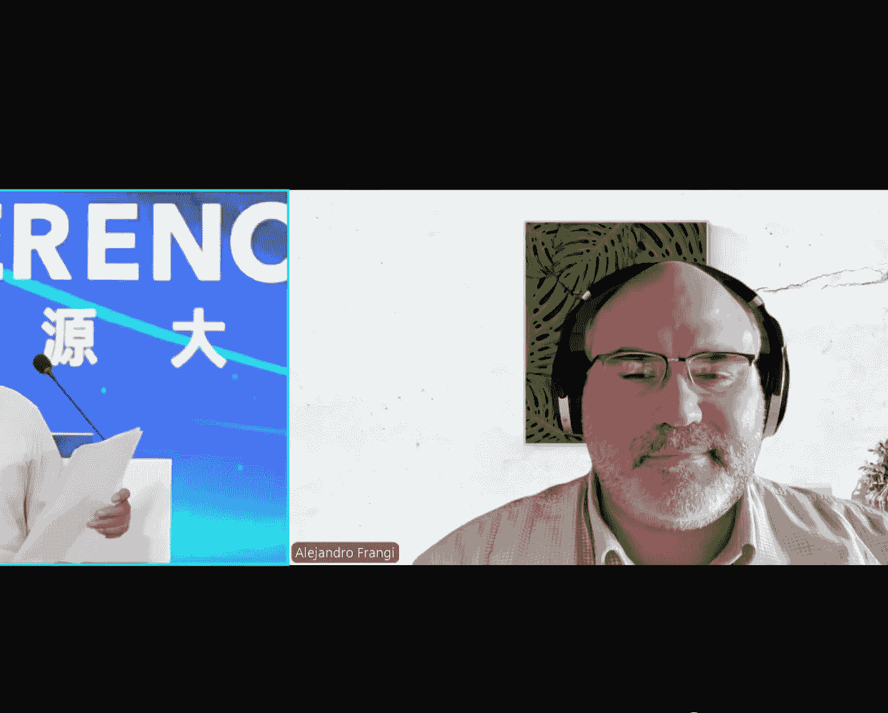

# 2024北京智源大会-智慧医疗和生物系统：影像、功能与仿真 - P7：On trials and tribulations ：Alejandro Frangi - 智源社区 - BV1VW421R7HV

我們現在是時候問您一些問題了，所以我們現在要請到下一個嘉賓，就是佛蘭吉教授。你好，Alex，您能聽得見我們嗎？

是的，我聽得見。

Good morning， Alex。 I'm really grateful that you give us a talk here today。

 So I give a brief introduction in Chinese。 I hope you don't mind。 Let the audience know you better。

That's very good。Frankie教授是英國皇家工程院院士，中國工程院外籍院士，英國曼切斯特大學圖靈雙世紀講師教授，在計算機科學和健康科學做出過卓越貢獻。

研究領域包括計算成像、機器學習、計算力學以及這些技術在心血管、代謝和骨骼疾病等方面的應用。自2001年以來，創立並指導了生物醫學中的計算成像與仿真中心，推動了計算醫學在臨床實踐中的應用。

他領導的團隊開發了Gemius和Multi-X等計算平台，開源平台，促進了圖像計算和生理計算、生理學建模領域的新的研究方向。亞歷斯特博格提問為，在試驗和懲罰中，要為更好的和更合理的照顧。

服用更快速、更有能力的醫療設備。謝謝亞歷斯特博格，我現在就讓您開始。謝謝，我現在可以把我的畫面分享給大家，您現在可以看到畫面了，對嗎？

好的，非常好，各位早上好。

很高興能夠為您介紹一些我們的作品，並且能夠在這個情況下進行。

我先來給大家一點概念。我本身是在曼徹斯特醫學院的總監，在曼徹斯特醫學院，我們專注於醫療技術研究和創新。

我們有許多關於AI和數位醫療的專業領域，包括數位醫學，生物學和科學，進一步的應用和設備，我們是挑戰性的，我們有許多領域是非常有趣的，我們需要應用這些科技。特別是這次訪談關於挑戰性的三個領域。

包括如何能夠提供更快的安全措施，並且能夠持續地進行。如果您有興趣來訪問我們，我們將在下個年份舉辦一個在醫學院的實驗室，在曼徹斯特醫學院的訪談會，在6月份。我今天要講的訪談是關於一個非常重要的任務。

就是每位醫生都應該專注於的，就是對病人的不受損害，這是第一步。如果我們看看我們對醫療產品的創新，在醫學上，包括在藥物和醫療產品上，我們都知道這些是非常長期的過程，需要經過許多的階段。

以確保我們不會受到太大的損害。根據這些過程，我們進行了許多科學調查，以確保我們能夠得到需要的證據，包括醫療產品的生命循環，也包括整個研究結果。這些都是我們非常信任的資源，我們專注於在醫學上的實驗。

在動物上的實驗，在人類的實驗，這些都是我們對於安全和效率的考慮。但問題是，這些實驗是否真的能夠像我們所信任的那樣，以確保安全和效率。我們知道這些實驗的方法有許多的限制，我不會去解釋這些，但是我們都知道。

在人類的實驗，動物的實驗，以及在人類的實驗中進行的各種方法，都會影響到整個人類的實驗的進度。我今天主要專注於醫療產品，這是我個人比較關注的一項，在全球生產的醫療產品平均為54億，但有很廣的範圍。

這是對於整體的複雜的療療程式。我們可以從概括證據到後市場研究，可以看到，在這幾個階段，有非常高的吸引力，而且有可能失敗。我們也知道，從最近的研究，根據FDA，最重要的5個醫療產品的回報率。

在一組一級的產品中，是50%以上，因為設計問題，而30%的回報率，在一組一級的產品中，是200個。所以我們有很嚴重的問題。最後，我只想關注一下，美國的實驗研究顯示，在這10年來，在一組一級的產品中。

出現了非常嚴重的失敗，以及非常嚴重的影響，包括在FDA的產品中。我們有相似的證據在英國，所以這不是美國的問題，我相信你們也有相似的問題在中國。在幾個星期前，11個防護器，被取消了。

這是一款2017年死亡的防護器，如果我給你們看一張全球的回報率，發生在2024年，在FDA中，是一個巨大的回報率，我們還不到半個月。如果今天你們坐飛機，你們知道，你們有1/10萬的機率。

在一輛商業飛機上，發生一場嚴重的衝突。如果你們在一場隨機的控制試驗中，你目前沒有證據，在文字上，數字並不算很好的，只是給你們一個指標，就是患者的危險性，這是一個控制的情況。我們需要思考事情的不同。

在我的語言中，我會把"先不要傷害"的概念翻譯為"先進行測試"。我會把"先進行測試"的概念翻譯為"先進行測試"。我會把"先進行測試"的概念翻譯為"先進行測試"。

我會把"先進行測試"的概念翻譯為"先進行測試"。我會把"先進行測試"的概念翻譯為"先進行測試"。

我會把"先進行測試"的概念翻譯為"先進行測試"。我會把"先進行測試"的概念翻譯為"先進行測試"。我會把"先進行測試"的概念翻譯為"先進行測試"。我會把"先進行測試"的概念翻譯為"先進行測試"。

我會把"先進行測試"的概念翻譯為"先進行測試"。我會把"先進行測試"的概念翻譯為"先進行測試"。我會把"先進行測試"的概念翻譯為"先進行測試"。我會把"先進行測試"的概念翻譯為"先進行測試"。

我會把"先進行測試"的概念翻譯為"先進行測試"。我會把"先進行測試"的概念翻譯為"先進行測試"。我會把"先進行測試"的概念翻譯為"先進行測試"。我會把"先進行測試"的概念翻譯為"先進行測試"。

我會把"先進行測試"的概念翻譯為"先進行測試"。我會把"先進行測試"的概念翻譯為"先進行測試"。我會把"先進行測試"的概念翻譯為"先進行測試"。我會把"先進行測試"的概念翻譯為"先進行測試"。

我會把"先進行測試"的概念翻譯為"先進行測試"。我會把"先進行測試"的概念翻譯為"先進行測試"。我會把"先進行測試"的概念翻譯為"先進行測試"。我會把"先進行測試"的概念翻譯為"先進行測試"。

我會把"先進行測試"的概念翻譯為"先進行測試"。我會把"先進行測試"的概念翻譯為"先進行測試"。我會把"先進行測試"的概念翻譯為"先進行測試"。

我會把"先進行測試"的概念翻譯為"先進行測試"。我會把"先進行測試"的概念翻譯為"先進行測試"。我會把"先進行測試"的概念翻譯為"先進行測試"。我會把"先進行測試"的概念翻譯為"先進行測試"。

我會把"先進行測試"的概念翻譯為"先進行測試"。我會把"先進行測試"的概念翻譯為"先進行測試"。我會把"先進行測試"的概念翻譯為"先進行測試"。我會把"先進行測試"的概念翻譯為"先進行測試"。

我會把"先進行測試"的概念翻譯為"先進行測試"。我會把"先進行測試"的概念翻譯為"先進行測試"。

我會把"先進行測試"的概念翻譯為"先進行測試"。我會把"先進行測試"的概念翻譯為"先進行測試"。我會把"先進行測試"的概念翻譯為"先進行測試"。我會把"先進行測試"的概念翻譯為"先進行測試"。

我會把"先進行測試"的概念翻譯為"先進行測試"。我會把"先進行測試"的概念翻譯為"先進行測試"。我會把"先進行測試"的概念翻譯為"先進行測試"。我會把"先進行測試"的概念翻譯為"先進行測試"。

我會把"先進行測試"的概念翻譯為"先進行測試"。我會把"先進行測試"的概念翻譯為"先進行測試"。我會把"先進行測試"的概念翻譯為"先進行測試"。我會把"先進行測試"的概念翻譯為"先進行測試"。

我會把"先進行測試"的概念翻譯為"先進行測試"。我會把"先進行測試"的概念翻譯為"先進行測試"。我會把"先進行測試"的概念翻譯為"先進行測試"。我會把"先進行測試"的概念翻譯為"先進行測試"。

我會把"先進行測試"的概念翻譯為"先進行測試"。我會把"先進行測試"的概念翻譯為"先進行測試"。我會把"先進行測試"的概念翻譯為"先進行測試"。我會把"先進行測試"的概念翻譯為"先進行測試"。

我會把"先進行測試"的概念翻譯為"先進行測試"。

我會把"先進行測試"的概念翻譯為"先進行測試"。我會把"先進行測試"的概念翻譯為"先進行測試"。我會把"先進行測試"的概念翻譯為"先進行測試"。我會把"先進行測試"的概念翻譯為"先進行測試"。

我會把"先進行測試"的概念翻譯為"先進行測試"。我會把"先進行測試"的概念翻譯為"先進行測試"。我會把"先進行測試"的概念翻譯為"先進行測試"。我會把"先進行測試"的概念翻譯為"先進行測試"。

我會把"先進行測試"的概念翻譯為"先進行測試"。我會把"先進行測試"的概念翻譯為"先進行測試"。我會把"先進行測試"的概念翻譯為"先進行測試"。我會把"先進行測試"的概念翻譯為"先進行測試"。

我會把"先進行測試"的概念翻譯為"先進行測試"。

我會把"先進行測試"的概念翻譯為"先進行測試"。

我會把"先進行測試"的概念翻譯為"先進行測試"。我會把"先進行測試"的概念翻譯為"先進行測試"。我會把"先進行測試"的概念翻譯為"先進行測試"。我會把"先進行測試"的概念翻譯為"先進行測試"。

我會把"先進行測試"的概念翻譯為"先進行測試"。我會把"先進行測試"的概念翻譯為"先進行測試"。我會把"先進行測試"的概念翻譯為"先進行測試"。我會把"先進行測試"的概念翻譯為"先進行測試"。

我會把"先進行測試"的概念翻譯為"先進行測試"。我會把"先進行測試"的概念翻譯為"先進行測試"。我會把"先進行測試"的概念翻譯為"先進行測試"。我會把"先進行測試"的概念翻譯為"先進行測試"。

我會把"先進行測試"的概念翻譯為"先進行測試"。我會把"先進行測試"的概念翻譯為"先進行測試"。我會把"先進行測試"的概念翻譯為"先進行測試"。我會把"先進行測試"的概念翻譯為"先進行測試"。

我會把"先進行測試"的概念翻譯為"先進行測試"。我會把"先進行測試"的概念翻譯為"先進行測試"。我會把"先進行測試"的概念翻譯為"先進行測試"。我會把"先進行測試"的概念翻譯為"先進行測試"。

我會把"先進行測試"的概念翻譯為"先進行測試"。我會把"先進行測試"的概念翻譯為"先進行測試"。我會把"先進行測試"的概念翻譯為"先進行測試"。我會把"先進行測試"的概念翻譯為"先進行測試"。

我會把"先進行測試"的概念翻譯為"先進行測試"。我會把"先進行測試"的概念翻譯為"先進行測試"。我會把"先進行測試"的概念翻譯為"先進行測試"。我會把"先進行測試"的概念翻譯為"先進行測試"。

我會把"先進行測試"的概念翻譯為"先進行測試"。我會把"先進行測試"的概念翻譯為"先進行測試"。我會把"先進行測試"的概念翻譯為"先進行測試"。我會把"先進行測試"的概念翻譯為"先進行測試"。

我會把"先進行測試"的概念翻譯為"先進行測試"。我會把"先進行測試"的概念翻譯為"先進行測試"。我會把"先進行測試"的概念翻譯為"先進行測試"。我會把"先進行測試"的概念翻譯為"先進行測試"。

我會把"先進行測試"的概念翻譯為"先進行測試"。我會把"先進行測試"的概念翻譯為"先進行測試"。我會把"先進行測試"的概念翻譯為"先進行測試"。我會把"先進行測試"的概念翻譯為"先進行測試"。

我會把"先進行測試"的概念翻譯為"先進行測試"。我會把"先進行測試"的概念翻譯為"先進行測試"。我會把"先進行測試"的概念翻譯為"先進行測試"。我會把"先進行測試"的概念翻譯為"先進行測試"。

我會把"先進行測試"的概念翻譯為"先進行測試"。我會把"先進行測試"的概念翻譯為"先進行測試"。我會把"先進行測試"的概念翻譯為"先進行測試"。我會把"先進行測試"的概念翻譯為"先進行測試"。

我會把"先進行測試"的概念翻譯為"先進行測試"。我會把"先進行測試"的概念翻譯為"先進行測試"。我會把"先進行測試"的概念翻譯為"先進行測試"。我會把"先進行測試"的概念翻譯為"先進行測試"。

我會把"先進行測試"的概念翻譯為"先進行測試"。我會把"先進行測試"的概念翻譯為"先進行測試"。我會把"先進行測試"的概念翻譯為"先進行測試"。

我希望能夠讓您相信，醫療產品的創新是一個重點，而規範需要被現代化，並且與科技同步。模擬和測試是在規範的前提下，是一種基本的技術問題，但同時也是一種文化轉變，在病人、業界和規範上建立信任。

我認為"先進行測試"是重要的，因為有些領域在試驗中可能會先有影響，我們應該先從那裡開始。我懷疑我們能否勸告規範去進行"先進行測試"。如果你是一家公司，你必須向規範說明為什麼你沒有去過測試室。

為什麼你沒有去過動物和人類測試，只有這樣才能達到測試的結論，才能通過其他方式。我希望有許多人會興奮地參與我們，如果您有興趣的話，請參加我們在英國的研討會，我們會有來自世界各地的參與者。謝謝。非常感謝。

安奈克，我們非常享受您的講座，您的講座非常有趣，您的新動機也非常刺激。非常感謝，希望您今天有個美好的一天，也祝您一個美好的星期天。因為時間關係，我們不得不讓您離開。

我希望我們能夠在您的電子郵件中聯繫您的觀眾。

非常感謝，安奈克，我們再次感謝安奈克，給他一個掌聲。謝謝。

再見。再見。(字幕製作：貝爾)，你為什麼那麼忍心？