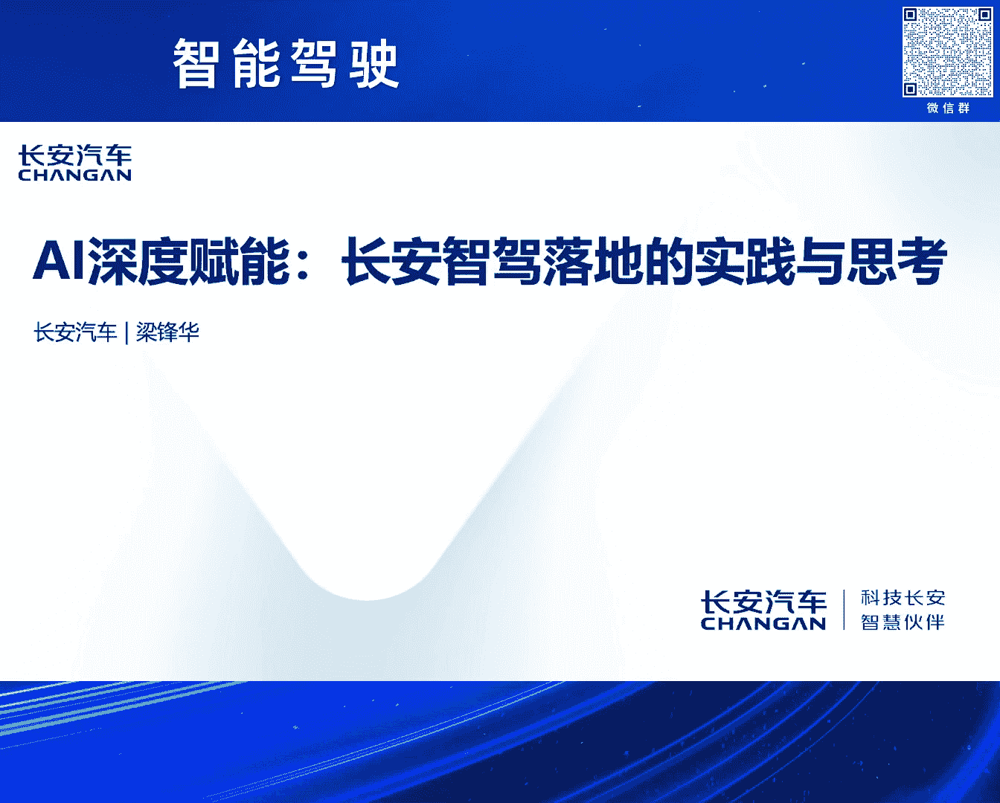
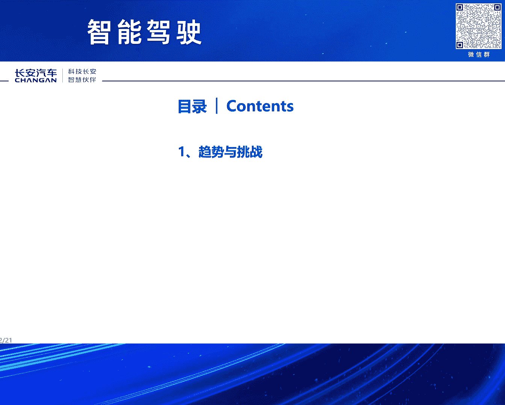

# 2024北京智源大会-智能驾驶 - P2：AI深度赋能：长安智驾落地的实践与思考：梁锋华 - 智源社区 - BV1Ww4m1a7gr

尊敬的黄院长，法务主任，各位领导，各位嘉宾，那么首先感谢座委会给我们这样的一个机会，那么让我们把这个处于制假应该是最前线的这样的一些实践的这个情况，思考和实践的情况来给大家进行一个报告。

总共主要就是我分享的就两个部分，一个是这个趋势和挑战，这里面也同时会有应该说很多的这个我们在实践过程中的一些思考，另外一个就是我们也报告一下那么长安汽车那么在这方面的这个实际的这个进展情况。

那么总体上我们认为这个制假整体上它还是一个场景的一个持续的演进，同时这个这个它是实际上还是从两个维度来持续的展开，那么一个维度那么就是场景的持续的覆盖，另外一个维度应该是这个等级。

就是说这个从这个功能的可用到体验的好用以及等级的提升，那么这样的一个这样的一个三个体验的展开。这样的一个三个大的一个步骤，那么持续的来进行这个提升。当然这个场景的覆盖的话，从目前整个行业来看。

基本上就是从简单的场景到复杂的场景，那么从这个从这个大家这个高频使用的场景，那么到这个非高频的场景，那么这样的一个持续的这个覆盖的过程啊，不过尤其是从单车道到高速，那么到程序到停车场到程序等等。好。

同时这个行业呢，现在当前的应该说这个从场景覆盖的角度来讲，应该说这个大家逐步的应该说场景的覆盖的这个阶段应该已经到了后期，尤其是以这个程序领航作为代表。

当前的更多的应该是进入一个精耕细作的这样的一个阶段啊，那么这个精耕细作那么主要还是围绕着两个大的方面，那么一个方面就是这个体验。持续的提升。

那么让用户不断的建立这个对这个对这个整个这个自驾系统的他的信心感，包括这个也在不断的提升，那么用户他的一些购买的意愿，另外一个方面，那么不断的提升安全性，因为这个安全毫无疑问。

那么是自驾最关键的这个这个基础，因为这个安全其实这个里面它有很多方面的这个这个安全。同时这个随着这些问题持续的解决，那么这个我相信最终那么会实现这个等级的这个提升。

而且等级那么他也会最终也会走向规模化的这个覆盖，当然当前应该说我们处于一个这个这个等级将来把这个高等级的这个，尤其是二二三级以上，那么进行这个商业化的应该是已经进入了进入了这个这样的一个前夜，因为这个。

典型的代表就是我们的目前的这个有工信部和各个部委主导的这样的一个智能网链的这个准入的试点。同时这个从实际的用户需求来看，因为这里面这个用户需求实际上很多也来自于一些这个既有行业报告。

那么也有这个实际的一些实际的一些数据的统计等等，那么现在。第一个就是渗透率总体还是在快速提升的，那么这个渗透率从两个维度，一个是这个用户的基数在快速的这个扩展，因为有些像二二二等等。

因为现在我们逐步都已经把二二二已经要作为这个标配，另外一个就是用户的他的实际的使用的这个时长越活等等，那么也都在快速的这个提升，那么从从这个我们。过去几年监测的情况来看。

基本上从二零大致从二零二一年到现在，基本上就是单用户的这个平均越活基本上应该是呃我们目前已经翻了一倍啊，尤其像二零二一年的时候可能像基础的二二二，那么很多可能越活也就是可能30%左右。

那么现在实际来看很多已经达到了60%以上，同时这个对于这个这个对于一个车企来讲，那么实际上从用户的这个。总的这个使用时长的这个视角来看，对这个应该是更是一个数量级的这个变化，可能从二一年到现在。

可能作为一个车企所拥有的用户总量，基于这个基盘来看，可能这个估计应该是已经上涨了至少四倍五倍啊，有些可能七八倍啊，这样的一个这样的一个状态。

实际上这样的话就是对对智能驾驶的它的安全和体验应该说提出了更高的要求，同时这个。其实作为作为整车厂应该说在这个这个智能驾驶开发的过程中，应该说还是一个也是一个百感交集的过程啊，这个这个既有既有这个呃。

这个充满希望啊，那么这个同时也有这个呃，战战兢兢啊，因为这个这么大的用户体量，而且智能驾驶那么用户在使用过程中，它是一个持续作用的过程，很多问题的发生可能就是一瞬间的这个。这个这个这个一瞬间的事情。

所以这个非常这个是对我们来讲，一直也是一直非常这个这个如履薄冰的这样的一个过程啊。同时智能驾驶，那么在技术这个方面也存在非常多的挑战，尤其是我们当前的支架，那么还是以这个经典支架，这个作为主体的路线啊。

当前几乎所有的这个这个投产的，包括有很多号称是，但实际上这个可能不一定，所以这个这个里面这个。这个包括这个呃，尤其像模模型的这个泛化能力等等，包括这个pnc的传统pnc的这个维护的难度等等。

因为这个很多case都是要一个一个去解，对吧，那包括这个啊，建图的成本啊，包括自驾本身它的体验的这个擬人化程度等等，还包括还有数据啊，数据的这个成本，采集的成本，这个标注的生产的成本等等，包括部署啊。

包括整体的这个。研发效率等等，还有非常多的问题，那么需要需要这个在后面的这个持续的提升过程中，那么这个快速的解决，但这里面有很多也是需要行业，那么共同努力来解决一些一些问题，可能效率会效率会更高。

另外就是刚才也点到这个数据的问题，实际上数据现在这个应该说是整个行业应该还是非常还是非常大的这个痛点啊，其实这个数据，包括这个生产的效率低，包括重复的采集，重复的这个标注啊等等，实际上数据。

我们一直讲数据也是资产，但是这个数据实际上当前它没有还没有至少从我们所看到的情况，它实际上并没有成为资产。为什么？第一个就是他没法，很多时候它这个就是没有很好的流动，为什么没有很好的流动？

是因为标准不同意，那么标准不同意的导致可能各家数据之间它是很难去附庸的，那不能附庸的，就大家就无法流动，无法流动就成就成成为不了这个资产。实际上这个是我觉得是个是个是个挺大的一个问题。

这个这一块的话确实是需要一方面是希望能够不断地建立健全完善那么数据相关的一些一些法规，另外就是标准采集方法等等，这个也希望统一。

同时这里面也希望这个这个国家的数据平台能够在这个方面也能够发挥更大的这个作用，因为这个尤其数据这个很多时候可能在前期的时候可能这个数据有效性啊，那么他数据所采集的数据量那么对应的这个性能会快速提升。

但是到了到了这个常委阶段，那么这个时候这个仅仅靠一家或者是各自去做，实际上代价代价应该是巨大，甚至是无力动，所以我们认为这个在这个时候可能国家平台在这个能够发挥这个更大的作用。

那么对整个行业应该是会会有巨大的这个帮助。巨大的帮助，同时包括涂，这个方面，涂这块我们也认为应该还是要建立涂商和整车厂的新的协同模式，因为传统的涂这块，如果还是继续采用传统的这种模式。

实际上效率是非常低的，不管是从鲜度，包括它整个涂的成本等等，应该是都是非常高的，那么本来整车厂，那么它是有贴人的，那么尤其随着质价的那么持续的铺开，那么它是有贴人的这个数据的基础。

那我为什么不能把它很好的把这个价值发挥出来，对吧，同时在成本这个方面，其实成本主要还是那三个大的方面，但是结构在不停的变化，实际上就是说算力，就是数据算力人力，但人力实际上就是对应的算法，这三个方面。

那么这个三个方面，只不过是这个三个方面的结构在不停的变化，那么我们从目前来看，毫无疑问，那么人力的成本，实际上在这个比例里面是在不断的下降的，但是这个算力数据，那么是在持续的扩大，那么在这样的情况下。

实际上确实还是需要，那么包括政府，包括行业能够推动，包括不管是数据算力平台的贡献等等，包括还有就是目前算力本身的硬件成本，当前也是在，尤其在中国市场上，它还是偏高的，那么也确实是需要在这个方面。

尤其专用的芯片等等这个方面，那么也能够进行攻坚，同时也需要在这个算法，我们认为确实这个算法，它还有巨大的持续的迭代的空间，因为当前其实行业里面很多大佬也在讲，那么你把当前的人工智能的算法。

和人本身的相比，那么它的效率不知道低多少，那么我们认为将来的算法这个方面，还有巨大的提升的空间，需要行业，包括尤其像不管什么高校学术机构等等，那么能够加快这个方面，一起能够加快这方面的研究。

好 下一位报告一下，那么长安在智能驾驶这个方面的，整体的进展情况，那么长安汽车，那么毫无疑问，那么它是新制生产力的排度兵，那么长安汽车，那么从2017年，我们开始了第三次的创业，我们叫创新创业计划。

那么这个创新创业计划我们在内部，那么随着行业和整个市场的持续的发展，我们也在不断的迭代，那么到目前为止，我们已经迭代到了7。0，这个同时整个创新创业计划，那么有三个大的战略，那么主要围绕着。

比如说香格里拉的那么新能源战略，那么北斗天数的智能化的战略，和海纳百川的全球化的战略，这个都是作为公司的三大核心战略，那么最终会构建新汽车和新生态。

那么在里程碑节点这个方面，那么现在当然加上最新的，那么我们进入长安汽车，那么进入首批的23级智能网联汽车试点，那么这个是应该说是第17个吧，那么同时我们也牵头制定了，汽车驾驶自动化的分级的国家标准。

那么这个是在21年进行了发布，当然这个分级的标准，我相信因为作为第一版，那么后续应该还要后续，那么随着我们要把真正的R23，真正要落地，那么要变成市场化和商品化的，这样的一个产品。

那么这里面还有非常多的这样的一些标准，那么具体的操作层面的标准，可以量化的这样的一个标准，那么也是需要持续的来进行完善，同时在这个制驾的字眼这个方面，那么长安汽车实际上现在已经。

已经进行了四代的这个平台的，这个制驾平台的这个字眼，因为这个我觉得前段时间，刚发布这个长安汽车，进入这个R23这个诊入试点的时候，突然发现行业里面很多人说，哎他们用的这个不是字眼的等等。

我再给大家再进一步的这个澄清一下，这个的确那么是由长安这个自主这个研发，这个完成，当然同时是也同时和这个行业的合作伙伴，那么也进行了这个大量的这个协同，这个目前我们的这个字眼，那么已经进行了这个四代。

那么最早就是2018年，那么那一代那么是更多的是以这个，I2级的这个辅助驾驶那么为主，那么这个是典型的就是集成式的自行巡航，和这个遥控代客拨车，因为这个在2018年那个时代，我们是中国品牌。

这两个都是中国品牌首发的，同时在2020年的时候，那么我们也进一步的这个量产了，我们内部叫NID1。0，实际上就围绕着高速公路辅助的，这样的一个系统，还有那个远程智能拨车的这个系统，那么这个我们也是。

这个尤其是远程智能拨车，也是取得了这个首发，这个是应该说应该说还是应该是全球首发，到目前为止仍然是长安汽车仍然是唯一的，那么具备这个，这个真正在这个产品这个方面进行这个量产的这个企业。

另外就是在2022年，那么我们进一步的有量产了高速领航，这个和这个远程的这个代客拨车系统，那么这个是同时，那么这个这一代系统，那么同时也是我们作为这次准入试点的这个系统，那么这个它本身是具备的。

具备R23的这个能力的，但这个同时我们在这个里面，不管是从架构的，从架构设计，那么包括这个各项的这个安全设计，那么都是严格按照R23的这个要求来进行，同时我们在这里面也是应该说也是这个创新性的使用了。

应该也是全球是吧，是创新性的使用了这个这个微碰的这样的一个这样的一个系统，那么这个是为什么这么说，就是为什么要做这个做这个准备，就是因为这个支架肯定是做不到，绝对的不碰撞的这样的一个可能的。

因为这个支架它毕竟它是一个物理，它是一个物理的实体，那么既然是物理的实体，它就有这个它就有惯性，那么它的刹车比如汽车最好的刹车，那么它百公里这个刹停，那么也需要30米的滑行的这个距离对吧。

所以这个这个这个，那么我们做支架，那么一定是要围绕着这个最极限的这个工况，来做来做这个准备，同时这个这个同时我们也研发了这个也正在研发这个，我们内部叫做高阶的高阶的这个支架的平台。

那么这个核心就是最终把这个城市领航这些全部都解决掉，这个会在今年那么实现这个量产，同时这个在这个字眼这个方面，其实我们的整个从每一代这个它的这个字眼，那么在这个在整个系统里面。

这个战斗力实际上是在持续的提升的，那么到目前为止，从这个尤其从第三代，那么应该说核心的算法，那么是全部由长安来开发完成的，从系统的设计到核心算法，那么全部都是由长安设计完成，当然这个硬件啊等等。

那么这个很多是会和行业那么来进行合作，那么做好这个支架，那么有个非常关键的这个基础，因为支架它它仍然是一个整车的支架，它是无法单独存在的，那么这个支架那么要要获得比较好的作用。

那么它一定是在一个好的整车的这个架构基础上，那么我们是打造了这个，我们是基于未来的智能机器人的这样的一个，这样的一个终极的思考，那么我们打造了六层的这个架构平台，那么这个六层的这个架构的平台。

那么实际上很多时候也是对应跟人一样，那么对应人的这个运动，人的这个手脚运动系统，对应人的这个比如神经的传输系统，包括这个通讯啊等等对吧，对应人的小脑大脑等等，那么总体上就是从R1那么对应是机械层。

那么R2那么更多的是能源动力层，那么R3那么是一架构R4一架构和硬件，那么R4那么就是操作系统，那么R5的话那么更多的是这个应用，包括算法应用等等都在R5，那么R6那么就实际上是云端和大数据。

这是我们的整体的这个架构最新的架构，这个实际上在我们新汽车都已经都已经应用，而且即将量产，同时在支架算法这个方面，那么应该说我们现在已经掌握了这个经典支架。

那么所需要的这些所有的这样的一些核心的算法能力，同时也正在跨越式的构建新一代的这个支架的这个算法，那么同时这个新一代的支架算法，那么毫无疑问那么就是以端到端支架，那么作为核心的特征。

但是但这个端到端的这个支架，其实大家应该说也还是有共识啊，总体上就是上限可能大家认为可以无限的想象，但是下限有的时候可能也无法想象啊，所以说这个，我们认为可能在很长我们所能够看到见的这样的一个时期内。

可能这个经典的支架和端到端的支架，两个仍然会是一个并存的关系，那么经典的支架那么后面的作用它就越来越集中在，那么解决这个下限问题的这样的一个关键的这个角色，同时这个关于这个算法这个方面啊。

因为这里面还是需要用两个例子来特别，也可以叫证明吧，就是说我们确实是具备这方面的这个算法能力啊，这里面有两个，一个是之前U-Sense的这个达榜，那么长安也是得过这个达榜的这个第一。

这个是之前这个是有明确的这个成绩记录啊，另外一个方面就是也是最近，那么在这个端木动脉态的端到端大模型这个方面，我们也获得了这个计算机视觉与模式识别，那么CVPR的这个这个2024的这个赛道创新奖。

这个是应该也是这个会议的这个最高奖，这个所以这个也从这点上也是希望，那么大家对于这个这个这个所谓的这个传统转场的这个实验，在算法这个方面的这个印象能够有一定的转变啊。

实际上确实这个方面我们的宣传还是做的也还是不太够，同时在数据闭环这个方面，我们也建立了这个这个比较相对比较完备的这个数据闭环的这个体系，来持续的解决数据的生产训练，包括采集生产训练等等各个环节的问题。

那么持续的解决这些常委的这个场景的难题，那么同时也不也在不断的提升整个这个数据闭环的这个自动化的这个效率，这里面就包括在这个这个这个这个一些比如数据挖掘的工具的研发呀。

包括我们的整个这个4D BEV的这个数据自动化的产线，包括我们的整个这个规模化的持续BEV的这个动作性的增值，这个方面的这个自动化效率，那么这块它是提升提升了95%，但这个是一个持续提升的过程。

那么随着端到端，那么也会有对整个这个数据产线会有新的这个要求，这个也要持续的进步，另外一个就是关于这个这个新的测试体系这个方面，其实这个新的测试体系一方面就是来确保这个。

当然首先核心还是来确保这个我们整个这个系统的这个安全可靠，和它的足够的这个场景的这个适应能力，那么同时那么这个围绕着我们最近那么即将开展的这个试点的这个工作，那么它毫无疑问是试点工作非常关键的这个保障。

那么这里面核心的这里面包括多支柱的这个多支柱系统的这个测试策略，还有系统性能安全的这个模型，同时最终是实现功能和性能测试内容的这个百分之百，那么尤其是当这个长安汽车进行这个支架的这个测试。

有一个的确有一个天然的优势啊，这个实际上也是我们这个很多时候效率啊，这个测试的效率为什么特别高，确实跟重庆的这种8D的这个复杂的这样的一个城市的这个交通环境，有巨大的这个关系啊。

可能可能在很多其他城市你出去可能跑得跑个十几公里，几十公里才能才遇到的场景，可能我们出去可能几公里就可以可以可以碰得到，这个也是给我们提供了一个天然的这个天然的这样的一个高效的这个测试基地。

那当然我们也建立了完整的这个测试的这个体系，同时这里面也引入了R157的这个驾驶员的这个模型，那么来来进行自动驾驶的最终的这个性能安全的这个评估，那么这个当这个这个模型呢。

那么基于不同的场景那么不同的等级，那么它最终那么它的验收的这个标准应该是有不同的这个指数，同时也在构建这个新的安全体系，那么这个安全毫无疑问是自驾这个稳健落地的这个最关键的这个底座。

那么总体上那么还是希望这个通过这个新的安全体系能够实现全车和全生命周期的这种管理的这种半生的这个安全，包括复杂人机偶合系统的这个业务安全，这个安全就是说自驾的安全不是不仅仅包含自驾系统本身的安全。

那么它更它同时是一个整车的这个安全，而且不仅仅是这个电子系统的安全，它从电子系统和软件系统的安全，它同时也是一个整车的这个结构安全，那么它是这个是一个完整的一个一体化的这样的一个这样的一个体系。

包括这个包括比如碰撞实际上这个，这里面就是为什么整车厂那么做自驾，可能在安全兜里这个方面可以做得更好，因为其实我们在在做很多的这个在评估很多安全风险的时候。

那么他都是要把这个碰撞安全和这个自驾本身的这个安全两个都要结合起来来评估，包括比如说我们有的时候这个测试一些这个有些极端场景，那么那么我们也要来看，那么他他实际假设那么他最终发生碰撞之后。

那么他实际的这个的伤害到底是一个什么样的一个什么样的一个状况，那么对应的我们要采取足够的这个这个这个措施来保障，当然这里面就是这个也是有对应的这个一系列的这个体系。

包括我们最早获得了针对自动驾驶的这个A-SBAS的这个体系的这个认证，包括这个功能安全ACD级的针对自动驾驶的这个功能安全的认证，包括还有预期功能安全，包括这个网络安全等等。

那么都有对应的这个应该说很多，这么大部分应该都是应该是在国内应该是最早拿到的这样的一些认证啊，包括这个评价体验的这个评价体系这个方面，因为自驾的核心那么最终是还是要安全高效舒适和累赘。

因为这个这个自驾这个它是汽车的这个自驾，那么这个而且是人乘载人在车内的这样的一个，它不是一个不能用传统的机器人的视角来看汽车的这个这个这个自驾，所以它一定是要整个这个这个自驾系统的驾驶习惯。

一定是要跟人的这个习惯，那么要很好的这个贴合起来，那么这样的话，或者是应该说比人要更安全，同时比人要更开的要要更好，那么才能获得这个用户的这个信任。

可能我们如果长期使用自驾的这个大家都会有都会很有感触的，因为有的时候可能一个就是有的时候可能就几秒的，他觉得你觉得他开的不像你，那么你可能对他的这个信任感都会打非常大的折扣。

但这个这些这个评价体系既是一套指标，那么我们也会把它这个这个指标会把它客观化，同时也会把它逐步的工具化和自动化，可能这个自驾系统自己出去开一圈，基本上同自己也会把把这个分数打出来。

总体上那么自驾它仍然是一个超级巨大的超级长超级宽的这样的一个系统工程，那么需要行业这个各个方面，那么进行深度的这个合作，那么长期车始终坚持开放互信共赢的理念。

那么积极的和全球的合作方案开展多多领域的深度合作，我们这里面其实提出了提出了很多的这个合伙产品合伙技术合伙前沿合伙共产的，这些其实都不是概念啊，其实我们每个方面都有足够多的这个案例在进行落地啊。

包括很多这个可能大家原来想象的很难想象的这个这个可能大家是不是有一些可能直接进行互相合作，全白盒的进行这个联合开发等等，那么这些实际上都在都在进行，包括数据在数据方面。

我们现在时间还在跟我们有些合作伙伴，那么就是也是全部打开，那么这个大家一起统一标准，那么一起这个进行这个数据的采标等等，那么这样的工作，实际上这样的话就是可能大家成本获得同样的效果，但成本减半。

那么和这个这样的话，我现在我相信这样的话才能更快的，那么一起来推动整个行业的这个发展，好以上是我分享的主要内容，好谢谢大家，谢谢，(掌声)。

